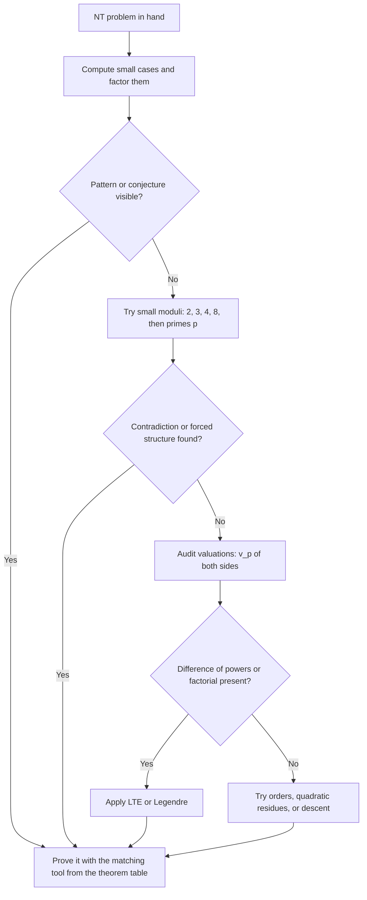

# Olympiad Number Theory

## Overview

Number theory is the olympiad area closest to the interview world: divisibility, residues, orders, and valuations form a compact toolkit that solves an outsized share of contest openers and interview puzzles alike. This page builds that toolkit proof-first — every theorem comes with its statement, its standard use, and the shape of its proof — and then works three classics in full, including IMO 1959 Problem 1. The engineering counterpart of this material (fast exponentiation, sieves, modular inverses as runnable code) lives in [Number Theory for Programming](../mathematics/number-theory.md); that page computes, this page proves, and the two are complementary rather than overlapping.

The unifying habit of olympiad NT is reduction: an equation or a claim about infinitely many integers is reduced modulo a well-chosen number until it becomes either impossible, forced, or recursive. Choosing the modulus is the craft, and the strategy section at the end turns the choice into an explicit procedure. Every technique below is graded by one standard — can you write the full argument, with no load-bearing step asserted — because that is the standard a contest grader and a whiteboard interviewer both apply.

## Divisibility and Euclid's Algorithm

### The Divisibility Language

Everything starts from the definition: \\( a \\mid b \\) means \\( b = ak \\) for some integer \\( k \\), and the definition's immediate consequences do most of the work in practice. Divisibility is transitive (\\( a \\mid b \\) and \\( b \\mid c \\) force \\( a \\mid c \\)), closed under sums when the divisor is shared (\\( a \\mid x \\) and \\( a \\mid y \\) give \\( a \\mid x + y \\)), and closed under integer linear combinations — the last fact is the engine of nearly every gcd argument in existence. A useful reframing for beginners: \\( a \\mid b \\) is equivalent to \\( b \\equiv 0 \\pmod a \\), so every divisibility statement is secretly a congruence statement and every congruence tool applies.

The linear-combination closure deserves one careful sentence of proof, since it is used constantly: if \\( a \\mid x \\) and \\( a \\mid y \\), write \\( x = ar \\), \\( y = as \\); then any combination \\( mx + ny = a(mr + ns) \\) is a multiple of \\( a \\). From it flows the classic trick demonstrated in the worked classics below — combine the two expressions in a problem with integer coefficients chosen to cancel the variable and leave a constant. When a problem says "prove \\( d = 1 \\)" or "find all \\( n \\) such that both expressions divide each other", the first reflex should be: what linear combination of the given quantities is simple?

### Euclid's Algorithm and Bézout

Euclid's algorithm computes \\( \\gcd(a, b) \\) via \\( \\gcd(a, b) = \\gcd(b, a \\bmod b) \\), terminating because the second argument strictly decreases. Its correctness proof is the first induction most olympiad students meet: any common divisor of \\( a \\) and \\( b \\) also divides \\( a - qb \\), and conversely, so the two pairs have identical common divisors — hence identical gcds. Beyond computation, the algorithm yields Bézout's identity: \\( \\gcd(a, b) = ax + by \\) for some integers \\( x, y \\), provable by unrolling Euclid or by taking the minimal positive element of the set \\( \\{ax + by\\} \\) and showing it divides both inputs. Bézout is the precise statement behind the linear-combination closure above: the integer combinations of \\( a \\) and \\( b \\) are exactly the multiples of \\( \\gcd(a, b) \\).

Two consequences matter more than the algorithm itself for contest work. First, \\( \\gcd(a, b) = 1 \\) (coprimality) is equivalent to the existence of \\( x, y \\) with \\( ax + by = 1 \\), which converts coprimality hypotheses into an algebraic handle. Second, Euclid's lemma generalizes: if \\( a \\mid bc \\) and \\( \\gcd(a, b) = 1 \\), then \\( a \\mid c \\) — multiply \\( ax + by = 1 \\) through by \\( c \\) and watch \\( a \\) divide every term. This lemma is why coprime factorizations behave like prime factorizations, and it is the standard first move when a problem hands you a product divisible by something coprime to one factor.

### Coprimality as a Design Tool

Olympiad problems rarely hand you coprimality; they make you create it. The standard moves: divide out the gcd and rename; split a modulus into coprime prime powers so CRT applies; or choose parameters (a base, a step, a box size) to be coprime from the start, as the Frobenius classic below does. When a solution stalls, audit the coprimality assumptions first — most stalled NT arguments are missing one. The interview cousin is the same audit: coin denominations, gear teeth, cycle lengths, and period overlaps all hide gcd conditions, and the coprime case is almost always the one with a clean answer.

## Modular Arithmetic and the CRT

### Residue Classes

Working modulo \\( m \\) partitions the integers into \\( m \\) residue classes, and arithmetic on classes inherits addition and multiplication from the integers — the quotient ring structure that makes modular arguments legitimate rather than heuristic. The practical grammar: congruences can be added, subtracted, and multiplied freely; you may divide by \\( a \\) only when \\( \\gcd(a, m) = 1 \\), and forgetting this restriction manufactures more false solutions than any other single error in olympiad NT. For example \\( 2x \\equiv 2 \\pmod 4 \\) does **not** imply \\( x \\equiv 1 \\pmod 4 \\) — the solutions are \\( x \\equiv 1 \\pmod 2 \\). The fix is systematic: before dividing, check the gcd of what you are dividing by with the modulus, and split cases when they are not coprime.

Negative residues and reductions are tactical tools worth automating mentally: \\( 3 \\equiv -1 \\pmod 4 \\) turns \\( 3^{1000} \\) into \\( (-1)^{1000} \\) instantly, and reducing bases before powering is the whole content of the engineering fast-pow algorithm. The worked classic below combines these habits with CRT to extract the last two digits of \\( 3^{1000} \\). Note what modular arithmetic buys: a statement about a 250-digit number becomes a computation on two small residues.

### The Chinese Remainder Theorem

**Theorem (CRT).** If \\( \\gcd(m_1, m_2) = 1 \\), then for any residues \\( a_1, a_2 \\) the system \\( x \\equiv a_1 \\pmod {m_1} \\), \\( x \\equiv a_2 \\pmod {m_2} \\) has exactly one solution modulo \\( m_1 m_2 \\). The proof is the interesting part for olympiad use: surjectivity follows from Bézout — write \\( 1 = m_1 u + m_2 v \\), then \\( x = a_1 m_2 v + a_2 m_1 u \\) satisfies both congruences, and injectivity follows because two solutions differ by a multiple of both moduli, hence of their product. The CRT converts one hard modular question into two easy ones, and the general n-moduli version follows by induction since coprimality is preserved pairwise across coprime prime-power splits.

Worked example. Solve \\( x \\equiv 2 \\pmod 3 \\) and \\( x \\equiv 3 \\pmod 5 \\). Write \\( x = 2 + 3k \\); substituting into the second congruence gives \\( 2 + 3k \\equiv 3 \\pmod 5 \\), so \\( 3k \\equiv 1 \\pmod 5 \\). Since \\( 3 \\cdot 2 = 6 \\equiv 1 \\pmod 5 \\), the inverse of 3 modulo 5 is 2, giving \\( k \\equiv 2 \\pmod 5 \\) and \\( x \\equiv 2 + 6 = 8 \\pmod{15} \\). Check: \\( 8 = 3 \\cdot 2 + 2 \\) leaves remainder 2 modulo 3, and \\( 8 = 5 + 3 \\) leaves remainder 3 modulo 5. The full solution set is \\( x \\in \\{8, 23, 38, 53, ...\\} \\) — every integer congruent to 8 modulo 15, exactly as the uniqueness clause promises.

### What CRT Is For

Three uses dominate. First, decomposition: questions about \\( \\bmod 100 \\) become questions about \\( \\bmod 4 \\) and \\( \\bmod 25 \\), where Euler's theorem and small-order computations apply. Second, construction: existence proofs often build an object satisfying several congruence constraints at once, and CRT guarantees the constraints are compatible. Third, impossibility: a system of congruences with non-coprime moduli and inconsistent residues has no solution, which converts "prove no integer satisfies..." into a two-line gcd check. The worked classic \\( 3^{1000} \\bmod 100 \\) exercises the first use, and the strategy section returns to the third.

## Fermat's Little Theorem and Euler's Theorem

**Theorem (Fermat's little theorem).** If \\( p \\) is prime and \\( p \\nmid a \\), then \\( a^{p-1} \\equiv 1 \\pmod p \\). Equivalently, \\( a^p \\equiv a \\pmod p \\) for all integers \\( a \\), with no coprimality hypothesis needed.

**Theorem (Euler).** If \\( \\gcd(a, n) = 1 \\), then \\( a^{\\varphi(n)} \\equiv 1 \\pmod n \\), where \\( \\varphi(n) \\) counts integers in \\( [1, n] \\) coprime to \\( n \\). Fermat is the special case \\( n = p \\) prime, \\( \\varphi(p) = p - 1 \\).

The typical use is exponent collapse: a huge power reduces to a small one because the exponent is taken modulo the order of the base. For instance, \\( 2^{100} \\bmod 13 \\): since \\( \\varphi(13) = 12 \\) and \\( \\gcd(2, 13) = 1 \\), \\( 2^{100} = 2^{8 \\cdot 12 + 4} \\equiv 2^4 = 16 \\equiv 3 \\pmod{13} \\). The same mechanism powers RSA-style computations on the engineering side and last-digit questions on the puzzle side; \\( 3^{1000} \\bmod 100 \\) in the worked classics below is exactly this theorem pointed at a two-digit answer. A caution that graders enforce: Euler requires the coprimality hypothesis, and applying it blindly when \\( \\gcd(a, n) > 1 \\) is a classic broken solution — split the common factors and handle their valuation separately instead.

The proof of Fermat is itself a technique worth owning: multiplication by \\( a \\) permutes the nonzero residues modulo \\( p \\), so \\( a^{p-1} \\cdot (p-1)! \\equiv (p-1)! \\), and cancelling \\( (p-1)! \\) (legal since \\( p \\nmid (p-1)! \\)) gives the theorem. The permutation trick — prove an algebraic identity by matching up sets — reappears across combinatorics and is worth recognizing on sight. Euler's proof is the same argument restricted to the reduced residue system: multiplication by \\( a \\) permutes the \\( \\varphi(n) \\) classes coprime to \\( n \\), and cancellation finishes.

## Multiplicative Order and Primitive Roots

**Definition.** For \\( \\gcd(a, n) = 1 \\), the multiplicative order \\( \\mathrm{ord}_n(a) \\) is the smallest positive \\( k \\) with \\( a^k \\equiv 1 \\pmod n \\). The fundamental facts: \\( \\mathrm{ord}_n(a) \\) divides \\( \\varphi(n) \\), and \\( a^k \\equiv 1 \\pmod n \\) **if and only if** \\( \\mathrm{ord}_n(a) \\mid k \\) — the division test that converts order questions into divisibility questions.

Worked example modulo 7. Powers of 3: \\( 3^1 = 3 \\), \\( 3^2 = 9 \\equiv 2 \\), \\( 3^3 \\equiv 6 \\), \\( 3^4 \\equiv 4 \\), \\( 3^5 \\equiv 5 \\), \\( 3^6 \\equiv 1 \\pmod 7 \\) — six distinct values before hitting 1, so \\( \\mathrm{ord}_7(3) = 6 = \\varphi(7) \\), and 3 is a **primitive root** modulo 7: its powers enumerate every nonzero residue. Contrast 2: \\( 2, 4, 1 \\) gives \\( \\mathrm{ord}_7(2) = 3 \\), so powers of 2 cycle through only a third of the residues. A prime modulus always possesses primitive roots (Gauss), though finding one is trial and error; composite moduli possess them only for 2, 4, odd prime powers, and twice those.

Why orders matter strategically: they detect when an exponent can be cut. If a problem involves \\( a^N \\), compute (or bound) \\( \\mathrm{ord}_m(a) \\) and reduce \\( N \\) modulo it — often the exponent collapses from astronomically large to single digits, as in the \\( 3^{1000} \\) classic. Orders also power impossibility arguments: if \\( x^2 \\equiv a \\pmod p \\) had a solution, then \\( a^{\\mathrm{ord}_p(x)} \\equiv 1 \\) constrains the order of \\( a \\) to be odd-compatible, which is the mechanism behind Euler's criterion in the next section. Whenever a solution says "the sequence is periodic with period T", the formal content is an order statement, and proving periodicity means proving \\( a^T \\equiv 1 \\) with \\( T \\) minimal.

## p-adic Valuations and Lifting the Exponent

### Valuations and Legendre's Formula

The \\( p \\)-adic valuation \\( v_p(n) \\) is the exponent of prime \\( p \\) in \\( n \\) — the largest \\( k \\) with \\( p^k \\mid n \\). Valuations turn multiplicative questions into additive bookkeeping: \\( v_p(ab) = v_p(a) + v_p(b) \\) always, \\( v_p(a + b) \\ge \\min(v_p(a), v_p(b)) \\) always, and equality holds in the latter whenever the two valuations differ — the "lifting" fact behind many a contradiction. A standard elimination pattern: if \\( v_p \\) of the left side of an equation is large and of the right side is small, the equation is impossible; computing one clever valuation often kills a case that case analysis cannot dent.

For factorials, **Legendre's formula** counts: \\[ v_p(n!) = \\sum_{i \\ge 1} \\left\\lfloor \\frac{n}{p^i} \\right\\rfloor \\] — each multiple of \\( p \\) contributes one factor, each multiple of \\( p^2 \\) another, and so on. Worked application: the highest power of 3 dividing \\( 100! \\) is \\[ v_3(100!) = \\left\\lfloor \\frac{100}{3} \\right\\rfloor + \\left\\lfloor \\frac{100}{9} \\right\\rfloor + \\left\\lfloor \\frac{100}{27} \\right\\rfloor + \\left\\lfloor \\frac{100}{81} \\right\\rfloor = 33 + 11 + 3 + 1 = 48. \\] The same computation answers the interview-standard question "how many trailing zeros does 100! have" — \\( v_5(100!) = 20 + 4 = 24 \\), and since twos are plentiful, 24 trailing zeros. The formula is the entire content: count multiples of each prime power and stop when the floor hits zero.

### The Lifting-the-Exponent Lemma

**Theorem (LTE, statement).** Let \\( p \\) be an odd prime with \\( p \\mid a - b \\) and \\( p \\nmid ab \\). Then for every positive integer \\( n \\), \\[ v_p(a^n - b^n) = v_p(a - b) + v_p(n). \\] For \\( p = 2 \\) with \\( n \\) even, \\( 2 \\mid a - b \\), \\( 2 \\nmid ab \\): \\[ v_2(a^n - b^n) = v_2(a - b) + v_2(a + b) + v_2(n) - 1. \\] (The \\( p = 2 \\), \\( n \\) odd case reduces to the odd-prime statement with \\( p = 2 \\).)

Instant demonstration of the two-prime case: \\( v_2(3^{100} - 1) = v_2(3 - 1) + v_2(3 + 1) + v_2(100) - 1 = 1 + 2 + 2 - 1 = 4 \\), so \\( 3^{100} - 1 \\) is divisible by 16 but not 32 — checkable directly since \\( 3^4 = 81 \\) is the first power of 3 congruent to 1 modulo 16 and the order of 3 modulo 32 is 8, which does not divide 100. LTE compresses what would otherwise be an induction into a lookup, and its typical habitat is any equation where a huge difference of powers appears: "find all \\( n \\) with \\( 7^n - 1 \\) divisible by \\( 49 \\)" becomes \\( v_7(7^n - 1) = v_7(6) + v_7(n) = v_7(n) \\ge 2 \\), i.e., \\( 7 \\mid n \\). That is the pattern: isolate the difference of powers, apply LTE, reduce the problem to a valuation condition on \\( n \\).

Treat LTE as a black box on first pass — the task here is statement and usage, with the proof (factoring \\( a^n - b^n \\) and tracking how \\( p \\) divides the cyclotomic-style factors) deferred to the references. What you must be able to do cold is verify the hypotheses before applying: odd \\( p \\) dividing \\( a - b \\), \\( p \\) dividing neither \\( a \\) nor \\( b \\). Hypothesis-checking is also the grader's first move, and an LTE application with an unverified hypothesis is the most common 0/7 on NT problems where the lemma is allowed.

## Quadratic Residues and Euler's Criterion

**Definition.** \\( a \\) is a quadratic residue mod \\( p \\) (odd prime, \\( p \\nmid a \\)) if \\( x^2 \\equiv a \\pmod p \\) has a solution; otherwise \\( a \\) is a non-residue.

**Theorem (Euler's criterion).** For an odd prime \\( p \\) with \\( p \\nmid a \\): if \\( a \\) is a quadratic residue modulo \\( p \\), then \\[ a^{\\frac{p-1}{2}} \\equiv 1 \\pmod p, \\] and if \\( a \\) is a non-residue, then \\[ a^{\\frac{p-1}{2}} \\equiv -1 \\pmod p. \\] In other words, one exponentiation decides residuosity: raise \\( a \\) to the power \\( (p-1)/2 \\), and the answer is \\( +1 \\) exactly when \\( a \\) is a square modulo \\( p \\).

Worked check modulo 7: the squares are \\( 1^2 = 1 \\), \\( 2^2 = 4 \\), \\( 3^2 = 9 \\equiv 2 \\), so the residues are exactly \\( \\{1, 2, 4\\} \\) — and indeed \\( 2^3 = 8 \\equiv 1 \\pmod 7 \\) (residue) while \\( 3^3 = 27 \\equiv 6 \\equiv -1 \\pmod 7 \\) (non-residue), exactly as the criterion demands. The proof idea is elegant and reusable: the map \\( x \\mapsto x^2 \\) on nonzero residues is two-to-one with image the residues, and \\( a^{(p-1)/2} \\) is a square root of \\( a^{p-1} \\equiv 1 \\), so it is \\( \\pm 1 \\), with the value forced by whether \\( a \\) sits in the image. Euler's criterion is the computable core of quadratic reciprocity — which tells you *a priori* whether \\( q \\) is a residue mod \\( p \\) — and reciprocity, stated in any serious NT reference, is the deepest tool on this page.

Where does this earn its keep? Any problem asking whether \\( x^2 + 1 \\) can divide something, whether \\( -1 \\) has a square root mod \\( p \\), or whether a Diophantine equation has solutions mod \\( p \\) — a "solution mod p must exist" obstruction kills integer solutions instantly. A worked pattern: if an integer \\( n \\) were of the form \\( x^2 + 2y^2 \\) with \\( n \\equiv 5 \\pmod 8 \\), reducing mod 8 shows squares are \\( \\{0, 1, 4\\} \\) and \\( 2y^2 \\in \\{0, 2\\} \\), so \\( x^2 + 2y^2 \\in \\{0, 1, 2, 3, 4, 6\\} \\) — never 5, contradiction. That is Euler's criterion's spirit applied with a tiny modulus: enumerate the squares, compare against the target, and let the mismatch be the proof.

## Sums of Two Squares

**Theorem (Fermat, two squares).** An odd prime \\( p \\) can be written \\( p = x^2 + y^2 \\) with \\( x, y \\in \\mathbb{Z} \\) if and only if \\( p \\equiv 1 \\pmod 4 \\). More generally, a positive integer \\( n \\) is a sum of two squares if and only if every prime \\( \\equiv 3 \\pmod 4 \\) appears in \\( n \\) to an even power.

Quick orientation on both directions with small numbers: \\( 5 = 1 + 4 \\), \\( 13 = 4 + 9 \\), \\( 17 = 1 + 16 \\) — all \\( \\equiv 1 \\pmod 4 \\), all representable; \\( 3, 7, 11 \\) are not representable as the theorem says. The composite test: \\( 45 = 3^2 \\cdot 5 \\) has its 3-mod-4 prime (3) to an even power, so it is representable — indeed \\( 45 = 36 + 9 = 6^2 + 3^2 \\); while \\( 21 = 3 \\cdot 7 \\) has both 3-mod-4 primes to odd powers, so it is not, and no amount of searching will find \\( x^2 + y^2 = 21 \\). The necessity direction is a two-squares-mod-4 argument (squares mod 4 are 0 or 1, so \\( x^2 + y^2 \\equiv 3 \\pmod 4 \\) is impossible and 3-mod-4 primes cannot divide a sum of two squares an odd number of times); sufficiency is Fermat's descent, which is exactly the next section's method deployed at full strength.

For interview purposes the theorem is less a tool than a story about structure: it says representability is a purely local, prime-by-prime property — no global information beyond the prime factorization matters. That "local-to-global" flavor recurs across number theory (and across CRT reasoning above), and recognizing it is what lets you answer the follow-up "does this generalize?" with something intelligent rather than a shrug. If asked in an interview whether a number is a sum of two squares, answer via the criterion and cite the descent proof as the hard direction; that two-sentence answer signals more depth than computing any specific representation.

## Infinite Descent

**The pattern.** To prove no positive-integer object has property P: assume a minimal object with P exists (minimal by size, sum, or valuation), then produce a strictly smaller object that also has P — contradicting minimality. Descent is induction run backwards, and it is Fermat's signature: he proved "no right triangle with integer sides has square area" and his four-squares result by descent, famously claiming a general method the margins were too narrow to hold.

Worked pattern-demo: \\( \\sqrt{2} \\) is irrational. Suppose \\( \\sqrt{2} = a/b \\) with \\( \\gcd(a, b) = 1 \\) and \\( b \\ge 1 \\) minimal; then \\( a^2 = 2b^2 \\) forces \\( a \\) even, write \\( a = 2k \\); substituting gives \\( 2k^2 = b^2 \\), forcing \\( b \\) even — contradicting \\( \\gcd(a, b) = 1 \\). The descent reading: from any solution (a, b) in lowest terms we manufactured a smaller solution (b, k) — so no smallest solution exists, hence no solution. The same skeleton proves \\( \\sqrt{3} \\), \\( \\sqrt[3]{2} \\), and the non-existence of integer solutions to \\( x^2 - 2y^2 = 0 \\), each time with the minimality choice doing the contradiction's work.

When to reach for descent: the problem is a "prove there is no ..." or "prove the only ... is trivial" statement, and a construction from any solution to a smaller one is visible. The trigger to look for is a divisibility or symmetry that lets you halve, factor, or re-express: evenness forcing halving, a prime dividing a product forcing it into a factor, or an equation symmetric under swapping with a smaller derived pair. Descent pairs naturally with the extremal principle from combinatorics — both are "minimal object + transformation + contradiction" — and the combinatorics page's minimal-counterexample technique is the same logical machine pointed at finite objects.

## The Theorem Table

The table compresses the toolkit into a triage card: statement sketch plus the signature situation that should trigger the tool. Cover the middle column and quiz yourself until each row is reflexive.

| Tool | Statement sketch | Signature usage trigger |
|---|---|---|
| Bézout / Euclid | \\( \\gcd(a,b) = ax + by \\); combinations of a, b hit exactly the multiples of the gcd | "prove d divides..." — combine expressions to cancel variables |
| CRT | Coprime moduli: one solution mod the product for any residue pair | Last digits mod 100; incompatible congruence systems |
| Fermat little | \\( a^{p-1} \\equiv 1 \\pmod p \\) for \\( p \\nmid a \\) | Huge exponent modulo a prime |
| Euler | \\( a^{\\varphi(n)} \\equiv 1 \\pmod n \\) for coprime a, n | Exponent collapse with composite modulus |
| Order / primitive root | \\( a^k \\equiv 1 \\iff \\mathrm{ord} \\mid k \\); primitive root has order \\( \\varphi(n) \\) | Periodicity claims; exponent reduction |
| Legendre | \\( v_p(n!) = \\sum \\lfloor n/p^i \\rfloor \\) | Trailing zeros; largest prime power in a factorial |
| LTE | \\( v_p(a^n - b^n) = v_p(a-b) + v_p(n) \\) | Divisibility of a difference of powers |
| Euler criterion | \\( a^{(p-1)/2} \\equiv \\pm 1 \\) decides quadratic residuosity | "does x² ≡ a (mod p) have a solution" |
| Fermat two squares | p = x² + y² iff p ≡ 1 (mod 4) | Representability as a sum of two squares |
| Infinite descent | Minimal solution implies smaller solution | "prove no positive integer solution exists" |

## Worked Classics

### Classic A — IMO 1959 Problem 1

**Problem.** Prove that the fraction \\( \\dfrac{21n + 4}{14n + 3} \\) is irreducible for every positive integer \\( n \\).

Write \\( A = 21n + 4 \\) and \\( B = 14n + 3 \\), and let \\( d = \\gcd(A, B) \\). Since \\( d \\mid A \\) and \\( d \\mid B \\), \\( d \\) divides every integer linear combination of them; choose the combination \\( 3B - 2A \\) because its coefficients kill \\( n \\): \\[ 3(14n + 3) - 2(21n + 4) = 42n + 9 - 42n - 8 = 1. \\] Hence \\( d \\mid 1 \\), and since \\( d \\ge 1 \\) by definition of gcd, \\( d = 1 \\). The fraction is in lowest terms for every positive integer \\( n \\), as claimed.

Three observations lift this from a cute trick to a transferable method. First, the coefficients 3 and 2 were found by eliminating \\( n \\): solve \\( 21x - 14y = 0 \\) minimally, i.e., \\( x : y = 2 : 3 \\), then adjust signs and constants — a two-second Euclidean step. Second, the argument never used that \\( n \\) is positive beyond ensuring the fraction is defined, which is the usual signature of a structural (rather than computational) proof. Third, this is the canonical interview-ready NT proof: at most four lines, one idea (kill the parameter), zero machinery. If asked "how do you show a fraction is irreducible" in any setting, this linear-combination reflex is the answer.

### Classic B — Last Two Digits of \\( 3^{1000} \\) via CRT

**Problem.** Find the last two decimal digits of \\( 3^{1000} \\), i.e., \\( 3^{1000} \\bmod 100 \\).

Since \\( 100 = 4 \\cdot 25 \\) with coprime factors, CRT applies. Modulo 4: \\( 3 \\equiv -1 \\), so \\[ 3^{1000} \\equiv (-1)^{1000} = 1 \\pmod 4. \\] Modulo 25: \\( \\gcd(3, 25) = 1 \\) and \\( \\varphi(25) = 20 \\), so Euler gives \\( 3^{20} \\equiv 1 \\pmod{25} \\), and \\( 1000 = 50 \\cdot 20 \\) yields \\[ 3^{1000} = \\left(3^{20}\\right)^{50} \\equiv 1 \\pmod{25}. \\] (The sharper fact is \\( \\mathrm{ord}_{25}(3) = 20 \\), since \\( 3^{10} = 59049 \\equiv -1 \\pmod{25} \\), but Euler suffices.)

Now assemble: the unique residue modulo 100 congruent to 1 modulo 4 and 1 modulo 25 is \\( 1 \\cdot 1 = 1 \\) — here CRT's solution is immediate because both congruences demand the same residue, so \\( x \\equiv 1 \\pmod{100} \\). The last two digits of \\( 3^{1000} \\) are **01**. Sanity check the method's power: \\( 3^{1000} \\) has about 478 digits, yet two congruences of one line each pin down its last two digits exactly; also verify consistency by spot-checking a small exponent, e.g., \\( 3^{20} = 3486784401 \\) indeed ends in 01.

### Classic C — The Frobenius Number (Chicken McNuggets)

**Problem.** Let \\( a, b \\) be coprime positive integers. Show that \\( ab - a - b \\) cannot be written as \\( ax + by \\) with \\( x, y \\ge 0 \\), but every integer larger than \\( ab - a - b \\) can. (For McNuggets of sizes 6 and 20 with the classic folklore pair (6, 9, 20) the answer is 43; the two-size theorem below is the general engine.)

**Part 1: \\( ab - a - b \\) is not representable.** Suppose \\( ab - a - b = ax + by \\) with \\( x, y \\ge 0 \\). Rearranging, \\( ab = a(x + 1) + b(y + 1) \\). Then \\( a \\mid b(y + 1) \\) and \\( \\gcd(a, b) = 1 \\), so Euclid's lemma gives \\( a \\mid y + 1 \\), i.e., \\( y + 1 \\ge a \\); symmetrically \\( x + 1 \\ge b \\). Therefore \\[ ab = a(x+1) + b(y+1) \\ge ab + ab = 2ab, \\] a contradiction. So no nonnegative representation exists.

**Part 2: everything above is representable.** Let \\( n > ab - a - b \\). Because \\( \\gcd(a, b) = 1 \\), the residues \\( 0, b, 2b, ..., (a-1)b \\) form a complete residue system mod \\( a \\); choose \\( y \\in \\{0, 1, ..., a - 1\\} \\) with \\( by \\equiv n \\pmod a \\), so \\( n - by = ax \\) for some integer \\( x \\). It remains to show \\( x \\ge 0 \\): since \\( y \\le a - 1 \\), \\[ n - by > (ab - a - b) - b(a - 1) = ab - a - b - ab + b = -a, \\] so \\( ax > -a \\), giving \\( x > -1 \\), i.e., \\( x \\ge 0 \\). Hence \\( n = ax + by \\) with both coefficients nonnegative.

The symmetric-shifting intuition behind why the threshold sits exactly at \\( ab - a - b \\): the map \\( n \\mapsto ab - a - b - n \\) pairs representable with non-representable numbers in the window \\( [0, ab - a - b] \\) — if both \\( n \\) and its mirror were representable, adding the representations would give \\( ab - a - b \\) representable, which Part 1 forbids; a count of representables in the window then shows the pairing is exact. Concretely for \\( (a, b) = (3, 5) \\): the Frobenius number is \\( 15 - 3 - 5 = 7 \\), and indeed \\( 1, 2, 4, 7 \\) are exactly the unmakeable amounts from 3s and 5s, while 8 onward all work (\\( 8 = 3 + 5 \\), \\( 9 = 3 \\cdot 3 \\), \\( 10 = 5 \\cdot 5 \\), \\( 11 = 2 \\cdot 3 + 5 \\)). The interview version — "with 3- and 5-cent stamps, what is the largest impossible postage?" — expects this answer plus the two-part proof sketch, and the counting follow-up ("how many impossible?") is \\( (a-1)(b-1)/2 = 4 \\) here, matching the list.

## Strategy: Choosing a Modulus and Getting Unstuck

The craft question in every NT problem is "mod what?". The decision flowchart encodes the attack order that experienced solvers run automatically; the paragraphs after it explain each branch's reasoning and its most common failure.

**Why small cases come first.** Factoring the first several values of any sequence or expression produces the raw material every later branch needs: the modulus that works is usually visible in the small factors, the conjecture is usually visible in the small pattern, and a false conjecture dies cheaply at n = 5 rather than expensively after a page of algebra. Skipping this step is the most common structural mistake in timed NT work. Budget five minutes of honest computation before any theory.

**Why the modulus menu starts at 2, 3, 4, 8.** Parity (mod 2) resolves the cheapest contradictions; mod 3 and mod 4 catch most "sum of two squares"-flavored impossibilities; mod 8 is the finest cheap sieve since its squares take only the values \\( \\{0, 1, 4\\} \\). Odd primes \\( p \\) enter when Euler's criterion or orders are relevant, and \\( p \\) should be chosen to divide something in the problem (a coefficient, a difference, a claimed divisor) — a modulus with no relationship to the statement is noise. The failed-modulus list is information: two different moduli both leaving a nonzero forced residue make a contradiction; two compatible residues make a construction candidate via CRT.

**When valuations and descent are the remaining branches.** If no small modulus bites, the problem is probably multiplicative rather than additive: audit \\( v_p \\) of both sides of the central equation, since a single mismatched valuation is a complete proof. Differences of powers summon LTE; factorials summon Legendre; "no solution in positive integers" with a halving or factoring symmetry summons descent. If genuinely nothing bites, the productive last resort is to restate the problem with a different variable (track a quotient instead of a remainder, swap the roles of divisor and dividend) — the combinatorics page's "change what you track" advice is the same escape hatch. And if the conjecture formed in branch one survives small moduli but resists proof for an hour, consider proving it for a structured subcase first; partial structure often completes itself under typing.

## Practice Pointers

The AoPS ecosystem is the primary practice source: the wiki hosts per-problem solution threads for decades of national and international olympiads with NT filters, and the community forums carry live discussion during contest season. A workable NT diet: all openers from twenty years of your national olympiad, then shortlist N1–N3 bands, then selective N4–N6. Log every session per the hub page's format, and tag solutions by the theorem-table row they exercised — after forty tagged problems you will see your personal distribution, and it is usually lopsided in ways the next month's diet should correct.

The book source for this page's material is *104 Number Theory Problems* (Andreescu, Andrica, Feng), a graded ladder from divisibility through quadratic reciprocity with full solutions — work it in order rather than sampling. Engel's *Problem-Solving Strategies* has the classic NT chapter for the descent and extremal flavor, and Zeitz's *The Art and Craft of Problem Solving* covers the same ground with more hand-holding for self-study. For the computational layer — fast modular exponentiation, modular inverse via extended Euclid, sieves — the engineering counterpart pages carry runnable code: [Number Theory for Programming](../mathematics/number-theory.md) and the DSA math foundations chapter, which between them implement everything this page proves. ProjectEuler's early problem set is a pleasant bridge: its first fifty problems are exactly olympiad NT facts (orders, Fibonacci periods, Diophantine recurrences) executed in code.

## Interview Questions

1. **How do you find the last two digits of a huge power like 3^1000?** Reduce modulo 100 by CRT into modulo 4 and modulo 25. Modulo 4, the base is −1 and the exponent is even, giving 1. Modulo 25, Euler's theorem collapses the exponent: \\( \\varphi(25) = 20 \\) and 1000 is a multiple of 20, so the residue is again 1. CRT reassembles: the unique residue mod 100 that is 1 in both components is 1, so the answer is 01. The general recipe — split the modulus into coprime prime powers, collapse exponents with Euler, reassemble — answers every last-digit interview question in under a minute.
2. **Why is (21n+4)/(14n+3) always irreducible?** Any common divisor d of 21n+4 and 14n+3 divides every integer combination of them. The combination 3·(14n+3) − 2·(21n+4) equals 1, with the coefficients chosen to cancel n. So d divides 1 and d = 1. The method — eliminate the variable with a Euclidean linear combination — is the general tool for irreducibility and coprimality claims, and it is worth rehearsing until finding the coefficients takes seconds.
3. **What is the largest amount you cannot make with 3- and 5-cent stamps?** The Frobenius number for coprime a, b is ab − a − b, here 15 − 3 − 5 = 7. Non-representability: if 7's generalization ab − a − b were ax + by, then ab = a(x+1) + b(y+1), forcing a | (y+1) and b | (x+1) by Euclid's lemma, which makes the right side at least 2ab — contradiction. Representability above the threshold: choose y in {0,...,a−1} with by ≡ n (mod a); the bound on n guarantees the implicit x is nonnegative. The counting follow-up — exactly (a−1)(b−1)/2 unmakeable amounts — is four here: 1, 2, 4, 7.
4. **How many trailing zeros does 100! have, and why?** A trailing zero is a factor of 10 = 2·5, and twos are far more plentiful than fives, so the count is v_5(100!) = ⌊100/5⌋ + ⌊100/25⌋ = 20 + 4 = 24. The floor over 25 matters because multiples of 25 contribute a second factor of 5 each; the same Legendre-style counting gives v_3(100!) = 33 + 11 + 3 + 1 = 48 for the highest power of 3. The general lesson is that valuation bookkeeping converts a huge factorial into a four-term sum. Interviewers usually extend to "how many zeros does 1000! have" — same formula, 249 — so know the formula, not the number.
5. **When does a^k ≡ 1 (mod m) hold, and how do you find the smallest such k?** Exactly when the multiplicative order of a modulo m divides k, with a and m coprime — that is the definition of order plus its fundamental divisibility property. The smallest k is found by enumerating powers until 1 appears, using the guarantee that the order divides φ(m) so the search is bounded. Example: mod 7, powers of 3 run 3, 2, 6, 4, 5, 1, so the order is 6 — 3 is a primitive root — while powers of 2 cycle 2, 4, 1 with order 3. The order lens explains period claims everywhere: last-digit cycles, pseudorandom generator periods, and the collapse of enormous exponents.
6. **Prove that no sum of two squares can be congruent to 3 mod 4 — and tell me why that matters.** Squares mod 4 are 0 (for even bases) or 1 (for odd bases), so x² + y² mod 4 lands in {0, 1, 2} — never 3. This single observation is the necessity half of Fermat's two-squares theorem: any prime ≡ 3 (mod 4) dividing a sum of two squares must divide it an even number of times, since otherwise that prime's odd power would itself be a 3-mod-4 sum of two squares. The theorem then reads off representability from the factorization: 45 = 3²·5 works (6² + 3²) while 21 = 3·7 never can. The interview signal being tested is whether you enumerate small moduli automatically — mod 4 first — instead of hunting for heavy machinery.

## Key Takeaways

- Olympiad NT is reduction: choose a modulus or a valuation that makes the statement impossible, forced, or smaller — the theorem table is the menu of reductions.
- Bézout's identity is the engine of coprimality arguments; the linear-combination trick settles irreducibility claims like IMO 1959 P1 in four lines.
- CRT splits composite moduli into coprime prime powers where Euler's theorem and tiny computations live; last-digits questions are its home turf.
- Exponent collapse (Fermat, Euler, orders) turns astronomical powers into single-digit residues; the order divisibility test \\( \\mathrm{ord} \\mid k \\) is the formal statement of "the sequence is periodic".
- Valuations convert multiplicative structure into additive bookkeeping: Legendre counts factorial factors (48 threes in 100!), LTE handles differences of powers in one line.
- Euler's criterion decides quadratic residuosity with one exponentiation; squares mod 4 and mod 8 are the cheapest impossibility machines in the subject.
- Infinite descent proves non-existence by manufacturing a smaller solution from any solution; it is the minimal-counterexample machine specialized to integers.
- The Frobenius theorem (largest non-representable amount is ab − a − b for coprime a, b) is the canonical two-part interview proof: one contradiction, one construction.

## References

- [Art of Problem Solving](https://artofproblemsolving.com) — forums and resources; the primary practice ecosystem.
- [AoPS Wiki](https://artofproblemsolving.com/wiki) — per-problem solutions and NT-tagged archives.
- [AoPS Community](https://artofproblemsolving.com/community) — live contest discussion and solution threads.
- [IMO problems archive](https://www.imo-official.org/problems.aspx) — source of the 1959 Problem 1 worked above, with score statistics.
- [Brilliant](https://brilliant.org) — guided NT practice tracks with immediate feedback, useful before touching archive problems.
- [Project Euler](https://projecteuler.net) — computational NT problems bridging this page to code.
- *104 Number Theory Problems* (Andreescu, Andrica, Feng) — the graded ladder this page's practice diet follows.
- *Problem-Solving Strategies* (Arthur Engel) — the NT chapter for descent and extremal technique.
- *The Art and Craft of Problem Solving* (Paul Zeitz) — gentler first pass on the same toolkit.

## Cross-References

- [Number Theory for Programming](../mathematics/number-theory.md) — the engineering twin: fast pow, extended Euclid, and sieves as code.
- [Math Foundations (DSA)](../dsa/chapters/ch02-math-foundations.md) — algorithmic NT utilities used in coding rounds.
- [Olympiad Combinatorics](./combinatorics-olympiad.md) — the sibling technique page; the extremal and invariant machines shared with descent.
- [IMO Guide](./imo-guide.md) — contest format, grading, and where NT sits in the difficulty curve.
- [Competitive Mathematics Hub](./README.md) — section overview and the olympiad-vs-engineering framing.
- [Puzzles & Brain Teasers](../interview/puzzles/README.md) — where these NT techniques resurface as interview warm-ups.
- [Mathematics Section](../mathematics/README.md) — the wider engineering-math context for computational number theory.
