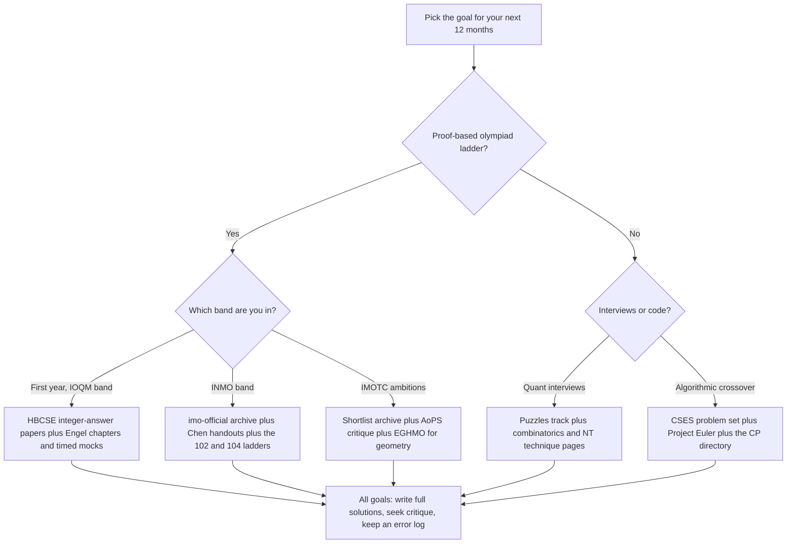
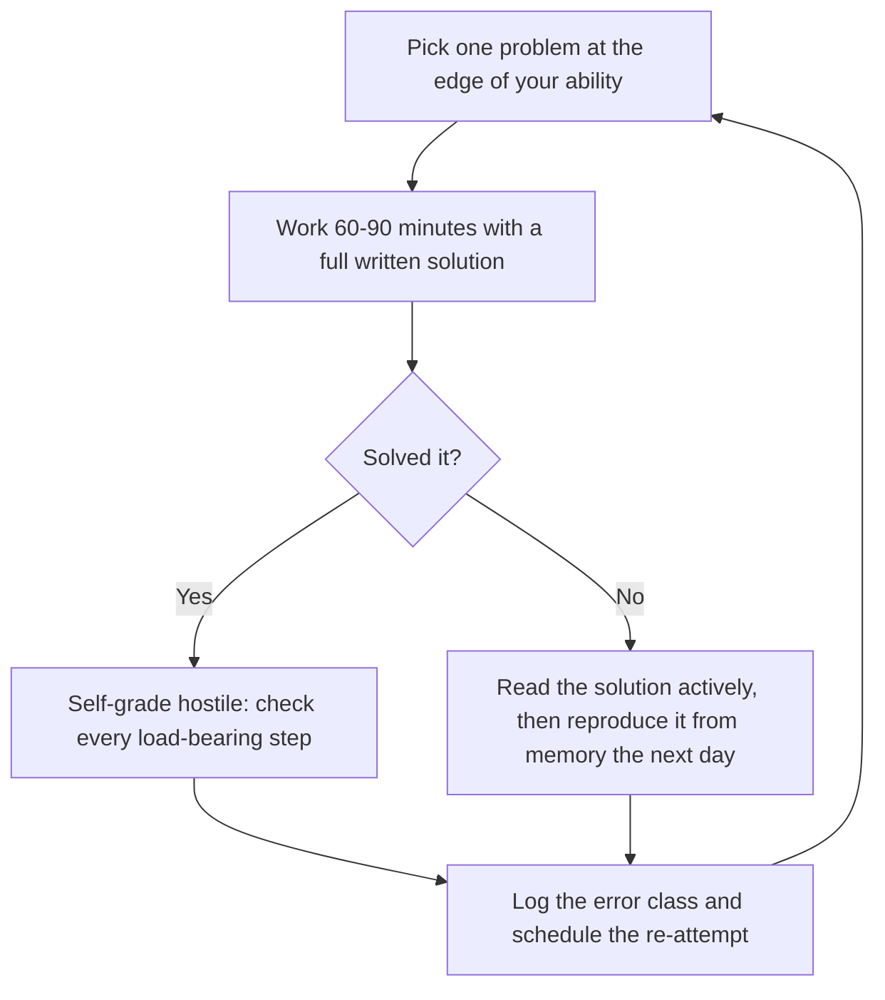

# Competition Math Resources — The Master Directory

## Overview

This page is the single-index rule for competition mathematics: every archive, book, and free handout the rest of the section recommends, organized by what each resource actually holds and which goal it serves. The directory exists because olympiad training fails most often from resource misallocation — students grind random platform problems when a difficulty-graded archive sits one click away, or collect books they will never work instead of finishing the two that matter. Everything listed here is either a verified URL or a name-only citation for works without stable web homes.

Use the page in two passes. First, pick your goal from the choosing-a-stack table and take only that row's resources — a complete stack is two to four items, not twenty. Second, adopt the solution discipline at the bottom regardless of goal, because the same hour of practice yields wildly different returns depending on whether the solution was written, critiqued, and logged. The [section hub](./README.md) explains the underlying methodology; the sibling [competitive programming directory](../competitive-programming/resources-directory.md) covers the coding-contest layer that this page deliberately does not duplicate.

The scope boundaries are worth stating so the page stays honest. Video courses, paid coaching modules, and judge-specific training material are excluded — the first two rarely beat the free sources below, and the third belongs to the programming section's directory. The [India page](./india-math-olympiads.md) covers the Indian pipeline's stage-by-stage logistics; this page supplies only the resources its preparation stack draws on.

## Problem Archives

### The Archive Table

Archives are the core of the stack, and each one holds a different band of difficulty and style. The table lists what each resource genuinely contains — the "what it holds" column is the part to read carefully, because the most common failure is using an archive for a job it was never shaped for.

| Resource | URL | What it holds |
|---|---|---|
| IMO problems archive | https://www.imo-official.org/problems.aspx | Every IMO problem since 1959, with per-year and per-problem score statistics; the only paper-per-year source with balanced difficulty by construction |
| IMO official site | https://www.imo-official.org | Results, country and participant statistics, and the canonical historical record |
| AoPS Wiki | https://artofproblemsolving.com/wiki | Community-written solutions for olympiad problems worldwide, including shortlists and national olympiads such as India's INMO |
| AoPS Community | https://artofproblemsolving.com/community | Live contest discussion threads, solution critique, and shortlist archives as they are released |
| HBCSE olympiad pages | https://olympiads.hbcse.tifr.res.in | Indian stage past papers (IOQM, RMO, INMO bands), official solutions where published, and the current-year circulars |
| Project Euler | https://projecteuler.net | A large numbered archive (900+ problems) of math-flavored computational questions where the proof comes first and the code runs second |
| CSES Problem Set | https://cses.fi/problemset | Several hundred algorithmic tasks with hidden test data; the olympiad-to-engineering crossover ladder |
| Brilliant | https://brilliant.org | Guided, interactive basics with quiz-style progression; the on-ramp for the pre-olympiad band |

A note on the crossover rows' companion text: the CSES problem set has a free companion book — the [CSES handbook](https://cses.fi/book/book.pdf) — that doubles as an algorithms refresher, and it is the right bridge for a math-track student entering the informatics lane. It is listed here rather than in the programming section because its problem-first structure reads like an archive, not like a course. Everything else in the crossover layer, from judges to training ladders, lives in the programming section's directory.

Brilliant's role deserves one calibration note, because it is the entry in the table most likely to be misused. Its guided tracks are excellent for the pre-olympiad band — building the fluency and confidence that archive problems assume — but an INMO-band student who spends hours there is rehearsing material two bands below their edge of ability. Treat it as an on-ramp with an exit: finish the relevant tracks, verify with a cold past paper that the band has moved, and migrate to the archives. The exit matters more than the entry.

### Mining an Archive Properly

An archive rewards a plan and punishes browsing. The three working patterns are chronological (work one competition's papers year by year, which gives balanced difficulty because the papers were designed as balanced sets), by technique (filter problems that yield to a specific tool, the way a handout's exercise lists do), and by difficulty band (use per-problem statistics to pick problems near the edge of your ability). The [IMO guide](./imo-guide.md) details how to convert the imo-official.org archive into a personal preparation calendar; the same pattern applies unchanged to the HBCSE archive for the Indian stages. Random selection, by contrast, drifts toward your existing strengths, which is exactly what a training plan exists to counteract.

Two habits make any archive pay. First, always solve from the paper cold before touching solutions — the value of an archive collapses when solutions are one glance away. Second, keep a session log of problem, date, and outcome, so that in six months you can reread the problems you failed and verify the fix stuck. The [programming section's directory](../competitive-programming/resources-directory.md) documents the identical discipline for judge archives, and the two logs can share a format.

Re-attempts belong inside the archive loop as well. Problems you failed return on the spaced schedule from the error-log section below, pulled from the same archive rather than replaced with fresh items — a failed problem re-solved cold six weeks later teaches more than a new problem at the same band. Archives are reusable in a way fresh problem sources are not, which is why "finished an archive" is an oxymoron.

### Reading a Solution Well

Most archive hours are spent reading solutions, and reading is a skill with its own protocol. Read in layers: first the idea only — usually one sentence, often the first — then close the file and attempt to reconstruct the full argument yourself. Only after your reconstruction fails do you return for the skeleton, and last for the details. Reading a solution end-to-end in one pass produces the feeling of understanding and almost none of the substance.

The reproduction test converts reading into training. The day after reading a solution, write it from memory in full; whatever you cannot reproduce is the part you did not actually own, and it goes into the error log as a failed re-attempt. Candidates who adopt only this protocol — cold attempt, layered read, next-day reproduction — extract more from the same archive than candidates who triple their problem count.

### Difficulty Calibration from Statistics

The imo-official.org archive publishes per-problem statistics — the distribution of contestant scores from 0 to 7 for each problem — and these are the cheapest calibration instrument in existence. A problem whose median sits at 0 or 1 is shortlist-band material regardless of its slot on the paper; a problem whose mean approaches 4–5 is an interview-accessible opener. Use the numbers to build a problem set at your band instead of guessing from problem numbering.

The Indian stages do not publish comparable per-problem statistics, so band estimation there comes from solving history. If you reliably solve two of six RMO problems within the sitting, you are at the RMO band; if you bank four or five, you are training for the INMO band. The section hub's difficulty-calibration advice — train at the edge of ability, roughly a \\( 4:1 \\) ratio of problems done to solutions read — applies unchanged.

### The Indian and Shortlist Layers

The HBCSE archive's stages map directly onto preparation bands: IOQM papers for accuracy work, RMO papers for the first proof band, INMO papers for the national band. The Indian archive therefore functions as a difficulty ladder rather than a flat list, and the right traversal is chronological within each stage before mixing stages. Its second advantage is syllabus fidelity — these papers are exactly what the Indian stages actually test, with no translation loss.

The shortlist layer — the IMO's candidate problems that did not make each year's paper, released annually as the shortlist — lives largely in community archives such as AoPS, and it is the standard source for the INMO-to-IMO transition band. INMO problems have historically been pitched near the shortlist's easier bands, so the shortlist is the natural upsolve source after each INMO sitting. Shortlist solutions on the wiki vary in quality; official compilations and coordinated threads outrank anonymous ones when both cover a problem.

## The Bookshelf

### The Six Core Books

Books supply what archives cannot: curated progression, technique exposition, and commentary on why a method works. Six cover the entire ladder from first contests through collegiate mathematics, and the shelf is deliberately short — most additional olympiad books are elaborations of these. Treat the third column as the purchase decision: a book whose use-case you cannot name is a book you will not open.

| Book | Author(s) | Best used for |
|---|---|---|
| *Problem-Solving Strategies* | Arthur Engel | The technique-first catalog across all four olympiad areas; the reference you grow into after the first year |
| *The Art and Craft of Problem Solving* | Paul Zeitz | The entry point: problem-solving psychology, strategy, and the first serious problem sets |
| *102 Combinatorial Problems* | Titu Andreescu & Zuming Feng | A graded combinatorics ladder from school contest to olympiad band |
| *104 Number Theory Problems* | Titu Andreescu, Dorin Andrica & Zuming Feng | The same ladder for number theory, the highest-transfer olympiad area |
| *Euclidean Geometry in Mathematical Olympiads* | Evan Chen | The modern geometry standard; the last area to start and the one with the best single book |
| *Putnam and Beyond* | Răzvan Gelca & Titu Andreescu | The collegiate continuation for readers who aged out of school olympiads |

### Working a Book versus Reading It

A book is worked, not read: the unit of progress is the problem solved on paper, and a chapter is finished when its exercises are solved, not when its prose is skimmed. The practical protocol is one chapter at a time with a fixed weekly quota of exercises, solutions written in full before checking the book's versions, and a margin note recording where your solution diverged from the printed one. Two ladders — the 102 and 104 volumes — plus Zeitz are enough for the first full year, and Engel is the second-year text; EGHMO and *Putnam and Beyond* are for readers who discover they want the geometry and collegiate bands. Buying more than this shelf is procrastination with a receipt.

### What Not to Buy

The olympiad book market has a long tail of titles that duplicate the six core books badly: multi-volume "crash course" series, solution-only collections without exposition, and anthologies assembled without difficulty progression. None of these are harmful, and all of them are redundant — the marginal hour with them returns a fraction of the marginal hour with the core shelf plus an archive. The directory's rule is that any book purchase must name the gap it fills that the six do not.

The same skepticism applies to paid problem banks and coaching modules built for the enrichment track. The official archives are free, difficulty-graded, and authoritative; a paid bank can add value only through curation and feedback, never through access. Spend on feedback — a mentor, a structured program with human graders — before spending on content.

## Free Handouts and Lecture Notes

### The Three Standout Sources

The best olympiad teaching material available today is free, and three sources dominate. In order of typical first contact:

- **Evan Chen — handouts and OTIS ([web.evanchen.us](https://web.evanchen.us)).** Technique handouts across all four olympiad areas, the *Napkin* for university-adjacent maturity, and OTIS, a structured correspondence program with its own admissions cycle. The combinatorics and number-theory handouts are the correct first entries for the INMO band.
- **Yufei Zhao — olympiad notes ([yufeizhao.com](https://yufeizhao.com)).** Concise, university-authored handouts that run denser than Chen's and reward a second pass. They pair well with the graded problem ladders because each note names the techniques its exercises exercise.
- **MIT OpenCourseWare ([ocw.mit.edu](https://ocw.mit.edu)).** Full university courses beneath the contest layer — 6.042J (Mathematics for Computer Science) for discrete-math foundations, 18.06 (Linear Algebra) for the algebra behind everything above. These are for readers who want to know why the techniques work, not merely how.

### OTIS and Structured Programs

Chen's OTIS is the structured counterpart to his free handouts: an application-based correspondence program with problem sets, individual feedback on write-ups, and mentorship, running on its own terms and timeline. For a self-driven student, the free handouts plus community critique approximate much of its value; for a student who needs external deadlines and graded feedback, a structured program is the efficient purchase. The same trade-off — free-and-unstructured versus paid-and-accountable — applies to every camp and course in this space.

Two evaluation criteria matter when judging any structured program: who grades the write-ups, and whether the feedback is individual or statistical. Programs whose graders are working olympiad people and whose feedback addresses your specific argument are worth their cost; programs that return only scores reproduce the MCQ failure mode inside a proof discipline. Ask for a sample feedback report before enrolling in anything.

### Where Handouts Sit in the Stack

Handouts sit between books and archives, and their role is targeted repair rather than general coverage. When the archive shows a recurring failure class — say, extremal combinatorics arguments — the move is to pull the matching handout, work its exposition, then return to the archive band that exposed the gap. Reading handouts cover-to-cover without the archive loop produces familiarity without calibration, which is the most seductive failure mode in this discipline. The [Olympiad Combinatorics](./combinatorics-olympiad.md) and [Olympiad Number Theory](./number-theory-olympiad.md) pages name the specific handouts matched to each technique they teach.

One warning completes the placement: handout difficulty is uneven by design, since a handout on one technique runs from drill problems to research-adjacent extremes. Losing an hour to a handout's hardest problem is normal; losing a month to it is misallocation, and the fix is the same as everywhere else — log it, schedule the re-attempt, and move to the next archive session. Handouts teach and the loop grades, and neither substitutes for the other.

### Pairing Handouts with the Technique Pages

Each technique page in this section names the resources that match its material, and the pairings are worth following rather than re-deriving. The [combinatorics page](./combinatorics-olympiad.md) pairs with the graded 102 ladder and Chen's combinatorics handouts; the [number theory page](./number-theory-olympiad.md) pairs with the 104 ladder and the orders-and-residues material in Engel. The [algebra page](./algebra-olympiad.md) draws on Engel's functional-equation and inequality chapters, and the [geometry page](./geometry-olympiad.md) is the one case where a single book — EGHMO — genuinely replaces a handout stack.

The pairing logic generalizes: for each technique, one exposition source and one problem ladder, and nothing else until the error log demands repair. Handout surfing — collecting twenty PDFs because they are free — recreates the collector failure mode in a lighter currency. The free layer's advantage is only realized when it stays as small as the paid one.

## Choosing a Stack by Goal

### The Goal-to-Stack Table

The table reads row by row: the archive is where the problems come from, the technique source is where new tools come from, and the practice format is the contract that makes the hours count. A stack is the full row, not the union of all rows. If two goals apply, run the primary row and borrow only the practice format of the secondary one.

| Goal | Core archive | Technique source | Practice format |
|---|---|---|---|
| School contests (SOF-band and below) | School past papers | Brilliant guided tracks; Zeitz chapters 1–2 | Timed MCQ drills, accuracy tracking |
| IOQM this cycle | HBCSE archive, integer-answer band | Engel number theory and combinatorics chapters | 30-question timed mocks, error log |
| RMO → INMO → IMO ladder | HBCSE papers plus the imo-official archive | Evan Chen handouts; the 102/104 ladders; EGHMO for geometry | 90-minute single-problem sessions, full write-ups, AoPS critique |
| Quant and trading interviews | The [puzzles track](../interview/puzzles/README.md) plus this section's combinatorics and NT pages | Zeitz and Engel | Narrated solving under a 10–20 minute clock |
| Algorithmic crossover | CSES problem set plus Project Euler | The [competitive programming directory](../competitive-programming/resources-directory.md) | Solve, implement, pass hidden tests |
| University-level continuation | Putnam-style national contests | *Putnam and Beyond* (Gelca & Andreescu) | Weekly full papers in sitting |

### The Decision Flowchart

The flowchart compresses the table into a decision path. It terminates at the same node for every branch deliberately: whatever the goal, the solution discipline below is the part of the stack that actually compounds. Start from the goal that your next twelve months — not your ambitions for the decade — actually require.



Two calibration notes accompany the chart. First, goals nest: a student on the INMO row is also implicitly on the quant-interview row, because the INMO band's techniques are the interview band's techniques at higher difficulty, so the marginal item is the interview-format practice rather than more technique books. Second, the school-contest row and the olympiad rows use different grading currencies — keyed answers versus proofs — so switching goals mid-cycle costs a format transition, which is another reason to fix the goal before buying the stack. Re-evaluate the choice once a cycle, not once a week.

### Estimating Your Band

Before choosing a row, spend one weekend measuring it: take a recent IOQM paper cold and timed, then a recent RMO paper, and score both honestly against official solutions. The row you belong to is whichever paper you bank roughly half of; the row above it is your training band, and the row below is maintenance. This costs two mornings and prevents the most common allocation error — training at the band you wish you were at rather than the one you are at.

Re-estimate once per cycle, not monthly: bands are percentile positions against large pools, they move slowly, and noisy short-term feedback causes goal thrashing. Between estimates, the error log is the only steering instrument you need. When the log's dominant error classes shift from computation to proof structure, that is the reliable signal you have crossed into the next band.

### Worked Example: Two Stacks

A class-11 student targeting IOQM this cycle and quant internships next year runs the IOQM row plus a borrowed interview format: HBCSE integer-answer papers as the archive, Engel's NT and combinatorics chapters as the technique source, and one of the three weekly sessions repurposed for narrated puzzle solving from the [puzzles track](../interview/puzzles/README.md). Total resources: three, plus the error log. The student does not buy a geometry book this year, because geometry is off the IOQM critical path and the interview band barely tests it.

A university student with no olympiad past targeting quant firms runs the interview row with the ladder volumes as scaffolding: Zeitz first, then the 102 and 104 ladders at the easy bands, all problems worked as full write-ups and critiqued on the AoPS community. No archive bingeing past the interview band — shortlist problems beyond the band are enjoyable and unpriced by the interview market. The stack is again three resources, and the discipline section is doing more work than the shopping list.

A class-9 student currently in the SOF band with olympiad ambitions runs a transition stack: Brilliant for the guided basics, Zeitz for the first serious problem sets, and the current year's IOQM paper as a cold diagnostic in the spring. Nothing else — the most common failure at this age is buying the INMO shelf before the RMO band is reachable. The diagnostic decides whether class 10 becomes a serious olympiad year or whether the school-contest layer remains the right weight class.

## Solution Discipline

### Write the Full Solution

The deliverable in olympiads — and in whiteboard interviews — is the argument, and practice must produce the same artifact the exam grades. A full solution means three components: a statement of what is claimed, the construction or proof with every load-bearing step justified, and an explicit check of edge cases. Solutions that end at "the answer is 42" train the wrong muscle for every venue this section targets. The grading standard is the [IMO guide's](./imo-guide.md) coordination model — 7 points, prove it or lose it — scaled down to whatever contest you are working.

The write-up itself should follow a fixed skeleton so that quality does not depend on mood: restate the claim in one line, state the plan in two, execute with labeled steps, and close with the verification. The skeleton is also the interview narration format, which is why this habit transfers beyond contests. A solution written this way can be posted for critique without a covering letter explaining what you meant.

### Seek Critique

Self-grading has a ceiling because you cannot see your own unjustified steps; critique is the instrument that finds them. Post full solutions to the [AoPS community](https://artofproblemsolving.com/community), where INMO and shortlist threads receive serious review, and exchange write-ups with peers under an agreement to hunt gaps rather than congratulate. When official solutions exist — HBCSE publishes many — compare against them line by line and mark every place your argument asserted something theirs proved. The habit converts an archive from a problem source into a feedback loop, and it costs the ten minutes you were going to waste re-reading your own solution anyway.

Make the peer contract explicit or it decays into mutual praise. The workable version: each side grades the other's solution against the 0–7 rubric, lists every asserted-but-unproved step, and names the first place the argument could have been shorter. Ten minutes of this per week is worth more than any additional problem. The skill it trains — finding the hole in a plausible argument — is the same one interviewers use on you.

Community etiquette doubles as interview etiquette. Post your full attempt, not just the problem statement — threads that show the asker's work get materially better responses, because responders can target the actual gap. Ask a specific question — "is this the right invariant, or just a sufficient one?" — rather than "how do I solve this." The habit of presenting partial work clearly is exactly what a whiteboard interviewer watches for, so the forum is practicing you even when it is not solving your problem.

### The Error Log

The error log is the discipline's memory, and its unit is the error class rather than the problem. Log the date, the problem, the class of the error, its root cause, and the repair drill you assigned yourself; then schedule re-attempts of failed problems on a spaced cycle of roughly \\( 1, 3, 7, \\) and \\( 21 \\) days. A minimal log entry looks like this:

```markdown
| Date | Problem | Error class | Root cause | Repair drill |
|---|---|---|---|---|
| 2026-10-07 | INMO 2023 P2 | Illegal division mod m | Divided by 2 with an even modulus | Redo with case split; drill 5 CRT setups |
| 2026-10-09 | Shortlist C4 | Missed case | Never tested the n = 1 base case | Re-derive; add "smallest case first" to checklist |
| 2026-10-12 | RMO 2019 P5 | False invariant | Claimed parity preserved without proof | Prove or disprove invariants before use; 3 drills |
```

Error classes repeat with surprising regularity: misread quantifiers, illegal divisions modulo composite numbers, induction steps that skip the base case, missed cases, computational slips under time, and invariants asserted rather than proved. A month of logging reveals your personal distribution, and the distribution tells you which handout or drill to pull — which is exactly the targeted-repair loop the handouts section describes. Keep the log in a plain text file or a single spreadsheet; tooling beyond that is procrastination.

In interviews the same log becomes your mistakes journal, and reviewing it the night before a loop is the highest-yield hour in preparation. The interview version logs the same classes — case missed, invariant assumed, edge unverified — against puzzle and coding problems instead of olympiad papers. One instrument, two venues, and the second venue is where the first one pays.

### The Practice Loop

The loop below is the unit of practice that all goal-rows share. Its non-negotiable elements are the full write-up, the hostile self-grade, and the log entry; its clock (60–90 minutes) matches the section hub's session format and the pacing of proof-graded exams.



Run the loop three to five times a week and the archives, books, and handouts all become inputs to it rather than alternatives to it. Candidates who adopt only one habit from this directory should adopt this loop; it is the mechanism behind every claim on this page, and it transfers verbatim to interview preparation. The [Aptitude track](../aptitude/README.md) runs a lighter-weight version of the same loop for timed arithmetic, which is the right format for the campus-assessment layer.

Time-box the stuck phase explicitly: forty-five to sixty minutes of genuine attack before solutions are allowed, with the last ten minutes spent writing down what you tried and why it failed. The write-down step is not bureaucracy — it is the raw material of the error log, and it converts a dead end into data. Candidates who skip it re-fail the same problem class for months, which is the most expensive habit in this entire directory.

### Common Failure Modes

Four failure modes account for most wasted preparation on these resources. Collecting — acquiring books and bookmarks instead of sessions — feels like progress and produces none. Passive reading — walking through solutions without a prior cold attempt — builds recognition without recall. Skipping the write-up — solving mentally and moving on — fails to train the graded artifact. And solo training without critique plateaus at the ceiling of your own blind spots, which is precisely the ceiling critique exists to remove.

## Maintenance — URLs Move

Directories rot, and olympiad directories rot fastest: national committees reorganize sites (India's stages have been renamed three times since 2021), contests rebrand, and community hosts migrate. The verified policy in this repo is to keep only URLs that were checked at writing time and to cite everything else — books, camps, programs — by name only. Prefer institutional hosts (imo-official.org, HBCSE, ioinformatics.org, ocw.mit.edu) over personal mirrors when both exist. When a link dies, check the Internet Archive before deleting the entry, since most olympiad archives persist under new addresses or in captured copies. Community-written solutions also rot in a second sense — individual wiki pages are occasionally wrong — so official solutions always outrank wiki ones when both cover a problem.

Two rot types behave differently, and the distinction matters for maintenance. Address rot — the resource moved — is recoverable by following the publisher's site or the Internet Archive, and the fix is a link update. Content rot — the advice itself became stale, as with any page describing India's stage structure — is the dangerous kind, because the link still works while the text misleads. The checklist below exists mostly to catch the second kind early.

### The Yearly Verification Checklist

Verification is mechanical enough to checklist. Once a year — the calendar anniversary of this page's last audit is a good trigger — walk the list below and update anything that moved. The audit takes about thirty minutes with the page open.

```markdown
- [ ] Every URL on this page resolves and serves the described content
- [ ] India: current-cycle stage names, windows, and eligibility confirmed against HBCSE/MTA circulars
- [ ] Book editions cited are the current ones; name-only citations still accurate
- [ ] Community solution quality spot-checked against official solutions on two problems
- [ ] Local PDF copies of load-bearing archives still open and match the live versions
```

Record the audit in whatever changelog convention the repo uses, and flag any entry that could only be verified name-only — those are next year's likeliest casualties. A directory that admits its staleness model, with a visible "verified as of" date, is worth more than one that pretends to permanence. The same protocol applies to the [programming section's directory](../competitive-programming/resources-directory.md), which shares this page's rot profile.

Version control closes the loop: this page lives in git like everything else, so each yearly audit is a diff against last year's audit rather than a re-verification from memory. The diff pattern is diagnostic in itself — entries that move every year deserve demotion to name-only, while entries untouched for years have earned institutional-host status. The same logic the error log applies to your own mistakes, the audit diff applies to the directory's.

## Interview Questions

1. **AoPS wiki or official solutions — which do you trust, and how do you use them?** Official solutions are ground truth but often terse; wiki solutions are faster to read, show multiple attacks, and are occasionally wrong. The working order is: solve cold, attempt a full write-up, then check the official solution when it exists and use wiki solutions to fill the gaps or show alternative routes. Any wiki solution that contradicts your derivation gets re-derived from scratch before either is trusted. The meta-skill — verifying a source against a stronger source — is the same one an interviewer applies to your claims.
2. **How would you build a three-month IOQM plan using only free resources?** Spine: the HBCSE archive's integer-answer band, worked chronologically, because those papers are the exact genre and difficulty of the qualifier. Format: one 30-question timed mock per week plus two or three 90-minute single-problem sessions, with full written solutions and the error log running throughout. Technique: the number theory and combinatorics chapters of Engel, plus the matching handouts from web.evanchen.us for whatever error classes the log surfaces. That is four resources total, and the constraint that all of them are free changes nothing about the plan's shape.
3. **Why do Project Euler and CSES belong in a competition-math directory rather than a programming one?** Both are proof-first in the way that matters: a Project Euler problem is unsolvable by pattern-matched code because the mathematics has to be understood before any program can run in time, and CSES tasks in the mathematical sections are olympiad reasoning wearing an implementation jacket. They train the crossover skill — translating a proved claim into a running artifact — that pure math archives and pure judges both miss. For placement candidates this is precisely the profile of quant-adjacent software roles. The programming section's directory covers the judge-centric layer; these two live here because their center of gravity is the mathematics.
4. **When is a book better than an archive, and when is the reverse true?** Books are better for technique acquisition: curated progression, exposition of why a method works, and exercises selected to exercise it. Archives are better for calibration and volume: real exams, real difficulty distributions, and per-problem statistics to locate your edge of ability. The failure modes are symmetrical — archive-only training never teaches new tools, book-only training never verifies transfer. The stack works when books supply the tools, the archive supplies the tests, and the error log decides which is needed next.
5. **What makes an error log more useful than simply solving more problems?** More problems repeat your existing failure distribution; a log deduplicates it. Because errors cluster into a small number of classes — illegal modular division, missed cases, unproven invariants — a month of logging identifies the two or three classes that cost you the most points, and targeted drills on those classes raise the score faster than a thousand random problems. The log also enforces the re-attempt cycle, which converts a failed problem from a loss into scheduled training. The same instrument reappears in interview prep as a mistakes journal, for the same reason.
6. **How do you keep a resource directory trustworthy over years?** Verify links on a fixed yearly cycle rather than on failure, prefer institutional hosts that outlive individual pages, and cite volatile resources by name only so a dead link cannot mislead. Keep local copies of key PDFs you depend on, since archives — especially contest-committee ones — move without notice. Distinguish two kinds of rot: URLs dying and content becoming wrong, the second being the community-solution problem that official solutions resolve. A directory that admits its staleness model — "verified as of date X" — is worth more than one that pretends to permanence.

## Key Takeaways

- Archives first: problems beat reading by roughly \\( 4:1 \\) as a use of training hours, and each archive holds a specific band — match the band to the goal, not the hype.
- The IMO archive (imo-official.org/problems.aspx) is the only paper-per-year source with balanced difficulty by construction; HBCSE hosts the Indian bands; AoPS wiki and community supply solutions and critique.
- Per-problem score statistics are the cheapest calibration instrument available; use them to build problem sets at your band instead of guessing.
- Six books cover the whole ladder: Zeitz and the two Andreescu ladders first, Engel second year, EGHMO for geometry, *Putnam and Beyond* for the collegiate band; anything beyond the shelf needs a named gap.
- The free handout layer — web.evanchen.us and yufeizhao.com — is the best technique teaching in existence; MIT OCW supplies the theory beneath it.
- Choose stacks by goal from the table (school contests, IOQM, INMO ladder, quant interviews, algorithmic crossover, collegiate), estimate your band with two cold sittings, and re-evaluate once a cycle.
- The unit of practice is the loop: one problem at the edge of ability, 60–90 minutes, full write-up, hostile self-grade, error-log entry, spaced re-attempt.
- Directories rot — verify URLs yearly, prefer institutional hosts, cite volatile resources name-only, and keep local copies of load-bearing PDFs.

## References

- [IMO official site](https://www.imo-official.org) — results and statistics since 1959.
- [IMO problems archive](https://www.imo-official.org/problems.aspx) — every IMO problem with per-year and per-problem statistics.
- [Art of Problem Solving](https://artofproblemsolving.com) — the training ecosystem hub.
- [AoPS Wiki](https://artofproblemsolving.com/wiki) — community solution archives for olympiads worldwide.
- [AoPS Community](https://artofproblemsolving.com/community) — live discussion and critique threads.
- [HBCSE Olympiads](https://olympiads.hbcse.tifr.res.in) — Indian stage papers, solutions, and circulars.
- [Project Euler](https://projecteuler.net) — math-flavored computational problem archive.
- [CSES Problem Set](https://cses.fi/problemset) — algorithmic tasks with hidden tests; the [CSES book](https://cses.fi/book/book.pdf) is the free companion text.
- [Brilliant](https://brilliant.org) — guided interactive basics.
- [Evan Chen's handouts](https://web.evanchen.us) — technique handouts, the Napkin, and OTIS.
- [Yufei Zhao's notes](https://yufeizhao.com) — concise university-authored olympiad handouts.
- [MIT OpenCourseWare](https://ocw.mit.edu) — full university courses, including 6.042J and 18.06.
- [IOI official site](https://ioinformatics.org) — informatics olympiad regulations and task archives, for the crossover row.
- *Problem-Solving Strategies* (Arthur Engel); *The Art and Craft of Problem Solving* (Paul Zeitz); *102 Combinatorial Problems* (Andreescu & Feng); *104 Number Theory Problems* (Andreescu, Andrica & Feng); *Euclidean Geometry in Mathematical Olympiads* (Evan Chen); *Putnam and Beyond* (Gelca & Andreescu) — cited by name only.

## Cross-References

- [Competitive Math hub](./README.md) — the section orientation and training methodology this directory serves.
- [India Math Olympiads](./india-math-olympiads.md) — the Indian pipeline whose prep stack this directory indexes.
- [IMO Guide](./imo-guide.md) — how to convert the imo-official.org archive into a preparation calendar.
- [Olympiad Number Theory](./number-theory-olympiad.md) — the technique page to pair with the 104-problem ladder.
- [Olympiad Combinatorics](./combinatorics-olympiad.md) — the technique page to pair with the 102-problem ladder and Chen's handouts.
- [Competitive Programming Resources](../competitive-programming/resources-directory.md) — the sibling directory for judges, books, and crossover training.
- [Puzzles & Brain Teasers](../interview/puzzles/README.md) — the question bank behind the quant-interview row of the goal table.
