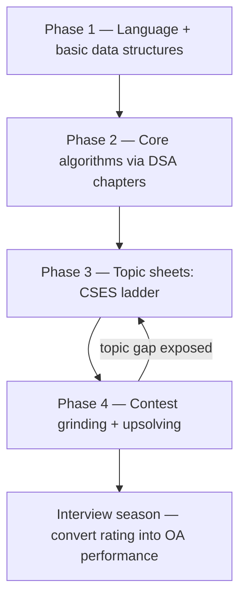
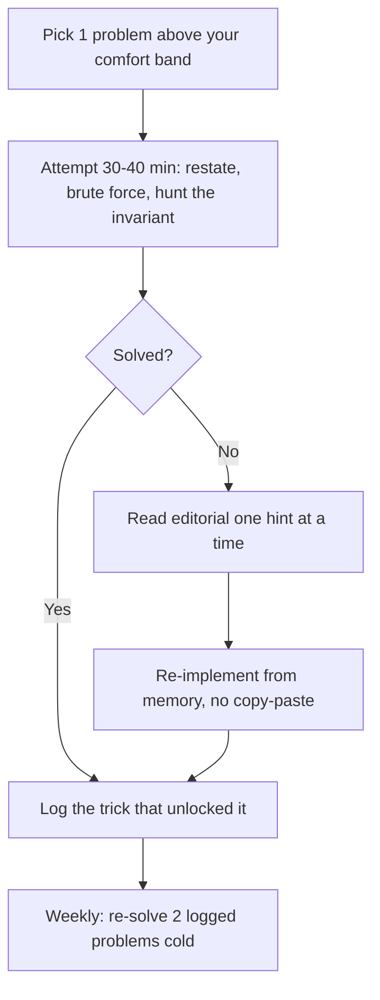

# Competitive Programming

## Overview

Competitive programming is timed problem-solving under an automatic judge: you receive problem statements with hard input limits, submit code, and get accepted or rejected against hidden test sets within minutes. This section covers the three platforms that dominate that world — [Codeforces](https://codeforces.com), [AtCoder](https://atcoder.jp), and [LeetCode](https://leetcode.com) — plus the ladder-style archives ([CSES](https://cses.fi/problemset), [USACO](https://usaco.guide)) that convert contest instincts into placement-ready skill. The angle here is deliberately different from the [DSA track](../dsa/README.md): the DSA chapters teach how an algorithm works; these pages teach how contest platforms work, how their rating systems behave, and how to convert a rating into interview shortlists. If you are targeting Indian campus placements or off-campus drives, start here, pick one home platform, and follow the four-phase roadmap below.

## How to Use This Section

Read this hub once to choose a platform and a phase, then jump to the guide matching that platform and treat its practice plan as your default weekly routine. The hub deliberately does not re-teach any algorithm: when a section says "binary search on the answer" or "profile DP", the theory lives in the linked [DSA track](../dsa/README.md) chapters and is assumed, not repeated. Two reading orders work in practice — a top-down order (hub → platform guide → DSA chapters as referenced) for people who already code daily, and a bottom-up order (DSA chapters first, hub and platform guides second) for people in their first year of programming. Either way, the six-month plan table below is the calendar and the platform guides supply the daily mechanics.

## What Competitive Programming Actually Is

Competitive programming is not a single skill but a stack of three: reading a terse specification and extracting its exact requirements, translating an algorithm into bug-free code under a clock, and recognizing which of a few dozen standard techniques applies to a disguised problem. Platforms measure the stack with a rating number that updates after every rated round, which is what makes progress legible to outsiders — including recruiters. The subsections below define the model precisely, because every placement mapping later in this section (OA performance, hiring contests, resume signal) is an argument about that model.

### The Judged-Contest Model

Every major platform follows the same loop: a statement gives input/output format and constraints, you submit code, and a judge compiles and runs it on a hidden battery of tests under a time limit and a memory limit. Wrong answers, time-limit exceeded, runtime error, and memory-limit exceeded are distinct verdicts, and the difference matters — a time-limit-exceeded on test 37 means your complexity class, not your edge cases, is the problem. Time limits are set adversarially: they are tuned so that the intended solution passes with headroom while the next-slower class of solution fails. That adversarial tuning is the core cultural difference from school exams, where "correct but slow" still scores.

### Verdicts and What Each One Teaches

The judge's vocabulary is worth memorizing because each verdict encodes a different debugging lesson. `Wrong answer` on the first tests means a misread statement or a broken base case; `Wrong answer` on a late test means an edge case (zero, one, duplicates, maximum values) that your own testing missed. `Time limit exceeded` is a complexity-class verdict — your \\( O(n^2) \\) loop against an \\( O(n \\log n) \\) intent — and no amount of constant-factor tuning fixes a wrong class. `Runtime error` usually means an out-of-bounds access or unbounded recursion, both of which interviewers also watch for in whiteboard code. Reading verdicts this way turns every failed submission into a targeted lesson instead of a coin flip on resubmission.

### Who Competes and at What Level

The contest pyramid has three tiers. School-level olympiads (the [IOI track](./ioi-guide.md)) and university-level [ICPC](./icpc-guide.md) teams form the formal, certificate-bearing tier. Open online rated contests on Codeforces and AtCoder form the mass tier, where anyone from a first-year student to a staff engineer competes weekly. Hiring contests run by companies (TCS CodeVita, HackWithInfy, CodeAgon, Flipkart GRiD — all name-only here) form the recruiting tier, and their problem sets are typically easier than open-platform Division 2 rounds. Most placement candidates live entirely in the second and third tiers, which is what this section is built around.

## Why It Matters for Placements

### Online Assessments Are Contests With Fewer Rounds

The online assessment (OA) that gates 60-90 minutes of every product-company funnel is a miniature contest: 2-4 problems, 90-120 minutes, hidden tests, partial or full scoring per problem. The skills transfer one-to-one — fast parsing of a terse statement, edge-case hygiene under a clock, and the discipline of testing on your own examples before submitting. Companies recycle problem archetypes constantly: array manipulation, prefix sums, two pointers, binary search on answer, and one medium DP. A candidate who can reliably solve Codeforces Div 2 A-C inside a live round will almost never fail an OA on time or correctness grounds; the reverse is not true, which is why contest practice is the higher-variance investment.

### Hiring Contests and the Off-Campus Route

Hiring contests convert contest performance directly into interview calls. TCS CodeVita (one of the largest, run globally by TCS) and Infosys's HackWithInfy are the mass-recruiter versions; CodeNation's CodeAgon and Flipkart GRiD target product-engineering roles and typically fly top finishers to final interview loops. None of these URLs are linked here because they rotate per edition — search the contest name plus the year for the current registration page. The pattern across all of them is identical: an OA stage scored like a contest, then interviews for the top few percent. A [contest calendar habit](./contest-calendar-codelist.md) keeps you registered for these without scrambling.

### Resume Signal and Credibility

A Codeforces or AtCoder handle is one of the few verifiable, tamper-proof signals a fresher can put on a resume — anyone can claim "strong DSA", but a Candidate Master badge cannot be faked. For off-campus applications where no one has seen your coursework, a rating plus a rank list (for example, an ICPC regional rank or a CodeVita rank) functions as external validation. Recruiters at product companies mostly use it as a screening tiebreaker rather than a hard cutoff, and quant firms are the main segment where a high rating alone can trigger an interview call. The hedged, platform-specific reading of this signal is covered on the [Codeforces guide](./codeforces-guide.md).

## Platform Landscape

### The Six Platforms That Matter

| Platform | Contest cadence | Rating system | Archive size | Best for |
|---|---|---|---|---|
| [Codeforces](https://codeforces.com) | 2-4 rated rounds per month | Elo-style, granular (100-point bands) | 10,000+ tagged, difficulty-rated problems | Rating-driven improvement; hacking; hardest problem variety |
| [AtCoder](https://atcoder.jp) | Beginner Contest most Saturdays 21:00 JST | Performance-based, color bands | Thousands, superb same-day editorials | Clean statements; DP ladder; editorial-first learning |
| [LeetCode](https://leetcode.com/problemset/all) | Weekly (Sun) + Biweekly (Sat) contests | Contest rating, Knight/Guardian badges | 3,000+ problems, company-tagged | Direct interview/OA prep; company-specific drilling |
| [CodeChef](https://www.codechef.com) | Starters rated series, several per month | Stars derived from Codeforces-style rating | Large Indian-community archive | INR prizes; beginner-friendly rated rounds |
| [CSES](https://cses.fi/problemset) | No contests, no rating | None (static ladder) | ≈300 graded problems in ~20 categories | Topic-by-topic mastery with exact difficulty ordering |
| [USACO](https://usaco.guide) | Monthly Dec-Mar + US Open | Division ladder (Bronze→Platinum) | Years of past contests with solutions | Structured curriculum via the USACO Guide; olympiad style |

### Choosing a Home Base

Pick one rated platform as your home (most Indian candidates choose Codeforces for rating portability, or AtCoder for problem quality) and one ladder archive (CSES is the default) as your daily practice surface. LeetCode sits outside this choice: even competitive programmers grind LeetCode in the two months before interview season because company tags and OA archetypes live there — the [LeetCode archive page](./leetcode-archive.md) covers that workflow. Two contest aggregators, [clist.by](https://clist.by) and the [Codeforces contest list](https://codeforces.com/contests) / [AtCoder contest list](https://atcoder.jp/contests) calendars, keep the schedule visible. Do not spread yourself across all six platforms simultaneously; the rating systems reward sustained activity on one account.

### Aggregators and Secondary Tools

Beyond the platforms themselves, three tool categories matter. Contest aggregators ([clist.by](https://clist.by)) merge every platform's calendar into one feed with timezone conversion, which is essential once you register for rounds in JST or UTC. Tracker sites — most importantly [AtCoder Problems](https://kenkoooo.com/atcoder) for AtCoder analytics — add difficulty ratings and solve-rate statistics that the official sites lack. Browser extensions (Carrot for Codeforces rating previews, CF Analytics for profile visualization — name-only here) polish the experience but change nothing about preparation, so treat them as optional garnish. The [contest calendar page](./contest-calendar-codelist.md) turns these tools into a concrete weekly schedule.

## Rating Ladders Across Platforms

### The Three Ladders Side by Side

Each platform slices skill into bands, and recruiters who recognize one usually recognize all three. Codeforces is the most granular, AtCoder's colors are the most intuitive, and LeetCode's contest rating has only two public badges worth mentioning.

| Platform | Rating | Title / Color |
|---|---|---|
| Codeforces | < 1200 | Newbie (gray) |
| Codeforces | 1200-1399 | Pupil (green) |
| Codeforces | 1400-1599 | Specialist (cyan) |
| Codeforces | 1600-1899 | Expert (blue) |
| Codeforces | 1900-2099 | Candidate Master (violet) |
| Codeforces | 2100-2299 | Master (orange) |
| Codeforces | 2300-2399 | International Master (orange) |
| Codeforces | 2400-2599 | Grandmaster (red) |
| Codeforces | 2600-2999 | International Grandmaster (red) |
| Codeforces | 3000+ | Legendary Grandmaster (red) |
| AtCoder | < 800 | Gray, then Brown from 400 |
| AtCoder | 800-1199 | Green |
| AtCoder | 1200-1599 | Cyan |
| AtCoder | 1600-1999 | Blue |
| AtCoder | 2000-2399 | Yellow |
| AtCoder | 2400-2799 | Orange |
| AtCoder | 2800-3199 | Red |
| AtCoder | 3200+ | Silver, then Gold at 3600+ |
| LeetCode | ~1850 | Knight (approx.; historically top ~5% of a rated contest) |
| LeetCode | ~2150 | Guardian (approx.; historically top ~1%) |

### Reading the Ladders

The AtCoder color bands in full: gray below 400, brown 400-799, green 800-1199, cyan 1200-1599, blue 1600-1999, yellow 2000-2399, orange 2400-2799, red 2800-3199, silver 3200-3599, gold 3600+. The bands are worth internalizing because AtCoder's own practice tooling (difficulty colors on the Problems tracker) reuses the same palette, so one color vocabulary covers both rating and problem difficulty. Codeforces titles matter more than colors on a resume because recruiters who know the platform quote titles ("Expert", "Candidate Master") rather than numbers.

### Cross-Platform Anchors

Approximate cross-platform anchors: AtCoder cyan ≈ Codeforces Specialist-Pupil, AtCoder blue ≈ Codeforces Expert, and LeetCode Knight ≈ a solid Div 2 performer — these are rough field observations, not official conversions, and the platforms publish no equivalence table. For placement purposes the practical milestones are Codeforces Expert (1600), Codeforces Candidate Master (1900), and AtCoder blue (1600): each is a defensible resume line. The mechanics behind the numbers are explained in the [Codeforces guide](./codeforces-guide.md) and [AtCoder guide](./atcoder-guide.md); what matters here is that every ladder's bottom bands are reachable within months, while the top bands are career-scale achievements that no placement plan should require.

## How Rating Actually Moves

Every rated platform computes a number from your finishes, not from problems solved in practice, so rating only moves when you enter rounds and perform above or below your current band. All three systems share the same skeleton: your result is compared against what the system predicted for someone of your rating, and the gap becomes the delta. Beating stronger-than-average fields moves you up faster than beating weaker ones, which is why a good finish in a hard round outvalues an easy win. Deltas are also bounded per round — you cannot jump several bands in one night even with a perfect score — so the ladders in the previous section are measured in months, not weekends.

The practical consequence for placement planning is that rating is a lagging indicator of skill, not the skill itself. Two candidates who solve the same archive problems will end up within a band of each other, but the one who contests weekly gets there with proof. Treat the number as a byproduct of a process metric you control: problems solved per week, upsolve completion rate, and contest count. The [Codeforces guide](./codeforces-guide.md) explains its Elo-style mechanics in detail, and the [AtCoder guide](./atcoder-guide.md) covers the performance-based variant used there.

## The Four-Phase Roadmap

The roadmap below is the spine of this entire section: the DSA track supplies theory in Phase 2, the archives supply structured drilling in Phase 3, and the rated platforms supply measurement and pressure in Phase 4. Skipping phases produces the two classic failure modes — contest-grinding without algorithms (rating plateaus at Pupil) and algorithm-reading without contests (no OA speed). Keep the phases in order but overlap them by a few weeks each, because the boundaries are soft by design.

### The Phase Flow

### Phase 1: Language and Basic Data Structures (Weeks 1-6)

Pick one language (C++ is dominant in CP for its speed and STL; Python is acceptable for OAs and lower-rated rounds) and reach fluency in arrays, strings, maps/sets, and sorting. Solve 50-80 easy problems — Codeforces ratings 800-1100 or the first CSES sections — purely to make the language automatic. The failure mode to avoid is starting LeetCode mediums before your loops, hashing, and I/O are reflexive; slowness at this layer compounds everywhere above it.

Concretely, exit criteria for this phase look like: you can implement a hash-map frequency count, a sort with a custom comparator, and a two-pointer sweep without looking up syntax, and you can read a 400-word statement and list its edge cases in two minutes. Anything less means the later phases will be spent fighting the language instead of learning algorithms. It is fine to move on with imperfect speed — Phase 2 and the archive work below will keep drilling the same fundamentals.

### Phase 2: Core Algorithms via the DSA Track (Weeks 7-16)

Work through the core chapters of the [DSA track](../dsa/README.md) in order — [complexity analysis](../dsa/chapters/ch03-complexity-analysis.md), [mathematical foundations](../dsa/chapters/ch02-math-foundations.md), sorting, binary search, hashing, recursion, trees, graphs, and DP — implementing each from scratch rather than reading passively. Pair every chapter with 10-15 archive problems at the matching CSES or Codeforces difficulty band. The [60-day study plan](../dsa/appendices/appendix-k-60-day-plan.md) is the compressed alternative if your timeline is shorter than four months.

Two disciplines in this phase pay outsized dividends. First, implement everything yourself — a segment tree you copied is worth zero in an interview, where follow-up questions probe exactly the parts you skipped. Second, keep a per-topic error list (off-by-one on binary search, missing long-long overflow, recursion depth limits) and re-test yourself on it weekly; most contest and OA losses trace back to the same five personal bugs. Advanced readers can dip into specialist topics like [Aliens trick](../dsa/advanced/aliens-trick.md) later, but nothing above the core chapters is needed for placement success.

### Phase 3: Topic Sheets (Weeks 17-22)

Now convert algorithm knowledge into contest-ready coverage using the CSES problem set, whose categories (Sorting and Searching, Dynamic Programming, Graph Algorithms, Range Queries, Tree Algorithms, Mathematics, String Algorithms) map one-to-one onto interview syllabi. Solve front-to-back within a category — CSES orders problems by exactly the prerequisite chain you need. This is also the phase to close pattern gaps with targeted reading such as [binary search on the answer](../interview/coding/pattern-binary-search.md) and [sliding window](../interview/coding/pattern-sliding-window.md).

Topic sheets exist because interviews and contests both sample from a finite deck of techniques, and unstructured practice samples it unevenly. A sheet forces you through the techniques you would otherwise avoid — most candidates skip digit DP or bitmasks until an OA forces the issue. Timebox each problem to 45-60 minutes before looking at any hint, and mark every problem you needed a hint on for a cold re-solve two weeks later. By the end of this phase you should have 150-250 accepted problems spread across every category you expect to be tested on.

### Phase 4: Contest Grinding and Upsolving (Week 23 Onward)

Enter one rated round per week (Codeforces Div 2 or Div 3, or the weekly AtCoder Beginner Contest) and — this is the non-negotiable part — upsolve every problem you missed within 48 hours, before reading the full editorial. Rating follows the upsolving, not the contests themselves; a year of contests without upsolving produces a flat graph. Track contest dates with the [contest calendar page](./contest-calendar-codelist.md) so registration deadlines (Codeforces requires registering ~a day ahead for some rounds) never cost you a round.

In parallel, register for every hiring contest that matches your target segment — TCS CodeVita and HackWithInfy for mass recruiters, CodeAgon and Flipkart GRiD for product roles — because they are scheduled like contests and cost nothing but an evening. This is also the phase where the interview-specific layers (behavioral prep, project defense, [machine coding](../machine-coding/README.md) practice) rejoin the plan; contest skill gets you to the interview, not through it. The six-month table below compresses all of this into a calendar.

## The Practice Loop

### The Weekly Cycle

Contest skill compounds through a loop, not through raw volume, and the loop has an explicit escape hatch for being stuck.

### Why the Log Matters

A solve log — problem link, the idea you missed, the tag you would now associate — is what separates a year of practice from a year of repetition. Without it you re-encounter the same prefix-sum trick as if new, because recognition memory decays in weeks. With it, the weekly cold re-solve of two old problems converts fragile recognition into recall, which is what an interview actually tests. The [resources directory](./resources-directory.md) lists tools (spaced-repetition, tracker spreadsheets) that automate the scheduling.

### Volume Targets That Hold Up

Across a six-month run, roughly 250-350 problems at the right difficulty beats 800 problems five bands too easy. The right difficulty is one where you fail 30-50% of first attempts: high enough to stretch, low enough that the loop above still closes. Contest platforms make this calibration easy through difficulty tags (Codeforces prints a rating per problem; the AtCoder Problems tracker computes one) — use them instead of scrolling page one of the archive forever. If your accept rate exceeds 80%, you are rehearsing, not training.

## A Six-Month Working Plan

The table below assumes 8-12 focused hours per week alongside coursework or a job; scale the calendar, not the order. Every phase keeps solving problems from earlier phases — skills decay without maintenance.

| Month | Focus | Concrete output | Checkpoint |
|---|---|---|---|
| 1 | Language + 100 easy problems (ratings 800-1100 / CSES intro) | Loops, STL/hashing, sorting automatic | 100 problems accepted |
| 2 | DSA core: complexity, sorting, binary search, hashing | 40-60 archive problems on those topics | Binary search on answer unaided |
| 3 | DSA core: trees, graphs (DFS/BFS, shortest paths), greedy | CSES Graph Algorithms section underway | First rated contest attempted |
| 4 | Dynamic programming end-to-end + CSES DP section | All 20-30 CSES DP problems or AtCoder EDPC A-Z | Solve C-D slots in live rounds |
| 5 | Weekly contests + hard upsolving; range queries, strings | 6-8 rated rounds with full upsolve logs | Div 2 C in-contest; rating climbing |
| 6 | Contest grinding + LeetCode company tags + hiring contests | CodeVita/HackWithInfy/CodeAgon attempts | OA-ready under 90-minute clocks |

## Map of This Section

This hub is the entry point; the seven pages below are the section proper, and each is written to stand alone.

| Page | What it covers |
|---|---|
| [Codeforces guide](./codeforces-guide.md) | Contest formats (Div 1/2/3/4, Educational, Global), Elo mechanics, the 10k-problem archive, EDU courses, hacks, the A→C practice ladder, resume signal |
| [AtCoder guide](./atcoder-guide.md) | ABC/ARC/AGC formats, performance-based rating, AtCoder Problems tracker, editorial culture, the Educational DP Contest A-Z ladder |
| [LeetCode archive](./leetcode-archive.md) | Company-tagged drilling, contest rating, converting CP skill into OA and interview performance |
| [ICPC guide](./icpc-guide.md) | Team contests, regionals, the partial-scoring format companies borrow for group challenges |
| [IOI guide](./ioi-guide.md) | The school-olympiad track, syllabus, and how olympiad training maps to placements |
| [Contest calendar](./contest-calendar-codelist.md) | Building a weekly contest schedule, clist.by, registration hygiene, clash management |
| [Resources directory](./resources-directory.md) | Books, courses, blogs, and tools beyond the platforms themselves |

## CP Versus Interview DSA

### Three Structural Differences

The two disciplines share an algorithm syllabus but reward different behaviors, and confusing them is the most common prep mistake. First, scoring: a contest problem is usually worth points only if it passes the hidden battery (or partial test groups on some platforms), while an interview scores your reasoning continuously — a correct approach with a bug often still passes the round. Second, speed: contests rank everyone on one clock, so minute-level efficiency matters, whereas an interview hour has room for discussion, dead ends, and recovery. Third, adversariality: contest tests are chosen to break sloppy solutions and time limits are tuned against the second-best complexity, while interview inputs are conversational and the interviewer wants you to succeed at demonstrating structure.

### What Transfers and What to Drop

Habits worth keeping: estimating complexity before writing code, testing on your own adversarial examples (empty input, duplicates, maximum constraints), and stating your approach out loud before committing to it. Habits worth dropping: obfuscated micro-optimizations that sacrifice readability for a constant factor, treating a hint as failure (in interviews, using a hint well is a scored skill), and guessing instead of proving when a claim is checkable. The [complexity analysis chapter](../dsa/chapters/ch03-complexity-analysis.md) is the shared foundation both disciplines grade on — contest ratings and interview offers are just different measurement systems built on top of it.

### Where the Formats Blur

Some interview formats deliberately borrow contest mechanics, so the boundary is not clean. Machine coding rounds time-box a small working system, pair-programming rounds watch you code live under mild pressure, and some group challenges use ICPC-style partial scoring. Preparing for the contest version of these skills is therefore never wasted — it just needs to be paired with the communication practice covered in [machine coding](../machine-coding/README.md). The arithmetic-flavored papers some companies run sit adjacent to [quantitative aptitude](../aptitude/README.md) and [competitive math](../competitive-math/README.md), which handle that syllabus directly.

## Interview Questions

1. **Is competitive programming worth it if I am only targeting service companies?** Mostly no as a rating grind, yes as a skills investment. Mass-recruiter OAs (TCS, Infosys, Wipro, Accenture) test easy-to-medium coding plus aptitude, which two months of Phases 1-2 above cover without any rated contests. TCS CodeVita and HackWithInfy reward contest-style speed, so a casual Phase 4 with a handful of contests is enough. Spending 300 hours chasing Candidate Master for a service-company resume is misallocated effort — the same hours in projects and machine coding return more.
2. **How is competitive programming different from interview DSA?** Contests optimize speed under adversarial hidden tests with all-or-nothing scoring, while interviews optimize demonstrated reasoning with partial credit in the form of hints and follow-ups. Contest problems state everything precisely; interviewers deliberately under-specify and evaluate your clarifying questions. A rating is objective and externally verifiable, whereas an interview outcome depends on the interviewer and the loop. Preparing for both shares the algorithm layer but requires separate practice of the soft layer.
3. **Which single platform should a beginner start on?** Codeforces if you want the widely-recognized rating and the largest archive, AtCoder if you value statement quality and the best editorials, and CSES as the daily practice ladder regardless of which rated platform you pick. LeetCode is the correct answer only when an interview is within eight weeks, because company tags dominate there. The pragmatic default for Indian students is Codeforces for rated rounds plus CSES for structured coverage, revisited on the [Codeforces guide](./codeforces-guide.md).
4. **How long before my rating becomes resume-worthy?** With 8-12 hours per week, reaching Pupil-Specialist (1200-1599) typically takes 3-5 months and Expert (1600+) 8-14 months, though these are field observations, not guarantees — variance between individuals is large. Rating growth is front-loaded: the first 400 points come almost entirely from language fluency and careful reading, not algorithms. The compounding factor is upsolving discipline, which converts every contest from a measurement into a lesson. Plan your interview season backwards from the rating milestone you can honestly hit.
5. **What exactly is a hiring contest and how do I use it?** It is a company-run contest whose OA stage doubles as a resume filter — TCS CodeVita, Infosys HackWithInfy, CodeNation CodeAgon, and Flipkart GRiD are the recurring Indian ones. Top finishers receive direct interview calls or fast-tracked processes, sometimes with prizes. The preparation is identical to platform contest prep, so treat them as free scheduled contests with a hiring tail. Register through each company's official portal for the current edition and keep the [contest calendar](./contest-calendar-codelist.md) habit so you never miss a window.
6. **Where does math fit in?** The number-theory, combinatorics, and probability slices of contest math appear in both medium-rated problems and company aptitude papers, so the investment is double-duty. For most placement candidates, the [competitive math](../competitive-math/README.md) coverage plus the [mathematical foundations](../dsa/chapters/ch02-math-foundations.md) chapter is sufficient; heavy olympiad-style math is only needed for IOI-track or quant-adjacent goals. If an OA consistently stalls you on modular arithmetic or counting, that is the signal to spend two weeks there. The aptitude track at [quant prep](../quant-prep/README.md) handles the non-algorithmic side.

## Key Takeaways

- Contests are judged on hidden tests with adversarial time limits; OAs are miniature contests, which is why contest practice is the highest-transfer prep for coding rounds.
- Pick one rated home platform (Codeforces or AtCoder) plus one static ladder (CSES); rating systems reward sustained single-account activity.
- The four phases are: language fluency → core algorithms via the DSA track → topic sheets on CSES → contest grinding with mandatory 48-hour upsolving.
- Resume milestones are Codeforces Expert (1600+) and Candidate Master (1900+), or AtCoder blue (1600+); quant firms weight them far more heavily than product companies, which use them as tiebreakers.
- Hiring contests (TCS CodeVita, HackWithInfy, CodeAgon, Flipkart GRiD) convert the same skill into direct interview calls — register for them like scheduled contests.
- CP and interview DSA share algorithms but diverge on scoring, speed pressure, and communication; keep the testing discipline, drop the micro-optimization mindset during interviews.
- Every problem you miss in a round must be upsolved within 48 hours; rating follows upsolving volume, not contest count.

## References

- [Codeforces](https://codeforces.com) — rated rounds, problem archive, EDU courses
- [AtCoder](https://atcoder.jp) — weekly Beginner Contests and editorial-first culture
- [LeetCode](https://leetcode.com) and [its full problem set](https://leetcode.com/problemset/all) — company-tagged practice
- [CodeChef](https://www.codechef.com) — Starters rated series with an active Indian community
- [CSES Problem Set](https://cses.fi/problemset) — the canonical topic ladder
- [USACO Guide](https://usaco.guide) — structured olympiad-style curriculum
- [clist.by](https://clist.by) — aggregated contest calendar across all platforms
- [ICPC](https://icpc.global) and [IOI](https://ioinformatics.org) — the formal team and school olympiad tiers
- *Competitive Programmer's Handbook*, Antti Laaksonen — free PDF at [cses.fi/book/book.pdf](https://cses.fi/book/book.pdf); the standard first book
- *Guide to Competitive Programming* (Springer, Laaksonen) and *Competitive Programming 4* (Halim & Halim) — the deeper references

## Cross-References

- [DSA track README](../dsa/README.md) — the algorithm theory this section's roadmap assigns in Phase 2
- [Complexity analysis](../dsa/chapters/ch03-complexity-analysis.md) — the shared grading rubric of contests and interviews
- [60-day study plan](../dsa/appendices/appendix-k-60-day-plan.md) — the compressed alternative to the six-month plan above
- [Placement preparation hub](../placement-preparation/README.md) — where contest skill plugs into the Indian placement funnel
- [Binary search pattern](../interview/coding/pattern-binary-search.md) — the highest-ROI single pattern for OA rounds
- [Competitive math hub](../competitive-math/README.md) — the number-theory and combinatorics companion track
- [Quant prep hub](../quant-prep/README.md) — where a high Codeforces rating carries the most direct hiring weight
