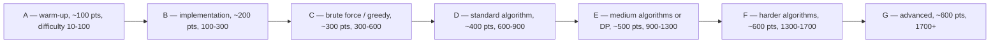

# AtCoder Guide

## Overview

AtCoder is the Japanese contest platform with the highest signal-to-noise ratio in competitive programming: problems have short, precise statements, editorials are published the same day for free, and the weekly Beginner Contest fits an Indian student's evening (21:00 JST is 17:30 IST). This page covers the mechanics — contest formats and rated ranges, the performance-based rating, the third-party [AtCoder Problems](https://kenkoooo.com/atcoder) tracker that functions as the ecosystem's backbone, the editorial culture, and the Educational DP Contest that is the canonical dynamic-programming ladder. Theory is not re-taught; DP and probability foundations live in the [DSA track](../dsa/README.md) chapters cross-linked below. The section hub at [Competitive Programming](./README.md) places this platform in the broader four-phase roadmap.

## Contest Formats

### ABC, ARC, and AGC

Three contest series carry the rating system, each with a rated ceiling — the maximum rating that contest's results can affect.

| Series | Cadence | Tasks | Rated up to | Character |
|---|---|---|---|---|
| Beginner Contest (ABC) | Almost every Saturday, 21:00-23:00 JST | 7 tasks A-G in recent rounds | 1999 | The mass track: implementation and standard algorithms; the placement-relevant band |
| Regular Contest (ARC) | Less frequent, a few per year in recent seasons | 6-7 tasks | 2799 | Middle tier: deeper algorithmic cores, fewer gimmicks |
| Grand Contest (AGC) | Roughly every two months | ~6 tasks | Rated for all (2800+ included) | The hardest problems on the platform; olympiad-adjacent creativity |

The rated-ceiling mechanic means a 1200-rated contestant gains nothing by grinding AGC problems *for rating*, but the problems remain fair game for learning. In recent ABCs the seven tasks are scored roughly 100 through 600 by index, and solving A-C or A-D inside the clock is the band that maps directly onto placement OAs. Exact task counts and scores drift by round, so read the contest top page before starting rather than assuming from memory.

### What Each Series Is For

The practical reading of the table for a placement candidate: the ABC is your weekly habit and your measurement instrument, the ARC is a mid-tier benchmark you attempt once green-to-cyan, and the AGC is a spectator sport until yellow, at which point its A-B slots become the best state-design training available. Because the ABC repeats weekly with a stable task structure, it is the only contest in the ecosystem that can serve as a genuine longitudinal metric — same format, same duration, same difficulty ramp every week. Use that stability: track your A-E completion pattern across months and let it, not vibes, decide when to move up a practice band. The other series then become checkpoints rather than habits.

### The Task-Slot Structure

An ABC is a designed difficulty ramp, and knowing the ramp lets you budget the 100 minutes deliberately.

### Schedule and the IST Clock

The Saturday 21:00 JST start converts to 17:30 IST — the friendliest prime-time slot among all major platforms, with no college-morning collision. Contests run 100 minutes for ABC; ARC and AGC run 100-120 minutes depending on the round. Registration is not required in advance: you simply enter the contest page and submit, which removes one failure mode Codeforces users know well. Timezone conversion mistakes are still possible (JST is UTC+9 with no daylight saving), so fix the calendar entry once via the [AtCoder contest list](https://atcoder.jp/contests) or a tracker and stop doing mental math weekly.

### Corporate and Sponsored Rounds

Beyond the three series, AtCoder hosts company-sponsored rounds — Panasonic, KEYENCE, and other recurring sponsors put their names on many ABCs and ARCs — and these follow standard rules and count for rating unless the top page says otherwise. The problems in sponsored rounds are usually indistinguishable in style from the host series, since the platform's setters maintain quality control across the calendar. Rarely, a sponsor runs its own recruiting contest on the platform's judge; treat those exactly like the hiring contests described on the [hub page](./README.md): free scheduled practice with a possible hiring tail. Always skim the contest top page for the rated range and duration before the clock starts, since special rounds occasionally deviate from the table above.

### Scoring and Penalties

AtCoder ranks by total score first and total elapsed time second, with one penalty rule: each wrong submission on a task adds 5 minutes to your elapsed time on that task. Unlike Codeforces regular rounds, your score itself does not decay with time, so there is no incentive to delay submissions — submit the moment your samples pass. The 5-minute penalty is small enough that risky fast submissions are often correct strategy, but large enough that random resubmission spam costs rank. The behavioral lesson for interviews is direct: verify on samples quickly, submit, and move to the next task rather than gold-plating.

### Reading the Standings and Solutions

The live standings show per-task solved counts and times, which are better information than they first appear: a task with a low AC count relative to its neighbors is the round's trap, and skipping it in favor of the next slot is often the rank-maximizing move. During the round, other contestants' code is hidden; once the round ends, submissions become publicly viewable, and reading the short accepted solutions of top contestants is one of the best free learning resources on the platform. Make post-contest reading a standing part of upsolving: compare their implementation against yours, note the constructs you did not know, and adopt the techniques rather than pasting the code. This habit also builds the code-reading fluency that workplace code reviews demand.

## Getting Started: Setup and First Contest

### Account, Handle, and Tooling in One Evening

The setup cost is one evening. Create the account on [atcoder.jp](https://atcoder.jp), pick a professional handle (it appears on resumes), and link the same handle on [AtCoder Problems](https://kenkoooo.com/atcoder) so every future solve is tracked automatically. Choose one language and write a small, memorized template — most AtCoder tasks provide a single dataset per file (unlike recent Codeforces rounds that feed multiple test cases per input), so the template can be almost trivial. Calendar the weekly ABC with a recurring reminder set 30 minutes before 17:30 IST, because the only irrecoverable mistake on this platform is missing the two-hour window itself.

### A First-Contest Checklist

Walk into the first ABC with a plan, not hopes. Solve A and B immediately and verify against every sample before submitting — the first thirty minutes decide whether the round is pleasant. Read all task statements in the first ten minutes even if you cannot solve them all: C is often easier for a particular reader than B, and the solve order should be chosen, not assumed. If stuck past fifteen minutes on a single task, switch; the penalty system does not reward sunk cost. Afterward, regardless of score, upsolve the next unsolved task within 48 hours using the editorial protocol below — the first contest's purpose is to calibrate the loop, not to post a number.

### How a Round Actually Unfolds

A minute-by-minute shape for a cyan-bound solver in a standard ABC: minutes 0-10, read all seven statements and rank them by expected solve time; minutes 10-40, clear A, B, and the friendlier of C/D; minutes 40-70, attack the remaining mid slot, watching its AC count for trap signals; minutes 70-95, either the E attempt or stress-testing the nearly-finished tasks, whichever has higher expected value; final 5 minutes, submit everything that passes samples — a late 5-minute penalty is cheaper than a zero. This shape is a template, not a script; strong implementation days shift everything earlier. Recording your own actual minute marks after each round is the cheapest performance review available, and its trends (slow reading, slow verification, rabbit-holing) are exactly the behaviors OA performance punishes.

## Rating System and Colors

### The Color Bands

AtCoder's ladder uses colors with well-known boundaries, and the same palette reappears in the Problems tracker's difficulty visualization, so one vocabulary covers both.

| Rating | Color | Field meaning |
|---|---|---|
| 0-399 | Gray | Learning the language and statement reading |
| 400-799 | Brown | A-B slots reliably; C usually |
| 800-1199 | Green | C consistently, D sometimes |
| 1200-1599 | Cyan | D in-contest; the solid-student band |
| 1600-1999 | Blue | E in-contest; comparable to Codeforces Expert in field perception |
| 2000-2399 | Yellow | F in-contest; strong competitive resume item |
| 2400-2799 | Orange | G and F under pressure |
| 2800-3199 | Red | AGC solvable territory; rare |
| 3200+ | Silver, Gold at 3600+ | Top-of-ladder; internationally competitive |

### Performance and Convergence

AtCoder's rating is performance-based: each contest assigns you a performance value — the rating at which your expected rank equals your actual rank — and your rating moves toward it in steps that shrink as you play more contests. Schematically:

\\[
R_{\\text{new}} = R_{\\text{old}} + k \\cdot (P - R_{\\text{old}}), \\quad k \\text{ shrinks as your contest count grows}
\\]

where \\( P \\) is the round's performance and \\( k \\) the convergence weight; the official rating-system document specifies the exact weights, and the schematic captures the shape. Two consequences matter for planning. First, early contests move rating violently — a good first ABC can jump a new account several colors — so early numbers overstate and understate equally. Second, rating converges to the performance you can sustain, not the performance you hit once; grinding 50 contests in a semester does not beat 30 contests with real upsolving between them.

### What Each Band Can Actually Solve

Bands translate into task slots. Brown-green solvers handle A-C, which is exactly the OA band for mass recruiters and most service companies. Cyan solvers add D in-contest, matching product-company OA difficulty including the medium-hard finale. Blue solvers add E, which is beyond nearly every OA requirement and signals genuine competitive skill. The placement-relevant target is cyan-to-blue (1200-1999), and the fastest route to it runs through the DP contest and practice plans below rather than through raw contest volume.

## AtCoder Problems: The Ecosystem's Backbone

### Why a Third-Party Site Is Load-Bearing

The official AtCoder site lacks the two features a serious practitioner needs: per-problem difficulty estimates and historical solve-rate statistics. [AtCoder Problems](https://kenkoooo.com/atcoder), an unofficial tracker by kenkoooo, provides both, plus account-integrated progress tracking, and it has become the de facto frontend for all structured AtCoder practice — most community practice plans and study tables link to it rather than to the native contest pages. If you do one setup step on this platform, link your AtCoder handle there; every solve you make is then tracked automatically.

### Difficulty Ratings and Solve Rates

Every problem on the tracker carries a difficulty integer fitted from historical solve data, visualized with the same color palette as the rating ladder (gray through red). Alongside it sits the solve-rate percentage — the fraction of contestants who solved it, which is the fastest difficulty sanity check available: a 300-difficulty task with a 60% solve rate is a warm-up, while a 300-difficulty task with an 8% rate is a trap to skip during a live round. Difficulty values are estimates from community behavior, not ground truth, and occasional mislabels are part of the deal. The workflow this enables is identical to Codeforces tag-band drilling: pick a difficulty band (say 800-1200), filter, and work front-to-back.

### A Daily Workflow Through the Tracker

A concrete daily loop that uses the tracker properly: open your user page and read the difficulty chart to find your current frontier band; pull five problems from the table generator one band above it; solve with a 30-40 minute cap each; and log every miss with the technique you lacked. Weekly, run one virtual contest in place of one problem set, and let the tracker's progress bars — not your memory — decide which band to refill. The tracker also exposes streaks and per-band completion counts, which are process metrics you control; check those weekly and your rating once a month. This is the same measure-process-not-outcome discipline the [Codeforces guide](./codeforces-guide.md) recommends, implemented with better tooling.

### Virtual Contests and the Table Generator

Two tracker features convert the archive into a curriculum. Virtual contests re-run past ABC/ARC/AGC rounds under a live timer with the original standings, which is the cleanest rehearsal for the real Saturday event and for hiring-contest conditions. The table generator builds a custom practice table from any filter combination — difficulty range, task slot (A-G), date range, contest series — which is how the famous "ABC C-D band" and Educational DP Contest tables circulate in study groups. A weekly routine that works: one live ABC, one virtual, one table-driven session on your weak band, with the solve log kept wherever you track the rest of your preparation.

## Editorial Culture

### Same-Day, Free, Pedagogical

AtCoder publishes official editorials for every contest — including the weekly ABC — on the round's page, free, typically within hours of the end. The editorials are written to teach: they state the intended complexity, justify the key observation, and often show the implementation skeleton rather than just the final answer. Many rounds additionally have streamed explanations and community write-ups within a day. This is the platform's single biggest advantage for a self-taught student: the feedback loop from stuck to understood is measured in hours, not weeks, and it is why the [Codeforces guide](./codeforces-guide.md) cross-references AtCoder for cross-training.

### Community Layers Around the Editorials

Around the official editorials sits a community layer that multiplies their value. Japanese and English write-ups (blogs, note.com articles, YouTube walkthroughs) appear within days for most rounds, and high-rated contestants post their implementations publicly once the round ends, giving you reference code for every task. Community-curated lists — "best ABC problems by technique" tables and the tracker's popularity filters — save you from building syllabi from scratch. The etiquette rules are simple and worth stating: attempt before reading, credit authors when you share, and prefer official editorials as the canonical source when versions disagree. This layered feedback culture is a large part of why AtCoder-colored candidates tend to have unusually clean technique foundations.

### Reading an Editorial Without Ruining the Solve

The same-day availability creates a temptation: read at the first minute of discomfort, which converts practice into reading comprehension. The protocol that preserves learning: attempt cold for 30-45 minutes; if stuck, read only until the first idea appears, then close the tab and develop it yourself; implement from memory; and only then read the full editorial to verify. Log the problem for a cold re-solve in two weeks. The one exception is a contest you treat as pure exposure (an AGC as a cyan solver) — there, reading everything afterward is legitimate study, clearly labeled as such in your own plan.

## The Educational DP Contest A-Z

### The Canonical DP Ladder

The Educational DP Contest (universally "EDPC") is 26 tasks lettered A-Z, one per dynamic-programming technique, ordered roughly by difficulty — and it is the single most recommended DP ladder in competitive programming. The table below maps selected tasks to their technique and the theory companion in this book; work the theory chapter alongside the task pair, not after all 26.

| Task | Technique | Theory companion in this repo |
|---|---|---|
| A, B | Linear sequence DP (Frog 1/2) | DP fundamentals chapters in the [DSA track](../dsa/README.md) |
| D, E | Knapsack variants (value- versus weight-indexed) | DP fundamentals |
| F | Longest common subsequence | DP fundamentals |
| G | Longest path on a DAG | Graph algorithm chapters |
| I, J | Probability and expected-value DP | [Probability and Expected Value DP](../dsa/chapters/ch114-probability-dp.md) |
| M | Prefix-sum-optimized counting (Candies) | DP optimization pattern |
| O, U | Bitmask DP (matching, grouping) | [Profile DP](../dsa/chapters/ch113-profile-dp.md) |
| P, V | Tree DP (independent set; rerooting) | Tree algorithm chapters |
| S | Digit DP (sum of digits) | Profile DP chapter's state-design section |
| Z | Convex hull trick (Frog 3) | [Convex Hull Trick](../dsa/advanced/convex-hull-trick.md) |

### How to Ladder Through It

Treat EDPC as a course with a pass condition per letter: solve the task unaided in under 45 minutes, or fail it, read editorial-by-paragraph, re-implement from memory, and re-solve cold in two weeks. Skipping is allowed — L (deque game), T, and W are specialist detours — but every task you skip should be a deliberate choice, not fatigue. The protocol makes every letter either a clean solve or a documented recovery, never a passive read.

A realistic pace alongside coursework is 3-5 tasks per week, finishing in six to nine weeks; the payoff shows up immediately in both Codeforces C-D slots and OA DP questions. EDPC also pairs naturally with the CSES Dynamic Programming section from the hub's Phase 3: same techniques, different statement style, and doing both cements recognition instead of memorization. Difficulty along the ladder rises smoothly through M, then jumps sharply at O-T; a cyan solver should expect to complete A-M comfortably, fight for N-R, and treat S-Z as a second-pass curriculum after a month of other material. Do not judge yourself by letters completed alone — a cold re-solve of a previously-failed task is worth more than a new letter.

### Beyond EDPC: The Other Structured Sets

EDPC is the entry point to a family of curated ladders on the platform. The "Typical 90 Problems" set (a 90-problem curated course published in 2021 with editorials and difficulty tags) extends the same idea across tags beyond DP, and is the natural sequel once EDPC's first half is done. The past-ABC archive, filtered through the tracker by slot and difficulty, functions as a third set: twenty C-slots from consecutive weeks train pattern recognition better than any single marathon. Rotate among the three rather than exhausting one — variety of statement style is itself training for the disguised problems interviews present. Whichever set is active, keep the same pass condition and log; the sets differ, the discipline does not.

## Common Beginner Mistakes

### Treating Every Task as Mandatory

The ABC ramp is a menu, not a checklist: the standings' per-task AC counts tell you which tasks are the round's traps, and rank-maximizing play frequently means skipping a stuck C to secure D. Beginners anchor on letter order and burn forty minutes on one stubborn task while two easier slots sit unread. The fix is procedural: read everything in the first ten minutes, order by expected solve time, and re-evaluate after each submission. The same triage skill is exactly what a multi-question online assessment demands, so practicing it weekly is double-duty training.

### Grinding Above the Rated Ceiling Too Early

Because AGC problems are famous, beginners attempt them for practice months before the underlying techniques exist — and learn mostly that they cannot solve them. The correct ladder uses tasks at or slightly above your band (the tracker's difficulty numbers make this objective) and adds AGC A-B problems only from the yellow band onward, when the state-design and counting foundations are in place. Reading an AGC editorial for exposure is fine and even useful; burning a two-hour session failing one is not. The same logic applies to top-band archive problems on any platform — scarcity of skill, not of problems, is the constraint.

### Ignoring the Solve-Rate Signal

The tracker's solve-rate percentage is live field data about a task's difficulty, and ignoring it during a contest is a common self-inflicted wound. A C-slot task with an unusually low AC count for its position is a designed trap; the rank-maximizing move is usually to read the next statement and return later. After the round, comparing your subjective difficulty against the recorded solve rates recalibrates your instincts faster than any amount of guessing. Use the same percentage before contests too: a practice task at your target difficulty with a 3% solve rate is the wrong practice task.

## Practice Plans by Level

The three plans below assume the hub's four-phase roadmap and 6-10 hours per week; the tracker's table generator supplies the problem lists for each.

| Level (current color) | Weekly diet | Exit milestone |
|---|---|---|
| Beginner (gray-brown, under 800) | Live ABC A-C + full upsolve; 2 table sessions in the 100-500 band; one virtual per fortnight | A-C inside 60 minutes in a live ABC |
| Intermediate (green-blue, 800-1999) | Live ABC full attempt; EDPC A-Z ladder; one table session in the 800-1200 band; one virtual per week | D in-contest, then E in-contest |
| Advanced (yellow+, 2000+) | Live ABC E-G; AGC A-B attempts; editorial-first study of AGC classics | E consistently; AGC A-B inside contest |

Two rules keep any of the plans honest. First, upsolve within 48 hours exactly as on Codeforces — the same-day editorials make AtCoder the best platform to build this habit. Second, keep one cross-platform session weekly (Codeforces Div 2 A-C or CSES) because AtCoder's house style is clean-algorithmic, and OAs often include messier implementation-heavy tasks that the ABC ramp under-trains.

Level transitions should be driven by the exit milestones, not the calendar: a beginner who clears A-C inside 60 minutes three rounds in a row has earned the intermediate plan early, and an intermediate stuck below 1600 after three months should lengthen the DP ladder rather than add contest volume. Coordinate the plans with the hub's six-month table by mapping this page's levels onto its phases — beginner is Phase 1-2 material, intermediate is Phases 3-4, advanced is post-offer skill maintenance. The mapping matters because the failure mode of parallel plans is doing Phase 4 contests without the Phase 2 algorithm layer underneath them.

### Fitting the Plans Around College

Semester reality, not the ideal calendar, decides outcomes, so budget for degradation. During exam weeks, drop to a single weekly action — one live ABC or one table session — rather than pausing entirely, because a two-week gap costs more to recover from than two reduced weeks. Protect the Saturday 17:30 IST slot above all other practice; it is the shortest activity with the highest information content. When a week collapses completely, run one virtual round to re-enter instead of skipping the platform until motivation returns.

## Why AtCoder Transfers to Interviews

### Statement Hygiene as a Skill

AtCoder statements are two to five sentences, define every term, and hide nothing — and practicing on them trains you to extract the complete specification in one pass. Interviews invert the setup (under-specified, you must ask), and the AtCoder-trained candidate is precisely the one who notices which specification details are missing. The skill generalizes further: reading a ticket, a bug report, or a design doc all reward the same one-pass extraction habit that hundreds of terse statements build. The difficulty band A-D covers the OA and phone-screen space almost exactly: one clean idea, no adversarial constraints, correctness plus speed. E-F problems overtrain relative to interviews, which is the right direction of error.

### Mapping Tasks to Interview Rounds

The rough mapping, hedged: ABC A-B ≈ OA easy and aptitude-adjacent coding; ABC C-D ≈ OA medium and phone-screen warmups; ABC E-F ≈ onsite medium-hard where the algorithm is standard but the implementation must be flawless. LeetCode remains the better platform for company-specific drilling (see the [LeetCode archive page](./leetcode-archive.md)), but AtCoder is the better teacher of the underlying algorithm, and candidates who do both report the interview variants feel like AtCoder problems with extra ceremony. For product companies that reuse standard archetypes, the C-D band plus the DP ladder covers most of the syllabus you will face.

### What Does Not Transfer

Honesty about the limits keeps the plan balanced. AtCoder under-trains messy implementation: real OAs often include malformed-input handling, output-format ceremony, and long simulation problems that the clean ABC statements never present. It also under-trains language-specific performance tuning, since the judge's limits are generous relative to Codeforces. And the interview layers — communication, clarifying questions, behavioral framing — are simply absent from any contest format. The fix is the hub's Phase 4 pairing: one AtCoder session for clean algorithms, one Codeforces or LeetCode session for mess and speed, plus dedicated interview communication practice elsewhere in this book.

### The OA Simulation Trick

Virtual ABCs double as full-length online-assessment rehearsals: 100 minutes, proctored by a timer you cannot pause, with a scoring curve that punishes partial effort. Once a fortnight, replace a practice session with a virtual round taken under OA rules — no IDE autocomplete help you would not have in the real test, one monitor, no notes. Review the recording of your own behavior afterward: where did you stall, when did you verify, did you leave easy points on the table? Candidates who have taken fifteen such simulations report that real OAs feel routine, which is the entire goal. The [contest calendar page](./contest-calendar-codelist.md) helps you slot these simulations around live rounds.

## Interview Questions

1. **Why pick AtCoder over Codeforces for placement preparation?** AtCoder's advantages are statement quality, same-day pedagogical editorials, and an IST-friendly Saturday slot; Codeforces' advantages are rating recognition, archive size, and adversarial difficulty. For a placement-bound student the pragmatic split is AtCoder as the weekly rhythm and teacher (A-D band, EDPC ladder) with Codeforces rounds added for speed and messiness tolerance. Rating recognition favors Codeforces at product companies and especially quant firms, so portfolio-minded students eventually want both handles. The hub's platform table summarizes the trade.
2. **What does the rated-ceiling rule mean in practice?** ABC rounds affect ratings only up to 1999, ARC up to 2799, and AGC for everyone including 2800+. Practically, once you pass a series' ceiling, that series' results stop moving your rating — a yellow solver gains nothing rated from an ABC finish. The problems remain fully worth solving for training; only the rating incentive changes. This is why high-rated contestants keep entering weekly ABCs: the practice value survives the rating cap.
3. **What is AtCoder Problems and why is it treated as part of the platform?** It is an unofficial tracker at kenkoooo.com/atcoder that adds what the official site lacks: per-problem difficulty estimates fitted from solve data, solve-rate percentages, account-integrated progress tracking, virtual contests, and a table generator for building practice lists. Nearly every community practice plan routes through it because the official site has no equivalent. Treat it as the frontend and the official site as the judge. The dependency is a real risk if the tracker disappears, but it has been the ecosystem's backbone for years.
4. **How does the Educational DP Contest map to interview preparation?** EDPC assigns one DP technique per letter — knapsacks, LCS, digit DP, bitmask, tree DP, expected value — and orders them by difficulty, making it a complete, graded syllabus. Interview DP questions overwhelmingly sample the same techniques at A-M difficulty, so 20 hours across the ladder covers the interview DP space with margin. Pair each task with the matching theory chapter (profile DP and probability DP pages in the DSA track) rather than pattern-matching blindly. The pass condition — unaided solve in 45 minutes or a documented editorial-guided re-solve — keeps it honest.
5. **A candidate is cyan (1400). What does that signal to an interviewer?** Cyan means D-slot tasks fall in-contest: standard algorithms recognized and implemented cleanly under a 100-minute clock. It maps roughly to Codeforces Specialist-Pupil and to consistent OA-clearing performance, with strong phone-screen odds. It is a good line item but not a headline; the headline bands begin at blue (1600) — comparable to Codeforces Expert in field perception. Like any rating, it is a screening signal that invites a live check, so prepare two narratable problems.
6. **How should AtCoder practice be scheduled against an Indian placement calendar?** Treat the weekly ABC as the fixed spine: it is always Saturday 17:30 IST and requires no registration, so it survives even heavy college weeks. Layer the EDPC ladder and tracker-driven band drilling on weekdays, and replace one live round per fortnight with a virtual round run under OA conditions. In the eight weeks before interview season, taper contests to maintenance volume and shift the weekday sessions toward LeetCode company tags. The hub's six-month table gives the month-by-month split.

## Key Takeaways

- The weekly ABC (Saturday 21:00 JST = 17:30 IST, 100 minutes, tasks A-G) is the friendliest and cleanest rated contest in the ecosystem for Indian students.
- Rated ceilings are ABC ≤ 1999, ARC ≤ 2799, AGC for everyone; the A-D band is the placement-relevant zone and the ladder to it runs through practice, not AGC grinding.
- Rating moves toward performance with shrinking steps; early swings overstate, and sustained performance — driven by upsolving — is what a rating eventually measures.
- [AtCoder Problems](https://kenkoooo.com/atcoder) is the ecosystem's backbone: difficulty integers, solve rates, virtual contests, and the table generator that every practice plan routes through.
- Same-day official editorials make AtCoder the best place to build the 48-hour upsolve habit; the discipline is to read them only after a genuine cold attempt.
- The Educational DP Contest A-Z is the canonical DP ladder for interviews — pair it with the DSA track's profile-DP and probability-DP chapters.
- AtCoder problems transfer to interviews because their statements are short and complete and their algorithms are clean: it trains specification extraction, which under-specified interview questions reward.
- Level transitions follow exit milestones (A-C inside 60 minutes, then D, then E in-contest), never calendar optimism; the tracker's difficulty bands make the transitions objective.

## References

- [AtCoder](https://atcoder.jp) — main site, contests, and official same-day editorials
- [AtCoder contest list](https://atcoder.jp/contests) — schedule and past rounds
- [AtCoder Problems](https://kenkoooo.com/atcoder) — unofficial tracker: difficulties, solve rates, virtuals, table generator
- [Codeforces](https://codeforces.com) — the complementary platform for adversarial rounds and the larger archive
- [CSES Problem Set](https://cses.fi/problemset) — the paired topic ladder (especially the DP section)
- *Competitive Programmer's Handbook*, Antti Laaksonen — free at [cses.fi/book/book.pdf](https://cses.fi/book/book.pdf); its DP chapter is the theory companion to the EDPC ladder
- *Guide to Competitive Programming* (Springer, Laaksonen) — deeper treatment of the same techniques

## Cross-References

- [Competitive Programming hub](./README.md) — the platform landscape and four-phase roadmap this guide serves
- [Codeforces guide](./codeforces-guide.md) — the complementary rated platform; cross-training split explained there
- [Profile DP (Broken Profile DP)](../dsa/chapters/ch113-profile-dp.md) — theory companion for EDPC's bitmask and state-design tasks
- [Probability and Expected Value DP](../dsa/chapters/ch114-probability-dp.md) — theory companion for EDPC I and J
- [Convex Hull Trick](../dsa/advanced/convex-hull-trick.md) — theory companion for EDPC Z
- [Sliding window pattern](../interview/coding/pattern-sliding-window.md) — the interview pattern most rehearsed by the ABC C-D band
- [Quant prep hub](../quant-prep/README.md) — where fast, clean problem-solving under a clock is tested again
