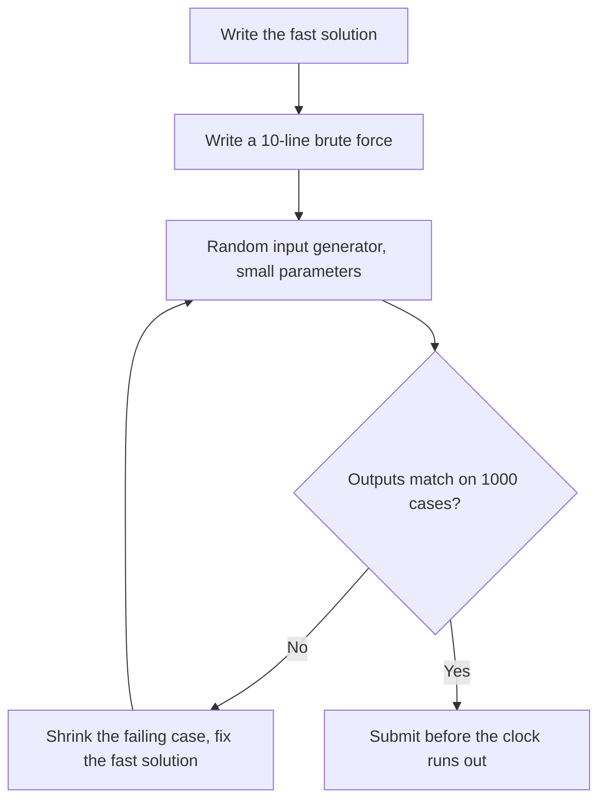
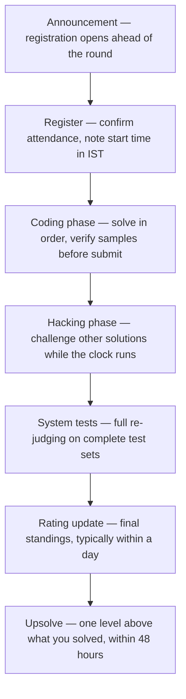

# Codeforces Guide

## Overview

Codeforces is the highest-signal rated contest platform for Indian placement prep: rounds run several times a month, the Elo-style rating is the most widely recognized by recruiters, and the problem archive exceeds ten thousand tagged, difficulty-rated problems. This page covers the mechanics you need to operate on the platform — contest formats and their scoring quirks, how the rating update actually behaves, how to filter the archive into a syllabus, the free EDU courses, the hack/challenge system, and the official API — and ends with a hedged reading of what the rating is worth on a resume. Algorithm theory is not re-taught here; the [DSA track](../dsa/README.md) chapters carry that load. The section hub at [Competitive Programming](./README.md) explains where this platform sits in the four-phase roadmap.

## Contest Formats and Rounds

### The Round Types

Codeforces runs several distinct round types, and each trains a slightly different skill. The table below reflects the platform's standing formats; exact durations and problem counts vary per announcement, so always read the announcement before the round.

| Round type | Typical audience (rated range) | Duration | Distinctives |
|---|---|---|---|
| Div. 2 | The main student track, roughly below 2100 | ~2 hours, 5-6 problems | Standard scoring; hacks during the round; the canonical practice format |
| Div. 3 | Newer contestants, below ~1600 | ~2 hours, 6-8 problems | Open hacking during the round; announcements state rating is not decreased; longer statement margins for beginners |
| Div. 4 | Absolute beginners, below ~1400 | ~2 hours, 6-8 problems | Same protective rule as Div. 3; simplest problem sets |
| Div. 1 | Roughly 2100+ | ~2 hours | Hardest regular rounds; usually combined with Div. 2 as a "Div. 1 + Div. 2" event |
| Educational | Everyone (rated for all) | ~2 hours, 6-7 problems | 12-hour open-hack phase after the round; hacks do not affect the live standings |
| Global | Everyone (rated for all) | ~2h15m | Monthly prestige round with prizes; one of the strongest fields outside Div. 1 |

### Registration, Rooms, and the IST Clock

Most rated rounds require pre-registration through the [contests](https://codeforces.com/contests) page, typically opening hours to a day in advance; failing to register is the classic lost round. Standard rounds start at 20:05 UTC (01:35 IST next day for many slots, which collides badly with college mornings — this is why Div. 3 rounds and AtCoder's 21:00 JST/17:30 IST slot matter for Indian students). During the round you are placed into scoring rooms, and hacking is only possible within your room for regular formats. Check in ten minutes early, keep your template open, and remember that the standing you see during the round is pretest-only — plan the last twenty minutes for your own stress tests rather than a desperate attempt at the next slot.

### Score Penalties and Rating Protection

Two rules separate the formats, and knowing them changes submission strategy. In regular Div. 1/2 rounds, problem scores decay with time and a wrong submission on a problem costs additional points from that problem's score, so a careless submit is expensive — verify on the samples before every submission. In Educational rounds, the announcements state that wrong submissions do not reduce the score (only the time-decay applies), which makes them the better venue for experimenting with risky ideas. On the rating side, Div. 3 and Div. 4 announcements state that a participant's rating will not be decreased in those rounds, a deliberate protection for beginners; Educational and Global rounds carry no such protection and your rating moves both ways there.

### The Standing Freeze and System Tests

Most rounds publish standings live, but final correctness is only established at system testing, when every submission is re-judged on the full hidden test set (during the round, submissions are validated on pretests only). Pretests exist to catch gross errors cheaply; passing them is no guarantee of acceptance, which is why veterans stress-test their own solutions against worst-case inputs before the clock ends. This pretest/full-test gap is the single biggest source of "it worked in the round, then fell" stories, and internalizing it — write your own brute-force cross-check when stakes are high — is one of Codeforces' best transferable lessons for OA testing.

## Rating System Mechanics

### The Elo-Style Core

Codeforces rating is a modified Elo system operating on ranks rather than pairwise matches: the platform computes the rank you were expected to finish at given the field's ratings and your current rating, then adjusts you toward your actual rank. The pairwise building block has the familiar chess form, where \\( R_a \\) is your rating, \\( R_b \\) an opponent's, and \\( E \\) the expected probability of finishing ahead:

\\[
E = \\frac{1}{1 + 10^{(R_b - R_a)/400}}
\\]

Summing expectations over the whole field produces your expected rank; the gap between expected and actual rank drives the delta, with stronger fields amplifying the reward for a good finish. New accounts start at 1400 and move with large uncapped deltas for the first rounds while the system converges, which is why early graphs swing wildly. Established accounts face a cap on per-round deltas — a single round cannot catapult you several bands regardless of performance.

### Why Your Rating Fluctuates

Rating dips are mostly variance, not regression in skill, and the mechanics explain why. Your performance on a given day is noisy (problem-set fit, speed, one silly bug), and the system re-estimates from that noisy sample every round. A red coder losing 40 points in one Educational round has not gotten worse; the field was strong and their rank landed slightly below expectation. Because deltas are larger relative to rating for lower-established accounts, mid-band contestants see bigger swings, which feels worse than it is. The practical protocol after any drop: check whether the round type was rated-all (Educational/Global) versus protected (Div. 3/4), look at your actual rank percentile, and only then decide whether a skill gap was exposed.

### Breaking the Plateau

Almost every climber stalls at some band — 1400 and 1700 are the famous walls — and the plateau is usually a technique gap, not a speed gap. The diagnostic: look at your last ten rounds and classify every unsolved problem by its tag; the tag appearing most often is the syllabus for the next month. Plateau breakers that work in practice: one month of single-tag drilling in the archive (10-15 problems, continuous difficulty band), upsolving one level above your solve line after every round, and switching round types for variety (Div. 3 for confidence, Educational for standard-technique reps). What does not work: grinding more rounds with the same preparation, which just re-measures the same gap weekly.

### Realistic Climb Timelines

Field observations from the Indian competitive community, hedged heavily: with 8-12 focused hours per week, Pupil-Specialist (1200-1599) typically lands within 3-6 months of serious archive practice, and Expert (1600+) within 8-14 months. Candidate Master (1900+) usually takes another year on top of Expert and is a genuinely competitive resume item, not a checkbox. These are not promises — variance across individuals is enormous, and the compounding variable is upsolving discipline (covered below), not raw contest count. Plan placement season backwards from an honest milestone: Expert is ambitious-but-plausible for a six-month run; Specialist is the realistic floor for the same effort.

## Language Choice and Setup

### C++ Versus Python

C++ dominates high-rated Codeforces for structural reasons: the time limits are set assuming C++ speed, so a Python solution at the complexity limit can fail where the same algorithm in C++ passes. That said, placement-relevant bands (Div 2 A-C) are solvable in Python comfortably, and Python's expressiveness speeds up string and hashing work. The honest rule: if your target is Expert (1600+) and beyond, invest in C++ early; if your target is OA performance at service and product companies, Python is a legitimate choice and switching languages mid-preparation is more costly than any language disadvantage. Pick once, in week one, and stay.

### A Minimal Template

A short, memorized template removes setup friction and eliminates the most common I/O speed bugs. Resist the temptation to import a giant competitive library you did not write; in interviews you cannot bring it, so it hides gaps the template should be exposing.

```cpp
#include <bits/stdc++.h>
using namespace std;

void solve() {
    int n;
    cin >> n;
    cout << n << "\n";  // replace with the actual logic
}

int main() {
    ios::sync_with_stdio(false);
    cin.tie(nullptr);
    int t = 1;
    cin >> t;              // most recent rounds: t test cases per file
    while (t--) solve();
    return 0;
}
```

The two I/O lines matter more than they look: untying `cin` from `cout` and disabling C-streams synchronization is the difference between passing and timing out on high-volume test files. Everything else in the template is deliberately boring. Build the habit that all logic lives in `solve()` with explicit local variables, because that same hygiene is what interviewers want to see on a whiteboard.

### Reading Your Own Graph

Your rating graph tells a story if you know the vocabulary. Flat stretches with weekly sawtooth movement mean stable skill and stable variance — normal; a rising staircase with periodic dips means upsolving is working; a long decline usually means a round-type change (new Educational emphasis) or a preparation pause, not skill decay. Cross-reference each spike with the specific problems of that round: a spike after a number-theory-heavy problemset tells you your recent archive drilling is paying off. Reviewing the graph monthly — with the round problems attached — is a ten-minute exercise that keeps the six-month plan honest.

## The Problem Archive and EDU Courses

### Filtering the 10,000-Problem Set

The [problemset](https://codeforces.com/problemset) holds over ten thousand problems, each carrying tags (data structure or technique labels), a solved-count, and — since the difficulty-rating feature — an integer difficulty roughly in the 800-3500 range computed from community solve outcomes. The archive workflow that actually builds skill: pick one tag you are weak in, sort by difficulty ascending, and solve 10-15 problems in a continuous band (for example, DP from 1200 to 1700) before moving on. Sorting by solved-count descending gives the "greatest hits" list that every veteran has seen, which is efficient for high-yield classics but skews old; tag-plus-difficulty filtering is the better default. Problems added to your personal list should come from this filtered view, not from the front page of the archive.

### A Tag Syllabus for Placement Prep

Not all ten thousand problems are equally relevant to interviews. The table below is the placement-weighted subset — roughly 150-250 well-chosen problems cover it — ordered by how often each tag appears in Indian OA and interview settings.

| Tag family | Why it matters for placements | Target difficulty band |
|---|---|---|
| two pointers, sliding window | The most recycled OA archetype | 1000-1500 |
| binary search (including on the answer) | The second most recycled archetype; frequent follow-up material | 1100-1700 |
| prefix sums, hashing | Speed layer underneath every easy OA problem | 800-1400 |
| greedy, sorting-based arguments | Standard B/C slot content; tests proof instincts | 1000-1600 |
| elementary DP (knapsack, LIS, grid) | The medium-to-hard OA finale | 1200-1800 |
| graphs (DFS, BFS, shortest paths) | Appears in product-company OAs and machine coding variants | 1300-1800 |
| basic number theory (gcd, primes, modular) | Crossover with aptitude and competitive math | 1200-1700 |

### Beyond Codeforces: Cross-Training Days

The archive is deep but has a house style — adversarial small constraints, heavy implementation, tricks tuned for hacking. One session per week on a different ecosystem counterbalances it: the [AtCoder](./atcoder-guide.md) Beginner Contest's C-E slots drill clean algorithmic cores, and the static [CSES](https://cses.fi/problemset) ladder guarantees you meet every fundamental at least once. Cross-training also hedges the resume, since AtCoder colors are increasingly recognized alongside Codeforces titles. The hub's roadmap assigns CSES as the daily surface for exactly this reason.

### EDU Courses

The [EDU section](https://codeforces.com/edu/courses) hosts free, structured courses with video lectures and auto-graded problem sets — the segment tree course (two parts), binary search, and the two pointers course are the long-standing ones, and they are the fastest way to convert theory from the DSA chapters into working implementations. Each course interleaves short lectures with graded exercises, so you cannot passively watch; the grader enforces the same correctness discipline as contests. A sensible pairing is one EDU course alongside the matching DSA chapter — the chapter gives the proof and the variants, the EDU course gives the implementation reps. Treat EDU as Phase 2/3 material in the hub's roadmap; it is not where a brand-new coder should start.

## Practice Ladder: Div 2 A Through C

### What Each Slot Tests

Div. 2 rounds order problems roughly by difficulty, and each slot probes a different layer of skill. The progression below is the standard ladder for placement-bound students; solving A-C inside the clock is the milestone that maps directly onto OA performance.

| Slot | Skill tested | Typical difficulty | Target time | Failure mode |
|---|---|---|---|---|
| A | Careful reading plus direct implementation | ~800 | ≤ 5-8 min | Misreading the statement; overcomplicating a one-liner |
| B | One observation: parity, sorting order, greedy exchange | ~1000-1200 | ≤ 10-15 min | Coding the brute force instead of finding the observation |
| C | Constructive reasoning or elementary DP/number theory | ~1300-1500 | ≤ 25-30 min | Right idea, buggy implementation under time pressure |
| D | A real algorithmic core (binary search on answer, graphs, data structures) | ~1600-1900 | remaining time | Skipping it entirely; or attempting without the prerequisite technique |

### Milestones by Rating Band

The ladder converts directly into band milestones. Consistently solving A+B inside 30 minutes corresponds to the 1200-1400 band and is enough to pass most mass-recruiter OAs. Adding C inside the hour puts you in the 1500-1700 conversation and covers product-company OAs comfortably. Solving A-D with a credible D attempt is Expert territory and makes contest rounds feel like slightly harder OAs rather than a different sport. Each step is earned in the archive, not in rounds: the round measures, the archive builds.

### The First Six Weeks

Weeks one and two: solve only A slots from the last 20 Div. 2 rounds, under a stopwatch, until five in a row land inside eight minutes; this is reading-speed training, not algorithm training. Weeks three and four: add B slots, first untimed and then timed, and start a log of the one observation each B hinged on. Weeks five and six: attempt C slots with a 40-minute cap, dropping to upsolve mode when the cap expires. By week six you should be entering a live Div. 2 or Div. 3 round weekly, with expectations calibrated to A-B solid and C opportunistic. This ramp deliberately front-loads confidence — early losses to C-slot difficulty are the most common quitting point in the Indian community.

## Stress Testing and Debugging Discipline

### The Brute-Force Cross-Check

The single highest-value debugging skill Codeforces teaches is the stress test: write a trivially-correct brute force, generate random small inputs, and diff outputs until they disagree. The disagreement gives you a minimal failing case in seconds instead of an hour of staring at your own logic. The whole rig is a generator script plus two binaries:

```bash
# compare fast solution against brute force on random inputs
for seed in $(seq 1 1000); do
  python3 gen.py "$seed" > in.txt
  ./fast  < in.txt > out_fast.txt
  ./brute < in.txt > out_brute.txt
  diff -q out_fast.txt out_brute.txt || { echo "MISMATCH seed=$seed"; break; }
done
```

This workflow transfers directly to interviews — when an interviewer asks "how would you test this?", describing a property-based or differential test rig is a strong, concrete answer that most candidates cannot give. It also transfers to workplace debugging, where the same idea runs under the names fuzzing-lite, property testing, or golden-master comparison. Build the rig once in week two and it costs you five minutes per problem thereafter.

### The Loop, Visualized



### Reading Verdict Artifacts

When a submission fails pretests, the platform tells you the test number and, for many rounds, shows the failing input and your output; reading these artifacts is a skill in itself. A wrong answer on a tiny case means logic; on a large case means overflow, boundary, or a missed edge in the constraints. A time-limit-exceeded on early tests means the algorithm class is wrong, while on late tests means a constant-factor fix (faster I/O, fewer reallocations) may suffice. Treat each artifact as a hypothesis generator, not a resubmit button — resubmitting with a changed constant and no hypothesis is how rounds are lost.

## Contest Lifecycle and Upsolving

### The Full Round Lifecycle

A round is a week-long event, not two hours, and the value is concentrated in the parts after the timer ends.



### Missed the Round? Virtual Participation

Every past round on the platform supports virtual participation: the problem set and timer are reproduced, the clock runs live, and you get a realistic experience without the rated stakes. Use virtuals to backfill missed weeks, to re-run a round you slept through (common for 20:05 IST Codeforces starts colliding with college schedules), and to rehearse the full A-to-C ladder under exam conditions before hiring contests. A virtual round followed by genuine upsolving is worth nearly as much as the live event; the only thing missing is the rating number, which is the byproduct anyway. Schedule virtuals on days when no live round fits — the [contest calendar](./contest-calendar-codelist.md) tooling makes the swap painless.

### The 48-Hour Upsolve Window

Upsolving means solving, unaided, every problem you missed, and doing it within 48 hours while the round's context is still warm. The protocol: first re-attack the problem cold for 30-40 minutes; if still stuck, read the editorial one paragraph at a time, stopping at the first idea you can develop yourself; then implement from memory without copy-pasting. Log each upsolved problem with the idea you missed so a weekly review can re-serve it to you — this is the mechanism by which contest participation converts into rating growth. Skipping upsolving is why many students contest for a year and plateau at Newbie; the round itself teaches speed, only upsolving teaches depth.

### What to Upsolve First

Within the 48-hour window, order matters when time is short. First priority is the problem you almost solved — the one where your idea was right but the implementation or one edge case failed, because the marginal learning per minute is highest there. Second is the first problem you completely missed one level above your solve line (usually the C or D slot); it extends your range exactly one step. Third, only if time remains, the hardest problem in the set — reading its editorial passively for exposure is fine, but do not sink hours into material three levels above you. This triage keeps upsolving inside two hours per week while capturing most of the value.

### A Weekly Routine That Fits Placement Prep

A sustainable week during semester: one rated round (2-3 hours with the timer), 2-3 archive sessions of 60-90 minutes on your current weak tag, one EDU course session, and one weekly review that re-solves two logged problems cold and updates the error list. That is 6-9 hours and it compounds. During interview season, invert the ratio toward LeetCode company tags and reduce contests to one every two weeks — maintenance, not growth. The [contest calendar page](./contest-calendar-codelist.md) keeps the schedule honest across platforms and hiring contests.

## Hacks and Challenges

### How Hacking Works

In regular rounds, after solving a problem you may lock your solution and then read other contestants' code in your scoring room and submit a hack: a test input you believe breaks their solution. A successful hack adds points to your score (the amount depends on the problem and timing), while a failed hack does not penalize you in the common formats — the cost is only your time. In Div. 3/Div. 4 and Educational rounds the hacking phase is "open" (anyone can hack anyone, and in Educational rounds it continues for 12 hours after the round without affecting live standings). The points rarely decide your rank, but the activity is disproportionately educational.

### Why Hacking Matters for Interviews

Hacking is deliberate practice in adversarial reading: you scan someone else's code, form a hypothesis about its unhandled case (zero elements, duplicates, overflow at maximum constraints, an unlucky ordering), and construct an input that proves it. That is exactly the instinct interviewers grade when they ask "what breaks on empty input?" or "what happens at the maximum constraint?" — and it is the instinct behind writing good unit tests at work. Ten minutes of attempted hacks per round builds more edge-case paranoia than an hour of reading about testing. If hacking feels uncomfortable, the cheaper variant is the same habit applied to your own submissions before the clock ends.

### Anatomy of a Good Hack

Good hacks are built, not guessed. The workflow: read the target solution's assumptions (loop bounds, sentinel values, integer types, sort stability), list inputs that would violate each assumption, and then construct the smallest such input — a two-element case that overflows beats a random large one that might fail for unrelated reasons. Common hack families: zero or one element where the code assumes two, duplicate values where the code assumes distinct, maximum constraints where an `int` overflows, and adversarial orderings that degrade a hash-based structure. Learning these families is equivalent to learning the top ten interview follow-up questions, which is why hackers tend to be calm when an interviewer says "what breaks here?". A failed hack is free in the common formats; treat the whole activity as a free-form guessing game with the platform as referee.

## API, Tools, and Extensions

### The Official API

Codeforces exposes a free, keyless HTTP API documented at [apiHelp](https://codeforces.com/apiHelp), with endpoints for user profiles, rating histories, submissions, contest lists, standings, and the full problem set with tags and difficulty ratings. The API is what makes the platform's data ecosystem possible — every rating tracker and practice bot reads from it — and it is fair game for your own tooling.

```bash
# Profile with current and peak rating, plus title
curl "https://codeforces.com/api/user.info?handles=tourist"

# Full problem archive: names, tags, solved counts, difficulty ratings
curl "https://codeforces.com/api/problemset.problems"

# A handle's complete rating-change history
curl "https://codeforces.com/api/user.rating?handle=your_handle"
```

Two honest uses for placement prep: a script that pulls your weekly solved-count by tag (process metrics you control), and a difficulty-filtered problem sampler for your weak areas. Watching rating endpoints compulsively is the dishonest use — it measures instead of builds.

### Rate Limits and Etiquette

The API is generous but not unlimited, and scripts that poll aggressively get throttled. Cache aggressively (a problem-set dump changes slowly; a user profile changes per round), batch handle queries where the endpoint supports it, and schedule bulk pulls away from live rounds when the servers are under contest load. If you build something with the data, credit the platform and keep the volume reasonable — the ecosystem exists because Codeforces has historically kept the API open. For placement prep purposes, a weekly cron job is more than enough; real-time polling of your own rating is a distraction disguised as diligence.

### Browser Extensions and Trackers

The ecosystem's standard browser extensions are Carrot (which shows projected rating deltas next to live standings on Codeforces pages) and CF Analytics (which visualizes a profile's tag distribution and rating history); both are name-only here as extensions rotate through stores. Third-party trackers and aggregators such as [clist.by](https://clist.by) consolidate contest calendars across platforms, which matters once you mix Codeforces rounds with [AtCoder](./atcoder-guide.md) weekly contests. Use tooling to schedule and audit practice, never as a substitute for the archive sessions themselves. The [resources directory](./resources-directory.md) keeps a longer list of vetted tools.

## Common Beginner Mistakes

### Skipping the Statement's Fine Print

The most expensive habit on the platform is skimming statements. Problems hide decisive details in the constraints section (is the value up to 10^9 or 10^18? are elements distinct? is the array sorted?), in the output format (trailing spaces, case sensitivity, one line versus multiple), and in the sample explanation (which usually reveals the intended interpretation). Reading a statement twice costs ninety seconds; a wrong-answer verdict costs five to twenty minutes plus the score penalty in regular rounds. The fix is mechanical: before writing any code, restate the task in one sentence and list the three constraints you will exploit.

### Practicing Only at the Right Difficulty

Beginners oscillate between two failure modes: grinding problems far below their level (comfortable, useless) and attempting problems far above (demoralizing, slow feedback). The productive band is where first-attempt failure sits around 30-50%, which for a 1200-rated solver is roughly the 1200-1600 archive range. The platform's difficulty ratings make this calibration trivial — use them instead of picking problems by title or tag curiosity. When in doubt, one band above your rating is the default.

### Measuring Hours Instead of Problems

Time spent is the worst metric in competitive preparation because it rewards passive reading and video watching. The metrics that predict rating are problems accepted per week at stretch difficulty, upsolve completion rate after rounds, and the count of cold re-solves of previously-missed problems. Track those three weekly on a sheet, and let the rating graph be a quarterly review artifact rather than a daily anxiety source. Every hour of preparation should be traceable to a problem accepted or a bug category closed.

## Codeforces on a Placement Resume

### How Recruiters Actually Read It

Hedged, India-specific field reality: for product-company SDE screening, a Codeforces handle is a credible differentiator — Expert (1600+) is a solid line item, Candidate Master (1900+) draws attention in off-campus stacks, and Grandmaster-level ratings are rare enough to function as a headline. Most product recruiters treat it as a tiebreaker among similar resumes rather than a standalone qualification; the OA and interview performance still decides. At quant firms and HFT shops (Tower Research, Graviton, Quadeye, DE Shaw and peers), the calculus inverts: a high rating is one of the few credentials that can itself trigger an interview call, and Candidate Master+ is a common informal screen for the strongest fresher tracks. Service-company recruiters largely ignore it.

### Presenting It Without Overclaiming

Put the handle and current title on the resume (Codeforces Expert, handle name) and, if space allows, one concrete result (a rank in a Global round, an ICPC regional rank, a CodeVita rank) rather than the raw number alone. Be ready to defend it in the interview: expect "walk me through a hard problem you solved" or a live variant of a Div 2 C, and prepare two or three upsolved problems you can narrate from memory — approach, bug you hit, complexity. Never list a rating you cannot currently reproduce the skill for; interviewers at algorithm-heavy teams do check. Where CP skill stops helping — behavioral rounds, project depth, [machine coding](../machine-coding/README.md) — is exactly where the rest of your resume must carry the load.

### The Two-Sided Coin

Keep the credential honest by also knowing its limits: a high rating does not certify system design, clean code, or communication, and interview loops know it. Pair the handle with one engineering artifact (a project, a well-documented repository) so the resume reads as builder-plus-solver rather than solver-only. And if your rating is currently below the bands above, omit the number and lead with concrete ranks from hiring contests or ICPC regionals instead — an honest 1400 does less work than a verified CodeVita rank in the top percentile. The handle is one line on the resume; the two narratable problems you can defend are the part that actually closes interviews.

## Interview Questions

1. **What is the difference between a Div. 2 and an Educational round?** Div. 2 rounds target contestants below roughly 2100, run about two hours, and penalize wrong submissions through the time-decay score plus per-wrong-submission point loss. Educational rounds are rated for everyone, do not deduct points for wrong submissions (per round announcements), and run a 12-hour open-hacking phase after the round in which hacks do not affect live standings. Educational problems tend to emphasize standard techniques executed cleanly over trickiness. Strategically, Educational rounds are better for experimenting and Div. 2 rounds for practicing submission discipline.
2. **How does the Codeforces rating update work?** It is a modified Elo operating on ranks: the system computes your expected rank from the field's ratings via the pairwise expectation \\( E = 1/(1 + 10^{(R_b - R_a)/400}) \\), compares it with your actual rank, and moves your rating by a capped delta proportional to the gap. New accounts start at 1400 with large uncapped swings while the estimate converges. Strong fields amplify gains for over-performers, and a single round can never jump you several bands. Div. 3/Div. 4 announcements add that these rounds will not decrease a participant's rating.
3. **How would you use the problem archive to prepare for online assessments?** Filter by tag and difficulty rather than browsing: pick your weakest tag, sort ascending from around 1100, and solve a continuous 10-15 problem band before switching. Keep one weekly session on the A-C slots of recent Div. 2 rounds under a timer, because OAs are a speed test on exactly that difficulty band. Log every problem that needed a hint and cold re-solve two of them each week. The archive's difficulty ratings make it the cheapest calibrated syllabus available anywhere.
4. **Your rating dropped 60 points in one round — what actually happened and what do you do?** First, check the round type: Educational and Global rounds are rated for everyone, so a mediocre finish in a strong field can drop you even with a decent rank. Second, compare your actual rank percentile with your expected rank — a 60-point drop usually means you landed a few hundred places below expectation, which is one bad problem or one bug, not a skill collapse. Third, upsolve the missed problems within 48 hours; if the drop exposed a real topic gap, the archive sessions this week target that tag. Rating is a lagging indicator; the process metrics (solved per week, upsolve completion) are the ones you control.
5. **What does hacking other contestants teach that solving problems does not?** Solving trains construction; hacking trains destruction — reading code with the specific intent of finding the input that breaks it. That builds the edge-case reflex (empty input, duplicates, overflow at maximum constraints, adversarial ordering) that interviewers explicitly probe with "what breaks here?" follow-ups. It also teaches you to read other people's code quickly, which is a genuine workplace skill in code review. The mechanic costs nothing in most formats since failed hacks are not penalized, making it free deliberate practice.
6. **Is Codeforces rating worth listing on a resume for product companies?** As a differentiator, yes; as a qualification, no. Expert (1600+) or better signals verifiable problem-solving skill and often prompts a "how did you train?" conversation that you can steer toward your upsolved examples. Candidate Master (1900+) starts to function as a headline item off-campus, and at quant firms it can itself trigger shortlists — but product companies still decide on OA and interview performance. List the title and one concrete rank, prepare two narratable problems, and never claim a rating you cannot back up live.

## Key Takeaways

- Div. 2 is the canonical practice round; Div. 3/4 protect beginners from rating loss (per announcements), Educational rounds add a 12-hour open-hack phase and skip the wrong-submission score penalty, and Global rounds are the monthly prestige events.
- Rating is a rank-based modified Elo: expected rank from the field versus actual rank, capped deltas, 1400 start with volatile early swings — dips are usually variance, answered by upsolving rather than panic.
- The archive (10,000+ problems at [codeforces.com/problemset](https://codeforces.com/problemset)) is the real classroom: tag-plus-difficulty filtering in continuous bands beats browsing.
- The EDU courses (segment trees, binary search, two pointers) are free, graded, and the fastest bridge between DSA theory and working implementations.
- The placement-relevant ladder is Div 2 A-C inside the clock: A implementation, B observation, C constructive/DP — each maps onto a band (1200-1400, 1500-1700) that matches OA difficulty.
- Upsolve every miss within 48 hours, editorial one paragraph at a time, implementations from memory; rating follows upsolving volume, not contest count.
- Resume value is hedged: a tiebreaker at product companies, a genuine shortlist trigger at quant firms — list Expert+ with one concrete rank and two narratable problems.
- Stress-test rigs (brute force versus fast solution on random inputs) are the platform's most transferable engineering habit and a standout answer to "how would you test this?".
- Virtual participation backfills missed rounds and rehearses hiring-contest conditions without rating stakes.

## References

- [Codeforces](https://codeforces.com) — main site and round announcements
- [Codeforces problemset](https://codeforces.com/problemset) — the tagged, difficulty-rated archive
- [Codeforces contests calendar](https://codeforces.com/contests) — upcoming rounds and registration
- [Codeforces EDU](https://codeforces.com/edu/courses) — free graded courses (segment trees, binary search, two pointers)
- [Codeforces API help](https://codeforces.com/apiHelp) — official, keyless API documentation
- [clist.by](https://clist.by) — cross-platform contest calendar
- *Competitive Programmer's Handbook*, Antti Laaksonen — free at [cses.fi/book/book.pdf](https://cses.fi/book/book.pdf)
- *Competitive Programming 4*, Halim & Halim — the drill-book reference for archive grinding
- *Guide to Competitive Programming* (Springer, Laaksonen) — the theory-backed follow-up

## Cross-References

- [Competitive Programming hub](./README.md) — platform landscape, rating ladders, and the four-phase roadmap this guide plugs into
- [AtCoder guide](./atcoder-guide.md) — the weekly-contest alternative with the ecosystem's best editorials
- [DSA complexity analysis](../dsa/chapters/ch03-complexity-analysis.md) — the theory behind every time-limit verdict on the platform
- [Aliens trick](../dsa/advanced/aliens-trick.md) — example of advanced technique content referenced from the archive's hardest bands
- [Binary search pattern](../interview/coding/pattern-binary-search.md) — the single highest-ROI pattern for the archive's 1200-1600 band
- [Sliding window pattern](../interview/coding/pattern-sliding-window.md) — the second archive staple that doubles as an OA archetype
- [Placement preparation hub](../placement-preparation/README.md) — where the contest calendar and OA practice integrate into the funnel
