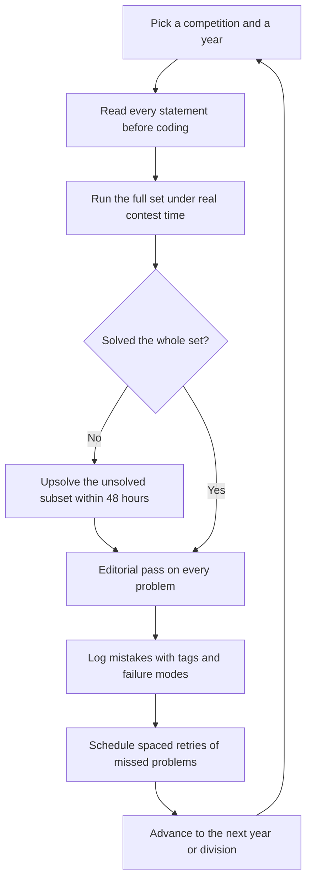
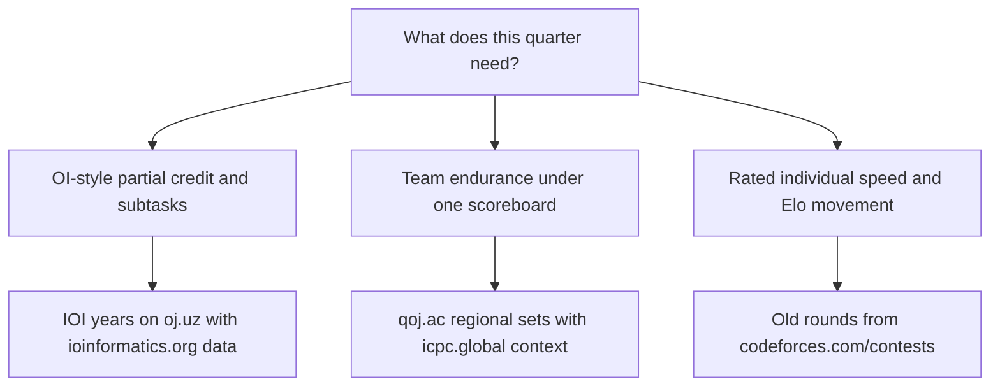

# Contest Archives — Mining a Decade of Past Competitions

## Overview

Every major competition in competitive programming leaves behind a permanent archive: the original problem set, the official editorial, the test data, and usually the full standings of everyone who attempted it under real contest conditions. That archive is the highest-quality practice material in the field, and it is free — yet most students never mine it systematically, because no judge's front page presents "IOI 2019 Day 2" the way it presents a daily problem. This page is the competition-centric companion to the judge-centric [resource directory](./resources-directory.md): instead of asking which judge to live on, it asks which competitions produced the problems you should be solving, where each competition's complete archive lives, and how to convert a decade of past rounds into a scheduled, reviewable training block.

The page stays strictly complementary to the track's other layers. The [contest calendar and clist page](./contest-calendar-codelist.md) covers *upcoming* rounds and how never to miss them; here the clock points backward, at material already frozen and already solved by thousands of people. The judge guides — [Codeforces](./codeforces-guide.md), [AtCoder](./atcoder-guide.md), and the [ICPC](./icpc-guide.md) and [IOI](./ioi-guide.md) tracks — explain how to climb one platform's ladder; this page explains how to step off any platform and mine the competitions themselves, including ones with no live judge left at all.

The method is previewed here and elaborated below. First, an archive map tells you where each competition's problems, editorials, and data actually live, separating official archives from judged mirrors. Second, a repeatable mining loop — pick a year, simulate the full set under time, upsolve, read every editorial, log mistakes — turns the archive into weekly sessions rather than occasional nostalgia. Third, year-by-year plans, subtask-based calibration, and a failure-mode list keep the process honest when enthusiasm fades.

## The Competition Archive Map

An archive can deliver three artifact classes, and knowing which one you are getting changes how you use it. An **official archive** is published by the competition itself and typically carries tasks, test data, and results. A **judged mirror** is a third-party judge hosting the set with live evaluation, so you get honest submission verdicts and a scoreboard. A **statement-only dump** is old PDFs with no judging and no data — usable for reading practice, useless for calibration. The table below is the working map; the judge-centric grades of these same platforms live in the [resource directory](./resources-directory.md), which this table deliberately does not repeat.

| Competition | Official archive | Mirror / alternate | Notes |
|---|---|---|---|
| IOI | [ioinformatics.org](https://ioinformatics.org) — per-year tasks, test data, and results | [oj.uz](https://oj.uz) — judged mirrors of IOI and many national OIs | Subtask scoring; results pages give medal cutoffs for calibration |
| National OIs (COCI, JOI, APIO, ...) | Each OI publishes its own site and tasks | [oj.uz](https://oj.uz) mirrors most of them with judging | Judged access to sets that otherwise have no judge at all |
| ICPC | [icpc.global](https://icpc.global) — World Finals information and problem archives | [qoj.ac](https://qoj.ac) — judged regional and World Finals sets; ICPC Live Archive (Kattis) for the deep back catalog | Team format; judge under one shared account to simulate regionals |
| USACO | [usaco.org](https://usaco.org) past-contests page with free judging | [usaco.guide](https://usaco.guide) maps topics onto the archive | Bronze→Platinum ladder; the friendliest first archive for beginners |
| Codeforces | [codeforces.com/contests](https://codeforces.com/contests) — every round's full problem set | [codeforces.com/problemset](https://codeforces.com/problemset) — the same problems aggregated and tag-filterable | Editorial links live in each round's announcement blog |
| AtCoder | [atcoder.jp/contests](https://atcoder.jp/contests) — complete ABC/ARC/AGC archive | [kenkoooo.com/atcoder](https://kenkoooo.com/atcoder) adds per-problem difficulty metadata (see the [tooling page](./tooling-and-workflow.md)) | Statement PDFs plus post-contest editorial links on every contest |
| CodeChef | [codechef.com](https://www.codechef.com) contest archive | Past problems migrate into the practice section | Long historical back-catalog across Starters, Cook-Offs, and Lunchtimes |
| LeetCode | [leetcode.com/contest](https://leetcode.com/contest) past contests | Most past-contest problems become free in the main problem set afterward | Interview-flavored weekly and biweekly rounds |
| Meta Hacker Cup | Past rounds are hosted on Meta's competitions site | Community writeups and mirrors | Name-only here per the repo URL policy; the output-file format is its own skill |
| Google Code Jam / Kick Start | Discontinued 2023; archives remained hosted afterward | Statement mirrors spread across judges | Name-only; treat mirror stability as uncertain when planning long blocks |
| TCS CodeVita | No systematic official archive | Community writeups only | India-specific corporate funnel; its value is the interview pipeline, not mining |
| IMO (math crossover) | The official IMO website publishes every year's shortlist | Statement-only; no judging anywhere | Use for constructive-thinking reps; see the [IMO guide](../competitive-math/imo-guide.md) |

### What Complete Means for an Archive

Not every row of the table is equally complete, and the gaps dictate workarounds. A complete archive satisfies four checks: statements for every year, an editorial or official analysis for every problem, test data available somewhere, and results or standings preserved. IOI and USACO pass all four checks — tasks, data, analyses, and results are all published. National OIs frequently fail the editorial check, which is why community writeups carry part of that load, and dead competitions fail the stability check, which is why their material should be downloaded rather than bookmarked.

The practical consequence is that the archive map and the mirror map must be read together. When an official archive lacks test data, pick the mirror that restores judging; when a mirror lacks editorials, budget extra time or shift to years that have analyses. When both fail for a given year, drop that year — the map has enough supply that no single year is worth an evening of archaeology. This is also why the plan tables below name both sources for every row: the loop needs statements and verdicts simultaneously, and each usually lives in a different place.

### Official Archives versus Judged Mirrors

The two archive types answer different questions, and the mining loop uses both. Official archives answer "what exactly was asked, what did the data look like, and where did the medal cutoffs fall" — ioinformatics.org's per-year pages and usaco.org's contest data are the canonical examples. Judged mirrors answer "could I actually solve it under a clock" — oj.uz and qoj.ac evaluate submissions against the original test data, so a subtask-structured IOI problem still awards partial credit the way it did in the hall. The professional pattern is to read from the official source and submit on the mirror: statements and results from the official archive, verdicts from the mirror.

Judging also matters because partial-credit problems degenerate without it. An IOI problem worth 100 points across five subtasks is a different object when you can only see "accepted or wrong answer" — the scaffolding that teaches incremental progress disappears. When no mirror exists for a set you care about, simulate the scoring by hand against the official subtask table, and grade yourself honestly against the published results distribution rather than a binary pass/fail.

### Discontinued and Corporate Competitions

Google Code Jam and Google Kick Start were discontinued in 2023, but their archives remained hosted afterward, and the material is still first-rate: hundreds of rounds with clean statements, official analyses, and a difficulty curve engineered by one of the field's best problem teams. Two cautions apply when mining them. First, mirror and archive stability is not something you control, so download the statement sets you plan to use instead of bookmarking a deep link. Second, the communities that wrote informal editorials have scattered, so budget extra time for problems whose official analysis is terse.

Meta Hacker Cup publishes past rounds through Meta's competitions site, and its format is a genuine departure worth practicing deliberately: you download input files, process them offline with no interactive feedback, and upload outputs, so debugging discipline matters more than fast iteration. TCS CodeVita sits at the opposite extreme — a placement-relevant event in India with no systematic public archive, where community writeups are the only record. Treat CodeVita as an event to enter for the resume line and the OA-style difficulty exposure, not as material to mine; the mining hours belong to the competitions listed above it in the table.

## IOI and National OI Archives

The IOI archive is the deepest structured resource in olympiad programming, and it splits across two homes. ioinformatics.org publishes the official per-year record — tasks, test data, and results — which makes it the source of truth for what a problem was worth and how the field scored on it. oj.uz hosts judged mirrors of IOI itself and of a long list of national and regional OIs, including COCI, JOI, and APIO, which matters because those national sets are largely invisible to mainstream judges. A student who mines only IOI proper sees one slice of OI style; the national archives add high-frequency implementation rounds and long constructive tasks that exercise different muscles from IOI's two five-hour days.

National OI archives also solve a volume problem for mid-band students. IOI problems at full difficulty sit above almost everyone's level, but each year's set contains entry subtasks calibrated for a wide range, and national contests ship many more problems per year at contest-usable difficulty. The practical recipe is to treat oj.uz as the submission surface and the official sites as the editorial surface, and to prefer years for which both exist.

### The IOI Format and Its Mining Implications

The format explains the method. An IOI runs two competition days of five hours each, with three problems per day and each problem scored out of 100 across subtasks, for a 600-point maximum. Partial credit is the norm rather than the exception, and each problem's subtask ladder descends from brute-force-friendly constraint tiers up to the full constraint set. That structure has three direct mining consequences.

First, the session shape mirrors the real day: read all three statements inside the first forty-five minutes, allocate the day's 300 points across them, and bank the cheap subtasks of every problem before deep-diving anything. Second, the "read statements first" step of the mining loop is not optional bookkeeping — it is the actual skill being trained, because statement triage under a five-hour clock is what separates partial-credit scorers from binary thinkers. Third, the gap between your banked subtask points and the historical medal cutoffs localizes exactly what the editorial pass must repair, which makes every session produce a targeted study list rather than a vague sense of difficulty.

### Subtask Scoring as Difficulty Calibration

Subtasks are the archive's built-in difficulty dial, and you should read them as an exam blueprint rather than decoration. Each subtask's constraint tier tells you which algorithm class the setters expected at that point value, and the gap between consecutive tiers tells you where the real idea lives. In a mining session, solve the easiest subtask of every problem in the set before deep-diving any single problem — that mirrors optimal in-contest strategy and keeps your partial-credit instinct sharp.

The scoring heuristic that turns subtasks into a schedule is value density: expected points per minute. It ranks the subtasks on the current paper by payoff against your own time estimates, and it is recomputed every time a subtask falls. Over a five-hour day, the greedy order it induces is close to optimal for partial-credit scoring.

\\[ \text{density}(p) = \frac{\text{points}(p)}{\text{expected minutes}(p)} \\]

Work the highest-density subtask first, and recalibrate \\( \text{expected minutes} \\) continuously from your own mining log rather than from optimism. Medal cutoffs on the IOI results pages give the year-over-year calibration layer — they move with the year's difficulty, so read several years of cutoffs instead of memorizing one number. USACO's division ladder provides the same calibration for beginners in a friendlier form: promotion is the score, and each division's cutoff is published with the contest.

## The ICPC Archive Stack

ICPC material has three layers, and each one does a different job. icpc.global is the official competition site: World Finals information, problem archives, and results for the top tier of the season. qoj.ac has become the de facto home for judged regional and World Finals sets, hosting them as team contests with the original test data, which is what makes a five-hour regional simulation actually possible today. ICPC Live Archive on Kattis — name-only here per the URL policy — holds the decades-deep historical back catalog from the era before modern mirrors, useful for classical styles rather than current meta.

The mining angle differs from individual archives because the unit of work is the team, not the person. Run regional sets as full-length three-person simulations with one machine, then split the upsolve so each member owns a subset of problems and writes a short editorial summary for the others — teaching a solved problem is the highest-retention review there is. Difficulty calibration comes from the standings of the original contest: compare your solve count and penalty against the real cut line for advancement at that regional. The [ICPC guide](./icpc-guide.md) covers team roles and strategy; the archive side is simply about feeding it honest rehearsals.

### Reading Old Standings as a Team Diagnostic

A past regional's standings encode more than a cut line. Per-problem acceptance counts show which problems were effectively free, which were the divider, and which were the intended three-team solves, and your team's per-problem penalty minutes compared against the leaders' reveals whether you lost to speed or to correctness. If you solved the same set as the leaders but a hundred penalty minutes slower, the diagnosis is typing and template fluency, and the fix lives in your drill work. If you missed problems the field solved at high rates, the diagnosis is topic coverage, and the next quarter's plan row should change to repair it.

Run the same diagnostic across six regionals and the pattern stops being an anecdote. The archived standings turn each simulation into a row of comparable measurements: solve count, penalty, per-problem acceptance percentile, and the gap to the cut line. That is the same percentile logic the individual archives use, applied to a team, and it is the only honest way to know whether a team block worked before the next real regional does.

## The Rated-Contest Archives

The big rated judges do not need mirrors because they are their own permanent archives. [codeforces.com/contests](https://codeforces.com/contests) preserves every round — Divisions 1 through 4, educational rounds, and specials — with the complete problem set, and each round's announcement blog collects the editorial threads. [codeforces.com/problemset](https://codeforces.com/problemset) presents the same problems aggregated, tag-filterable, and sortable by community difficulty rating, which is the fastest way to convert an archived round into targeted drilling. AtCoder's [contest archive](https://atcoder.jp/contests) is the cleanest in the field: every ABC, ARC, and AGC stays browsable with statement PDFs and an editorial link once the round ends, and kenkoooo's AtCoder Problems layer adds per-problem difficulty and solve-rate metadata on top. CodeChef's years of Starters, Cook-Offs, and Lunchtimes are archived on the site and mostly migrate into the practice section, and LeetCode's past contests on [leetcode.com/contest](https://leetcode.com/contest) become free problem-set entries afterward, which is exactly the interview-facing analog of a competitive archive.

Mining these archives differs from mining IOI or ICPC in one structural way: the contest is one sitting of two to three hours with four to seven problems, so the natural unit is the round, not the competition year. The retrospective round is the standard unit — pick an old round, sit it under the original clock, upsolve one problem above your ceiling within the week, and read the editorial for every problem including the ones you crushed. The [Codeforces guide](./codeforces-guide.md) and [AtCoder guide](./atcoder-guide.md) cover live-round strategy on these platforms; the archive discipline here is identical except that the scoreboard is historical and the editorial is guaranteed to exist.

### Virtual Participation Mechanics

Both Codeforces and AtCoder let you enter archived rounds as timed virtual contests with the original clock, and the historical standings become available the moment you finish. This mechanism is what turns an archive into a rehearsal instead of homework, and it only works under self-imposed rules: no editorial tabs open, no pausing the clock, and submissions made on the clock rather than "after one more debug". A virtual round does not move your real rating, which is precisely why it is a safe place to attempt riskier strategies than you would dare live.

Afterward, the historical standings are the calibration layer. Solving four of six problems in an old Div. 2 round with a given penalty places you at a specific percentile of the people who sat it live, and reading that number off the scoreboard takes ten seconds. Log it, plot the trend, and let the trend — not your mood after the round — decide whether the plan changes.

### USACO: The Free-Judging Bridge

USACO deserves its own subsection because it is the best first archive for a student below roughly Codeforces 1600. The past-contests section on usaco.org keeps every old contest open for submission with free judging, so you get the complete loop — statements, verdicts, and score — without any external mirror. The Bronze→Platinum division ladder provides built-in ordering: mine Bronze until promotion is routine, then Silver, then Gold, then Platinum, and you have a multi-year curriculum that no tag-filtered list can imitate. The [USACO Guide](https://usaco.guide) maps curriculum topics directly onto this archive, which makes it the rare case where a community companion site and a competition archive were designed to interlock.

A second property makes USACO unusually safe to mine: its problems are constructed for a school audience, so statements are long, unambiguous, and free of the cultural reference shorthand that some international sets assume. The free judging is also unrestricted in volume — you can submit a 2016 Silver problem today and get a real verdict, which is the exact on-ramp the IOI mirror ecosystem offers only to students already comfortable with harder sets. The cost is style: USACO problems rarely reach the top two points of difficulty, so the ladder ends where oj.uz's IOI mirrors begin. Treat the two as one continuous pipeline rather than competing options.

### Mining for Placement Goals

Most readers of this book are mining for interviews, not medals, and the archives support that goal directly with a changed emphasis. The LeetCode past-contest archive is the primary row: its weekly and biweekly contest problems become free problem-set entries afterward, and four-problem contest formats under a ninety-minute clock are the closest public simulation of an OA plus interview loop. The Codeforces retrospective row matters next, because the 1200-1700 difficulty band is where placement OAs overwhelmingly live, and a retrospective round gives you that band inside realistic time pressure. The olympiad rows still earn their place — partial-credit discipline and constructive thinking show up in hard-company interviews — but at one row per quarter rather than as the main diet. The [LeetCode archive page](./leetcode-archive.md) extends this placement lens to specific patterns and company tags.

### The IMO Crossover

The IMO shortlist is a competitive-programming archive in all but judge support: every year's shortlist is published by the official IMO website, complete with solutions, and the combinatorics and construction problems overlap heavily with high-olympiad CP style. There is no judging, so the loop degrades to statement, attempt, and honest comparison against the official solution — still valuable for the constructive-thinking muscles that judged archives under-train. The [IMO guide](../competitive-math/imo-guide.md) covers how to read a shortlist, and the [competitive math resource directory](../competitive-math/resources-directory.md) lists the companion materials; treat one or two shortlist problems per month as the crossover dose rather than a second curriculum.

The absence of judging also changes what "solved" means, and the log should reflect it. Record a shortlist problem as solved only if you can reconstruct the official solution's key step from memory a week later, not merely because you eventually matched its answer. That standard keeps the crossover honest, because statement-only archives generate more false confidence per hour than any judged set. Students targeting product-company interviews can safely skip this row entirely; students targeting research-adjacent or hard-core algorithmic roles keep it.

## How to Mine an Archive Year by Year

### The Mining Loop

The loop below is the whole method; everything else on this page is context for it. It is designed so that one competition year (or one round, for the rated archives) produces a complete cycle of measurement, repair, and review, and so that no step can be silently skipped.

Three details make the loop work where casual archive browsing fails. Reading every statement before coding reproduces the real in-contest planning phase, which is itself a trainable skill that tag-based practice never touches. The editorial pass covers *every* problem, including the ones solved — the official solution frequently shows a cleaner intended technique than whatever you improvised under time. And the log with scheduled retries converts each failure into a future drill instead of a vague intention; the tracker design for that log lives on the [tooling page](./tooling-and-workflow.md).

### Twelve-Week Plans

A plan fixes the unit of work and the cadence so the loop runs without daily willpower. The canonical example: twelve weeks equal three IOI years at four weeks each, one competition day per fortnight. The same template generalizes to other archives by changing only the unit, as the table shows.

| Plan | Archive source | Unit | Cadence within each unit | Twelve-week yield |
|---|---|---|---|---|
| IOI mining | 3 IOI years via [oj.uz](https://oj.uz) plus [ioinformatics.org](https://ioinformatics.org) data | 1 competition year = 4 weeks | Week 1: Day 1 simulation. Week 2: Day 1 upsolve and editorials. Week 3: Day 2 simulation. Week 4: Day 2 upsolve, full editorial pass, log review | 6 timed days, roughly 18 problems, complete editorial coverage |
| USACO ladder | 3 past seasons on [usaco.org](https://usaco.org) | 1 season = 4 weeks | Weeks 1-3: one division's full contest per week at the hardest division you can partially solve. Week 4: editorial pass and promotion-gap analysis | 12 contests judged for free, with a verified division jump as the goal |
| ICPC team block | 6 regional sets on [qoj.ac](https://qoj.ac) with [icpc.global](https://icpc.global) context | 1 regional = 2 weeks | Week 1: five-hour three-person simulation on one machine. Week 2: split upsolve, one member writes each problem's summary | 6 honest team rehearsals and a written internal editorial book |
| Codeforces retrospective | 12 old rounds via [codeforces.com/contests](https://codeforces.com/contests) | 1 round = 1 week | Day 1: full virtual participation. Days 2-4: upsolve one problem above ceiling. Days 5-7: editorial pass plus log entry | 12 measured rounds and a personal difficulty-curve map |

Pick the row whose unit matches your goal, not the one that looks most prestigious. A student between Codeforces 1200 and 1600 gains more from the USACO ladder or the retrospective row than from three IOI years they can only partially enter, and the [60-day plan appendix](../dsa/appendices/appendix-k-60-day-plan.md) shows how such blocks slot into an overall schedule.

### Why Archives Beat Random Problem Soup

First, a real contest's problem set has an engineered difficulty curve: the setters ordered problems so that partial progress is always available, and that curve is exactly what a live round will confront you with. A tag-filtered soup has no such structure, and students who train only on soup reliably mismanage the first hour of real contests. Second, every archived problem has an official editorial, which eliminates the unguided-grind failure mode of obscure judges where a hard problem costs an evening with no closure. Third, quality control: an archived problem survived thousands of live submissions, so pathological tests and broken statements are the exception rather than the rule.

Fourth — and least appreciated — archives are comparable. Standings, score distributions, and cutoffs give you an honest percentile for any past round, which means your simulation produces a measurement, not a feeling. A soup session ends with "I did four problems"; an archive session ends with "I scored 62 of 100 on a set where the medal cut was 71, and I know the three subtasks that gap came from." That measurability is what allows twelve-week plans to be adjusted at week four instead of regretted at week twelve.

### A Worked Session on Paper

Concretely, a Codeforces retrospective week looks like this. Saturday morning, ninety minutes: virtual-participate an old Div. 2 round under the original clock, submitting on time with no editorials open. Saturday evening, thirty minutes: read the historical standings, compute your percentile, and mark every problem you missed. Across the next three evenings, one hour each: upsolve the single problem one step above your ceiling, then run the editorial pass on the round — solved problems included — and write one log line per problem naming its failure mode. Sunday, fifteen minutes: schedule the retries and pick next week's round, ideally from a different year so the difficulty curve is re-sampled rather than memorized.

The arithmetic shows why the loop is sustainable. The heavy step is ninety minutes once a week; everything else is under an hour a day of reading and logging, most of it high-retention review rather than new grinding. Twelve such weeks fit inside a normal semester without ever competing with coursework, which is the property that distinguishes plan-table rows from aspirational schedules that collapse by week three.

### Mining at Club Scale

The loop scales to a college club with almost no extra machinery, and the ICPC-team row already contains the pattern. Split a competition year's problems among members so that each person owns a subset, run the shared simulation on the same day, and hold a one-hour weekly editorial circle where each owner teaches their problems from the official editorials. The club accumulates an internal editorial book — short written summaries per problem — which becomes onboarding material for next year's juniors and a résumé-worthy artifact for the organizers. Assign one member to maintain the schedule and the shared log, which is exactly the job the [calendar and automation tooling](./tooling-and-workflow.md) reduces to a few scripts.

Club-scale mining also fixes the single-archive diet problem socially. Different members can run different plan rows and report back, so the group samples more archive families per semester than any individual would. Keep the rules identical to solo mining — same clocks, no editorials mid-simulation, logs filed weekly — because a club that fudges honesty collectively fudges it permanently.

### Choosing an Archive by Goal

The diagram collapses to one sentence: match the artifact class to the skill, then the competition to the artifact. Partial-credit judgment comes from subtask-scored archives, team communication comes from team-scored archives, and speed under rating pressure only comes from rated archives — no archive substitutes for another. When in doubt, run two rows of the plan table at half intensity rather than one at full intensity, because the contrast between formats is itself training data.

## Format Variants and How They Change Mining

Most archive sessions assume the standard write-a-program, read-a-verdict loop, but three format variants break that assumption, and each needs a small adjustment. The variants matter because they appear in exactly the competitions students mine for placement signals, and discovering an unusual format mid-simulation wastes the very clock discipline the session exists to build. Read this section once, then note the format next to every year in your plan table.

### Output-Only Rounds

Meta Hacker Cup's format — download the input file, compute offline, upload the output file within the round window — removes the judge's real-time feedback entirely. Mining such rounds changes the debugging burden: you cannot iterate against verdicts, so you must build your own test harness and confidence before submitting, which is precisely the discipline the [stress-testing rig](./tooling-and-workflow.md) provides. The mining adjustment is to score honesty by constructing your own reference solution and diffing against it, and to accept that the round's scoreboard is a weaker calibration signal than a judged archive's. One Hacker Cup round per quarter is enough to keep the offline-processing skill alive.

### Interactive Problems

Interactive tasks — where your program exchanges queries and responses with the judge — have appeared in the IOI and in Code Jam archives, and they cannot be mined as static sets without the judge side. The oj.uz mirrors carry several of these with working interactivity, which is the practical reason to mine them on a mirror rather than from PDFs. When no interactive mirror exists, skip the task or study its editorial as reading material rather than pretending a static re-implementation preserves the skill. The underlying competence — designing queries that extract information under a budget — is worth maintaining, because it maps directly onto interview questions of the "twenty questions with a twist" family.

### Long-Format and Marathon Rounds

CodeChef's historical long challenges and Topcoder-style marathon formats give days or weeks per problem, which is a different sport from a five-hour day. They mine poorly as simulations — nobody can honestly reproduce a ten-day optimization grind on a weekend — but they mine well as a background track: one marathon-style optimization problem per quarter, worked in the gaps between normal sessions, builds a heuristic-tuning instinct that nothing else touches. Keep expectations calibrated: these problems reward iteration and parameter tuning more than algorithmic insight, and their archives often lack the crisp editorials that five-hour-format problems carry. Log them in the same tracker, but tag them as a separate category so they do not distort your percentile series.

## Calibration and Progress Tracking

Subtask scoring calibrates a single session; this section calibrates the miner across months. Two series matter, and both come free from honest archive work: the percentile you earn per session, and the failure-mode counts your log accumulates per category. Raw scores are not comparable across years because sets differ in difficulty, which is exactly why every session must be converted to a percentile against its own original standings before it joins the trend.

### Percentile Trend, Not Score Trend

Convert each session to a percentile — your score against the distribution of the people who sat the round originally — and smooth the series so a single heroic or disastrous day cannot steer the plan. A simple exponential moving average is enough for one data point per week. The weights below are a starting point rather than a law; anything in the same neighborhood behaves sensibly.

\\[ \bar{p}_n = 0.6\,\bar{p}_{n-1} + 0.4\,p_n \\]

Here \\( p_n \\) is the newest session's percentile and \\( \bar{p}_n \\) is the smoothed trend you actually plot. A flat trend across three consecutive sessions is a plateau signal, and the correct response is to change the plan row — different artifact class, different competition family — rather than to add intensity inside the same row. Percentile also self-corrects for archive difficulty: scoring 55 percent on a brutally hard year can be a stronger result than 75 percent on an easy one, and only the percentile view captures that.

### The Session Log Schema

Each mining session leaves one row in the log, and the row is what makes the loop auditable. The fields are few enough to fill in inside five minutes at the end of a session, which is the only reason the log survives contact with a real semester. The per-problem mistake tracker with failure modes and retry dates lives on the [tooling page](./tooling-and-workflow.md); the table here is the per-session layer above it.

| Field | Example | Why it is recorded |
|---|---|---|
| Competition and year | IOI 2018, Day 1 | Keeps sessions comparable within one engineered set |
| Score and percentile | 214 of 600, 71st percentile | Percentile, not raw score, is the comparable series |
| Problems missed | Day 1 P2, subtasks 3-5 | Defines exactly what the retry session must cover |
| Failure modes | complexity misjudge; off-by-one | Aggregates into category counts that steer plan changes |
| Retry date | 14 days out | Converts the miss into a scheduled drill, not a wish |

### When to Advance the Difficulty Band

Promotion rules should be written down in advance so they cannot be negotiated emotionally after a bad session. A workable rule set: if the smoothed percentile holds at seventy or above for four consecutive sessions, advance one year in difficulty or one division on the ladder; if it falls below forty, step down one unit or split the unit in half; anything between means hold the current row and repair the top failure-mode category first. The USACO ladder makes this literal with published promotion cutoffs, and the same logic transfers to every other archive through percentiles.

Advancing the band too early is the most expensive mistake in this section, because it converts measurable sessions into demoralizing flops and pushes students back toward soup. The percentile trend exists precisely to make the promotion decision boring and data-driven. When in doubt, finish the current twelve-week row completely and advance at the row boundary rather than mid-row, so the comparison stays clean.

### Feeding the Trend Into Your Calendar

The percentile trend is only useful if review time actually exists in the week, so schedule it the same way the mining sessions are scheduled. Anchor the weekly review to a fixed slot — fifteen minutes after the week's simulation works well — and let the retry dates from the log flow into the same calendar that holds upcoming contests, using the automation described on the [tooling page](./tooling-and-workflow.md). The [contest calendar page](./contest-calendar-codelist.md) explains how never to miss a live round; this page adds the backward-facing entries that most students forget to schedule. A calendar with both kinds of entries is the visible difference between a training plan and a habit.

The same slot is where plan changes get decided, which keeps decisions out of the emotional aftermath of a bad session. Look at the smoothed percentile, look at the failure-mode counts, apply the written promotion rules, and either hold or switch the plan row. Twelve weeks later, repeat — the entire governance loop of archive mining is three recurring calendar entries and a log.

## Common Archive-Mining Failure Modes

### Cherry-Picking the Famous Problems

Mining only the celebrated problems from each year destroys the difficulty curve that made the set valuable in the first place, and it quietly inflates your sense of level because famous problems are famous for being unusually good, not representative. The fix is mechanical: the plan table's unit defines the set, and you run the whole unit or switch plans. If a specific problem is genuinely beyond your band, bank its easy subtasks and move on rather than abandoning the session's structure. The unit, not your mood, is the contract.

### Skipping Editorials on Solved Problems

This failure mode feels like efficiency and quietly halves the value of every session. The editorial is where the setters' intended technique lives, and your improvised contest solution frequently differs from it in instructive ways — a heavier data structure where a greedy existed, or a general solution where the constraint tiers invited specialization. Reading the editorial for solved problems is also the cheapest form of new-technique intake available, because you already hold the full problem context in memory. Make the editorial pass a named step in the loop with its own time block, or it will be the first thing skipped every week.

### Mining Without a Log

Without a mistake log with failure modes and retry dates, the archive is entertainment: the same category of error — misread constraints, complexity misjudgments, panic in hour three — recurs for years while total solve counts climb. The tracker schema on the [tooling page](./tooling-and-workflow.md) fixes this with five columns and a five-minute weekly review, and the session-level log above aggregates it into plan-level decisions. The test is simple: if you cannot name your top two failure modes from the last month, the log is not running. Review, not volume, is the variable that converts archive hours into rating.

### Mirror Drift

Mirrors reorganize, regionals migrate between hosts, and dead competitions lose hosting entirely, so any long plan written against a single URL will encounter breakage. Verify the set exists on the mirror on the day you schedule a simulation, and keep a local copy of statement PDFs for anything you plan to mine in the next quarter. If a mirror has died, fall back to official statement PDFs and grade yourself against published cutoffs, downgrading confidence accordingly. This is also why the discontinued competitions are cited by name only in this page: a page full of guessed deep links would be the first casualty of exactly this drift.

### The Single-Archive Diet

A year of only IOI archives leaves you brittle at fast rated rounds, and a year of only retrospective rounds leaves you brittle at five-hour endurance, so alternate plan rows across quarters. The artifact classes train different judgment systems — partial credit, team penalty accounting, binary rating movement — and each atrophies without use. A simple rotation works: one IOI or USACO row, one team row if you have partners, one rated retrospective row, in a rolling sequence. The [resource directory](./resources-directory.md) makes the same argument at judge level; at competition level the twelve-week plan table is the rotation unit.

## Interview Questions

1. **Where do you find judged versions of old IOI problems, and why does judging matter compared to just reading statements?** oj.uz hosts judged mirrors of IOI and many national OIs such as COCI, JOI, and APIO, while ioinformatics.org carries the official tasks, test data, and per-year results. Judging matters because IOI scoring is subtask-based: live evaluation preserves partial credit, which is both the scoring reality and the training device for incremental problem-solving. Statements alone cannot tell you whether your 30-point approach is the intended 100-point one, and reading without a clock produces illusory competence. The professional pattern is statements and results from the official archive, verdicts from the mirror.

2. **Design a twelve-week archive-mining block for a two-person ICPC team with one free evening per week plus one weekend slot.** Use the ICPC row of the plan table at reduced cadence: six regionals over twelve weeks means one regional per fortnight, with the five-hour simulation on the weekend slot and the split upsolve in the evening. Each partner owns half the unsolved problems and writes a short editorial summary the other reads, which doubles as communication practice. Pull sets from qoj.ac, where regional and World Finals sets carry original test data, and calibrate against the original standings cut lines from icpc.global. Log every failure mode per problem so the next simulation can target the weakest category.

3. **Why is mining one coherent competition year better than solving the same number of problems from a tag-filtered list?** A real set has an engineered difficulty curve, so it trains contest management — statement triage, partial-credit decision-making, and time allocation — which a flat list never touches. Every archived problem has an official editorial, removing the unguided-grind failure mode, and the set survived thousands of live submissions, so quality control is proven. Most importantly, the archive carries standings and cutoffs, so the session produces a measurable percentile instead of a feeling. Tag lists remain useful, but as targeted repair work after the mining loop identifies a weak category, not as the main diet.

4. **How do subtasks change your in-contest strategy compared with all-or-nothing judging?** Subtasks convert a problem into a sequence of profitable checkpoints, so the optimal strategy is value-density ordering: accumulate points per minute across the whole paper rather than committing to one problem's full solution. In a mining session, that means solving every problem's easiest subtask before deep-diving any single problem, which is also what maximizes a partial-credit scoreboard. All-or-nothing judges like Codeforces train a different, binary instinct, which is why miners alternate plan rows across archive types. The IOI results pages provide historical cutoffs so you can convert a subtask score into an honest percentile.

5. **Google Code Jam was discontinued in 2023 — is its archive still worth mining, and what are the risks?** The archive remained hosted after the shutdown, and the problem sets are among the cleanest and best-analyzed in the field, so the material itself loses nothing. The risks are structural: archive stability is outside your control, the community that wrote supplemental editorials has dispersed, and there is no live judge to preserve contest feel. Mitigate by downloading the statement sets you intend to use, pairing them with a judged mirror where one exists, and capping the material at a topic-coverage role. Its distinctive formats, such as output-file processing, are the strongest reason to include a few rounds.

6. **How do you calibrate difficulty when mining an archive that has no rating system?** Use the four native signals: subtask point values, original standings distributions, published cutoffs, and your own logged solve times against expected minutes. Subtasks give per-problem granularity, cutoffs give year-over-year percentile targets, and standings let you compare against specific benchmarks rather than vague difficulty folklore. Where a mirror adds community metadata, as kenkoooo does for AtCoder, use it as an ordinal hint rather than ground truth. Calibration is only trustworthy if the simulation was honest — same clock, no editorials, no interruptions — which is why the mining loop enforces those conditions explicitly.

## Key Takeaways

- Archives are competition-centric, not judge-centric: know where each named competition's problems, editorials, data, and results live before you schedule a single session.
- Use the two-layer pattern everywhere: official archive for statements, data, and results; judged mirror (oj.uz, qoj.ac, usaco.org's own judging) for verdicts.
- USACO is the best first archive below Codeforces 1600 — free judging on every past contest plus a Bronze→Platinum ladder with built-in ordering.
- The mining loop is fixed: pick a year, read all statements, simulate under the real clock, upsolve within 48 hours, editorial pass on every problem, log, retry, advance.
- Twelve weeks equal three IOI years at four weeks each; the same template yields USACO, ICPC-team, and Codeforces-retrospective rows by changing only the unit.
- Track the smoothed percentile across sessions, not raw scores; promotion rules should be written down before the row starts, not negotiated after a bad day.
- Format variants change the method: output-only rounds need a self-built harness, interactive tasks need a mirror, and marathon formats run as a quarterly background track.
- Dead competitions are still material: Google Code Jam and Kick Start (discontinued 2023) and Meta Hacker Cup rounds remain mineable, with name-only citations and mirror-drift precautions.

## References

- [ioinformatics.org](https://ioinformatics.org) — official IOI site: per-year tasks, test data, and results
- [oj.uz](https://oj.uz) — judged mirrors of IOI and national/regional OI contests
- [icpc.global](https://icpc.global) — official ICPC site: World Finals information and problem archives
- [qoj.ac](https://qoj.ac) — judged ICPC regional and World Finals sets for team simulation
- [usaco.org](https://usaco.org) — past-contest archive with free judging across all divisions
- [usaco.guide](https://usaco.guide) — curriculum mapped onto the USACO archive
- [codeforces.com/contests](https://codeforces.com/contests) — complete round archive with announcement-blog editorials
- [codeforces.com/problemset](https://codeforces.com/problemset) — aggregated, tag-filterable view of the same archive
- [atcoder.jp/contests](https://atcoder.jp/contests) — complete ABC/ARC/AGC archive with PDFs and editorials
- [kenkoooo.com/atcoder](https://kenkoooo.com/atcoder) — AtCoder Problems difficulty and solve-rate metadata
- [www.codechef.com](https://www.codechef.com) — contest and practice archive
- [leetcode.com/contest](https://leetcode.com/contest) — past contests whose problems become free problem-set entries
- Google Code Jam, Google Kick Start, Meta Hacker Cup, ICPC Live Archive (Kattis), TCS CodeVita, and the official IMO website — cited by name only per the repository URL policy

## Cross-References

- [Resource directory](./resources-directory.md) — the judge-centric counterpart table of the same platforms
- [Contest calendar and clist](./contest-calendar-codelist.md) — the forward-looking half: upcoming rounds and discovery
- [Tooling and workflow](./tooling-and-workflow.md) — the API feeds, stress rig, and mistake-log tracker the mining loop consumes
- [IOI guide](./ioi-guide.md) — IOI format, selection, and the subtask mindset this page mines
- [ICPC guide](./icpc-guide.md) — team roles and regional strategy to pair with archive rehearsals
- [Codeforces guide](./codeforces-guide.md) — live-round strategy for the retrospective plan row
- [AtCoder guide](./atcoder-guide.md) — ABC/ARC/AGC formats behind the cleanest judged archive
- [LeetCode archive](./leetcode-archive.md) — the interview-facing analog of past-contest mining
- [IMO guide](../competitive-math/imo-guide.md) — the statement-only shortlist crossover
- [60-day plan appendix](../dsa/appendices/appendix-k-60-day-plan.md) — where twelve-week archive blocks slot into an overall schedule
