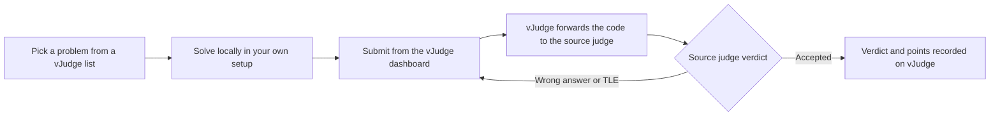
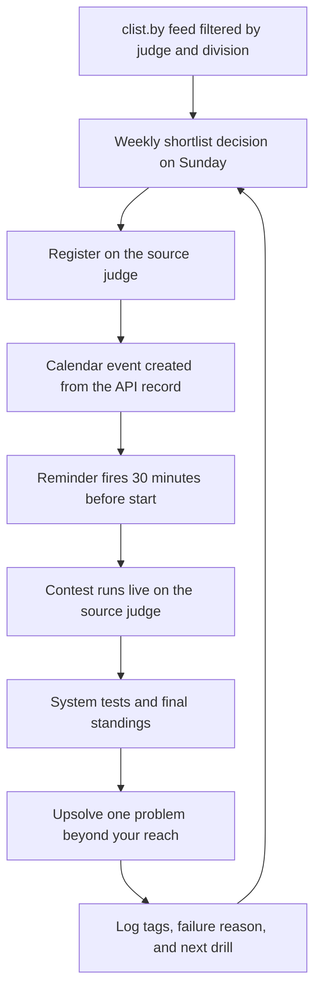

# Contest Calendars and Multi-Judge Practice — clist.by and vJudge

## Overview

Competitive programming contests are spread across more than twenty active judges, each with its own schedule page, timezone convention, registration deadline, and rating system. Two community tools turn that chaos into a manageable workflow: clist.by, an aggregator that indexes upcoming contests from essentially every major judge, and vJudge, a mirror that lets you practice problems from many judges through a single dashboard and account. This page explains how both tools work, how to combine them into a repeatable discovery-to-upsolve loop, and how to schedule a contest calendar that survives an Indian semester calendar.

If you already know which judge you are targeting, the deep dives live elsewhere: the [Codeforces guide](./codeforces-guide.md) covers rating mechanics and round formats, the [AtCoder guide](./atcoder-guide.md) covers ABC/ARC/AGC, and the [LeetCode archive](./leetcode-archive.md) covers contest-style interview practice. This page is the layer above those: when to show up, how to never miss a round you care about, and how to run past contests as if they were live.

The page assumes a reader balancing an Indian academic semester against contest goals, because that reader has the least slack and therefore needs the tooling most. Every recommendation here is stated as a mechanism — a filter, a script, a checklist, a policy — rather than as motivation, and each section ends in something you can set up in under an hour. Where exact slot times matter, they are given in both UTC and IST with the seasonal caveats spelled out, so the calendar you build from this page does not silently rot at the next daylight-saving transition.

## The Scattered-Contest Problem

### Twenty Judges, Twenty Calendars

A serious contestant's week can touch five platforms before breakfast: a Codeforces Div. 2 round on Tuesday, an AtCoder Beginner Contest on Saturday, a LeetCode Weekly on Sunday morning, a CodeChef Starters on Wednesday, and a virtual ICPC regional rerun wherever the problems live. Each platform announces rounds in its own way — Codeforces posts a news entry plus an email if you opt in, AtCoder lists rounds on its home page with the countdown in JST, LeetCode buries the schedule inside its contest tab, and regional contest mirrors often announce on blogs or Telegram instead. None of these feeds talk to each other, so a manual checking habit fails exactly when the semester gets busy.

Timezones multiply the problem. Judges announce times in UTC, JST, ET, or IST depending on where their audience sits, and the two platforms using US Eastern Time flip between EST and EDT twice a year, shifting the IST equivalent by an hour. A round you noted as "5:30 PM IST Sunday" quietly becomes "6:30 PM IST" after the spring DST change if you stored the absolute time instead of the timezone-anchored one. Aggregation tools exist because tracking these conversions by hand across a full semester has a predictable failure rate.

### Registration Deadlines and Other Quirks

The calendars also disagree about what "attending" requires. Codeforces registration stays open until the round starts and takes one click, AtCoder needs only a logged-in account, and LeetCode requires no registration at all beyond entering the contest page. CodeChef historically requires an explicit registration flow for rated events, and some university-hosted mirrors on vJudge close their gyms or gate them behind a group. A calendar entry that records the contest time but not the registration quirk will still fail at 19:59 with the contest starting at 20:00, so the shortlist step below should capture both fields for every event it commits to.

Scored practice adds a second layer of quirk. Team contests need all members registered on the same platform, ICPC-style mirror rules sometimes ban mid-contest editorials by honor system, and virtual reruns require you to honestly freeze your own clock since nothing technically prevents opening the problems early. None of these are hard problems, but each one is a distinct failure mode that a spreadsheet column or checklist line eliminates permanently.

### What Aggregation Actually Buys You

A contest aggregator collapses the discovery problem into one query: show me every rated contest in the next fourteen days, filtered by the judges I follow and the formats I care about. Instead of five bookmarked schedule pages, you check one page (or one API response) and trust that the aggregator's crawler caught the announcement you missed. Aggregators also expose the metadata you actually filter on — div level, duration, rated status, registration link — so the decision "do I skip this one?" takes seconds instead of site-hopping.

The second thing aggregation buys is recall after the fact. When you miss a round, the same aggregated record gives you the contest ID, the problem set, and the standings, which is exactly what an upsolve session needs. In practice the contest calendar and the practice log are the same database seen from two angles, and treating them that way is what separates contestants who grind randomly from contestants whose weekly schedule compounds.

## clist.by — The Contest Aggregator

clist.by indexes upcoming and past contests from dozens of judges — Codeforces, AtCoder, CodeChef, LeetCode, Topcoder, SPOJ, DMOJ, oj.uz, and many regional OI and ICPC mirrors — and normalizes them into a single chronological feed. Every entry carries the host judge, the start time, the duration, the contest name, and tags for the division or series it belongs to. The site has been the de facto community calendar for years precisely because it is judge-neutral: it does not privilege the platform that happens to run the round this weekend.

### Filters, Tags, and the Calendar View

The home page groups contests by "upcoming," "running now," and "recently finished," and the calendar view lays the same data out month-by-month so you can see, for example, that the first Saturday of the month now hosts three overlapping events. Useful filter axes include:

| Filter axis | What it does | Typical use |
|---|---|---|
| Resource (host judge) | Show only contests from chosen judges such as codeforces.com or atcoder.jp | Keep the feed to the two or three judges you actually follow |
| Division / series tag | Filter to Div. 2 rounds, ABC, Starters Div 3, and similar series | Match practice to your current rating band |
| Rated status | Hide unrated fun mirrors when you want rating moves | Month-end rating push |
| Duration | Exclude marathons and multi-day OI windows from a one-evening schedule | Weeknight planning |
| Time range | Window the feed to the next 7 or 14 days | Building the weekly plan |

Two habits make the filters pay off. First, follow fewer judges deliberately: a feed filtered to Codeforces plus AtCoder plus LeetCode is roughly five to six events a week, which is already more than most students can attend live. Second, check the feed on Sunday and lock the coming week's registrations at that moment, because several judges close registration before the contest starts and retrofitting a missed registration after the fact is impossible.

### Keeping the Feed Trustworthy

Aggregators are only as good as their crawlers, so treat the feed as a first alert rather than the system of record. Announcements occasionally appear on a host judge minutes or hours before the crawler picks them up, special anniversary rounds sometimes land under unusual tags, and a brand-new judge can sit unindexed for weeks until someone adds its resource. The cheap safeguard is a one-line verification habit: before you register, open the contest link on the source judge and confirm the time, duration, and rated status there. The few minutes this costs is far less than the cost of preparing for a round whose start time moved.

Feed hygiene is also a shared responsibility. clist accepts community submissions for resources and schedule corrections, which means a college club that consistently corrects bad records improves the feed for everyone. If your bot consumes the API, add a reconciliation step that flags contests whose host-page data disagrees with the aggregator record, because that diff is exactly the signal that something changed upstream.

### The clist API for Scripts and Bots

clist exposes a documented REST API at [https://clist.by/api/](https://clist.by/api/) that returns the same records as the site as JSON. You register on clist to obtain an API token, then query the contest and resource endpoints with filters such as host judge, start-time window, and ordering. That is enough to power a personal dashboard, a cron job that posts the week's contests to a group chat, or a Telegram/ Discord bot for your college's competitive programming club. A minimal polling script looks like this:

```bash
# Base URL and token come from the docs at https://clist.by/api/ after registration
CLIST_BASE="https://clist.by"   # see https://clist.by/api/ for the exact endpoint paths
curl -sS -H "Authorization: Token ${CLIST_TOKEN}" \
     "${CLIST_BASE}/api/v1/contest/?resource__host=codeforces.com&order_by=start&limit=20" \
  | jq '.objects[] | {event, start, href}'
```

If you only care about one judge, the judge's own API can be simpler: the Codeforces API documents a `contest.list` method at [https://codeforces.com/apiHelp](https://codeforces.com/apiHelp) that returns all rounds with their phases, so a ten-line script can distinguish upcoming from finished rounds without any third party. The usual architecture is clist for breadth and the native API for depth — clist tells you something is happening across your whole watchlist, and the native API supplies registration status, problem lists, and standings once you have committed.

Bot design for a college channel needs three unglamorous decisions made up front. Poll on a fixed daily schedule instead of hammering the endpoint, cache the last response, and post only the diff — new or changed contests — so the channel gets one useful message a day rather than forty duplicates. Identify the bot honestly in its user agent or token notes, because aggregator maintainers can and do revoke keys that behave abusively. Finally, design for the aggregator being briefly wrong: every automated post should carry the direct link to the source judge so a human can verify in one click, which keeps a crawler hiccup from becoming forty confused first-years.

### Timezone Handling

Every clist entry shows the start time in your browser's local timezone, which removes the EST-versus-EDT foot-gun as long as you read the calendar on the machine whose clock you trust. When you script against the API, treat returned timestamps as UTC instants and convert only at display time; storing "5:30 PM" strings in your own database is how the DST drift described above gets rebuilt in miniature. For calendar invites, always create the event by timezone-anchored rule ("every Sunday, 8:00 AM America/New_York") rather than a fixed UTC offset, and the recurrence will track DST for you.

## vJudge — The Multi-Judge Mirror

vJudge at [https://vjudge.net](https://vjudge.net) mirrors problem statements and judges submissions for dozens of source judges — Codeforces, SPOJ, CodeChef, and many retired or regional judges among them. You browse and solve from one dashboard with one account, and when you submit, vJudge forwards your code to the source judge under the hood and records the verdict back on your profile. For practice organization it also adds a social layer the original judges lack: groups, shared problem lists, and custom contests.

### One Dashboard, Many Judges

The practical win is that your practice log becomes judge-independent. A college team can maintain one vJudge problem list per topic — say, 60 problems on segment trees pulled from four judges — and every member's attempts, verdicts, and standings live in one place. It also revives dead archives: when a regional judge's own site has become slow or unstable, its problem set often remains solvable through the mirror. Two cautions keep the workflow honest: always open the problem statement on the source judge when an editorial or note references formatting details, and remember that your source-judge account may be required for the forwarded submission to count on that judge's own records.

Submission mechanics differ subtly between mirror and source, and the differences matter during a contest. The mirror queues and forwards your code, so a busy source judge adds latency you do not see when submitting natively, and a source-judge outage shows up on the mirror as a stuck submission rather than a clear error. Compilation environments are the source judge's, so a solution tuned to one compiler's extensions can behave differently than on your machine. For solo topic practice these are footnotes; for a two-hour team gym they are exactly why the rehearsal table above recommends running high-stakes replays with the source judge's own interface open in a second tab.



### Groups, Gyms, and Team Contests

Three vJudge features matter for structured practice. **Groups** are private spaces where a college club or ICPC team shares problem lists and tracks who solved what, which turns "did you finish the DP sheet?" into a checkable dashboard. **Gyms** let anyone host a custom contest from mirrored problems, so you can reconstruct an old regional on short notice and run it with real standings. **Team contests** allow three-person teams to submit from a shared interface, which is the closest cheap approximation to the ICPC lab environment — one machine, shared decisions, and a freeze-friendly scoreboard. All three run on the same mirror mechanics as solo practice, so the setup cost is minutes.

## Virtual Contest Workflows

Every major judge now lets you run a past contest as if it were live, which converts five years of archives into an effectively infinite supply of full-length dress rehearsals. The mechanics differ per platform, and the table below is the complete workflow you need.

| Platform | How to start a past contest | What you get | Caveats |
|---|---|---|---|
| Codeforces | Open any finished round and enter virtual participation | Real-time problem reveal on the original clock, replayed scoreboard, separate virtual rating | Registration is instant; solve the round start to finish without pauses or the clock simulation is wasted |
| AtCoder (via kenkoooo) | Use the Virtual Contests feature on [https://kenkoooo.com/atcoder](https://kenkoooo.com/atcoder) to assemble a set of past ABC/ARC/AGC problems | Custom duration and problem selection; joint leaderboards with friends | Kenkoooo's virtual mode is community-built, so standings are informal; AtCoder's own rating is unaffected |
| LeetCode | Open a finished contest under [https://leetcode.com/contest](https://leetcode.com/contest) and launch the virtual replay | Original 90-minute clock, live-style ranking against the original field | Premium problems inside some replays need a subscription |
| vJudge gym | Create a gym contest and add problems from any mirrored judge | Complete control over duration, problem order, and team mode; works for ICPC-style team rehearsal | You must curate the problem set yourself; mirror submissions inherit the source judge's quirks |

A sustainable rhythm is one live contest plus one virtual contest per week. Use the virtual slot to replay the round you missed or a known classic — for example, rerun an old ICPC regional in team mode on vJudge after reading nothing about it. Then upsolve on the original judge so the solved problem lands in your real archive and rating history where relevant.

### Common Virtual Contest Mistakes

Virtual participation only simulates reality if you simulate the constraints honestly, and four mistakes recur. Pausing mid-round and resuming later destroys the time-pressure signal, so schedule the full window or pick a shorter replay instead. Opening the editorial before the virtual clock ends converts a rehearsal into reading practice — a rule of thumb is that anything you could not solve gets upsolved only after the clock closes. Ignoring the scoreboard replay wastes the calibration data: comparing your virtual solve times against the original field's percentile tells you whether your bottleneck is speed or harder problems. Finally, running virtuals only on problems you already solved defeats the purpose, which is why picking archived rounds blind — by round number, not by topic — is the standard advice.

## Where Each Tool Stops

### What clist.by Does Not Do

clist answers "when is the contest" and stops there. It does not register you, host the problems, handle team formation, or track your personal performance over time, and its coverage of a brand-new or niche judge can lag until the resource is submitted. Aggregated records are also occasionally wrong in small ways — a moved start time, a mislabeled division — which is why the verify-on-host habit exists. The correct mental model is that clist is the calendar layer of your setup, and everything past the reminder still happens on the source judge.

### What vJudge Does Not Do

vJudge mirrors problems, not ecosystems. Editorials, blog discussions, rating changes, and official standings live on the source judges, so a contestant who practices exclusively on the mirror misses the parts of the community that drive improvement. Mirror verdicts can also inherit source-judge outages, and a handful of judges discourage or restrict mirroring, which shows up as missing problem sets rather than an explicit error. The workable split is: vJudge for organization, team rehearsal, and reviving archives; the source judge for rating, editorials, and anything you intend to cite in a codeforces profile or an interview conversation.

## Running a College Practice Pipeline

### The Shared Problem List

A college club gets more value from aggregation tools than any individual, because the coordination overhead is the bottleneck, not individual ability. Start with one vJudge group per active batch and one shared problem list per topic under active study — six to ten problems, mixed across judges, ordered roughly by difficulty. The list owner pins the topic of the week, and every member's verdicts on the mirrored problems become visible progress data without anyone maintaining a spreadsheet. The discipline that matters is keeping lists short and alive: a 300-problem dumping-ground list gets abandoned in a fortnight, while a list you finish every two weeks compounds into a full topic rotation by semester's end.

### The Weekly Gym and Review Meeting

Convert one weekend slot into a recurring vJudge gym that replays either the week's best contest or a hand-picked historical set, with the duration scaled to exam pressure — a full two-hour set in normal weeks, a one-hour sprint otherwise. Follow the gym with a thirty-minute review meeting where the rule is that the highest-scoring team explains its solution to the lowest-scoring team; this forces articulation and surfaces the exact step where most contestants lose the thread. Rotate the gym host weekly so every member learns the mechanical work of curating a problem set, registering a contest, and reading a scoreboard for diagnostics rather than for vanity. Over a semester this loop produces better results than any lecture series, because every session is a real contest with real stakes and a post-mortem.

### Calibrating Difficulty to the Room

Mirrored contests make difficulty calibration measurable instead of anecdotal. If the weekly gym's target is that the median team solves two of five problems, then after each session you can check the standings against that target and adjust the next set's source judge and problem indices accordingly. The same calibration applies to individual anchors: a student whose Codeforces virtual score stalls at solving only problem A should be running Div. 3 replays for a month, not Div. 2. The data to make that call already exists in the group's verdict history, and the aggregator's contest records supply the remaining metadata — round type, problem count, and duration — needed to pick a comparable substitute set.

## The Weekly Contest Cadence

The fixed weekly skeleton is stable enough to plan a semester around, with the caveat that judges occasionally shift slots for special rounds. The table shows the recurring anchors; the IST column is the one you will actually live by.

| Contest | Judge | Typical slot (UTC) | Typical IST | Duration |
|---|---|---|---|---|
| Codeforces Div. 2/3/4 rounds | [https://codeforces.com](https://codeforces.com) | Evening slots, most often 17:35 UTC, some rounds near 14:35 UTC | 23:05 IST (late) or 20:05 IST | ~2 hours |
| AtCoder Beginner Contest | [https://atcoder.jp](https://atcoder.jp) | Saturday 12:00 UTC (21:00 JST) | 17:30 IST Saturday | 100 minutes |
| LeetCode Weekly Contest | [https://leetcode.com/contest](https://leetcode.com/contest) | Sunday morning US Eastern | 17:30-18:30 IST Sunday | 90 minutes |
| LeetCode Biweekly Contest | [https://leetcode.com/contest](https://leetcode.com/contest) | Saturday evening US Eastern | 05:30-06:30 IST Sunday | 90 minutes |
| CodeChef Starters | [https://www.codechef.com](https://www.codechef.com) | Wednesday 14:30 UTC | 20:00 IST Wednesday | 2-3 hours by division |

Counting a maximal week — two Codeforces rounds, one ABC, one LeetCode Weekly, half a LeetCode Biweekly cadence, and one Starters — gives about five to six rated events per week, or \\( 5.5 \\times 4.33 \\approx 24 \\) contests in a month. Nobody should attend all of them live, and attempting to is the most common first-semester mistake. Pick two or three anchors that fit your class schedule, treat the rest as optional virtuals, and let the calendar, not enthusiasm, make the weekly decision.

The cadence table also explains why judge specialization happens so naturally. If your evenings are consumed by labs until 21:00 IST, Codeforces at 23:05 IST is punishing on weekdays but AtCoder's 17:30 IST Saturday slot is perfect. If your mornings are free on Sunday, the LeetCode Weekly pairs well with a code-review session afterwards because its four problems are interview-adjacent. Matching anchors to your real timetable beats matching them to whatever the loudest person in your batch is doing.

### Adjusting Anchors as Goals Change

Anchors are seasonal commitments, not lifetime ones, and the correct review point is every semester break. A first-year chasing volume should weight CodeChef Starters and Div. 3 rounds because the problem count per hour of effort is highest there. A third-year four months from placement season should rotate the third anchor to the LeetCode Weekly and start treating virtual Codeforces rounds as the primary live-style practice, because placement OAs reward exactly the fast-implementation skill those formats train. An ICPC aspirant after regionals announcement flips the priority again: full-length three-hour virtuals on past regionals with the actual team, at the actual team schedule, replace individual anchors almost entirely for the six weeks before the contest.

## Historical and Regional Contests Worth Mining

Discontinued does not mean useless. **Google Code Jam** and **Kick Start** were both discontinued in 2023, but their archived problem sets remain among the best-dated, difficulty-graded corpora anywhere — Code Jam's round structure (Qualification through World Finals) and Kick Start's rolling practice rounds map cleanly onto a self-study syllabus, and the editorial culture around them survives in blogs. Treat the archives the way you treat an old textbook: the platform is gone, the problems are not.

Two other categories fill different roles. **Meta Hacker Cup** is an annual, active online contest whose qualification round is famously generous and whose later rounds reward careful implementation, so it belongs on the calendar every August-to-October window. On the India placement side, **TCS CodeVita** and **Infosys HackWithInfy** function as hiring contests: both are open to engineering students across the country, both feed directly into the respective companies' interview pipelines, and both are scheduled around the Indian academic year, which is why placement cells push them. Finally, **CodeChef SnackDown** was CodeChef's global team championship; its team format makes old editions good ICPC rehearsal material even though the event itself has run irregularly. None of these require a new tool — the aggregator plus the judge archive covers them.

Mining an archived corpus needs one extra habit that live contests do not: difficulty triage before you start. Code Jam and Kick Start sets carry years of community difficulty notes, so sort each year's problems into "must-solve core," "stretch," and "skip until expert" before the session, and run them as timed virtuals rather than as open-ended reading. The Meta Hacker Cup qualification round is different — its first two problems are deliberately approachable and the later ones bite hard, so the archive works best as a once-a-year calibration exercise against the world's field. The Indian hiring contests sit elsewhere on the spectrum: CodeVita and HackWithInfy reward speed on implementation-heavy tasks more than algorithmic depth, which makes them a distinct practice genre worth two or three timed sessions in the month before they run.

## A Discovery-to-Upsolve Automation Pipeline

The full loop from discovery to consolidated learning can be automated end to end with the tools above. The pipeline below is deliberately boring: each stage is a cron job, a calendar rule, or a checklist item, not a heroic memory task.



Every arrow in that diagram has a concrete implementation. The feed-to-shortlist arrow is a filtered clist query or a college bot posting each Sunday. The calendar arrow can be a script that converts API records into events, or five minutes of manual entry if you attend at most three contests a week. The reminder arrow is native to Google Calendar or any phone calendar. The final loop-back arrow is the one people skip, and it is the only one that produces rating growth: an upsolved problem with a written failure reason converts a lost contest into training data for the next one.

## Timezone Strategy for Indian Participants

India's fixed UTC+5:30 offset with no daylight saving is a genuine structural advantage: your local times never shift, and the world's DST changes merely reshuffle which slots are comfortable. The recurring anchors land as follows — ABC at 17:30 IST on Saturday, CodeChef Starters at 20:00 IST on Wednesday, the LeetCode Weekly at 17:30-18:30 IST on Sunday (an hour earlier in the EDT winter window), and the LeetCode Biweekly around 05:30-06:30 IST on Sunday mornings. The only chronically hostile slot is the classic Codeforces evening round at 23:05 IST on a weekday, which collides with both sleep and the next morning's classes.

A workable strategy for an Indian semester is three anchors: ABC on Saturday evening for speed, Starters on Wednesday for volume and div-appropriate difficulty, and the Sunday LeetCode Weekly when you are in interview-preparation mode rather than ICPC mode. Attend Codeforces live when the slot is the 20:05 IST variant and treat the 23:05 IST rounds as next-morning virtuals — a well-rested virtual rerun with full focus produces more rating than a bleary live attempt followed by a wasted Tuesday. Keep one shared rule in your college group: whoever registers a round posts the IST time in the group, because the single most common miss is still the timezone transcription, not the scheduling.

### Exam Weeks and Semester Shock

The calendar strategy needs a documented degraded mode for exam weeks, decided in advance rather than improvised. A practical policy is: keep exactly one anchor, shrink it to the shortest available format — an ABC at 100 minutes or a Div. 3 replay as a next-morning virtual — and suspend group gyms entirely. The reason to keep even one anchor is continuity: contest sharpness decays measurably after two silent weeks, while ninety minutes a week costs nothing against exam preparation. The same policy handles illness, internships, and project deadlines, and writing it down removes the guilt-driven decision that otherwise happens every finals week.

## Measuring Whether the Calendar Is Working

A contest calendar is a training program, and training programs get audited with three numbers tracked over rolling four-week windows. The first is **attendance rate** — live contests attended divided by anchors committed — because a plan you attend forty percent of the time is a wish, not a plan, and the fix is usually to cut anchors rather than to try harder. The second is the **upsolve ratio**, solved-after-contest problems divided by unsolved problems per round; anything below one in three means the post-contest loop is broken regardless of attendance. The third is the **rating slope** on each judge you compete on, read over a quarter rather than a weekend, since single-round Elo swings are noise at every level below master.

Those numbers convert directly into schedule edits, which is the whole reason to collect them. A falling attendance rate with a healthy upsolve ratio says your anchors conflict with the semester and should move. A healthy attendance rate with a near-zero upsolve ratio says contests have become entertainment, and the remedy is shrinking the count and enforcing the written failure log. A flat rating slope with good attendance and good upsolving is actually the healthy mid-plateau state — the response there is harder problem lists, not calendar churn, and the [60-day plan](../dsa/appendices/appendix-k-60-day-plan.md) is the right place to find the topic work the plateau is asking for.

The audit itself takes fifteen minutes a month with the data these tools already emit. clist records which rounds happened, the judges record your verdicts, and the group's vJudge history records the team gyms, so the only manual step is writing the three ratios in one place. Students who skip the audit tend to discover in placement season that they attended a hundred contests and can show none of the discipline a recruiter asks about; students who keep it can answer both questions with a screenshot.

## Interview Questions

1. **Why use an aggregator like clist.by instead of each judge's own notifications?** Because discovery is a multi-judge problem while notification systems are single-judge by design. An aggregator normalizes start times, durations, and division tags across dozens of judges into one queryable feed, so a filter like "rated Div. 2 rounds on my two judges in the next two weeks" replaces five bookmarked schedule pages. It also catches announcements on smaller or regional judges that send no emails at all. The judge's own channel remains the authority for registration and rules, but the aggregator is the only reliable "what is happening anywhere" view.
2. **What does vJudge add over simply solving on the source judges directly?** It adds organization and revival of dead archives on top of the same verdicts. A single account and dashboard covers dozens of source judges, which lets a team maintain one topic-wise problem list spanning four judges, with attempts and standings tracked in one place. Gyms and team modes let you reconstruct ICPC-style team contests on demand, something no individual source judge offers casually. The trade-offs are inherited source-judge quirks and occasional missing editorial context, so serious upsolving should still end on the original judge.
3. **How do you build a contest reminder pipeline that survives daylight saving changes?** Store timezone-anchored recurrence rules rather than absolute times: "Sunday 08:00 America/New_York" not "18:30 IST." A script reading the clist API should treat returned timestamps as UTC instants and convert only at display or calendar-creation time, letting the calendar service own the DST logic. For the two US-based anchors, that means the IST time shifts by one hour across the spring and autumn transitions, so the calendar event must be edited once or derived from the rule, never copy-pasted from a stale note. This is exactly the class of off-by-one-hour bug that automated pipelines exist to prevent.
4. **Why are virtual contests the highest-leverage practice format for a time-constrained student?** Because they convert existing archives into full-length simulations without requiring any live commitment. A virtual Codeforces round gives you the real problem reveal cadence, the real scoreboard pressure, and a comparable difficulty profile at a time you choose, which is the only way to practice the two-and-a-quarter-hour stamina problem itself. Past contest sets are also pre-editorialized: every problem has published solutions and thousands of blog posts, so the upsolve loop is fast. One live plus one virtual per week gives two full contest simulations without the schedule damage of attending everything live.
5. **An Indian first-year asks which weekly slots to anchor on. What do you recommend and why?** ABC on Saturday at 17:30 IST, CodeChef Starters on Wednesday at 20:00 IST, and either the Sunday LeetCode Weekly or a Codeforces round depending on their goal. This anchors three rated contests in friendly IST windows and avoids the 23:05 IST Codeforces slot that wrecks weekday sleep. The Sunday-morning Biweekly at 05:30-06:30 IST should be opt-in only, because chronic early-morning contests are unsustainable during a semester. As the student's goals sharpen toward ICPC or placement OAs, swap the third anchor rather than adding a fourth, keeping total live attendance near three per week.
6. **What happens to your calendar strategy when a contest platform announces a special round outside its usual slot?** Nothing, if the pipeline is aggregator-based, which is the point. Special rounds appear in the same clist feed as the weekly anchors, get the same registration-then-reminder treatment, and simply displace the weakest anchor that week. The failure mode to avoid is treating special rounds as must-attend overrides that break sleep or exam weeks; rating decay from one missed contest is negligible, while a wrecked week of classes is not. The calendar exists to protect your long-run attendance rate, not to maximize any single round.

## Key Takeaways

- Contest discovery is a multi-judge aggregation problem: [https://clist.by](https://clist.by) normalizes schedules from dozens of judges into one filtered, timezone-aware feed with an API at [https://clist.by/api/](https://clist.by/api/) for scripts and bots.
- [https://vjudge.net](https://vjudge.net) mirrors problems from many source judges behind one account, adding shared problem lists, groups, gyms, and team contests for structured college practice.
- The stable weekly skeleton is Codeforces rounds most evenings, ABC Saturday 21:00 JST (17:30 IST), LeetCode Weekly Sunday morning US Eastern (17:30-18:30 IST), Biweekly Saturday evening US Eastern, and CodeChef Starters Wednesday 20:00 IST.
- Anchor on two or three weekly slots that fit your semester timetable; a maximal week offers \\( \\approx 24 \\) rated contests a month and attending them all live is counterproductive.
- Virtual participation on Codeforces, kenkoooo-based AtCoder virtuals, and LeetCode replays convert five years of archives into full-length dress rehearsals at a time you choose.
- Google Code Jam and Kick Start (both discontinued 2023) leave archives that remain excellent graded practice; Meta Hacker Cup runs annually; TCS CodeVita and Infosys HackWithInfy double as Indian placement pipelines; CodeChef SnackDown's team format suits ICPC rehearsal.
- Automate the loop discovery → registration → reminder → contest → upsolve, and never skip the final logging step — upsolving with a written failure reason is where rating actually grows.
- India's fixed UTC+5:30 offset is an advantage: anchor on 17:30-20:30 IST slots, treat the 23:05 IST Codeforces slot as next-morning virtuals, and let timezone-anchored calendar rules absorb foreign DST changes.

## References

- [https://clist.by](https://clist.by) — community contest aggregator with judge filters, calendar view, and rating-aware entries.
- [https://clist.by/api/](https://clist.by/api/) — clist REST API documentation for scripts, dashboards, and bots.
- [https://vjudge.net](https://vjudge.net) — multi-judge mirror with groups, gyms, and team contests.
- [https://codeforces.com](https://codeforces.com) — round schedule, virtual participation, and problem archive.
- [https://codeforces.com/apiHelp](https://codeforces.com/apiHelp) — Codeforces API including the `contest.list` method for custom calendars.
- [https://atcoder.jp](https://atcoder.jp) — ABC/ARC/AGC schedule in JST.
- [https://kenkoooo.com/atcoder](https://kenkoooo.com/atcoder) — AtCoder Problems with difficulty tables and virtual contests.
- [https://leetcode.com/contest](https://leetcode.com/contest) — Weekly and Biweekly contests with virtual replays.
- [https://www.codechef.com](https://www.codechef.com) — Starters series and division structure.
- [https://usaco.org](https://usaco.org) — multi-day USACO contest windows, the classic "long window" schedule the calendar must absorb.
- [https://oj.uz](https://oj.uz) and [https://qoj.ac](https://qoj.ac) — regional OI and ICPC mirrors whose rounds routinely appear in aggregated feeds.
- [https://dmoj.ca](https://dmoj.ca) — an actively scheduled community judge that clist indexes; a good example of a smaller resource worth following.
- [https://icpc.global](https://icpc.global) — ICPC season calendar for regional timing.

## Cross-References

- [Competitive Programming Track](./README.md) — parent section this page belongs to.
- [Codeforces Guide](./codeforces-guide.md) — rating mechanics, round formats, and virtual participation details.
- [AtCoder Guide](./atcoder-guide.md) — ABC/ARC/AGC formats and how to progress through them.
- [LeetCode Archive](./leetcode-archive.md) — using weekly contests and curated lists for interview preparation.
- [60-Day DSA Plan](../dsa/appendices/appendix-k-60-day-plan.md) — schedule that absorbs contest practice without collapsing.
- [Competitive Math](../competitive-math/README.md) — number-theory and combinatorics topics that decide Div. 2 D-and-beyond problems.
- [Data Structures and Algorithms Track](../dsa/README.md) — the topic theory that upsolving sessions drill into muscle memory.
- [Placement Preparation](../placement-preparation/README.md) — how the contest calendar fits the broader campus season.
