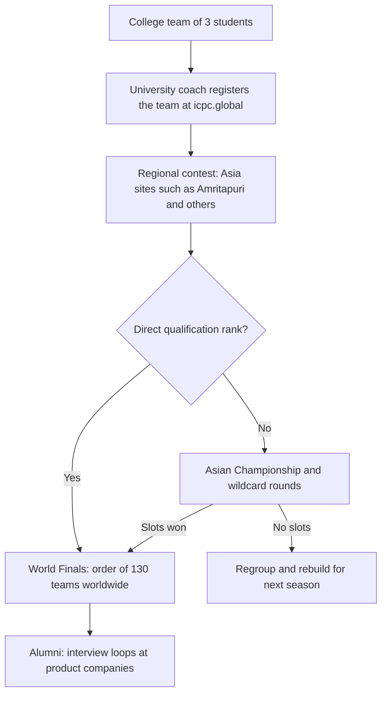
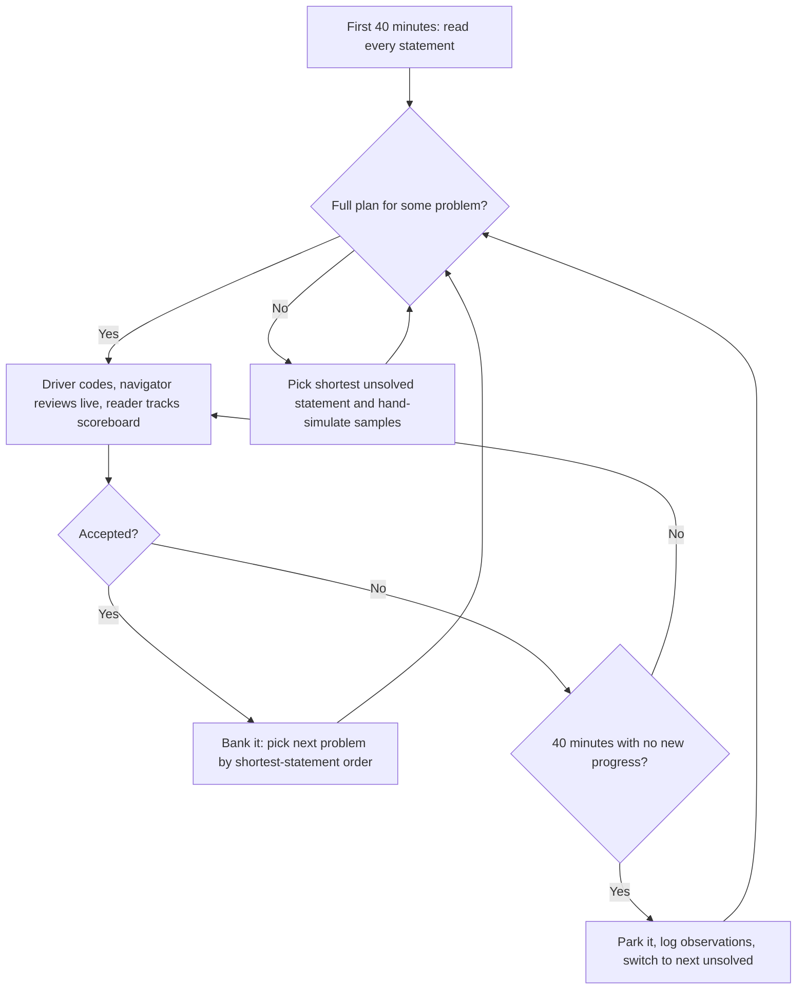

# ICPC Guide — Format, Pipeline, and Team Strategy

## Overview

The International Collegiate Programming Contest (ICPC) is the oldest and largest team-based programming competition for university students: teams of three, one machine, five hours, and roughly 10–13 problems judged all-or-nothing. For Indian placement candidates it matters for two different reasons. As a participant, it is the highest-density training environment for the skills product-company loops actually probe — implementing complex specifications without bugs under a hard clock, and doing it while exhausted. As a non-participant, understanding its format still matters, because ICPC alumni are your interview competitors and because the penalty-and-freeze mechanics below are the cleanest formal model of "coding under pressure" that interviews approximate. This page covers the format, the qualification pipeline into and out of India, team strategy, archives, and what the experience signals to recruiters; the algorithmic material itself lives in the [DSA track](../dsa/README.md).

## What the ICPC Is

### Scale and History

The modern contest traces its lineage to the 1970s and has run under the ICPC Foundation since 2019 (previously under ACM), with the official rules, eligibility windows, and regional structure published at [icpc.global](https://icpc.global). Its scale is unmatched in collegiate programming: participation is measured in tens of thousands of students across thousands of universities each season, funneling through dozens of regionals on six continents into a World Finals of roughly 130 teams. The problem sets are written by committees of veteran problem-setters and are widely regarded as the reference standard for statement quality and hidden-test discipline. For Indian colleges, ICPC Asia regionals are the only multi-university contest of this scale that most students will ever enter, which is why the season around regionals dominates the campus competitive-programming calendar.

### Eligibility and Team Composition

A team is three students from the same university, plus at most one reserve/backup per the current rules, coached by a faculty or staff member who handles institutional registration. Eligibility is bounded by enrollment windows and cumulative participation caps (students who have competed in multiple World Finals age out), and the exact cutoffs are revised season by season — always read the current rules on [icpc.global](https://icpc.global) rather than relying on seniors' memories. The composition rule has real strategic consequences: three students must fit their entire collective knowledge into one shared notebook and one shared keyboard, which forces the role specialization and reference-document discipline described later in this page. Graduate-student eligibility varies by region and season, so first-year postgraduate students should verify before forming a team.

## Contest Format and Rules

### The Five Hours, Structured

Each regional runs five hours with 10–13 problems in C++, Java, or Python (site-dependent language policy; C++ remains the default choice of nearly every serious team). Judging is binary per problem — accepted or rejected, with no partial credit — and each accepted submission earns balloons on the scoreboard visible to the room. Wrong submissions carry a 20-minute penalty each, applied only if the problem is eventually solved; compile errors are traditionally not penalized in ICPC rules, but local sites occasionally deviate, so verify in the contestant briefing. Teams may bring a printed team reference document (typically bounded around 25 pages per the current rules) — the only external material allowed — which turns pre-contest library preparation into a scored advantage. One machine per team is the defining constraint: it converts typing speed, code-review discipline, and queue management into explicit strategy.

### Scoring and Penalty Math

The scoreboard ranks teams by number of solved problems, breaking ties by total elapsed time. For each solved problem \\( p \\), the contribution is the minute of first acceptance plus 20 minutes for each prior rejected run of that problem; unsolved problems contribute nothing regardless of how close they came. Formally:

\\[
T = \sum_{p \in S} \left( t_p + 20 \, r_p \right)
\\]

where \\( S \\) is the set of solved problems, \\( t_p \\) the minute of acceptance, and \\( r_p \\) the count of prior rejections. Worked example: a team solves A at minute 25 with no rejections (contributes 25), solves C at minute 100 after two rejected attempts (contributes \\( 100 + 2 \times 20 = 140 \\)), and burns four rejections on B without ever solving it (contributes 0). Total: \\( 25 + 140 = 165 \\), and a team that solved the same three problems but in a different order with fewer rejections beats them despite identical solve counts. Two strategic consequences follow. Risky submissions have quantified downside — a 50/50 guess that costs 20 minutes is often still correct to send, because information from the judge is worth 20 minutes of three people staring at a wall — and late solved problems dominate tie-breaks less than early clean solves, so front-loading reliable problems is mathematically correct.

### The Economics of a Rejection

The 20-minute penalty is best understood as the price of information rather than the cost of failure. When three people have burned 40 minutes on a solution they cannot break locally, the judge's verdict is cheaper than another 40 minutes of unaided review, which is why disciplined teams submit earlier than intuition suggests. The price is not constant, though: early in the contest a rejection costs almost nothing because the tie-break pool is small, while a rejection at minute 280 both costs the 20 minutes and consumes wall-clock that could finish a different problem. Teams that internalize this develop the characteristic ICPC rhythm — fast, well-reviewed early submissions, tightening verification standards as the clock advances.

### Clarifications, Judging, and Balloons

Contest mechanics around judging are part of the format's training value. Teams can file clarification requests when a statement is genuinely ambiguous, and the answers — broadcast to all teams — occasionally decide the contest, so the reader role includes watching clarification traffic. Rejected submissions return a single verdict (wrong answer, time limit exceeded, runtime error) with no failing test shown, which forces the team's own testing discipline: stress-testing against brute-force implementations is a standard in-contest activity, and a team without a brute-force harness habit loses problems to invisible edge cases. Balloons delivered per solve are more than decoration; the balloon distribution in the room is live difficulty information, and readers track which problems other teams are solving to recalibrate their own reading order.

### A Penalty-Aware Submission Policy

The economics above become operational as a fixed policy agreed before the contest, so mid-contest emotions never set the verification standard. The policy scales review depth with the clock, spending cheap early minutes freely and expensive late minutes carefully:

```text
Submission policy (tuned by clock):
  minute < 120    navigator reads the full code; submit on navigator approval
  minute 120-240  navigator approval plus one hand-simulated edge case per constraint
  minute 240+     both checks plus a brute-force stress run on 200 random small cases
  after freeze    three-person read of the final diff; nothing unreviewed goes out
```

The policy also encodes who owns the submit button: the driver submits, and nobody else touches the keyboard for it, because split ownership produces double submissions of half-tested variants. Teams should rehearse the policy during mocks until the clock-to-review-depth mapping is reflexive.

### Language Choice at Regionals

C++ dominates ICPC for structural reasons, not nostalgia. The five-hour format with 10–13 problems rewards the language with the fastest constant factors (time limits are set generously but not Python-generously), the richest standard library for contest idioms (STL sort, sets, maps, priority queues, and tuples), and the largest base of template code across community TRDs. Java appears on some teams for its BigInteger and string utilities, and Python appears occasionally where sites permit it, usually for arithmetic-heavy one-off problems — but nearly every serious team drives its main contest in C++, because a large constant-factor gap changes which algorithms fit inside the time limit. The practical rule for a first-season team: pick the language all three can already write under pressure, standardize the fast-I/O scaffold in the TRD, and never allow language choice to be re-litigated mid-season.

### Scoreboard Freeze and Endgame Behavior

The scoreboard freezes for the final hour (the exact window is announced per site, but the last hour is standard). A frozen board shows every team's last solves as indeterminate submissions, which turns the final hour into a probability game: coaches and teams in the audience read submission counts and attempt patterns to guess which frozen cells will turn green. For the team on the floor, the freeze changes behavior in two ways. First, submission decisions become sharper — sending a half-tested solution in minute 280 cannot be corrected by scoreboard feedback, so the expected-value calculation from the penalty section must be done blind. Second, teams behind on solves should treat the final hour as the moment to commit to one high-probability finish rather than spreading three people across three 20% chances.

### Anatomy of a Statement

ICPC statements follow a fixed anatomy, and teaching the team to parse it mechanically is a one-hour exercise that pays for the whole season. The statement opens with a story paragraph that is almost entirely decoration — skip it on first read. What matters arrives in order: the input section (sizes, ranges, and format of every token), the output section (exact formatting, trailing whitespace, and case), the constraints block, and one worked sample with an explanation. The failure mode of untrained readers is solving the story they imagined rather than the specification written, and the reader role's discipline — requiring each solver to restate input, output, and constraints aloud before coding — exists precisely to catch that. Statements also reward re-reading: a second pass after 30 minutes of coding frequently reveals a simplifying constraint that was invisible during the first pass.

Treat the samples as part of the specification, not a courtesy. A solution that fails the provided sample has a bug with probability near one, so passing samples locally before every submission is the baseline discipline; conversely, a solution that passes samples proves almost nothing about correctness, because samples exercise a sliver of the constraint space. The professional move is to hand-simulate the sample with the actual code rather than the intended algorithm — reading the code's behavior on the sample is how navigators catch the classic off-by-one and swapped-argument bugs that the author's mental model hides.

### Constraint Decoding

Constraints encode the intended complexity, and decoding them is a fixed lookup table worth memorizing. With \\( n \le 20 \\), exponential or bitmask search is intended; with \\( n \le 500 \\), an \\( O(n^3) \\) flow or DP fits; with \\( n \le 5000 \\), expect \\( O(n^2) \\); with \\( n \le 10^5 \\) or larger, the setter wants \\( O(n \log n) \\) or linear; and when the answer is required modulo a large prime, the true count is astronomically large and usually combinatorial. Multi-dimensional constraints narrow it further — a budget stated as \\( n \cdot m \le 2 \times 10^5 \\) across two dimensions signals an \\( O((n+m) \log n) \\) approach on a flattened structure. The habit matters more than the table: before writing a line of code, every solver should state the implied complexity budget from the constraints, because a solution one complexity class too slow is worth zero in this format — there is no partial credit to harvest, unlike the olympiad format described in the [IOI Guide](./ioi-guide.md).

## The Competition Pipeline



The funnel from Indian colleges outward runs through the Asia region. Asia runs many regionals each season — historically including large Indian sites such as Amritapuri, with other Indian and Asian sites changing from season to season, so check the current site list rather than assuming last year's map. Top regional teams qualify directly for the World Finals, and the remaining slots from the continent are decided through the Asian Championship and wildcard mechanisms; the exact split of slots per regional is published each season. A college enters the pipeline by institutional registration: a coach registers the university at [icpc.global](https://icpc.global), registers teams, and each team then registers for specific regional sites whose registration windows fill quickly — Amritapuri's slots, for instance, have historically filled within hours of opening.

### Registration Logistics and Costs

The logistics are lighter than most first-time teams assume, which is why the real barrier is preparation rather than paperwork. Registration runs through the coach on [icpc.global](https://icpc.global) with per-site windows, and Asia regionals are typically onsite events, so the real costs are travel and a day or two of schedule — fees are modest and frequently borne by the institution. What does need lead time: the coach's institutional account, team member identity details, and site slot booking, because popular sites fill within hours. Teams should also verify each site's language policy, machine setup, and permitted reference material, since these vary and directly affect TRD design and language choice.

### The India Context

India's regional footprint is large but unevenly distributed: a handful of engineering colleges consistently field 10–30 teams each season, maintain permanent problem archives and notebooks, and run internal selection contests months in advance, while most colleges show up with teams formed two weeks prior. The gap is organizational, not talent-based, and it closes with the three artifacts this page emphasizes — a selection contest, a role split, and a rehearsed reference document. For an individual student at a college without ICPC culture, the entry path is to recruit two committed teammates, find a faculty coach (a formality that takes one email), and treat the first season as reconnaissance: qualify nothing, but return with a full archive of that regional's problem set and a penalty-aware post-mortem. Second-season teams from the same college routinely outperform first-season teams from stronger colleges, because the pipeline rewards rehearsal cycles more than raw rating.

### Building a College ICPC Culture

Colleges with sustained ICPC presence share three institutional habits, and all three are copyable by a single motivated batch. They run an internal selection contest 3–4 months before regionals, which both finds committed teams and creates a visible junior ladder. They maintain a shared archive — past mocks, post-mortems, and the current TRD — handed down between batches, so season two starts from season one's notes instead of zero. And they keep one faculty coach relationship warm across years, because registration windows, site changes, and eligibility interpretation all flow through the coach. The cost of these habits is a few hours a month; their effect is that the college's third season produces qualified teams as a routine output rather than a surprise.

### What the Asian Championship Means

The Asian Championship (introduced into the modern Asia structure) concentrates the continent's qualified teams into one additional high-stakes round that awards a block of World Finals slots beyond the direct regional quotas. For Indian teams it functionally raises the ceiling: a team that narrowly misses direct qualification at its regional still reaches the Worlds through championship performance. Practically, it also changes late-season strategy — teams on the bubble prepare the championship's problem style (which mirrors World Finals difficulty more than regional difficulty) and treat the regional itself as partially a seeding exercise. The eligibility and slot arithmetic shifts season to season, so the team's coach, not team members, should own tracking it.

## Team Strategy

### The Hour-by-Hour Skeleton

Strategy sections describe principles; a contest needs a clock. The skeleton below is the standard shape of a competent team's five hours — not a script, but a default against which deviations are conscious decisions. Times assume a 5-hour regional with 10–13 problems.

```text
Hour 0-1      read every statement; reader ranks by plan-clarity; solve most mechanical first
Hour 1-2      bank 1-2 short problems; balloon traffic confirms or corrects the ranking
Hour 2-3      main implementation block on the strongest planned problem; rotate driver if stuck
Hour 3-4      scoreboard pass: bank anything several teams are solving; park dead ends
Minute 240    freeze approaches: tighten verification, decide the endgame plan explicitly
Final hour    frozen board: commit to one high-probability finish, navigator runs full checks
```

The skeleton's most violated line is the minute-240 endgame decision. Teams drift into the final hour with three half-plans and no commitment, and the freeze converts that indecision into three frozen wrong submissions instead of one frozen right one. Appointing the reader as the owner of the clock — the person who announces "ten minutes to freeze decision" — is the cheapest fix.

### Role Split: Driver, Navigator, Reader

Serious teams assign three roles and rotate them mid-contest only when the scoreboard demands it. The driver types at the machine; the navigator reads the driver's code in real time, catches typos and edge-case misses before submission, and owns the compiler-and-test loop; the reader owns the problem statements, tracks the scoreboard, and maintains the whiteboard state of what is attempted, parked, and solved. The division exists because the one-machine constraint makes simultaneous work impossible — three people can contribute simultaneously only if exactly one is typing. In practice the roles map to skills: the fastest correct coder drives, the best bug-catcher navigates, and the fastest reader with the calmest scoreboard temperament reads. Teams that skip role assignment reliably exhibit the classic failure: all three clustered at one screen while three unsolved problems go unread.

### Reading Order and Problem Selection

The reading phase is where regionals are won. The standard heuristic set: read all statements in the first 30–40 minutes, and read them shortest-first or in increasing estimated difficulty, because short statements are usually easier to implement and give the judge-feedback loop a chance to start early. Rank problems by a quick hand-assessment of "do we have a full plan?" rather than by topic familiarity — a medium-difficulty problem with a known algorithm beats an easy-looking one whose solution nobody can pin down. Track the accepted-order signal: if several teams solve problem K early, K is likely mechanical, so its statement deserves a second read even if it looked unappealing. The reader maintains this ranking on the whiteboard, and the team revisits it after every submission verdict.

### When to Switch Problems



The switch threshold matters more than the coding itself. A team that switches every 15 minutes never accumulates the deep progress that hard problems require, while a team that never switches donates 90 minutes to one problem while three easy ones sit unread — both lose to teams with a disciplined threshold. The 40-minute mark is a common working rule because it roughly matches "three distinct attack attempts with no new state"; when the threshold fires, the switch must be total (park the notes, change solver) rather than nominal. Parked problems get revisited late in the contest with fresh eyes, and the reader keeps parked observations on the whiteboard so nothing is lost.

### The Whiteboard State

The whiteboard is the team's shared memory, and its organization is a learnable skill. A functioning board carries four zones: solved (with minute), in-progress (with owner), parked (with a one-line state summary), and unread; every transition updates it, and the reader enforces it. The value shows at every handoff — a driver swap that would otherwise cost ten minutes of context reconstruction costs thirty seconds by pointing at the parked zone. Teams that skip the board rediscover the same fact every hour: five hours exceeds any individual's working memory for thirteen problems' worth of state.

### Common First-Season Mistakes

The first failure is preparing individually until the final month and then discovering, in one brutal mock, that coordination is a separate skill: three strong soloists routinely lose to a team of three medium soloists who have practiced forty contests together. The second is assembling the TRD in the week before regionals — untested templates are worse than absent ones because they consume trust and clock time simultaneously. The third is skipping the reading-phase discipline and letting the strongest coder start on problem A immediately, which feels like action and costs the team the cheap problems sitting further down the set. All three failures are visible in advance — a mock calendar, a template test suite, and a reader role are the respective fixes, and every one of them is cheap to install in month one.

### The Team Reference Document

The team reference document (TRD) is the printed notebook of pre-coded, pre-tested templates — the single highest-leverage preparation artifact a team owns. It converts five hours of implementation pressure into page-flipping: a working Dinic's or a tested FFT costs 40 minutes to write under contest stress and 40 seconds to copy from a page that was tested months earlier. The table shows the standard core; each team extends it toward its own strengths.

| Template | Typical use in ICPC sets | Why a template beats writing it live |
|---|---|---|
| DSU (path compression, union by size) | Connectivity, Kruskal, offline edge processing | Short, but bug-prone under stress; used in multiple problems per set |
| FFT / NTT | Convolution, counting via products, big-number arithmetic | Nearly impossible to write correctly in-contest from scratch |
| Matrix exponentiation | Linear recurrences at huge \\( n \\) (Fibonacci-style state machines) | The recurrence-to-matrix translation is mechanical once templated |
| Computational geometry library | Convex hull, segment intersection, polygon area | Floating-point eps decisions are made once, calmly, not at minute 260 |
| Segment tree with lazy propagation | Range update/aggregate in problems disguised as DP | The longest template; every minute saved is a minute of debugging avoided |
| LCA via binary lifting | Tree distance and ancestor queries | Pairs with tree-flattening tricks; frequent subtask of harder problems |

Build the TRD in the off-season from [cp-algorithms.com](https://cp-algorithms.com) reference implementations rather than writing from memory, then test every template against stress cases before it earns a page. Rehearse the physical act too: teams practice finding a template within 10 seconds, because in-contest page-flipping under panic is a learned skill. The document is bounded by page limits that vary by site, so the final version is an editorial act — including a template you cannot reliably use is worse than omitting it.

The scaffold every page assumes is short enough to memorize, but printing it still saves the first ten minutes:

```cpp
#include <bits/stdc++.h>
using namespace std;
using ll = long long;

int main() {
    ios::sync_with_stdio(false);
    cin.tie(nullptr);
    // parse input, call solve(), print answer
    return 0;
}
```

Two TRD habits separate functioning documents from shelf-ware. First, every template carries a header comment stating its complexity and exact interface — the in-contest cost of a template is reading its interface, so the header is the product. Second, the document is versioned like code: each season's post-mortem records which templates were used, which were dead weight, and which missing template cost the team a problem, and the next season's edition is edited accordingly.

## Practice Method: From Archive to Mock Regional

### Running a Team Practice

A team practice is a full past regional run under real conditions, and its value comes entirely from what surrounds the five hours. Before: the team agrees on a start time matching the real contest window, prints the current TRD, and sets one machine per team — no editor tabs of solutions, no pausing. During: standard contest mechanics, with the reader maintaining the whiteboard state. After, within the same day: a 30-minute post-mortem using a fixed template, because unstructured "we should have solved E" conversations evaporate within a week. Two full practices per week is the realistic ceiling for a student team balancing coursework; one full mock plus one shorter drill (a 90-minute three-problem sprint) is the sustainable floor.

```text
Team post-mortem template (fill within 24 hours of the mock):
  1. Solved: problem, minute, rejections, driver name
  2. Parked: problem, why parked, what state existed
  3. Unsolved and unattempted: why the reading phase missed it
  4. Penalty review: every rejection — was it worth the information?
  5. Role friction: one thing each role would change
  6. TRD gaps: templates needed but missing or unfindable
```

### Individual Skill Between Practices

Team practices train coordination, but the underlying individual skill is built alone on rated platforms. A realistic individual load during season is 3–5 Codeforces rounds or virtuals per month plus targeted CSES sections, with each round followed by the same miss-tag discipline the team post-mortem uses. The two development loops feed each other: individual rounds raise the baseline implementation speed that makes the driver role effective, while team mocks expose coordination failures that individual rounds never show. Teams that run only one loop predictably fail the other's test — all-individual teams collapse on coordination, all-team teams plateau on speed.

### The Stress-Testing Harness

The in-contest habit that converts rejections into rare events is a two-minute stress test, and it needs a harness rehearsed before the season:

```bash
# generate a random small case, then compare brute force vs fast solution
python3 gen.py 7 3 > in.txt
./brute < in.txt > out_bf.txt
./fast  < in.txt > out_fast.txt
diff out_bf.txt out_fast.txt && echo OK
```

The generator is written per-problem in five minutes (random sizes inside the brute-force-able range, valid by construction), the brute force is any obviously-correct exponential version, and the loop runs while the driver explains the approach to the navigator. A diverging case is worth more than thirty minutes of staring, because it converts an invisible wrong-answer into a reproducible test. Teams should keep the harness scripts in the TRD's back pages so setup under pressure is a copy-paste, not an invention.

## Archives and Practice Sources

Past ICPC problem sets are the correct practice material because they train format, not just algorithms. [qoj.ac](https://qoj.ac) hosts recent ICPC regionals and World Finals with judging and mirrors, making it the primary archive for current-format practice. [vjudge.net](https://vjudge.net) aggregates contests and gyms across judges and supports virtual multi-hour participation with a shared team view. The ICPC Live Archive (Kattis) holds older sets that are still valuable for fundamentals despite dated judging infrastructure. Codeforces gyms at [codeforces.com](https://codeforces.com) carry many historical regionals, and the platform's rated divisions remain the best individual-skill development ground between team practices. For foundations, the CSES problem set at [cses.fi/problemset](https://cses.fi/problemset) covers the algorithmic core that ICPC sets assume silently.

### ICPC Style vs Codeforces and LeetCode

| Dimension | ICPC | Codeforces | LeetCode |
|---|---|---|---|
| Team size | 3 students, 1 machine | Individual | Individual |
| Judging | Binary per problem, 20-min penalty per rejection | Binary, plus hacking phase | Binary with failing-test feedback |
| Statement style | 1–2 pages, story-heavy, multi-constraint | Short, one screen | Shortest, often wrapped in scenarios |
| Time structure | 5 hours, 10–13 problems shared | ~2 hours, 4–6 problems individual | 90 minutes, 4 problems |
| Allowed materials | Printed team reference document | None beyond the language | None |
| Signal to recruiters | Team stamina and systems-style endurance | Individual speed and rating | Interview-pattern fluency |

The style differences drive training choices. ICPC statements bury constraints in prose and often require combining two or three algorithms in one solution, so ICPC practice is partly a reading-comprehension discipline. Its problems assume Marathon-length concentration — five hours is double a LeetCode contest and triple a typical interview coding slot — which is exactly why the recruiter signal exists (next section). A LeetCode Knight converting to ICPC must add endurance, teamwork, and reference-document habits; an ICPC regionalist converting to interviews must add communication and the ability to narrate decisions aloud rather than silently distributing them across a team.

### Organizing a Season's Archive

An archive without structure decays into a folder of PDFs nobody opens. The working layout is one folder per contest (regional, mock, or gym), containing the problem set, the team's submissions, and a single notes file with per-problem entries: intended technique, what the team tried, why it failed, and a re-solve date for every unsolved problem. The re-solve queue is the part that produces skill — unsolved problems re-enter individual practice on a two-week cycle until solved cold, at which point the entry closes with the final approach written in one paragraph. At season's end, the archive's notes files are condensed into a one-page per-regional summary that becomes the college's handoff artifact, which is how institutional memory compounds instead of resetting each year.

## A Twelve-Month Prep Timeline

| Months before regional | Focus | Concrete output |
|---|---|---|
| −12 to −9 | Individual fundamentals: core algorithms, C++ STL fluency, CSES problem set | Personal template library, v1 of the TRD |
| −9 to −6 | Team formation and rhythm: 2–3 joint virtual contests per week on qoj.ac archives | Roles assigned, post-mortem format fixed, v2 TRD |
| −6 to −3 | Format immersion: full 5-hour mock regionals, penalty-aware submission policy | Contest instincts, stress-tested templates, geometry and string libraries added |
| −3 to −1 | Specificity: mock contests at the real time of day, past sets of your actual regional site | v3 TRD printed and bound, problem-reading drill rehearsed |
| −1 to 0 | Taper: light volume, sleep schedule, one-machine rotation drills, logistics check | Final rehearsal, travel and registration logistics confirmed |
| 0 to +1 | Post-contest: full archive of your regional set, written post-mortem, recruiting season overlap | Archive shared with the college's next cohort |

Two timeline notes from experience-shaped hindsight. The −9 to −6 block is where teams are actually made — joint practice cadence predicts regional outcomes better than any individual rating, because the contest tests coordination under fatigue rather than knowledge. And the post-contest block is not optional bookkeeping: the archive and post-mortem are what convert one season's exit into the next season's qualification, and at colleges with a sustained ICPC culture, that handoff artifact is the main institutional advantage.

### Adjusting for a Two-Year Horizon

The twelve-month table compresses what strong teams actually do across two seasons. In a two-year plan, year one buys the fundamentals block twice as thick — the full CSES set, a personal template library, and 40–60 individual rated rounds — while team formation happens midway through year one rather than month four. Year two then runs the table as written but starts from a v2 TRD inherited from year one's post-mortems, which is why second-season teams qualify at rates first-season teams cannot match. The rule of thumb: every month of the table can be shifted one season earlier for a team with prior individual depth, and the marginal month is best spent on joint mocks, which no amount of individual practice substitutes for.

## What ICPC Signals to Recruiters

Product companies read ICPC participation as a compressed stress test of exactly the properties interviews can only sample. A regionalist has spent five contiguous hours implementing nontrivial specifications with a compile-test-submit loop, which is the same motor skill as a full working day of systems debugging — the "stamina" signal interviewers describe when they say ICPC candidates do not degrade in round 3. Team roles add a second signal: driving while someone reviews your code live is a rehearsal for pair-programming and code review culture, and reader duty rehearses triage — deciding what to work on next is the day job of a senior engineer. The qualification level calibrates the signal's strength: World Finals participation is a resume filter at most product companies, a regional medal is a strong-plus at Indian product companies and startups, and bare participation with a disciplined archive still reads as evidence of deliberate practice. What it does not signal is breadth outside algorithms — system design, databases, and behavioral skills remain fully untested, which is why ICPC-heavy candidates still need the rest of this book's tracks.

### Where It Counts in the Indian Funnel

The signal lands at specific funnel stages, unevenly. At resume screening, ICPC lines are among the few externally verifiable technical filters a fresher resume can carry, competing with open-source contributions and shipped projects. At coding rounds, regionalists clear the OA band with far less preparation load, freeing season time for the interview rounds that actually filter them. At product-company loops, the stamina and error-discipline signals appear in rounds 2–3, where interviewers explicitly raise difficulty to find the ceiling. Startups and quant-adjacent firms price contest background most heavily, some running dedicated harder tracks for it, while mass recruiters price it least because their OA ceiling sits at Medium anyway. The rational strategy for an ICPC participant is therefore to aim effort at funnels where the signal is priced — product companies, startups, quant-adjacent roles — rather than distributing effort evenly across funnels that cannot use it.

### Balancing ICPC with the Placement Season

In Indian colleges the regional season and the placement season overlap, and the collision needs an explicit policy rather than heroic improvisation. The workable default: treat the regional as the priority until it concludes, because it is a once-a-year, non-repeatable event, while placement OAs recur across the season and reward exactly the skills the regional builds. After the regional, redirect the momentum deliberately — the archive and miss-tag discipline convert directly into OA preparation, and the TRD's fast-I/O scaffold becomes the OA template. Candidates who instead abandon contest prep in month one of placements usually lose both: contest form decays without practice, and OA performance depends on the same timed skills they stopped training.

## Interview Questions

1. **Why do recruiters value ICPC experience beyond raw contest skill?** The five-hour format trains sustained implementation quality under fatigue, and product companies know their later interview rounds and actual workloads select for exactly that stamina. The one-machine team constraint rehearses collaboration mechanics — live code review, role handoffs, and triage decisions — that map onto pair programming and engineering-team workflows. ICPC also proves error discipline: a 20-minute penalty per rejected submission trains the habit of testing before submitting, which transfers directly to how engineers treat CI and code review. Finally, the qualification pipeline is selective enough that even regional participation functions as a verified, externally-checkable filter on a resume.

2. **Is it ever correct to submit a solution you are not confident in?** Often, yes, because the judge's answer is information that three people cannot cheaply produce themselves. The expected-value framing: a rejection costs 20 penalty minutes, while an unsubmitted correct idea costs the entire problem, so a submission with even a moderate acceptance probability usually beats another 30 minutes of unaided verification. The calculus shifts near the freeze and near the endgame — a rejection at minute 290 on a problem you could still finish costs both the penalty and the wall-clock. The discipline that makes this work is the navigator's pre-submission review, which keeps the baseline acceptance probability high enough for the gamble to be rational.

3. **How should a team split roles in its first season?** Start from skill asymmetries: the most accurate fast coder drives first, the strongest debugger navigates, and the fastest reader handles statements and scoreboard. Rotate roles across practice contests before the regional, not during it, so each member has felt every role's pressure and the team knows its fallback assignments. During the contest, change roles only at natural boundaries (after a submission verdict or a park decision), because mid-implementation handoffs lose more time than they gain. Teams without any role structure should at minimum enforce the reader role — someone must always be reading unsolved problems rather than watching the driver type.

4. **What belongs in a team reference document, and what does not?** Include pre-tested implementations of algorithms your team can actually recognize and use: DSU, FFT/NTT, matrix exponentiation, a computational geometry library, lazy segment trees, LCA, string hashing, and a fast-I/O scaffold. Exclude anything the team cannot confidently adapt — an unused FFT template is page budget wasted and a false sense of coverage. Every template earns its page by surviving stress tests against brute-force random cases in the off-season, and the page limit forces editorial decisions about marginal items. Physically rehearse retrieval: a template that takes 60 seconds to find under stress might as well not exist, so tabbing, ordering, and consistent formatting are part of the artifact.

5. **How does ICPC problem style differ from LeetCode or Codeforces, and why does it matter for practice?** ICPC statements are long, story-driven, and constraint-rich, often requiring two or three algorithms composed in one solution, with binary judging and no failing-test feedback. LeetCode trains pattern recognition with short statements and partial feedback; Codeforces trains individual speed on dense, short problems. The practical difference for preparation is that ICPC practice must include reading endurance and team debugging — skills that neither platform tests — which is why serious teams practice on archived regionals at [qoj.ac](https://qoj.ac) rather than on rated individual rounds alone. The flip side matters too: an ICPC candidate moving to interviews must learn to narrate decisions aloud, since silent internal triage is a liability in a one-on-one loop.

6. **Your team solves 4 problems in the first 2 hours, then stalls. What is the correct endgame plan?** First, re-run the reading phase: reread the two or three unread or unparked statements with the scoreboard signal in mind — problems other teams are suddenly solving are usually mechanical. Second, split the stalled problems by risk profile: one person takes the highest-probability partial plan, another takes the cheapest full brute-force with precomputation, and the reader hunts for degenerate edge cases in problems already attempted. Third, commit to the freeze arithmetic: with one hour left and a frozen board, finish exactly one problem rather than triple-tracking three 20% chances, because one solved beats three abandoned. The teams that gain ranks in the last hour are the ones that planned the endgame before the freeze, not during it.

## Key Takeaways

- ICPC is teams of 3, one machine, 5 hours, ~10–13 binary-judged problems, 20-minute penalties per rejected run, and a scoreboard freeze in the final hour — a formal model of coding under pressure.
- Scoring is \\( \sum (t_p + 20 r_p) \\) over solved problems, so submission risk is quantifiable and front-loading reliable solves is mathematically correct.
- The pipeline runs college teams through coach-based registration at icpc.global to Asia regionals (sites change seasonally; Amritapuri historically the largest Indian site), then via direct rank or the Asian Championship to a World Finals of roughly 130 teams.
- Role split (driver/navigator/reader) is the one-machine constraint turned into strategy; the reader role is the most neglected and the most valuable.
- Reading-order heuristics — all statements in 40 minutes, shortest-first, scoreboard-aware — decide regionals before implementation starts.
- The team reference document (DSU, FFT/NTT, matrix power, geometry library, lazy segment trees, LCA) converts contest stress into page-flipping; it must be stress-tested and physically rehearsed.
- Practice on format, not just algorithms: qoj.ac, vjudge.net, Codeforces gyms, and the CSES problem set cover current and historical sets.
- ICPC signals stamina, live-review collaboration, and error discipline to product companies — and nothing about system design or breadth, which remain separate tracks.

## References

- ICPC official site — rules, eligibility, regional structure, registration: <https://icpc.global>
- QOJ — recent ICPC regionals and World Finals with judging and mirrors: <https://qoj.ac>
- VJudge — aggregated contests and virtual team participation: <https://vjudge.net>
- Codeforces — rated individual rounds and gyms carrying historical ICPC sets: <https://codeforces.com>
- CSES Problem Set — the algorithmic core ICPC sets assume: <https://cses.fi/problemset>
- cp-algorithms.com — reference implementations for building the team reference document: <https://cp-algorithms.com>
- ICPC Live Archive (Kattis) — older ICPC problem archive, referenced by name only

## Cross-References

- [Competitive Programming Index](./README.md) — the platform and contest landscape this guide sits inside
- [Codeforces Guide](./codeforces-guide.md) — the individual-rated complement to ICPC's team format
- [AtCoder Guide](./atcoder-guide.md) — problem-quality benchmarking and additional rated practice
- [Contest Calendar and Code List](./contest-calendar-codelist.md) — scheduling regionals, mocks, and rated rounds across the season
- [Complexity Analysis](../dsa/chapters/ch03-complexity-analysis.md) — the complexity thresholds ICPC constraints silently encode
- [Interview Index](../interview/overview.md) — how contest backgrounds are weighed inside full interview loops
- [Placement Preparation Index](../placement-preparation/README.md) — where the ICPC season overlaps the placement calendar
