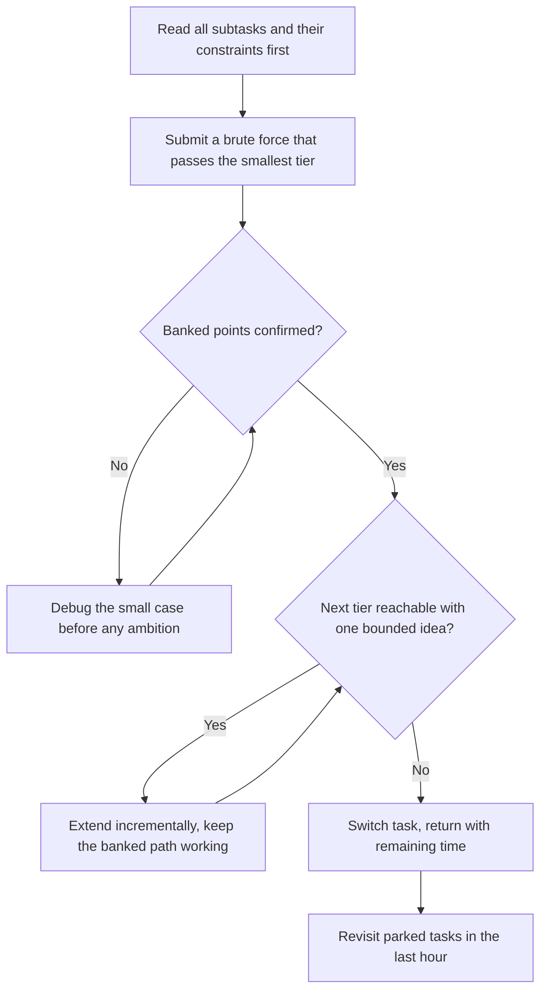
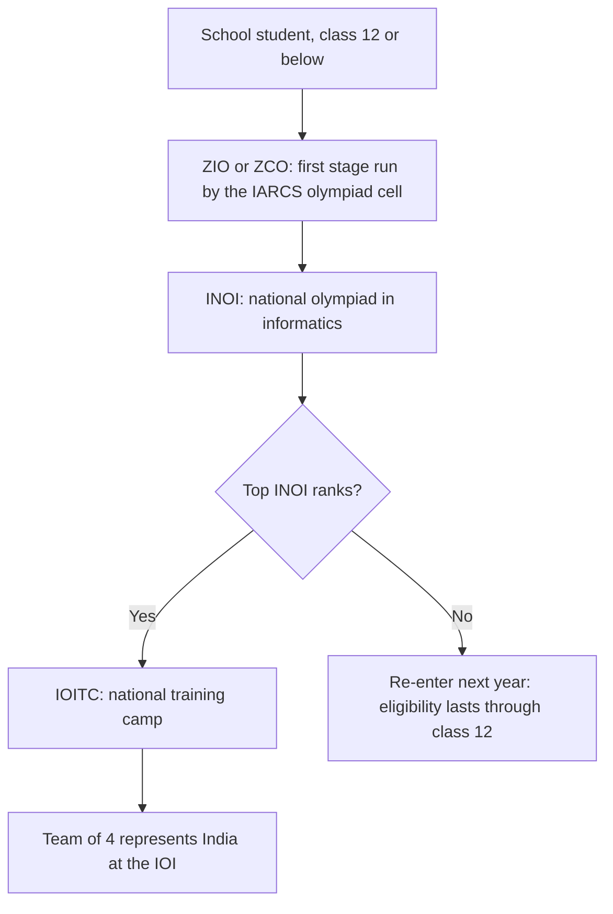

# IOI Guide — Olympiad Format, Partial Scoring, and the India Path

## Overview

The International Olympiad in Informatics (IOI) is the premier algorithmic competition for secondary-school students, held annually since 1989 with roughly 350 participants from over 90 countries competing as individuals over two five-hour contest days. It matters to this book for two audiences. For school students, it is the top of the olympiad ladder that runs through ZIO/ZCO, INOI, and the IOITC training camp, and it shapes the strongest early technical resumes in the country. For college candidates and working interviewers, its defining mechanic — subtasks with partial scoring — is the cleanest formal model of how modern online assessments reward partial correctness, and understanding the strategy it teaches is directly transferable to placement OAs. This page covers the contest format and task types, the official syllabus, the archives and training ladders, the India selection pipeline, and the strategy differences partial scoring creates; the algorithms themselves live in the [DSA track](../dsa/README.md).

The page is written for two reading modes, and both work standalone. A school student should read it linearly, because the ladder and the pipeline sections are sequenced by year. A college candidate or interviewer can jump straight to the task-types and OA-mapping sections, which stand on their own arithmetic.

## What the IOI Is

### Format and Scale

The IOI is an individual competition: no teams, no shared machines, two contest days of five hours each, with scores from both days summed for the final ranking. Participation is national-team-based — each country sends a small delegation (typically up to four students, with exact quotas varying by year and host rules), and the field of roughly 350 contestants from 90+ countries makes it the largest event of its kind for pre-university students. Medals are awarded in roughly a 1:2:3 gold:silver:bronze ratio of the field, so a medal is a strong but achievable target for a well-prepared student, unlike the single-winner structure of many contests. Everything authoritative — current regulations, host announcements, past tasks — is published at [ioinformatics.org](https://ioinformatics.org), and the site's archive is the canonical record of the competition's history.

### Scoring, Medals, and What Is Achievable

The final score is the sum of two contest days, which changes preparation incentives relative to single-round contests: one catastrophic day does not end a medal bid, and consistency across two independent problem sets is the skill actually being ranked. Medal cutoffs vary year to year with problem difficulty and field strength, so the realistic planning unit is not a specific score but a per-day points target derived from past medal boundaries, which the official archive makes easy to reconstruct. Indian results have historically concentrated in the bronze-to-silver band, with gold requiring either exceptional depth or multiple camp years — a distribution that says more about coaching infrastructure than talent. For a student planning three years of preparation, the achievable trajectory to aim at is bronze in year two and a genuine medal-contending score in year three, which the ladder in this page is designed to produce.

### The Two-Day Rhythm

The two-day structure is a fatigue-management problem layered on top of an algorithmic one. Day 1 performance sets a psychological anchor — a bad day 1 statistically degrades day 2 unless the student has rehearsed recovery explicitly, which is why camp training runs back-to-back days rather than isolated contests. Between-day routines matter: fixed sleep, no post-mortem roulette the evening between days (review banked points, not leaderboard positions), and a rehearsed opening ritual for day 2. Within each day, the standard plan is the banking loop from the previous section plus one deliberate clock check at the two-hour mark, because five hours without midpoints encourages the single-problem death march. Students who treat the IOI as two sprint contests consistently underperform students who treat it as one two-day economy of points.


The final score is the sum of two contest days, which changes preparation incentives relative to single-round contests: one catastrophic day does not end a medal bid, and consistency across two independent problem sets is the skill actually being ranked. Medal cutoffs vary year to year with problem difficulty and field strength, so the realistic planning unit is not a specific score but a per-day points target derived from past year medal boundaries, which the official archive makes easy to reconstruct. Indian results have historically concentrated in the bronze-to-silver band, with gold requiring either exceptional depth or multiple camp years — a distribution that says more about coaching infrastructure than talent. For a student planning three years of preparation, the achievable trajectory to aim at is bronze in year two and a genuine medal-contending score in year three, which the ladder below is designed to produce.

### Who It Is For

The competition is for secondary-school students, and the age/eligibility window is enforced through national selection processes rather than self-nomination — an Indian student reaches it only through the pipeline described later in this page. The intended audience profile is a student in class 9–12 with strong school mathematics who is willing to treat algorithmic thinking as a multi-year project, because the syllabus depth exceeds any single year of casual preparation. For placement-oriented readers the calculus is different: IOI participation is a pre-college credential whose value persists into campus recruiting (product companies recognize medals and even camp participation), but the skills it builds are the same ones college-level contests and OAs test, so nothing is wasted even if the IOI itself is never reached.

### How College Interviewers Read Olympiad Backgrounds

Interviewers read olympiad lines through the same lens as contest lines, with one important difference in what they probe. An IOITC camp or INOI qualification is verified signal of early, sustained, self-directed algorithmic training — rarer in a college cohort than LeetCode counts precisely because the pipeline's stages are annual and selective. What interviewers then test is whether the depth is real and current: an olympiad alumnus who has stopped solving since class 12 fails follow-up questions a current contest regular passes, so the credential carries an obligation to stay sharp. The other reading is behavioral — olympiad students are assumed to handle hard, ambiguous problems with composure, so interviewers often escalate difficulty faster, which is an opportunity if the depth is genuine and a trap if it is memory.

## Task Types and the Partial-Scoring Model

### Batch Tasks and Subtasks

The classic IOI task type is the batch task: a program that reads input, computes, and prints, scored against hidden test groups called subtasks. Each subtask is a bundle of test cases guarded by specific constraint bounds (for example, "n ≤ 20", "n ≤ 1,000", "n ≤ 500,000"), worth a fixed share of the task's points, and awarded in full only if every test in the bundle passes — there is no credit for almost-passing a subtask, but a solution that handles only the small cases banks those points even if it times out everywhere else. This is the format's defining difference from ICPC's all-or-nothing judging: two contestants with the same "failed" final solution can leave with 15 and 85 points depending on how deliberately they engineered for subtasks. The strategic consequence, developed below, is that harvesting guaranteed points first is not a consolation prize — it is the dominant strategy.

### Interactive and Output-Only Tasks

Interactive tasks invert the I/O model: your program exchanges messages with a hidden grader (asking queries, receiving responses), and must adapt its behavior — typically binary search or adaptive guessing protocols — without ever seeing the full input. They test protocol design and flush discipline more than data-structure knowledge, and a program that prints the right queries but forgets to flush its output buffer fails mysteriously, which is why interactive practice is its own skill. The canonical training shape is the guessing game: prove an upper bound on the number of questions needed, design an adaptive protocol that meets it, and handle the grader's adversarial answers — skills that transfer to interview questions about "twenty questions"-style querying. Output-only tasks, common in the competition's earlier decades, provide the input files up front and ask for answer files scored against secret tests; they reward hand-crafted constructions and analysis rather than coding, and they survive mainly in history and in a few modern one-off events. The table summarizes the three types and where each still appears.

| Task type | Scoring model | What it rewards | Where it appears today |
|---|---|---|---|
| Batch | Partial credit per subtask bundle | Constraint-aware incremental design | IOI mainstay; the model most OAs imitate |
| Interactive | Points per passed protocol test group | Adaptive query design, flush discipline | Occasional IOI tasks; rare elsewhere |
| Output-only | Answer files scored offline against secret tests | Constructions and hand analysis | Mostly historical; some special events |

### Subtask-Harvesting Tactics

Partial scoring changes the opening moves of every task. The table maps the standard constraint signatures to the approach they signal and the points they guard — this lookup is the olympiad equivalent of the constraint decoding that ICPC teams practice, with the difference that every row is a bankable score rather than a binary gate.

| Constraint signature on a subtask | Intended approach | Tactical value |
|---|---|---|
| \\( n \le 20 \\) | Exponential search or bitmask enumeration | Nearly free points; submit a brute force within the first hour |
| \\( n \le 1{,}000 \\) | \\( O(n^2) \\) dynamic programming | Second tier; usually reachable by memoizing the brute force |
| Small value range (sums, counts) | Frequency arrays or combinatorial counting | Often an independent subtask orthogonal to the main solution |
| Full constraints (\\( n \\) in the lakhs) | \\( O(n \log n) \\) or linear intended solution | The remaining points; chased only after lower tiers are banked |

The meta-strategy is sequential banking: read all subtasks before writing anything, submit the brute force immediately to lock its points, then extend incrementally, keeping the banked path intact — a new idea that breaks the \\( n \le 20 \\) path is a net loss unless it provably supersedes it. This inverts the instinct most students bring from platform contests, where a single accepted verdict is the only outcome that matters, and it is the single largest habit gap when olympiad-trained students first meet ICPC-style judging (and vice versa).

### Reading a Subtask Ladder: a Worked Example

A concrete sketch shows how a ladder encodes a solution path. Imagine a task: given a tree of \\( n \\) nodes with colored vertices, find the longest path whose endpoint colors alternate, with subtasks awarding 15 points for \\( n \le 20 \\), 30 more for \\( n \le 1{,}000 \\), and 55 for the full \\( n \le 3 \times 10^5 \\). The 15-point tier falls to exponential enumeration of all paths within minutes. The 30-point tier falls to a quadratic dynamic program over pairs of endpoints — a different algorithm class than the brute force, not an optimization of it. The 55-point tier needs the real insight (typically a rerooting or two-pass tree DP tracking alternating endpoint states), and it is reachable in stages because the quadratic DP's state design usually survives into the linear solution. A student who banks 45 points in the first hour and spends the rest chasing the tree DP has executed the format's intended difficulty curve; a student who starts at the tree DP risks the entire 100 on one idea, which is exactly the behavior the format prices and punishes.

### Expected-Value Arithmetic of Partial Scoring

Partial scoring makes explicit expected-value reasoning part of contest strategy. If a full solution succeeds with probability \\( p_{\text{full}} \\) and a subtask-first path banks \\( S_{\text{sub}} \\) points before attempting the rest, the expected score of the two orders of attack differ:

\\[
E[\text{score}] = p_{\text{full}} \cdot 100 + (1 - p_{\text{full}}) \cdot S_{\text{sub}}
\\]

when the full attempt is made only after banking \\( S_{\text{sub}} \\). The practical reading: banking first weakly dominates, because the banked points are collected under the same \\( 1 - p_{\text{full}} \\) branch that would otherwise score zero. With \\( p_{\text{full}} = 0.4 \\) and \\( S_{\text{sub}} = 35 \\), banking first yields \\( 0.4 \cdot 100 + 0.6 \cdot 35 = 61 \\) expected points versus \\( 0.4 \cdot 100 + 0.6 \cdot 0 = 40 \\) for the all-or-nothing attempt. The same arithmetic is why Indian OAs that publish partial scoring reward methodical candidates: the candidate who banks guaranteed cases first maximizes expected score even when the final solve never arrives.

### The Banking Loop

The expected-value arithmetic makes the banking loop mechanical rather than aspirational, and it is worth drawing as a loop because the format rewards returning to it after every verdict:



The loop's discipline lives in two of its edges. The confirm step exists because students routinely assume banked points are safe while refactoring breaks them silently — a resubmission of the small-case path after every major change is the cheap insurance. And the switch edge fires on the tier estimate, not on frustration: if the next tier needs an idea you do not have, that is a fact about the task, and the correct response is spending the hour elsewhere.

## The Official Syllabus

The IOI publishes an official syllabus at [ioinformatics.org](https://ioinformatics.org) that enumerates what is and is not examinable, and it is more restrictive than most students assume. Core topics include sorting, greedy arguments, binary search, basic data structures (stacks, queues, heaps, union-find), trees and simple graph algorithms, introductory dynamic programming, and elementary number theory and combinatorics. Explicitly excluded or capped are many staples of adult competitive programming — heavy machinery such as advanced flow algorithms, complex string structures, and certain amortized or advanced tree techniques appear in the "not required" or "to be used with care" sections, and the document revises year by year. For an Indian student, the syllabus has two uses: it bounds preparation (there is no points-efficient reason to learn FFT for the IOI) and it calibrates the INOI and IOITC, whose setters respect its boundaries. The discipline of "prepare the syllabus, then extend" is the olympiad analog of not grinding Hards before a Medium-band funnel.

The syllabus also has a second-order use that most students miss: it defines the vocabulary of the problem statements. Tasks are set so that in-syllabus techniques, composed, solve every subtask ladder, so when a statement feels like it needs an exotic structure, that feeling is a signal of a missed simplification rather than a genuine syllabus gap. Reading the syllabus once per season — it is short — recalibrates that instinct and prevents wasted detours. Coaches at the camp level teach this as a rule: before believing a task needs out-of-syllabus machinery, find the in-syllabus composition you have overlooked.

## A Preparation Ladder for a School Student

### Classes 9–10: Foundation

The early years buy fluency, not topics. One language (almost always C++ or Python, with C++ the better IOI investment) learned to the point of writing 100-line programs without reference, plus the first hundred platform problems of the easy ad-hoc band, plus school mathematics taken seriously — olympiad tasks are mathematics wearing a story. USACO Bronze is the right external benchmark at this stage: its simulation-and-sorting content is exactly the foundation band, and its promotion mechanics give objective feedback. The common early mistake is topic-hunting — learning segment trees in class 9 while unable to implement binary search without bugs — and it is worth naming explicitly because it feels like progress while it is not.

### Classes 11–12: The Credentialing Window

Class 11 is the intensity year: USACO Silver-to-Gold progression, INOI syllabus coverage, and the first ZCO attempt, because the first attempt at every stage is largely reconnaissance and eligibility allows retries. Class 12 is the credentialing year, with the national stages and, for camp qualifiers, IOITC — and the schedule collision with board examinations is real and must be planned, typically by front-loading contest preparation into the months before board season. The decision arithmetic at class 12 differs by goal: a student optimizing for IOI medal odds needs depth on the INOI band, while a student whose real target is college admissions or placement-readiness gets more expected value from breadth plus one strong credential than from a third year of narrow depth. Both outcomes compound into college, which is the honest framing for the majority who will not make the team of four.

### Practice Volume and a Weekly Plan

Volume at this age is a schedule problem, because school consumes most of it. A sustainable in-term plan is 6–8 focused hours per week; a vacation plan doubles it with contest simulations. The weekly shape matters more than the total:

```text
School-year week (6-8 hours):
  2 x 90 min   problems at the current USACO division level
  1 x 90 min   full contest simulation (USACO past contest, timed, banked honestly)
  1 x 60 min   post-mortem: subtask map of every attempted problem, re-solve queue update
  1 x 60 min   re-solve two problems from the queue, cold
Vacation week: replace one 90-minute block with a second simulation; add syllabus reading.
```

The non-negotiable line is the post-mortem, because the subtask map — which tiers were banked, which were reachable, which needed unknown ideas — is the skill the IOI grades, and it is only visible on paper. A student who runs this loop for two school years arrives at class 12 with the INOI band covered and the contest temperament of someone twice as experienced.

### Contest-Day Checklist

The two contest days reward logistics as much as algorithms, and the checklist is short enough to rehearse. It exists because olympiad-day errors are disproportionately clerical: a template not compiled, a slow input parse, a flush forgotten in an interactive task.

```text
Night before:  sleep on schedule; no leaderboard roulette; templates re-read once
Morning:       normal breakfast; arrive early; test compile-and-run cycle on the machine
First 20 min:  read every task; write the subtask map for all of them
Every submit:  samples passed locally; flush discipline for interactive; tier still passing
Final 45 min:  bank check — re-submit every currently-passing path once
```

The final checklist line is the cheapest insurance in the format: re-submitting banked paths guards against silent breakage from late refactors, and the olympiad's scoring model means that insurance is literally points. Camp training drills the checklist until it is automatic, because on contest day the student's working memory should be spent on tier design, not on remembering to flush.

## Archives and the Training Ladder

### Where Past Tasks Live

Three archives cover the practice needs of an olympiad student. [oj.uz](https://oj.uz) hosts past IOI tasks with live judging, plus a large corpus of national olympiads and camp contests, and is the closest thing to a daily-practice home for the format. The official archive at [ioinformatics.org](https://ioinformatics.org) carries every historical task with official test data and solutions — the authoritative reference for how subtasks were actually constructed. [qoj.ac](https://qoj.ac) mirrors recent international contests including IOI, useful for practicing under modern contest infrastructure. A practical warning applies to all three: olympiad tasks are teaching instruments, not volume fodder — ten tasks solved with full subtask analysis outweigh fifty skimmed, and the official solutions' subtask ladders are worth reading even for problems you solved.

For Indian students there is a fourth, domestic source: the DMOJ platform at [dmoj.ca](https://dmoj.ca) hosts material for the Indian olympiad stages, making it the natural place to practice the exact judging environment INOI uses. The working practice method for any olympiad task is fixed: read all subtasks first, attempt in banking order, spend a hard 45–60 minutes before solutions, and then read the official solution's ladder rather than just its final idea. The ladder read is the highest-density learning in olympiad training, because it shows how setters convert one insight into four tiers of partial credit — the exact skill this page has been teaching.

### USACO as the Standard Training Ladder

The USA Computing Olympiad is open internationally, free, and is the de-facto structured ladder for IOI-track students worldwide, including India. Its contest series (typically four per season — December, January, February, and the US Open) promotes students through four divisions, and its guide at [usaco.guide](https://usaco.guide) is a complete free curriculum keyed to that ladder. The divisions encode a syllabus progression that maps almost linearly onto the IOI's own:

| USACO level | Typical entry skills | Content focus | IOI relevance |
|---|---|---|---|
| Bronze | Basic fluency in one language | Simulation, sorting, simple ad hoc | First-year foundation |
| Silver | Bronze promotion | Sorting-based techniques, graphs, greedy, basic data structures | Core syllabus middle |
| Gold | Silver promotion | Dynamic programming breadth, trees, shortest paths, range structures | Upper syllabus; INOI-level strength |
| Platinum | Gold promotion | Advanced DP, segment trees, harder constructions | IOI / IOITC-level depth |

The ladder's value is its feedback loop: each contest promotes or retains you based on objective thresholds, so a student always trains at the edge of their ability rather than drifting toward comfortable problems. An Indian student typically spends 1–2 years traversing Bronze-to-Gold, with Platinum corresponding to national-camp readiness. USACO results are also independently legible on applications and resumes, which gives the ladder a secondary credentialing value alongside its training value.

One structural note for planning: USACO contests are judged live with instant promotion, so a student can climb multiple divisions inside a single season if their preparation outruns their current division — unlike annual national pipelines, there is no penalty for attempting above your level beyond the attempt itself. The contest cadence also trains the exact two-part skills the IOI grades: a December-to-open format means the problems reward subtask-aware design under a fixed clock, and the free cost means the only investment is the attempt. For an Indian student, USACO is therefore both the training loop and the pace car that shows whether the IOI-track timeline is realistic.

## The India Path



The Indian selection pipeline is administered by the IARCS olympiad cell (referenced by name; the cell's pages carry each year's dates and rules). ZIO and ZCO form the first stage — ZIO is a written, puzzle-style paper and ZCO is a programming contest, and students may attempt both in the same cycle, with qualification feeding the national olympiad. INOI is a two-and-a-half-hour programming contest on the IOI's own syllabus, and its top performers are invited to IOITC, the training camp where the four-member IOI team is finally selected through camp contests. Eligibility runs through class 12, so most students get two or three genuine attempts, and the pipeline's attrition points are known: ZCO-to-INOI rewards raw implementation speed, while INOI-to-IOITC rewards exactly the subtask-aware DP depth that the IOI itself tests. Students outside metros should note that every stage after ZCO has historically been runnable remotely or at regional centers, so geography is a filter mostly of information, not access — the students who lose out are usually the ones who learned of ZCO's registration window after it closed.

### ZIO and ZCO: What Each Stage Tests

The two first-stage papers reward different engines, which is why attempting both is rational. ZIO is written and puzzle-flavored: three multi-part problems on paper testing combinatorial reasoning and algorithmic intuition without any coding, rewarding students with strong olympiad-mathematics fundamentals. ZCO is a programming contest that rewards exactly what its format allows — fast, correct, simple implementations of direct problems — and historically acts as the pipeline's filter for implementation discipline rather than depth. Students strong in mathematics but new to coding usually find ZIO the accessible door, and students from coding-first backgrounds the reverse; the preparation implications differ accordingly. Both stages are run by the IARCS olympiad cell under the same eligibility rules, and qualification through either feeds the same INOI.

### Timeline Within the School Year

The annual rhythm is stable enough to plan around even though exact dates shift. The first stage (ZIO/ZCO) has historically sat in the December-to-February window with registration opening well before the contest, INOI follows in the first half of the year, and the camp and IOI occupy the summer — so the preparation year runs opposite to the placement calendar, with the monsoon-to-autumn months as the deep-work season. Registration is the most common silent failure: the IARCS olympiad cell announces windows that close without extension, and school coordinators are often unaware, so the student — not the school — should own a calendar entry for the registration opening. A second practical note: ZCO's programming format rewards fast, correct, simple code, so students who train only on hard platform problems sometimes underperform at the first stage, which is the pipeline's deliberate filter for implementation discipline.

### What IOITC Actually Teaches

The camp is the format's compressed preview and its best coaching, in that order. Camp contests run under IOI rules — five hours, subtask scoring, two days — so the students who arrive having practiced the banking loop improve fastest, and the students for whom the camp is their first partial-scoring experience spend the first day learning it live. Instruction concentrates on the syllabus's upper band and on the meta-skills the contest rewards: reading dense statements, tiered design, and time allocation across two days. Equally valuable is the cohort itself, which becomes the country's strongest peer network for the following year's attempt and for college-level contests afterward.

## From Subtasks to OA Partial Credit

Indian recruiters increasingly run OAs whose scoring mirrors the IOI's subtask model, whether by design or by platform default. HackerRank and CodeSignal-style assessments commonly score per-test-case or per-test-group rather than per-problem, publish or imply the group structure, and rank candidates on aggregate points — which means the olympiad's harvesting strategy transfers without modification. The mapping is direct: the OA's "visible sample tests" are the \\( n \le 20 \\) subtask, the "partial passes" are the middle tiers, and the hidden large tests are the full-constraint tier. Candidates trained on ICPC-style all-or-nothing thinking routinely leave 30–40% of an OA's available points on the table by submitting once at the end or abandoning problems whose full solution is out of reach; candidates trained on subtask thinking bank the reachable tiers first and often clear cutoffs on partial scores alone. This is the single most transferable olympiad habit for the placement funnel, and it costs nothing to adopt: read the scoring rules, identify what each tier of tests likely checks, and submit early and often against the tiers you can guarantee.

### A Tiered Answer Script for Interviews

The subtask habit also changes how you talk in an interview, because tiered design is a communicable idea. When handed a hard problem, narrate the constraint tiers out loud: state the brute force and its complexity, state the constraint bound under which it is correct, and only then propose the efficient approach — this mirrors exactly how an olympiad solution earns its first points, and interviewers parse it as engineering maturity. The narration also de-risks the interview: if the efficient approach stalls, the brute-force tier is already on the board as partial credit in the interviewer's rubric. Candidates who silently hunt for the optimal answer and run out of time score zero on both tiers; candidates who bank the simple tier verbally and structurally convert even a failed optimization into evidence of method.

The transfer also runs the other way, and knowing both formats makes a candidate legible to both audiences. An interviewer who probes "how would you handle inputs beyond memory?" is asking a subtask-style question, and the candidate who answers in tiers — brute force for small, streaming for large — is demonstrating exactly the constraint-aware design the IOI grades. Similarly, the practice of writing a brute force first is not an olympiad quirk; it is standard engineering's reference implementation habit, and interviewers at product companies read it as maturity rather than slowness when narrated properly.

## Common Failure Modes

The first failure is topic-hunting beyond the syllabus, already named in the foundation section because it recurs at every level: students collect advanced techniques they cannot deploy under constraint budgets while the examinable core stays shallow. The syllabus is the defense, read annually, because it changes. The second failure is all-or-nothing contamination — students who train mainly on ICPC-style or LeetCode-style judging arrive at olympiad tasks and leave reachable subtask points unbanked, sometimes for entire contests, because their submission reflex is calibrated to a single binary verdict. The third failure is single-format fixation: a student who only ever practices one archive becomes brittle at the first unfamiliar task style, which is precisely the IOI's design intent across its two days.

The fourth failure is calendar blindness, and it is the least recoverable: a student who learns of a registration window after it closes loses an entire year of eligibility for reasons unrelated to skill. The defense is administrative, not intellectual — one calendar with every stage's registration opening, owned by the student, shared with the school coordinator. Olympiad pipelines are unforgiving of missed dates in a way contests are not, because contests can be practiced any week but stages run once a year.

## Interview Questions

1. **How do subtasks change contest strategy compared with ICPC's all-or-nothing judging?** Under subtask scoring, guaranteed points are a currency you collect in increasing order of difficulty, so the opening move of every task is submitting a brute force that banks the small-constraint tier — under ICPC that same submission would be a wasted 20-minute penalty risk. Strategy becomes sequential banking: keep banked paths intact while extending toward the full solution, and treat a new idea that breaks the small cases as a net loss unless it provably supersedes them. ICPC strategy optimizes a single binary event per problem and therefore prices risk and information from the judge differently. The formats reward different temperaments — olympiads reward methodical incrementalists, ICPC rewards committed calculators — and strong competitors learn which format they are in before the contest starts.

2. **You are three hours into a five-hour IOI day with one task at 30/100 and no full-solution idea. What do you do?** First, re-read the subtask list and check whether any unsolved tier is reachable with a bounded, less elegant approach — a middle tier with different constraints often falls to a different algorithm class entirely. Second, bank everything currently passing: verify that the 30 points are actually locked (correct file handling, no timeout on small tests) before spending another minute on ambition. Third, time-box the remaining full-solution hunt to 40 minutes, then switch to the next task, because two tasks at 55 points beat one at 30 and one at zero. The expected-value arithmetic from this page justifies the whole procedure: banking first strictly dominates under realistic full-solve probabilities.

3. **Is USACO worth doing for an Indian student targeting the IOI, given the IARCS pipeline exists?** Yes, and most IOI-track Indian students do both, because the two systems train different failure modes. USACO's division ladder gives frequent, objectively-promoted checkpoints (four contests a season), so a student always knows whether their preparation is on track, while the Indian pipeline's stages are annual and sparse. The [USACO Guide](https://usaco.guide) curriculum also covers the syllabus with worked material, which the Indian pipeline historically has not standardized. The combined pattern that works: USACO contests as the training feedback loop through the year, with the ZCO/INOI/IOITC stages treated as the credentialing path.

4. **How does IOI-style partial scoring map to the OAs Indian recruiters use?** Modern assessment platforms score per test group, so an OA is structurally an IOI day compressed into two hours: visible samples are the smallest subtask, and hidden groups check increasingly demanding constraint tiers. The transferable strategy is identical — identify what each tier checks, bank guaranteed tiers with early submissions, and never leave a solvable small case unscored because the full solution is out of reach. Candidates from all-or-nothing contest backgrounds routinely lose 30–40% of available points by submitting once at the end or abandoning reachable tiers. Reading the OA's stated partial-credit rules before writing any code is the two-minute habit that captures the difference.

Vendor specifics vary enough to check rather than assume. Some platforms score per test case and report the fraction passed, others score per test group with all-or-nothing groups exactly like olympiad subtasks, and a few publish only an aggregate score — each changes how aggressively to bank early. The proctored variants add a behavioral layer: score reports show submission counts and timestamps, so a candidate who submitted five times banking tiers looks methodical while one who submitted once at the end looks lucky or stuck. Neither platform publishes its tier structure, but the visible samples and the problem's constraint story usually reveal it, which is the same constraint-reading skill olympiad training drills.

5. **What does the official IOI syllabus actually bound, and why does it matter?** The syllabus enumerates examinable content — sorting, greedy, binary search, core data structures, basic graphs, introductory DP — and explicitly excludes or caps much of adult competitive programming's machinery, so it functions as both a ceiling and a floor. Its value for a school student is negative space: hours not spent learning out-of-syllabus techniques are spent deepening fluency on examinable ones, which is where olympiad points actually live. For Indian students it also calibrates INOI and IOITC expectations, since those setters largely respect its boundaries. The general lesson scales to placement prep: prepare to the assessed specification first, extend beyond it only after the assessed core is genuinely mastered.

6. **What is the most common preparation mistake you see in IOI-track students?** Topic-hunting: collecting out-of-syllabus techniques that feel advanced while the examinable core — clean DP, careful implementation, constraint reading — stays shallow. The official syllabus exists precisely to prevent this, and it is short enough to read once per season, yet most students never open it. The second-most common is format mismatch: training only on all-or-nothing platforms until the first olympiad-style contest, then discovering that leaving reachable subtask tiers unbanked is expensive. Both failures are cheap to fix early and expensive to fix at the camp level, which is why the preparation ladder in this page front-loads the syllabus and the banking loop rather than topic volume.

## Key Takeaways

- The IOI is an individual, two-day, five-hours-per-day olympiad for secondary-school students: ~350 contestants from 90+ countries, national teams of about four, medals at roughly a 1:2:3 gold-silver-bronze ratio.
- Its defining mechanic is batch tasks with subtasks and partial scoring — the direct formal ancestor of the per-test-group scoring Indian OAs use.
- Subtask strategy is sequential banking — brute force first for the small tier, extend without breaking banked paths, chase full solutions only after lower tiers are locked; interactive tasks add query-protocol design, while output-only tasks survive mostly in history.
- Expected score under partial scoring is \\( p_{\text{full}} \cdot 100 + (1 - p_{\text{full}}) \cdot S_{\text{sub}} \\) when banking first, which strictly dominates all-or-nothing attempts.
- The official syllabus at ioinformatics.org bounds what is examinable; it is a preparation budget, not a limitation to evade.
- India's path runs ZIO/ZCO → INOI → IOITC → a team of four, administered by the IARCS olympiad cell, with eligibility through class 12; the pipeline's known attrition points are implementation speed (ZCO) and subtask-aware DP depth (INOI).
- USACO's Bronze→Silver→Gold→Platinum ladder (free contests ~4x per season, curriculum at usaco.guide) is the standard year-round training loop, including for Indian students.
- The olympiad habits that transfer directly to placement OAs: tier-first submissions, brute forces as reference implementations, and reading scoring rules before coding.

## References

- IOI official site — regulations, syllabus, official task archive: <https://ioinformatics.org>
- oj.uz — past IOI tasks with judging, plus national olympiad and camp contests: <https://oj.uz>
- QOJ — mirrors of recent international contests including IOI: <https://qoj.ac>
- USACO — the free contest ladder (Bronze to Platinum): <https://usaco.org>
- USACO Guide — free curriculum keyed to the USACO ladder: <https://usaco.guide>
- IARCS olympiad cell — Indian olympiad administration, referenced by name only
- ZIO/ZCO/INOI/IOITC — Indian selection stages, referenced by name only

## Cross-References

- [Competitive Programming Index](./README.md) — the platform landscape this olympiad guide plugs into
- [Competitive Math](../competitive-math/README.md) — the mathematics olympiad sibling whose counting and number-theory fluency the IOI syllabus assumes
- [Complexity Analysis](../dsa/chapters/ch03-complexity-analysis.md) — the budget arithmetic every subtask tier encodes
- [Placement Preparation Index](../placement-preparation/README.md) — where the OA stage that imitates subtask scoring sits in the hiring funnel
- [Interview Index](../interview/overview.md) — how olympiad backgrounds read inside product-company loops
- [AtCoder Guide](./atcoder-guide.md) — high-quality rated practice that respects the IOI syllabus's clean problem style
