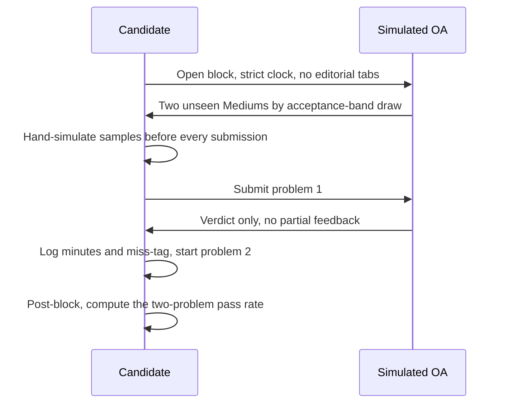
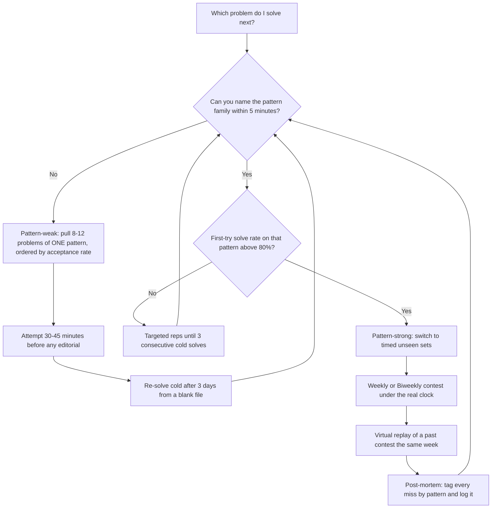

# LeetCode — The Placement Archive and Contest System

## Overview

LeetCode is the de-facto practice standard for Indian campus and off-campus placements: a bank of roughly 3,500 problems with language-agnostic judging, a live acceptance-rate figure for every problem, and a tag system that maps almost one-to-one onto the coding-interview patterns. Indian hiring funnels are dominated by timed online assessments (OAs) containing 2–4 unseen problems, and LeetCode is the cheapest environment that reproduces that exact loop — a hidden test suite, a countdown, and a submit-or-fail verdict on each submission. This page covers platform mechanics rather than algorithms: how curated lists are structured, how to build a personal archive instead of grinding randomly, how the Weekly and Biweekly contest system works, and how difficulty bands distribute across the Indian funnel. The underlying techniques live in the [DSA track](../dsa/README.md) and in the pattern pages linked at the bottom, so nothing here re-teaches theory.

## Why LeetCode Became the Placement Standard

Three structural properties pushed LeetCode past every alternative for placement prep. First, scale plus curation: ~3,500 tagged problems means every interview pattern has a deep bench, and the community-maintained acceptance rate on each problem is a continuously updated difficulty prior that no static book can match. Second, judging parity: the submit-and-fail model with hidden tests is behaviorally identical to HackerRank, CodeSignal, and AMCAT coding sections, so LeetCode fluency transfers to the real OA with almost no platform adjustment. Third, supply-side overlap: interviewers at product companies routinely draw, adapt, or calibrate questions against LeetCode problems, which means sustained practice raises the probability of meeting a near-duplicate inside an actual loop. The result is a self-reinforcing loop — companies hire against it, so candidates train on it, so companies keep calibrating against it.

### The Problem Bank in Numbers

The bank's metadata is more valuable than its raw size. Every problem carries a difficulty badge (Easy/Medium/Hard), one or more topic tags, one or more company tags (Premium), an acceptance percentage computed from millions of real submissions, and a like/dislike ratio that reliably flags ambiguous or badly-specified statements. Roughly speaking, problems above 60% acceptance are warmups, 40–60% are standard interview material, 25–40% is the core interview band, and below 25% is specialist territory — these bands are approximate but far more informative than the editorial badge alone. The badge is set editorially and ages slowly; the acceptance rate moves daily with the crowd, so when the two disagree, trust the rate.

### The Tag System as an Index

Tags are what turn a large bank into a queryable archive. Each problem carries topic tags (arrays, dynamic programming, graphs, and so on), and Premium adds company tags on top, so a filter like "two pointers, acceptance 30–50%" produces a calibrated, pattern-pure set in seconds. The filtering workflow in the archive-building section below is built entirely on this: without tags you would sample the bank at random and get noisy, pattern-mixed practice that trains recognition far more slowly. One caution applies: some problems are tagged by topic even when the intended solution differs (a sliding-window problem also tagged array), so a tag-pure set can still contain a few pattern-misfits — your own mis-tagger log from the post-mortem step corrects this over time.

### How Interviewers Actually Source Questions

Interviewers rarely pull a problem verbatim; they pull a skeleton and add constraints. A LeetCode Medium on intervals becomes "the same problem, but report the schedule, not the count" or "now handle overlapping weights," and the candidate who memorized the original collapses while the candidate who owns the pattern adapts in one or two steps. This is why the platform's value is in pattern coverage and timed rehearsal rather than in question-prediction, and it is why the anti-patterns section treats memorization as a structural failure. It also explains the observed distribution of interview rounds: most product-company first rounds run at or slightly above the Medium band, because that is the band where pattern recognition is cleanly testable within a 30–45 minute slot.

## Curated Lists and How to Work Them

A 3,500-problem bank is unusable without curation, and the community has converged on a handful of lists precisely because interview questions concentrate into 10–12 patterns. Every major list is pattern-first, difficulty-calibrated, and small enough to finish inside a placement season. The table below compares the ones you will hear about most; the Blind 75 list, the Grind 169 set (a widely shared extension of Blind 75), and the NeetCode roadmap are community artifacts circulated by name rather than by any single official page.

| List | Size | Origin | Best for |
|---|---|---|---|
| Top Interview 150 | 150 | Official LeetCode study plan, free at [leetcode.com](https://leetcode.com) | The default 6–8 week interview sprint, grouped by topic |
| Blind 75 | 75 | Community-curated (circulated by name) | The minimal high-signal core when time is very short |
| Grind 169 | 169 | Community extension of Blind 75 (circulated by name) | Slightly wider pattern coverage with the same philosophy |
| NeetCode roadmap | 150 / 250 | Community roadmap (circulated by name) | Pattern-ordered practice with video walkthroughs |

### Choosing a List

Pick exactly one primary list and finish it; interleaving three lists wastes effort because Blind 75, Grind 169, and NeetCode 150 overlap heavily (a large fraction of their problems are shared). Match the list to your time budget: with 4–6 weeks, Blind 75 or Top Interview 150 is enough; with 8–12 weeks, Grind 169 or NeetCode 150 adds breadth; beyond that, your own archive (next section) replaces external lists entirely. Completion discipline beats list choice — a finished 75 with cold re-solves outperforms a half-finished 250 sampled at random.

Order inside the list matters less than people assume, but one rule helps: keep the list's built-in grouping (by topic) for the first pass, then break it. The grouped pass builds each pattern's vocabulary quickly; the broken pass, where consecutive problems come from different patterns, is what the OA actually looks like. Doing only the grouped pass trains a subtle dependency — knowing the pattern from the section header — that disappears the moment an assessment hands you an unnamed problem.

### Using the Discuss Section and Editorials

The discuss section is a calibration tool, not a shortcut. Sorted-by-recency threads on a problem show what interviewers are currently asking about it, which companies report recent appearances, and which edge cases real submissions miss — signal that no algorithm textbook provides. The reliable discipline is: attempt first, discuss only after a verdict, and never read a solution thread while a genuine attempt is still available to you. Editorials deserve the same handling: read the hint structure (most editorials reveal the approach in the first paragraph and the proof later), stop after the approach, and write the proof or the invariant yourself.

One more use is undervalued: writing. Posting a clean write-up of a problem you just re-solved cold forces the explanation skill interviews grade, and comments from stronger solvers expose wrong claims cheaply. Candidates who do this for 10–15 problems report the same effect teaching has — gaps you could ignore while solving become visible the moment you must articulate them.

### Working a List Without Tutorial Hell

Run every problem through the same three-step protocol. Attempt for 30–45 minutes before touching any hint, because the productive struggle phase is where pattern recognition actually forms. If stuck, read the editorial, close it, and re-implement from a blank file without scrolling back. Then re-solve the same problem cold after 3 days; if you cannot, the pattern is not yours yet, and the problem goes back into the queue. Track date, attempt count, time-to-solve, and pattern in a spreadsheet — the log is what later lets you compute your per-pattern first-try solve rate, which drives the decision framework below.

## Building Your Own Archive

### By Pattern

The most useful archive is a folder of pattern-pure sets. Pull 8–12 problems per pattern using the tag filters, ordered roughly by ascending acceptance rate, and keep one set per folder or one sheet per pattern. Eight to twelve is the empirically reasonable dose: fewer than that and you memorize individual problems rather than the pattern's decision points, more than that and the marginal problem adds little once you solve the pattern's variants on sight. The pattern definitions and templates are already written up in this repo — start from [Pattern Deep Dive: Binary Search](../interview/coding/pattern-binary-search.md), [Pattern Deep Dive: Sliding Window](../interview/coding/pattern-sliding-window.md), and [Pattern Deep Dive: Two Pointers](../interview/coding/pattern-two-pointers.md), then extend to dynamic programming, trees, and graphs using the same method.

The tag filters make each set a two-minute job if you fix a recipe and stop second-guessing it:

```text
LeetCode filter recipe for a pattern-pure set (two pointers example):
  Topics:    two pointers
  Acceptance: 30%-50%           # core interview band
  Status:    unsolved, not locked
  Sort:      acceptance descending
  Take:      first 12 results   # the standard dose per pattern
  Log:       append all 12 to sheet.md before solving any
```

Committing the whole set to the sheet before solving matters more than the exact filter values, because pre-committed sets prevent the drift toward problems that look friendly. A minimal on-disk layout keeps the archive greppable and lets the post-mortem tags live next to the problems:

```text
archive/
  binary-search/
    sheet.md            # problem IDs, acceptance %, status, 3-day re-solve dates
    notes.md            # invariants, failure cases, variant questions
  sliding-window/
    sheet.md
    notes.md
  two-pointers/
    sheet.md
    notes.md
  dp-1d/ ...
log/
  attempts.csv          # date, problem, pattern, minutes, outcome, miss-tag
  contests.csv          # date, contest, rank, rating delta, miss-tags
```

### By Company for Off-Campus Targeting

For off-campus applications you can invert the organization: build one set per target company. The Premium company tags give a crowd-sourced distribution of what that company's loop actually contains, and community-maintained company-wise sheets fill gaps for free. Treat these as distribution hints, not question banks — company tags are crowd-sourced, interviews change every season, and interviewers explicitly avoid exact repeats, so the archive's job is to show you which patterns and difficulty bands a company favors. Concretely: if a target's tagged list is 70% Medium arrays/strings/graphs with a Hard tail, your sprint allocates practice time in those proportions and rehearses the Hard tail specifically if the loop is a late round.

### By Acceptance-Rate Bands

The third axis is difficulty as measured by the crowd rather than the badge. Build four bands — above 60%, 40–60%, 25–40%, below 25% — and use them differently. The warmup band trains speed and zero-bug submission discipline; the standard band is your daily bread and should dominate volume; the core interview band is where timed practice happens; the sub-25% band is touched selectively, mostly to learn the two or three recurring Hard archetypes (interval scheduling with heaps, bitmask DP, hard combinatorial construction) rather than to chase individual monsters. Re-solving across bands on a rotating schedule keeps earlier bands warm without new volume.

### Language Choice and Templates

Use one language for the whole season and build a submission template for it, because OA time is lost to boilerplate, not to algorithms. The template needs fast input parsing, a few collection helpers, and nothing exotic — every minute saved per submission compounds across a 3-problem assessment. Whether C++ or Python, keep the template under a screen and type it from memory so it survives a proctored, non-copy-paste environment. Switching languages mid-season silently invalidates your measured solve rates, since a large part of \\( p \\) (the first-try solve probability modeled below) is implementation fluency rather than algorithmic insight.

## Difficulty Bands in the Indian Hiring Funnel

| LeetCode difficulty | Where it appears in the Indian funnel | Role it plays |
|---|---|---|
| Easy | OA warmup slot, first question of a technical round | Screening and warm-up; expected accuracy near 100%, almost no selection signal |
| Medium | OA core (typically 2–3 of the questions), technical rounds 1–2 | The actual differentiator at mass recruiters and most product companies |
| Hard | Product-company round 3, off-campus specialist loops, high-bar teams | Differentiator only at top-of-market companies; rarely the OA cutoff |

Read the table as a budget, not a ranking. Mass recruiters and most service companies rarely exceed the Medium ceiling, so grinding Hards before their season buys nothing; product companies weight Mediums in OAs but reserve Hards for late interview rounds, so Hard practice is a targeted investment timed to the loop you actually face. The common miscalibration is inverted volume — candidates spend 40% of their time on Hards that decide 5% of outcomes while their Medium first-try solve rate, the number that decides most OAs, stays unmeasured.

### Mapping OA Vendors to the Bands

The vendor hosting the OA shifts the band usage slightly. HackerRank-style coding sections map almost one-to-one onto LeetCode difficulty — an Easy, two Mediums, and an optional Hard is the modal composition for product companies. AMCAT/CoCubes-style sections usually contain only one or two coding items at the Easy-to-Medium boundary, wrapped in aptitude and CS-fundamentals modules, so for those funnels the coding band matters less than accuracy and speed. CodeSignal-style assessments add proctored environments and score-report transparency but keep the same underlying band logic. The practical takeaway is to ask seniors or the recruiter what platform and item count to expect, then set the practice band accordingly instead of defaulting to the hardest material you can stomach.

### Warmup-Band Drills

The above-60% band earns its place with a specific drill: solve three Easy problems back-to-back in 25 minutes total with zero wrong submissions. The exercise trains fast parsing, one-shot correctness, and the discipline of hand-simulating samples before submitting — all OA-funnel skills that Medium practice never isolates. Track your streak: most candidates fail this drill ten or more times before the first clean pass, which is exactly the point, because a rejected Easy submission in a real OA costs morale disproportionate to its difficulty. Two clean passes on separate days are enough; the drill is calibration, not a diet.

### Acceptance-Rate Arithmetic

Model a k-problem OA as k independent solves with per-problem first-try success probabilities \\( p_1, p_2, \ldots, p_k \\). The probability of clearing the assessment is the product:

\\[
P(\text{clear}) = \prod_{i=1}^{k} p_i
\\]

The numbers are unforgiving. At \\( p = 0.7 \\) per Medium, a two-Medium OA clears with probability \\( 0.7 \times 0.7 = 0.49 \\) — coin-flip odds — and a three-Medium OA drops to \\( 0.7^3 \approx 0.34 \\). Two consequences follow. Raising the per-pattern solve rate from 0.7 to 0.9 moves a two-Medium OA from 0.49 to 0.81, a bigger gain than any realistic increase in raw volume, and per-pattern targeted practice is exactly what produces that jump. A related quantity is expected attempts per new-pattern acquisition: if a pattern sticks with probability \\( p_s \\) per cold re-solve cycle, the expected number of cycles is \\( 1/p_s \\), which is why the 3-day re-solve rule outperforms mass one-time solving.

This is also why timed sets matter: \\( p \\) measured under a clock is the only version of the number that predicts OA performance, and untimed practice systematically overestimates it. Schedule the measurement, not just the practice.

## The Contest System

### Weekly and Biweekly Contests

LeetCode runs two rated contests, both free: the Weekly Contest every Sunday (typically 08:00 IST in India) and the Biweekly Contest every alternate Saturday (typically 20:00 IST). Each is 4 problems in 90 minutes, ordered roughly by increasing difficulty, with full leaderboard visibility during and after the round. The problems are unseen, the clock is real, and the difficulty distribution is engineered to be a compressed OA: usually one Easy warmup, two Mediums, and a Hard tail. Contests are the single highest-fidelity rehearsal available for the placement funnel on this platform, which is why the training loop below is built around them.

### Contest Rating, Knight, and Guardian

Contest performance feeds an Elo-style rating that starts at 1500 and moves with expected-versus-actual rank, so beating stronger fields gains more than beating weak ones. The public badges act as thresholds on that rating: Knight at roughly 1850 and Guardian at roughly 2150 — the exact cutoffs drift slightly with rating recalibrations, so treat the numbers as approximate. In a field as large as LeetCode's rated circuit, Knight sits around the top few percent of rated participants and Guardian around the top one percent, which makes a Knight badge a compact, verifiable, recruiter-legible signal: "this person solves unseen timed problems under pressure." That said, contest rating measures one narrow skill and says nothing about communication, code clarity, or system design, so treat it as a resume line, not an interview guarantee.

Read rating deltas correctly or they will distort your training. A −40 drop after one contest is noise at a 1500–1900 rating, not evidence; the moving average over five contests is the real trend. Participation itself moves the number — rating only changes when you compete, so a stale rating says nothing about current skill in either direction. And never chase rating by picking weak fields or contest timing tricks; the number is only worth what the skill behind it is worth, and interviewers who care can tell the difference in one follow-up question.

### Reading a Contest Post-Mortem

A post-mortem is a 20-minute structured review, not a leaderboard scroll. The protocol: for each of the 4 problems, record solved-or-not, minutes spent, and a miss-tag from the fixed vocabulary (misread statement, wrong pattern, right pattern wrong implementation, timeout, gave up too early). Then compute one number — how many of the missed problems you could solve cold within 30 minutes right now — and queue exactly those for the re-solve cycle. Problems you could not even approach after reading the editorial go into the pattern-weak branch of the decision framework rather than the re-solve queue. Four contests of this discipline produce a per-pattern miss distribution that no amount of unstructured grinding reveals.

### Virtual Contests for Rehearsal

Every past contest can be replayed as a virtual contest under the original clock from the [contest portal](https://leetcode.com/contest). Virtuals are the correct tool for three jobs. First, schedule control: live contests land at fixed times, but a virtual can be run at your actual OA slot (many campus OAs are afternoon), including the 08:00 IST distraction-free morning conditions if that matches your funnel. Second, volume: you can run two or three full-length virtuals per week during the final month, which is impossible with live rounds. Third, post-mortem quality: virtuals expose the full editorial and acceptance data immediately afterward, so the same evening can end with a tagged miss-analysis in your archive.

Run virtuals under OA rules, not practice rules. That means no editorial tabs, a strict 90-minute clock, one language template, and a hand-logged time per problem, because the measurement you want is the same \\( p \\) that predicts assessments. A virtual treated casually measures nothing and still costs 90 minutes.

### A Weekly Operating Rhythm

Consistency beats intensity across a 10–16 week season, and a fixed weekly rhythm removes the daily "what do I do today" decision. The rhythm alternates pattern work (the archive), timed rehearsal (contests and virtuals), and measurement (post-mortems), so each session has a defined output. A workable template for a final-season week looks like this:

```text
Mon  90 min   pattern set: 2 problems from the current pattern folder + 1 cold re-solve
Wed  90 min   virtual replay of a past contest, strict clock
Sat  105 min  Biweekly contest live (every other week)
Sun  105 min  Weekly contest live, followed by the post-mortem
Any  30 min   spreadsheet update: attempts, miss-tags, per-pattern solve rates
```

Two adjustments are common. During heavy OA weeks (drive season), drop one pattern session and keep both contest slots, because rehearsal degrades faster than pattern knowledge. In the final fortnight before a high-stakes loop, replace pattern volume entirely with contest-plus-post-mortem cycles at the exact time of day the real OA runs.

### Time-of-Day and Energy

The rhythm should respect when your assessments actually happen. If your funnel's OAs run in the morning, shift one weekly timed block to morning, because timed performance has a measurable circadian component and morning practice buys back the penalty. If you are juggling academics, put the 30-minute measurement slot on your lowest-energy day — it is clerical work, and doing it when tired costs nothing. Protect one full rest day regardless; contest judgment degrades measurably after six or seven consecutive high-intensity days, and the ranking you would get on day seven teaches the wrong lessons.

### The OA Simulation Protocol

Contests are rehearsal, but a dedicated simulation rehearses the OA-specific wrapper: proctoring, no partial feedback, and the two-problem psychological rhythm. The protocol below is a 90–120 minute block you can run weekly without a live contest.



The pass rate from ten such blocks is your best single predictor of OA outcomes, because it compounds the per-problem probabilities the arithmetic section models. Keep the block at fixed difficulty (two Mediums from the 25–50% band) so the series is comparable week over week. If your simulated pass rate is under 60% two weeks before a real funnel, the fix is band regression — drop to the 40–60% band for a week and rebuild — not heroic Hard grinding.

## A Decision Framework: Which Problem Next?

The most common operational failure in LeetCode prep is choosing problems by mood. The framework below replaces mood with one measured quantity — your first-try solve rate on each pattern family — and routes accordingly. Pattern-weak areas get sheet-style repetition; pattern-strong areas get timed unseen sets through contests and virtuals; both branches feed the measurement loop again, so the framework self-corrects as your profile changes across a season.



Two details make the loop work in practice. The 80% threshold is deliberately high because OAs multiply probabilities — a pattern you solve 4 times in 5 still caps a two-problem OA at 64% if both problems are from it. And the post-mortem must tag misses by pattern and reason (misread statement, wrong pattern, correct pattern with buggy implementation, timeout), because each tag routes to a different fix: misreads route to statement-discipline drills, wrong-pattern picks route back to the pattern-weak branch, and timeouts route to complexity review in [Complexity Analysis](../dsa/chapters/ch03-complexity-analysis.md).

## Anti-Patterns

### Tutorial Hell

Tutorial hell is reading editorials (or watching walkthroughs) as the primary activity, with real attempts reserved for problems that feel safe. It produces fluent note-taking and zero transfer: in an OA there is no editorial, and the skill that was never trained — deriving the pattern identity from an unseen statement under time pressure — is precisely the skill being tested. The 30–45-minute attempt rule exists to prevent this; if your log shows editorial reads exceeding first attempts, the fix is mechanical, not motivational. Watch one worked explanation only after a genuine attempt, and immediately convert it into a cold re-solve three days later.

### Memorizing Solutions

Memorization feels efficient because solved-problem counts grow fast, but it fails on the first variant — an interviewer who flips a constraint or an OA that swaps "maximum" for "minimum with negative numbers" collapses recall-based answers. The test is simple: if you cannot re-derive why the algorithm is correct and what breaks without it, you have memorized rather than learned. Guard against it by always asking the variant question yourself after solving ("what changes if the array is circular?"), and by treating a failed 3-day cold re-solve as the real signal that the problem needs to re-enter the queue. Understanding is the only durable asset because variants are the interviewer's main tool.

### Premium Dependence

Premium dependence is buying company-tagged lists and mock assessments as the primary strategy, in place of fundamentals and contest reps. Company tags are crowd-sourced and seasonally stale, so they are distribution hints at best, and loops change precisely because tagged lists circulate. The failure mode is a candidate who has seen "most of a company's tagged list" yet cannot solve an untagged Medium variant in 25 minutes — which is what the interview actually presents. The rational order is: free fundamentals and contests first, Premium only for a short, specific off-campus sprint, and even then as a supplement to the timed loop, never a replacement for it.

### Volume Without Measurement

The quietest failure is grinding hundreds of problems while never computing a per-pattern solve rate, which leaves the decision framework above unrunnable and makes progress unfalsifiable. Unmeasured practice drifts toward comfortable patterns, so weak areas stay weak precisely because they feel bad to practice. The fix costs five minutes a week: export your attempts log, compute first-try success by pattern, and let the numbers pick next week's problem sources. A spreadsheet with four columns (date, problem, pattern, outcome) is sufficient instrumentation for the entire season.

## Interview Questions

1. **How many LeetCode problems are enough before campus season?** The honest answer is measured by solve rate, not count, but a workable floor is 150–200 problems done properly: one curated list finished with cold re-solves, plus contest experience. Below roughly 50 problems per major pattern family, recognition under a clock is unreliable, and OAs expose that immediately. Track your first-try Medium solve rate under a timer; when it stabilizes above 80–85%, volume has done its job and further grinding adds little. Candidates who fixate on a raw number like 500 usually accumulate tutorial-hell mileage that does not survive contact with an unseen problem.

2. **Is LeetCode Premium worth it for Indian placements?** For the campus season through your college, usually not, because the free tier plus contests covers everything the funnel demands. Premium pays off in a specific off-campus scenario: you have interviews with identified companies in the next 4–8 weeks, and the company-tagged lists let you calibrate pattern and difficulty distributions for exactly those loops. The mock assessments are also useful for one or two full rehearsals of the proctored OA experience. The failure mode is buying Premium in month one and using tagged lists instead of fundamentals — that inverts the correct order and produces fragile preparation.

3. **How do you convert LeetCode practice into HackerRank-style OA performance?** Practice must be timed, unseen, and full-length, because the OA adds a proctor, a hard clock, and no partial feedback — three things untimed LeetCode sessions never train. Run at least one Weekly or virtual contest per week in the final two months, and one or two simulated 90–120 minute OA blocks consisting of unseen Mediums pulled by acceptance-rate band. Rehearse the operational layer too: the language template with fast I/O, the compile-and-submit hygiene, and the decision of when to switch problems. The conversion is mostly about reproducing stress conditions, not about learning new algorithms.

4. **You are comfortable with Mediums but fail Hards — is that a problem?** It depends on your targets. If your funnel is mass recruiters and mid-tier product companies, Medium fluency with high accuracy is sufficient, and the marginal hour is better spent on speed, variance reduction, and CS-fundamentals rounds. If you are targeting top product companies or specialist teams, Hards matter, but prepare them as archetypes rather than one-off problems: learn the handful of recurring Hard shapes and the two or three techniques (heaps over intervals, bitmask DP, advanced graph constructions) that unlock most of them. Then rehearse Hards inside contests, where the real skill — extracting partial progress and staying composed with minutes draining — is actually trained.

5. **Do recruiters actually look at contest rating?** Sometimes, and mostly as a resume screen at product companies: a Knight-level badge (roughly 1850+ rating) is an externally verifiable signal of timed problem-solving, and some recruiters treat it as a soft equivalent of an OA pass. It never substitutes for the interview itself, because interviews add communication, code clarity, and follow-up variants that rating does not measure. The practical use is asymmetric: the badge can get your resume a second look, but a low or absent rating costs you nothing if the rest of the resume shows projects and problem-solving. Treat rating as optional leverage, not a goal in itself.

6. **What is the single best use of the 30 minutes before an OA or interview?** Not new problems. Run one solved Medium cold from your re-solve queue as a warm-up, verify your template compiles and parses input fast on the actual machine or browser profile you will use, and re-read your miss-tag summary so the two failure modes you are actively fixing are fresh. Starting new problems before an assessment measurably hurts: a failed warm-up problem raises anxiety without adding skill, while a completed known problem calibrates typing and confidence. The rule generalizes the athlete's principle — warm up with movements you already own, never learn new ones on game day.

## Key Takeaways

- LeetCode is the placement de-facto standard because its judging model, difficulty metadata, and question supply overlap directly with Indian OA and interview funnels.
- The acceptance rate is a better difficulty prior than the Easy/Medium/Hard badge; build bands at roughly 60%, 40–60%, 25–40%, and below 25%.
- Pick one curated list (Top Interview 150 free on the platform; Blind 75, Grind 169, and NeetCode roadmap are community artifacts) and finish it with the 30–45-minute attempt rule plus 3-day cold re-solves.
- Build a personal archive on three axes — by pattern (8–12 problems each), by company for off-campus sprints, and by acceptance-rate band — instrumented by a four-column attempts log that makes the next-problem decision mechanical.
- OA pass probability is the product of per-problem solve rates \\( \prod p_i \\), so raising per-pattern first-try success beats raw volume increases.
- Contests (Weekly Sunday, Biweekly alternate Saturday, 4 problems in 90 minutes) plus virtual replays are the highest-fidelity OA rehearsal on the platform.
- Knight (≈1850) and Guardian (≈2150) ratings are hedged, verifiable resume signals of timed skill — useful, but never a substitute for interview performance.
- Avoid the four structural anti-patterns: tutorial hell, memorizing solutions, Premium dependence, and volume without measurement.

## References

- LeetCode problem set and tag filters: <https://leetcode.com/problemset/all>
- LeetCode contest portal (Weekly, Biweekly, virtual contests): <https://leetcode.com/contest>
- LeetCode home and official study plans including Top Interview 150: <https://leetcode.com>
- Codeforces contest system, for contrast with a competitive-programming-first platform: <https://codeforces.com/contests>
- Blind 75 list — community-curated, circulated by name (no official page cited)
- Grind 169 — community extension of Blind 75, circulated by name (no official page cited)
- NeetCode roadmap — community roadmap, circulated by name (no official page cited)

## Cross-References

- [Pattern Deep Dive: Binary Search](../interview/coding/pattern-binary-search.md) — the first pattern family to archive; its templates map onto LeetCode tags directly
- [Pattern Deep Dive: Sliding Window](../interview/coding/pattern-sliding-window.md) — the most heavily tagged interview pattern in the Medium band
- [Pattern Deep Dive: Two Pointers](../interview/coding/pattern-two-pointers.md) — pattern-pure set building example for the archive method
- [DSA Track Index](../dsa/README.md) — the theory layer this platform page deliberately does not repeat
- [Complexity Analysis](../dsa/chapters/ch03-complexity-analysis.md) — how to reason about the timeouts that show up in contests and OAs
- [60-Day Plan](../dsa/appendices/appendix-k-60-day-plan.md) — a day-by-day schedule that fits the list-plus-contest loop described here
- [Codeforces Guide](./codeforces-guide.md) — the contest-first platform and when its problems beat LeetCode's for training
- [Contest Calendar and Code List](./contest-calendar-codelist.md) — scheduling contests and platform codes across a season
- [Placement Preparation Index](../placement-preparation/README.md) — where OAs sit in the overall hiring funnel
