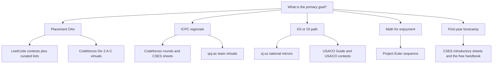

# The Competitive Programming Resource Directory

## Overview

The competitive programming ecosystem contains more than twenty active judges, a dozen free handbooks, several structured courses, and hundreds of thousands of problems — more material than any human can finish in a decade of evenings. This page is the directory layer: it compresses that ecosystem into four tables (judges, books, courses and handbooks, and goal-to-stack mappings), explains what each resource is actually good for, and gives a decision flow for assembling a personal stack that matches your goal instead of your feed. The philosophy throughout is that a short, finished resource list beats a comprehensive, abandoned one.

This page complements the track's how-to pages rather than replacing them. The [Codeforces guide](./codeforces-guide.md) tells you how to climb one judge's ladder, the [AtCoder guide](./atcoder-guide.md) covers that ecosystem's formats, and the [LeetCode archive](./leetcode-archive.md) handles interview-facing practice; here you decide which of those engines deserves your hours in the first place. Every URL below was verified against the repository's reference index, and the maintenance section explains what to do when one of them eventually moves — because archives always move.

The directory is deliberately opinionated about compression. Fifteen judges appear in the table because each one is genuinely the right answer to some goal, but the goal-to-stack section shows that any individual needs at most three or four of them at a time. Read the tables as a map of the territory and the stack section as the itinerary, and you will avoid the collector's fallacy that consumes so many first semesters.

## Online Judges at a Glance

A judge is defined by four properties: what problems it hosts, how deep its historical archive runs, whether it computes a rating you can track, and what it optimizes your brain for. The table below is the complete working map. Archive strength is graded relative to the judge's own focus — a small but deliberately complete curated set like CSES counts as strong because its three hundred problems form a coherent syllabus, while a large but unorganized pile counts as medium no matter its size.

| Judge | URL | Focus | Archive strength | Rating system | Best for |
|---|---|---|---|---|---|
| Codeforces | [https://codeforces.com](https://codeforces.com) | Rated short contests, full difficulty range | Very strong — 9,000+ problems plus complete round archive | Elo-style with color bands | Contest skill, speed, upsolving culture |
| AtCoder | [https://atcoder.jp](https://atcoder.jp) | Clean math-flavored contests | Strong — complete ABC/ARC/AGC archive | Own scale with cold-start cap | Elegant thinking, clean statements |
| LeetCode | [https://leetcode.com/contest](https://leetcode.com/contest) | Interview-style problems and contests | Strong for interview patterns; deep archive behind paywall | Contest rating with Knight/Guardian badges | Placement OAs and interview loops |
| CodeChef | [https://www.codechef.com](https://www.codechef.com) | Weekly rated contests by division | Strong — Starters archive plus years of long-form contests | Star bands (1-7 stars) mapped to divisions | High-volume rated practice for Indian students |
| CSES | [https://cses.fi/problemset](https://cses.fi/problemset) | ~300 curated problems in topic sets | Strong and deliberately complete | None — progress is per-set completion | Structured topic coverage, the canonical sheet |
| USACO | [https://usaco.org](https://usaco.org) | OI-style seasonal contests Bronze→Platinum | Strong — full past-contest archive with data | Division promotion, not Elo | IOI-style constructive and algorithmic thinking |
| SPOJ | [https://www.spoj.com](https://www.spoj.com) | Classic problem pile with challenge tasks | Large but aging and unevenly curated | Weak; community contests only | Niche topic drilling, approximation problems |
| DMOJ | [https://dmoj.ca](https://dmoj.ca) | Modern open-source judge with regular contests | Good — own contests plus hosted series | Own Elo-like scale | A modern alternative contest schedule |
| Timus | [https://timus.online](https://timus.online) | Ural regional problems | Strong for its niche — decades of hard classics | Rank-list based | Stubborn-problem endurance |
| e-olymp | [https://www.e-olymp.com](https://www.e-olymp.com) | Very large olympiad problem collection | Large but minimally curated | Weak | Mining national OI problems |
| Topcoder | [https://www.topcoder.com](https://www.topcoder.com) | SRM speed rounds, marathon matches | Historic SRM archive still valuable | Historic rating; activity declined | Old SRM sets, optimization marathons |
| Luogu | [https://www.luogu.com.cn](https://www.luogu.com.cn) | Chinese community judge, huge problem bank | Very large, mirrors much of the world's contests | Own rating with difficulty colors | Volume practice if you read Chinese |
| oj.uz | [https://oj.uz](https://oj.uz) | Mirrors of national OI contests and more | Strong for OI — COCI, JOI, and many nationals | Contest standings, not Elo | IOI-track preparation |
| qoj.ac | [https://qoj.ac](https://qoj.ac) | ICPC regionals, world finals, quality sets | Strong for recent ICPC-era problems | Contest standings | Team-based ICPC rehearsal |
| Project Euler | [https://projecteuler.net](https://projecteuler.net) | 900+ computational math puzzles | Complete and stable | None — you verify answers yourself | Number theory and math-flavored fun |

### How to Read the Archive-Strength Column

Archive strength matters because problem-solving improvement is mostly retrieval and repetition, and repetition needs a deep, stable stock of problems at the right difficulty. A judge like Codeforces earns "very strong" not just for its 9,000+ problem count but for the metadata around it — per-problem difficulty tags, thousands of blog editorials, and a searchable submission history that tells you exactly how your past self failed. SPOJ shows the opposite failure mode: thousands of problems with sparse editorial culture means every hard problem costs you an hour of unguided grinding, which is occasionally excellent and usually inefficient.

Curated completeness beats raw size, which is why CSES and the USACO archive rank above far larger unorganized piles. When you evaluate any judge not in this table, run the same four checks: is the statement quality consistent, do editorials or at least accepted solutions exist, is the archive stable year over year, and does the difficulty distribution cover your current band. Two yeses make it a supplementary judge; four make it a primary one.

### A Closer Look at the Big Four

**Codeforces** is the field's center of gravity, and its four properties explain why. The rated round cadence is the densest anywhere — most weeks offer one or two rounds across Divisions 1-4 — and every round becomes permanent practice material with difficulty tags, editorial blogs, and a searchable submission archive. The rating ladder is finely grained, which makes it the best long-term scoreboard for contest skill. Its weaknesses are cultural: statements lean terse, the strongest problems assume speed, and the community's contest-first bias can mislead a placement-bound student into over-indexing on olympiad technique.

**AtCoder** is the connoisseur's judge: statements are short and unambiguous, problems are constructed rather than adapted, and the weekly ABC is the cleanest speed drill in the field at a fixed Saturday slot. The archive is complete and the community difficulty ratings at kenkoooo turn it into a self-serve curriculum at any band. The trade-off is that AtCoder's hardest problems skew toward a particular style of elegant case analysis, so an exclusive diet produces contestants who are fast and sharp but underexposed to the heavy implementation that ICPC regionals demand.

**LeetCode** is not an olympiad judge and should not be judged as one; it is the interview layer, with contests whose four problems deliberately echo what product-company OAs ask, plus a problem set organized by company tags and patterns. Its rating is soft, its hardest content is paywalled, and its editorial culture is commercial — all irrelevant to its actual job, which is converting practice time into OA passes. For the placement row of the stack table it is simply the right primary tool.

**CodeChef** matters specifically for the Indian audience: Starters run weekly at 20:00 IST in four divisions mapped to star bands, so a beginner can always find a rated contest at their level in a friendly timezone. The long archive — years of cook-offs, lunchtimes, and long challenges — provides volume, and the division structure prevents the discouragement of always facing a global top-heavy field. Its contest difficulty calibration has historically been looser than AtCoder's, which is the main reason it pairs well as the volume judge rather than the calibration judge.

### The Specialist Judges and When They Pay Off

The remaining eleven rows of the table earn their place through specialization. Timus and SPOJ are endurance libraries — decades of hard, classic problems that break you of the expectation that every problem yields in forty minutes, best used one or two per week as deliberately painful exercises. DMOJ offers a modern, actively maintained contest schedule and a clean interface, making it a credible substitute engine if you want contests outside the big four's slots. e-olymp and Luogu are mining operations: enormous collections of national olympiad problems where the curation burden shifts to you, and the payoff is access to problem styles your primary judges never see. Topcoder's SRM archive is history's finest speed-round collection and its marathon matches remain the only mainstream exposure to heuristic optimization, even though live activity has receded; treat it as a museum with working exhibits rather than a living league.

### The Rating Systems Differ More Than You Think

The four rating cultures reward different behaviors, and misunderstanding them wastes months. Codeforces Elo moves on contest performance against a field, so rating measures contest-day execution under a two-hour clock. CodeChef's star system maps rating bands to divisions — a five-star competitor enters Div 1 — so stars measure the same thing as Elo but present it as an entry ticket. AtCoder's scale is performance-based with a cold-start cap for new accounts, which front-loads fast early growth and then enforces the same plateau economics as Elo. LeetCode's contest rating is the most forgiving of the four and the least informative about olympiad skill, which is fine because its purpose is interview calibration.

USACO and the OI mirrors drop numeric rating entirely in favor of division promotion, which matches how IOI itself works: you qualify by solving, not by outscoring a distribution. If your goal is ICPC or IOI, treat numeric Elo as a lagging indicator and division placement or contest rank as the real signal. If your goal is placement, the LeetCode number plus Codeforces color is the combination recruiters actually parse.

## The Bookshelf

Books do the one thing online judges cannot: they impose an ordering and a narrative on the entire field, and they explain why a technique exists before showing you the twenty problems that use it. The modern canon is small, and the good news for students is that the single most important item is free.

| Book | Author | Access | Role in a prep plan |
|---|---|---|---|
| Competitive Programmer's Handbook | Antti Laaksonen | Free PDF at [https://cses.fi/book/book.pdf](https://cses.fi/book/book.pdf) | First full pass over the entire field in ~300 pages; pairs directly with the CSES problem set |
| Guide to Competitive Programming | Antti Laaksonen | Springer print/ebook (search by title — no link here) | Extended, teaching-oriented rewrite with more worked examples; a second pass, not a first |
| Competitive Programming 4 | Steven Halim and Felix Halim | Self-published (search by title — no link here) | Encyclopedic technique catalog; use as a reference index, not a linear read |
| The Algorithm Design Manual | Steven Skiena | Print/ebook (no link here) | Classical algorithms with war stories; see the [DSA track](../dsa/README.md) which integrates its material |

A note on the "no link here" rows: this book's URL policy limits hotlinks to a verified allowlist, and the publisher pages move often enough that title searches are the more durable route anyway. The four books above cover the field so completely that adding a fifth is usually procrastination. Students who want a DSA-first presentation with proofs and implementation chapters should read the [DSA track's own recommendations](../dsa/README.md) before buying anything.

### Pairing Books with Judges

Each book earns its keep only when paired with a problem source at the matching band, and the pairings are stable enough to state as rules. CPH pairs with CSES, chapter for sheet, because the two were built together. Competitive Programming 4 pairs with SPOJ and e-olymp, whose sprawling classic archives contain exactly the wide technique coverage the book catalogs. Skiena's manual pairs with interview preparation — its emphasis on reasoning about algorithms rather than executing them mirrors technical-round discussion, and the DSA track's integrated chapters supply the exercise layer. Guide to Competitive Programming pairs with AtCoder, since its worked examples sit comfortably at the ABC-to-ARC band where most students actually live.

The anti-pattern is reading any book cover to cover with no problem source attached. Books create vocabulary and mental models, but problem-solving is a motor skill, and the transfer from page to contest only happens through problems attempted before the technique was fully understood. Every pairing above exists to force that interleaving.

### How to Actually Read the Free Handbook

Competitive Programmer's Handbook rewards a specific reading pattern that most students discover too late. Read each chapter's prose once for the ideas, then immediately solve five to eight CSES problems from the matching section, because the book was written to be read against that problem set and the two share an index of difficulty. Skipping the problem-solving step produces the classic illusion of competence: you can follow every paragraph and still cannot implement a working binary search on answer under contest conditions. A realistic pace is one chapter plus its problems per week, which turns the book into a thirty-week curriculum that fits an academic year with slack for exams.

The book also rewards a second, faster pass later. After a year of contests, rereading the flow matching, suffix array, and dynamic programming chapters takes an evening each and consolidates techniques you have used mechanically but never fully understood. Use the free PDF unapologetically — the author hosts it deliberately, and a printed copy or a tablet with margin notes beats thirty browser tabs.

## Courses, Handbooks, and Curated Problem Sets

Between judges (problem supply) and books (theory supply) sits a third layer: structured curricula that sequence problems and teach technique in context. This layer has consolidated dramatically in the last decade, and four resources now cover most of what a student needs.

| Resource | URL | What it is | How to use it |
|---|---|---|---|
| Codeforces EDU | [https://codeforces.com](https://codeforces.com) (EDU tab) | Free in-site courses — two pointers, segment trees, suffix structures, and more — with embedded graders | One EDU course per weak topic; the embedded tasks enforce implementation, not just reading |
| USACO Guide | [https://usaco.guide](https://usaco.guide) | Free module-based curriculum from Bronze through Platinum with curated cross-judge problems | The default syllabus for the OI path; do the module problems, not just the prose |
| cp-algorithms.com | [https://cp-algorithms.com](https://cp-algorithms.com) | The English successor of the e-maxx repository — implementation-first articles with tested code | The reference you open when a technique's details matter; read the article, then reimplement |
| CSES Problem Set | [https://cses.fi/problemset](https://cses.fi/problemset) | ~300 problems organized into topic sheets from introductory to advanced | The canonical topic sheet: one coherent pass replaces a hundred fragmented playlists |
| AtCoder Problems | [https://kenkoooo.com/atcoder](https://kenkoooo.com/atcoder) | Community difficulty ratings and problem tables for the entire AtCoder archive | Use as the AtCoder curriculum engine — solve by difficulty band, one band at a time |

### CSES as the Canonical Topic Sheet

The CSES problem set deserves its canonical status for a structural reason: it is finite, ordered, and complete. Each topic sheet — sorting and searching, dynamic programming, graph algorithms, range queries, tree algorithms, mathematics, string algorithms, geometry, and the advanced sets — contains just enough problems to force genuine fluency, and the sheets interleave difficulties so that easy wins and hard walls alternate. Roughly 300 problems at a sustainable six per week is about fifty weeks of work, which is \\( 300 / 6 = 50 \\) weeks — one focused year, and the single highest-density year a beginner can buy. Because the set is intentionally stable, every solution you write stays valid, and completion percentages are a progress bar you can trust.

The set's weakness is the mirror of its design: no contests, no rating, and a lonely grader. CSES teaches you to solve known-topic problems, while contests teach you to identify unknown-topic problems under a clock, and the second skill only comes from the second activity. The correct pairing is therefore CSES as the weekday curriculum and one rated contest a week as the identification drill, which is exactly the shape of the 60-day plan linked in the cross-references.

### cp-algorithms as the Reference Implementation

cp-algorithms is what you open when the details matter: when you need the exact convex hull trick variant, the meeting-in-the-middle bound, or the suffix automaton construction, the article is there with tested code and the small print about edge cases. It inherited and translated the e-maxx tradition — an enormous, opinionated, implementation-first body of articles — and remains under continuous maintenance. Its articles assume comfort with proofs, so first-year students should treat it as a reference to read after a book chapter, not instead of one. The site's code is a starting point, not a submission: typing it yourself and re-deriving the complexity is the difference between owning the technique and borrowing it.

### How the EDU Courses Layer on Top

Codeforces EDU occupies a deliberate niche between book chapter and contest: each course is a short sequence of articles followed by graded tasks embedded in the judge, so you cannot proceed past a technique you cannot implement. The two-pointer and segment-tree courses are the canonical starting points, and the suffix-structure courses are the standard bridge into advanced material. A workable rule is one EDU course per identified weakness, taken over two or three weeks alongside normal practice, because the courses are dense enough that two at once produces reading without retention. The graders are unforgiving in a useful way — a solution that passes the course tasks is genuinely correct, not plausibly correct.

### Speedrunning an Archive by Difficulty Band

Every major archive now exposes machine-readable difficulty, which converts "solve old problems" into a banded program. AtCoder Problems assigns each problem a community difficulty integer; the Codeforces problemset tags problems with a rating; kenkoooo's tables let you filter the whole ABC archive by band in one click. The program is then mechanical: pick the band just above your comfort level, solve in ascending order until the band's pass rate exceeds roughly eighty percent, and move up. A band typically contains one to two hundred problems, so a banded pass through ABC costs a few months at six problems a week — and produces measurably faster pattern identification than unstructured archive browsing, because the band forces the same interval of difficulty repeatedly.

## The OI Track in Detail

### Why oj.uz and the USACO Guide Pair So Well

The olympiad-informatics path differs from the contest path in problem genre, not just difficulty: OI problems reward constructive arguments, multi-layered partial scoring, and stamina over a multi-hour window, and the resources that train it are correspondingly specific. oj.uz aggregates mirrors of national OI contests — COCI from Croatia, JOI from Japan, and dozens of national team-selection rounds — which means one account reaches a decade of real olympiad problems with official test data. The USACO Guide then supplies the sequencing: its Bronze-through-Platinum modules name the technique, teach it briefly, and link a curated problem set across judges, including the oj.uz mirrors. The pairing works because each covers the other's weakness — the guide has pedagogy but thin original problems, while oj.uz has problems but no curriculum.

The seasonal rhythm completes the system. USACO runs four contests per season (December, January, February, and the US Open), each a multi-day open window in which you take the contest once, and promotion between divisions is decided by in-contest performance rather than a numeric rating. Treat those four weekends as the OI track's checkpoint exams: prepare with guide modules and mirrored nationals for six weeks, take the contest under honest conditions, and read the promotion decision as the training signal. International students can participate officially in many cases, and in all cases can use the archive, which alone would justify the judge's place in this directory.

## The Math Track: Project Euler and Friends

Project Euler occupies a genuinely different niche from every judge above: its 900+ problems are mathematics first and programming second, with a single expected answer to verify rather than code to judge. That design has two consequences. The problems are an outstanding gymnasium for number theory, combinatorics, and clever enumeration — the exact muscles that later decide Div. 2 mathematical problems and quant-style interviews — and the absence of a rating means progress is measured by problems completed and techniques learned, not by rank. The site's difficulty labels and the forum discussions unlocked after solving give enough scaffolding to keep the sequence survivable.

The correct weekly dose is small: three or four Euler problems alongside your main stack, with derivations written out rather than brute-forced. A brute-force answer that runs for an hour defeats the purpose, because the site's spirit is finding the mathematical structure that makes the computation trivial; the problems are numbered and the early sequence is deliberately gentle, so start from the beginning even as an advanced programmer. For the number-theoretic background — modular arithmetic, totients, sieve techniques — the [competitive math section](../competitive-math/README.md) supplies the theory layer that Euler problems exercise.

## Building a Personal Resource Register

A directory tells you what exists; a register tells you what you are actually using, and the gap between the two is where most students lose months. A register is a single table — a spreadsheet or a markdown note — with one row per resource you have committed to: name, goal it serves, start date, completion metric, and current status. The discipline is the kill rule: any resource that has sat untouched for three weeks is either cut from the register or rescheduled deliberately, because dormant resources generate guilt rather than skill. Ten minutes a week to update it is the entire maintenance cost.

The register also turns resource choices into data. After a semester, rows will show patterns — CSES sheets finished at 80 percent, EDU courses abandoned at module two, contests attended at ninety percent — and those patterns are the evidence for next semester's stack decision. Students who keep a register converge on a minimal, personalized stack in two or three semesters; students who do not typically re-buy the same motivation every January with a fresh bookmark folder. The register complements the contest audit from the [calendar page](./contest-calendar-codelist.md): one tracks events, the other tracks material, and together they make training auditable end to end.

## Choosing a Stack by Goal

Every resource above is good; no stack containing all of them is survivable. The table below is the compressed answer to the question a first-year actually asks, with each row expanded in the sections and guides it links to.

| Goal | Primary resources | Supporting resources | Weekly shape |
|---|---|---|---|
| Placement OAs (service and product companies) | LeetCode contests plus the curated interview lists | Codeforces Div. 2 A-C virtuals for speed | 4-6 problems, one LeetCode Weekly, one virtual |
| Codeforces rating growth | Rated Codeforces rounds plus same-week upsolving | CSES sheets for topic gaps; EDU courses | One or two rated rounds, all unsolved problems upsolved within 48 hours |
| ICPC regionals | Codeforces rounds and CSES as the topic sheet | qoj.ac team virtuals on past regionals | One rated round, one three-hour team virtual, one EDU course module |
| IOI and OI path | oj.uz national mirrors plus the USACO Guide | USACO seasonal contests as checkpoints | Two or three guide modules, one mirrored contest set per week |
| Number theory and math enjoyment | Project Euler sequence | The [competitive math](../competitive-math/README.md) topics | Three or four Euler problems, derivations written out |
| First-year fundamentals bootcamp | CSES introductory sheets plus the free CPH book | ABC contests by difficulty band | One CPH chapter plus 6-8 CSES problems, one ABC per fortnight |

### The Decision in One Diagram

The flowchart compresses the table into the question order that resolves fastest: goal first, then primary stack, then the supporting judge. Read it as a routing table, not a ranking — the branches converge again in practice because every serious stack ends up including one rated contest per week and one topic curriculum.

### Reading Order for the First Sixty Days

The first two months determine whether the stack becomes a habit, so the ordering is strict. Weeks one and two: register on Codeforces and AtCoder, read the first six handbook chapters, and finish the CSES introductory and sorting sheets — nothing else, because early breadth is how people stall. Weeks three through six: continue CSES dynamic programming and graph sheets, add one rated contest per week live or virtual, and start the upsolve log described in the [contest calendar page](./contest-calendar-codelist.md). Weeks seven and eight: branch by goal — interview-bound students move to the LeetCode contest rhythm and the [binary search pattern page](../interview/coding/pattern-binary-search.md), olympiad students open the USACO Guide's Silver modules, and ICPC aspirants schedule their first qoj.ac team virtual.

Resist the two classic first-semester traps. The first is collector mode — bookmarking forty resources, joining six judges, and finishing none; the directory above is deliberately short so there is nothing left to collect. The second is difficulty inversion — grinding problems far above your band because harder sounds better; a problem you solve in forty minutes teaches more than one you read the editorial for in fifteen, and the difficulty columns in the tables above exist precisely so you can stay in band.

### Worked Example: The Placement-Bound Third-Year

Consider a third-year with eight months before the placement season begins, a Codeforces color around Expert, and no interview-specific practice. The stack assigns LeetCode contests as the Sunday anchor from week one, because contest-format practice transfers to OA format almost directly. The weekday work becomes the curated interview lists and the pattern pages of this book — binary search, sliding window, graph traversal — with one Div. 2 virtual per week to keep implementation speed honest. Month five adds company-specific archives and mock OAs, and the Codeforces diet deliberately shrinks rather than grows, because olympiad technique past Div. 2 C has negligible OA payoff.

The measurable targets for this student are concrete: a LeetCode contest rating holding above the Knight threshold within two seasons, five-to-eight problems per week at OA difficulty without editorial help, and a review pass over the last sixty solved LeetCode problems before every interview season. Every number maps to a resource in the tables above, which is the point — a stack is only real when its outputs are checkable.

### Worked Example: The Two-Person ICPC Team

Now consider two second-years targeting regionals in ten months with individual Div. 2 experience. The first month is individual repair: both finish the CSES graph and dynamic programming sheets, because team speed is bounded by the weakest member's topic coverage. Months two through six add the weekly three-hour qoj.ac team virtual on a past regional, one rated Codeforces round each, and one EDU course module — segment trees, then string structures — split between the members so the team's coverage doubles per month. The last eight weeks replace individual anchors entirely with full-length regionals rehearsals under contest conditions, including the team's actual seating and a no-phone policy.

The team's scoreboard metrics tell the story individual metrics cannot: first-blood time on easy problems, whether the team attempts problems in value order, and how often penalty minutes from failed submissions exceed the cost of a slower but correct first attempt. Those are exactly the behaviors the [ICPC guide](./icpc-guide.md) drills, and the resources here exist to feed that drill.

### Stack Adjustments by Year of Study

The stack that serves a first-year is actively wrong for a fourth-year, and the annual re-mapping is the highest-value hour a student spends on this page. The table below is the lifecycle view; the worked examples above are the depth view.

| Year | Dominant goal | Stack emphasis | What to drop |
|---|---|---|---|
| First | Fluency with core topics | CSES sheets, the free handbook, fortnightly ABC | Everything olympiad-grade; all but one judge |
| Second | Contest execution | Rated Codeforces rounds, CSES graph and DP sheets, first EDU course | Tutorial-watching without problems |
| Third | Goal branching | The placement row or the ICPC row in full, plus team virtuals | Unfocused grinding across five judges |
| Fourth | Conversion | LeetCode contests and curated lists for interviews, or regionals rehearsal for ICPC | New resources entirely — convert, do not collect |

Two principles govern the table. Each year should carry exactly one dominant goal, because split goals produce split practice and the fourth year punishes ambiguity ruthlessly. And dropping is a positive action, listed explicitly: the fourth-year row is empty of new resources by design, since by then the stack's job is sharpening what exists, and the commonest senior-year failure is restarting the collection loop out of anxiety rather than extending the one that produced the results.

## Maintenance: Archives Move

Every URL in this page was verified when the repository's reference index was compiled, and every one of them will eventually change — judges get acquired, archives get reorganized, and free PDFs move behind new portals. The maintenance contract for a resource directory is therefore time-boxed re-verification, not one-time correctness. A practical rule: re-run the link check yearly, prune anything that moved without a redirect, and re-grade any judge whose contest activity has visibly collapsed, because an active community is part of what makes an archive usable.

Judges also decay in quality while their URLs stay perfectly alive. Topcoder is the canonical case — the SRM archive remains historically valuable even as new-round activity declined through the 2020s, and a directory that only checks whether the URL resolves would miss that shift. When you re-verify, check three signals beyond liveness: were there new contests in the last year, do new problems have editorial coverage, and does the registration flow still work from your network. A resource that fails two of the three moves down the table or out of it, and the tables above are written so that removal is a one-row edit rather than a structural rewrite.

A yearly re-verification pass fits in one evening and looks like this:

1. Re-run the repository's link checker over this page and confirm every URL resolves.
2. For each judge row, confirm at least one contest was held in the last twelve months and record the date.
3. Spot-check one new problem on each primary judge for statement quality and editorial availability.
4. Confirm the CSES handbook PDF still downloads and matches the problem set's current structure.
5. Update any changed URLs, downgrade decayed judges, and date-stamp the verification note in the repository log.

### When a Judge Dies: Migration Paths

Judges do die, and the migration is painless if you planned for it. Problems rarely vanish from the internet — they move to mirrors, which is precisely the role vJudge and the aggregators play — so the first response to a dead judge is to search its problem IDs on the mirrors before mourning the archive. Personal loss is smaller than it feels: solved-problem history matters less than the techniques it represents, and a register (see above) that records which topics you completed transfers wholesale to the new platform. The structural loss is social — a community and its editorial corpus — and for the major judges that risk is low because the community outlives any single hosting decision, as the Code Jam and Kick Start archives demonstrated after their 2023 shutdown. The one habit that makes migrations free is keeping solution code in your own repository rather than only in a judge's submission history, which costs nothing and survives everything.

## Interview Questions

1. **How do you choose between LeetCode and Codeforces when preparing for Indian placement season?** Use both, but for different skills: LeetCode contests and curated lists train the interview-pattern recognition that OAs actually test, while Codeforces Div. 2 A-C virtuals train the raw implementation speed that turns a known pattern into a passing submission in twenty minutes. A workable split is two-thirds LeetCode, one-third Codeforces for the final semester, flipping toward Codeforces if the target companies run ICPC-style hard OAs. The mistake to avoid is doing only lists, because OAs are timed and the clock is a separate skill.
2. **Why is the CSES problem set so often recommended as a first curriculum?** Because it is finite, ordered, and complete — roughly 300 problems sequenced by topic, which converts the infinite problem space into a one-year plan with a progress bar. The sheets interleave difficulties and force the standard techniques to fluency, and because the set is stable, every completion percentage is meaningful years later. Its lack of contests is a feature for a weekday curriculum, as long as you add one rated contest a week to train problem identification under a clock.
3. **What does archive strength mean when comparing judges, and why does it outrank raw problem count?** Archive strength is the combination of problem stock, editorial coverage, metadata, and year-over-year stability. A 9,000-problem set with difficulty tags and a thousand editorials supports repetition and diagnosis; a 50,000-problem uncurated pile with neither wastes the same hour on guesswork. Curated completeness beats raw size — CSES's 300 problems out-teach far larger unorganized collections. When you evaluate a new judge, check statements, editorials, stability, and difficulty coverage rather than the problem counter.
4. **Are programming contest books still worth reading when everything is online?** Yes, because books supply ordering and motivation that judges deliberately do not. A handbook explains why a technique exists and when it fails before showing you problems that require it, which prevents the pattern-matching-without-understanding failure mode, and the free Competitive Programmer's Handbook pairs chapter-by-chapter with the CSES set so reading is immediately tested. The right model is book for theory pass, judge for fluency pass, and cp-algorithms for reference details. Students who only grind problems routinely reinvent badly what a chapter would have taught in thirty minutes.
5. **A friend insists you must practice on the hardest judges to improve fastest. What is the evidence-based reply?** Improvement tracks time spent in the zone of proximal difficulty — problems solvable with an hour of genuine effort — and difficulty is a property of the problem, not the judge's reputation. Elite judges at the wrong band produce editorial-reading sessions, while a well-chosen problem from CSES, AtCoder's ABC, or Div. 3 rounds produces real solving practice. The correct rule is to pick the band first and let any judge from this directory supply it. Difficulty inversion is the most common measurable failure mode in first-year training logs.
6. **How would you maintain a directory page like this one over a two-year degree?** Time-box re-verification: rerun the link checks yearly, then grade activity for each judge — new contests, editorial coverage, working registration — because a live URL with a dead community is still a stale resource. Track the known decay cases explicitly, such as archives whose platforms were acquired or whose activity declined, and downgrade them rather than silently keeping them. Keep the directory short on purpose: adding resources is cheap, finishing them is not, and the page's value is in what it excludes.

## Key Takeaways

- The judge market is wide but a personal stack needs three to four judges at most: one rated-contest engine, one topic curriculum, one goal-specific mirror, and one interview platform if you are placement-bound.
- Archive strength — editorials, metadata, difficulty tags, stability — outranks raw problem count, which is why Codeforces, CSES, and the USACO archive out-teach far larger uncurated piles.
- The free [Competitive Programmer's Handbook](https://cses.fi/book/book.pdf) is the field's best first book, and its chapters map one-to-one onto the CSES sheets; read chapter, then solve, or the theory never converts.
- cp-algorithms.com is the implementation reference of record; open it when details matter, then reimplement rather than paste.
- Rating systems encode different goals: Codeforces Elo and CodeChef stars measure contest execution, AtCoder's scale is performance-based, LeetCode's is interview calibration, and USACO's division promotion matches the OI path.
- The goal-to-stack table is the page's actionable core — placement OAs, ICPC, IOI, math enjoyment, and first-year bootcamp each have a proven, minimal, non-overlapping stack.
- Judges decay while their URLs stay alive, so a resource directory needs yearly re-verification of liveness, activity, and editorial coverage, with removal as a one-row edit.
- The first sixty days matter more than the resource choice: one topic curriculum, one contest a week, an upsolve log, and strict resistance to collector mode.

## References

- [https://cses.fi/problemset](https://cses.fi/problemset) — the CSES problem set and its topic sheets.
- [https://cses.fi/book/book.pdf](https://cses.fi/book/book.pdf) — Competitive Programmer's Handbook, free PDF by Antti Laaksonen.
- [https://cp-algorithms.com](https://cp-algorithms.com) — implementation-first algorithm articles, the e-maxx English successor.
- [https://codeforces.com](https://codeforces.com) — contests, problemset, EDU courses, and the global blog corpus.
- [https://atcoder.jp](https://atcoder.jp) — ABC/ARC/AGC contests and archive.
- [https://kenkoooo.com/atcoder](https://kenkoooo.com/atcoder) — AtCoder Problems difficulty tables and problem lists.
- [https://leetcode.com/contest](https://leetcode.com/contest) — weekly contests and the interview-facing archive.
- [https://www.codechef.com](https://www.codechef.com) — Starters and the division/star system.
- [https://usaco.org](https://usaco.org) — USACO seasonal contests and the full past-contest archive.
- [https://usaco.guide](https://usaco.guide) — the USACO Guide curriculum, Bronze through Platinum.
- [https://www.spoj.com](https://www.spoj.com) — SPOJ classical and challenge archive.
- [https://dmoj.ca](https://dmoj.ca) — DMOJ, the modern open-source judge.
- [https://timus.online](https://timus.online) — the Timus (Ural) archive.
- [https://www.e-olymp.com](https://www.e-olymp.com) — e-olymp's olympiad problem collection.
- [https://www.topcoder.com](https://www.topcoder.com) — the SRM and marathon archive.
- [https://www.luogu.com.cn](https://www.luogu.com.cn) — Luogu and its problem bank.
- [https://oj.uz](https://oj.uz) — mirrors of national OI contests.
- [https://qoj.ac](https://qoj.ac) — ICPC regionals and quality contest mirrors.
- [https://projecteuler.net](https://projecteuler.net) — 900+ computational mathematics problems.
- [https://icpc.global](https://icpc.global) and [https://ioinformatics.org](https://ioinformatics.org) — the two olympiad governing bodies' official archives.

## Cross-References

- [Competitive Programming Track](./README.md) — parent section and its recommended paths.
- [Codeforces Guide](./codeforces-guide.md) — the deep dive into the highest-archive judge on this list.
- [AtCoder Guide](./atcoder-guide.md) — how to work the ABC/ARC/AGC ladder this directory summarizes.
- [LeetCode Archive](./leetcode-archive.md) — the interview-facing stack expanded in full.
- [ICPC Guide](./icpc-guide.md) — team preparation for the qoj.ac and ICPC row of the stack table.
- [IOI Guide](./ioi-guide.md) — the oj.uz and USACO path in detail.
- [Data Structures and Algorithms Track](../dsa/README.md) — the theory layer behind every resource on this page, including Skiena's material.
- [Competitive Math](../competitive-math/README.md) — the number theory behind the Project Euler and mathematics rows.
- [60-Day DSA Plan](../dsa/appendices/appendix-k-60-day-plan.md) — the schedule that operationalizes the first-sixty-days section.
- [Binary Search on Answer Pattern](../interview/coding/pattern-binary-search.md) — a worked example of interview-pattern study for the placement row.
