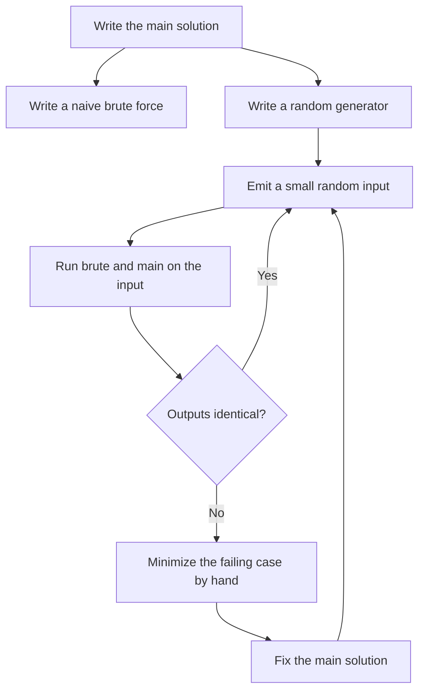
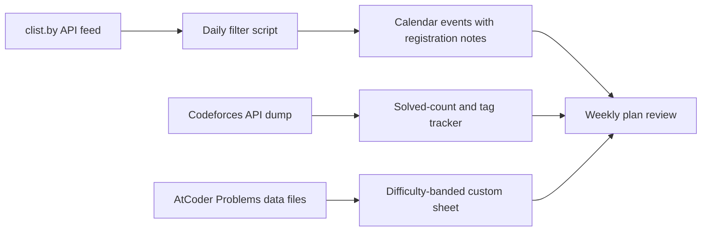

# Tooling and Workflow — Automating the Practice Loop

## Overview

Competitive programming practice produces data at every step — contest schedules, rating changes, per-problem difficulty estimates, wrong answers, retry promises — and almost all of it is available through free, documented interfaces. This page is the automation layer of the track: it shows how to pull that data with APIs and CSV dumps, how to run judged team practices and differential stress tests, how to keep the local setup boring and portable, and how to convert every failure into a scheduled drill with a mistake-log tracker. The goal throughout is a loop that runs on scripts and calendars instead of willpower, because a semester has roughly fifteen weeks and memory-driven organization does not survive week four.

The page is deliberately complementary, not a re-teaching of adjacent material. The [contest calendar and clist page](./contest-calendar-codelist.md) covers discovery — finding upcoming rounds and never missing registrations — while this page covers the plumbing that moves data between judges, calendars, and trackers. The [Codeforces guide](./codeforces-guide.md) contains a Codeforces-specific stress-testing and API section; the rigs here are judge-portable versions of the same ideas, tuned for archive mining and team practice on any platform. Templates and STL knowledge are stored, not duplicated: the code templates live in the [template appendix](../dsa/appendices/appendix-d-code-templates.md) and the STL reference in the [STL appendix](../dsa/appendices/appendix-a-stl-guide.md), and this page links to them rather than reproducing them.

Everything below uses only interfaces that are public and free: the Codeforces API documented on its official help page, AtCoder Problems' published data files, the clist.by API, vJudge's gym system, and plain shell tools. No paid service, no scraping of login-walled pages, and no invented endpoints. Where exact limits are not guaranteed by a vendor, the advice is hedged to the shape of the guarantee — cache, back off, and design against breakage — because tooling that dies quietly is worse than no tooling.

## The Codeforces API

### The Four Endpoints That Matter

Codeforces exposes a keyless, unauthenticated HTTP API whose full method list lives on the official [API help page](https://codeforces.com/apiHelp). Four endpoints cover the entire personal-tooling use case, and they compose: a weekly report is usually user.info for the header, user.rating for the trend, and contest.standings for the last round's detail. The table lists each one with its realistic role in a practice workflow.

| Endpoint | Returns | Typical tooling use |
|---|---|---|
| user.info | Profile snapshot: current rating, rank, peak rating, contribution | Report headers; handle validation; multiple handles in one call |
| user.rating | One record per rated contest: old rating, new rating, place, timestamp | Rating-growth series; plateau detection; delta-per-round charts |
| contest.list | All contests with phase, start time, duration | Schedule sync as a second source alongside aggregator feeds |
| contest.standings | Rank list for one contestId, with per-problem results per row | Round reviews; acceptance-rate context for problems you missed |

The contest.list phase field deserves one sentence of care: a contest moves through phases such as before, coding, system testing, and finished, and any script that syncs schedules must filter on phase rather than assume every record is a future event. contest.standings is the most data-dense of the four — each row carries rank, points, penalty, and per-problem verdicts — which makes it the raw material for the round-review ritual described in the [archive mining page](./contest-archives.md). None of these endpoints require authentication, which is exactly why the etiquette rules in the rate-limit section matter.

### A Working Example

One realistic call illustrates the whole pattern: fetch the rating-change series for a handle and print the latest round's movement. The field names come straight from the API help page, and the JSON envelope always wraps results in a result key with a status field alongside it.

```bash
# Latest rating change for one handle; field names per https://codeforces.com/apiHelp
curl -s "https://codeforces.com/api/user.rating?handle=your_handle" \
  | python3 -c "import json,sys; r=json.load(sys.stdin)['result']; d=r[-1]; print(d['contestName'], d['oldRating'], '->', d['newRating'])"
```

That one-liner is a complete weekly tracker once it runs from cron into a log file. The same shape extends naturally: swap the endpoint for contest.list to announce upcoming rounds to a study group, or contest.standings with a contestId to archive what the group actually achieved in a round. The point of the example is not the one-liner itself but the contract behind it — stable JSON, documented fields, no auth, and therefore no excuse for a manual logbook.

Elo-style rating arithmetic explains what the user.rating series means, and it is worth writing down once because every chart you build from the series inherits the interpretation. In Elo-like systems the expected score against an opponent pool derives from the rating gap, and the constants below use the classic formulation — platforms tune the parameters, but the shape is stable.

\\[ E = \frac{1}{1 + 10^{(R_{\text{opp}} - R_{\text{you}})/400}}, \qquad \Delta R \approx K\,(S - E) \\]

where \\( S \\) is your actual score and \\( E \\) the expectation. A rating delta is therefore a contrast between performance and expectation, not a measure of effort — which is why the tracker should chart solved-count and tag coverage alongside rating, and why a flat rating during a deliberate-difficulty block is not automatically bad news.

### Rate Limits and Caching

The API help page documents the service, and unauthenticated access runs at a deliberately low request rate; the exact ceiling has changed over the years, so design against the shape of the guarantee rather than a memorized number. Cache aggressively: a problem-set dump changes on the scale of weeks, a user profile changes on contest days, and a contest schedule changes rarely enough that one pull per day is generous. When a request fails, back off exponentially instead of retrying in a tight loop, and never schedule bulk pulls during live rounds when the platform is under real load.

Two structural habits keep a personal tool within etiquette forever. First, batch: user.info accepts multiple handles in a single call, so a group tracker should aggregate rather than poll per member. Second, prefer webhooks-in-reverse — a cron job that pulls once and writes a static digest — over anything that reacts in real time to your own rating. Real-time rating polling is a distraction disguised as diligence, and it is the single most common way students turn a useful API into a throttle ban.

### Fields, Envelopes, and Versioning

Every Codeforces API response wraps its payload in a status field and a result key, and scripts should check the status before trusting the result — a failed call returns an error comment inside the same envelope. Field sets have been stable for years, but treat them as documented contracts on the help page rather than folklore copied from blog posts, and pin the fields your script actually reads in one place. Under heavy contest load, responses can slow or fail outright, which is one more reason the cron-digest pattern beats anything interactive. None of this is exotic engineering; it is the same defensive parsing you would apply to any third-party API in a workplace codebase.

## AtCoder Problems — Difficulty Data as a Service

### What the Data Contains

AtCoder Problems at [kenkoooo.com/atcoder](https://kenkoooo.com/atcoder) indexes every problem in the [AtCoder archive](https://atcoder.jp/contests) and attaches two numbers that make it a curriculum engine rather than a list: a community-estimated difficulty and an empirical solve rate. The project publishes its data in bulk files — a problems list and a per-problem model file carrying the difficulty and solve-rate fields — with current download paths linked from the site itself, so a script can hold the whole table locally and never scrape HTML. The difficulty number is an estimate of solving time under competition conditions, so it behaves as a strong ordinal signal and a rough absolute one; treat cross-judge comparisons as approximations rather than conversions.

The solve-rate field is the quietly more useful of the two for sheet-building. Difficulty tells you how hard a problem is for the median solver; solve rate tells you how many people actually clear it, which separates "hard but standard" from "hard and rare" — exactly the distinction that decides whether a problem belongs in a weekly drill or a quarterly stretch block. A custom sheet that filters on both fields, plus the contest archive for editorial access, is a self-serve curriculum at any band.

### Building a Custom Sheet

The pipeline is three steps and needs no infrastructure. Load the published files into any tabular tool, filter to a difficulty band matched to your current level plus a thin slice above it, and exclude problems you have already solved using your AtCoder handle's accepted list. The output is a sheet of twenty to forty problems with solve-rate metadata attached, which converts the vague instruction "do AtCoder problems" into an auditable weekly artifact.

Two rules keep such sheets honest. First, re-derive the sheet from fresh data every month rather than hoarding one static export, because your band moves and the difficulty estimates are periodically recalibrated. Second, resist sorting purely by difficulty ascending; interleave a few problems one full band above your ceiling, because the [sixty-day plan](../dsa/appendices/appendix-k-60-day-plan.md) and the [archive mining page](./contest-archives.md) both depend on stretch problems to move the frontier. The sheet is a filter, not a syllabus — the syllabus is still the technique list in your mistake log.

Attribution matters when the sheet feeds the log: mark which sheet produced each problem you attempt, so the weekly review can tell whether custom sheets or archive sessions are actually generating your solved problems. Sheets also decay once a band is exhausted — when twenty consecutive problems in a band all fall inside one evening, the band has moved and the filter should move with it. The sheet, the mistake log, and the percentile trend from the [archive page](./contest-archives.md) form one system, and each component is weaker without the other two.

## Cross-Judge Contest Feeds with clist

### The API Layer

The clist API, documented at [clist.by/api/](https://clist.by/api/), returns the aggregator's contest records as JSON after you register for a token, and it accepts filters for host judge, time window, and ordering that make a poll-and-filter script trivial. The realistic personal setup is a daily cron job that pulls the next fourteen days, filters to the two or three judges you follow, and writes the surviving records into a calendar in your own timezone. Records carry the host, start time, duration, and name, which is enough to generate calendar events with the registration quirks noted in the event description.

The feed's trust model matters more than its syntax. Aggregator crawlers lag announcements by minutes to hours, new judges can sit unindexed for weeks, and a moved round is a real risk, so the consuming script should flag any record whose host-page data disagrees with the aggregator's — that diff is the signal that something upstream changed. The verification habit costs one click per registered contest and eliminates the failure mode of preparing for a round whose start time moved. Where the [calendar page](./contest-calendar-codelist.md) treats the feed as discovery, this page treats it as a data source with a reconciliation step.

### Feeds Without Fragmentation

The failure mode of multi-judge tooling is fragmentation: a clist bot in one app, a Codeforces tracker in another, a local notes file nobody rereads. Consolidate on two surfaces only — one calendar and one tracker file — and make every script write into those instead of inventing new sinks. Timezone anchoring is the detail that keeps the calendar trustworthy across daylight-saving shifts, and the [calendar page](./contest-calendar-codelist.md) spells out the season-drift pitfalls in full. When a new judge enters your rotation, add it to the feed filter and the tracker's source list in the same commit, or it will drift out of both.

### Cadence, Tokens, and Failure Alerts

Run the feed pull on a fixed daily cadence, because announcements cluster at unpredictable hours and a weekly pull misses rounds declared mid-week. Store the API token in an environment file that never enters version control, and make the script fail loudly — a message to the group chat or an empty-calendar alert — when a pull returns nothing, because silent failure is how a calendar rots unnoticed. Given the field's density, a zero-contest result is itself suspicious, so treat it as an error condition to investigate rather than a quiet truth.

Alerting deserves the same design as the feed itself. A useful shape is one weekly digest plus event-time reminders, resisting the temptation to ping per announcement, which trains everyone to ignore the bot within a month. When the team's rotation grows — a new regional judge, a private gym series — add the source to the filter list and keep the alerting shape identical, so the notification budget stays fixed while coverage expands.

## vJudge Gyms and Team Practice

### Setting Up a Team Gym

vJudge at [vjudge.net](https://vjudge.net) solves a problem no single native judge solves well: assembling a contest from problems across many judges and running it for a team on one scoreboard. A group owner creates a group, creates a gym contest, and pulls problems from multiple sources into a single set; teammates join under a team account and the platform scores it ICPC-style with penalty time per accepted problem. For a college ICPC team, a weekly gym is the cheapest honest rehearsal that exists: five hours, one machine, real scoreboard pressure, and a problem set you chose to match the upcoming regional's style.

Setup discipline is what separates a gym from a group solving problems side by side. Register as a team, not as individuals, so penalty accounting matches real contests; freeze the scoreboard at the last hour if the gym supports it, because late-stage scoreboard strategy is itself a trainable skill; and appoint one member to paste the set and the clock, rotating the role so everyone learns the operational burden. Gym problems are solved on vJudge, not on their native judges, so rating effects stay out of the picture — which is exactly what you want for rehearsals.

### What vJudge Adds — and What It Costs

The addition is coverage: regional sets, national OI material, and classics that no modern judge hosts can all appear in one team contest, and the [archive mining page](./contest-archives.md) leans on this for its ICPC row. The costs are equally concrete — native-judge metadata is lost because you are not solving on the source platform, community difficulty data does not transfer, and occasional mirrors drift out of date relative to the source problem. The working rule: use vJudge for team simulations and assembled sets, and use native judges for everything that needs ratings, official verdicts, or editorial linkage. When a gym problem matters enough to upsolve seriously, redo it on its home judge afterward so the solve is recorded where the ecosystem can see it.

### A Four-Week Gym Rotation

A concrete rotation makes gyms a habit instead of an event. Week one runs a full regional simulation from the [ICPC archive row](./contest-archives.md); week two is a three-hour set one band easier, focused on speed and penalty time; week three repeats the full simulation in a different region's style; week four is a maintenance gym where each member resubmits the problems they failed in weeks one and three. The rotation fits a semester, needs one reserved evening per week, and produces a written record of solve counts and penalties that doubles as team diagnostics. Its second-order benefit is operational: keyboard sharing, problem triage, and penalty arithmetic are trainable only inside real team contests, and the gym provides them without touching anyone's rating.

## The Stress-Testing Rig

### Three Components and a Loop

A stress test needs exactly three artifacts: the main solution, a naive brute force that is too slow but obviously correct, and a random generator that emits small inputs. The loop compares the two solutions on generated inputs until they disagree, and the first disagreement is a minimal counterexample you did not have to think of yourself. This is the single highest-leverage debugging tool in the field, and it is judge-portable — the same three scripts work for a Codeforces round, a USACO problem mined from [usaco.org](https://usaco.org), or a take-home assignment.



Two implementation details decide whether the rig actually finds bugs. Keep generated inputs small — a few elements, not thousands — because small counterexamples are readable and large ones are noise. And write the brute force to be embarrassingly simple, even at the cost of exponential time, because the brute force is the oracle and a clever oracle is a second bug.

### A Minimal Python Driver

The driver below is complete: it generates, runs both binaries with a timeout, and stops at the first mismatch, printing the input that broke the solution. It has no dependencies beyond the standard library, and it assumes ./fast and ./brute sit in the working directory next to it. Copy it once, adapt the generator body per problem, and it outlives any single contest.

```python
# stress.py — differential testing: fast solution vs brute force
import random, subprocess

def run(binary, data):
    r = subprocess.run([binary], input=data, capture_output=True, text=True, timeout=5)
    return r.stdout

for seed in range(10000):
    n = random.randint(1, 8)
    a = [random.randint(-20, 20) for _ in range(n)]
    data = f"{n}\n{' '.join(map(str, a))}\n"
    fast, brute = run("./fast", data), run("./brute", data)
    if fast != brute:
        print("COUNTEREXAMPLE on seed", seed)
        print(data)
        break
```

The rig generalizes beyond correctness. Raise the generator's size parameters and replace the comparison with a stopwatch, and the same loop hunts time-limit bugs by timing the main solution on maximal inputs. Restrict the generator to structured cases — sorted arrays, trees, permutations — and it hunts the boundary classes that uniform randomness under-samples. One driver, three modes, and every mode converts a mysterious verdict into a concrete failing case within minutes.

### Tuning the Generator

Generator quality is the difference between a rig that finds bugs and one that merely confirms optimism. Start uniform and tiny, then add structure in response to what the solution actually branches on: if the code special-cases duplicates, generate small ranges with heavy collisions; if it builds a graph, generate connected graphs and star graphs as separate modes. Keep every generator mode behind a seed and a flag so a counterexample can be replayed exactly, and commit the generator alongside the solution in whatever repository holds your practice code. The ten minutes spent writing a good generator pays back the first time a wrong-answer-on-test-93 verdict becomes a four-line input you can stare at.

### The Rig as an Interview Answer

The rig is also one of the strongest available answers to the interview question "how would you test this function?". Describing differential testing against a naive oracle, seeded generators, and minimal-counterexample reduction demonstrates testing maturity most candidates lack, and the same structure reappears in production practice as property-based testing and golden-master comparison. The likely follow-up — "what if the brute force is also wrong?" — has a real answer: verify the oracle on hand-computed cases first, and treat an oracle disagreement as information about the input distribution rather than noise. Rehearse the two-minute spoken version of the rig now, because the skill only helps the placement outcome if it survives being described out loud.

## Local Setup and Ergonomics

### Test Files and a Run Script

A competitive setup should make the edit-compile-test loop take seconds and require zero memory. The pattern that survives a full contest: one source file per problem, a tests directory holding numbered input/output pairs, and a single script that recompiles and checks everything.

```bash
# run.sh — compile once, then check every tests/*.in against its .out
g++ -O2 -Wall -Wextra -std=c++17 sol.cpp -o sol
for t in tests/*.in; do
  ./sol < "$t" | diff - "${t%.in}.out" > /dev/null || echo "FAIL $t"
done
```

Add tests as you find bugs — every stress-test counterexample and every hand-made edge case becomes a numbered pair that the script checks forever. The file layout is deliberately trivial so it works on any machine, including the borrowed lab desktop at a regional contest. Anything fancier than this belongs in the template appendix, not in per-problem scaffolding.

### Compiler Flags and Their Limits

The flags above are commonly used and widely copied: optimization enabled, warnings enabled, a pinned language standard. Two honest caveats belong next to them. First, the judge compiles with its own settings, so local flags tune your debugging, not your verdict — a solution that only passes because of an aggressive local optimization flag has learned you nothing. Second, warnings are part of the tool: an uninitialized-variable bug that warnings flag in one second is the same bug that otherwise costs a full stress-test cycle, so treat a warning-free compile as part of your definition of done. Check the specific compiler versions your target judges publish rather than assuming your local toolchain matches theirs.

### Against Macro Magic

Macro-heavy templates — redefining loops, compressing entire statements into single tokens, or forcing wide integer types globally — survive solo practice and fail exactly when it matters. In a team contest, your teammates debug your code under a clock, and a private macro language multiplies their cognitive load at the worst possible moment. Subtle behaviors come bundled: a global redefinition that widens integer types doubles memory usage and can silently flip a pass into a memory-limit verdict, and macro collisions with standard library names produce error messages no one can read under pressure. The transfer cost is real too — interviews and workplace code reward the clean, explicit style that macro-free practice builds.

The alternative is not heroics but preparation: boilerplate that is typed out or pasted whole, uses standard constructs, and stays identical across contests. That boilerplate already exists in the [code template appendix](../dsa/appendices/appendix-d-code-templates.md), and the data-structure vocabulary it relies on is catalogued in the [STL guide](../dsa/appendices/appendix-a-stl-guide.md) — both are linked here rather than re-taught. Paste whole files, not clever fragments, and keep the pasted set small enough that you have read every line of it.

### Tooling Is Not Training

There is a procrastination failure mode specific to this page: a week spent perfecting scripts while solving nothing. Cap automation work explicitly — one evening per month is more than enough to maintain everything described here — and treat an urge to refactor the tracker as a signal to go solve a problem instead. The tools exist to protect practice time and review quality, so their success metric is hours spent inside the editor on problems, not the sophistication of the scripts. When a script breaks, fix it at the next scheduled maintenance evening or delete it, because half-running tooling is worse than none.

## The Mistake-Log Tracker

### Schema

The mistake log is a single table with five columns per failed or slow problem, and its power comes entirely from being filled in within a day of the failure. Five columns is a deliberate ceiling: every extra field makes rows likelier to be skipped, and the weekly aggregation needs nothing beyond these five. The example row shows the intended granularity — one problem, one dominant cause, one scheduled return.

| Column | What goes in it | Example |
|---|---|---|
| Problem | Source-neutral pointer: judge, identifier, contest | CF 1547 Div 3 D |
| Tag | One primary technique, not five | two pointers |
| Time | Minutes from opening the problem to AC or giving up | 47 |
| Failure mode | The category that actually caused the loss | misread constraint |
| Retry date | Spaced revisit: +3 days, then +2 weeks, then +6 weeks | 2026-11-18 |

The failure-mode column uses a fixed taxonomy, because free-text notes never aggregate: misread statement, wrong algorithmic class, missed edge case, implementation bug, and time-management tilt cover nearly every contest loss. The tag column deliberately holds one primary technique rather than a tag cloud, because the weekly review aggregates tags into "my three weakest areas" only when the data is forced to be small. Retry dates implement spaced retrieval — the problem returns before memory of the fix decays, at widening intervals, until one attempt solves it cold.

### Why Review Beats Volume

Volume without review compounds the same errors: a student can solve five hundred problems and still lose every round to the same misread-statement failure, because nothing in raw volume surfaces the pattern. The log converts each failure into a category, each category into a count, and each count into a plan change — that chain is the difference between experience and repeated experience. Retrieval practice research in plain terms: attempting recall at spaced intervals beats re-exposure, which is why the retry-date column outperforms rereading editorials. The weekly review itself is short — fifteen minutes over the log's new rows, updating the retry schedule and the category counts — and it is the step that decides what next week's custom sheet and drills contain.

The log also feeds upward into the session-level percentile tracking described on the [archive mining page](./contest-archives.md), which is where practice governance actually lives. Per-problem rows answer "what do I drill tomorrow"; the session trend answers "does my plan change this quarter". Keeping both layers in one system, in one file or spreadsheet, is what makes the automation stack in the diagram earlier in this page a loop instead of a pile of scripts.

### Wiring the Tracker Into the Week

The tracker needs three scheduled touchpoints and nothing more. At contest or session end, one row per failure — the discipline is writing the row even when the session went well, because a clean session with zero logged failures is itself data about difficulty calibration. At the weekly review, aggregate: category counts, tags due for retry, and one decision about the coming week's emphasis. At retry time, the problem returns cold; an unsolved retry moves to the next interval, a solved one closes, and both outcomes get logged in the same row. Students who want a starting scaffold for the weekly cycle can adapt the [60-day plan appendix](../dsa/appendices/appendix-k-60-day-plan.md), which already structures practice into reviewable weeks.

### Tracker Failure Modes

The tracker fails in three predictable ways, each with a mechanical fix. Abandonment after three weeks is the most common, and the fix is attaching the weekly review to an existing calendar slot rather than to motivation. Taxonomy drift is second — five failure-mode categories quietly become fifteen — and the fix is refusing to add a category until a quarter of rows genuinely fit none of the existing ones. Vanity metrics are third: hours logged and problems opened are inputs, not outcomes, so the weekly aggregation must read failure-mode counts and closed retries, never effort numbers.

A tracker that survives a semester becomes the most valuable artifact on this page, because it is the only component that stores judgment rather than data. Scripts can be rewritten in an evening; the record of how you actually fail cannot be reconstructed after the fact. That asymmetry is the argument for starting the log today, in a plain text file, before any of the automation described above exists.

## A Weekly Automation Pipeline

The pipeline below is the page in one picture, and it is deliberately small: three data sources, two derived artifacts, and one weekly review where everything converges. Each arrow is a cron job of the kind shown earlier in this page, and each artifact is a file or calendar you already know how to read. The review step is the only human-judgment stage, which is by design — automation schedules and audits practice, while the [resource directory](./resources-directory.md) and the plan tables on the [archive page](./contest-archives.md) decide what the practice should be.



The diagram is the whole automation stack in one picture: three data sources, two derived artifacts, and one weekly review where everything converges. Each arrow is a cron job of the kind shown earlier, and each artifact is a file or calendar you already know how to read. The review step is the only human-judgment stage, which is by design — automation schedules and audits practice, while the [resource directory](./resources-directory.md) and the plan tables decide what the practice should be.

Two habits keep the pipeline alive for a full semester. Give every script a fixed maintenance evening — one slot per month is enough — so breakage is repaired on schedule instead of abandoned quietly. And measure the pipeline by its output, not its elegance: if the weekly review is happening and the tracker is filling in, the automation is done, and any additional engineering is procrastination wearing a productive costume.

The cron layer is tiny enough to print. Two entries cover the whole pipeline at the cadence recommended earlier in this page. Anything beyond them belongs behind the maintenance-evening rule, not in crontab.

```bash
# crontab: daily clist feed pull, weekly Codeforces report
10 6 * * * /home/you/bin/cp-feed-pull.sh      # clist -> calendar
0 7 * * 0 /home/you/bin/cf-weekly-report.sh   # user.rating -> digest
```

If those two lines plus a tests directory and a mistake log are all the tooling you ever build, you have captured most of the value available on this page. Everything else — gyms, sheets, stress rigs — exists to serve the loop the diagram shows, and the loop is the deliverable.

## Interview Questions

1. **Which Codeforces API endpoints would you use to build a weekly practice report, and how do you keep the script polite?** Use user.info for the profile header, user.rating for the delta series across the week's rounds, and contest.standings for per-problem detail on the rounds you entered; contest.list can cross-check the schedule source. Keep it polite by caching — each endpoint's data changes on a different timescale, so a daily or weekly pull is generous rather than minimal. Batch multiple handles into single user.info calls for group reports, back off on failures instead of tight-looping, and avoid polling during live rounds when the platform is under load. The report is a static digest written by cron, not a live dashboard, because the goal is review, not monitoring.

2. **How would you build a custom problem sheet from AtCoder Problems data?** Pull the project's published bulk files rather than scraping HTML, filter to a difficulty band centered slightly above your current level, and exclude problems your handle has already solved using the accepted-submission data. Attach the solve-rate field to every candidate, because it separates hard-but-standard problems from hard-and-rare ones — the former belong in weekly drills, the latter in quarterly stretch blocks. Re-derive the sheet monthly from fresh data since both your band and the difficulty estimates move. Keep the sheet at twenty to forty problems with a few deliberate stretch entries, and log outcomes into the mistake tracker so the sheet steers the log and the log steers the next sheet.

3. **Your solution passes samples but fails on large hidden inputs. How do you find the bug?** First run the stress rig at small scale: a naive brute force, a uniform random generator with tiny parameters, and a differential loop comparing outputs. Small failing cases expose logic errors quickly, and minimizing a case by hand turns it into a permanent regression test in the tests directory. If small cases all pass, switch the rig's mode: enlarge generator parameters and time the main solution on maximal inputs to separate a complexity-class problem from a constant-factor problem. The same three-component rig — main, brute, generator — covers both correctness and performance diagnosis, which is why it is the first thing to build in week two of practice.

4. **Why avoid macro-heavy templates in competitive programming, especially on a team?** Teammates debug your code under a five-hour clock, and a private macro language multiplies their cognitive load precisely when the team can least afford it. Macros bundle subtle behavior: a global widening of integer types doubles memory and can flip a verdict to memory-limit, and collisions with standard library names produce unreadable errors. Local toolchain differences across judges and teammates' machines add portability failures on top. The discipline that transfers to interviews and work is writing clean, explicit code fast, so the durable alternative is a small set of whole-file templates you have read line by line — boilerplate lives in the template appendix, not in clever fragments.

5. **What belongs in a mistake log, and why does it outperform simply solving more problems?** One row per failed or slow problem with five fields: a source-neutral problem pointer, a single primary tag, minutes spent, the failure mode from a fixed taxonomy, and a spaced retry date. The fixed taxonomy is what makes weekly aggregation possible — misread statement, wrong algorithmic class, missed edge case, implementation bug, and time-management tilt cover most losses. It outperforms volume because volume compounds whatever habits produced it, while the log converts each failure into a category, each category into a count, and each count into a plan change. The spaced retries implement retrieval practice: attempting recall at widening intervals beats rereading the editorial, and a problem closed on a cold retry is genuinely learned.

6. **How would you pipe contest data into a shared team calendar automatically?** Register for a clist API token, run a daily cron job that pulls the next two weeks, and filter to the host judges the team actually follows before writing events into the shared calendar in the team's anchored timezone. Each event should carry the registration quirk in its description — deadline, platform, whether a team roster is needed — because a calendar entry without the quirk still fails at the registration step. Add a reconciliation check that flags aggregator records disagreeing with the host judge's page, since crawler lag and moved rounds are the two real failure modes. Keep one calendar and one tracker as the only sinks, so the automation consolidates rather than fragments the team's view.

## Key Takeaways

- Four Codeforces API endpoints — user.info, user.rating, contest.list, contest.standings — cover the entire personal tooling space, keyless and documented on the official help page.
- Design against the shape of rate limits, not memorized numbers: cache aggressively, batch handle queries, back off on failures, and pull once into static digests.
- AtCoder Problems' published data files turn difficulty and solve-rate into a filterable curriculum; solve rate separates hard-but-standard from hard-and-rare.
- The clist API plus a daily filter script feeds a single shared calendar; flag any aggregator record that disagrees with the host judge's own page.
- vJudge gyms are the cheapest honest ICPC rehearsals — team accounts, penalty scoring, cross-judge sets — but upsolve important problems on their home judges.
- The stress rig is three artifacts (main solution, dumb brute force, seeded generator) and one loop; small inputs find logic bugs, enlarged inputs find performance bugs.
- Keep the local setup boring: a tests directory, a one-line compile-check script, commonly used flags, and whole-file templates instead of macro magic.
- The mistake log's five columns (problem, tag, time, failure mode, retry date) plus a fixed failure taxonomy convert volume into review, and review is what moves rating.

## References

- [Codeforces API help](https://codeforces.com/apiHelp) — official documentation for user.info, user.rating, contest.list, and contest.standings
- [Codeforces](https://codeforces.com) — platform home for rounds, problemset, and the API's data source
- [kenkoooo.com/atcoder](https://kenkoooo.com/atcoder) — AtCoder Problems: difficulty estimates, solve rates, and published data files
- [AtCoder contests](https://atcoder.jp/contests) — the archive the AtCoder Problems data indexes
- [clist.by](https://clist.by) — cross-judge contest aggregator
- [clist.by API](https://clist.by/api/) — documented JSON API for contest feeds
- [vjudge.net](https://vjudge.net) — groups, gyms, and team contests across judges
- [usaco.org](https://usaco.org) — example archive target for the portable stress-testing rig

## Cross-References

- [Contest calendar and clist](./contest-calendar-codelist.md) — the discovery half of the contest pipeline this page automates
- [Contest archives](./contest-archives.md) — the mining loop whose sims, reviews, and retries this tooling serves
- [Codeforces guide](./codeforces-guide.md) — Codeforces-specific stress-testing discipline and archive sections
- [AtCoder guide](./atcoder-guide.md) — the ecosystem behind the AtCoder Problems data layer
- [Resource directory](./resources-directory.md) — judge landscape that the feeds and trackers span
- [Code templates appendix](../dsa/appendices/appendix-d-code-templates.md) — the whole-file templates this page tells you to paste instead of writing macros
- [STL guide appendix](../dsa/appendices/appendix-a-stl-guide.md) — the standard-library vocabulary the templates rely on
- [60-day plan appendix](../dsa/appendices/appendix-k-60-day-plan.md) — the weekly structure the tracker and review ritual plug into
