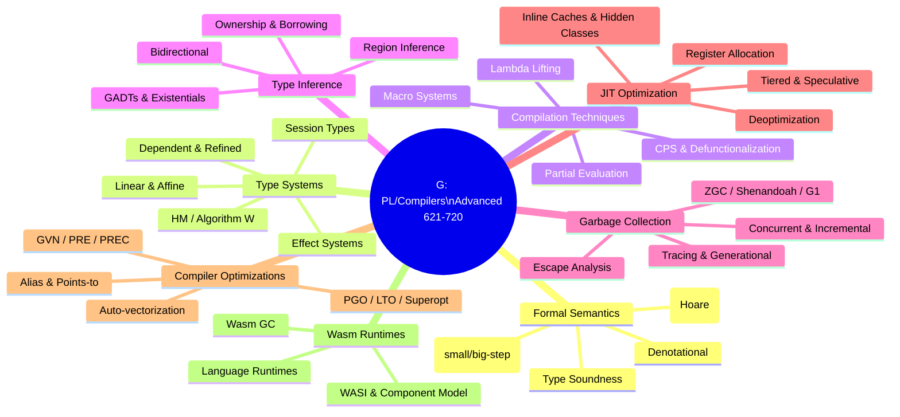

# Section G — Programming Languages & Compilers: Advanced Topics (Topics 621–720)

This section goes beyond the compiler pipeline covered in the parent directory. Here we tackle **formal semantics**, **advanced type systems**, **transformation techniques**, **type inference internals**, **garbage collection design**, **JIT optimization**, and **compiler optimization theory** at the depth expected in senior/placement interviews at top-tier companies.

## Topic Map

## File Index

| File | Topics | Approx. Words |
|------|--------|---------------|
| `formal-semantics.md` | Operational, denotational, axiomatic semantics; small-step, big-step; type soundness (progress + preservation) | 1,400 |
| `type-systems.md` | Hindley-Milner, Algorithm W, dependent/refinement/linear/affine/session types, effect systems, algebraic effects, monads, comonads | 1,800 |
| `compilation-techniques.md` | CPS, closure conversion, lambda lifting, defunctionalization, partial evaluation, supercompilation, staging, macro systems, metaprogramming, reflection | 1,800 |
| `type-inference.md` | Gradual typing, structural vs nominal, subtyping, variance, bidirectional typing, unification, GADTs, type classes, ownership/borrow checking, region inference | 1,900 |
| `garbage-collection.md` | GC design, tracing, generational, concurrent, incremental, compacting, ZGC, Shenandoah, G1, escape analysis, scalar replacement | 1,800 |
| `jit-optimization.md` | Devirtualization, inline caches, hidden classes, tiered compilation, speculative optimization, deoptimization, register allocation, SSA construction | 1,800 |
| `compiler-optimizations.md` | Loop opts, vectorization, alias/points-to/escape analysis, abstract interpretation, GVN, PRE, superoptimization, PGO, LTO, eBPF | 1,900 |
| `wasm-runtimes.md` | WebAssembly internals, WASI, WASM GC, component model, language runtimes | 1,400 |

## Suggested Reading Order

1. **formal-semantics.md** — The mathematical foundation; everything else builds on these concepts.
2. **type-systems.md** — How languages formally specify what programs mean and guarantee.
3. **type-inference.md** — How those type systems are implemented algorithmically.
4. **compilation-techniques.md** — Core transformations from source to executable.
5. **garbage-collection.md** — Runtime memory management that enables high-level languages.
6. **jit-optimization.md** — How modern VMs (V8, JVM, SpiderMonkey) achieve near-native speed.
7. **compiler-optimizations.md** — The optimization theory behind AOT compilers (GCC, LLVM).
8. **wasm-runtimes.md** — The emerging portable compilation target.

## Cross-References

- **Parent section**: [../README.md](../README.md) — Compiler pipeline overview.
- **PL theory**: [../../cs-theory/programming-language-theory.md](../../cs-theory/programming-language-theory.md)
- **Formal languages**: [../../cs-theory/formal-languages.md](../../cs-theory/formal-languages.md)
- **WebAssembly**: [../../cs-theory/webassembly.md](../../cs-theory/webassembly.md)
- **Interview questions**: [../interview-questions.md](../interview-questions.md)
