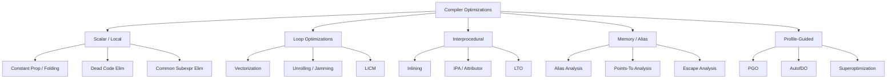

# Compiler Optimizations

Compiler optimizations transform IR to produce faster, smaller, or more power-efficient machine code. This chapter covers the major optimization families, their dataflow foundations, and how real compilers (LLVM, GCC, HotSpot) implement them.

## Optimization Taxonomy



## Alias Analysis

**Alias analysis** determines whether two memory references may refer to the same location. This is the gating analysis for virtually all memory optimizations — if two stores cannot alias, loads can be reordered past them, and redundant loads can be eliminated.

### Alias Analysis Hierarchy

| Analysis | Precision | Cost | Used In |
|----------|-----------|------|---------|
| **No-alias** (assume no alias) | Highest | Zero | `-fno-strict-aliasing` disables C's type-based alias |
| **Type-based** (TBAA) | Medium | Low | GCC, Clang (C/C++) |
| **Andersen's** (inclusion-based) | High | O(n³) | Spot in LLVM, static analysis tools |
| **Steensgaard** (unification-based) | Medium | Near-linear | Fast over-approximation |
| **CFL-reachability** | High | O(n³) | LLVM `CFLAliasAnalysis` |
| **Context-sensitive** | Highest | Very expensive | Research, whole-program analysis |

### Type-Based Alias Analysis (TBAA)

In C/C++, the strict aliasing rule says that objects of different types cannot alias (with exceptions for `char*`). Compilers exploit this:

```c
int x = 42;
float *fp = (float*)&x;
*fp = 3.14f;
// Under strict aliasing, the compiler may assume *fp
// does NOT affect x, because int* and float* cannot alias.
// Reading x might return 42 (stale value). UB!
```

TBAA metadata in LLVM IR:

```llvm
store i32 42, i32* %xp, !tbaa !0  ; !0 = int type descriptor
store float 3.14, float* %fp, !tbaa !1  ; !1 = float type descriptor
; TBAA says: int* and float* don't alias → load of %xp can be hoisted
```

## Points-To Analysis

**Points-to analysis** determines which heap locations a pointer may reference. It is more precise than generic alias analysis because it tracks *which* allocation each pointer can point to.

### Andersen's Algorithm (Inclusion-Based)

Builds a constraint graph where nodes are pointer variables and edges represent "points to" or "assign" relationships:

```
Constraints:
  x = &a    →  x ⊇ {a}
  x = y     →  x ⊇ y  (copy)
  x = *y   →  x ⊇ *y  (load)
  *x = y   →  *x ⊇ y  (store)
```

Andersen's computes a **points-to set** for each variable: the set of abstract heap locations it may point to. Complexity is O(n³) with worst-case graph cycles.

### Steensgaard's Algorithm (Unification-Based)

Steensgaard's uses **unification** (like type inference) to merge pointer equivalence classes. It is **almost linear** but less precise — it over-approximates by grouping all potentially-aliasing pointers into the same set. Used in GCC's `-fno-ipa-pta` fast path and various static analyzers.

> **Interview Angle**: "How does the compiler know if `*p` and `*q` can alias?" It runs points-to analysis. If `p` and `q` have disjoint points-to sets, they cannot alias. If they overlap, the compiler must assume aliasing. This gates optimizations like load elimination, store-to-load forwarding, and scheduling.

## Abstract Interpretation

Abstract interpretation provides a **mathematical framework** for sound static analysis. It works by **abstracting** concrete program states into an abstract domain and computing a **fixpoint** over the transfer functions.

### Key Concepts

- **Abstract domain**: A lattice of abstract values (e.g., intervals, sign, parity). Intervals: `[3, 7]` represents all integers from 3 to 7.
- **Widening**: For loops with growing bounds, widening ensures convergence by jumping to `∞` or `-∞` when a bound increases. Without widening, interval analysis diverges on `for (i=0; i<n; i++)`.
- **Narrowing**: After widening finds a fixpoint, narrowing refines the bound from above.

```c
// Interval analysis example
int f(int x) {
    int y = x * 2;     // y ∈ [2*lo, 2*hi]
    if (y > 10) {
        y = y - 5;     // y ∈ [max(6, 2*lo), 2*hi-5]
    }
    return y;
}
```

LLVM's `ScalarEvolution` (SCEV) is a form of abstract interpretation for induction variables. It can reason about loop trip counts, array offsets, and pointer arithmetic symbolically. HotSpot's C2 uses **range check elimination** based on similar interval analysis.

## Constant Propagation and Folding

**Constant propagation** replaces variables known to hold a constant value with that constant. **Constant folding** evaluates constant expressions at compile time.

```c
// Before
const int N = 1024;
int buf[N];
int size = sizeof(buf) / sizeof(buf[0]);

// After
int buf[1024];
int size = 1024;  // folded
```

LLVM implements **SCCP (Sparse Conditional Constant Propagation)**: it tracks both constant and *top* (unknown) values on SSA edges, and only propagates along edges whose condition evaluates to true. This is more precise than simple iterative dataflow.

## Dead Code Elimination (DCE)

DCE removes code whose results are never used:

```c
// Before
int x = compute_expensive();  // x is dead — never read
int y = x + 1;                // y is dead
return 42;

// After
return 42;  // compute_expensive() call eliminated
```

**Aggressive DCE** in LLVM: removes instructions that produce unused results AND have no side effects. Combined with inlining, this is extremely powerful — inlined functions that are called with constant arguments often have their entire body reduced to a constant.

## Global Value Numbering (GVN)

GVN identifies computations that produce the **same value** and replaces redundant ones with a single computation. Unlike CSE (common subexpression elimination) which uses syntactic equality, GVN uses **value numbering** — assigning the same number to expressions that are provably equal.

```
// Before GVN:
a = b + c
d = b + c    // same value as a

// After GVN:
a = b + c
d = a        // reuse a's value
```

LLVM's **NewGVN** uses **congruence classes** and **SSA-based value numbering**. It can detect value equivalence through:
- Commutativity: `a + b` ≡ `b + a`
- Redundant phi nodes: `φ(a, a) = a`
- Load forwarding: if a store to `*p` and a load from `*q` cannot alias, the load can use the stored value.

## Loop Optimizations

### Loop Invariant Code Motion (LICM)

LICM moves computations that do not change across loop iterations outside the loop:

```c
// Before
for (int i = 0; i < n; i++) {
    sum += a[i] * scale;  // 'scale' doesn't change
}

// After
int scale_tmp = scale;  // hoisted
for (int i = 0; i < n; i++) {
    sum += a[i] * scale_tmp;
}
```

LICM requires **dominance** (the hoisted instruction must dominate all loop exits) and **no side effects** inside the loop body. Alias analysis determines whether memory loads are loop-invariant.

### Loop Unrolling

Loop unrolling replicates the loop body to reduce branch overhead and expose instruction-level parallelism:

```c
// Before
for (int i = 0; i < n; i++) sum += a[i];

// After (4x unroll)
int i;
for (i = 0; i + 3 < n; i += 4) {
    sum += a[i] + a[i+1] + a[i+2] + a[i+3];
}
for (; i < n; i++) sum += a[i];  // remainder loop
```

Modern compilers (LLVM, GCC) use **runtime unrolling** with trip-count checks to avoid redundant work.

### Partial Redundancy Elimination (PRE)

PRE is a generalization of CSE, LICM, and GVN. It eliminates expressions that are **partially redundant** — computed on some paths but not all:

```c
// Before PRE:
if (cond) x = a + b;
// ... some code that doesn't modify a or b ...
y = a + b;  // redundant if cond was true

// After PRE:
if (cond) {
    x = a + b;
    t = x;  // save
} else {
    t = a + b;  // compute on this path too
}
y = t;  // always available
```

LLVM's implementation is **GVN-based** (integrated into GVN rather than a separate pass).

## Auto-Vectorization

Auto-vectorization transforms scalar loops into SIMD instructions (AVX-256/512, NEON, SVE):

```c
// Scalar
for (int i = 0; i < n; i++) {
    c[i] = a[i] + b[i];
}

// Auto-vectorized (AVX2, 8 × float32)
for (int i = 0; i + 7 < n; i += 8) {
    __m256 va = _mm256_loadu_ps(&a[i]);
    __m256 vb = _mm256_loadu_ps(&b[i]);
    __m256 vc = _mm256_add_ps(va, vb);
    _mm256_storeu_ps(&c[i], vc);
}
// tail loop for remainder
```

**Requirements for vectorization**:
1. Loop is counted (known or computable trip count).
2. No loop-carried dependencies (or only reducible ones like summation).
3. Memory accesses are contiguous and aligned (or unaligned loads are acceptable).
4. No function calls with side effects.

LLVM's **Loop Vectorizer** (`-O2`/`-O3`) uses a cost model: it estimates whether the vectorized version is faster than scalar, considering vector width, memory bandwidth, and shuffle costs. GCC's `-ftree-vectorize` is enabled at `-O2` since GCC 12.

## Profile-Guided Optimization (PGO)

PGO uses **real execution profiles** to guide optimizations:

1. **Instrument**: Compile with profiling instrumentation (`-fprofile-generate`).
2. **Run**: Execute the instrumented binary on representative workloads. Profile data (edge counts, branch probabilities) is recorded to `.gcda` files.
3. **Optimize**: Re-compile with profile data (`-fprofile-use`). The compiler uses branch probabilities for:
   - **Layout**: Place hot code contiguously, cold code at the end.
   - **Branch prediction hints**: Emit `likely`/`unlikely` annotations.
   - **Inline decisions**: Inline hot callees, skip cold ones.
   - **Register allocation**: Prioritize registers for hot paths.
   - **Vectorization**: Only vectorize loops with high trip counts.

**AutoFDO** (used by Google for data-center workloads): Uses hardware performance counters (perf/PMU) instead of instrumented binaries, eliminating the instrumentation overhead. LLVM's `-fprofile-sample-use` reads perf LBR (Last Branch Record) data.

### BOLT (Binary Optimization and Layout Tool)

BOLT operates on **already-compiled binaries**: it reorders basic blocks based on profile data, inserts trampolines, and patches the binary. It's a **post-link** optimizer used by Meta, Google, and AWS for large-scale data-center workloads, achieving 2–10% improvement on already-optimized binaries.

## Link-Time Optimization (LTO)

LTO performs optimizations **across compilation units** at link time. Normally, each `.c` file is compiled independently, losing cross-function information. LTO merges IR from all translation units:

```
// a.c
static int helper(int x) { return x * x; }
int square(int x) { return helper(x); }

// b.c  
int square(int);
// Without LTO: b.c calls 'square' through PLT/GOT (indirect at runtime)
// With LTO: compiler sees 'helper' is only called from 'square',
//            inlines it, and potentially eliminates 'helper' entirely.
```

- **ThinLTO** (LLVM default): Performs a lightweight summary analysis per module (function signatures, visibility), then parallelizes the full optimization across modules. Scales better than monolithic LTO.
- **Full LTO**: Merges all IR into a single module. Maximum optimization but doesn't scale to millions of lines.

## Superoptimization

Superoptimization searches for the **shortest/FASTEST** machine code sequence that implements a given program fragment, using **satisfiability modulo theories (SMT)** or **brute-force enumeration**.

- **STOKE** (Stanford): Uses stochastic search + SMT verification to find shorter x86 sequences. Has found sequences 2–3× shorter than GCC/LLVM output.
- **Souper** (LLVM-based): An LLVM peephole superoptimizer that mines existing code for optimization opportunities using SMT.

Superoptimization is expensive (seconds to minutes per sequence) and used offline, not during normal compilation.

## Binary Rewriting and DBI

- **Dynamic Binary Instrumentation (DBI)**: Tools like **Pin**, **DynamoRIO**, and **Frida** inject instrumentation into running binaries without recompilation. Used for profiling, security analysis, and fuzzing.
- **Binary rewriting**: Tools like **BOLT**, **E9Patch** modify binary executables post-link for optimization or security hardening.
- **eBPF compilation**: The Linux eBPF virtual machine compiles eBPF bytecode to native code via an in-kernel JIT. Clang compiles C to eBPF with `-target bpf`. eBPF's verifier ensures safety (no unbounded loops, no out-of-bounds memory). The JIT in the kernel performs register mapping, instruction selection, and simple optimizations.

> **Interview Angle**: "What's the difference between LTO and PGO?" LTO expands the optimization scope across files (spatial). PGO uses runtime behavior to guide which optimizations to apply (temporal). They are complementary — LTO+PGO together gives the best results (used by all major browsers, databases, and cloud services).

## References
- Aho, Lam, Sethi, Ullman — *Compilers: Principles, Techniques, and Tools*, Ch. 9–10
- P. Cousot & R. Cousot, *Abstract Interpretation: A Unified Lattice Model* (1977)
- LLVM pass documentation: <https://llvm.org/docs/Passes.html>
- LLVM Loop Vectorizer design: <https://llvm.org/docs/Vectorizers.html>
- Google AutoFDO: <https://research.google/pubs/pub45069.html>
- E. Schkufza et al., *STOKE: Synthesizing Theorems and Lattices* (ASPLOS 2013)