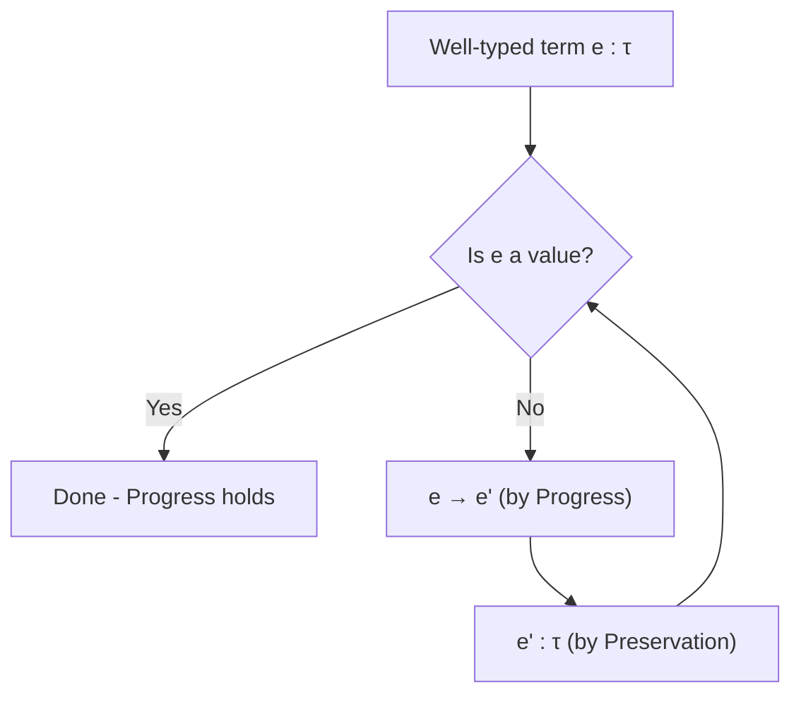

# Formal Semantics

Formal semantics give **mathematically precise definitions** of what programming language constructs mean. They are the foundation for proving compiler correctness, type soundness, and language equivalence. Every senior language-design or compiler role expects familiarity with at least one style.

## Why Formal Semantics Matter

Without formal semantics, language specifications are prose documents subject to interpretation. The C and C++ standards use informal English, leading to years of debate about undefined behavior. In contrast, the Rust reference and the JavaScript specification (ECMA-262) incorporate formal and semi-formal machinery. Formal semantics let you:

- **Prove type soundness** — "well-typed programs don't go wrong" (Milner, 1978).
- **Prove compiler correctness** — the source-level semantics are preserved by compilation (CompCert uses Coq for this).
- **Reason about concurrency** — operational semantics model interleaving explicitly.

> **Interview Angle**: "Can you explain what 'well-typed programs don't go wrong' means formally?" Answer: the type soundness theorem, proved via the progress and preservation lemmas (see below).

## Three Major Approaches

| Style | Answers | Key Idea | Used In |
|-------|---------|----------|--------|
| **Operational** | *How does evaluation proceed step by step?* | Rewrite rules on program syntax | SML, Rust (MIR), V8 (Ignition bytecode) |
| **Denotational** | *What mathematical object does this program denote?* | Meaning is a function in some domain | Haskell (denoted as sets, domains), HOL |
| **Axiomatic** | *What properties hold before/after execution?* | Hoare triples {P} e {Q} | Dafny, verification tools (Frama-C, Boogie) |

### Choosing an Approach

- **Operational semantics** are most common in PL research because they closely mirror how interpreters actually work. They compose well with type systems.
- **Denotational semantics** excel when reasoning about equivalence (e.g., two programs compute the same function) and for recursive/continuous behaviors (fixed-point theory).
- **Axiomatic semantics** are the backbone of program verification — you specify *what* a function does, not *how*.

## Operational Semantics

Operational semantics define program meaning via **transition rules** that rewrite program configurations. A configuration is typically a pair `(state, expression)` or `(environment, expression)`.

### Small-Step (Structural) Semantics

Small-step semantics reduce a program **one step at a time**:

```
  (λx. e) v  →β  e[x := v]          (β-reduction)

  e₁ → e₁'
  ───────────────  (E-AppLeft)
  e₁ e₂ → e₁' e₂

  e₁ → e₁'
  ───────────────  (E-AppRight)
  v e₂ → v e₂'

  e₂ → e₂'
  ───────────────  (E-App)
  v e₂ → v e₂'
```

The reduction relation `→` is the **smallest relation closed under** these rules. Evaluation is the reflexive-transitive closure: `e →* v` means `e` reduces to a value `v` in zero or more steps.

Small-step semantics are ideal for reasoning about **concurrency** — you can interleave steps from multiple threads by taking a non-deterministic choice of which rule fires next.

### Big-Step (Natural) Semantics

Big-step semantics judge `e ⇓ v` — "expression `e` evaluates to value `v`":

```
  ───────────────  (B-Value)
  v ⇓ v

  e₁ ⇓ (λx. e)    e₂ ⇓ v₂    e[x:=v₂] ⇓ v
  ──────────────────────────────────────────  (B-App)
  e₁ e₂ ⇓ v
```

Big-step semantics are simpler to read and closely mirror recursive evaluation in an interpreter. However, they cannot directly express **intermediate states**, making them weaker for concurrent reasoning.

### Small-Step vs Big-Step

| Criterion | Small-Step | Big-Step |
|-----------|-----------|----------|
| **Granularity** | One reduction at a time | Full evaluation at once |
| **Concurrency** | Natural interleaving | Difficult to express |
| **Non-termination** | Infinite reduction sequence exists | No judgment exists (stuck) |
| **Implementation** | CEK machine, abstract machine | Recursive interpreter |

## Denotational Semantics

Denotational semantics map each syntactic construct to an element of a **mathematical domain**. The core insight: programs are functions, and their meaning is the function they compute.

For a simply-typed λ-calculus:

```
⟦λx:τ. e⟧  =  λv ∈ ⟦τ⟧. ⟦e⟧(x := v)
⟦e₁ e₂⟧  =  ⟦e₁⟧(⟦e₂⟧)
⟦n⟧       =  n
⟦e₁ + e₂⟧ = ⟦e₁⟧ + ⟦e₂⟧
```

Recursive definitions require **fixed points**. For a recursive function `fix f. λx. e`, the denotation is the least fixed point `μf. ⟦λx. e⟧` in a domain ordered by information content (Scott domains). This elegantly handles non-termination: `⊥` (bottom) represents divergence.

### Compositionality

The defining property of denotational semantics is **compositionality**: the meaning of a compound expression is determined solely by the meanings of its subexpressions. This enables equational reasoning:

```
If ⟦e₁⟧ = ⟦e₂⟧, then ⟦C[e₁]⟧ = ⟦C[e₂]⟧  for any context C[ ].
```

This is why Haskell programmers can substitute equals for equals — the language has (nearly) denotational semantics.

## Axiomatic Semantics (Hoare Logic)

Hoare logic reasons about programs via **Hoare triples** `{P} c {Q}`: if precondition `P` holds before command `c`, then postcondition `Q` holds after.

### Core Rules

```
  {P} skip {P}                          (Skip)

  {P[e/x]} x := e {P}                  (Assign)

  {P} c₁ {R}    {R} c₂ {Q}             (Seq)
  ─────────────────────────────
  {P} c₁; c₂ {Q}

  {P ∧ b} c₁ {Q}    {P ∧ ¬b} c₂ {Q}   (If)
  ─────────────────────────────────
  {P} if b then c₁ else c₂ {Q}

  {P ∧ b} c {P}                        (While)
  ─────────────────────────
  {P} while b do c {P ∧ ¬b}
```

The **loop rule** is the hardest: the precondition `P` must be a **loop invariant** — true before, during, and after each iteration. Finding loop invariants is the central skill in Hoare-style verification.

### Real-World Verification

- **CompCert** (Leroy, 2006): A verified C compiler proven correct in Coq using operational semantics. The theorem states: the generated assembly code refines the source C semantics.
- **Dafny**: Uses Hoare-style verification with SMT solvers (Boogie/Z3) behind the scenes.
- **seL4 microkernel**: Verified using Isabelle/HOL, proving functional correctness of the kernel implementation.

> **Interview Angle**: "What's the difference between partial and total correctness?" Partial correctness says if the program terminates, the postcondition holds. Total correctness additionally requires termination. The Hoare rules above prove partial correctness; you need a variant/measure function for total correctness.

## Type Soundness

Type soundness is the central theorem of type systems: **well-typed programs cannot 'go wrong'** — they never produce a runtime type error. Formally, this is proved via two lemmas.

### Progress Theorem

> If `⊢ e : τ`, then either `e` is a value or there exists `e'` such that `e → e'`.

**Intuition**: A well-typed expression is never stuck. If it's not done (a value), it can always take a step. This rules out runtime errors like applying a non-function or adding a string to an integer.

### Preservation Theorem (Subject Reduction)

> If `Γ ⊢ e : τ` and `e → e'`, then `Γ ⊢ e' : τ`.

**Intuition**: Evaluation preserves types. If you start with a well-typed term, every intermediate state during evaluation is also well-typed.

### The Proof Structure (Sketch)

Both proofs proceed by **induction on the typing derivation** (for progress) or **induction on the evaluation derivation** (for preservation):

1. **Progress**: Case-analyze the typing judgment. For `λx.e` it's a value (done). For `e₁ e₂`, by inversion, `e₁` must have an arrow type. By progress on `e₁`, either it's a λ (apply the β-rule) or it steps (congruence).

2. **Preservation**: Case-analyze the evaluation rule. The critical case is β-reduction: `e[x:=v]` must have the same type as `e` under the extended environment.



### Soundness in Practice

- **Java**: The JVM bytecode verifier enforces a type soundness property — loaded bytecode is checked before execution. The original JVM had type-safety bugs (found by findbugs); modern JVMs use a stronger verifier.
- **Rust**: The borrow checker ensures memory safety at compile time — a form of type soundness where the 'wrong' behavior is data races and use-after-free, not just type errors.
- **JavaScript**: *Not* type-sound. `null.toString()` throws at runtime despite the language having types. TypeScript adds a soundness layer but with explicit `any` escape hatches.

> **Interview Angle**: "Is TypeScript type-sound?" Technically no — `any` breaks soundness, and structural compatibility means you can unsafely widen types. However, strict mode (`noUncheckedIndexedAccess`, `strictNullChecks`) eliminates many common soundness holes. The TypeScript team deliberately chose pragmatic unsoundness over completeness.

## Summary

| Concept | Key Idea | Why It Matters |
|---------|----------|----------------|
| Small-step semantics | One reduction at a time | Models concurrency, non-termination |
| Big-step semantics | Full evaluation judgment | Matches interpreter structure |
| Denotational semantics | Programs as mathematical functions | Enables equational reasoning |
| Axiomatic semantics | Hoare triples, invariants | Foundation of program verification |
| Type soundness | Progress + Preservation | Proves well-typed programs are safe |
| CompCert | Verified compiler in Coq | Industry proof that formal methods scale |

## References

- G. D. Plotkin, *A Structural Approach to Operational Semantics* (1981/2004)
- B. C. Pierce, *Types and Programming Languages* (TAPL), Chapters 3, 9, 11
- X. Leroy, *A Formally Verified Compiler Back-end* (Compcert, 2006)
- A. W. Appel, *Modern Compiler Implementation in ML*, Chapter 5
