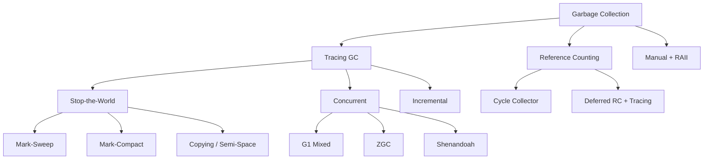

# Garbage Collection

Garbage collection (GC) automatically reclaims memory that the program can no longer reach. It is the memory management backbone of Java, C#, JavaScript, Python, Go, and most high-productivity languages. GC design involves fundamental tradeoffs between **throughput**, **latency**, **memory overhead**, and **implementation complexity**.

## GC Design Space



| Dimension | Options | Tradeoff |
|-----------|---------|----------|
| **Algorithm** | Mark-sweep, Mark-compact, Copying, Reference counting | Throughput vs. fragmentation vs. overhead |
| **Generations** | Single, 2-gen, 3+ gen | Young GC cost vs. tenuring overhead |
| **Concurrency** | STW, Incremental, Concurrent | Latency vs. complexity vs. throughput |
| **Compaction** | None, Partial, Full | Fragmentation vs. pause time |
| **Region size** | Fixed, Dynamic, Adaptive | Memory usage vs. GC frequency |

## Tracing Garbage Collection

Tracing GCs determine liveness by **tracing the object graph** from roots (stack, globals, registers). Any object not reachable from a root is garbage.

### Mark-Sweep

1. **Mark phase**: Traverse from roots, set `marked` flag on reachable objects (DFS/BFS).
2. **Sweep phase**: Scan the heap linearly; free any object without the `marked` flag.

Pro: No copying, objects don't move. Con: **Fragmentation** — freed slots may be too small for new allocations. Used in: early Go runtime (before 1.3), CPython.

### Mark-Compact

After marking, **slide live objects** to one end of the heap, eliminating fragmentation and enabling **bump-pointer allocation** for the next cycle. Used in: **HotSpot CMS** (Serial/Parallel Old collectors).

### Copying Collector (Semi-Space)

Heap is split into two semi-spaces (from-space, to-space). Allocation always happens in from-space via bump pointer. On GC:

1. Copy live objects from from-space to to-space (with forwarding pointers).
2. Swap from-space and to-space.

Pro: No fragmentation, allocation is O(1) bump pointer. Con: **50% heap waste** (only one semi-space usable). Used in: **HotSpot Serial/Parallel Scavenge** (young generation), **V8** (minor GC).

## Generational Collection

The **generational hypothesis**: most objects die young. Empirically, >90% of allocated objects become unreachable before the next GC. Generational GCs exploit this by dividing the heap:

- **Young generation (nursery/eden)**: Small, collected frequently. Uses a fast copying collector.
- **Old generation (tenured)**: Large, collected infrequently. Objects that survive N young GCs are "promoted" (tenured).

```
HotSpot Heap Layout:
┌────────────────────────────────────────────────────┐
│  Young Generation                                   │
│  ┌──────────┬──────────────┬────────────────────┐  │
│  │  Eden    │ Survivor 0   │ Survivor 1         │  │
│  │ (alloc)  │ (copy from)  │ (copy to)          │  │
│  └──────────┴──────────────┴────────────────────┘  │
├────────────────────────────────────────────────────┤
│  Old Generation (tenured)                          │
│  ┌──────────────────────────────────────────────┐  │
│  │  Mark-Sweep-Compact                          │  │
│  └──────────────────────────────────────────────┘  │
└────────────────────────────────────────────────────┘
```

**Challenge**: Young GC must scan old-gen objects that point to young-gen objects (cross-generational pointers). Solutions: **card tables** (HotSpot: 512-byte cards, dirty bit per card) and **remembered sets** (per-region pointer tracking).

## G1 Garbage Collector (HotSpot)

G1 divides the heap into **equal-sized regions** (typically 1–32 MB). Each region can be eden, survivor, old, or humongous (objects > region size). G1 is the default in HotSpot since Java 9.

### How G1 Works

1. **Mixed GC**: Instead of a full old-gen collection, G1 selects a set of regions with the **most garbage** (highest reclamation efficiency). Collects eden + selected old regions.
2. **Concurrent marking**: Background threads mark old-gen objects concurrently with mutator threads, using snapshot-at-the-beginning (SATB) write barriers.
3. **Compaction**: G1 compacts by copying live objects out of selected regions, leaving empty regions for reuse.

### SATB Write Barriers

Every reference write executes a pre-barrier that records the **old value** before the write. This ensures the concurrent marker sees a consistent snapshot of the heap at GC start.

> **Interview Angle**: "What's the difference between G1 and CMS?" CMS (Concurrent Mark-Sweep) runs marking concurrently but does not compact, leading to fragmentation over time. G1 compacts incrementally and targets **pause-time goals** (`-XX:MaxGCPauseMillis=200`), selecting regions to reclaim based on a cost model.

## ZGC

ZGC (Z Garbage Collector, shipped in JDK 15) is a **concurrent, region-based, compacting collector** designed for **sub-millisecond pauses** regardless of heap size (tested up to 16 TB).

### Key Innovations

- **Colored pointers**: ZGC uses 64-bit pointers where the top 16 bits (on 64-bit platforms with virtual address space) encode metadata: mark state (3 bits), remapped/finalizable flags. This eliminates the need for separate mark bitmaps.
- **Load barriers**: Instead of write barriers (like G1/CMS), ZGC uses **load barriers** on every reference read. If the loaded pointer's color indicates it's stale (the object was moved), the barrier self-heals by updating the pointer to the new location. This enables **concurrent compaction** without stopping mutators.
- **Concurrent compaction**: Objects are moved while the application runs. Load barriers transparently fix stale references.

```
ZGC Pointer Layout (64-bit):
┌────────────┬──────┬───┬───┬───┬──────────────────┐
│  Unused    │Meta0│M1│F  │Rem│  Address (42-bit) │
│  (16 bits) │(1bit)│(1)│(1)│(1)│                    │
└────────────┴──────┴───┴───┴───┴──────────────────┘

M1/F/Rem: Mark bits and remapping flag
```

Tradeoff: Load barriers on every pointer read add overhead (~5–15% throughput reduction vs. G1), but pauses are truly sub-millisecond.

## Shenandoah

Shenandoah (Red Hat, JDK 12+) is another concurrent compacting collector, competing with ZGC. Key difference: Shenandoah uses **Brooks pointers** (indirection via an extra word per object) instead of colored pointers.

- Each object has a **forwarding pointer word** at a fixed offset.
- Concurrent compaction copies objects and updates the forwarding pointer.
- Mutator reads go through the forwarding pointer (indirection).
- No colored-pointer dependency on 64-bit address space.

Shenandoah's performance is comparable to ZGC with slightly different tradeoffs: Brooks pointers add per-object overhead but work on any platform.

## Reference Counting

Reference counting (RC) maintains a **counter per object** incremented on reference creation, decremented on destruction. When the counter hits zero, the object is freed.

| Aspect | Tracing GC | Reference Counting |
|--------|-----------|-------------------|
| **Latency** | Bounded (concurrent) or unbounded (STW) | Bounded per-release |
| **Throughput** | Better (batch free) | Worse (per-op overhead) |
| **Cycles** | Handles naturally | Cannot detect cycles |
| **Memory** | May use more (floating garbage) | Precise, prompt free |
| **Locality** | Compaction possible | No compaction |

**Cycle collection**: Pure RC cannot free cyclic structures (A→B→A). Solutions: **trial deletion** (Python's `gc` module), **Bacon's cycle detection** (used in Swift/ObjC ARC). Swift uses ARC with a cycle collector that identifies strongly-connected components of garbage.

## Escape Analysis and Scalar Replacement

**Escape analysis** determines whether a heap-allocated object is visible ("escapes") beyond the allocating method. If an object does not escape, it can be:

1. **Stack-allocated** instead of heap-allocated (eliminates GC pressure entirely).
2. **Scalar-replaced**: the object's fields are broken into individual scalar variables, enabling further optimizations.

```java
// Object 'p' does not escape this method
public int sum() {
    Point p = new Point(1, 2);  // can be scalar-replaced
    return p.x + p.y;
}
// After scalar replacement:
public int sum() {
    int x = 1;  // no allocation!
    int y = 2;
    return x + y;
}
```

HotSpot performs escape analysis in C2 (the optimizing compiler). It uses a **connection graph** tracking: which objects are allocated, which pointers escape through returns/parameters/stores, and which fields are accessed. If the analysis proves no escape, the allocation is eliminated entirely.

V8 performs escape analysis in TurboFan. Go's compiler does escape analysis at the SSA level to decide stack vs. heap allocation — the key optimization that makes Go competitive with languages that have manual memory management.

> **Interview Angle**: "How does Go avoid GC pressure for short-lived objects?" Go's escape analysis runs at compile time. Objects whose addresses don't escape the function are stack-allocated. This is why `var buf [1024]byte` in a function doesn't trigger GC — it's on the stack. The compiler flag `-gcflags='-m'` shows escape analysis decisions.

## Comparison of Production GCs

| Collector | Pause Target | Compaction | Heap Size | Language/VM |
|-----------|-------------|------------|-----------|-------------|
| **Serial** | Full STW | Yes | Small | HotSpot (embedded) |
| **Parallel** | Full STW, shorter | Yes | Medium | HotSpot (throughput) |
| **G1** | Target (default 200ms) | Partial/Incremental | Large | HotSpot (default since JDK 9) |
| **ZGC** | <1ms | Concurrent | Up to 16 TB | HotSpot (JDK 15+) |
| **Shenandoah** | <1ms | Concurrent | Large | HotSpot (JDK 12+) |
| **Go** | <500µs (concurrent) | None | Medium | Go runtime |
| **V8** | Minor: <1ms, Major: varies | Concurrent (Orinoco) | Varies | Chrome/Node.js |
| **.NET** | Workstation/Server modes | Concurrent (Background GC) | Varies | .NET CLR |

## References

- R. Jones & R. Lins, *Garbage Collection: Algorithms for Automatic Dynamic Memory Management* (1996)
- E. Dijkstra et al., "On-the-Fly Garbage Collection: An Exercise in Cooperation" (1978)
- OpenJDK ZGC design: <https://wiki.openjdk.org/display/zgc>
- S. Karlsson, *The JRockit JVM: Generational Garbage Collection* (various papers)
- J. Shin, "Escape Analysis for Java" (HotSpot/C2 internals)