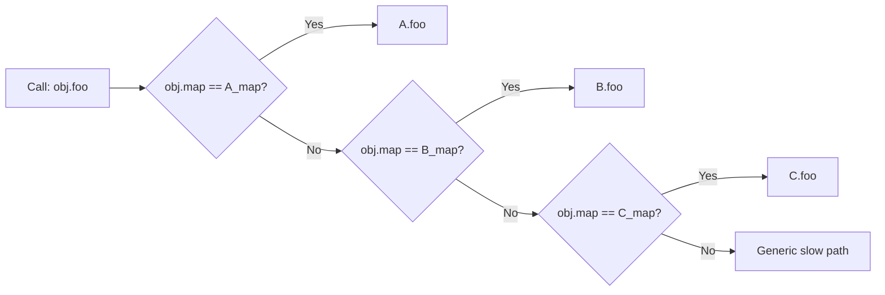

# JIT Optimization

JIT (Just-In-Time) compilation achieves near-native performance by compiling bytecode to machine code **at runtime**, guided by actual execution profiles. This chapter covers the key optimization techniques that make V8, the JVM, and SpiderMonkey fast.

## Devirtualization

**Devirtualization** resolves virtual/interface method calls to direct (monomorphic) calls when the receiver's concrete type is known. This is critical in OOP-heavy code where virtual dispatch is the norm.

```java
// Before: virtual dispatch
interface Shape { double area(); }
class Circle implements Shape { double area() { return Math.PI * r * r; } }

void printArea(Shape s) {
    System.out.println(s.area());  // virtual call
}

// After devirtualization (if type is known to be Circle):
void printArea(Shape s) {
    System.out.println(((Circle)s).area());  // direct call, inlinable
}
```

**Class Hierarchy Analysis (CHA)**: If the compiler can prove that `Shape` has only one implementation (`Circle`), the call is **monomorphic** and can be devirtualized. If there are exactly two implementations, it can emit a **bimorphic** guard chain. Beyond that, it falls back to a virtual dispatch table.

C2 (HotSpot's optimizing JIT) uses CHA extensively. The `-XX:+PrintInlining` flag shows which calls are inlined vs. too polymorphic.

## Inline Caches

### Monomorphic Inline Cache

An **inline cache (IC)** is a form of runtime memoization for dynamic dispatch. At each call site, the engine remembers the **last receiver type** and stores the corresponding method pointer.

```
// V8-style inline cache (monomorphic)
// Call site: obj.foo()
//
// Before first call:  [generic_call_stub]
// After 1st call (obj = A):  [check obj is A] -> [A.foo code ptr]
// After 2nd call (obj = B):  [check obj is A] -> [A.foo]
//                               [check obj is B] -> [B.foo]
//                               [generic_call_stub]  (fallback)
```

### Polymorphic Inline Caches (PIC)

When a call site sees multiple receiver types, the IC grows into a **linear chain** of type checks (up to 4–8 entries in V8, known as a "megamorphic" state). Each check is a fast pointer comparison against a hidden class (map) or class pointer.



**Performance impact**: Monomorphic ICs add only 1–2 nanoseconds overhead over a direct call. Polymorphic ICs add ~1ns per entry. Megamorphic sites (too many types) fall back to full dictionary lookup.

> **Interview Angle**: "Why does V8 use hidden classes?" JavaScript objects are dynamically extensible dictionaries. To enable ICs, V8 assigns each object a **hidden class (Map)** — a compact representation of its current shape (property names and offsets). Objects with the same property layout share a Map. ICs check the Map pointer, enabling fast method lookup.

## Hidden Classes (V8 Maps)

V8's hidden class system tracks the **shape** of every JavaScript object:

```
let o1 = { x: 1, y: 2 };  // Map: {x: offset 0, y: offset 1}
let o2 = { x: 3, y: 4 };  // Same Map as o1!
let o3 = { y: 5, x: 6 };  // DIFFERENT Map (different property order!)

o1.z = 7;  // o1 transitions to a new Map: {x:0, y:1, z:2}
// o2 still has the old Map
```

Property access compiles to: `load [obj.map] -> check expected map -> load [obj + field_offset]`. This is as fast as C struct field access after the first call warms up the IC.

**Pitfall**: Adding properties in different orders creates different hidden classes, degrading IC hit rates. This is why performance-sensitive JS code should construct objects in a consistent order.

## Tiered Compilation

Modern JITs use **multiple compilation tiers**, starting with fast (unoptimized) interpretation and progressively compiling hot code.

```
HotSpot Tiered Compilation:
┌─────────────────────────────────────────────────────┐
│ Tier 0: Interpreter (C1X) — Fast startup, no opt   │
│ Tier 1: C1 (client compiler) — Simple opts, fast    │
│ Tier 2: C1 + profiling                             │
│ Tier 3: C2 (server compiler) — Aggressive opts     │
│ Tier 4: Graal (optional) — JIT-compiled JIT        │
└─────────────────────────────────────────────────────┘

V8 Pipeline:
┌─────────────────────────────────────────────────────┐
│ Ignition (bytecode interpreter) with profiling      │
│         ↓ (hot loop/function detected)              │
│ Sparkplug (baseline JIT, no optimization)           │
│         ↓ (very hot)                                │
│ Maglev (mid-tier JIT with some opts)                │
│         ↓ (extremely hot)                           │
│ TurboFan (optimizing JIT, full opts)                │
└─────────────────────────────────────────────────────┘
```

Each tier adds compilation time but produces faster code. The **invocation counter** and **back-edge counter** track hotness. When counters exceed thresholds, the code is compiled at the next tier.

## Speculative Optimization and Deoptimization

### Speculative Optimization

JITs speculatively assume properties that are *usually* true:

- "This variable is always a `Smi` (small integer)."
- "This array is always packed (no holes)."
- "This call site is always monomorphic (one receiver type)."

Speculative optimizations produce **guarded code** — fast path for the common case, with guards that trigger deoptimization if the assumption is violated.

```x86asm
; Speculative integer addition (V8 TurboFan)
; Assumption: both operands are Smis
    cmp [rax + kTagOffset], kSmiTag
    jne deoptimize              ; guard: is rax a Smi?
    cmp [rbx + kTagOffset], kSmiTag
    jne deoptimize              ; guard: is rbx a Smi?
    add rax, rbx                ; fast path: direct integer add
    ; ... continue
```

### Deoptimization

When a guard fails, the JIT must **deoptimize**: abandon the compiled code, reconstruct the interpreter frame state (stack, registers), and continue in the interpreter. This requires the JIT to save enough information to reconstruct any possible interpreter state.

**Deoptimization in HotSpot**: C2 records an **interpreter frame state** at every safepoint (potential deopt point). On deopt:
1. Unwind the C2 frame to find the relevant state.
2. Convert optimized values back to interpreter values (e.g., unbox an `int` stored in a register back to an `Integer` object).
3. Resume in the interpreter at the correct bytecode index.

**Deoptimization in V8**: TurboFan records a **deoptimization info** table mapping each deopt point to the bytecode offset and the register/stack slot layout of each live value. Deopt is ~1–5µs — fast enough to be invisible for rare events.

> **Interview Angle**: "What happens when V8's optimized code is invalidated?" (e.g., prototype chain change). The optimized code is marked as "deoptimized." The next time the function is called, it enters the deoptimization path: the interpreter frame is reconstructed from the metadata embedded in the compiled code, and execution continues in Ignition. Future calls re-enter the tiered pipeline from scratch.

## Register Allocation

Register allocation maps infinite virtual registers (SSA values) to a finite set of physical CPU registers. This is the most important optimization for generated code quality.

### Graph Coloring (Chaitin-Briggs)

Model the problem as a **graph coloring**: build an **interference graph** where nodes = virtual registers, edges = simultaneous liveness (two values live at the same time cannot share a register). Color with K colors (K = number of physical registers).

```
Algorithm (Chaitin 1981, Briggs 1992):
1. Build interference graph from liveness analysis.
2. Simplify: Remove nodes with degree < K, push onto stack.
3. Spill: If all remaining nodes have degree >= K,
   choose a node (heuristic: highest degree or most live ranges),
   push it as a potential spill.
4. Select: Pop nodes, assign colors greedily.
   Spilled nodes get stack slots.
5. Rewrite: Insert load/store for spilled variables,
   rebuild graph, repeat until no spills.
```

### Linear Scan

Linear scan is a **faster but lower-quality** alternative: process virtual registers in order of their first definition, assigning the first available register. If none available, spill the register whose next use is furthest in the future.

| Aspect | Graph Coloring | Linear Scan |
|--------|---------------|-------------|
| **Quality** | Near-optimal | Good (within 10–15%) |
| **Complexity** | O(n²) to O(n²·log n) | O(n log n) |
| **Used in** | GCC (RA), LLVM (Greedy/RegAllocBase) | HotSpot C1, early V8 |
| **Live range splitting** | Yes (split before coloring) | Limited |

LLVM's default register allocator is **Greedy** (a hybrid of graph coloring with priority-based spilling).

## SSA Construction and Destruction

### SSA Construction (Dominance Frontier)

1. Insert **φ-nodes** at dominance frontiers of variable definitions.
2. Rename variables to create SSA form (each variable defined exactly once).

```
// Before SSA:
x = 1
if (cond) x = 2
print(x)  // x could be 1 or 2

// After SSA:
x1 = 1
if (cond) goto L2 else goto L3
L2: x2 = 2; goto L4
L3: x3 = x1; goto L4
L4: x4 = φ(x2, x3)  // x4 = x2 from L2, x3 from L3
print(x4)
```

### SSA Destruction

Real hardware has no φ-nodes. SSA destruction converts φ-nodes into parallel copy (move) instructions:

```
// At join point L4:
// x4 = φ(x2, x3) becomes:
if (came from L2) t = x2 else t = x3
x = t
```

LLVM's `PHIElimination` and `TwoAddressInstruction` passes handle this. The challenge is avoiding **swap conflicts** when multiple φ-nodes reference each other.

## References
- H. Aycock, *A Brief History of Just-In-Time* (ACM Queue, 2003)
- T. A. C. B. et al., *V8 TurboFan JIT Compiler* (various V8 blog posts)
- C. Click & G. Tene, *The Java HotSpot Performance Engine Architecture* (various)
- G. Chaitin, *Register Allocation & Spilling via Graph Coloring* (1982)
- K. D. Cooper et al., *Linear Scan Register Allocation* (2001)
- R. Cytron et al., *An Efficient Method of Computing Static Single Assignment Form* (1991)