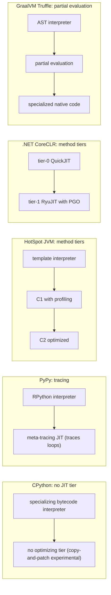
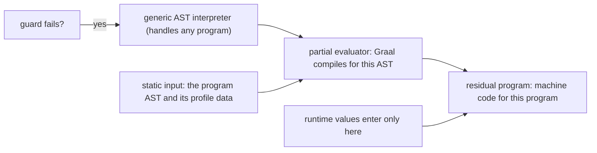

# Managed Runtimes Beyond the JVM: PyPy, GraalVM, LuaJIT, .NET

## Overview

The JVM is one point in a design space of managed runtimes, not the definition of one. Every production runtime must solve the same three problems — execute dynamic or high-level code cheaply, decide when optimization is worth paying for, and recover memory automatically — but the answers differ in instructive ways: PyPy generates its JIT compiler *from* an interpreter, GraalVM specializes AST interpreters into native code by partial evaluation, LuaJIT traces loops with a hand-written assembly interpreter as its floor, and .NET runs a two-tier method JIT with profile-guided recompilation. This page maps that space and the distinctive compiler trick of each runtime, using the JVM as the anchor point: [HotSpot Internals](../../languages/java/hotspot-internals.md) covers the C1/C2 engine room, [JIT Optimization](./jit-optimization.md) the shared optimization vocabulary (inline caches, speculation, deopt), and [Deoptimization and OSR](./deoptimization-osr.md) the tier-crossing machinery all of these runtimes reinvent. Interviewers use these systems as contrast material — "how would PyPy's designers answer HotSpot's hardest questions?" is a real senior-runtime question.

## The Design-Space Axes

Before comparing runtimes, fix the axes. The words "interpreter" and "JIT" hide at least four independent design decisions, and most interview confusion comes from collapsing them. A useful anchor: CPython's switch loop costs roughly 30-100 cycles per bytecode depending on opcode, a template interpreter like HotSpot's lands nearer 10-30, and a specialized inline cache can reach single-digit cycles — those three numbers alone explain why "add a JIT" is never the first optimization a runtime team reaches for, and why interpreter engineering (specialization, quickening) has become fashionable again. The axes below are also the vocabulary for the comparison table at the end of this page, where each runtime is placed on all of them at once.

| Axis | Options in production | Why the choice matters |
|------|----------------------|------------------------|
| Execution base | interpreter-only, interpreter + JIT, pure AOT | Determines startup cost, peak throughput, and whether a warmup curve exists at all |
| Interpreter technology | switch dispatch loop, direct-threaded labels, hand-written assembly templates, bytecode-specializing adaptive interpreter | The interpreter is the floor all optimizations must beat and the fallback every deopt lands in |
| Unit of compilation | tracing (hot loops), method/AST (whole functions) | Traces are linear and inline-friendly; methods preserve call structure but need inlining heuristics |
| Optimization trigger | counters + thresholds (dynamic), profile-guided recompilation, compile-time specialization | Decides warmup time and whether the compiler sees real types or guesses |
| Speculation | guarded fast paths with deoptimization vs. no speculation | Deopt machinery is expensive to build; skipping it caps peak performance |
| AOT story | none, publish-time AOT with JIT fallback, closed-world AOT | Startup vs. peak vs. dynamism trade-off, made explicit |

Placing the runtimes on these axes:

| Runtime | Base interpreter | JIT style | Speculation + deopt | AOT story |
|---------|-----------------|-----------|---------------------|-----------|
| CPython | switch loop, specializing-adaptive since 3.11 | experimental copy-and-patch JIT (3.13+) | no | none |
| PyPy | its own RPython bytecode interpreter | meta-tracing, generated | yes | none (experimental attempts only) |
| HotSpot JVM | template interpreter in assembly | tiered C1 with profiling, then C2 | yes | none standard (CRaC/leyden research) |
| GraalVM Truffle | AST interpreter per language | partial evaluation to compiled code | yes, via PE guards | Native Image (closed world) |
| LuaJIT | hand-written assembly interpreter | tracing, single tier | yes (NYI exits, side traces) | none |
| .NET CoreCLR | none — tier-0 QuickJIT is the floor | tier-0 quick, tier-1 RyuJIT with dynamic PGO | yes | ReadyToRun, NativeAOT |
| Wasmtime/Cranelift | none — functions compile on instantiation | single-tier, no speculation | no | wasmtime AOT of wasm modules |

The last row is the control group: Cranelift (see [Cranelift](./cranelift.md)) deliberately drops speculation and tiering to get predictable microsecond-level compilation, which is the right choice for a wasm runtime and the wrong one for a 24/7 Java service. Every other entry in the table is buying peak throughput with runtime complexity.

One more axis deserves its own table because it is where most of the recent innovation has actually happened — the interpreter's inner loop:

| Interpreter style | How dispatch works | Who uses it | Cost per bytecode |
|-------------------|--------------------|-------------|-------------------|
| Switch loop | `switch(opcode)` in C | classic CPython, Lua 5.1 | 30-100 cycles; branch mispredicts dominate |
| Direct-threaded | code labels stored in bytecode, `goto *op` | CPython (historically), Ruby | fewer indirect branches than switch |
| Template / asm interpreter | each bytecode is a hand-written assembly stub, copied and jumped to | HotSpot, LuaJIT | 10-30 cycles; dispatch fused into the stub |
| Specializing adaptive | interpreter rewrites hot bytecodes into specialized, cache-carrying variants | CPython 3.11+ (PEP 659), V8's Ignition feedback | cold opcodes pay more; hot ones approach JIT paths |
| Copy-and-patch JIT | pre-compiled machine-code "stencils" patched and linked per bytecode | CPython 3.13+ (experimental) | interpreter-adjacent compile cost, near-template speed |

Note the convergence: the modern "interpreter" is already a lazy compiler. Specializing interpreters and copy-and-patch JITs blurred the interpreter/JIT boundary so thoroughly that the sharper interview question is no longer "does it have a JIT?" but "at what point does execution stop being general and start being specialized for this program?"

## PyPy: The Meta-Tracing JIT

PyPy's headline idea is **meta-tracing**: you write an interpreter for your language in RPython (a restricted, statically typed subset of Python), and a JIT *generator* produces a trace compiler for that interpreter automatically. You never write a compiler backend. The generator observes the interpreter running a hot user loop and records the sequence of interpreter operations as a linear trace, treating the interpreter's own control flow as the thing to optimize away. This is the "automatic JIT generation" idea taken to production: the interpreter is the specification, the JIT is derived from it.

The mechanics: interpreted execution runs first, loop-back edges increment counters, and above a threshold (`--jit function_threshold` by default) recording begins — the JIT follows one execution path through the *interpreter*, emitting a flat op sequence, and re-enters interpreted mode at `--jit trace_eagerness` boundaries to guard against branches the trace did not cover. Recorded traces pass through an optimizer (constant folding, allocation removal — PyPy is notably good at eliding object allocation because allocation sites are visible in the trace) and land in machine code. Bridges are compiled when a guard fails, which is the same guard-and-bail loop described in [Deoptimization and OSR](./deoptimization-osr.md), just with the trace in place of the method. PyPy exposes JIT hooks (`pypyjit.set_param`, compile/abort hooks) that let you see and even veto trace decisions — a diagnostic surface HotSpot only gained much later with tools like JITWatch.

Three PyPy specifics interview answers should mention:

- **Warmup is real but shallow.** PyPy reaches steady state faster than a cold JVM on typical pure-Python code and reports roughly a 4x geometric-mean speedup over CPython on its benchmark suite. Hot small scripts that never loop past the threshold gain little.
- **GC is a menu, not a default.** Because RPython programs are compiled through the same toolchain, PyPy can swap collectors: Boehm, mark-and-sweep, semispace, generational, hybrid, and the default generational `minimark`. A tracing JIT plus a moving GC must cooperate on object identification in traces — a problem PyPy solved early and documented well.
- **The CPython compatibility layer is the boundary tax.** `cpyext` implements the CPython C API so C extensions run, but every crossing re-materializes PyPy objects as C-level `PyObject*` structures, which is exactly where the speedup evaporates. The PyPy-blessed answer is `cffi`, which keeps calls out of the object model and lets the JIT treat them as opaque function calls.

One practical line on adoption: install PyPy from your package manager or conda-forge, confirm with `pypy -V`, and use it as a drop-in interpreter for pure-Python long-running processes — `pip` inside PyPy installs into PyPy's own site-packages and handles pure-Python wheels fine.

### Warmup, hooks, and seeing the traces

PyPy is unusually generous about letting you watch its JIT work, which makes it the best teaching runtime of the group. Options tune the profiler thresholds (`--jit function_threshold`, `trace_eagerness`, `off` to disable entirely), and hooks registered from Python let a program observe — or abort — individual trace compilations:

```python
import pypyjit

def on_compile(jitdriver_name, looptype, sanitizer, greenkey, asmaddr, asmlen):
    # fires per compiled trace; greenkey names the bytecode position
    print(looptype, pypyjit.get_location(greenkey))

pypyjit.set_compile_hook(on_compile)
```

Because the interpreter is the traced meta-level, the trace records *interpreter* operations, and the optimizer's most valuable pass is allocation removal: object constructions inside the loop whose lifetimes stay local to the trace are eliminated entirely. This is why PyPy benchmarks involving many small objects (parsers, class instances, exceptions-as-control-flow) often beat CPython by more than the dispatch savings alone — the win is not faster interpretation but fewer objects ever existing. The same observation explains PyPy's GC behavior under load: minimizing allocation pressures the collector less than raw speedup numbers suggest.

Why did CPython not adopt the same strategy? Object model and ecosystem, not competence. CPython's C API exposes object internals as part of its public contract; a tracing JIT that elides allocations or boxes lazily breaks every C extension that pokes at `PyTupleObject` directly. CPython instead grew PEP 659's specializing adaptive interpreter (3.11) — inline-cache-like quickening that degrades gracefully — and an experimental copy-and-patch JIT (3.13+) that reuses existing toolchains rather than carrying a backend. The lesson generalizes: a runtime's most binding constraint is usually its ABI, not its compiler technology.



## GraalVM: Partial Evaluation as the Core Trick

GraalVM's Truffle stack inverts PyPy's premise: instead of deriving a JIT from an interpreter definition, you write an **AST interpreter** in Java following Truffle's DSL rules, and the Graal compiler **partially evaluates** that interpreter for a given AST — the program is the static input, runtime values are the dynamic inputs, and the result is compiled code with the interpretive overhead evaluated away. This is the first Futamura projection running in production; the formal background lives in [Partial Evaluation & MLIR](../partial-evaluation-mlir.md). The interpreter must cooperate: nodes carry profiling state (polymorphic inline caches as data), rewrite themselves into specialized versions once types stabilize, and mark control flow so the evaluator knows where speculation guards belong. Languages shipped on Truffle include GraalJS, GraalPy, TruffleRuby, FastR, and Sulong — the last executes LLVM bitcode, meaning C/C++ programs can run on the JVM as "just another interpreter to specialize."



Two Truffle properties make this workable where naive PE would blow up:

- **Inlining across language boundaries is free.** Because every language is an AST interpreter in the same JVM heap, a call from JavaScript into Ruby is a node call; after partial evaluation the boundary dissolves, which is the whole pitch of "polyglot, zero-cost interoperability."
- **Deoptimization degrades to interpreter reuse.** A failed guard in specialized code deoptimizes back into the ordinary AST interpreter — the same frame-state discipline as [Deoptimization and OSR](./deoptimization-osr.md), with the AST as the universal fallback. A slow path you already wrote is the fast path's escape hatch.

**Native Image** applies the same compiler to ordinary Java: a closed-world, ahead-of-time build starting from `main`, running reachability analysis, class initialization at build time, and producing a native executable. The catch is the closed-world assumption itself. Reflection, dynamic proxies, JNI, resources, and serialization are all *dynamic* by nature, so they must be declared: `reflect-config.json`, `proxy-config.json`, `jni-config.json`, and `resource-config.json` — the "reachability metadata" that libraries increasingly ship but that historically turned Native Image adoption into metadata archaeology. The recorder agent watches a real execution and emits the configs, which works until a code path the agent never saw runs in production.

| Property | Traditional JIT (C2-class) | Partial evaluation (Truffle) / Native Image |
|----------|---------------------------|---------------------------------------------|
| Code source | bytecode, profiled at runtime | interpreter + AST (PE) or whole program (AOT) |
| Startup | slow (warmup curve) | immediate (no interpreter, no JIT) |
| Peak throughput | highest after warmup | competitive; can trail a fully warmed JIT on long runs |
| Dynamism | class loading and reflection anytime | must be declared up front (closed world) |
| Build cost | none beyond normal compile | minutes of build time, multi-GB build machines, metadata maintenance |
| Failure mode | deopt storms on wrong speculation | missing reachability entry crashes or fails at run time |

## LuaJIT: The Hand-Written Interpreter and Its Trace Compiler

LuaJIT is a design statement about where the performance floor really is. Its interpreter is hand-written assembly for x86/x64 (with ports for other ISAs), not a C switch loop — because the interpreter is the code every trace exit lands in, an interpreter that is 2-3x faster than a naive one moves the whole curve. The same philosophy explains the trace compiler: LuaJIT records hot *loops* (not methods), translating bytecode along one path into a linear IR, then optimizing and emitting code. The bytecode-to-IR mapping is nearly one-to-one precisely because Lua's semantics are compact and the interpreter is explicit about every step — Mike Pall has described the assembly interpreter and the trace compiler as two halves of one design rather than separate components. This is why the interpreter "maps to trace recording": bytecodes are simple register operations with no hidden method-frame machinery, so a trace is just a straight-line bytecode execution with the dispatch removed.

The failure model is the **NYI (not-yet-implemented) exit**. Operations the compiler has not implemented — historically certain standard-library functions and corner cases such as `pairs()` on hash-part tables, `string.gmatch`, and FFI callbacks in some positions — terminate recording and hand execution back to the interpreter. NYI is a deliberate engineering trade: a tracing JIT that tries to compile everything produces either enormous amounts of code or slow traces; LuaJIT compiles the hot 90% and exits cleanly on the rest. Side traces handle branches that diverge from a compiled trace, and trace linking stitches them together. The practical profiling advice for LuaJIT code is therefore "find the NYI exits" — the JIT lets you see exactly where traces abort.

Two more LuaJIT facts belong in every answer:

- **The FFI library is the performance interface.** [The FFI](https://luajit.org/ext_ffi.html) lets you declare C signatures in Lua, pass `cdata` objects, and call into C with no marshalling layer — FFI calls can even be inlined into traces. This is the counterexample to PyPy's `cpyext` problem: instead of making the existing C API fast, LuaJIT made a *better* API fast. The classic [Lua C API](https://luajit.org/luajit.html) stack push/pop style is what you use when embedding, not when you want speed from JIT'd code.
The FFI is also where LuaJIT's design honesty shows: calling through the classic C API from compiled code forces an exit (the API manipulates interpreter-visible stacks), while FFI calls stay in traces. The API you choose determines whether you are writing fast Lua or merely correct Lua:

```lua
local ffi = require("ffi")
ffi.cdef[[ int sha256(const void *in, size_t len, void *out); ]]
local out = ffi.new("uint8_t[?]", 32)
ffi.C.sha256(buf, #buf, out)   -- call compiled into the trace, no marshalling
```

- **The 2.1 maintenance saga is a bus-factor case study.** LuaJIT 2.0 shipped in 2012; 2.1 has been in rolling beta for years; Mike Pall announced his step back from active development in 2015; the GitHub repository is a mirror, not the development tree; and forks (notably OpenResty's) carry platform ports. The code remains superb and fast, but "who can fix this JIT in five years" is exactly the question a staffing review should ask about any single-maintainer dependency. [The project page](https://luajit.org/luajit.html) documents the current state.

## .NET: RyuJIT Tiering and the AOT Spectrum

CoreCLR's execution engine layers cleanly and is the cleanest pedagogical example of method-based tiering:

- **Tier-0 (QuickJIT):** compiles each method fast with no optimization, but instruments branches and calls with profiling counters. Compilation time is microseconds per method, so startup stays interactive while real profiles accumulate.
- **Tier-1 (RyuJIT):** recompiles hot methods with the full optimizer, and — since dynamic PGO was made default in .NET 8 — uses the tier-0 profile for devirtualization and guarded inlining, the same profile-driven speculation loop HotSpot's C1→C2 tiers run (see [JIT Compilation in HotSpot](../../languages/java/jvm-jit.md)).
- **OSR (on-stack replacement):** tier-0 code stuck inside a long loop can be swapped for tier-1 code mid-loop, so cold methods with hot loops still get optimized — the exact OSR mechanics covered in [Deoptimization and OSR](./deoptimization-osr.md).

The AOT spectrum is a first-class part of .NET, not an afterthought. **ReadyToRun** (crossgen2) precompiles IL to native code at publish time with a JIT fallback for anything unverifiable at build time — cutting startup while keeping runtime dynamism. **NativeAOT** goes all the way: closed-world analysis like GraalVM Native Image, no JIT in the binary, with the same reflection-metadata consequences and the same startup/RSS wins. The design space runs from "JIT everything" to "AOT everything," and .NET is the runtime that ships every point on the line as a supported option.

The second .NET distinctive is **language-level stack discipline**. `struct` types, `Span<T>`, and `ref struct` guarantees mean stack allocation and no-heap-escape rules are part of the type system: a `Span` cannot be heap-allocated, cannot be captured by a closure, cannot cross `await`. The JVM equivalent — scalar replacement via escape analysis in C2 — is a best-effort optimization that silently fails; the .NET guarantee is checkable and total for the types that opt in. When an interviewer asks "can the JVM ever match C# on tight loops over buffers?", the honest answer starts with this asymmetry: it is a language design gap, not a JIT tuning gap.

```csharp
static int Sum(ReadOnlySpan<byte> buf)   // ref struct: stack-only by definition
{
    int acc = 0;
    foreach (byte b in buf) acc += b;    // no bounds-check you can fail to elide
    return acc;
}
// Sum(stackalloc byte[64]) allocates zero heap objects; the JVM equivalent
// allocates a byte[] and depends on C2 escape analysis to remove it.
```

The GC side completes the picture: CoreCLR ships workstation and server generational collectors with background collection of the old generation, and the [runtime design docs](https://github.com/dotnet/runtime) under `docs/design/specs/` describe them with unusual candor — including the write-barrier and card-table machinery that generational collection needs, which is the same machinery HotSpot's collectors are built on. Reading .NET and JVM GC documents side by side is the fastest way to see that the two runtimes converged on nearly identical collector designs while their execution engines diverged.

## V8 in One Paragraph

V8 is the managed runtime closest to developers who never chose one: every Node process runs **Ignition**, a register-based bytecode interpreter, then escalates through **Sparkplug** (baseline JIT, near-instant compile, no optimization), **Maglev** (mid-tier with light feedback), and **TurboFan** (the optimizing tier with speculative type feedback) — a four-tier pipeline that is the same idea as .NET's with one more rung. The V8-specific machinery that interviews probe — hidden classes, inline caches, map transitions — is covered in [JIT Optimization](./jit-optimization.md); the tier-crossing and deopt protocol in [Deoptimization and OSR](./deoptimization-osr.md). What V8 adds to this page's comparison is pure throughput pressure: JavaScript's dynamism forced the most sophisticated speculation machinery in the industry, and ideas flowed outward from it into every other runtime's optimizer.

## Side-by-Side Comparison

| Property | HotSpot JVM | .NET CoreCLR | PyPy | LuaJIT | GraalVM Truffle | Wasmtime/Cranelift |
|----------|-------------|--------------|------|--------|-----------------|--------------------|
| Unit compiled | method | method | loop (trace) | loop (trace) | AST (whole program per PE) | wasm function |
| Interpreter | assembly templates | none (tier-0 JIT is floor) | generated RPython VM | hand-written asm | per-language AST interpreter | none |
| Optimizing tier | C2 (or Graal via JVMCI) | RyuJIT + dynamic PGO | meta-trace optimizer | single trace tier | Graal via PE | none (no speculation) |
| Deopt machinery | frame-state metadata | frame-state metadata | guard + bridge | guard + side trace | return to AST interpreter | not needed |
| AOT option | research (Leyden) | ReadyToRun, NativeAOT | none | none | Native Image | wasm AOT by design |
| GC | G1/ZGC/Shenandoah | generational, server mode | minimark (swappable) | incremental, non-moving for objects | JVM GC (Native Image: its own) | none (wasm has no GC; GC proposal separate) |
| Distinctive trick | mature profile-driven speculation | language-level stack discipline | JIT generated from interpreter | asm interpreter + FFI in traces | partial evaluation | compile-speed-first IR (see [Cranelift](./cranelift.md)) |

## What Each Runtime Borrowed From the Others

The cross-pollination is itself interview material because it reveals which ideas are load-bearing.

- **From Self, through the JVM, everywhere:** deoptimization, inline caches, and polymorphic inline caches are Self (1991-1995) ideas that HotSpot industrialized; V8's hidden classes are Self maps renamed. Every runtime on this page uses at least one of them.
- **JVM → .NET:** tiered compilation arrived in .NET Core 3.0 (2019), explicitly modeled on the JVM's interpreter-plus-tiers shape, with OSR and dynamic PGO following in later releases. Conversely .NET's ReadyToRun/NativeAOT breadth pressures the JVM's Project Leyden.
- **PyPy → CPython:** PEP 659's specializing interpreter is PyPy-flavored specialization with the C API constraints respected; the 3.13 copy-and-patch JIT descends from the copy-and-patch compilation technique (Xu & Kjolstad, 2021) rather than from PyPy's tracing, showing the two lineages solve warmup differently.
- **Truffle → the JVM itself:** Graal began as a Java-written JIT competing with C2 under JVMCI and became the substrate for Truffle and Native Image — the runtime's own compiler was refactored into its most strategic asset.
- **LuaJIT → everyone's FFI envy:** LuaJIT's ability to call C from inside compiled traces is the benchmark other runtimes measure foreign-function interfaces against, and the reason `cffi`-style designs (rather than C-API shims) keep winning.

## When "Just Use the Default Runtime" Is Right

Honesty section — each of these runtimes has a case where adopting it is the wrong call, and being able to say so is the difference between an enthusiast and an engineer.

- **PyPy loses in C-extension-heavy code.** NumPy/Pandas workloads spend their time crossing `cpyext`, where PyPy must materialize and re-interpret CPython objects on every call; the 4x pure-Python win can invert into a slowdown. If the program's hot path is inside C extensions you cannot change, CPython plus those extensions is faster and less risky.
- **GraalVM Native Image costs build time and reflective complexity.** You trade minutes of build time, large build machines, and a permanent reachability-metadata maintenance burden for startup and memory. For a long-running server where peak warmed throughput matters and startup happens once a month, Native Image can be net-negative; for serverless, CLIs, and scale-to-zero it is transformative. Choose per workload.
- **LuaJIT's FFI is not the Lua C API.** Code written against the classic `lua_push`/`lua_pop` C API works but stops tracing at those boundaries; the FFI is the fast path. And LuaJIT tracks Lua 5.1 semantics (plus selected 5.2 features), not 5.4 — adopting it for a 5.4-idiomatic codebase is a porting project.
- **The general rule:** default runtimes win on ecosystem, staffing, and boring reliability. A special runtime must win on a metric your workload actually measurably cares about — startup, tail latency, memory ceiling — and you should be able to state that metric and its number before migrating.

## How to Study One of These in an Afternoon

A concrete self-study loop that produces interview-ready depth for any runtime on this page:

1. **Run the slow path.** Execute a small program in the runtime's interpreter-only mode (`--jit off` for PyPy, `-Xint` for the JVM, tier-0 with PGO off for .NET) and record baseline numbers — the interpreter cost is the denominator every claim must beat.
2. **Turn on the fast path and diff.** Enable the JIT, rerun, and capture its view of your program (PyPy hooks, JVM `-XX:+PrintCompilation`/JITWatch, .NET `DOTNET_TieredCompilation` and `dotnet-counters`, LuaJIT `-jv`).
3. **Force a failure.** Trigger deopt or NYI deliberately — change a hot loop's types mid-run, call an NYI function, break a Native Image reflection assumption — and watch the fallback work.
4. **Read one design document.** Each runtime publishes its self-justification (PyPy's architecture docs, the dotnet/runtime `docs/design/` tree, the V8 blog's Ignition/TurboFan posts, Native Image's closed-world docs). One honest design document beats ten blog summaries.

The loop works because every runtime here keeps its slow tier correct and observable; there is always a documented way to stand where the fallback stands.

## Interview Questions

1. **PyPy generates its JIT from an interpreter. What does that actually mean mechanically, and what breaks?**
A Truffle/Graal-style contrast helps. In PyPy, the interpreter written in RPython is traced while it runs the user's hot loop: the JIT records the interpreter's own execution path as a linear op sequence, optimizes away interpreter dispatch and elides allocations, and emits machine code with guards back to the interpreter. What breaks is abstraction leakage: features that make the interpreter's control flow data-dependent (dynamic C-API calls, exotic introspection) produce guards the optimizer cannot see through, and every C-API crossing (`cpyext`) must un-box back to CPython's object layout, erasing the win. The elegance is that adding a language feature to the interpreter automatically adds it to the JIT; the cost is that the JIT's quality is bounded by how uniform the interpreter is.

2. **Explain partial evaluation in Truffle to someone who knows only "JIT means compiling bytecode."**
The Truffle "bytecode" is an AST and the "compiler" is a partial evaluator: the interpreter is written as ordinary Java, and when a function goes hot, Graal compiles the interpreter *for that specific AST*, with the AST constant-folded away and only the runtime values left as inputs. Profiling state in each node (what types have flowed through this node so far) becomes speculation guards in the generated code, and a failed guard deoptimizes back into the very interpreter that was evaluated — so the interpreter is simultaneously the reference implementation and the deopt target. Compared with a bytecode JIT, you get language-agnostic infrastructure (any Truffle language gets the same optimizer) at the price of writing interpreters under strict DSL discipline.

3. **Why did LuaJIT hand-write its interpreter in assembly, and why does that matter for a tracing JIT?**
Because the interpreter is both the baseline and the landing zone: every trace guard failure resumes in interpreter code, so interpreter speed bounds steady-state performance for the non-hot 90% of the program. A hand-written assembly dispatch loop cuts per-bytecode overhead well below a C switch loop. For the trace compiler specifically, the assembly interpreter forces the semantics to be explicit and uniform — each bytecode is a short register-machine operation — which makes bytecode-to-IR translation nearly one-to-one and keeps recording cheap. The cost is maintainability: per-ISA assembly is a main reason LuaJIT's development narrowed to effectively one maintainer.

4. **Compare .NET's tiering with HotSpot's C1/C2. Where are they the same, where do they differ?**
Same shape: a fast low-tier compile that instruments (HotSpot C1-with-profiles, .NET tier-0 QuickJIT), followed by a high-tier optimizing compile driven by that profile (C2, tier-1 RyuJIT with dynamic PGO), plus OSR to rescue hot loops inside cold methods — the OSR mechanics are shared down to the frame-state-metadata problem. Differences: .NET's floor is itself a JIT (there is no interpreter tier, so tier-0 must generate code for every method immediately), .NET ships first-class AOT at multiple points (ReadyToRun, NativeAOT) where HotSpot has none standard, and .NET's struct/Span type system gives stack allocation guarantees that HotSpot only approximates with escape analysis. HotSpot counters with two decades of profile-driven speculation maturity and a much larger GC portfolio.

5. **Your service starts in 45 seconds and your SLO complains. When is Native Image or NativeAOT the wrong answer?**
Wrong when startup happens rarely and warmed throughput dominates: if the process starts monthly and runs for weeks, a JIT that reaches higher peak throughput after warmup beats an AOT build, and you pay Native Image's costs (build minutes, metadata upkeep, possible peak-throughput regression) for nothing. Also wrong when the app leans on runtime dynamism — framework reflection, classpath scanning, dynamic proxies — that closed-world analysis must enumerate by hand; every framework upgrade then risks a metadata gap that only surfaces in production. Right when scale-to-zero, cold-start latency, or memory ceilings are the actual SLO. The discipline is to name the metric, measure both, and reject the migration if the metric does not move.

6. **What is the single most transferable idea across all these runtimes, and why?**
Guarded speculation with a cheap universal fallback. PyPy guards traces and bridges back to the interpreter; LuaJIT exits to its assembly interpreter on NYI; Truffle deoptimizes back into the AST interpreter; HotSpot uncommon-traps back to the template interpreter; .NET tiers down with the same frame-state machinery. The idea lets a compiler make aggressive bets while remaining semantically correct, and it explains why every serious runtime invests in making its *slow tier good* — the fallback is not a failure path, it is half the design. A candidate who can articulate this one pattern can reason about any of these systems from first principles.

## Key Takeaways

- Managed runtimes differ along independent axes — interpreter technology, compilation unit, optimization trigger, speculation, AOT — and interview answers should separate these instead of saying "it has a JIT."
- PyPy's meta-tracing derives a JIT from an RPython interpreter; the tax is the C-API boundary (`cpyext`), which is why CPython-ecosystem workloads often see no win.
- GraalVM's Truffle uses partial evaluation of AST interpreters; Native Image is closed-world AOT whose real cost is reachability metadata, not the compiler.
- LuaJIT couples a hand-written assembly interpreter with a loop-tracing compiler and NYI exits; its FFI (not the classic C API) is the performance interface, and its maintenance history is a bus-factor case study.
- .NET runs the cleanest method-tiering story (tier-0 QuickJIT with PGO instrumentation, tier-1 RyuJIT, OSR) and ships every point of the JIT-to-AOT spectrum as a supported option.
- The shared core idea across all five systems is guarded speculation with a high-quality universal fallback — which is why every runtime's "slow tier" is a first-class design target.
- "Just use the default runtime" is often the correct engineering answer; a special runtime must beat the default on a named, measured metric such as cold start or resident memory.

## References

- PyPy docs (architecture, GC options, JIT parameters): https://doc.pypy.org/en/latest/
- PyPy source and history: https://foss.heptapod.net/pypy/pypy
- LuaJIT project page: https://luajit.org/luajit.html
- LuaJIT FFI library: https://luajit.org/ext_ffi.html
- LuaJIT repository (mirror): https://github.com/LuaJIT/LuaJIT
- GraalVM documentation (Truffle, Native Image): https://www.graalvm.org/latest/docs/
- GraalVM repositories (Graal compiler, Truffle): https://github.com/oracle/graal
- .NET runtime documentation: https://learn.microsoft.com/en-us/dotnet/
- .NET API reference: https://learn.microsoft.com/en-us/dotnet/api/
- dotnet/runtime repository (RyuJIT and GC design docs under `docs/design/`): https://github.com/dotnet/runtime
- OpenJDK repository (HotSpot sources): https://github.com/openjdk/jdk
- JVM Specification: https://docs.oracle.com/javase/specs/
- V8 documentation (Ignition, Sparkplug, Maglev, TurboFan): https://v8.dev/docs
- Bolz, Cuni, Fijałkowski, Rigo, *Tracing the Meta-Level: PyPy's JIT Generation* — ICOOOLPS 2009
- Würthinger et al., *One VM to Rule Them All: On Incremental Specialization of Virtual Machines* — OOPSLA 2013 (Truffle/Graal)
- Xu & Kjolstad, *Copy-and-Patch Compilation* — OOPSLA 2021
