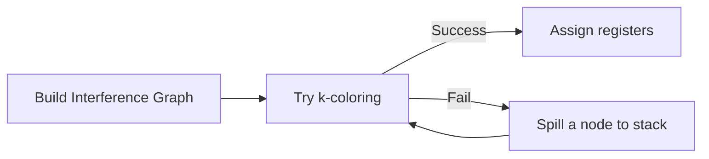

# Code Generation & Linking

Code generation translates the optimized IR into target machine code (or assembly). The **linker** then combines object files and libraries into a final executable. These are the final phases of the compilation pipeline.

## Instruction Selection

Instruction selection maps IR operations to target machine instructions. The challenge: many IR patterns can map to multiple instruction sequences, and the best choice depends on surrounding context.

### Approaches

| Approach | Description | Used By |
---|---|---|
**Code generator generator** | Tree-pattern matching via BURG/IBURG | Early GCC |
**Instruction selection DAG** | Match IR DAG against target instruction patterns | LLVM (SelectionDAG) |
**Global ISel** | More flexible, extensible selection framework | LLVM (newer) |
**Direct mapping** | Hand-written rules for each IR opcode | Simple JITs, Go compiler |

LLVM's **SelectionDAG** represents the IR as a DAG, then uses instruction definitions from a **TableGen** `.td` file (target description) to pattern-match and select machine instructions.

## Register Allocation

The IR may use unlimited virtual registers, but the target CPU has a finite set of physical registers (e.g., 16 general-purpose in x86-64). **Register allocation** maps virtual registers to physical registers, spilling to the stack when necessary.

### Graph Coloring

Model the problem as a **graph coloring** problem:

1. Build an **interference graph**: nodes are virtual registers; an edge connects two registers that are *live at the same time* (and thus cannot share a physical register).
2. Color the graph with k colors (k = number of physical registers) such that no two adjacent nodes share a color.
3. If k-coloring fails, **spill** a node (assign it to a stack slot) and retry.



Graph coloring is NP-hard in general, but efficient heuristics (Chaitin-Briggs) work well in practice.

### Linear Scan

**Linear scan** is a faster O(n log n) alternative used by JIT compilers (V8, HotSpot):

1. Compute live intervals for each virtual register `[start, end)`.
2. Process intervals in order of start time.
3. If a free register exists, assign it.
4. Otherwise, spill the interval with the farthest endpoint.

Linear scan produces slightly worse code than graph coloring but is much faster — critical for JIT compilation.

## Stack Frame Layout

Each function call creates a **stack frame**:

```
High Addresses
┌──────────────────────┐
│  Caller's frame      │
├──────────────────────┤  ← Caller's RSP (before CALL)
│  Return address      │  ← PUSHed by CALL instruction
├──────────────────────┤  ← Callee's RSP after prologue
│  Saved registers     │  (callee-saved: RBX, RBP, R12-R15 on x86-64)
├──────────────────────┤
│  Local variables     │  (spilled registers, arrays, structs)
├──────────────────────┤
│  Alignment padding   │
├──────────────────────┤  ← RSP during function body
│  (red zone)          │  ← x86-64: 128 bytes below RSP (no RSP modification needed)
└──────────────────────┘
Low Addresses
```

Key points:
- **Calling convention** (System V AMD64 ABI for Linux/macOS, Microsoft x64 for Windows) defines which registers are caller-saved vs. callee-saved, argument passing order, and stack alignment (16-byte aligned).
- **Red zone** (x86-64 System V): 128 bytes below RSP that won't be clobbered by signal handlers — leaf functions can use it without modifying RSP.

## Object Files (ELF)

The compiler produces **relocatable object files** (`.o` files). On Linux, these are in **ELF (Executable and Linkable Format)**.

Key ELF sections:

| Section | Contents |
---|---|
`.text` | Machine code (instructions) |
`.data` | Initialized global/static variables |
`.bss` | Uninitialized global/static variables (zero-filled, not stored on disk) |
`.rodata` | Read-only data (string literals, const) |
`.symtab` | Symbol table (names, sizes, types) |
`.rela.text` | Relocation entries for `.text` (fixups the linker must apply) |
`.debug_*` | DWARF debugging information |

Explore with:

```bash
# View sections
readelf -S hello.o

# View symbols
nm hello.o

# View relocations
readelf -r hello.o
```

## Linking

The **linker** (`ld` on Linux) resolves symbol references and combines object files.

### Static Linking

```bash
gcc -static -o hello hello.c
# All library code is copied into the executable
file hello
# hello: ELF 64-bit LSB executable, x86-64, statically linked
```

Steps:
1. **Symbol resolution**: Match each undefined reference to a definition across all object files and libraries.
2. **Relocation**: Adjust addresses in code and data to reflect final load addresses.
3. The result is a single, self-contained executable.

### Dynamic Linking

```bash
gcc -o hello hello.c  # default: dynamic linking
ldd hello
# linux-vdso.so.1
# libc.so.6 => /lib/x86_64-linux-gnu/libc.so.6
# /lib64/ld-linux-x86-64.so.2
```

- Shared libraries (`.so` files) are loaded at runtime by the **dynamic linker/loader** (`ld-linux.so`).
- Uses **Procedure Linkage Table (PLT)** and **Global Offset Table (GOT)** for indirect function calls.
- **Lazy binding**: library functions are resolved on first call (via PLT stub → GOT → dynamic linker).

### Static vs. Dynamic Comparison

| Criterion | Static | Dynamic |
---|---|---|
**Executable size** | Large (includes library code) | Small (library code shared at runtime) |
**Startup time** | Faster (no runtime resolution) | Slightly slower (PLT/GOT setup) |
**Memory usage** | Higher (duplicate library code) | Lower (shared pages via mmap) |
**Updates** | Must recompile | Update `.so` without recompiling |
**Distribution** | Self-contained | Requires shared libraries present |

## Loading

When you run an executable, the **OS loader** (`execve` system call):

1. Reads the ELF header and program headers.
2. Maps segments (`.text`, `.data`, etc.) into memory via `mmap`.
3. Resolves dynamic dependencies (loads `.so` files).
4. Runs initialization functions (`.init` sections, constructors).
5. Transfers control to the entry point (`_start` → `__libc_start_main` → `main`).

## References

- Dragon Book, Chapter 8 (Code Generation)
- System V AMD64 ABI: <https://gitlab.com/x86-psABIs/x86-64-ABI>
- ELF Specification: <https://refspecs.linuxbase.org/elf/gabi4/ch4.eheader.html>
- "Linkers and Loaders" by John R. Levine

## Interview Questions

1. **What is register allocation and why is it needed?** The IR uses unlimited virtual registers but the CPU has a finite set. Register allocation maps virtual to physical registers, spilling excess to the stack.
2. **Explain graph coloring for register allocation.** Build an interference graph where edges connect simultaneously-live registers. Color the graph with k colors (physical registers). If k-coloring fails, spill a node and retry.
3. **What is the difference between static and dynamic linking?** Static linking copies library code into the executable at link time. Dynamic linking uses shared libraries (`.so`) resolved at runtime by the dynamic loader.
4. **What are PLT and GOT?** PLT (Procedure Linkage Table) contains stubs for indirect calls to shared library functions. GOT (Global Offset Table) holds the actual addresses, filled in by the dynamic linker. Together they enable position-independent code and lazy binding.
5. **What goes in `.text`, `.data`, and `.bss`?** `.text` = machine code. `.data` = initialized global/static variables. `.bss` = zero-initialized globals (not stored on disk, only allocated at load time).
6. **What is a stack frame?** The region of the stack allocated for a single function invocation, containing return address, saved registers, local variables, and arguments that didn't fit in registers.