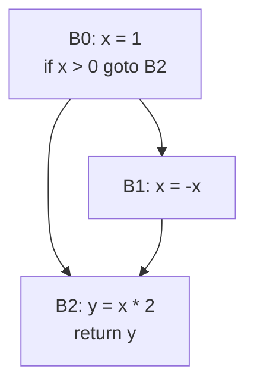

# Intermediate Representation & Optimization

After semantic analysis, the compiler translates the typed AST into an **intermediate representation (IR)**. The IR is the backbone of compiler optimization — it abstracts away source-language specifics while being close enough to machine code for effective transformation.

## Three-Address Code

**Three-address code (TAC)** is the most common IR form. Each instruction has at most one operator on the right side and at most three addresses (two operands, one result):

```
// Source:  a = (b + c) * (d - e)
//
// Three-address code:
t1 = b + c
t2 = d - e
t3 = t1 * t2
a  = t3
```

Common TAC instruction forms:

| Form | Example | Description |
|---|---|---|
| `x = y op z` | `t1 = a + b` | Binary operation |
| `x = op y` | `t2 = -a` | Unary operation |
| `x = y` | `t3 = t2` | Copy |
| `if x op y goto L` | `if t1 < 0 goto L1` | Conditional branch |
| `goto L` | `goto L2` | Unconditional branch |
| `x = y[i]` | `t = a[i]` | Array access |
| `x[i] = y` | `a[i] = t` | Array store |
| `param x` / `call f, n` | Function call mechanism |
| `return x` | `return t1` | Return value |

## Static Single Assignment (SSA)

**SSA form** is a refinement of three-address code where each variable is assigned exactly **once**. This dramatically simplifies data-flow analysis and optimization.

```c
// Before SSA:
x = 1
x = x + 2
if (cond) x = 3
return x

// After SSA:
x1 = 1
x2 = x1 + 2
if (cond) x3 = 3
x4 = φ(x2, x3)    // phi function: x4 = x2 if false-branch, x3 if true-branch
return x4
```

The **φ (phi) function** merges values from different control-flow paths at a join point. It is a *meta-instruction* — it doesn't correspond to a real machine instruction and is eliminated before code generation.

### Dominance Frontiers

To insert φ functions, the compiler computes **dominance frontiers**: a φ function for variable `x` is needed at every basic block in `x`'s dominance frontier. This is the algorithm used in LLVM and GCC.

```
Dominance: node A dominates node B if every path from entry to B passes through A.
Dominance frontier: the set of nodes where dominance ends — where control flow from
                    a dominated region merges with flow from outside it.
```

## Control Flow Graphs (CFG)

The **control flow graph** represents all possible execution paths:

- **Nodes**: basic blocks (maximal sequences of instructions with one entry at the top, one exit at the bottom, no branches in between).
- **Edges**: jumps (conditional and unconditional) between basic blocks.



CFGs are the foundation for all **control-flow analyses** and optimizations.

## Data Flow Analysis

Data flow analysis propagates information about program properties across the CFG. The general framework:

```
out[B] = f(in[B])
in[B]  = ∪ pred's out[pred]     (forward analysis)

// or for backward analysis:
in[B]  = f(out[B])
out[B] = ∪ succ's in[succ]
```

| Analysis | Direction | Domain | Purpose |
|---|---|---|---|
| Reaching definitions | Forward | Sets of (variable, definition) pairs | Detect uninitialized variables |
| Live variable analysis | Backward | Sets of variables | Register allocation, dead code elimination |
| Available expressions | Forward | Sets of expressions | Common subexpression elimination |
| Very busy expressions | Backward | Sets of expressions | Code motion |

The analysis uses a **fixed-point iteration** (worklist algorithm) until the data-flow values stabilize.

## Common Optimizations

### Constant Folding & Propagation

```c
// Before
int x = 3 + 4;      // folded to: int x = 7;
int y = x * 2;      // propagated & folded: int y = 14;

// The compiler evaluates constant expressions at compile time.
```

### Dead Code Elimination (DCE)

Remove code whose results are never used:

```c
int x = compute();   // if x is never read, this call can be removed
                     // (only if compute() has no side effects)
```

### Common Subexpression Elimination (CSE)

```c
// Before
t1 = a + b
t2 = a + b    // redundant computation

// After
t1 = a + b
t2 = t1        // reuse
```

Requires **available expressions** analysis to ensure `a` and `b` haven't been modified between the two.

### Loop Optimizations

| Optimization | Description |
|---|---|
| **Loop unrolling** | Replicate loop body to reduce branch overhead and expose instruction-level parallelism |
| **Loop invariant code motion** | Move computations that don't change across iterations outside the loop |
| **Induction variable simplification** | Replace complex induction variables with simpler ones |
| **Vectorization** | Transform scalar loop operations into SIMD instructions |

```c
// Loop invariant code motion
for (int i = 0; i < n; i++) {
    a[i] = b[i] + c * d;   // c * d is loop-invariant
}
// Optimized:
temp = c * d;
for (int i = 0; i < n; i++) {
    a[i] = b[i] + temp;
}
```

### Function Inlining

Replace a function call with the function body:

```c
// Before
int square(int x) { return x * x; }
int y = square(5);

// After inlining
int y = 5 * 5;  // then constant-folded to 25
```
Trade-off: eliminates call overhead and enables further optimization, but increases code size. Compilers use **inlining heuristics** (function size, call frequency, hot/cold paths).

## Optimization Passes in LLVM

LLVM organizes optimizations into **passes** that run on the IR (LLVM IR, which is in SSA form):

```
// View LLVM optimization pipeline:
clang -O2 -mllvm -print-before-all -mllvm -print-after-all -S input.c

// Or with opt:
opt -O2 -print-after-all input.ll -o output.ll
```

Key LLVM passes:

| Pass | Flag | What it does |
|---|---|---|
| Mem2Reg | `-mem2reg` | Promote allocas to SSA registers (enables most other opts) |
| InstCombine | `-instcombine` | Peephole optimizations, constant folding |
| SimplifyCFG | `-simplifycfg` | Merge blocks, eliminate empty blocks |
|GVN | `-gvn` | Global Value Numbering (CSE across blocks) |
| LICM | `-licm` | Loop Invariant Code Motion |
| LoopUnroll | `-loop-unroll` | Loop unrolling |
| Inline | `-inline` | Function inlining |
| DCE | `-dce` | Dead Code Elimination |
| SROA | `-sroa` | Scalar Replacement of Aggregates (break structs into scalars) |

The full pipeline is orchestrated by **pass managers**. LLVM's new pass manager (`-fpass-manager=new`) allows finer-grained control and parallelization.

## References

- Dragon Book, Chapters 8–9 (Intermediate Code Generation), Chapters 9–10 (Optimization)
- LLVM Pass List: <https://llvm.org/docs/Passes.html>
- SSA Construction: <https://en.wikipedia.org/wiki/Static_single-assignment_form>

## Interview Questions

1. **What is SSA form and why is it important?** Each variable is assigned exactly once. This makes data-flow analysis trivial (each use has exactly one definition) and is the basis for most modern compiler optimizations.
2. **What is a phi (φ) function?** A phi function selects a value based on which control-flow path was taken at runtime. It merges values at join points in the CFG.
3. **Explain constant folding and constant propagation.** Constant folding evaluates constant expressions at compile time (e.g., `3 + 4` → `7`). Propagation substitutes known constant values for variables (e.g., `x = 7; y = x + 1` → `y = 8`).
4. **What is the difference between live variable analysis and reaching definitions?** Live variable analysis is backward (determines which variables are needed in the future). Reaching definitions is forward (determines which definitions may reach a use).
5. **How does loop invariant code motion work?** Identify computations inside a loop whose operands don't change across iterations, and move them before the loop entry. Requires dominance and loop analysis to ensure safety.
6. **Why does LLVM need a `mem2reg` pass?** Local variables allocated with `alloca` are not in SSA form. `mem2reg` promotes these stack slots into SSA virtual registers, enabling all SSA-based optimizations.
