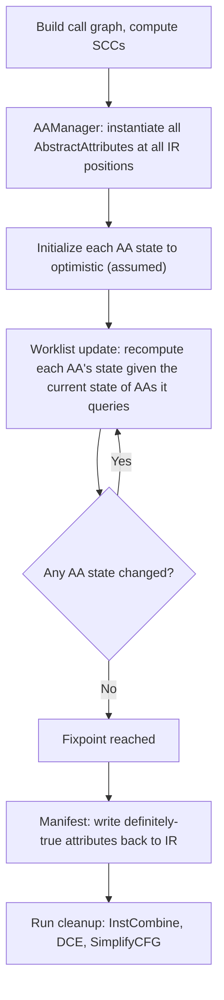
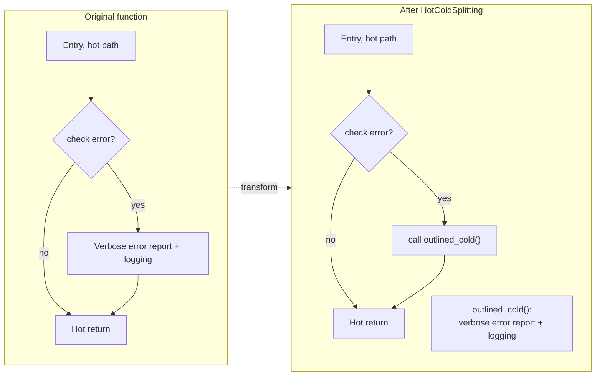
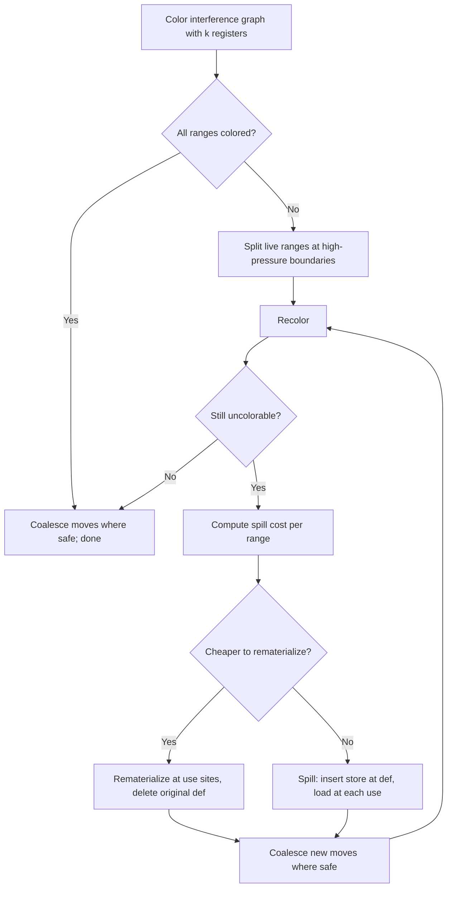
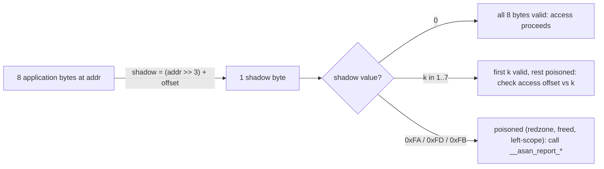

# IPA, Attributor, and Codegen Deep Dive

Four compiler-internal topics sit downstream of the optimization pipeline covered in [Intermediate Representation & Optimization](./intermediate-representation.md) and at the intersection of [Code Generation & Linking](./code-generation.md): (1) **interprocedural attribute inference** — how a modern compiler learns facts like `noreturn`, `nounwind`, or `memory(none)` about functions it cannot inline; (2) **profile-driven code layout** — how the compiler reorders or splits code so the hot path fits the instruction cache; (3) **register allocation beyond graph coloring** — the spilling, rematerialization, live-range splitting, and coalescing operations that make real register allocators work on hostile inputs; and (4) **sanitizer and coverage instrumentation as compiler passes** — why ASan/MSan/UBSan/TSan/SanitizerCoverage must run as IR-level transformations, not library wrappers, and what they cost. Each topic is rooted in a specific source: the LLVM Attributor framework (Doerfert et al., LLVM Dev Meeting 2019 and 2020; the `Attributor.html` documentation), the Pettis & Hansen (PLDI 1990) profile-guided code positioning paper, the Chaitin (1982) and Briggs (1994) graph-coloring lineage, and the Google sanitizers wiki. This page goes deep on each, with comparison tables, decision trees, and worked examples that the basic pages intentionally omit.

The four topics share a common thread: each sits at the boundary between the front-end IR optimizations (covered in [Intermediate Representation & Optimization](./intermediate-representation.md)) and the back-end machine-code emission (covered in [Code Generation & Linking](./code-generation.md)). The Attributor extends IR optimization *across* function boundaries, exploiting the call graph that single-function passes cannot see. Code-layout passes (splitting, outlining, placement) translate the optimized IR into a spatial layout that matches the runtime hot path. Register allocation bridges IR virtual registers and machine physical registers, and the four operations (spilling, rematerialization, splitting, coalescing) handle the cases where the bridge cannot be crossed directly. Sanitizer instrumentation sits *between* optimization and codegen, transforming every memory access into a checked memory access. Together, these four topics cover the gap between "the IR is optimized" and "the binary runs correctly and fast" — the part of the compiler that determines whether real-world software hits its performance and reliability targets.

> Related: [Code Generation & Linking](./code-generation.md), [Intermediate Representation & Optimization](./intermediate-representation.md), [JIT Compilation](./jit-compilation.md), [Partial Evaluation & MLIR](./partial-evaluation-mlir.md), [Developer Tools](../debugging/developer-tools.md), [Sanitizers (Linux)](../linux/debugging/sanitizers.md), [Clang/LLVM Toolchain](../linux/compilers/clang-llvm.md)

## Part I — LLVM Attributor: Modern Interprocedural Attribute Inference

### Background and Motivation

The classical LLVM `function-attrs` pass runs at the module level and infers a small set of attributes per function — `readonly`, `readnone`, `nounwind`, `noreturn`, `nocapture` — by inspecting the function body and recursing into its callees when they have already been annotated. The pass is a single forward walk: it cannot iterate to a fixpoint, it cannot propagate attributes across strong components of the call graph (because within an SCC no function is "already annotated" first), and it cannot represent partial knowledge such as "this function may not return but will not write memory." As the LLVM optimizer grew more aggressive, the gap between what it could prove and what `function-attrs` could express became a steady source of missed optimizations — a function that the compiler knew never threw would still leave cleanup edges in callers because `function-attrs` had not yet propagated `nounwind` from a callee in the same SCC.

The **Attributor** framework (Johannes Doerfert, LLVM Dev Meeting 2019; Doerfert et al., "Attributor: A Modular Interprocedural Fixpoint Analysis Framework for LLVM," 2020) replaces `function-attrs` with a generic, monotone fixpoint analysis that operates over an arbitrary set of **abstract attributes** (`AbstractAttribute` subclasses) and queries them through a uniform API. The framework is designed to (a) infer more attributes (over 40 by 2023, including the new `memory(read/write/none/inaccessiblemem)` and `noundef`), (b) propagate them across SCCs of the call graph, (c) represent both *must* and *may* facts, and (d) integrate cleanly with LTO and ThinLTO by serializing inferred attributes into the summary index. Since LLVM 13 the Attributor is the preferred path for interprocedural attribute inference at `-O2` and above; `function-attrs` is preserved for compatibility and lower optimization levels.

### The Attributor Abstraction: AbstractAttribute, AAManager, Query API

The Attributor is structured around four abstractions. An **`AbstractAttribute`** (AA) is a piece of inferred information tied to a specific **IR position**: a function, an argument, a call-site argument, or an instruction. Examples are `AANoReturn` (does this function never return?), `AAMemoryBehavior` (does it write to memory accessible to the caller?), `AANoFree` (does it not call `free`?), `AANoUndef` (are all values passing through this position well-defined?). Each AA has an internal state machine — `OPTIMISTIC` (assumed true until disproven), `PESSIMISTIC` (definitely false), or `UNKNOWN` (not yet analyzed). The state is updated monotonically: once a fact transitions from "assumed true" to "definitely false," it cannot go back. This monotonicity is what guarantees termination of the fixpoint iteration.

The **`AAManager`** is the registry that maps an AA kind to its implementation, similar to how `AnalysisManager` maps analysis types to passes. The **`InformationCache`** holds the underlying facts the AAs consult: the call graph, function summaries, the target-library info (does this function call `malloc`?). The **query API** lets any AA ask about any other AA: `AAManager::getAAFor<AANoReturn>(position)` returns the current best state of `AANoReturn` at that position, possibly triggering its computation if it hasn't been updated yet in this round. This decoupling is the key design win: a new attribute can be added by writing one `AbstractAttribute` subclass and registering it, with no changes to existing attributes. The query API also means attributes *compose* — `AAMemoryBehavior` can ask `AANoUnwind` whether the call can throw, and if not, eliminate the cleanup edge from its model.

### Fixpoint Iteration Across the Call Graph



The Attributor iterates over **SCCs of the call graph** in reverse topological order, processing leaf SCCs (callees) before their callers. Within an SCC, it iterates to a fixpoint: every AA whose state can change is recomputed; the loop continues until no state changes. The monotone state model guarantees termination — each AA's state can only move from "assumed true" toward "definitely false," never the reverse, so the lattice has finite depth. When an AA in SCC `A` queries an AA in SCC `B` (where `B` was already processed), it sees `B`'s final state. When it queries an AA in the same SCC `A` (a recursive call), it sees the *current* state, which is conservative — that's why the fixpoint iteration within the SCC is necessary. The manifest step at the end writes only the **definitely-true** attributes back to the IR (e.g., adds `nounwind` to a function's signature), leaving the assumed-but-unproven ones out. This separation lets the framework compute aggressively during analysis while remaining conservative at the IR level.

In practice, you can invoke the Attributor directly on an LLVM IR file with `opt` and inspect the inferred attributes on the resulting IR. The pass is registered as `attributor` (and `attributor-cgscc` for the call-graph-SCC variant) in the new pass manager:

```bash
# Run the Attributor and print the resulting IR
opt -passes='attributor-cgscc' -aa-pipeline='basic-aa' input.ll -S -o attributed.ll

# Compare attributes before/after
diff <(opt -passes='print<assumptions>' input.ll 2>&1) \
     <(opt -passes='attributor-cgscc,print<assumptions>' input.ll 2>&1)

# At -O2 and above the Attributor is already in the default pipeline;
# to see it run in context, dump the pass pipeline:
clang -O2 -mllvm -print-pipeline-passes -c input.c 2>&1 | tr ',' '\n' | grep -i attributor
```

A concrete before/after example: a function `f` that calls `g`, where `g` is itself `noreturn` and `nounwind`. Before the Attributor runs, `f` carries no attributes. After the Attributor's fixpoint, it has inferred `noreturn` and `nounwind` transitively from `g`, and downstream DCE can then remove code that follows the call to `f`:

```llvm
; Before Attributor:
define i32 @f(i32 %x) {
  call void @g(i32 %x)            ; g is noreturn + nounwind, but f does not yet know
  ret i32 0                       ; dead — unreachable in practice
}

; After Attributor (manifest adds the attributes to f's signature):
define noreturn nounwind i32 @f(i32 %x) {
  call void @g(i32 %x)
  unreachable                     ; DCE + SimplifyCFG rewrote the dead ret
}
```

This single round-trip illustrates the entire pipeline: the Attributor infers `noreturn`/`nounwind` from `g` (cross-SCC propagation), manifests them onto `f`'s signature, and the cleanup passes (`SimplifyCFG`, `DCE`) exploit the new attributes to delete the dead `ret` and replace it with `unreachable`. The `function-attrs` pass could not have done this if `f` and `g` were in the same SCC (e.g., if `g` could call back into `f`), because its single forward walk has no fixpoint.

### MustBe vs MayBe and the Manifest Step

A subtle but important distinction in the Attributor is between **must-be** (the attribute definitely holds for all inputs) and **may-be** (the attribute may hold, but the analysis cannot prove it). The internal state of an AA tracks both: an "assumed" value (the best the analysis has inferred so far) and an "actual" or "definite" value (what was provable at the start). At manifest time, only the definite value is written back to the IR — the assumed value would be unsafe to materialize because subsequent passes could exploit it incorrectly. For example, if `AANoReturn` cannot prove that `f` definitely does not return, but the analysis "assumes" it for the purpose of computing downstream AAs (like dead-code-after-call), the manifest step will *not* add the `noreturn` attribute to `f`'s definition. The downstream optimizations, however, still benefited from the assumption during the analysis phase. This split between assumed and definite states is the key to the Attributor's precision: it can use optimistic assumptions internally without compromising the safety of the IR it produces.

The manifest step is also where the Attributor decides whether to *change* the IR at all. Some attributes are pure annotations (`nounwind` on a function signature); others imply code changes (`nofree` lets the caller skip a `free` cleanup, `noreturn` lets dead code after the call be removed). The manifest step applies both: it adds the attribute and triggers the cleanup passes that exploit it. The cleanup passes themselves are standard — InstCombine, DCE, SimplifyCFG — but they run *after* the Attributor so they see the enriched attribute set. This is why the Attributor's payoff is often measured not in the attributes it adds but in the dead code those attributes enable later passes to remove.

### What Attributor Infers

The set of attributes the Attributor can infer has grown substantially since its introduction. The most impactful ones for downstream optimization:

| Attribute | Meaning | Downstream benefit |
|---|---|---|
| `noreturn` | Function does not return to caller | DCE of code after the call; `unreachable` insertion |
| `nounwind` | Function does not unwind (no exceptions) | Eliminates exception cleanup edges in callers |
| `willreturn` | Function will return (no infinite loop) | DCE of trailing code; loop-rotation safety |
| `nofree` | Function does not call `free` (no memory deallocation) | Improves alias analysis; enables allocation hoisting |
| `nocallback` | Function does not call back into the caller's module | Better IPA for callbacks |
| `memory(read/write/none/inaccessiblemem)` | Fine-grained memory effects per location kind | Replaces `readonly`/`readnone` with a 4-dimensional model |
| `noundef` (args/return) | No poison/undef values pass through this position | Enables more aggressive value forwarding |
| `nosync` | Function performs no synchronization | Allows reordering across the call |
| `noalias` (args) | Pointer arguments do not alias each other or globals | Disambiguates memory accesses in the callee |
| `allockind` | Allocation kind (alloc/free/realloc) for `__builtin_malloc`-like calls | Replaces allocation sites with allocator-aware optimizations |

The `memory(...)` attribute in particular is a major modernization: the old `readonly`/`readnone` dichotomy could not express "reads inaccessible memory only" (a function that touches only its own allocation) or "writes only inaccessible memory." The new model — `memory(read, write)` where each operand is one of `{none, read, write, readwrite}` and there's a separate `inaccessiblemem` location kind — gives downstream passes (LICM, GVN, alias analysis) substantially more freedom. The Attributor is the primary inference engine for `memory(...)` in modern LLVM.

### Comparison: Attributor vs function-attrs vs IPA-CP

| Aspect | Attributor | `function-attrs` (legacy) | IPA-CP (GCC) |
|---|---|---|---|
| **Granularity** | Per-IR-position abstract attributes | Per-function attributes | Per-call-site constants |
| **Cross-SCC** | Yes, via call graph SCC traversal | Limited to intra-SCC, single pass | Yes, via topological order |
| **Attributes inferred** | 40+ (memory model, noreturn, noundef, nofree, ...) | ~10 (readonly, readnone, nounwind, noreturn, nocapture, ...) | Constants passed to args, jump functions |
| **Iteration model** | Monotone fixpoint over abstract state lattice | Single forward walk, no fixpoint | Iterative constant propagation until fixpoint |
| **Precision** | Both `must` (definite) and `may` (assumed) states | `may` only (single pass) | `must` for constants, conservative for others |
| **LTO integration** | Designed for ThinLTO summary; attributes serialize into index | Per-module only; does not survive to LTO link | Works at link-time on combined IR |
| **Extensibility** | Add one `AbstractAttribute` subclass, register; done | Requires editing the monolithic pass | Requires editing GCC's IPA-CP pass |
| **Status in modern LLVM** | Replaces `function-attrs` at `-O2` and above | Kept for compatibility and `-O1` | N/A (GCC equivalent of attribute inference) |

### LTO/ThinLTO Interaction

The Attributor is designed to run both **pre-link** (in the per-module compile step) and **post-link** (during the LTO link). Pre-link, it infers attributes that fit in the ThinLTO summary index — a compact bitcode encoding of each function's properties — so that downstream ThinLTO backends can use them without re-running analysis. Post-link, with the full program visible, the Attributor can propagate across module boundaries that pre-link could not see. This is a major reason ThinLTO can outperform traditional LTO for interprocedural optimization: the summary carries Attributor-inferred attributes cheaply across the module boundary, and the post-link pass refines them. The `function-attrs` pass, by contrast, runs only within a single module and cannot take advantage of cross-module information even at LTO time, because it has no representation for "attributes inferred but not yet materialized."

## Part II — Hot/Cold Splitting, Function Outlining, and Basic-Block Placement

### Profile-Guided Code Positioning (Pettis & Hansen)

The seminal paper on profile-guided code layout is Pettis and Hansen, "Profile-Guided Code Positioning" (PLDI 1990). They introduced two complementary techniques: (1) **basic-block positioning** — order basic blocks so that the hot path forms a contiguous sequence with maximal fall-through (no branches between hot blocks), and (2) **function splitting** — separate hot and cold regions of a function so that the hot region fits in fewer instruction-cache lines. Their algorithm collects edge-execution counts from profiling, builds a weighted control-flow graph, and uses a greedy chain-merging procedure (similar to Huffman merging) to lay out blocks so that the most-traveled edges become fall-through. Their measurements on HP-PA RISC showed 30–50% reductions in instruction-cache misses on large C++ programs, with the gain concentrated in code that has both hot and cold paths (the typical case for production software, where error-handling and logging dominate the source but execute rarely).

The motivation is the **instruction cache**: a modern CPU fetches instructions in 64-byte cache lines, and a branch to a non-fall-through target incurs not just the branch-prediction cost but also a potential cache miss and a bubble in the fetch pipeline. If the hot path through a function occupies one or two cache lines and the cold paths (error handling, rare cases, debug logging) live elsewhere, the hot code stays resident in the i-cache across many invocations. The cold code, by contrast, can be evicted without harm. This insight drives the entire family of code-layout passes in modern compilers: LLVM's `HotColdSplitting`, `MachineBlockPlacement`, and `MachineOutliner`; GCC's `reorder-blocks` and function-section machinery; and post-link optimizers like BOLT.

### Hot/Cold Splitting

LLVM's **`HotColdSplitting`** pass (documented in `llvm.org/doxygen/HotColdSplitting_8cpp.html`) implements the Pettis-Hansen function-splitting idea at the LLVM IR level. It identifies **cold regions** of a function — sequences of basic blocks that are dominated by a block annotated `__attribute__((cold))` or that have low profile counts (when PGO is enabled) — and extracts them into a separate function via the `CodeExtractor` utility. The original function is left with the hot path; the cold path becomes a call to the newly outlined function. The outlined function is marked `noinline`, `cold`, and `norecurse`, which causes downstream passes to (a) never inline it back, (b) place it in a separate `.text.unlikely` section (which the linker can group far from hot code), and (c) treat it as a leaf for register-allocation purposes.

The programmer can hint the splitter explicitly with `__attribute__((cold))` on a helper known to be on the error path. The compiler then treats every block dominated by a call to that helper as cold, and the splitter extracts them as a group. This is particularly useful for C++ functions where the error path involves constructing diagnostic strings, formatting error messages, and calling logging routines — code that is rarely executed but bloats the function and pushes the hot path across i-cache line boundaries:

```c
#include <stdio.h>

__attribute__((cold, noinline))
static void report_error_verbose(const char *path, int err) {
    char buf[256];
    snprintf(buf, sizeof(buf), "error opening %s: %d", path, err);
    fprintf(stderr, "%s\n", buf);
    /* ... extensive logging, stack trace, ... */
}

int read_config(const char *path, char *out, size_t n) {
    FILE *f = fopen(path, "r");
    if (f == NULL) {
        report_error_verbose(path, errno);   /* cold call site */
        return -1;
    }
    size_t got = fread(out, 1, n, f);          /* hot path */
    fclose(f);
    return (int)got;
}
```

Without `__attribute__((cold))`, the verbose error-reporting code sits inline in `read_config`, displacing the hot `fread`/`fclose` path. With the attribute, `HotColdSplitting` extracts `report_error_verbose` (and any code dominated by its call) into a separate function placed in `.text.unlikely`, leaving `read_config` compact and hot-path-resident. The same effect happens automatically when PGO is enabled, even without the attribute — the profiler's low execution count for the error branch triggers the splitter.



The benefit is threefold: (1) the hot path's basic blocks now fit in fewer i-cache lines because the cold blocks no longer sit between them; (2) the hot function's register pressure drops because the registers used by the cold code are no longer live across the hot path; (3) the cold function gets a smaller, dedicated register allocation that does not pollute the hot function's allocator. The cost is one extra call instruction (a `call outlined_cold` in the cold branch), which is acceptable because that branch is by definition rarely executed. The transformation is enabled by default at `-O2` when PGO is available, and can be triggered manually with `__attribute__((cold))` on a function the programmer knows is rarely called (error handlers, panic paths, fallback code paths).

### Function Outlining and MachineOutliner

A separate but related transformation is **machine-level outlining** (LLVM's `MachineOutliner` pass). Where `HotColdSplitting` extracts cold regions at the IR level (operating on LLVM IR basic blocks), `MachineOutliner` operates on the machine-instruction representation, after register allocation. It scans the function for **repeated instruction sequences** — typically short, 4–20-instruction epilogues, prologues, or common code patterns — and replaces each occurrence with a call to a single shared outlined routine. The shared routine is named `OUTLINED_FUNCTION_<n>` and lives in the same `.text` section as the rest of the code. The benefit is code-size reduction, sometimes substantial on RISC architectures (ARM, RISC-V) where prologues are verbose; on x86-64 the gains are smaller because variable-length instructions make the call instruction itself relatively expensive.

The distinction between `HotColdSplitting` and `MachineOutliner` is important: the former operates on IR-level cold regions (motivated by i-cache locality), the latter on machine-level repeated sequences (motivated by code size). A third transformation, **manual function outlining** via `__attribute__((cold))` or `__attribute__((noinline))`, lets the programmer hint to the compiler that a specific helper should be kept out of the hot path. These three mechanisms complement each other: `HotColdSplitting` for profile-driven cold regions, `MachineOutliner` for size-driven repeated patterns, and manual attributes for domain knowledge the profiler cannot infer.

### Basic-Block Placement (MachineBlockPlacement)

LLVM's **`MachineBlockPlacement`** pass (the machine-level analog of Pettis-Hansen block positioning) reorders basic blocks within a function to maximize fall-through and minimize taken branches. It uses branch-probability information (from `BranchProbabilityInfo`, populated by PGO or static heuristics) to choose, at each block, which successor should be laid out immediately after it as the fall-through target. The algorithm is greedy: it picks the most-likely successor, places it next, and continues. When the chosen successor has multiple predecessors (a join point), the algorithm uses a tie-breaking heuristic that prefers the predecessor with the highest edge frequency. The result is that the hot path through a function forms a contiguous sequence of fall-through blocks; cold paths are pushed to the end of the function and reached only by taken branches.

A subtle consequence of block placement is **branch polarity**: after placement, the conditional branch at the end of each block should test the *unlikely* condition (so the likely case is fall-through). For example, a bounds check `if (i >= n) goto cold_throw;` is fine if `cold_throw` is laid out far away, because the fall-through case (valid access) executes most of the time and the branch is rarely taken. `MachineBlockPlacement` performs this polarity inversion as part of the layout, inverting the branch condition and swapping targets so that the fall-through edge matches the chosen layout. This interacts with hardware branch prediction: most architectures predict "not taken" for forward conditional branches by default, so arranging the hot path as fall-through aligns software layout with hardware prediction.

### BOLT: Post-Link Block Placement

**BOLT** (Binary Optimization and Layout Tool, Panchenko et al., CGO 2019) is a post-link optimizer that takes a profiled binary, disassembles it back into basic blocks, applies `MachineBlockPlacement`-style reordering across the entire binary, and emits a new binary. The motivation is that the compiler's view of code layout is per-function — it cannot reorder across function boundaries or place caller-adjacent-to-callee based on profile. BOLT can: if `caller` and `callee` are both hot and `callee` is small, BOLT can place them adjacent in memory, eliminating i-cache misses on the call/return path. BOLT also performs function splitting (separating hot and cold parts of a single function into separate sections) and reorders the function bodies themselves based on profile. Typical speedups reported on large production binaries (Facebook, Google) are 2–7%, which is substantial for code that has already been compiled at `-O3` with PGO.

BOLT is conceptually a "second pass" of `MachineBlockPlacement` over the whole binary, not just a single function. It demonstrates that the Pettis-Hansen layout problem is *not* solved by the compiler alone: the compiler's per-function view is too local. Post-link optimizers like BOLT and (for the Linux kernel) BPF's `bpftool` fill this gap. The trade-off is that BOLT requires a profile (collected by running a representative workload under `perf record`), and the optimization is repeated whenever the binary is rebuilt — making it most valuable for long-lived production binaries where a small layout improvement justifies the post-link step.

A typical BOLT workflow looks like the following: build the binary with `-O3 -g` (BOLT needs relocation info, so the binary should be built with `-Wl,--emit-relocs`), collect a `perf` profile on a representative workload, convert the profile to BOLT's format, and run `llvm-bolt` to produce the optimized binary:

```bash
# 1. Build with relocations so BOLT can rewrite
clang -O3 -g -Wl,--emit-relocs -o app app.c

# 2. Collect a representative profile (run your workload under perf)
perf record -e cycles:u -F 997 -- ./app <workload>
perf script -i perf.data > app.perf.script

# 3. Optimize the binary with BOLT
llvm-bolt app -o app.bolt -data=app.perf.script \
    -reorder-blocks=ext-tsp -reorder-functions=hfsort+ \
    -split-functions -split-all-cold -split-eh

# 4. Verify the speedup on the same workload
./app.bolt <workload>
```

The `-reorder-blocks=ext-tsp` flag invokes BOLT's extended-traveling-salesman block-ordering solver, which generalizes the Pettis-Hansen greedy chain-merging with an edge-cost model that accounts for both fall-through benefit and branch-direction prediction. `-reorder-functions=hfsort+` reorders function bodies using the Hot Functions Sort heuristic, which clusters hot functions together (the cross-function layout that the compiler cannot do). The `-split-functions -split-all-cold` flags split each function into hot and cold parts, mirroring the compiler's `HotColdSplitting` but at the binary level. The cumulative effect is a binary whose memory layout matches the runtime hot path far more closely than the compiler alone can achieve.

### Comparison: Code Layout Passes

| Pass | IR vs machine | Granularity | Input | Output | Stage |
|---|---|---|---|---|---|
| `HotColdSplitting` | LLVM IR | Cold basic-block regions | Profile counts or `__attribute__((cold))` | Cold region extracted as separate function | Module pass, before codegen |
| `MachineOutliner` | Machine instrs | Repeated instruction sequences | Code patterns | Shared outlined routines | Post-regalloc, machine level |
| `MachineBlockPlacement` | Machine instrs | Basic blocks within a function | `BranchProbabilityInfo` (PGO or static) | Reordered basic blocks, branch polarity | Post-regalloc, machine level |
| BOLT | Disassembled binary | Basic blocks across whole binary | `perf` profile | Re-laid-out binary | Post-link, separate tool |
| `__attribute__((cold))` | Source hint | Function or basic block | Programmer knowledge | Same effect as profiler-marked cold | Source level |

## Part III — Register Allocation Deep: Spilling, Rematerialization, Live-Range Splitting, Coalescing

### Beyond Graph Coloring

The [basic register allocation](./code-generation.md#register-allocation) page covers graph coloring as a graph-coloring problem: build an interference graph (nodes = virtual registers, edges = "live simultaneously"), then color it with \\( k \\) colors (\\( k \\) = number of physical registers). When \\( k \\)-coloring fails, the textbook solution is "spill a node and retry." Real allocators do much more. The Chaitin (1982) and Briggs (1994) lineage identified four distinct operations that a real allocator must perform, each with different costs and applicability. The interference graph is the data structure, but the *transformations* applied to it — spilling, rematerialization, live-range splitting, and coalescing — are what distinguish a good allocator from a naive one. This section covers each operation, when it is preferred, its cost, and how the four compose in LLVM's `RegAllocGreedy`.

The interference graph for a function in SSA form has a special structure: phi nodes create **webs** (sets of SSA values that must share a register because they are connected by phi functions), and the allocator must treat each web as a single unit. After SSA deconstruction (phi elimination), the graph becomes the "non-SSA" interference graph that classical Chaitin-Briggs operates on. Modern allocators like LLVM's `RegAllocGreedy` perform live-range splitting *before* phi elimination, exploiting the SSA structure to split webs at basic-block boundaries cheaply. The four operations below are described in terms of their effect on this graph.

### Spilling

When the allocator cannot color the interference graph with \\( k \\) registers, it must reduce the live-range pressure by **spilling**: choosing one or more virtual registers to store on the stack (in a stack slot) rather than in a physical register. After spilling, the spilled value's live range is broken into smaller pieces — each use becomes a `load` from the stack slot, each definition becomes a `store` — and the smaller live ranges no longer interfere with as many other values. The allocator re-runs coloring on the modified graph, hoping the spilled ranges now fit.

The choice of *which* value to spill is governed by a **spill-cost heuristic**. The classic Chaitin cost is:

\\[ \text{cost}(v) \;=\; \sum_{u \in \text{uses}(v)} \text{freq}(u) \cdot w(v) \\]

where \\( \text{freq}(u) \\) is the execution frequency of the basic block containing use \\( u \\) (from PGO or static heuristics: loops are 10×, nested loops 100×, etc.) and \\( w(v) \\) is a per-instruction weight (loads and stores cost more than simple arithmetic). The allocator spills the live range with the **lowest cost per degree** — i.e., the value that is cheap to spill (few uses, in cold blocks) and that, when removed, frees the most colors (high degree in the interference graph). Spilling is expensive: every access becomes a memory operation, so a spilled loop index can dominate the loop's runtime. Spilling is therefore the last resort, applied only when splitting and rematerialization cannot resolve the pressure.

### Rematerialization

**Rematerialization** (Briggs, 1994) is the observation that some spilled values are cheaper to *recompute* than to *reload*. Consider a constant: `v = 5;` followed by a use of `v` deep in a loop. If `v` must be spilled, reloading it requires a `load` from a stack slot (a memory access, 3–5 cycles). But the constant `5` can be rematerialized at the use site with a single `mov r0, #5` instruction (1 cycle, no memory). The rematerialization transformation deletes the original definition of `v`, replaces every use with a fresh definition that recomputes `v`'s value, and eliminates the stack slot entirely. The benefit is both speed (cheaper instruction) and code size (no stack slot needed for the spilled value).

The allocator decides rematerialization is profitable when the **rematerialization cost** (the cost of the recomputing instruction, typically 1 cycle for a constant, 2–3 for a simple address-compute) is less than the **reload cost** (a memory load plus the spill store amortized across uses). The classic rematerializable values are constants, global addresses (on RISC architectures where the address is `lui`+`ori`), and simple arithmetic on constants (`v = base + 16;`). Non-rematerializable values include loads (because the memory location may have been overwritten between the original load and the rematerialization point) and function-call results (because the call has side effects). LLVM's `RegAllocGreedy` consults the target's `TargetInstrInfo::isReMaterializable` hook to make this decision, which lets each backend specify its own rematerialization rules.

### Live-Range Splitting

**Live-range splitting** breaks a single long live range into multiple shorter ones, only the high-pressure parts of which need to be spilled. Consider a value `v` defined at the start of a function and used at the very end, with a high-pressure middle region (a tight loop). The naive allocator would spill `v` entirely, paying a load/store on every use. A splitting allocator breaks `v` into three live ranges: `v1` from def to loop entry (held in a register), `v2` through the loop (spilled, because the loop is high-pressure), and `v3` from loop exit to final use (held in a register again). The split points — typically basic-block boundaries, but LLVM can also split at individual use sites — incur a single `mov` between physical registers (or a single load/store pair at the split), which is far cheaper than spilling at every use.

Splitting is the most powerful of the four operations because it converts an "all-or-nothing" spill decision into a fine-grained, per-region decision. LLVM's `RegAllocGreedy` is built around aggressive splitting: it tries to color each live range whole, and when that fails, it splits at the boundaries of the high-pressure region and retries coloring on each piece. The split is driven by the **live-interval matrix** — a data structure that tracks, for each point in the function, which physical registers are in use — so the allocator knows exactly where pressure peaks. Splitting is also where SSA helps: in SSA form, each definition has a single live range, and splitting at a basic-block boundary produces two SSA values connected by a phi-like `mov`, which can later be coalesced away if the pressure allows.

### Coalescing (Chaitin-Briggs vs George-Appel)

**Coalescing** merges the live ranges of the source and destination of a `mov` instruction, eliminating the move entirely. After register allocation, a `mov r1, r2` is pure overhead if `r1` and `r2` are not otherwise occupied — coalescing assigns them the same physical register and deletes the move. The challenge is that coalescing can *increase* interference: if `r1` and `r2` are coalesced into one range, the merged range interferes with the union of their original interferences, which may make it uncolorable. The two classical coalescing strategies are **Chaitin-Briggs** (aggressive: coalesce if the merged range is still colorable, then re-run coloring; may increase spills) and **George-Appel** (conservative: coalesce only if every neighbor of one endpoint that interferes with the other is already a "move-related" node of low degree; never increases spills). The trade-off is precision (Chaitin-Briggs removes more moves but may spill) vs safety (George-Appel never spills but leaves more moves).

LLVM's `RegAllocGreedy` uses a hybrid: it performs **copy coalescing** as a separate pass before allocation (using a George-Appel-like conservative rule) and then re-attempts coalescing during allocation when a split introduces a new `mov`. The interaction with live-range splitting is important: splitting introduces `mov` instructions at split points, and if the pressure later drops, those `mov`s should be coalesced away. The allocator's effectiveness is therefore measured not just by spill count but by **remaining move count** — a good allocator minimizes both. This is why post-allocation passes like `Peephole` and `MachineCopyPropagation` exist: they clean up the moves the allocator could not coalesce.

The following IR sketch illustrates the four operations working together. The original function has a high-pressure middle region; the allocator splits the long live range of `v` into three pieces, rematerializes the constant `5` rather than spilling it, and coalesces the move introduced at the split point once pressure drops:

```llvm
; Before allocation (high pressure in the loop):
define i32 @f(i32* %p) {
entry:
  %v = load i32, i32* %p          ; v live across the entire loop
  %c = call i32 @constant()        ; returns 5
  br label %loop
loop:
  %i = phi i32 [0, %entry], [%next, %loop]
  %sum = add i32 %i, %v            ; uses v every iteration
  %next = add i32 %i, %c           ; uses c every iteration
  %cond = icmp slt i32 %next, 1000
  br i1 %cond, label %loop, label %exit
exit:
  ret i32 %sum
}

; After RegAllocGreedy (conceptual):
;   - %v split into v_entry (register), v_loop (spilled), v_exit (reloaded)
;   - %c rematerialized as 'mov r0, #5' inside the loop (cheaper than reload)
;   - the mov at the entry->loop split is coalesced away
;   - spill cost: one store (entry) + one load (loop) for v_loop, no cost for c
```

A naive Chaitin allocator would have spilled `v` entirely — paying a load on every loop iteration for `%sum = add i32 %i, %v` — and would have spilled `c` to a stack slot as well. The combined strategy (split `v` across the loop boundary, rematerialize `c` as a constant) reduces the per-iteration memory traffic from two loads (naive) to one load (split `v`), and the rematerialization eliminates the stack slot for `c` entirely. On a tight inner loop, this is the difference between a memory-bound loop and a register-bound loop, which on modern out-of-order CPUs can be a 2–3× speed difference.

### RegAllocFast vs RegAllocGreedy vs RegAllocBasic

LLVM provides three register allocators, each with a different cost/quality trade-off:

| Allocator | Algorithm | Use case | Compile-time cost | Code quality |
|---|---|---|---|---|
| `RegAllocFast` | Linear scan, no splitting | `-O0`, debug builds | Very low | Poor (many spills) |
| `RegAllocBasic` | Pure Chaitin-Briggs coloring, no splitting | Educational, fallback | Low | Moderate (spills aggressively) |
| `RegAllocGreedy` | Coloring + live-range splitting + coalescing | `-O1`, `-O2`, `-O3` (default) | Medium | Good (industry-standard) |
| `RegAllocPBQP` | Partitioned Boolean Quadratic Programming | Specialized (high-pressure code) | High | Best (rarely used) |

`RegAllocGreedy` is the default for optimized builds because it strikes the right balance: it tries to color whole live ranges first (cheap, often succeeds), splits under pressure (the main fix for tight code), coalesces moves conservatively, and spills only as a last resort. `RegAllocFast` is used at `-O0` because it produces correct code in minimal time — debug builds care about compile speed, not runtime. `RegAllocPBQP` models the allocation problem as a quadratic-cost matching problem and can produce slightly better code on extremely high-pressure functions, but the additional compile-time cost is rarely justified, and it is not built by default in many distributions.

### Decision Tree



The decision tree shows how the four operations compose: coloring is attempted first; if it fails, splitting is the first response (cheap and often sufficient); if splitting fails, the allocator chooses between rematerialization (for cheap-to-recompute values) and spilling (for everything else). Coalescing runs at every step, opportunistically removing moves introduced by splitting and rematerialization. The loop terminates because each iteration strictly reduces the set of uncolored ranges (either by splitting, which produces smaller ranges, or by spilling/rematerialization, which removes a range from the colored set). The compile-time budget is bounded by the function size; `RegAllocGreedy` is \\( O(n \log n) \\) in practice thanks to the priority-queue-driven coloring, while `RegAllocPBQP` is exponential in the worst case.

### Comparison of Operations

| Operation | When applied | Cost | Effect on code | Interacts with |
|---|---|---|---|---|
| **Spilling** | Last resort, when coloring fails after splitting | Load/store on every access; high frequency cost | Memory traffic, cache pressure, may dominate hot-loop runtime | PGO frequency weights the cost |
| **Rematerialization** | Spilled value is cheap to recompute (constant, address) | One cheap instruction per use (e.g., `mov r0, #5`) | Eliminates stack slot; saves memory bandwidth | Target's `isReMaterializable` hook |
| **Live-range splitting** | First response to coloring failure | One `mov` per split point | Isolates pressure to high-pressure regions only | SSA deconstruction, phi webs |
| **Coalescing** | After splitting/rematerialization introduces moves | Zero (removes a move) | Cleaner code, fewer instructions | Interference graph must remain \\( k \\)-colorable |

## Part IV — Sanitizer and Coverage Instrumentation as Compiler Passes

### Why Compiler Passes, Not Libraries

Sanitizers cannot be implemented as ordinary libraries because they need to **see every memory access** the program makes. A library wrapper around `malloc` could poison heap allocations, but it cannot intercept stack-array accesses (`int arr[10]; arr[15] = 0;`) or accesses to global variables. The compiler, however, sees every load and store in the IR — it can insert a check before each one. This is why ASan, MSan, UBSan, TSan, and SanitizerCoverage are all implemented as LLVM passes (in `llvm/lib/Transforms/Instrumentation/`): they instrument the IR at every relevant instruction, then code generation produces machine code with the checks inlined. The sanitizer *runtime* is a library (linked in at the end), but the *instrumentation* is a compiler transformation. This distinction is what makes sanitizers both thorough (no access is missed) and slow (every access has a check).

The passes run **late in the pipeline**, after most optimizations have run (so the checks see the optimized code, not the source) but before code generation (so the checks are emitted as real instructions). Running after optimization means the checks see the actual memory operations the program will execute, not the source-level operations that may have been transformed by inlining, vectorization, or loop unrolling. Running before codegen means the checks are subject to register allocation and instruction scheduling like any other code, which is part of why sanitizers have non-trivial runtime overhead — the check instructions consume registers and execution slots. The runtime support library provides the slow-path functions (`__asan_report_load4`, `__msan_warning`, `__ubsan_handle_signed_overflow`, etc.) that the inlined checks call when they detect a violation.

### AddressSanitizer (ASan)

ASan (Serebryany et al., USENIX ATC 2012; algorithm wiki at `github.com/google/sanitizers/wiki/AddressSanitizerAlgorithm`) detects heap-buffer-overflow, stack-buffer-overflow, global-buffer-overflow, use-after-free, use-after-return, and use-after-scope bugs. The core idea is **shadow memory**: every byte of application memory has a corresponding **shadow byte** that records whether that byte is currently valid (allocated, in-scope, not in a redzone). The mapping is 8:1 — 8 application bytes per 1 shadow byte — so a 64-bit application with \\( 2^{47} \\) bytes of addressable memory needs \\( 2^{44} \\) bytes of shadow, which fits in the 48-bit virtual address space of x86-64. The shadow address is computed by a simple shift and add:

\\[ \text{Shadow}(\text{addr}) \;=\; (\text{addr} \gg 3) \;+\; \text{offset} \\]

where the offset (e.g., `0x7fff8000` on x86-64) places the shadow in a fixed region of the address space. A shadow byte of `0` means all 8 application bytes are valid; a value \\( k \\) in `1..7` means the first \\( k \\) bytes are valid and the rest are poisoned (e.g., a 5-byte allocation in an 8-byte aligned slot has shadow `5`); a negative value (`0xfa`, `0xfb`, `0xfd`, etc.) encodes the reason the bytes are poisoned (stack redzone, freed heap, etc.). ASan instruments every load and store with a sequence that loads the shadow byte, checks it against the access size, and calls `__asan_report_loadN` (or `__asan_report_storeN`) on a violation. The check is typically 4–5 instructions and uses no scratch registers in the common case, which is why ASan's overhead is "only" ~2×.



The instrumentation that ASan inserts is conceptually a small inline check before every memory access. A 4-byte load becomes a load of the shadow byte, a comparison, a conditional branch, and (in the rare slow path) a call to the runtime. The following sketch shows the before/after for a single 4-byte store:

```c
// Source
void store(int *p, int v) {
    *p = v;
}

// After ASan instrumentation (conceptual x86-64 asm)
store:
    ; compute shadow address: (p >> 3) + 0x7fff8000
    mov     rax, rdi
    shr     rax, 3
    movsxd  rax, dword ptr [rax + 0x7fff8000]   ; load 1 shadow byte
    cmp     rax, 0                                ; all 8 bytes valid?
    jne     .Lslow_path                           ; if not, check more
    mov     dword ptr [rdi], esi                  ; the original store
    ret
.Lslow_path:
    ; rax holds shadow; if negative, byte is poisoned (report)
    ; if rax is k in 1..7, check whether (p & 7) + 4 <= k
    ; ... a few more instructions, then either proceed or call __asan_report_store4
    call    __asan_report_store4
    ud2
```

The fast path (shadow byte is `0`) is 4 instructions plus the original store, which is why the slowdown is ~2× rather than the ~10× one might naively expect from "a check on every memory access." The shadow load is cache-hot because every application access touches a small set of shadow bytes (8:1 compression means the shadow is one-eighth the size of the application memory, so it fits in cache much more easily). The slow path is taken only when a violation is detected or when the access straddles an 8-byte boundary (in which case two shadow bytes must be checked). The same instrumentation pattern applies to stack accesses (with the shadow updated at function entry/exit to poison redzones between stack variables) and to globals (with the shadow initialized at program start).

ASan also instruments `malloc`/`free` (replacing them with `__asan_malloc`/`__asan_free` that add redzones around allocations and quarantine freed memory), instruments stack-frame setup (poisons redzones between stack variables), and instruments globals (adds redzones in `.data`). The **use-after-scope** check poisons stack variables when they go out of scope, catching use-after-return and use-after-scope bugs that would otherwise be invisible. The runtime cost is roughly 2× slowdown and 3× memory growth (due to shadow and redzones); the catch rate for memory-safety bugs is high enough that ASan is the default for many C++ testing pipelines (Chrome, Android, Fuchsia).

### MemorySanitizer (MSan)

MSan (Serebryany et al., CGO 2012) detects **use of uninitialized memory**. Like ASan, it uses shadow memory, but the mapping is 1:1 (one shadow bit per application byte) and the shadow encodes whether each byte has been initialized. The MSan pass instruments every load, store, and arithmetic operation: loads propagate the shadow from the source memory to the destination register; arithmetic combines the shadows of the operands (e.g., `c = a + b` produces a shadow for `c` that is the bitwise-OR of the shadows of `a` and `b`, meaning `c` is uninitialized if either operand was). A **use** of an uninitialized value — a branch condition, a syscall argument, a memory address — triggers `__msan_warning`, which reports the bug. MSan is harder to use than ASan because it must instrument the entire program including libraries (an uninstrumented library is treated as fully initialized, producing false negatives), and because it requires a specially-instrumented libc. The runtime cost is ~3× slowdown and 3× memory growth.

### UndefinedBehaviorSanitizer (UBSan)

UBSan ( LLVM documentation: `clang.llvm.org/docs/UndefinedBehaviorSanitizer.html`) detects **specific categories of undefined behavior** without shadow memory. Instead, it inserts targeted checks at each operation that could trigger UB: signed-integer overflow, shift count larger than the bit width, division by zero, null pointer dereference, misaligned access, pointer overflow, and many more. Each check is a few instructions that compare against the relevant bound; on a violation, it calls `__ubsan_handle_<category>`, which prints a diagnostic and (by default) continues execution. Unlike ASan/MSan, UBSan does not need shadow memory — each check is local to the operation it guards — so its overhead is much lower (~5% slowdown for the default check set). UBSan can be configured to abort on the first violation (`-fno-sanitize-recover=all`) or to recover and continue (the default, which lets a single test run report multiple bugs).

UBSan's coverage of UB categories is broader than the other sanitizers: in addition to the integer-arithmetic and pointer checks, it includes `-fsanitize=vptr` (invalid virtual-pointer calls), `-fsanitize=bounds` (array-index-out-of-bounds, but only for statically-sized arrays), `-fsanitize=object-size` (caller-passed pointer too small), and `-fsanitize=function` (indirect call with wrong function type). These checks together cover most of the C/C++ UB categories listed in the standard. UBSan is often combined with ASan in CI: UBSan catches the arithmetic/pointer bugs that ASan does not, and ASan catches the memory bugs that UBSan does not.

A UBSan check is conceptually a single comparison and conditional call. The following shows how a single signed-overflow check is instrumented for `c = a + b`:

```c
// Source
int add(int a, int b) {
    return a + b;
}

// After UBSan -fsanitize=signed-integer-overflow (conceptual)
int add(int a, int b) {
    int c = a + b;
    // check: if ((b > 0 && c < a) || (b < 0 && c > a)) → overflow
    if ((b > 0 && c < a) || (b < 0 && c > a)) {
        __ubsan_handle_signed_integer_overflow(
            &__ubsan_type_int, a, b);   // prints diagnostic, may abort
    }
    return c;
}

// Build flags
//   -fsanitize=undefined                  (common UB categories)
//   -fsanitize=signed-integer-overflow    (just signed overflow)
//   -fno-sanitize-recover=all             (abort on first violation)
//   -fsanitize-recover=signed-integer-overflow  (continue, default)
```

The check is small enough (one comparison, one conditional branch, one call) that the overhead is typically 5% or less for the default check set. The runtime function `__ubsan_handle_signed_integer_overflow` receives the source location (encoded in `__ubsan_type_int`, a static struct describing the type and call site), so it can print a precise diagnostic including the file, line, and the operand values that triggered the overflow.

### SanitizerCoverage (SanCov)

SanitizerCoverage (`clang.llvm.org/docs/SanitizerCoverage.html`) is not a bug detector but a **coverage instrumentation** for fuzzing. It inserts a call to `__sanitizer_cov_trace_pc_guard` (or `__sanitizer_cov_trace_pc_guard_init` for setup) at every basic block (or every edge, with `-fsanitize-coverage=trace-cmp` also inserting comparison-operand tracing). The guard is a small integer index assigned at compile time; the runtime maintains a bitmap indexed by guard that records which blocks were executed. A fuzzer (LibFuzzer, AFL++) reads this bitmap to compute coverage for each test input and uses it to guide input generation toward uncovered code. The overhead is small (~5% slowdown for block-level coverage), and the instrumentation is compatible with ASan/UBSan, so fuzzing typically runs with both: `-fsanitize=fuzzer,address,undefined`.

SanCov supports several levels of granularity: `-fsanitize-coverage=bb` (basic blocks), `=edge` (control-flow edges, which is what most fuzzers want because it distinguishes branch directions), `=trace-cmp` (record comparison operands, which lets the fuzzer synthesize inputs that match comparisons), and `=trace-gep` (record array index computations). The `trace-cmp` mode is particularly valuable because it lets the fuzzer make progress on code that has `if (input == 0xdeadbeef)` style checks: the fuzzer sees the comparison operands and can mutate the input toward the target value. SanCov is the foundation of modern structure-aware fuzzing (LibFuzzer, OSS-Fuzz) and is one of the most impactful security tools in the LLVM ecosystem.

### ThreadSanitizer (TSan)

TSan (Serebryany et al., PLDI 2011) detects **data races** — concurrent unsynchronized accesses to the same memory location where at least one is a write. TSan uses a more elaborate shadow scheme than ASan/MSan: each 8-byte word of application memory has 32 bytes of shadow that encode a finite-state machine tracking the last \\( n \\) accesses (typically 4) to that word, including the thread ID and lockset held at the time. The TSan pass instruments every load and store to update the shadow state machine and check for races. The instrumentation is heavier than ASan's, and the runtime is more complex (it tracks happens-before edges via a vector-clock scheme), so the slowdown is ~10× with 5× memory growth. TSan is used primarily for testing concurrent code; it is not suitable for production due to the overhead, but it catches races that are otherwise nearly impossible to debug.

### Pass Pipeline Integration and Runtime

All sanitizer passes run in the **late IR pipeline**, after the standard optimization passes (LICM, GVN, etc.) have run but before code generation. The order is: source → IR → optimization passes → sanitizer passes → codegen → object file. The sanitizer runtime is linked in at the final link step: ASan's `libasan.so`, MSan's `libmsan.so`, UBSan's `libubsan.so`, TSan's `libtsan.so`. The runtime provides the slow-path functions (`__asan_report_*`, `__msan_warning`, `__ubsan_handle_*`, `__tsan_*`) that the inlined checks call on a violation, as well as the malloc/free replacements and the shadow-memory setup. The runtime also sets up signal handlers to print stack traces on crashes. Because the instrumentation is in IR, it is visible to the optimizer — LLVM can sometimes simplify checks (e.g., eliminate redundant shadow loads) but generally the checks survive intact, which is why the slowdown is consistent and predictable.

The **interaction between sanitizers** is limited: ASan and MSan are mutually exclusive (both want to own shadow memory), ASan and TSan are mutually exclusive on most architectures (both want to intercept memory operations), but UBSan composes with any of them. The standard CI configuration is "ASan + UBSan" (the most common bug-finding combo), "MSan alone" (for uninitialized-memory detection), "TSan alone" (for race detection), and "SanCov + ASan + UBSan" (for fuzzing). Production binaries are typically built with no sanitizers (for performance) and UBSan in `-fno-sanitize-recover=undefined` mode for canary deployments, because UBSan's overhead is low enough to be tolerable in production.

### Comparison of Sanitizer Passes

| Sanitizer | Detects | Shadow model | Runtime cost | Memory cost | Composes with |
|---|---|---|---|---|---|
| **ASan** | Heap/stack/global overflow, use-after-free/scope/return | 8:1 shadow bytes + redzones | ~2× slowdown | ~3× | UBSan, SanCov |
| **MSan** | Use of uninitialized memory | 1:1 shadow bits | ~3× slowdown | ~3× | UBSan (alone otherwise) |
| **UBSan** | Signed overflow, shift, null deref, alignment, vptr, ... | None (direct checks) | ~5% slowdown | ~1× | ASan, MSan, TSan, SanCov |
| **TSan** | Data races, deadlocks (via lockset analysis) | 32:1 shadow with state machine | ~10× slowdown | ~5× | UBSan (alone otherwise) |
| **SanCov** | Coverage (not bugs); for fuzzing | None (callbacks) | <5% slowdown | ~1× | ASan, MSan, UBSan, TSan |

## References

- **LLVM Attributor**: <https://llvm.org/docs/Attributor.html> — official documentation; covers the `AbstractAttribute` API, the fixpoint iteration, and the manifest step.
- J. Doerfert, "The Attributor — A Modular Interprocedural Fixpoint Analysis," LLVM Developers' Meeting 2019 — the original talk introducing the framework.
- J. Doerfert et al., "The Attributor: A Modular Interprocedural Fixpoint Analysis Framework for LLVM," 2020 — the formal write-up, including the abstract-attribute lattice and the call-graph-SCC traversal.
- LLVM `function-attrs` pass: <https://llvm.org/doxygen/FunctionAttrs_8cpp.html> — the legacy pass that Attributor replaces; useful for understanding the historical motivation.
- **HotColdSplitting**: <https://llvm.org/doxygen/HotColdSplitting_8cpp.html> — the LLVM IR pass that extracts cold regions.
- Pettis, K. & Hansen, R. C., "Profile-Guided Code Positioning," PLDI 1990 — the foundational paper on basic-block placement and hot/cold splitting.
- LLVM `MachineBlockPlacement` pass: <https://llvm.org/doxygen/MachineBlockPlacement_8cpp.html> — the machine-level block placement pass.
- Panchenko, M. et al., "BOLT: A Practical Binary Optimizer for Data Centers and Beyond," CGO 2019 — the post-link block placement optimizer.
- **Register allocation**:
  - Chaitin, G. J., "Register Allocation and Spilling via Graph Coloring," SIGPLAN 1982 — the original graph-coloring allocator, introducing spilling.
  - Briggs, P., "Register Allocation via Graph Coloring," PhD thesis, Rice University, 1994 — introduces rematerialization, live-range splitting, and the Chaitin-Briggs coalescing algorithm.
  - Poletto, M. & Sarkar, V., "Linear Scan Register Allocation," TOPLAS 1999 — the linear-scan allocator used by JITs.
  - George, L. & Appel, A., "Iterated Register Coiling," TOPLAS 1996 — the conservative coalescing algorithm.
  - LLVM CodeGenerator docs: <https://llvm.org/docs/CodeGenerator.html#register-allocation> — overview of LLVM's `RegAllocFast`, `RegAllocBasic`, `RegAllocGreedy`.
- **Sanitizers**:
  - ASan algorithm wiki: <https://github.com/google/sanitizers/wiki/AddressSanitizerAlgorithm>
  - Serebryany, K. et al., "AddressSanitizer: A Fast Address Sanity Checker," USENIX ATC 2012.
  - MemorySanitizer docs: <https://clang.llvm.org/docs/MemorySanitizer.html>
  - UndefinedBehaviorSanitizer docs: <https://clang.llvm.org/docs/UndefinedBehaviorSanitizer.html>
  - ThreadSanitizer docs: <https://clang.llvm.org/docs/ThreadSanitizer.html>
  - SanitizerCoverage docs: <https://clang.llvm.org/docs/SanitizerCoverage.html>

## Interview Questions

1. **What is the LLVM Attributor and why was it introduced?** The Attributor is a modular interprocedural fixpoint analysis framework that replaces the legacy `function-attrs` pass. It infers 40+ attributes (noreturn, nounwind, willreturn, nofree, memory(...), noundef, etc.) across SCCs of the call graph using a monotone fixpoint over abstract attributes. It was introduced because `function-attrs` was a single forward walk that could not propagate across SCCs, could not represent must vs may facts, and could not be easily extended with new attributes.

2. **Explain the Attributor's fixpoint iteration.** The Attributor instantiates all `AbstractAttribute` subclasses at every relevant IR position, initializes each to its optimistic state, and iterates: each AA recomputes its state given the current state of the AAs it queries. The iteration continues until no state changes (fixpoint). Monotonicity (states only move from "assumed true" to "definitely false") guarantees termination. After the fixpoint, the manifest step writes the *definitely true* attributes back to the IR; the assumed-but-unproven ones are not materialized.

3. **What is hot/cold splitting and when does it help?** Hot/cold splitting extracts cold basic-block regions (low profile count or marked `__attribute__((cold))`) into a separate function, leaving the hot path in the original function. This helps the hot path fit in fewer instruction-cache lines (cold code no longer sits between hot blocks), reduces the hot function's register pressure, and lets the cold function get a dedicated register allocation. The cost is one extra `call` instruction in the cold branch, which is acceptable because the branch is rarely taken.

4. **Compare spilling, rematerialization, and live-range splitting.** Spilling stores a live range to the stack and reloads at each use (expensive: memory access per use). Rematerialization replaces the spilled value with a recomputation at each use site (cheap if the value is a constant or simple computation: one instruction vs a memory load). Live-range splitting breaks a long live range into pieces and spills only the high-pressure piece, leaving the low-pressure pieces in registers. Splitting is the first response to pressure; rematerialization is preferred over spilling when the value is cheap to recompute; spilling is the last resort.

5. **What is coalescing in register allocation, and what's the difference between Chaitin-Briggs and George-Appel coalescing?** Coalescing merges the live ranges of the source and destination of a `mov` to eliminate the move. Chaitin-Briggs coalescing is aggressive: it coalesces if the merged range is still colorable, but this can introduce new interferences that cause spills later. George-Appel coalescing is conservative: it coalesces only if every neighbor that would be affected is already a low-degree move-related node, so it never introduces a spill. The trade-off is precision (Chaitin-Briggs removes more moves) vs safety (George-Appel never spills).

6. **How does ASan's shadow memory work?** ASan uses an 8:1 shadow compression: 8 application bytes map to 1 shadow byte via `shadow = (addr >> 3) + offset`. A shadow byte of `0` means all 8 bytes are valid; `k` in `1..7` means the first `k` bytes are valid; a negative value encodes the reason for poisoning (redzone, freed, etc.). Every load/store is instrumented with a few instructions that load the shadow byte, check it against the access size and offset, and call `__asan_report_*` on a violation. The overhead is ~2× slowdown and 3× memory growth.

7. **Why are sanitizers implemented as compiler passes rather than libraries?** Sanitizers need to see every memory access the program makes, including stack-array accesses and global variable accesses that a library cannot intercept. The compiler sees every load and store in the IR and can insert a check before each one. The sanitizer *runtime* is a library (linked at the end), but the *instrumentation* is a compiler transformation that runs late in the IR pipeline, before code generation.

8. **What is SanitizerCoverage and how does it differ from the bug-detecting sanitizers?** SanitizerCoverage is not a bug detector but a coverage instrumentation for fuzzing. It inserts `__sanitizer_cov_trace_pc_guard` calls at every basic block or edge, recording which code was executed. The runtime maintains a bitmap indexed by guard that a fuzzer (LibFuzzer, AFL++) reads to guide input generation toward uncovered code. Unlike ASan/MSan/UBSan/TSan, SanCov does not detect bugs itself; it provides the coverage signal that lets the fuzzer find inputs that reach deep code paths where bugs may then be detected by the bug-finding sanitizers running in combination.

9. **When would you use BOLT instead of (or in addition to) compiler-level block placement?** BOLT is a post-link optimizer that performs `MachineBlockPlacement`-style reordering across the whole binary, including cross-function layout that the compiler cannot do. Use BOLT when (a) you have a representative profile (`perf record`), (b) the binary is long-lived (production service), and (c) a 2–7% speedup justifies the post-link step. BOLT complements compiler-level placement: the compiler does per-function layout, BOLT does whole-binary layout including function ordering and inter-function placement.

10. **Compare ASan, MSan, UBSan, and TSan in terms of what they detect and their cost.** ASan detects memory-safety bugs (overflow, use-after-free) at ~2× cost; MSan detects use of uninitialized memory at ~3× cost; UBSan detects undefined behavior (overflow, shift, null deref, alignment) at ~5% cost; TSan detects data races at ~10× cost. ASan and MSan are mutually exclusive (both own shadow memory); ASan and TSan are mutually exclusive on most architectures; UBSan composes with any of them. The standard CI configuration is ASan+UBSan, MSan alone, TSan alone, and SanCov+ASan+UBSan for fuzzing.

## Cross-references

- [Code Generation & Linking](./code-generation.md) — the basic register-allocation, stack-frame, and linking material that this page extends; the graph-coloring intro there is the prerequisite for Part III here.
- [Intermediate Representation & Optimization](./intermediate-representation.md) — the SSA, data-flow, and pass-pipeline material that the Attributor and sanitizer passes build on; read this first if the SSA / phi-web / dominance-frontier terminology in Part III is unfamiliar.
- [JIT Compilation](./jit-compilation.md) — JIT compilers use `RegAllocFast` (linear scan) instead of `RegAllocGreedy` because compile latency matters more than code quality; the trade-off discussed in Part III explains why.
- [Partial Evaluation & MLIR](./partial-evaluation-mlir.md) — MLIR's pass infrastructure shares the "abstract attribute / manifest" pattern with the Attributor; both are fixpoint analyses over a typed IR.
- [Developer Tools](../debugging/developer-tools.md) — sanitizer usage from the *user's* perspective (build flags, interpreting reports); this page covers the *compiler-internals* perspective of how the instrumentation is inserted.
- [Sanitizers (Linux)](../linux/debugging/sanitizers.md) — the Linux-specific sanitizer runtime setup (LD_PRELOAD, ASAN_OPTIONS, MSAN_OPTIONS) and kernel-level interactions.
- [Clang/LLVM Toolchain](../linux/compilers/clang-llvm.md) — the overall clang/LLVM toolchain that hosts all the passes described here; useful for understanding where `-O2`, `-fsanitize=address`, and `-fprofile-generate` fit in the build pipeline.
