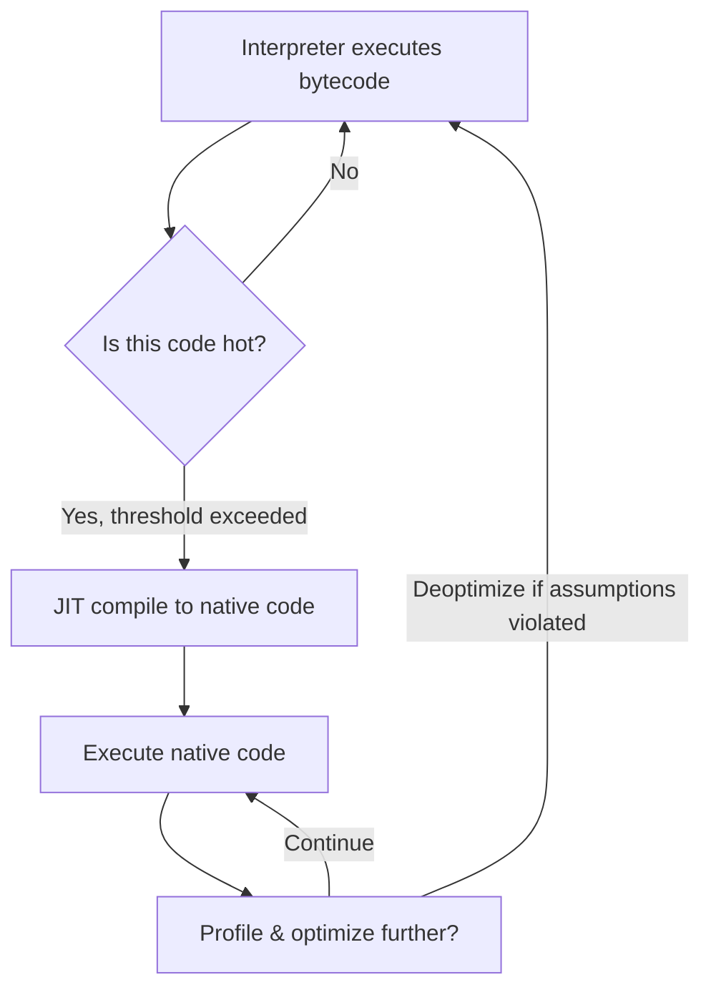

# JIT Compilation

**Just-In-Time (JIT) compilation** translates code to machine instructions *during program execution*, rather than before. JIT compilers combine the portability of interpreters with the performance of compiled code.

## How JIT Works

A JIT compiler observes the running program, identifies frequently-executed code paths (**hot paths**), and compiles them to native machine code on the fly.



### Key Techniques

| Technique | Description |
---|---|
**Hot-spot detection** | Count method calls or loop back-edge jumps; compile when threshold is crossed |
**Profile-guided optimization (PGO)** | Collect runtime type frequencies, branch probabilities, call targets at runtime |
**Speculative optimization** | Optimize based on observed types (e.g., "x is always an integer") with guards to deoptimize if wrong |
**On-stack replacement (OSR)** | Switch from interpreted to compiled code mid-execution (e.g., inside a long loop) |
**Deoptimization** | Revert to interpreter when a speculative assumption is violated ("bailout") |

## Major JIT Implementations

### JVM HotSpot

Oracle's HotSpot JVM uses a **tiered compilation** strategy:

| Tier | Compiler | Characteristics |
---|---|---|
Tier 0 | Interpreter | Bytecode interpretation, profiling |
Tier 1 | C1 (Client) | Quick, lightweight compilation; less aggressive optimization |
 Tier 2 | C2 (Server) | Heavyweight optimization; inlining, escape analysis, loop unrolling |

HotSpot collects profiling: branch frequencies, type profiles at call sites, and null-check patterns. C2 uses this for aggressive speculative optimizations.

### V8 (JavaScript)

V8 has evolved through several architectures. The current **Sparkplug + TurboFan** pipeline:

1. **Ignition**: Bytecode interpreter with profiling counters.
2. **Sparkplug**: Fast, baseline JIT (no optimization, but native code from bytecode — eliminates interpreter dispatch overhead).
3. **TurboFan**: Optimizing JIT compiler. Builds a sea-of-nodes IR, applies type-feedback-driven optimizations, and generates machine code.

```bash
# View V8 optimization status (from Node.js)
node --trace-opt script.js    # which functions are JIT-compiled
node --trace-deopt script.js  # which functions deoptimize
```

### PyPy

PyPy is a JIT-compiled Python interpreter. It uses a **tracing JIT**: instead of compiling whole methods, it records frequently-executed **loops** (linear traces of bytecode) and compiles those traces to machine code. This is effective for Python's dynamic nature.

### LLVM JIT (ORC JIT)

LLVM's **ORC JIT** APIs allow embedding LLVM as a JIT in any application:

```cpp
#include "llvm/ExecutionEngine/Orc/LLJIT.h"

auto JIT = LLJITBuilder().create();
// Add a module (IR) to the JIT
auto& JD = JIT->getMainJITDylib();
JIT->addIRModule(ThreadSafeModule(std::move(module), context));
// Look up and call a function
auto Sym = JIT->lookup("main");
auto *MainFn = (int(*)())Sym->getAddress();
int result = MainFn();
```

Used by Julia, PyTorch, and various game engines for runtime code generation.

## AOT vs. JIT Trade-offs

| Criterion | AOT (Ahead-of-Time) | JIT (Just-In-Time) |
---|---|---|
**Startup time** | Fast (code already compiled) | Slower (warm-up phase) |
**Peak performance** | Good, but limited by static info | Potentially higher (uses runtime profiles) |
**Binary size** | Larger (all code compiled) | Smaller (only bytecode shipped) |
**Memory at runtime** | Lower (no compiler in memory) | Higher (JIT compiler resident) |
**Dynamic features** | Limited (reflection, eval hard) | Full support (compile new code at runtime) |
**Portability** | Must compile per target | Bytecode portable; JIT adapts to host |
**Examples** | GCC, rustc, Go | HotSpot, V8, PyPy, .NET CoreJIT |

### The Middle Ground: Profile-Guided Optimization (PGO)

AOT compilers can borrow JIT ideas by running the program with instrumentation, collecting profiles, and recompiling with that data:

```bash
# GCC PGO workflow
gcc -fprofile-generate -O2 -o app train.c     # Step 1: instrumented build
./app <workload>                                # Step 2: collect profiles (gcda files)
gcc -fprofile-use -O2 -o app_optimized app.c   # Step 3: recompile with profiles
```

## References

- JVM Architecture: <https://docs.oracle.com/en/java/javase/17/vm/java-virtual-machine-technology-overview.html>
- V8 Architecture: <https://v8.dev/blog>
- PyPy JIT: <https://doc.pypy.org/en/latest/jit.html>
- LLVM ORC JIT: <https://llvm.org/docs/ORCv2.html>

## Interview Questions

1. **What is JIT compilation and when is it useful?** JIT compiles code to native machine instructions at runtime. Useful when you want portability (ship bytecode) but need native performance, and when runtime profiling data enables optimizations impossible at compile time.
2. **What is deoptimization?** When a JIT's speculative optimization is invalidated (e.g., a variable that was always an integer suddenly becomes a string), the compiled code "bails out" back to the interpreter. This is necessary for correctness.
3. **Compare AOT and JIT compilation.** AOT has faster startup and no runtime overhead; JIT can achieve higher peak performance through profile-guided optimization. JIT supports dynamic features (eval, dynamic code loading) that AOT cannot.
4. **What is tracing JIT vs. method JIT?** A method JIT compiles entire functions/methods (HotSpot C2, TurboFan). A tracing JIT records and compiles hot linear execution traces (loops), which works better for dynamic languages (PyPy).
5. **How does tiered compilation work?** Start with interpretation (or a fast non-optimizing JIT), collect profiling data, then compile hot code with an optimizing JIT. This balances startup speed with peak performance.
