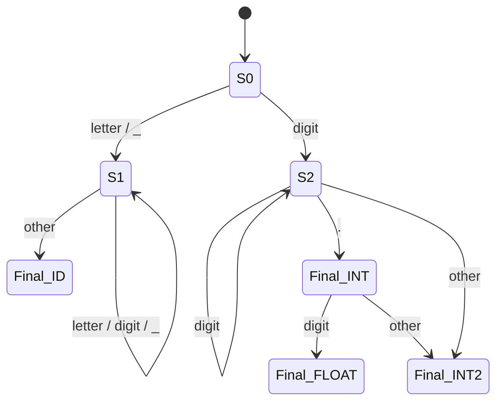

# Lexical Analysis

Lexical analysis (or **lexing**) is the first phase of compilation. It reads the raw source text and produces a stream of **tokens** — the smallest meaningful units recognized by the language grammar.

## Tokens

A token is a pair `(type, lexeme)` where:

- **Type** (or token class): `INT_LITERAL`, `IDENTIFIER`, `PLUS`, `IF`, `LPAREN`, etc.
- **Lexeme**: the actual character sequence from the source (`"42"`, `"x"`, `"+")`.

The lexer typically discards **whitespace** and **comments**, though some compilers retain comments for documentation generation.

| Token Type | Example Lexemes |
|---|---|
| `INT_LITERAL` | `42`, `0xFF`, `0b1010` |
| `FLOAT_LITERAL` | `3.14`, `1.0e-5` |
| `IDENTIFIER` | `count`, `_tmp`, `main` |
| `KEYWORD` | `if`, `while`, `return` |
| `OPERATOR` | `+`, `==`, `<=`, `&&` |
| `DELIMITER` | `(`, `)`, `{`, `;`, `,` |

## Regular Expressions for Lexing

Each token class is described by a **regular expression**:

```
INT_LITERAL   →  [1-9][0-9]* | 0[0-7]* | 0[xX][0-9a-fA-F]+
FLOAT_LITERAL →  [0-9]+\.[0-9]*([eE][+-]?[0-9]+)?
IDENTIFIER   →  [a-zA-Z_][a-zA-Z_0-9]*
KEYWORD      →  "if" | "else" | "while" | "return" | "int" | ...
OPERATOR     →  "+" | "-" | "*" | "/" | "==" | "!=" | ...
WHITESPACE   →  [ \t\n\r]+          (skip)
COMMENT      →  "//".*\n | "/\\*"([*\\]|\\*[^/])*"*\\/"  (skip)
```

Keywords are matched as identifiers first, then reclassified. The **longest match** rule resolves ambiguity: `<=` is one `LEQ` token, not `<` followed by `=`.

## Finite Automata

Every regular expression compiles to a **finite automaton**. Lexers use **deterministic finite automata (DFAs)** because they run in O(n) time.



**NFA → DFA conversion** uses the **subset construction** algorithm. The DFA is then minimized via **Hopcroft's algorithm**. Tools like `lex`/`flex` automate this pipeline.

## A Hand-Written Lexer in C

```c
// Minimal lexer for a C-like language
typedef enum {
    TOK_INT_LIT, TOK_IDENT, TOK_PLUS, TOK_MINUS,
    TOK_SEMI, TOK_EOF
} TokenType;

typedef struct {
    TokenType type;
    char lexeme[256];
    int line;
} Token;

Token next_token(const char **src) {
    Token t = {0};
    // skip whitespace
    while (**src == ' ' || **src == '\n') {
        if (**src == '\n') t.line++;
        (*src)++;
    }
    if (**src == '\0') return (Token){.type = TOK_EOF};

    // integer literal
    if (isdigit(**src)) {
        int i = 0;
        while (isdigit(**src))
            t.lexeme[i++] = *(*src)++;
        t.lexeme[i] = '\0';
        t.type = TOK_INT_LIT;
        return t;
    }
    // identifier / keyword
    if (isalpha(**src) || **src == '_') {
        int i = 0;
        while (isalnum(**src) || **src == '_')
            t.lexeme[i++] = *(*src)++;
        t.lexeme[i] = '\0';
        t.type = TOK_IDENT;
        return t;
    }
    // single-character tokens
    t.lexeme[0] = *(*src)++;
    t.lexeme[1] = '\0';
    t.type = (t.lexeme[0] == '+') ? TOK_PLUS :
             (t.lexeme[0] == '-') ? TOK_MINUS :
             (t.lexeme[0] == ';') ? TOK_SEMI : TOK_EOF;
    return t;
}
```

## Lexer Generators: lex / flex

`flex` takes a `.l` file and generates a C lexer:

```lex
%{
#include "parser.tab.h"  /* token definitions from bison */
%}

%%
[0-9]+          { yylval.ival = atoi(yytext); return INT_LITERAL; }
[a-zA-Z_][a-zA-Z_0-9]* { yylval.sval = strdup(yytext); return IDENTIFIER; }
"+"            { return PLUS; }
"-"            { return MINUS; }
";"            { return SEMICOLON; }
[ \t\n]+       { /* skip */ }
.              { fprintf(stderr, "Unexpected: %s\n", yytext); }
%%
```

The generated `yylex()` function implements the DFA and returns token types to the parser.

## Key Concepts

| Concept | Description |
|---|---|
| **Maximal munch** | Always match the longest possible lexeme |
| **Lookahead** | One character of lookahead is sufficient for regular languages |
| **Buffering** | Lexers use two-buffer schemes to avoid per-character I/O |
| **Error handling** | Report unexpected characters with source location |

## References

- Dragon Book, Chapter 3: Lexical Analysis
- Flex Manual: <https://westes.github.io/flex/manual/>

## Interview Questions

1. **What is the difference between a token and a lexeme?** A token is the category (e.g., `INT_LITERAL`); the lexeme is the actual text (e.g., `"42"").
2. **Why do lexers use DFAs instead of regular expressions directly?** Direct regex matching can have exponential backtracking. DFAs guarantee O(n) per character.
3. **What is the "maximal munch" rule?** The lexer always matches the longest possible prefix. `123abc` is one invalid token attempt, not `123` + `abc`, unless the grammar specifies a boundary.
4. **How would you handle string literals with escape sequences?** Maintain a state in the DFA for "inside string" and "after backslash" to correctly lex `\"`, `\\n`, etc.
5. **Why are keywords not separate regex rules in most lexer generators?** Identifiers match all keywords. The lexer returns `IDENTIFIER` and the parser (or a keyword lookup table) distinguishes `if` from a variable name.
