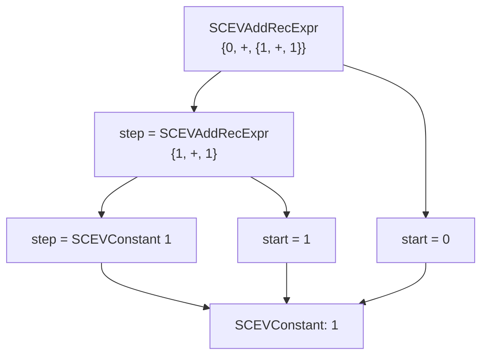
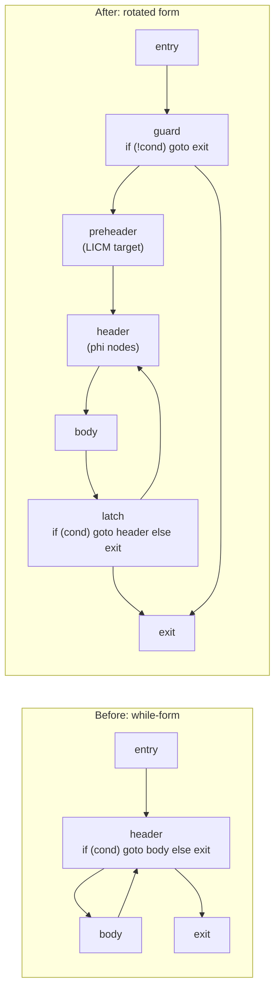

# Loop Optimizations Deep Dive

A modern compiler spends most of its optimization budget on loops. The five topics on this page — **Scalar Evolution (SCEV)**, **loop rotation**, **loop peeling**, **Loop-Closed SSA (LCSSA)**, and **software pipelining / modulo scheduling** — are the *internal* machinery that makes the more visible transformations (unrolling, vectorization, interchange, tiling, fusion) actually work. They are rarely described in undergraduate compilers courses, which stop at the level of *what* each transformation does; this page is about *how the compiler proves them safe and emits them efficiently*. SCEV supplies the algebra of induction variables that the LoopVectorizer needs to compute trip counts and check dependence. Loop rotation produces the canonical single-back-edge form that every subsequent loop pass assumes. Loop peeling splits off the boundary iterations so the vectorizer can assume alignment and divisibility. LCSSA confines every value defined inside a loop to that loop, so transformations can move instructions without rewriting code downstream. Software pipelining overlaps consecutive iterations to hide functional-unit latency, which classical unrolling cannot do. Together they form the substrate on which all of LLVM's and GCC's aggressive loop work is built.

> Related: [Intermediate Representation & Optimization](./intermediate-representation.md) (SSA, phi nodes, dominance frontiers), [Code Generation & Linking](./code-generation.md) (instruction selection, register allocation), [JIT Compilation](./jit-compilation.md) (loop back-edge counters drive hot-spot detection), [Partial Evaluation & MLIR](./partial-evaluation-mlir.md) (progressive lowering of loop dialects), [SIMD](../arch/parallelism/simd.md), [AVX](../arch/parallelism/avx.md) (vectorization backends), [Compiler Optimizations](../dsa/chapters/ch129-compiler-optimizations.md), [Clang/LLVM](../linux/compilers/clang-llvm.md)

## Loop Transformation Taxonomy

The [`intermediate-representation.md`](./intermediate-representation.md) page lists the four "headline" loop optimizations (unrolling, invariant code motion, induction variable simplification, vectorization). This page covers the *internal* passes that make those four safe and effective. Before diving into the internals, the table below situates every common loop transformation along three axes: what it does structurally, when it fires, and what its code-size vs. performance trade-off looks like. The transformations on this page (rotation, peeling, LCSSA, SW pipelining) are predominantly *enabling* passes — they restructure the IR so other passes become applicable or cheaper.

| Transformation | What it does | When used | Code size | Perf impact |
|---|---|---|---|---|
| **Loop rotation** | Rewrite `while (c) {body}` as `if (c) { do {body} while (c) }` | Always (canonical form for downstream passes) | Neutral | Enables LICM, unrolling |
| **Loop peeling** | Split first/last N iterations into separate code | Misalignment, remainder loops, PGO hot/cold | Grows | Enables vectorizer; removes guards |
| **Loop unrolling** | Replicate body U times, reduce trip count by U | Tight inner loops, ILP exposure | Grows | Hides branch latency; ILP |
| **Loop interchange** | Swap nesting order of two loops | Cache-friendly access, vectorizable inner loop | Neutral | Cache locality; vectorization |
| **Loop tiling** | Cut iteration space into blocks | Cache reuse, blocking for L1/L2 | Grows | Big cache wins on stencils |
| **Loop fusion** | Merge adjacent loops with same trip count | Reduce loop overhead, enable reuse | Shrinks | Locality, fewer dispatches |
| **Loop fission** | Split one loop into many | Reduce register pressure, distribute dependencies | Grows | Register pressure relief |
| **Loop distribution** | Split loop with independent stmts into multiple | Enable vectorization of parts | Grows | Vectorize the vectorizable part |
| **Loop vectorization** | Pack N iterations into SIMD lanes | Innermost loops, no cross-iteration dep | Neutral/Grows | N× throughput on SIMD HW |
| **Software pipelining** | Overlap iterations in time (modulo schedule) | Innermost FP/int loops, deep pipelines | Grows | Hides latency, ILP |

The taxonomy distinguishes *structural* rewrites (rotation, peeling, unrolling, fission, fusion) from *semantic* rewrites (interchange, tiling, distribution, vectorization, SW pipelining). Structural rewrites preserve iteration order; semantic rewrites change it. SCEV and LCSSA are the analyses that make the semantic rewrites provably correct — without them, the compiler cannot tell whether reordering iterations changes the program's result. The pipeline ordering in LLVM reflects this distinction: structural passes (LoopSimplify, LCSSA, LoopRotate) run first to produce the canonical IR shape, then SCEV is computed on that canonical form, and finally the semantic passes (LICM, LoopUnroll, LoopVectorizer, MachinePipeliner) consume SCEV's results. Reversing this ordering — running the vectorizer before rotation, say — produces incorrect or pessimal code because the downstream passes make assumptions about loop structure that only the canonical form satisfies.

The table also reveals a key cost asymmetry: most structural passes are *size-neutral* (rotation) or *size-shrinking* (fusion), while most semantic passes are *size-growing* (peeling, unrolling, tiling, SW pipelining). The size growth is bounded by the unroll factor, peel count, tile size, or pipeline depth — all quantities that the compiler chooses based on profile data or static heuristics. The size-shrinking passes are nearly always profitable, while the size-growing passes are gated by profitability heuristics that compare the expected speedup against the code-size cost, typically with a threshold tied to `-Os` vs. `-O2` vs. `-O3`. The LoopVectorizer in particular uses a sophisticated cost model that combines SCEV-derived trip counts with target-specific vector instruction costs to decide whether vectorization is profitable at all.

## Scalar Evolution (SCEV)

**Scalar Evolution** is LLVM's framework for analyzing *recurrence relations* over scalar values in loops. It answers the question: "given the value of `i` on iteration 0, what is its value on iteration `k`?" without actually running the loop. The framework was introduced into LLVM by the chains-of-recurrences work of Bachmann, Wang, and Zima (1994) and matured in the late 2000s; it is documented in the LLVM `ScalarEvolution.h` doxygen and was the subject of the 2009 LLVM Developer Meeting talk *Scalar Evolution and Loop Optimization*. SCEV is the analytical backbone behind trip-count computation, dependence analysis, induction variable simplification, loop delinearization, and the legality checks performed by the LoopVectorizer. Without SCEV, the vectorizer would have to fall back to per-instruction pattern matching, which is fragile and incomplete. The framework's design is that of a small algebra over a closed-form expression language: every analyzed value reduces to a tree of constants, unknowns, and recurrences, and queries on that tree (subtraction for dependence, modulo for divisibility, evaluation at iteration k for trip counts) are answered by structural recursion.

### SCEV Construction Algorithm

SCEV is computed lazily by the `ScalarEvolution` analysis, which is an LLVM `AnalysisInfoMixin` that caches its results on the function. The entry point is `SCEV *ScalarEvolution::getSCEV(Value *V)`, which returns the recurrence expression describing `V`'s value as a function of the surrounding loops. The construction is recursive: `getSCEV` inspects `V`'s defining instruction and dispatches to a specialized builder — `createSCEV` for arithmetic instructions, `createNodeForPHI` for phi nodes (where induction variables live), and `createNodeForLoad`/`createNodeForGEP` for memory-related values. Each builder either returns a cached result or recursively calls `getSCEV` on the operands, composing them via `getAddExpr`, `getMulExpr`, `getAddRecExpr`, or `getUDivExpr`. The cache is keyed on the `Value*` and invalidated lazily when the underlying IR changes, so subsequent passes can re-query cheaply.

The algorithm's correctness rests on the dominance structure of SSA: every operand of an instruction dominates that instruction, so the SCEV of an instruction can be composed from the SCEVs of its operands, which have already been computed. The only complication is phi nodes in loop headers, where the phi's value depends on which predecessor block control came from. SCEV handles this by checking whether the phi is an *induction phi* — i.e., one of its incoming values is itself (possibly transformed by a chain of add/mul instructions in the latch) and the other is the loop's start value. If so, the phi becomes an `SCEVAddRecExpr` with `start = getSCEV(entry_value)` and `step = getSCEV(latch_value) - getSCEV(phi)`. If not, SCEV falls back to `SCEVUnknown`. The algorithm is therefore sound (never wrong) but incomplete (gives up on phis it cannot pattern-match as inductions).

### Chains of Recurrences

A **chain of recurrences** is a compact notation for an integer or floating-point function of the loop counter. The simplest form is the **add recurrence**, written \\( \\{s, +, c\\} \\), which denotes the sequence \\( s, s + c, s + 2c, s + 3c, \\ldots \\) — i.e., a value that starts at \\( s \\) and increases by \\( c \\) every iteration. The **multiplicative recurrence** \\( \\{s, *, c\\} \\) denotes \\( s, s \\cdot c, s \\cdot c^2, \\ldots \\), which captures geometric progressions (rare in real code, but useful for `i = i * 2`). Chains can be nested to express polynomial recurrences: \\( \\{0, +, \\{1, +, 1\\}\\} \\) is \\( 0, 1, 3, 6, 10, \\ldots \\) — the triangular numbers, which arise from nested loops such as `for (i=0..n) for (j=0..i) sum += ...`. The recurrence is **affine** when it is a chain of add-recurrences of depth ≤ 2 (i.e., linear in the loop counter); it is **non-affine** when it involves multiplication, division, or data-dependent control flow. SCEV's power comes from the fact that *most loop induction variables in real C/C++ code are affine*, so the framework can answer most queries in closed form.



### SCEV Operands

LLVM represents chains of recurrences as a small algebra of `SCEV` types. The leaves are `SCEVConstant` (a compile-time integer, e.g., the literal `1` in `{0, +, 1}`) and `SCEVUnknown` (a value SCEV cannot analyze further — typically a pointer, an argument, or a value defined outside the loop). Composites are `SCEVAddExpr` (sum of SCEVs, normalized to a sorted canonical form so additions commute), `SCEVMulExpr` (product, similarly normalized), `SCEVUDivExpr` (unsigned division, used for trip-count computation), and `SCEVAddRecExpr` (the add-recurrence: a start, a step, and the loop it varies with). The `SCEVAddRecExpr` is the heart of the framework; every induction variable becomes one. SCEV queries are memoized and cached on the `ScalarEvolution` analysis, so the cost of asking `getAddRecExpr(loop, start, step)` repeatedly is amortized. The framework also computes **exit values** (the value of a recurrence when the loop exits — used to forward-substitute the final value of an induction variable) and **trip counts** (the number of times the back-edge is taken, derived by inverting the recurrence's closed form and solving for the loop's exit condition).

### SCEV vs. Classical Induction Variable Analysis

| Aspect | Classical IV analysis | SCEV |
|---|---|---|
| **Representation** | Per-instruction pattern matching | Closed-form recurrence algebra |
| **Variables handled** | Linear `i = i + c` only | Polynomial chains of any depth |
| **Trip count** | Heuristic, often uncomputable | Closed form via recurrence inversion |
| **Multi-loop induction** | Per-loop, no composition | Composes across nested loops |
| **Pointer arithmetic** | Special-cased, fragile | First-class (via `SCEVUnknown`) |
| **Cost model** | None | Complexity bound on recurrence depth |
| **Used by** | Old GCC `loop.c`, simple JITs | LLVM LoopVectorizer, Polly, LoopUnroll |
| **Failure mode** | "Not an induction variable" | Falls back to `SCEVUnknown` gracefully |

The classical approach (used by GCC's `loop.c` circa 1990s and by many JITs) pattern-matches `i = i + c` at each instruction. It works for trivial counters but cannot reason about `j = i * 2` derived from `i = i + 1`, nor about the trip count of `while (i < n) i += 3;`. SCEV handles both: `j` becomes `SCEVMulExpr(SCEVAddRecExpr(0, 1), 2)`, and the trip count is `((n - 0) + 3 - 1) / 3` once SCEV has solved the recurrence. The graceful fallback to `SCEVUnknown` means SCEV never crashes or returns "I don't know" silently — it returns an opaque wrapper that downstream passes can treat as a black box.

### Example: LLVM IR Before and After SCEV

```llvm
; Source: for (int i = 0; i < n; i++) a[i] = a[i] * 2 + 1;
define void @scale(i32* %a, i32 %n) {
entry:
  br label %loop

loop:
  %i = phi i32 [ 0, %entry ], [ %i.next, %loop ]
  %p = getelementptr i32, i32* %a, i32 %i
  %v = load i32, i32* %p
  %v2 = mul i32 %v, 2
  %v3 = add i32 %v2, 1
  store i32 %v3, i32* %p
  %i.next = add i32 %i, 1
  %cmp = icmp slt i32 %i.next, %n
  br i1 %cmp, label %loop, label %exit

exit:
  ret void
}
```

After SCEV runs, the analyzer has computed:
- `%i` = `SCEVAddRecExpr({0, +, 1}, loop=loop)` — i.e., starts at 0, increments by 1
- `%i.next` = `SCEVAddRecExpr({1, +, 1}, loop=loop)`
- Trip count = `max(0, %n)` (closed form, since `%n` is `SCEVUnknown`)
- `%p` = `SCEVAddRecExpr({%a, +, 4}, loop=loop)` (pointer recurrence with stride 4 bytes)
- `%v3 = 2*%v + 1` is *not* a recurrence (its operands are loaded values, not induction variables)

The LoopVectorizer now asks SCEV two questions: (a) Is the loop's trip count divisible by the chosen vector width `VF`? (b) Is the load/store pointer `%p` aligned to `VF * sizeof(i32) = 16` bytes at the start of the main loop? Both reduce to SCEV queries: (a) asks whether `SCEVAddRecExpr({0, +, 1})`'s trip count modulo `VF` is zero, which SCEV answers as `(%n % VF) == 0` symbolically; (b) asks whether `%a`'s `SCEVAddRecExpr({%a, +, 4})` has a start divisible by 16, which SCEV answers by checking the constant-foldable alignment of `%a`. If either answer is "no" modulo the chosen `VF`, the vectorizer requests peeling (see [Loop peeling](#loop-peeling) below) to fix the misalignment or remainder. Without SCEV's closed-form answers, the vectorizer would have to emit dynamic checks at runtime, which would themselves cost cycles and defeat the purpose of vectorization.

### Applications and Limitations

SCEV's primary applications are: (1) **trip count computation** — the LoopVectorizer needs to know whether the trip count is divisible by the vector width; (2) **dependence analysis** — given two memory accesses in the same loop, SCEV can compute whether their addresses ever overlap by subtracting their recurrences and checking the sign; (3) **induction variable simplification** — multiple derived IVs (`i`, `4*i`, `i+1`) can be replaced by a single canonical IV plus a constant offset, reducing register pressure; (4) **delinearization** — recovering multi-dimensional array indexing from flat pointer arithmetic, which is required for polyhedral transformations; (5) **loop bounds rewriting** — transforming `for (i=0; i<n; i++)` into `for (i=0; i != n; i++)` so the comparison is a cheaper `==` than `<`. SCEV's **limitations** are equally important: it cannot reason about non-affine recurrences (e.g., `i = i * i`), about values that depend on data-dependent control flow inside the loop (the recurrence must be loop-invariant in its step), or about pointer arithmetic that goes through `bitcast` or `inttoptr` in non-obvious ways. SCEV also gives up on loops with multiple exits (the trip count becomes ill-defined) and on loops with `volatile` or atomic accesses. The framework's design philosophy is to be *sound* — never return a wrong answer — at the cost of returning `SCEVUnknown` conservatively when in doubt.

### SCEV vs. Polyhedral Representations

SCEV's recurrence algebra overlaps with the **polyhedral model** used by Polly, Pluto, and other polyhedral optimizers, but the two frameworks represent loops differently. The polyhedral model represents each statement's iteration domain as a set of affine constraints on integer iteration vectors (e.g., `0 <= i < N && 0 <= j < M`), and each access as an affine function of the iteration vector. SCEV, by contrast, represents each *value* as a recurrence over the loop counter, without explicitly tracking the iteration domain. The polyhedral model is more expressive (it can represent non-rectangular iteration spaces and complex access patterns), but it is also more expensive to compute with — polyhedral dependence analysis requires integer linear programming, which is NP-hard in general.

| Aspect | SCEV | Polyhedral model |
|---|---|---|
| **Representation** | Recurrence per value | Iteration domain + access function per statement |
| **Cost of analysis** | Polynomial (memoized) | NP-hard (ILP) in general |
| **Iteration space** | Implicit (loop bounds) | Explicit (affine constraints) |
| **Access patterns** | Affine pointer arithmetic | Affine functions of iteration vector |
| **Handles conditionals in loop body?** | Yes (degrades to `SCEVUnknown`) | Only if affine (otherwise gives up) |
| **Used by** | LoopVectorizer, LSR, LICM, LoopUnroll | Polly, Pluto, Graphite (GCC) |
| **Production status** | Always-on in LLVM | Optional in LLVM (Polly), experimental in GCC (Graphite) |

The two frameworks are complementary: SCEV handles the common case (single loops with affine induction variables) cheaply, while polyhedral frameworks handle the harder case (multi-loop nests with non-trivial access patterns) at higher cost. LLVM's Polly uses SCEV to perform delinearization (recovering multi-dimensional access), then builds a polyhedral model on top of that delinearized representation. The split is pragmatic: SCEV runs on every loop because it's cheap, while Polly runs only on loops it judges worth the polyhedral overhead.

### Loop Strength Reduction: A Major SCEV Consumer

**Loop Strength Reduction (LSR)** is the pass that consumes SCEV most heavily after the LoopVectorizer. LSR's goal is to replace expensive addressing arithmetic with cheaper forms on targets where address computation has a non-trivial cost. On x86-64, for example, a `getelementptr` followed by a `load` can be folded into a single `mov rax, [base + idx*4]` instruction — but only if the index's recurrence is in a form the addressing mode can express. LSR walks every induction variable SCEV identifies and rewrites it into the cheapest form the target supports. For the loop above, LSR might replace `%i = {0, +, 1}` with `%p = {%a, +, 4}` (a pointer recurrence) and use `%p` directly as the load address, eliminating the `getelementptr` entirely. The transformed IR uses one fewer register and one fewer add per iteration.

LSR is also responsible for *reusing* induction variables across multiple uses. If a loop has both `a[i]` and `b[i]` accesses, the original IR has two `getelementptr` instructions, each with its own pointer recurrence. LSR recognizes that both pointers stride by their element size, and can compute one from the other via a constant offset, reducing the number of live induction variables. The cost model is target-specific: on x86-64, LSR prefers pointer recurrences (because of `[base + idx*scale]` addressing); on ARM, it may prefer integer recurrences (because ARM's addressing modes are more restricted). LSR is one of the reasons LLVM produces noticeably tighter inner-loop code than GCC on some benchmarks — the SCEV algebra gives LSR a much richer optimization space than GCC's per-instruction IV analysis.

### Delinearization: Recovering Multi-Dimensional Access

SCEV also powers **delinearization**, the process of recovering multi-dimensional array indexing from flat pointer arithmetic. Consider the C code `int a[N][M]; for (i=0; i<N; i++) for (j=0; j<M; j++) a[i][j] *= 2;` — after lowering, the access becomes `a_base + i*M + j`, a flat pointer offset. SCEV computes the inner-loop recurrence `SCEVAddRecExpr({a_base + i*M, +, 1})` and the outer-loop recurrence `SCEVAddRecExpr({a_base, +, M})`. The delinearization pass inspects these recurrences, recognizes the nesting (the inner recurrence's start depends on the outer induction variable), and emits a *multi-dimensional access descriptor*: `Base = a_base, Strides = {M, 1}, Indices = {i, j}`. This descriptor is what polyhedral transformations (loop interchange, tiling, fusion) operate on — without delinearization, the polyhedral framework cannot tell that `a[i][j]` is a 2D access rather than two independent 1D accesses.

Delinearization is fragile in the presence of casts, structs with non-trivial layout, or arrays with non-constant strides. SCEV handles the common case (C/C++ arrays of scalars or fixed-size structs) reliably, but falls back to `SCEVUnknown` for unusual layouts. The Polly polyhedral optimizer in LLVM relies on SCEV's delinearization to build its dependence model; when SCEV gives up, Polly gives up on that loop and leaves it unoptimized. This is one reason why Polly is effective on dense linear-algebra code but less so on sparse or irregular data structures.

### Induction Variable Simplification and Canonicalization

A direct consumer of SCEV is **induction variable simplification** (IVS, the `IndVarSimplify` pass in LLVM). IVS walks every loop, queries SCEV for each induction variable, and rewrites the loop to use a single *canonical* induction variable — typically one that starts at 0 and increments by 1 — plus derived offsets computed from SCEV's algebra. For example, a loop with three induction variables `i = 0..n`, `j = 4*i`, and `k = i+1` is rewritten to use only `i` (the canonical IV); the values of `j` and `k` are computed on demand as `4*i` and `i+1` at their use sites. This reduces register pressure (only one IV register is live) and simplifies downstream analyses (the LoopVectorizer only needs to reason about one IV).

IVS also rewrites loop exit conditions into a canonical form: instead of `while (i < n)`, the loop becomes `while (i != n)`, with `n` adjusted if necessary. The reason is that `!=` comparisons are cheaper than `<` comparisons on many targets (a single equality test rather than a signed comparison), and they compose better with vectorization (the vectorizer can compute `n - peel` once and check `i != n - peel` in the latch). SCEV's algebra makes this rewrite sound: it proves that the two forms are equivalent on the loop's trip count, even when `n` is not statically known. Without SCEV, this kind of rewrite would require per-instruction pattern matching that misses derived IVs.

### Loop Idiom Recognition

**Loop idiom recognition** (`LoopIdiomRecognize` in LLVM) is another SCEV-heavy pass. It scans loops for *idioms* — common patterns that have a more efficient target-specific implementation — and replaces them with calls to library functions or intrinsic operations. The canonical example is a loop that counts set bits: `for (i=0; i<n; i++) count += (a[i] != 0);` is recognized by SCEV as having a recurrence through `count` with a step that depends on a comparison. LoopIdiomRecognize replaces the loop with a call to `__builtin_popcount` (or the target's hardware popcount instruction), which is dramatically faster on targets that have one.

Other idioms recognized by the pass include memset/memcpy patterns (a loop that initializes an array to zero becomes a `llvm.memset` intrinsic), and bit-test patterns (a loop that checks bits in a word becomes a `llvm.ctpop` or `llvm.cttz` intrinsic). SCEV's role is to prove that the loop's recurrence matches the idiom's expected form — for example, that the `count += (a[i] != 0)` recurrence has step 0 or 1 and that the comparison's operand is loop-invariant in the relevant sense. Without SCEV, the pass would have to pattern-match the IR directly, which is fragile across front-end variations. The same SCEV expression that the LoopVectorizer uses to compute trip counts powers idiom recognition, illustrating the value of a shared analytical foundation.

## Loop Rotation

**Loop rotation** is a structural rewrite that converts a `while`-form loop into a `do-while`-form loop with an entry guard. The transformation is described in LLVM's *LoopTerminology* documentation as the canonical form expected by every downstream loop pass. A `while`-form loop has its condition check *before* the body, which means the loop body might never execute; a `do-while`-form loop has its condition check *after* the body, which means the body executes at least once (unless the entry guard skips the loop entirely). The canonical rotated form has: a **preheader** (the block immediately before the loop, with a single successor into the header), a **header** (the single entry point of the loop, where phi nodes live), the **body**, a **latch** (the single back-edge block whose terminator is a conditional branch that either exits or returns to the header), and the **exit blocks**. The latch being a conditional branch on the loop's continuation condition is the key property — it gives every downstream pass a single, well-defined place to inspect the loop's trip test.

### Why Rotation Matters

The `while`-form has two structural problems that block downstream optimization. First, the condition check at the *top* of the loop means LICM (Loop Invariant Code Motion) cannot easily hoist code out of the loop, because hoisting out of the first iteration is semantically different from hoisting out of subsequent iterations — the hoisted code would execute even if the loop body never runs. Second, the `while`-form has *two* ways to exit (fall through if the condition is false on entry, or branch out after some iterations), which complicates analyses that assume a single back-edge. Rotation fixes both: the entry guard becomes a single conditional branch that skips the entire loop if the condition is false on entry, and the body becomes a `do-while` whose back-edge is a single conditional branch in the latch. After rotation, LICM can hoist invariant code into the preheader knowing it will execute exactly once per loop invocation, and downstream passes have a single back-edge to reason about.

### CFG Before and After Rotation



The transformation is correctness-preserving because the guard exactly mirrors the original condition: if the loop wouldn't have executed at all, the guard sends control to the exit block; otherwise, control enters the preheader and the rotated `do-while` runs. The preheader is the natural hoist target for LICM, the header is where phi nodes live (since it's the loop's single entry point), and the latch is the single back-edge terminator. LLVM's `LoopRotate` pass performs this transformation; it is run early in the loop pass pipeline because nearly every other loop pass assumes the rotated form. Rotation also makes **loop unrolling** simpler: with a `do-while` latch, unrolling by a factor `U` is just `U` copies of the body followed by a single conditional branch, whereas unrolling a `while`-form requires inserting the condition check between every copy of the body.

### LoopSimplify and the Canonical Loop Form

Rotation is one of three passes — together with **LoopSimplify** and **LCSSA** — that produce LLVM's canonical loop form. LoopSimplify guarantees four invariants: (1) the loop has a single preheader (a block outside the loop with a single edge into the header); (2) the loop has a single back-edge (a single block in the loop with an edge back to the header); (3) all blocks in the loop are dominated by the header (so phi nodes live only in the header); (4) all exits from the loop are dominated by the latch (so exit-block phi placement is well-defined). When LoopSimplify cannot satisfy these invariants by simple CFG manipulation, it inserts splitting blocks: a preheader is created by splitting the edge into the header, and a dedicated exit block is created by splitting the edge out of the latch. The result is a loop that downstream passes can navigate by assumption: "the preheader is the unique hoist target," "the latch is the unique back-edge source," "the exit is the unique sink," and so on.

The canonical form matters because every loop pass derives its data structures from it. `LoopBase` (the C++ class wrapping a loop) assumes a single latch when computing trip counts; `DominatorTreeBase` is queried under the assumption that the header dominates the body; `ScalarEvolution` queries the latch's branch to determine the loop's exit condition. If any of these invariants is violated, the analyses return conservative results (`SCEVUnknown`, `TripCount = Unknown`) and the downstream transformations are disabled. This is why the pass pipeline runs LoopSimplify *before* SCEV, *before* LCSSA, *before* rotation — the canonical form is the precondition for everything else.

### Interaction with LCSSA and LICM

Rotation interacts with two other infrastructure passes: **LCSSA** (below) and **LICM**. After rotation, values defined inside the loop are confined by LCSSA, so when LICM hoists an invariant computation to the preheader, it only needs to update the SSA def-use chain within the loop's LCSSA boundary — the outside world sees the value through a single phi in the exit block, which LICM can update atomically. Without LCSSA, hoisting a value out of a loop would require finding every use outside the loop and inserting a phi at every join point, which is O(uses × exit-blocks) work. With LCSSA, the cost is O(1) per hoist. This is why LLVM's pass pipeline runs LCSSA *before* LICM, and runs rotation *before* both — the three passes are co-designed. Rotation, LCSSA, and LICM together form the **canonical loop infrastructure**: rotation guarantees the loop's structural shape, LCSSA guarantees the def-use chain's locality, and LICM performs the actual code motion that those two guarantees make cheap. Without any one of the three, the others degrade.

## Loop Peeling

**Loop peeling** splits the first \\( N \\) or last \\( N \\) iterations of a loop into separate code, leaving a main loop that runs the remaining iterations. Unlike unrolling (which replicates the body *inside* a single loop), peeling produces *multiple distinct loops* — typically a "peel loop" for the boundary iterations and a "main loop" for the bulk. The transformation is documented in LLVM's *LoopTerminology* and exposed in GCC via `-fpeel-loops` (off by default, on at `-O3` for some targets). Peeling is *not* a performance optimization by itself — the peel loop usually runs slower than the main loop because it has a smaller trip count and cannot be vectorized. Its value is *enabling*: by carving off the boundary iterations, peeling lets the main loop assume properties that the boundary iterations would have violated (alignment, divisibility, cold paths). The trade-off is code size — every peel adds a separate copy of the loop body — and the compiler's profitability heuristic weighs this against the expected speedup of the main loop.

### Use Cases

The four canonical use cases for peeling are: (1) **alignment** — if a vectorized loop requires 16-byte-aligned accesses but the actual base pointer may be misaligned, peeling the first few iterations until the pointer becomes aligned lets the main loop assume alignment; (2) **remainder handling** — when the trip count is not divisible by the vectorization factor, peeling the last \\( N \\mod VF \\) iterations lets the main loop have a trip count divisible by \\( VF \\); (3) **runtime check elimination** — if the first iteration performs a one-time check (e.g., a bounds check that, once satisfied for iteration 0, is satisfied for all subsequent iterations), peeling iteration 0 lets the main loop omit the check; (4) **profile-guided hot/cold splitting** — if iteration 0 is much hotter or colder than the bulk (common in steady-state loops with warm-up), peeling lets the optimizer apply different optimization strategies to each part. The vectorizer is by far the biggest consumer of peeling: nearly every auto-vectorized loop in production code has been peeled by 1–3 iterations to satisfy alignment and remainder constraints.

### Peeling vs. Unrolling vs. Fission

| Aspect | Loop peeling | Loop unrolling | Loop fission |
|---|---|---|---|
| **Structural effect** | Splits first/last N iters into separate loops | Replicates body U times inside one loop | Splits one loop's body into multiple loops |
| **Trip count change** | Main loop shrinks by N | Same loop, fewer iterations | Each new loop has same trip count |
| **Primary motivation** | Alignment, remainder, guards | ILP, branch overhead | Register pressure, distribution |
| **Code size** | Grows modestly (small peel loop) | Grows linearly with factor | Grows by loop overhead × #fission parts |
| **Profile-guided?** | Yes (PGO hot/cold) | Sometimes (unroll heuristics) | Rarely |
| **Triggered by** | Vectorizer, alignment analysis | Manual `#pragma unroll`, `-funroll-loops` | Compiler when register pressure too high |
| **Reversible?** | Yes (peel can be inlined back) | Yes (unroll can be folded) | Hard (loses statement grouping) |

The three transformations look superficially similar — they all "split" loops — but they serve different goals. Peeling carves off *iterations*, unrolling replicates the *body* within a single iteration, and fission splits the *body across multiple loops* with the same iteration count. Peeling and unrolling are often composed: a loop might be peeled by 1 to align the pointer, then unrolled by 4 to expose ILP in the main loop, leaving a 1-iteration peel + 4× unrolled main + N%4 remainder.

### Concrete Example: Peeling for Alignment

Consider a vectorizer targeting 4-wide `i32` SIMD (16-byte alignment required) faced with a loop whose base pointer `%a` is dynamically aligned to 4 bytes but not to 16. Without peeling, the vectorizer must either emit unaligned accesses (slower on many targets) or refuse to vectorize. With peeling, the vectorizer asks SCEV: "How many iterations until `%p` (the load pointer) becomes 16-byte aligned?" SCEV answers with a closed form: `%p` is `SCEVAddRecExpr({%a, +, 4})`, and `%p` is 16-byte aligned when `(%a + 4*i) % 16 == 0`, i.e., when `i == (16 - %a % 16) / 4`. The peeler splits off that many iterations (at most 3) into a scalar peel loop, leaving a main loop whose first load is guaranteed 16-byte aligned.

```llvm
; Before peeling: single loop, %a may be 4-byte but not 16-byte aligned
loop:
  %i = phi i32 [ 0, %entry ], [ %i.next, %loop ]
  %p = getelementptr i32, i32* %a, i32 %i
  %v = load i32, i32* %p, align 4
  store i32 %v, i32* %p, align 4
  %i.next = add i32 %i, 1
  %cmp = icmp slt i32 %i.next, %n
  br i1 %cmp, label %loop, label %exit

; After peeling (peel count = 2 assumed for illustration):
;   peel loop runs iterations 0,1 with align 4 (scalar)
;   main loop runs iterations 2..n with align 16 (vectorizable)
peel.loop:
  ; ... scalar code, %p align 4 ...
main.loop:
  ; ... vector code, %p align 16 ...
  ; SCEV has proven: %p = SCEVAddRecExpr({%a + 8, +, 4}), start aligned to 16
```

The peel loop is small (at most `VF - 1` iterations) and runs in scalar mode; the main loop runs the bulk of the work in vector mode. The transformation is only profitable when the trip count `n` is large enough that the peel overhead is amortized — LLVM's peeling heuristic uses a threshold (typically `n > 8` for VF=4) below which peeling is suppressed and the loop is left scalar. Profile data, when available, refines this heuristic: a loop with a hot trip-count distribution of `[0, 4]` is left unpeeled, while one with `[100, 1000]` is always peeled.

### Profile-Guided Peeling and the Vectorizer

When PGO data is available, peeling decisions become profile-driven. If iteration 0 has a hot branch (e.g., a cold-path check that fires only on the first iteration), peeling it off lets the main loop assume the branch is always taken the hot way, which in turn lets the branch predictor and the conditional-move optimizer do their work. The vectorizer is the most aggressive consumer of peeling: it computes the *minimal* peel count that achieves (a) alignment of all memory accesses in the main loop, and (b) a trip count for the main loop divisible by the vectorization factor. The remainder is then either handled by a separate epilogue loop or by a scalar fallback. Modern LLVM (since version 11) also supports **peeling for unrolled vectorization**, where the peel count is chosen so that the main loop can be both vectorized *and* unrolled without remainder — a non-trivial combination that SCEV makes tractable by giving closed-form answers to "is `(N - peel) % (VF × UF) == 0`?" for unknown `N`.

## Loop-Closed SSA (LCSSA)

**Loop-Closed SSA** is a stricter form of SSA in which every value defined inside a loop is used *only* inside that loop. If a value defined inside the loop is needed outside, it is routed through a single phi node in the loop's exit block. The transformation is documented in LLVM's *LoopTerminology#LCSSA* and is a prerequisite for LICM, LoopSimplify, and most other loop passes. The motivation is **locality of transformation**: with LCSSA, a loop pass can move, replace, or delete any instruction inside the loop without touching any code outside the loop, because the only externally-visible interface is the exit-block phi. Without LCSSA, hoisting an instruction out of a loop would require finding every external use and inserting phi nodes at every join point on the way out — a global transformation that defeats the loop pass's locality assumption. LCSSA thus turns loop transformations from global rewrites into local ones, which is essential for the modularity of the loop pass pipeline.

### The LCSSA PHI in Exit Blocks

Concretely, after LCSSA conversion, every value `v` defined inside a loop `L` and used outside `L` is replaced (at the use site) by a phi node `%v.lcssa = phi i32 [ %v, %latch ]` placed in the exit block of `L`. The exit block is unique after LoopSimplify runs, so there is exactly one such phi per escaping value. Inside the loop, `v` is used normally; outside, only `%v.lcssa` is referenced. The transformation is straightforward to apply: walk every instruction in the loop, find uses outside the loop, and insert a phi. The cost is proportional to the number of escaping values, which is typically small (most values defined in a loop are consumed by subsequent iterations or by stores into memory, not by direct external reads).

```llvm
; Before LCSSA:
loop:
  %i = phi i32 [ 0, %entry ], [ %i.next, %loop ]
  %i.next = add i32 %i, 1
  %cmp = icmp slt i32 %i.next, %n
  br i1 %cmp, label %loop, label %exit

exit:
  ret i32 %i.next          ; external use of %i.next, defined inside loop

; After LCSSA:
loop:
  %i = phi i32 [ 0, %entry ], [ %i.next, %loop ]
  %i.next = add i32 %i, 1
  %cmp = icmp slt i32 %i.next, %n
  br i1 %cmp, label %loop, label %exit

exit:
  %i.next.lcssa = phi i32 [ %i.next, %loop ]    ; single exit phi
  ret i32 %i.next.lcssa
```

### Why LCSSA is a Prerequisite for LICM

LICM hoists loop-invariant computations to the preheader and sinks loop-invariant computations to the exit. Without LCSSA, hoisting an instruction `def v` from inside the loop to the preheader would invalidate every use of `v` outside the loop — the preheader dominates the loop body but does not dominate the exit block's successors. With LCSSA, the external use of `v` is replaced by `%v.lcssa` in the exit block; when LICM hoists `def v` to the preheader, it only needs to update the phi `%v.lcssa` to refer to the hoisted def instead of the original. This is an O(1) update per hoist, regardless of how many external uses existed. The same property holds for sinking: an invariant computation can be moved to the exit block, where it sits next to the LCSSA phi. LCSSA is therefore not merely a "nice to have" — it is the structural property that makes LICM's complexity linear in the loop body rather than quadratic in the loop's external uses.

### LCSSA Construction and Preservation

The LCSSA conversion algorithm is straightforward: walk every instruction in the loop, find uses that live outside the loop, and for each such use insert a phi in the appropriate exit block. The exit block is unique (because LoopSimplify has already run), so there is exactly one phi per escaping value. The phi's incoming value is the original def, and its incoming block is the latch. After insertion, every external use is rewritten to reference the phi instead of the original def. The cost is linear in the number of escaping values, which is typically a small constant per loop (most values defined in a loop are consumed by subsequent iterations or by stores into memory, not by direct external reads). The transformation preserves SSA because the phi is in a dominance-frontier position relative to the original def.

The LLVM loop pass manager treats LCSSA as a *preserved analysis*: every loop pass promises either to preserve LCSSA or to re-run it. Most passes (LICM, LoopUnroll, LoopIdiomRecognize, LoopStrengthReduce) preserve it because they only modify the loop body, not the exit block. The few passes that break LCSSA (e.g., LoopUnroll when the unroll factor doesn't divide the trip count, creating multiple exit blocks) must call `formLCSSA` on the affected loops before returning. This contract ensures that any pass entering the loop pipeline can assume LCSSA holds, without paying the conversion cost itself. The same pattern applies to LoopSimplify and to DominatorTree — they are preserved by passes that don't structurally change the loop, and re-computed by passes that do.

### LCSSA vs. SSA

| Property | SSA | LCSSA |
|---|---|---|
| **Single assignment** | Yes | Yes |
| **Phi nodes at join points** | Yes | Yes |
| **Loop-external use of loop-defined value** | Direct | Through exit-block phi |
| **Cost of moving a def across the loop boundary** | O(uses × exit blocks) | O(1) per phi |
| **Required by LICM** | No | Yes |
| **Required by LoopUnroll** | No | Yes (in LLVM) |
| **Strictness** | Standard | Stricter than SSA |
| **Conversion cost** | Dominance frontier computation | Walk loop defs, insert exit phis |

LCSSA is a strict refinement of SSA: every LCSSA program is also an SSA program, but not vice versa. The refinement is *local to a loop* — values that are never used outside their defining loop are unaffected. The conversion is cheap (linear in the number of escaping values) and is preserved by the loop pass manager, which re-runs LCSSA after any pass that might invalidate it. In LLVM, the pass pipeline runs LCSSA once after LoopSimplify and rotation, and preserves it through LICM, LoopUnroll, and LoopIdiomRecognize. The cost of LCSSA's strictness is a slight increase in IR size (one phi per escaping value) and a slight increase in register pressure (the phi itself needs a register), both of which are negligible in practice.

## Software Pipelining / Modulo Scheduling

**Software pipelining** is a loop transformation that overlaps the execution of *multiple iterations* of a loop, so that several iterations are in-flight simultaneously and the latency of long-latency operations (loads, multiplies, divisions) is hidden behind the work of subsequent iterations. The technique was introduced by Monica Lam in her 1988 PLDI paper *Software Pipelining: An Effective Scheduling Technique for VLIW Machines* and refined by B. Rau's *Iterative Modulo Scheduling* (MICRO 1994). It is exposed in GCC via `-fmodulo-sched` (with `-fmodulo-sched-allow-regmoves` for additional register copies) and in LLVM via the MachinePipeliner pass (which targets hexagon, ARM, and increasingly RISC-V). Software pipelining differs from unrolling: unrolling replicates the body *sequentially* within an iteration, while software pipelining interleaves instructions *across* iterations, exploiting instruction-level parallelism that the original sequential schedule cannot. The transformation is most effective on in-order targets where the hardware does not already overlap iterations, and is largely redundant on aggressive out-of-order x86 cores.

### Initiation Interval, Kernel, Prologue, Epilogue

The central concept is the **initiation interval (II)**: the number of cycles between the start of consecutive iterations in the steady state. A smaller II means more iterations in-flight and better latency hiding. The steady-state loop body, called the **kernel**, is the code that runs once per II cycles and simultaneously advances every in-flight iteration. Before the kernel reaches steady state, a **prologue** fills the pipeline: iterations 0 through \\( k-1 \\) are partially executed, with each one missing some of the kernel's stages. After the last iteration starts, an **epilogue** drains the pipeline: the remaining iterations finish their outstanding stages. The prologue and epilogue together account for the overhead of software pipelining; the kernel's II determines its throughput. The total cycle count for a loop with trip count \\( T \\) and II is approximately \\( T \\cdot II + \\text{prologue} + \\text{epilogue} \\), so for large \\( T \\) the kernel dominates and the II is what matters.

```mermaid
gantt
    title Software-pipelined loop timeline (II=2, depth=3)
    dateFormat X
    axisFormat %s
    section Prologue
    Iter 0 stage A :0, 1
    Iter 0 stage B :1, 2
    Iter 1 stage A :1, 2
    section Kernel
    Iter 0 stage C :2, 3
    Iter 1 stage B :2, 3
    Iter 2 stage A :2, 3
    Iter 1 stage C :3, 4
    Iter 2 stage B :3, 4
    Iter 3 stage A :3, 4
    section Epilogue
    Iter 2 stage C :4, 5
    Iter 3 stage B :4, 5
    Iter 3 stage C :5, 6
```



### Computing the Initiation Interval: resMII vs. recMII

The II is bounded by two constraints. The **resource-constrained minimum II (resMII)** is the smallest II such that the kernel's resource usage fits within the target's available resources per cycle — if the loop body uses 4 multiplies and the target has 2 multipliers, resMII is at least 2. The **recurrence-constrained minimum II (recMII)** is the smallest II such that every cyclic dependence in the loop's data-dependence graph is satisfied — if a value defined in iteration \\( k \\) is needed by an instruction in iteration \\( k+d \\) after a latency of \\( L \\) cycles, then \\( II \\cdot d \\geq L \\), and the maximum such constraint over all cycles gives recMII. The actual II is the maximum of resMII and recMII, subject to a scheduling heuristic that may inflate it if no valid schedule exists at the lower bound.

| Constraint | Symbol | Determined by | Formula |
|---|---|---|---|
| **Resource MII** | resMII | Functional unit counts, issue width | \\( \\max_{r} \\lceil \\text{uses}(r) / \\text{units}(r) \\rceil \\) |
| **Recurrence MII** | recMII | Cyclic data dependencies in DDG | \\( \\max_{c} \\lceil \\text{latency}(c) / \\text{distance}(c) \\rceil \\) |
| **Final II** | II | max(resMII, recMII), possibly inflated by scheduler | \\( \\geq \\max(\\text{resMII}, \\text{recMII}) \\) |
| **Throughput** | 1/II | Iterations per cycle in steady state | \\( 1 / II \\) |

resMII is cheap to compute (a single pass over the loop body's resource usage). recMII is expensive: it requires finding all cycles in the loop's data-dependence graph, computing each cycle's latency-to-distance ratio, and taking the maximum. In practice, most loops have recMII = 1 (no recurrence) or recMII dominated by a single back-edge dependence (e.g., `sum += a[i]` has a recurrence through `sum` with distance 1 and latency equal to the adder's latency, giving recMII = 1 if the adder is single-cycle). Loops with deep recurrences (e.g., polynomial recurrences, FP divides) can have recMII of 10 or more, which dramatically limits the achievable throughput.

### The Modulo Scheduling Algorithm

The classical modulo scheduling algorithm (Rau, 1994) proceeds as:

1. Compute resMII and recMII; set \\( II = \\max(\\text{resMII}, \\text{recMII}) \\).
2. Build the data-dependence graph (DDG) of the loop body, including loop-carried edges annotated with distance.
3. Attempt to schedule each instruction at a time slot \\( t \\) modulo \\( II \\), respecting resource and dependence constraints. Rau's algorithm uses a **modulo reservation table**: instructions are placed at the earliest time that fits both their predecessors' latency constraints and the resource availability for their functional unit at that slot.
4. If scheduling fails (a conflict cannot be resolved), increment \\( II \\) and retry. The algorithm is **iterative** — it explores a sequence of candidate IIs until a valid schedule is found.
5. Once a kernel schedule is found, emit the **prologue** (copies of the kernel with stages gradually enabled) and the **epilogue** (copies with stages gradually disabled), then emit the kernel as the steady-state loop.

Modern implementations (LLVM's MachinePipeliner, GCC's `-fmodulo-sched`) use sophisticated heuristics for instruction ordering, register-pressure-aware scheduling, and prologue/epilogue compaction. The `-fmodulo-sched-allow-regmoves` flag in GCC permits the scheduler to insert register-to-register copies when needed to break false dependencies, at the cost of slightly more code.

### Register Rotation and the IA-64 Register Stack

A practical obstacle to software pipelining is that overlapping iterations multiplies the number of live values: if the kernel runs `depth` iterations in-flight, every variable in the body has `depth` live instances, one per in-flight iteration. On a register-poor target, this forces spills that destroy the latency-hiding benefit. The classical solution is **register rotation**: the hardware provides a *rotating register file* in which register names are remapped each iteration — what the kernel calls `r5` in iteration `k` is physically a different register than `r5` in iteration `k+1`. The IA-64 (Itanium) architecture implemented this directly via its register stack engine: the kernel code uses virtual register names, and the hardware rotates them so that each iteration gets its own physical registers without explicit copies.

Targets without rotating registers (most modern RISC and x86) must emulate register rotation in software. The compiler emits explicit register-to-register copies at the kernel boundary (the `regmoves` that GCC's `-fmodulo-sched-allow-regmoves` permits), which adds instruction overhead but enables the kernel to use a small number of physical registers without collisions. The trade-off is between kernel II (which benefits from more in-flight iterations) and register-copy overhead (which grows with the pipeline depth). Modern modulo schedulers in LLVM and GCC use a register-pressure-aware cost model that bakes this trade-off into the II computation: the scheduler will accept a larger II if it means avoiding spills.

### Worked Example: Computing resMII and recMII

Consider the inner loop `for (i=0; i<n; i++) { sum += a[i]; }` on a target with one load unit (latency 3), one adder (latency 2), one compare unit (latency 1), and a single-issue slot per cycle. The loop body has four instructions: `load a[i]`, `add sum, loaded`, `icmp i, n`, `br`. Resource usage is one load, one add, one compare, one branch — all on different functional units, so the bottleneck is the single issue slot: \\( \text{resMII} = \lceil 4 / 1 \rceil = 4 \\). The loop-carried dependence is through `sum` (defined on iteration `k`, used on iteration `k+1`), with distance 1 and latency equal to the adder's 2 cycles: \\( \text{recMII} = \lceil 2 / 1 \rceil = 2 \\). The actual II is therefore \\( \max(4, 2) = 4 \\), and the kernel runs one iteration every 4 cycles. The load latency (3 cycles) is hidden because the next iteration's load is issued 4 cycles after the current one, well within the 3-cycle latency window.

Now consider the same loop on a 2-issue target with two load units and a fused multiply-add. resMII drops to \\( \lceil 4 / 2 \rceil = 2 \\), recMII stays at 2, and II becomes 2. The kernel now runs one iteration every 2 cycles — a 2× speedup from the wider target. If the loop had a deeper recurrence (e.g., `sum = sum*3 + a[i]` with a multiplier latency of 5), recMII would jump to \\( \lceil 5 / 1 \rceil = 5 \\) and the kernel would be limited by the recurrence, not the issue width. This is why FP-heavy loops with reductions are often recMII-limited and benefit little from wider issue: the recurrence through `sum` forces a minimum II equal to the multiplier latency, regardless of how many functional units the target provides.

### Prologue and Epilogue Generation

The kernel schedule produced by modulo scheduling assumes that all stages are in-flight simultaneously — but at the start of the loop, no iterations have entered the pipeline yet, and at the end, the last iterations must drain. The **prologue** is the code that fills the pipeline: it executes the kernel's first \\( k-1 \\) iterations with only some stages active, gradually enabling more stages until the full kernel is reached. The **epilogue** drains the pipeline: after the last iteration enters, it executes the remaining stages of each in-flight iteration until all are complete. The simplest implementation emits \\( k-1 \\) distinct prologue blocks and \\( k-1 \\) distinct epilogue blocks, where \\( k \\) is the pipeline depth; each block is a partial copy of the kernel with some stages masked out.

The prologue and epilogue together add \\( O(k^2) \\) instructions of overhead, which is why software pipelining is only profitable when the trip count is large enough to amortize it — a common heuristic is \\( T \geq 3k \\), so that the kernel runs at least 3× as many iterations as the prologue/epilogue combined. Modern implementations use **kernel folding** to reduce this overhead: the prologue is folded into the first few iterations of the kernel by predicating the stages, and the epilogue is folded into the last few. This works well on targets with hardware predication (IA-64, ARM with conditional execution) but requires explicit branches on targets without. The LLVM MachinePipeliner uses a combination of folded prologue/epilogue and explicit blocks, chosen by a target-specific hook.

### Comparison with Hardware Pipelining

| Aspect | Hardware pipelining (CPU pipeline) | Software pipelining (compiler) |
|---|---|---|
| **Who schedules** | Hardware (out-of-order engine) | Compiler (modulo scheduler) |
| **Granularity** | Single instruction | Whole loop iteration |
| **Visible to ISA?** | No (transparent) | Yes (kernel code is in the binary) |
| **Target architecture** | Any superscalar | VLIW, IA-64, sometimes RISC (hexagon, RISC-V) |
| **Register pressure** | Hardware-managed (rename) | Compiler-managed (rotation, register copies) |
| **Best on** | OoO superscalar (x86, ARM) | In-order VLIW (hexagon, IA-64, DSPs) |
| **Loop trip count requirement** | None | Large enough to amortize prologue/epilogue |

The two forms of pipelining are *complementary*: hardware pipelining handles the latency of individual instructions, while software pipelining handles the latency of *loop-carried* operations. On an aggressive out-of-order x86 core, the hardware already overlaps iterations of a tight loop, so software pipelining gives little benefit and LLVM disables the MachinePipeliner for such targets. On in-order VLIW targets (Hexagon DSPs, IA-64, some RISC-V cores), the hardware does not reorder instructions, so software pipelining is essential for hiding memory and FPU latency. This is why the technique was originally developed for VLIW machines (Lam, 1988) and why its primary production users today are DSP compilers and embedded-toolchain backends.

### Limitations

Software pipelining has well-known limitations. (1) **Innermost loops only** — the technique relies on a single tight loop with a known trip count; nested loops must be flattened or ignored. (2) **Register pressure** — overlapping iterations multiplies the live register count by the pipeline depth; if the target has few registers, the scheduler must spill, defeating the latency-hiding benefit. (3) **Prologue/epilogue overhead** — for loops with small trip counts, the prologue and epilogue dominate, making the transformation net-negative. (4) **Control flow inside the loop** — if-conversion is required to flatten the body into a single basic block, which can be costly if the body has many branches. (5) **Aliasing assumptions** — the scheduler must prove that loads and stores in different iterations do not alias, which SCEV and alias analysis can usually do but not always. These limitations explain why software pipelining is most aggressive on DSPs (where loops are tight, long, and latency-bound) and least aggressive on x86 (where the hardware already does the work).

## Pass Pipeline: How It All Fits Together

The five passes on this page compose into a single pipeline that LLVM runs on every loop. The ordering is fixed by the dependencies between the passes: LoopSimplify produces the canonical shape; LCSSA and LoopRotate run on that shape; SCEV is computed on the rotated, LCSSA-form loop; the semantic passes (LICM, LoopUnroll, LoopVectorizer, MachinePipeliner) consume SCEV and modify the loop under the LCSSA invariant; finally, the passes that break LCSSA re-establish it before returning control to the loop pass manager. The table below shows the canonical ordering for a hot inner loop in an `-O2` build.

| Order | Pass | Purpose | Depends on |
|---|---|---|---|
| 1 | LoopSimplify | Preheader, single back-edge, dominated body | DominatorTree |
| 2 | LCSSA | Confine defs to loop; exit-block phis | LoopSimplify |
| 3 | LoopRotate | Convert to do-while with entry guard | LCSSA, LoopSimplify |
| 4 | ScalarEvolution | Compute recurrence expressions | LoopRotate, DominatorTree |
| 5 | LICM | Hoist/sink invariants | LCSSA, SCEV, DominatorTree |
| 6 | LoopUnroll | Replicate body U times | SCEV, LCSSA |
| 7 | LoopVectorizer | SIMD-width parallelism | SCEV, LoopUnroll, peeling |
| 8 | LoopPeeling | Split boundary iters | SCEV, requested by Vectorizer |
| 9 | MachinePipeliner | Modulo schedule at MI level | Target-specific (Hexagon, RISC-V) |

Note that LoopPeeling appears *after* the Vectorizer in this table because the Vectorizer requests peeling as part of its legality checks — the peeler is a service pass invoked by the vectorizer when it discovers that the trip count is not divisible by `VF` or that the alignment requires a peel. This inverted dependency is handled in LLVM by having the vectorizer call `peelLoop` directly rather than waiting for a separate pass to run. The same is true of SCEV: the vectorizer queries SCEV inline, and SCEV's lazy construction ensures the cost is paid only when actually needed. The pipeline is therefore not strictly linear — passes invoke each other via the analysis manager, and the linear ordering in the table reflects only the *first* invocation of each pass.

## Practical Investigation with LLVM

The passes discussed on this page can be inspected directly using `opt` (the LLVM IR optimizer) and `clang`'s debug flags. The commands below are the standard way to investigate loop transformations in a production LLVM build; they reveal the SCEV expressions, the rotated CFG, the LCSSA phis, and the vectorizer's peeling decisions.

```bash
# 1. View the SCEV expressions for every value in a function:
#    (requires an opt built with assertions / NVPTX disabled)
opt -passes='require<scalar-evolution>,print<ScalarEvolutionInfo>' input.ll -disable-output

# 2. View the loop-rotation transformation:
opt -passes=loop-rotate -debug-only=loop-rotate input.ll -disable-output

# 3. View the LCSSA phis in the exit block:
opt -passes=lcssa -print-after-all input.ll -disable-output

# 4. See why the LoopVectorizer peeled (or did not peel) a loop:
clang -O2 -Rpass-analysis=loop-vectorize -c input.c

# 5. Dump the full pass pipeline at -O2:
opt -O2 -print-pipeline-passes input.ll -disable-output

# 6. View the MachinePipeliner's II computation (target-specific):
llc -march=hexagon -debug-only=pipeliner input.ll
```

The `-debug-only=<pass>` flag is gated on LLVM being built in `Debug` or `RelWithDebInfo` mode (release builds silently ignore it). The `-Rpass-analysis=loop-vectorize` flag is available in `clang` release builds and prints the vectorizer's legality analysis to stderr — it is the most accessible way to see SCEV's trip-count and alignment answers in action. For a comprehensive walk-through, the LLVM blog post *Remarks for Loop Vectorization* (LLVM 12+) documents the remark format and shows how to interpret the alignment, peel, and unroll decisions the vectorizer reports.

## Cross-References

- [Intermediate Representation & Optimization](./intermediate-representation.md) — SSA form, phi nodes, dominance frontiers: the substrate on which LCSSA and SCEV are built.
- [Code Generation & Linking](./code-generation.md) — instruction selection, register allocation, and the final lowering of rotated/unrolled loops to machine code.
- [JIT Compilation](./jit-compilation.md) — JIT loop back-edge counters drive hot-loop detection, which triggers rotation, peeling, and (in PyPy) software pipelining.
- [Partial Evaluation & MLIR](./partial-evaluation-mlir.md) — MLIR's `scf.for` and `linalg` dialects are loop-structured; SCEV-like analyses operate on these dialects before lowering to LLVM IR.
- [SIMD](../arch/parallelism/simd.md) and [AVX](../arch/parallelism/avx.md) — the vectorization backend that consumes SCEV's trip-count and alignment analysis.
- [Compiler Optimizations](../dsa/chapters/ch129-compiler-optimizations.md) — broader survey of optimization techniques, situating loop optimizations in context.
- [Clang/LLVM](../linux/compilers/clang-llvm.md) — the toolchain that hosts the SCEV, LCSSA, LoopRotate, and MachinePipeliner passes discussed here.

## References

- Bachmann, O., Wang, P. S., & Zima, E. (1994). *Chains of Recurrences — A Method to Expedite the Evaluation of Closed-Form Functions*. ISSAC '94. <https://doi.org/10.1145/190347.190424>
- LLVM Developer Meeting (2009). *Scalar Evolution and Loop Optimization*. Talk by Dan Gohman. Slides: <https://llvm.org/devmtg/2009-10/>
- LLVM `ScalarEvolution.h` doxygen: <https://llvm.org/doxygen/ScalarEvolution_8h_source.html>
- LLVM *LoopTerminology* documentation: <https://llvm.org/docs/LoopTerminology.html>
- LLVM *LoopTerminology#LCSSA*: <https://llvm.org/docs/LoopTerminology.html#lcssa>
- LLVM `LoopRotate` pass: <https://llvm.org/doxygen/LoopRotate_8cpp.html>
- LLVM `MachinePipeliner` (software pipelining): <https://llvm.org/doxygen/MachinePipeliner_8cpp.html>
- Lam, M. (1988). *Software Pipelining: An Effective Scheduling Technique for VLIW Machines*. PLDI '88. <https://doi.org/10.1145/53990.54007>
- Rau, B. R. (1994). *Iterative Modulo Scheduling*. MICRO 27. <https://doi.org/10.1109/MICRO.1994.717412>
- GCC optimization flags: `-fpeel-loops`, `-fmodulo-sched`, `-fmodulo-sched-allow-regmoves`. GCC manual: <https://gcc.gnu.org/onlinedocs/gcc/Optimize-Options.html>
- Aho, Lam, Sethi, Ullman. *Compilers: Principles, Techniques, and Tools* (Dragon Book), 2nd Ed., Chapter 10 (Loop Optimizations).
- Muchnick, S. (1997). *Advanced Compiler Design and Implementation*. Morgan Kaufmann. Chapters 15–16 (Loop Transformations, Software Pipelining).
- Allen, R., & Kennedy, K. (2001). *Optimizing Compilers for Modern Architectures*. Morgan Kaufmann. Chapter 9 (Loop Transformations).

## Interview Questions

1. **What is Scalar Evolution, and why is it more powerful than classical induction-variable analysis?** SCEV is LLVM's algebraic framework for analyzing recurrence relations in loops. It represents induction variables as chains of recurrences (e.g., `\\{0, +, 1\\}` for `i = i + 1`), which compose across nested loops and admit closed-form trip-count computation. Classical IV analysis pattern-matches `i = i + c` per instruction and cannot reason about derived IVs or polynomial recurrences. SCEV's power comes from being an algebra rather than a pattern library: it composes (`SCEVMulExpr`, `SCEVAddExpr`), inverts (to compute trip counts), and degrades gracefully to `SCEVUnknown` when it cannot analyze a value.

2. **Explain the `{start, +, step}` notation and give an example of a nested recurrence.** `\\{s, +, c\\}` denotes a value that starts at `s` and increases by `c` each iteration — i.e., `s, s+c, s+2c, ...`. A nested recurrence `\\{0, +, \\{1, +, 1\\}\\}` denotes `0, 1, 3, 6, 10, ...` (the triangular numbers), which arises from `for (i=0..n) for (j=0..i) sum += ...`. The nesting depth equals the polynomial degree: depth-1 is linear, depth-2 is quadratic, etc. SCEV can compute closed-form values at any iteration `k` by evaluating the recurrence algebraically.

3. **Why does LLVM rotate loops, and what is the canonical rotated form?** Rotation converts `while (c) {body}` into `if (c) { do {body} while (c) }` — i.e., it inserts an entry guard and moves the condition check to the bottom of the loop (the latch). The canonical form is: preheader → header (phi nodes) → body → latch (conditional back-edge) → exit. This gives every downstream pass a single back-edge to reason about and a single hoist target (the preheader) for LICM. Without rotation, LICM cannot safely hoist code that might not execute if the loop body never runs.

4. **What is Loop-Closed SSA, and why is it a prerequisite for LICM?** LCSSA is a stricter form of SSA where every value defined inside a loop is used only inside the loop; external uses go through a single phi node in the loop's exit block. Without LCSSA, hoisting an instruction `def v` from inside the loop to the preheader would invalidate every external use of `v` — the preheader dominates the loop body but not necessarily the exit's successors, so each external use would need its own phi. With LCSSA, the external use is replaced by `%v.lcssa` in the exit block, and hoisting `def v` to the preheader only requires updating that one phi. This makes LICM O(loop body) rather than O(loop body × external uses).

5. **Compare loop peeling, loop unrolling, and loop fission.** Peeling splits the first/last N iterations into a separate loop, leaving a main loop with a smaller trip count — used for alignment, remainder handling, and runtime-check elimination. Unrolling replicates the body U times within a single iteration, reducing branch overhead and exposing ILP. Fission splits one loop's body into multiple loops with the same trip count — used to reduce register pressure or distribute dependencies. Peeling and unrolling are often composed (peel for alignment, then unroll for ILP); fission is independent.

6. **What is the initiation interval (II) in software pipelining, and how is resMII different from recMII?** The II is the number of cycles between the start of consecutive iterations in the kernel of a software-pipelined loop. resMII is the resource-constrained minimum II: the smallest II such that the loop body's resource usage fits within the target's available functional units per cycle. recMII is the recurrence-constrained minimum II: the smallest II such that every cyclic data dependence in the loop's DDG is satisfied — for each cycle, `II × distance ≥ latency`. The actual II is the maximum of the two, possibly inflated by the scheduler if no valid schedule exists at the lower bound.

7. **Why is software pipelining more useful on VLIW/DSP targets than on out-of-order x86 cores?** On out-of-order x86 cores, the hardware already overlaps instructions across iterations via register renaming and out-of-order execution, so software pipelining duplicates work the hardware already does — and the kernel's increased register pressure can cause spills that hurt performance. On VLIW and DSP targets (Hexagon, IA-64, many RISC-V cores), the hardware does not reorder instructions, so the compiler must explicitly schedule across iterations to hide memory and FPU latency. This is why the technique was originally developed for VLIW (Lam, 1988) and why LLVM's MachinePipeliner is enabled primarily for hexagon and similar targets.

8. **Walk through how SCEV, rotation, peeling, and LCSSA compose to enable auto-vectorization of `for (i=0; i<n; i++) a[i] = a[i]*2 + 1;`.** (1) Rotation produces a canonical `do-while` form with a single back-edge. (2) LCSSA confines values defined in the loop, so subsequent passes can move instructions without touching external code. (3) SCEV computes that `%i` is `SCEVAddRecExpr({0, +, 1})` and the trip count is `n`; it answers "is `n % VF == 0`?" symbolically. (4) If `n % VF != 0`, peeling splits off the last `n % VF` iterations, leaving a main loop with trip count divisible by `VF`. (5) The vectorizer then emits VF-wide SIMD loads, multiplies, and stores for the main loop, plus a scalar epilogue for the peeled iterations. Without SCEV's trip-count answer, the vectorizer could not decide whether peeling is needed; without LCSSA, hoisting the address computation would require global phi updates; without rotation, the loop body's structure would not match the vectorizer's expectations.
