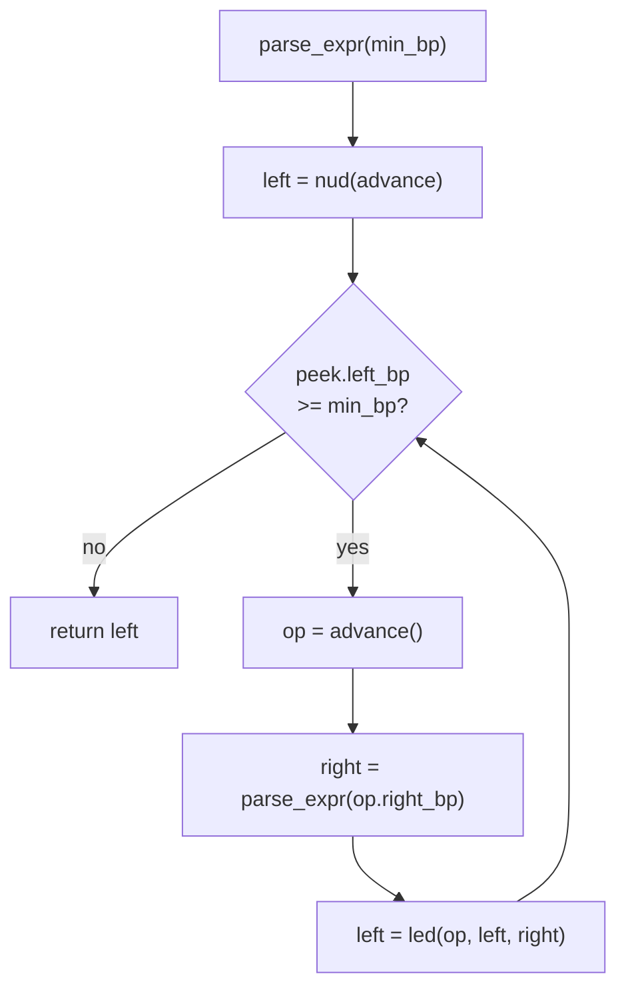
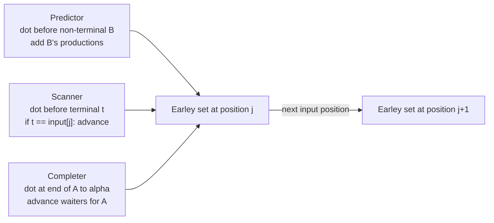
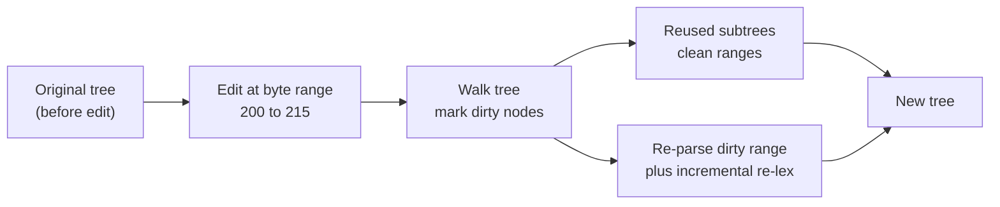
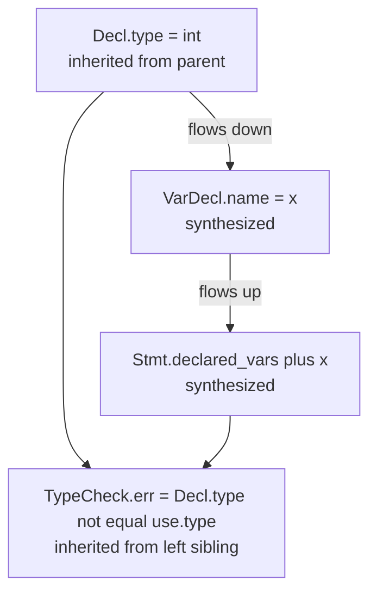

# Advanced Parsing

[Parsing](./parsing.md) covered the workhorses of compiler front-ends: hand-written recursive descent, LL(k) predictive parsing, and the LR/LALR family of bottom-up parsers. Those techniques are sufficient for most production compilers, but they leave a number of important problems unsolved. How do you parse a language with dozens of binary operators at distinct precedence levels without writing a separate function per level? How do you handle ambiguous grammars (natural language, C++ templates, GLR-friendly language features) without contorting the grammar? How do you re-parse a 100,000-line file on every keystroke without freezing the editor? And how do you compute semantic attributes bottom-up *and* top-down during a single parse?

This page answers those questions with five advanced parsing techniques: **Pratt parsing** (top-down operator precedence), **PEG / packrat parsing** (recognition-based grammars with memoization), **Earley & GLR parsing** (general CFG parsing with SPPFs), **incremental parsing / tree-sitter** (re-parsing only the edited range), and **attribute grammars** (Knuth's synthesis of CFGs and semantic attributes). Each technique fills a specific gap that the deterministic LL/LR family cannot, and each is supported by a mature open-source tool that you can adopt directly. The five topics also span the major axes of parser design: top-down vs bottom-up, deterministic vs general, one-shot vs incremental, syntactic vs semantic.

> Related: [Parsing](./parsing.md), [Lexical Analysis](./lexical-analysis.md), [Semantic Analysis](./semantic-analysis.md), [Intermediate Representation & Optimization](./intermediate-representation.md), [Formal Languages](../cs-theory/formal-languages.md)

## Pratt Parsing & Precedence Climbing

**Pratt parsing** — named after Vaughan Pratt's 1973 paper *"Top Down Operator Precedence"* — is a top-down technique for parsing expressions that elegantly handles operator precedence and associativity without the per-level function explosion of plain recursive descent. The core insight is that **each token carries a *binding power* (BP)**: a pair of integers `(left_bp, right_bp)` describing how tightly it binds to operands on its left and right. Higher binding power means tighter binding. Parsing proceeds by a single recursive function `parse_expr(min_bp)` that consumes a *left* operand, then loops inspecting the next token's left BP: if it is at least `min_bp`, the operator binds into the current expression; otherwise parsing returns and the operator is left for an enclosing call. Each token dispatches through one of two functions: **`nud`** (null denotation) for tokens that start an expression (literals, identifiers, prefix operators like unary `-`, parentheses), and **`led`** (left denotation) for tokens that continue an expression (infix `+`, postfix `++`, mixfix `? :`). The `nud`/`led` split lets one tokenizer-driven table handle prefix, infix, and postfix operators uniformly — something recursive descent accomplishes only by writing separate procedures per precedence level. Matklad's 2020 essay *"Simple but Powerful Pratt Parsing"* popularized the modern formulation; Crockford's *JavaScript: The Good Parts* uses Pratt parsing to implement the JSLint JavaScript parser; and rustc, maturin, and jq all rely on Pratt-style expression parsing.

The same idea is sometimes presented as **precedence climbing**: instead of `nud`/`led`, you write a loop that compares operator precedences and associativities directly. The two formulations are operationally identical — both produce the same AST for the same binding-power table — and the choice is largely stylistic. Pratt's `nud`/`led` vocabulary generalizes more cleanly to postfix and mixfix operators, while precedence climbing reads more naturally to programmers steeped in the recursive-descent tradition. The crucial property is that both avoid the left-recursion problem of naive top-down grammars (because the recursive call passes a *higher* `min_bp`, never the same one), and both let you add a new operator by editing a table rather than by writing a new procedure. This is why Pratt parsing dominates hand-written expression parsers in modern compilers: the binding-power table scales to dozens of operators with no per-level procedure, and the dispatch is uniform across prefix/infix/postfix/mixfix shapes.



A minimal Pratt parser for arithmetic, following matklad's exposition, looks like this in Python:

```python
# Tokens carry (l_bp, r_bp) pairs. nud/led are dispatched by token type.
BP = {
    '+': (1, 1), '-': (1, 1),     # left-associative: l_bp == r_bp
    '*': (3, 3), '/': (3, 3),
    '^': (5, 4),                  # right-associative: l_bp > r_bp
    # unary minus uses r_bp only (called from nud with min_bp = 7)
}

class Parser:
    def __init__(self, tokens): self.toks = tokens; self.i = 0
    def peek(self): return self.toks[self.i] if self.i < len(self.toks) else None
    def advance(self): t = self.peek(); self.i += 1; return t

    def parse_expr(self, min_bp=0):
        left = self.nud(self.advance())
        while (t := self.peek()) and t.kind in BP and BP[t.kind][0] >= min_bp:
            op = self.advance()
            right = self.parse_expr(BP[op.kind][1])
            left = ('binop', op.kind, left, right)
        return left

    def nud(self, t):
        if t.kind == 'int':  return ('int', t.value)
        if t.kind == '-':    return ('neg', self.parse_expr(7))   # unary, high BP
        if t.kind == '(':
            e = self.parse_expr(0)
            assert self.advance().kind == ')'
            return e
        raise SyntaxError(f"no nud for {t.kind}")

    def led(self, op, left, right): return ('binop', op.kind, left, right)
```

The recursive call uses `BP[op.kind][1]` (the operator's *right* binding power) as the new `min_bp`. For left-associative `+` (BP `(1, 1)`), the recursive call uses `min_bp = 1`, so a following `+` with `l_bp = 1` *fails* the `>= min_bp` test and bubbles back up — yielding `((a + b) + c)`. For right-associative `^` (BP `(5, 4)`), the recursive call uses `min_bp = 4`, so a following `^` with `l_bp = 5` *passes* and recurses — yielding `a ^ (b ^ c)`. The binding-power table thus encodes both precedence and associativity in a single integer pair per operator, and adding a new operator (say `<<` at BP `(2, 2)`) requires editing exactly one dictionary entry. This is the practical advantage over recursive descent: no new function, no grammar rewrite, no parser-table regeneration. Real-world users include rustc (the `Expr` parser is Pratt-style over an `ExprPrecedence` enum), Zig's parser, maturin (Python-to-Rust build tool), jq (the JSON query language has a dozen precedence levels handled by a single Pratt loop), and JSLint. Crockford's *JavaScript: The Good Parts* devotes an appendix to the JSLint parser, explicitly because Pratt parsing was the only technique that kept the JS expression grammar tractable when JavaScript's many operators (assignment, ternary, comma, `new`, `typeof`, `void`, `delete`) are considered together.

| Aspect | Recursive Descent | Pratt / Precedence Climbing |
|---|---|---|
| **Per-operator work** | One function per precedence level | One table entry per operator |
| **Adding an operator** | Write/modify procedures | Edit the BP table |
| **Left recursion** | Forbidden (must refactor grammar) | Handled naturally (BP recursion tightens) |
| **Associativity** | Encoded by recursion shape | Encoded by `l_bp` vs `r_bp` |
| **Prefix/postfix/mixfix** | Separate procedures | Unified via `nud`/`led` |
| **Used in** | GCC C, Go, TypeScript | rustc, JSLint, maturin, jq, Zig |

### Worked Example: Parsing `1 + 2 * 3`

To make the BP mechanics concrete, trace the Pratt parser on `1 + 2 * 3` with the BP table from the snippet above (`+` → `(1,1)`, `*` → `(3,3)`):

```text
call parse_expr(min_bp=0)
  nud(int 1)       -> left = ('int', 1)
  peek '+', l_bp=1 >= 0? yes
    advance '+'
    call parse_expr(min_bp=1)        // op.right_bp = 1
      nud(int 2)   -> left = ('int', 2)
      peek '*', l_bp=3 >= 1? yes
        advance '*'
        call parse_expr(min_bp=3)    // op.right_bp = 3
          nud(int 3) -> left = ('int', 3)
          peek EOF   -> exit loop
          return ('int', 3)
        left = ('binop', '*', ('int',2), ('int',3))
      peek EOF     -> exit loop
      return ('binop', '*', ('int',2), ('int',3))
    left = ('binop', '+', ('int',1), ('binop','*',('int',2),('int',3)))
  peek EOF -> exit loop
  return ('binop', '+', ('int',1), ('binop','*',('int',2),('int',3)))
```

The result is the correctly-grouped AST `1 + (2 * 3)` — the multiplication binds tighter than the addition because `*`'s left BP (3) exceeds `+`'s right BP (1) passed as the recursive `min_bp`, so `*` is consumed inside the inner call rather than at the outer level. Crucially, no precedence-level function was needed: the same `parse_expr` handled both `+` and `*` because each operator's BP told the loop whether to recurse or return. Adding a new operator — say `<<` at BP `(2, 2)` — would slot between `+` (1) and `*` (3) in precedence with one table edit, no parser changes.

### Precedence Climbing Formulation

The same algorithm, in the precedence-climbing style, drops the `nud`/`led` vocabulary and instead writes the loop with explicit associativity checks. The two are operationally identical:

```python
def parse_expr(min_prec=0):
    left = parse_unary()              # = "nud" call
    while (op := peek()).kind in PREC and PREC[op.kind] >= min_prec:
        advance()
        # right-associative: r_min = PREC[op]; left-assoc: r_min = PREC[op] + 1
        r_min = PREC[op.kind] + (0 if op.kind in RIGHT_ASSOC else 1)
        right = parse_expr(r_min)
        left = ('binop', op.kind, left, right)
    return left
```

The choice between Pratt's `nud`/`led` and this formulation is stylistic. Pratt's vocabulary is cleaner when postfix (`x++`), mixfix (`x ? y : z`), and custom binding shapes are involved; precedence climbing is more familiar to programmers coming from recursive descent. The matklad essay recommends the `nud`/`led` form because it scales better as the language grows new operator shapes.

### Real-World Pratt Implementations

Several production compilers illustrate the range of Pratt's applicability. **rustc** uses a Pratt-style loop in `rustc_parse::parser::expr` for binary expressions, with the `ExprPrecedence` enum defining BP values (e.g., `Cast` = 12, `Mul` = 14, `Add` = 12, `Compare` = 8, `And`/`Or` = 4); unary operators like `!` and `-` are handled in the `nud`-equivalent function. **Zig's parser** uses a similar pattern, with an `Assoc` enum distinguishing left and right associativity per operator. **jq** (the JSON query language) has a hand-written Pratt parser because its grammar has a dozen precedence levels (`|`, `//`, `??`, `,`, `//`, `?`, `or`, `and`, `==`/`!=`, `<`/`<=`/`>`/`>=`, `+`/`-`, `*`/`/`/`%`, `as`, `?`, `|`), and writing a separate function per level would be tedious. **maturin** (the Python-to-Rust build tool) uses Pratt for parsing Python expressions in its source-tree walker. The recurring theme: whenever a language has more than ~5 binary operators at distinct precedence levels, Pratt parsing wins over recursive descent on a lines-of-code basis.

## PEG & Packrat Parsing

**Parsing Expression Grammars (PEGs)**, introduced by Bryan Ford in *"Parsing Expression Grammars: A Recognition-Based Syntactic Foundation"* (POPL 2004), are a top-down alternative to context-free grammars. The crucial difference is **ordered choice**: where a CFG production `A → α | β` offers two *unordered* alternatives (and an ambiguous string has two parse trees), a PEG production `A ← α / β` tries `α` first and only tries `β` if `α` *fails*. This makes PEGs **unambiguous by construction** — there is exactly one parse tree per accepted string, because the order of alternatives fully determines which one matches. The price is that PEGs are *recognition-based* rather than *generative*: a PEG specifies a parser, not a language, and two superficially similar PEGs can recognize different languages. The PEG operators are: **sequence** (juxtaposition), **ordered choice** `/`, **zero-or-more** `*`, **one-or-more** `+`, **optional** `?`, **syntactic lookahead** `&e` (match `e` without consuming input), **negation** `!e` (succeed iff `e` fails, without consuming), **literals** `"foo"`, **character classes** `[a-z]`, and **non-terminals** `A`. Lookahead and negation give PEGs expressive power beyond LL(1) and LR(1) — they can express "an identifier that is not a keyword" as `!keyword identifier` — at the cost of making the language denoted by a PEG sometimes subtle.

```peg
# A PEG for arithmetic with the usual precedence (Ford 2004, §3)
Expr    ← Term (('+' / '-') Term)*
Term    ← Factor (('*' / '/') Factor)*
Factor  ← '(' Expr ')' / Number / '-' Factor
Number  ← [0-9]+
keyword ← 'if' / 'else' / 'while'   # used in lookahead: !keyword Ident
```

A naive PEG parser is a backtracking recursive-descent parser: each `/` tries alternatives left-to-right, and on failure restores the input position. Without memoization, this is exponential on ambiguous-looking grammars (the classic example is `A ← 'a' A 'a' / 'aa'` on input `aaaa...`, which retries subcomputations). Ford's *"Packrat Parsing: Simple, Powerful, Lazy, Linear Time"* (2002) solves this by **memoizing every `(rule, position)` pair**: the first time a rule is attempted at a position, its result (success/failure, match length, AST) is stored in a memo table; subsequent attempts at the same `(rule, position)` return the cached result in O(1). This guarantees **linear-time parsing** — O(n) in the input length, regardless of grammar ambiguity — at the cost of memory proportional to `|grammar| × |input|`, since every rule is potentially evaluated at every position. The memo table is typically a 2D array of size `rules × positions`, populated lazily as parsing proceeds. Packrat parsing also **cannot handle left recursion**: a rule `A ← A 'a' / 'x'` infinite-loops because the first alternative calls `A` at the same position without consuming input. Modern packrat variants (Warth et al., 2008) support *left-recursion removal* by iteratively seeding the memo with growing parse lengths, but this complicates the implementation and is not part of the original Ford formulation.

A minimal packrat parser skeleton shows the memoization pattern clearly:

```python
class Packrat:
    def __init__(self, src): self.src = src; self.memo = {}  # (rule, pos) -> result

    def parse(self, rule, pos):
        key = (rule, pos)
        if key in self.memo: return self.memo[key]            # cached
        # Mark "in progress" to detect left recursion (returns failure on retry)
        self.memo[key] = ('fail', pos)
        result = getattr(self, f'rule_{rule}')(pos)           # dispatch
        self.memo[key] = result                               # cache the real result
        return result

    def rule_Expr(self, pos):
        # Expr ← Term (('+' / '-') Term)*
        r = self.parse('Term', pos)
        if r[0] == 'fail': return r
        node, p = r
        while p < len(self.src) and self.src[p] in '+-':
            op = self.src[p]; p += 1
            r2 = self.parse('Term', p)
            if r2[0] == 'fail': return ('fail', pos)          # backtrack
            node = ('binop', op, node, r2[1]); p = r2[2]
        return (node, p)
```

Real-world PEG systems include **LPeg** (the Lua pattern-matching library, written by Roberto Ierusalimschy — PEGs compiled to a VM), **PEG.js** / **Peggy** (JavaScript PEG parser generators), **parboiled2** (Scala, macro-based PEGs on the JVM), and **Tree-sitter's grammar format** (which is *not* strictly PEG, but borrows PEG's ordered-choice and lookahead ideas). PEGs are attractive for languages where unambiguity is the design goal (most modern programming languages are designed to be unambiguous, so a PEG naturally captures the language designer's intent). Their main weaknesses are (1) the linear-memory cost of packrat memoization — for a 1 MB source file with a 200-rule grammar, the memo table is 200 million entries, which is impractical without lazy allocation, (2) the inability to express left recursion without rewriting the grammar (the same `A → A α | β` refactoring from LL parsing applies), and (3) the *semantic opacity* of ordered choice — a PEG may silently fail to match strings the author thought were covered, because an earlier alternative consumed input that the later alternative needed. The classic "PEG prefix trap" is the rule `Expr ← Expr '+' Term / Term`, which silently matches nothing because `Expr '+' Term` is tried first and (without left-recursion support) fails without consuming input, then `Term` is tried. Despite these caveats, PEGs have become the default grammar formalism for new parser generators since 2010 because of their combination of expressive power, linear-time parsing, and natural backtracking semantics.

### The Prefix Trap and Other PEG Pitfalls

The most subtle PEG bug is the **prefix trap**: an earlier alternative greedily consumes input that a later alternative needed. Consider:

```peg
Keyword  ← 'if' / 'else' / 'while' / 'for'
Ident    ← [a-zA-Z_][a-zA-Z_0-9]*
Name     ← Keyword / Ident        # WRONG: 'if' matches as Keyword, not Ident
Name     ← !Keyword Ident         # RIGHT: lookahead forbids keyword-as-ident
```

The first `Name` definition silently classifies `if` as a `Keyword`, even when the surrounding context expected a variable name. The `!Keyword Ident` formulation uses negation to *exclude* keywords from identifiers, which is the idiomatic PEG solution. A related pitfall is **ordered choice masking**: a rule like `A ← 'a' / 'ab'` matches only the first `'a'` of `'ab'` and never tries the longer alternative, because `'a'` succeeded. The fix is to order alternatives longest-first (`A ← 'ab' / 'a'`) or use lookahead to disambiguate. These traps are inherent to ordered choice — the same property that makes PEGs unambiguous also makes them sensitive to alternative ordering in ways that CFGs are not.

| Property | CFG (BNF/EBNF) | PEG |
|---|---|---|
| **Choice operator** | `\|` (unordered) | `/` (ordered: first match wins) |
| **Ambiguity** | Possible (multiple parse trees) | Impossible (one parse tree by construction) |
| **Lookahead** | Via grammar refactoring | First-class `&e` and `!e` |
| **Left recursion** | Allowed (some parsers handle it) | Forbidden (infinite loop) |
| **Worst-case complexity** | O(n³) for general, O(n) for LL/LR | O(n) with packrat memoization |
| **Memory** | O(1)–O(n) parser stack | O(\|grammar\| × \|input\|) memo table |
| **Typical use** | Language specifications (BNF in standards) | Hand-written parser generators (LPeg, PEG.js) |


## Earley & GLR Parsing

When the grammar is genuinely ambiguous — natural language, C++ overload resolution, GLR-friendly language features like GLR's beloved "dangling-else with multiple parse trees" — the LL/LR family fails because they demand a *single* deterministic parse. **Earley parsing** (Jay Earley, *"An Efficient Context-Free Parsing Algorithm"*, CACM 1970) is a **top-down chart parser** that handles *any* CFG, ambiguous or not, in O(n³) worst case, O(n²) for unambiguous grammars, and O(n) for deterministic grammars. The algorithm maintains a **chart**: a list of **sets of states**, one set per input position. Each **state** (also called an *Earley item*) is a triple \\( (A \to \alpha \cdot \beta,\ i,\ j) \\) meaning "we are trying to match production \\( A \to \alpha\beta \\), we have matched \\( \alpha \\) so far (the dot is after \\( \alpha \\)), we started at position \\( i \\), and we are now at position \\( j \\)". The algorithm processes the chart left-to-right, applying three operations at each position: **predictor** (if the dot is before a non-terminal \\( B \\), add new items for each of \\( B \\)'s productions, started at the current position), **scanner** (if the dot is before a terminal matching the input, advance the dot and add the new item to the next set), and **completer** (if the dot is at the end of a production, find all items in earlier sets that were waiting for that non-terminal and advance their dots). When the chart is fully built, the input is accepted iff an item \\( (S \to \alpha \cdot,\ 0,\ n) \\) exists in the final set.



A small worked example clarifies the chart mechanics. Consider the grammar `S → S S | "a"` (ambiguous on `"aaa"`) and the input `"aa"`. At position 0, the predictor seeds the set with `(S → · S S, 0, 0)` and `(S → · "a", 0, 0)`. The scanner reads the first `"a"`, producing `(S → "a" ·, 0, 1)` in set 1. The completer then finds the item `(S → · S S, 0, 0)` waiting for `S`, and advances its dot to `(S → S · S, 0, 1)`. The predictor then expands the new `S` after the dot, adding `(S → · S S, 1, 1)` and `(S → · "a", 1, 1)`. The scanner reads the second `"a"`, producing `(S → "a" ·, 1, 2)` in set 2. The completer advances both `(S → S · S, 0, 1)` and any pending items, eventually producing `(S → S S ·, 0, 2)` — acceptance. Because the grammar is ambiguous, the chart contains multiple completions of `S` at span (0, 2): one from `(S → S S ·, 0, 2)` (split at position 1) and, if the input were `"aaa"`, another from splitting at position 2. The parse forest records all of them.

### Earley Item Structure and Chart Mechanics

Each Earley item is conventionally written as \\( [A \to \alpha \cdot \beta,\ i] \\) — production with a dot, plus the *origin* position `i` where the item was created. The current position `j` is implicit (the set the item lives in). The three operations can be summarized precisely:

| Operation | Trigger | Action |
|---|---|---|
| **Predictor** | Dot before non-terminal `B` in item `[A → α · B β, i]` in set `j` | For each production `B → γ`, add `[B → · γ, j]` to set `j` (origin = current position) |
| **Scanner** | Dot before terminal `t` in item `[A → α · t β, i]` in set `j`, with `input[j] == t` | Add `[A → α t · β, i]` to set `j+1` |
| **Completer** | Item `[B → γ ·, k]` in set `j` (a complete `B` from `k` to `j`) | For each `[A → α · B β, i]` in set `k`, add `[A → α B · β, i]` to set `j` |

The completer's lookup into set `k` (the origin of the completed item) is the key subtlety: it finds only the items that were *actually waiting* for `B` at the position where `B` started, not all items in all earlier sets. This is what makes Earley's bookkeeping O(n²) on unambiguous grammars: each item in set `j` triggers a scan of set `k` (origin), and there are O(n) items per set in the unambiguous case.

### The SPPF and Ambiguity Representation

For ambiguous parses, the simple completer produces a *parse forest* rather than a single tree: multiple items may complete the same non-terminal at the same span, and the parse must remember *all* of them. The compact representation of this forest is the **Shared Packed Parse Forest (SPPF)** — a DAG in which shared sub-trees are represented once, with "packing" nodes that enumerate the alternative parses. The SPPF is essential for natural-language parsing, where a single sentence may have exponentially many parses and you cannot afford to enumerate them all. Earley parsing is the algorithm behind **Marpa** (a Perl/Ruby general parser, with a C library used in RPerl and the Perl 6 parser) and **Nearley.js** (a popular JavaScript parser generator). Its advantages over LL/LR are: (1) it handles any CFG, including left-recursive and ambiguous ones, with no grammar refactoring; (2) it degrades gracefully — O(n) on deterministic grammars, O(n²) on unambiguous, O(n³) worst case; (3) it produces all parses via the SPPF. Its disadvantage is constant-factor overhead: the chart can have O(n²) items even on simple grammars, making Earley 5–10× slower than a hand-tuned LALR(1) parser for typical programming languages.

**GLR (Generalized LR)** parsing, introduced by Masaru Tomita in *"An Efficient Augmented-Context-Free Parsing Algorithm"* (Computational Linguistics, 1987), is the bottom-up counterpart to Earley. GLR starts from a standard LR(1) parser table — typically constructed by LALR(1) — but on a **conflict** (shift-reduce or reduce-reduce), instead of choosing one action deterministically, it **forks the parser stack** and pursues *all* conflicting actions in parallel. Stacks that reach the same LR state are **merged** (a graph-structured stack), bounding the number of parallel stacks to O(n²) in the worst case. The result, like Earley's, is an SPPF encoding all parses. GLR is conceptually closer to LR than Earley is: the parse table is the same, the actions (shift, reduce, goto) are the same, only the conflict-resolution policy differs. This makes GLR attractive for compilers that already have an LALR(1) backbone and want to extend it to ambiguous grammars. GLR is used in **GCC's C++ front-end** (the C++ grammar is ambiguous without type information, so GCC's parser tentatively parses both interpretations and resolves them during semantic analysis — `T(x)` could be a function-style cast of `x` to type `T`, or a call to function `T` with argument `x`), **Elkhound** (a GLR parser generator from UC Berkeley, used to bootstrap the Elsa C/C++ parser), and **Bison's `%glr-parser` directive** (which produces a GLR parser from a Yacc-style grammar specification, emitting graph-structured stacks and SPPF nodes). Grune & Jacobs' *Parsing Techniques: A Practical Guide* (2008) is the standard reference comparing Earley, GLR, CYK, and other general parsing algorithms.

| Algorithm | Direction | Power | Unambiguous | Worst Case | Typical Use |
|---|---|---|---|---|---|
| **Earley** | Top-down chart | Any CFG | O(n²) | O(n³) | Marpa, Nearley.js, NLP |
| **GLR (Tomita)** | Bottom-up LR | Any CFG | O(n²) | O(n³) | GCC C++, Bison `%glr` |
| **CYK** | Bottom-up chart | Any CFG (in CNF) | O(n²) | O(n³) | Teaching, NLP (Chomsky Normal Form) |
| **LL(k)** | Top-down predictive | LL(k) subset | O(n) | O(n) | Hand-written parsers |
| **LALR(1)** | Bottom-up shift-reduce | LALR(1) subset | O(n) | O(n) | Bison, Yacc |

Earley vs GLR vs CYK all solve the same problem (parse any CFG in O(n³)) but differ in their constants and ease of integration. Earley is the most flexible (no grammar normalization, top-down so easy to add semantic actions) but has the largest constant factor. GLR has the smallest constant factor when the grammar is "mostly LALR(1)" (forks are rare) but requires constructing an LR table. CYK requires the grammar to be in Chomsky Normal Form (binary productions only), which is awkward for hand-written grammars but theoretically clean. For programming-language tools, GLR is usually preferred; for natural language, Earley and CYK dominate. A useful rule of thumb: if your grammar is unambiguous but conflicts with LALR(1) (like C++), GLR is the right choice; if your grammar is genuinely ambiguous (like natural language), Earley with SPPF is the right choice; if you are teaching formal-language theory, CYK on CNF grammars is the right choice because the algorithm is the simplest to state and analyze.

### CYK: The Bottom-Up Chart Alternative

The **Cocke–Younger–Kasami (CYK)** algorithm is the simplest of the three general parsers, but requires the grammar to be in **Chomsky Normal Form (CNF)**: every production is either `A → B C` (two non-terminals) or `A → a` (one terminal). Any CFG can be converted to CNF mechanically, but the conversion obscures the original grammar's intent. CYK fills a 2D chart `T[i][j]` of size `n × n`, where `T[i][j]` is the set of non-terminals that can derive the substring `input[i..i+j-1]` (length `j`). The algorithm fills the chart bottom-up by substring length:

```python
def cyk_parse(grammar, inp):
    n = len(inp)
    T = [[set() for _ in range(n+1)] for _ in range(n+1)]
    # Base case: substrings of length 1
    for i in range(n):
        for A in grammar.nonterminals:
            if (A, inp[i]) in grammar.productions:   # A -> terminal
                T[i][1].add(A)
    # Inductive case: substrings of length L = 2..n
    for L in range(2, n+1):
        for i in range(n - L + 1):
            for k in range(1, L):                    # split point
                for (A, B, C) in grammar.binary_productions:  # A -> B C
                    if B in T[i][k] and C in T[i+k][L-k]:
                        T[i][L].add(A)
    return 'S' in T[0][n]                            # S derives whole input?
```

The acceptance test is `S ∈ T[0][n]` — the start symbol `S` derives the full input. CYK's simplicity makes it the standard teaching algorithm in formal-language courses: the chart is a 2D array (not a list of sets like Earley's), the algorithm has no special cases (predictor/scanner/completer all collapse into one nested loop), and the O(n³) bound is immediate from the three nested loops. Its disadvantage is the CNF requirement, which forces grammar authors to introduce synthetic non-terminals for every production with more than two symbols on the right-hand side — destroying the readability that makes hand-written grammars tractable.

## Incremental Parsing & Tree-sitter

A text editor needs to re-parse the file on every keystroke to keep syntax highlighting, code folding, and structural queries (find the enclosing function, jump to definition) up to date. A full re-parse of a 100,000-line file takes tens to hundreds of milliseconds — too slow for interactive editing. **Incremental parsing** solves this by reusing the *subtrees* of the previous parse that are unaffected by the edit. The algorithm is: (1) keep the previous parse tree; (2) when the input changes, find the *range* of bytes that changed; (3) walk the previous tree, marking every node whose byte range overlaps the edit as *dirty*; (4) re-parse just the dirty range, using the lexer to re-tokenize only the affected tokens; (5) reuse the (unchanged) subtrees of clean nodes. Because the dirty range is typically a few dozen bytes (one keystroke), the re-parse is essentially constant-time — independent of the file size. This is what makes modern editors (Neovim, Helix, Zed, Atom, GitHub's web code viewer) feel responsive on large files. The technique was pioneered by Wagner and Graham in their 1998 paper *"Efficient and Flexible Incremental Parsing"*, which introduced the *non-terminal* reuse strategy that tree-sitter later refined.

**Tree-sitter**, created by Max Brunsfeld (his Strange Loop 2018 talk *"Tree-sitter: a new parsing system for programming tools"* is the canonical introduction) is the dominant incremental parser generator. Tree-sitter grammars are written in a JavaScript DSL that compiles to a C parser; the parser uses a **GLR-style** algorithm with **error recovery**. GLR is essential because real-world source code is *frequently syntactically invalid* — the user is mid-typing, there's a missing semicolon, an unclosed brace — and the parser must keep going to produce a useful tree. On ambiguity (a GLR conflict), tree-sitter forks briefly but, unlike a true GLR parser, it does *not* keep all parses: it uses **error-recovery heuristics** (insertion/deletion cost, "least-error" preference) to pick a single best tree, biased toward producing nodes that the editor's syntax highlighter and structural queries can consume. The lexer is also incremental: it re-tokenizes only the tokens whose byte ranges overlap the edit, and uses the previous tokenization for the rest. The result is a parser that scales to multi-megabyte files and re-parses a single keystroke in microseconds.



### Tree-sitter Grammar File Example

A tree-sitter grammar is a JavaScript module exporting a name and a `rules` object. Each rule value is either a string (terminal or non-terminal reference) or a *sequence expression* built from helpers like `seq`, `choice`, `repeat`, `optional`, `field`. The grammar compiles to a C parser that links against the tree-sitter runtime. A minimal JSON grammar:

```javascript
// grammars/json/grammar.js
module.exports = grammar({
  name: 'json',
  rules: {
    document: $ => $.value,
    value: $ => choice(
      $.object,
      $.array,
      $.string,
      $.number,
      $.true, $.false, $.null,
    ),
    object: $ => seq(
      '{', optional(seq($.pair, repeat(seq(',', $.pair)))), '}',
    ),
    pair: $ => seq(field('key', $.string), ':', field('value', $.value)),
    array: $ => seq('[', optional(seq($.value, repeat(seq(',', $.value)))), ']'),
    string: $ => /"([^"\\]|\\.)*"/,
    number: $ => /-?\d+(\.\d+)?([eE][+-]?\d+)?/,
    true:  $ => 'true',
    false: $ => 'false',
    null:  $ => 'null',
  },
});
```

The `field('key', ...)` annotations are how tree-sitter exposes *named* sub-nodes to queries. Without `field`, the query API would have to navigate by positional child index, which is fragile across grammar revisions. With `field`, a query for "the key of every pair whose value is a number" is stable across grammar edits: `(pair key: (string) @k value: (number))` — the `key:` and `value:` field names survive grammar rewrites as long as the field declarations are kept.

Tree-sitter exposes the parse tree through a **node API**: clients query the tree by **S-expression patterns** (tree-sitter *queries*), retrieving matched nodes with their byte ranges and field names. For example, a query for "all function definitions" in JavaScript is `(function_declaration name: (identifier) @name)`, and the API returns every match with the captured `@name` node. This pattern-based access is far more ergonomic than walking the AST manually, and it decouples the editor's concerns (highlighting, navigation, refactoring) from the language's grammar. A complete example — querying for every method call in a Python file — illustrates the API:

```javascript
const Parser = require('tree-sitter');
const Python = require('tree-sitter-python');
const parser = new Parser(); parser.setLanguage(Python);
const tree = parser.parse(sourceCode);

// Query: find every method call, capturing the function name
const query = Python.query('(call function: (attribute attribute: (identifier) @method))');
const matches = query.matches(tree.rootNode);
for (const m of matches) {
  const node = m.captures[0].node;
  console.log(`method call "${node.text}" at line ${node.startPosition.row + 1}`);
}
```

Tree-sitter is used by GitHub for code navigation (the "Go to symbol" feature on github.com, processing every push through a tree-sitter parse), Neovim (built-in treesitter queries power syntax highlighting, folding, and structural editing since 0.5), Helix (selection-by-syntax-node), Zed (similar), Atom (the original incubator), and many LSP servers. The trade-off vs a traditional one-shot parser is that tree-sitter must support **error recovery** (keep parsing past errors and produce a best-effort tree) — without it, the editor would lose all structural information the moment the user types an incomplete expression. This makes tree-sitter grammars harder to write than a clean LR grammar: the grammar author must explicitly mark "external tokens" (tokens whose lexing depends on context, like heredocs or Python indentation) and provide error-recovery hints. The payoff is that the resulting parser is fast enough for interactive editing *and* produces a tree rich enough for IDE-grade tooling, in a single library that supports dozens of languages from C++ to YAML.

| Aspect | Traditional Parser (one-shot) | Tree-sitter (incremental) |
|---|---|---|
| **Re-parse cost per keystroke** | O(file size) | O(edit size) — typically O(1) |
| **Error recovery** | Optional, often panic mode | Mandatory, first-class |
| **Output on invalid input** | Partial tree + error | Best-effort tree with ERROR nodes |
| **Grammar complexity** | Simpler (clean LR/LL) | Harder (recovery, external tokens) |
| **Use case** | Compilers (one parse, many passes) | Editors, linters, code-nav (many parses, evolving input) |
| **Querying the tree** | Walk AST in host language | S-expression queries with captures |

## Attribute Grammars

**Attribute grammars**, introduced by Donald Knuth in *"Semantics of Context-Free Languages"* (Mathematical Systems Theory, 1968), extend context-free grammars with **semantic attributes** attached to non-terminals. Each non-terminal \\( A \\) may carry a set of attributes \\( a_1, a_2, \ldots \\); each attribute is either **synthesized** (computed from the attributes of \\( A \\)'s children, flowing *upward* the parse tree) or **inherited** (computed from the attributes of \\( A \\)'s parent and left siblings, flowing *downward*). The grammar's productions are annotated with **semantic rules** — equations of the form `A.attr = f(children's attrs)` for synthesized attributes or `child.attr = f(A's attrs, left siblings' attrs)` for inherited. The collection of all attribute instances in a parse tree forms a **dependency graph**: a DAG whose nodes are attribute instances and whose edges point from an attribute to the attributes it depends on. Evaluating the attribute grammar means computing every attribute instance in an order consistent with this DAG (a topological sort); if the DAG has a cycle, the grammar is ill-defined. The Dragon Book (Ch. 5) is the standard pedagogical reference, with worked examples for type checking and short-circuit code generation.



A concrete example makes the synthesized/inherited distinction crisp. Consider a tiny expression grammar where we want to compute the *type* and *value* of each expression. The non-terminal `E` has two synthesized attributes: `E.type` (the result type, e.g., `int` or `float`) and `E.val` (the constant-folded value, if computable). For the production `E → E1 + E2`, the rules are `E.val = E1.val + E2.val` (if both are constants) and `E.type = max(E1.type, E2.type)` (with `int < float` so `int + float = float`). Both are synthesized — they flow upward from children to parent. Now consider type-checking variable declarations in a block: `Decl → Type Ident`. The `Type` non-terminal has a synthesized attribute `Type.name`, but `Ident` needs an *inherited* attribute `Ident.declared_type` (the type it is being declared with, which comes from the left sibling `Type`). The rule is `Ident.declared_type = Type.name`, which is an inherited attribute because it flows from the left sibling to the right. The full declaration `int x;` is then recorded in the symbol table by a synthesized attribute on `Decl` (e.g., `Decl.adds = { x: int }`), which the enclosing `Block` accumulates. The dependency graph for `int x;` has edges `Type.name → Ident.declared_type` (inherited) and `Ident.name → Decl.adds` (synthesized); it is acyclic, so the grammar is well-defined.

### Knuth's Original Example: Binary Numbers

Knuth's 1968 paper introduced attribute grammars with a now-classic example: a grammar for binary numbers that computes the decimal value. The grammar is:

```text
B → B1 Bit          B.val = B1.val * 2 + Bit.val        (synthesized)
B → Bit             B.val = Bit.val                      (synthesized)
Bit → '0'           Bit.val = 0                          (synthesized)
Bit → '1'           Bit.val = 1                          (synthesized)
```

All attributes are synthesized, so the grammar is S-attributed and evaluates in a single bottom-up pass. But Knuth's key innovation was to show that *inherited* attributes can express the same computation more efficiently — without the `* 2` multiplier cascading up the tree. The inherited-attribute version uses a *position weight*:

```text
B → B1 Bit           B1.weight = B.weight * 2           (inherited)
                     B2.weight = B.weight                (inherited, for Bit)
                     B.val    = B1.val + Bit.val         (synthesized)
B → Bit              Bit.weight = B.weight               (inherited)
                     B.val     = Bit.val                 (synthesized)
Bit → '0'            Bit.val = 0
Bit → '1'            Bit.val = 1 * Bit.weight            (uses inherited weight)
B (top-level)        B.weight = 1                        (inherited from virtual root)
```

Here `B.weight` flows *downward* from the root (where it starts at 1) and doubles at each leftward descent. The leaf `Bit` nodes multiply their bit value by the inherited weight, and the synthesized `val` sums them up. The dependency graph has both downward (inherited) and upward (synthesized) edges — it is no longer S-attributed — but it is still L-attributed because each `B1.weight` depends only on its parent's inherited `B.weight`, which is available before recursion into `B1`. This formulation illustrates the expressive trade-off: inherited attributes let you compute the same answer with a different (often more local) dependency structure, at the cost of needing a more sophisticated evaluation order than a single bottom-up pass.

Two important subclasses have efficient evaluation strategies. An **S-attributed grammar** uses *only* synthesized attributes. Because synthesized attributes depend only on children, an S-attributed grammar can be evaluated in a **single bottom-up pass** during parsing — which means it works naturally with an LR parser, attaching the semantic rule to each reduce action. This is exactly what Bison/Yacc's `{ $$ = f($1, $2, ...); }` actions implement: `$$` is the synthesized attribute of the left-hand-side non-terminal, and `$1, $2, ...` are the synthesized attributes of the right-hand-side symbols. An **L-attributed grammar** allows synthesized attributes *plus* inherited attributes that depend only on **left siblings** (and the parent's inherited attributes). Because the dependency is left-to-right, an L-attributed grammar can be evaluated in a **single left-to-right depth-first traversal** — which works naturally with an LL parser or recursive-descent parser, computing inherited attributes before recursing into each child. Most practical attribute grammars (type checking, constant propagation in declarations, code generation for expressions) are L-attributed; this is why recursive-descent parsers can do meaningful semantic analysis *during* parsing without needing a separate pass. The Dragon Book gives the standard translation: an L-attributed grammar can be converted to a syntax-directed translation scheme that runs in one pass with either an LL or LR parser.

Attribute grammars were the dominant formalism for specifying compiler semantics in the 1970s and 1980s — they underlie the **Synthesizer Generator** (Reps & Teitelbaum, 1988), which generates editors with incremental semantic analysis, and the Eli compiler-construction system. They have since fallen out of fashion in mainstream compilers, for two reasons. First, **hand-coded semantic analysis on ASTs is more flexible**: modern compilers (rustc, GCC, Clang) walk the AST explicitly with visitor patterns, maintaining their own symbol tables and scopes, rather than encoding type rules as attribute equations. This is easier to debug, easier to extend with ad-hoc rules (e.g., "this attribute is computed lazily, only if needed"), and easier to integrate with cross-cutting concerns like diagnostics and incremental compilation. Second, **attribute grammars struggle with non-local information**: name resolution across translation units, type inference across function boundaries, and optimization passes all require global analysis that does not fit the "local attribute on a parse-tree node" model. Nonetheless, attribute grammars survive in **Silver** (an attribute-grammar language from University of Minnesota, used for extensible compilers like the AbleC extensible C compiler) and **JastAdd** (an attribute-grammar system for Java, used in the ExtendJ Java compiler, formerly JastAddJ). They are also the conceptual basis for **syntax-directed translation** in compiler courses — every `{ $$ = ... }` action in a Yacc grammar is, formally, a synthesized-attribute rule in an S-attributed grammar, and the L-attributed restriction is exactly what makes a single-pass recursive-descent compiler possible.

| Attribute Class | Direction | Depends On | Evaluation Strategy | Parser Compatibility |
|---|---|---|---|---|
| **Synthesized** | Up (child → parent) | Children's attributes | Single bottom-up pass | LR/LALR (Yacc `$$ = f($1,$2)`) |
| **Inherited** | Down (parent → child) | Parent + siblings | Requires topological sort | LL or recursive descent |
| **S-attributed** | Up only | Children only | One bottom-up pass | LR/LALR |
| **L-attributed** | Up + down (left only) | Children + left siblings | One left-to-right pass | LL or LR |

### Evaluation Orders and the Dependency Graph

For attribute grammars that are neither S- nor L-attributed, evaluation requires a full **dependency graph analysis**. The compiler constructs the parse tree, then for each node instantiates one vertex per attribute occurrence and draws an edge from `a` to `b` whenever `b`'s rule depends on `a`. The resulting graph is the **parse-tree dependency graph** (different from the *grammar's* static dependency graph, which is the union over all parse trees). If the parse-tree dependency graph is acyclic, attribute values can be computed in **topological order**: starting from sources (attributes whose dependencies are all already computed), evaluate each rule, marking its result. If the graph has a cycle, the grammar is ill-defined for that parse tree. Reps, Marlowe, and Teitelbaum (1986) showed that the cycle-detection and topological-sort cost can be amortized across incremental edits, which is what the Synthesizer Generator exploited for interactive editors. In practice, modern attribute-grammar systems like Silver and JastAdd use **demand-driven** evaluation: attributes are computed lazily, only when queried, with memoization — so the evaluation order emerges from the query pattern rather than being pre-computed. This avoids the cost of evaluating attributes that no consumer ever reads, at the price of more bookkeeping per attribute access.

## Comparison of Parsing Techniques

The five techniques above each occupy a distinct niche. The four tables below summarize where each fits, contrasting power, complexity, and the practical trade-offs that govern the choice of parser in a real compiler or editor. The choice is rarely "which is best" but rather "which fits my grammar, my performance budget, and my downstream consumers". A compiler that parses a file once and runs many optimization passes on the AST cares about parse speed but not about incremental updates; an editor that re-parses on every keystroke cares about incremental updates far more than absolute parse speed. A language whose grammar is genuinely ambiguous (C++ templates, natural language) needs a general parser; a language designed to be LL(2) can get away with recursive descent plus Pratt. The tables below make these trade-offs explicit.

**Table 1 — Parsing algorithms by power and complexity.**

| Algorithm | Direction | Class of Grammars | Ambiguity | Worst Case | Grammar Refactoring |
|---|---|---|---|---|---|
| **LL(k)** | Top-down | LL(k) | No (forbidden) | O(n) | Left recursion, left factoring |
| **LALR(1)** | Bottom-up | LALR(1) | No (conflicts) | O(n) | Resolve conflicts via precedence |
| **Pratt** | Top-down | Expression subgrammars | No | O(n) | None (BP table) |
| **PEG (packrat)** | Top-down | PEGs (unambiguous) | No (by construction) | O(n) | Remove left recursion |
| **Earley** | Top-down chart | Any CFG | Yes (SPPF) | O(n³) | None |
| **GLR** | Bottom-up | Any CFG | Yes (SPPF) | O(n³) | None |
| **CYK** | Bottom-up chart | Any CFG (CNF) | Yes (parse forest) | O(n³) | Convert to CNF |

**Table 2 — Top-down techniques: what each adds over plain recursive descent.**

| Technique | Adds Over Recursive Descent | Cost |
|---|---|---|
| **Recursive descent** | — | Per-level function; manual precedence |
| **Pratt** | Unified prefix/infix/postfix via `nud`/`led`; BP table | None significant |
| **PEG** | Ordered choice, lookahead `&`/`!`, backtracking | Exponential without memoization |
| **Packrat** | Linear-time memoization of PEG | O(\|grammar\| × \|input\|) memory |

**Table 3 — Bottom-up / general parsing algorithms.**

| Algorithm | Table-driven? | Handles ambiguity? | Linear on deterministic? | Notes |
|---|---|---|---|---|
| **LR(0)** | Yes | No | Yes | Weakest; basis for SLR |
| **SLR(1)** | Yes | No | Yes | Uses FOLLOW sets |
| **LALR(1)** | Yes | No | Yes | Bison/Yacc default |
| **CLR(1)** | Yes | No | Yes | Large tables; rarely used |
| **GLR** | Yes (LR + forks) | Yes (SPPF) | Yes (rare forks) | C++ in GCC, Bison `%glr` |
| **Earley** | Chart | Yes (SPPF) | Yes | Marpa, Nearley.js |
| **CYK** | Chart (CNF) | Yes (parse forest) | Yes (CNF required) | Teaching, NLP |

**Table 4 — Incremental vs one-shot parsing.**

| Property | One-shot (Bison, hand-written) | Incremental (tree-sitter) |
|---|---|---|
| **Re-parse after edit** | Re-lex + re-parse whole file | Re-lex + re-parse only dirty range |
| **Cost per keystroke** | O(file size) | O(edit size) ≈ O(1) |
| **Error recovery** | Panic mode (optional) | First-class, mandatory |
| **Output on syntax error** | Partial tree + abort | Best-effort tree with ERROR nodes |
| **Typical consumer** | Compiler (one parse, many passes) | Editor, linter, code-nav tool |

## When to Use What

A practical decision tree for choosing a parsing technique:

- **Hand-writing a compiler for a clean, modern language** (Go, Rust, Swift, Zig): use **recursive descent + Pratt** for expressions. This is what rustc, Go, Zig, and Swift do — the grammar is designed to be LL(2) or so, and Pratt handles the expression sub-grammar.
- **Generating a parser from a grammar spec** (Yacc-style, for a clean LALR(1) grammar like SQL or a config-file format): use **Bison with LALR(1)**. It is the default, well-tested, and produces small fast parsers.
- **Parsing a language with genuinely ambiguous fragments** (C++ templates, natural language, regex with capture groups): use **GLR** (Bison `%glr-parser` for C++-like languages) or **Earley** (Marpa, Nearley.js for natural language). Keep the SPPF if you need all parses; collapse to one if you only need best-effort.
- **Building an editor or language server** (syntax highlighting, code navigation, structural queries): use **tree-sitter**. The incremental re-parse is essential for responsiveness, and the S-expression query API decouples the tool from grammar internals.
- **Defining a small DSL with many operators** (a query language like jq, a math expression language, a build-rule language): use **Pratt parsing**. The binding-power table scales to dozens of operators with no per-level function.
- **Specifying a language formally** (language standard, formal semantics): use a **CFG in BNF/EBNF**. Standards documents need to express the language, not the parser, and unordered choice is the right abstraction for a specification.
- **Teaching parser theory**: use **CYK on CNF grammars** (simplest to state and analyze), then introduce **Earley** (no normalization needed) and **GLR** (closest to the practical LR backbone).

## Cross-References

- [Parsing](./parsing.md) — LL/LR basics, recursive descent, AST construction.
- [Lexical Analysis](./lexical-analysis.md) — tokenization, finite automata, the lexer-parser interface.
- [Semantic Analysis](./semantic-analysis.md) — where attribute-grammar-style computations live in a modern compiler.
- [Intermediate Representation & Optimization](./intermediate-representation.md) — what the parser's AST becomes.
- [Code Generation & Linking](./code-generation.md) — what the parser's AST ultimately lowers to.
- [Formal Languages](../cs-theory/formal-languages.md) — Chomsky hierarchy, the formal foundation of CFGs.

## References

- Pratt, V. R. *"Top Down Operator Precedence."* MIT AI Memo, 1973.
- matklad. *"Simple but Powerful Pratt Parsing."* 2020. <https://matklad.github.io/2020/04/13/simple-but-powerful-pratt-parsing.html>
- Crockford, D. *JavaScript: The Good Parts.* O'Reilly, 2008 (Appendix on JSLint's Pratt parser).
- Ford, B. *"Parsing Expression Grammars: A Recognition-Based Syntactic Foundation."* POPL 2004.
- Ford, B. *"Packrat Parsing: Simple, Powerful, Lazy, Linear Time."* 2002.
- Warth, A., Douglass, J. R., & Millstein, T. *"Packrat Parsers Can Support Left Recursion."* PEPM 2008.
- Mizushima, R., Maeda, E., et al. *"Packrat Parsers for Practical Languages."* PEPM 2010.
- Earley, J. *"An Efficient Context-Free Parsing Algorithm."* CACM 13(2), 1970.
- Tomita, M. *"An Efficient Augmented-Context-Free Parsing Algorithm."* Computational Linguistics 13(1–2), 1987.
- Grune, D. & Jacobs, C. *Parsing Techniques: A Practical Guide.* 2nd ed., Springer, 2008.
- Scott, E. & Johnstone, A. *"SPPF-Style Parsing From Earley Recognisers."* ENTCS 203(2), 2008.
- Brunsfeld, M. *"Tree-sitter: a new parsing system for programming tools."* Strange Loop 2018. <https://tree-sitter.github.io/tree-sitter/>
- Wagner, T. A. & Graham, S. L. *"Efficient and Flexible Incremental Parsing."* TOPLAS 20(5), 1998.
- Knuth, D. E. *"Semantics of Context-Free Languages."* Mathematical Systems Theory 2(2), 1968.
- Knuth, D. E. *"Semantics of Context-Free Languages (Errata)."* Mathematical Systems Theory 5(1), 1971.
- Aho, A. V., Lam, M. S., Sethi, R., Ullman, J. D. *Compilers: Principles, Techniques, and Tools* (Dragon Book), Ch. 5.
- Reps, T. & Teitelbaum, T. *The Synthesizer Generator.* Springer, 1988.
- Reps, T., Marlowe, T., & Teitelbaum, T. *"Remote Attribute Updating for Language-Based Editors."* POPL 1986.
- Van Wyk, E. & Schwelm, G. *"Silver: An Extensible Attribute Grammar System."* SLE 2018.
- Ekman, T. & Hedin, G. *"The JastAdd System — Modularizable Aspect-Oriented Compiler Construction."* Science of Computer Programming 69(1–3), 2007.


## Interview Questions

1. **What problem does Pratt parsing solve that recursive descent does not?** Recursive descent needs one function per precedence level, so adding an operator means writing a new function. Pratt uses a binding-power table: adding an operator is one table entry. Pratt also unifies prefix, infix, and postfix via `nud`/`led`.
2. **What is the difference between a CFG and a PEG?** A CFG uses unordered alternation `|` and may be ambiguous (multiple parse trees). A PEG uses ordered choice `/` — first match wins — and is therefore unambiguous by construction. PEGs also have first-class lookahead (`&`) and negation (`!`).
3. **Why does packrat parsing use O(|grammar| × |input|) memory?** It memoizes every `(rule, position)` pair to guarantee linear time. The memo table has one slot per rule per input position, populated lazily.
4. **What are the three operations in Earley parsing?** **Predictor** (add productions for a non-terminal to the right of the dot), **scanner** (advance the dot over a matching terminal), and **completer** (advance the dot in items waiting for a completed non-terminal).
5. **How does GLR handle a shift-reduce conflict?** It forks the parser stack, performing both the shift and the reduce in parallel. Stacks reaching the same LR state are merged (graph-structured stack). All parses are preserved in an SPPF.
6. **Why is tree-sitter GLR-based rather than LALR?** LALR(1) cannot handle the ambiguous fragments of real programming languages (C++ templates, dangling-else, JavaScript's automatic semicolon insertion). GLR lets tree-sitter briefly fork and pick the best tree using error-recovery heuristics.
7. **What is the difference between synthesized and inherited attributes?** Synthesized attributes flow upward (computed from children); inherited attributes flow downward (computed from parent and siblings). S-attributed grammars (synthesized only) can be evaluated in one bottom-up pass with an LR parser.
8. **What does it mean for an attribute grammar to be L-attributed?** Inherited attributes depend only on left siblings (and the parent's inherited attributes). This permits a single left-to-right depth-first evaluation, compatible with LL or recursive-descent parsing.
9. **Why have attribute grammars fallen out of fashion in modern compilers?** Hand-coded semantic analysis on ASTs is more flexible, easier to debug, and handles non-local information (cross-module name resolution, type inference) more naturally. Attribute grammars survive in specialized tools like Silver and JastAdd.
10. **When would you choose Earley over GLR?** Earley needs no LR table and accepts any CFG with no normalization, which is convenient for NLP and rapid prototyping. GLR has smaller constants when the grammar is mostly LALR(1) — typical for programming languages — so it is preferred for compilers.
11. **What is an SPPF and why is it needed?** The Shared Packed Parse Forest is a DAG representation of all parse trees for an ambiguous input. Sharing subtrees avoids exponential blowup: a sentence with two ambiguous parses that share a sub-tree stores the sub-tree once, not twice.
12. **Why must tree-sitter parsers support error recovery, while a Bison parser typically does not?** Tree-sitter runs in an editor on partially-typed input that is frequently invalid; without recovery the editor would lose all structural information the moment the user typed an incomplete expression. A Bison parser runs once on a complete file, so panic-mode recovery suffices.
13. **What is the PEG "prefix trap"?** An earlier alternative in an ordered choice greedily consumes input that a later alternative needed. For example, `Name ← Keyword / Ident` classifies `if` as a `Keyword`, even when the context expected a variable. The fix is `Name ← !Keyword Ident`, using negation to exclude keywords.
14. **What is the difference between S-attributed and L-attributed grammars?** S-attributed grammars use only synthesized attributes and evaluate in one bottom-up pass with an LR parser. L-attributed grammars additionally allow inherited attributes that depend only on left siblings, and evaluate in one left-to-right pass with an LL or LR parser. L-attributed is strictly more expressive than S-attributed.
15. **Why does CYK require Chomsky Normal Form?** The CYK chart is indexed by substring length and split point, and the inductive step (`A → B C` with `B` deriving the left half and `C` the right half) requires every production to have exactly two non-terminal symbols on the right-hand side. CNF normalization mechanically rewrites any CFG into this binary form, but the rewriting obscures the original grammar's intent.
16. **What does `nud` mean in Pratt parsing, and how does it differ from `led`?** `nud` (null denotation) parses a token that *starts* an expression — literals, identifiers, prefix operators like unary `-`, and grouping parentheses. `led` (left denotation) parses a token that *continues* an expression after a left operand — infix `+`, postfix `++`, and mixfix `? :`. The split lets one tokenizer-driven dispatch table handle prefix, infix, and postfix shapes uniformly.
17. **How does tree-sitter decide which parse to keep when GLR forks?** Tree-sitter uses error-recovery heuristics — insertion/deletion cost and a "least-error" preference — to pick the single best tree, biased toward producing nodes that the editor's syntax highlighter and structural queries can consume. Unlike a true GLR parser, it does not keep all parses; the SPPF is collapsed to one tree on each parse.
