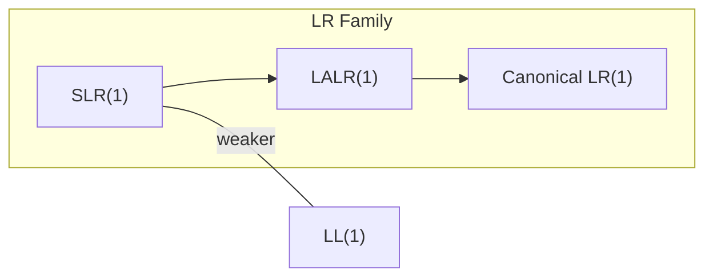

# Parsing

Parsing is the second phase of compilation. It takes the **token stream** from the lexer and produces a **parse tree** or, more commonly, an **abstract syntax tree (AST)** that reflects the hierarchical structure of the program.

## Context-Free Grammars (CFG)

A CFG is a 4-tuple (V, T, P, S) where V is the set of non-terminals, T is the set of terminals (tokens), P is the production rules, and S is the start symbol.

For a simple expression grammar:

```
E → E + T  |  E - T  |  T
T → T * F  |  T / F  |  F
F → ( E )  |  INT_LITERAL | IDENTIFIER
```

This grammar encodes **operator precedence** (`*`/`/` bind tighter than `+`/`-`) and **left associativity** (recursion on the left side).

### Ambiguity

A grammar is **ambiguous** if a string has more than one valid parse tree. The classic example:

```
S → if E then S else S | if E then S | S ; S
```

`if a then if b then s1 else s2` is ambiguous: does `else` bind to the inner or outer `if`? Most languages resolve this with the **dangling-else** rule: `else` binds to the nearest unmatched `then`.

### Eliminating Left Recursion

Top-down parsers cannot handle direct left recursion. Transform:

```
A → A α | β
```

into:

```
A  → β A'
A' → α A' | ε
```

Applied to expressions: `E → T E'`, `E' → + T E' | - T E' | ε`.

### Left Factoring

When two productions share a common prefix, the parser cannot decide which to choose with one token of lookahead:

```
S → if E then S
S → if E then S else S
```

Factor out the common prefix:

```
S  → if E then S S'
S' → else S | ε
```

## Top-Down Parsing

### Recursive Descent

A **recursive-descent parser** is a hand-written top-down parser with one function per non-terminal. It's the most common approach for modern languages (Rust, Go, TypeScript, GCC's C++ frontend).

```c
// Recursive descent for: E → T { (+|-) T }
// Assumes tokens: PLUS, MINUS, INT_LITERAL, EOF

typedef struct Parser {
    Token *tokens;
    int pos;
} Parser;

// Forward declarations
ASTNode *parse_expr(Parser *p);
ASTNode *parse_term(Parser *p);

Token peek(Parser *p) { return p->tokens[p->pos]; }
Token advance(Parser *p) { return p->tokens[p->pos++]; }

ASTNode *parse_expr(Parser *p) {
    ASTNode *left = parse_term(p);
    while (peek(p).type == TOK_PLUS || peek(p).type == TOK_MINUS) {
        TokenType op = advance(p).type;
        ASTNode *right = parse_term(p);
        left = make_binop(op, left, right);
    }
    return left;
}

ASTNode *parse_term(Parser *p) {
    if (peek(p).type == TOK_INT_LITERAL) {
        return make_int_lit(atoi(advance(p).lexeme));
    }
    // error handling omitted
    return NULL;
}
```

### LL(k) Parsing

**LL(k)** parsers scan input **Left-to-right**, producing a **Leftmost** derivation, with **k** tokens of lookahead. LL(1) is the most common:

- **LL(1) condition**: For every non-terminal A with productions A → α | β, `FIRST(α) ∩ FIRST(β) = ∅` and if β ⇒* ε, then `FIRST(α) ∩ FOLLOW(A) = ∅`.
- Parsers use a **predictive parsing table** indexed by (non-terminal, lookahead token).
- Limited power: cannot handle all unambiguous grammars.

## Bottom-Up Parsing

### LR Parsing

**LR(k)** parsers scan **Left-to-right**, producing a **Rightmost** derivation in reverse, with **k** tokens of lookahead. They are more powerful than LL parsers and handle a larger class of grammars.



| Parser | Power | Table Size | Used By |
|---|---|---|---|
| SLR(1) | Subset of LR(0) | Small | Teaching |
| LALR(1) | Between SLR and CLR | Medium | **Bison, Yacc** |
| CLR(1) | Full LR(1) | Large | Rare in practice |

LR parsers use a **shift-reduce** approach:
- **Shift**: push the next token onto the stack.
- **Reduce**: pop the right-hand side of a production and push the left-hand side non-terminal.
- **Conflict**: shift-reduce conflict (e.g., dangling else) or reduce-reduce conflict (ambiguous grammar).

### LALR(1) and Bison

Bison generates LALR(1) parsers. A minimal grammar file:

```yacc
%token INT_LITERAL
%left '+' '-'
%left '*' '/'

%%
expr : expr '+' expr   { $$ = make_binop('+', $1, $3); }
     | expr '-' expr   { $$ = make_binop('-', $1, $3); }
     | expr '*' expr   { $$ = make_binop('*', $1, $3); }
     | expr '/' expr   { $$ = make_binop('/', $1, $3); }
     | '(' expr ')'
     | INT_LITERAL     { $$ = make_int_lit($1); }
     ;
%%
```

The `%left`/`%right` declarations resolve shift-reduce conflicts by assigning precedence and associativity.

## AST Construction

The parse tree is often too verbose. An **abstract syntax tree** omits punctuation, grouping parentheses, and purely syntactic structure:

```
Source:    (a + b) * c
Parse tree: Expr → Expr * Expr → ( Expr ) * Expr → ... (deep)
AST:              *
                 / \
                +   c
               / \
              a   b
```

Most compilers build the AST directly during parsing (in semantic actions like `{ $$ = make_binop(...); }`) rather than building a full parse tree and then transforming it.

## Error Recovery

When a syntax error is found, the parser should not stop immediately. Common strategies:

| Strategy | Description | Trade-off |
|---|---|---|
| **Panic mode** | Skip tokens until a synchronizing token (e.g., `;`, `}`) is found | Simple; may skip too much |
| **Error productions** | Add grammar rules for common mistakes | Grammar becomes complex |
| **Phrase-level recovery** | Local edit (insert/delete token) to continue | Can produce cascading errors |
| **Global correction** | Find minimum edit to make input valid | Expensive (O(n³)); impractical |

Modern compilers (Clang, GCC, rustc) use panic mode combined with good error messages that show the expected tokens.

## References

- Dragon Book, Chapters 4 (Syntax Analysis) and 5 (Bottom-Up Parsing)
- Bison Manual: <https://www.gnu.org/software/bison/manual/>

## Interview Questions

1. **What is the difference between LL and LR parsing?** LL builds a leftmost derivation top-down; LR builds a rightmost derivation in reverse (bottom-up). LR handles a strictly larger class of grammars.
2. **How do you eliminate left recursion?** Replace `A → Aα | β` with `A → βA'` and `A' → αA' | ε`. This is necessary for top-down parsers.
3. **What causes shift-reduce conflicts?** The parser cannot decide whether to shift the next token or reduce by a production. Common example: the dangling else.
4. **What is the difference between a parse tree and an AST?** The parse tree mirrors every grammar production (including parentheses, etc.). The AST is a simplified, semantic representation.
5. **Why is LALR(1) preferred over full LR(1)?** LALR(1) has much smaller parsing tables (same states as LR(0)) while handling most practical grammars that LR(1) does.
6. **How does operator precedence work in a grammar?** Lower-precedence operators appear higher in the grammar (further from the literal/identifier level). Left recursion encodes left associativity.
