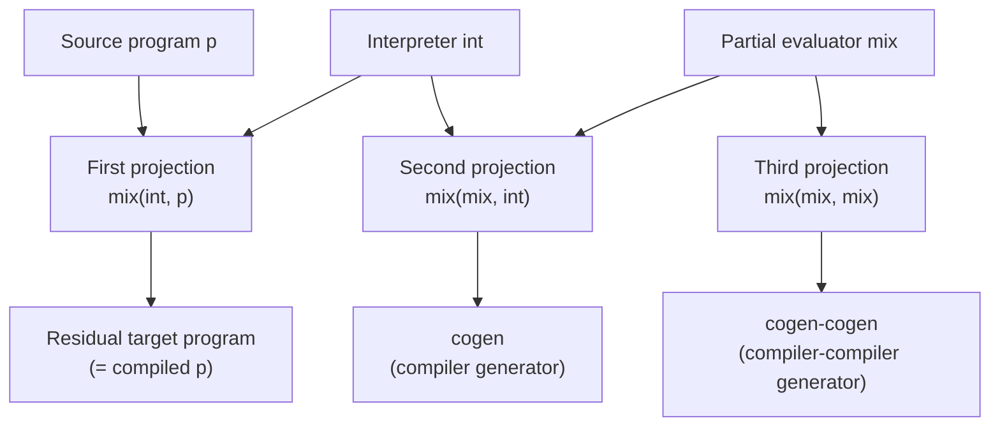
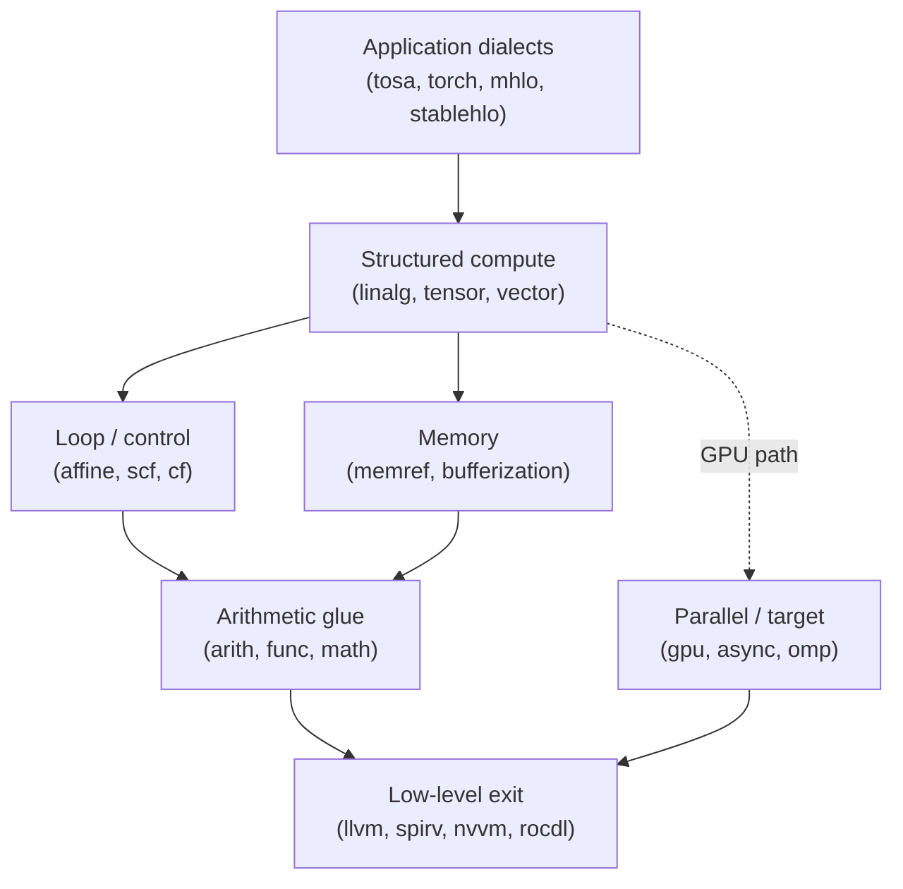
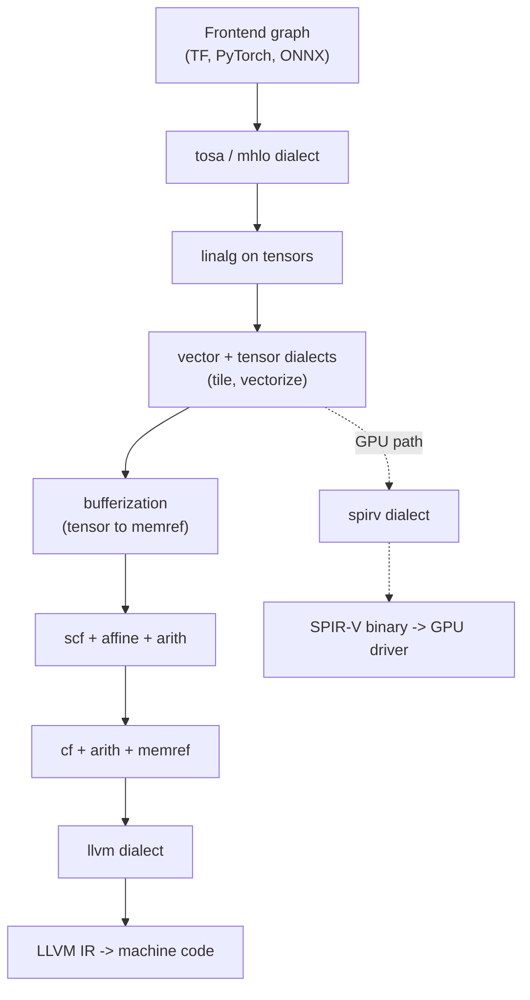

# Partial Evaluation & MLIR

Two advanced compiler topics sit at opposite ends of the abstraction spectrum but share a common theme: **staging**. **Partial evaluation** (Jones, Gomard, Sestoft, 1993) is a *temporal* staging technique — it exploits information known at different times (compile time vs. run time) to specialize a program and eliminate interpretive overhead. **MLIR** (Lattner et al., CGO 2021) is a *spatial* staging technique — it provides a single compiler infrastructure in which multiple levels of abstraction (high-level tensor algebra down to LLVM IR) coexist as dialects and are progressively lowered. Both attack the same problem: how to compose high-level, reusable transformations across heterogeneous compilation pipelines without forcing a single monolithic IR to serve every purpose. This page covers the formal foundations of partial evaluation (binding-time analysis, the three Futamura projections, and self-application producing `cogen`), the architecture of MLIR (dialects, operations, OpInterface, pattern rewriting, region/block structure, and the progressive lowering pass pipeline), and the design trade-offs that distinguish MLIR from LLVM IR and SPIR-V. Both topics appear as missing bullets in Section 3 (Compilers) of `index.md` and have no dedicated coverage elsewhere in the knowledge base.

> Related: [Runtime Systems](../cs-theory/runtime-systems.md), [Programming Language Theory](../cs-theory/programming-language-theory.md), [Formal Methods](../cs-theory/formal-methods.md), [Intermediate Representation & Optimization](./intermediate-representation.md), [JIT Compilation](./jit-compilation.md), [Code Generation & Linking](./code-generation.md)

## Part I — Partial Evaluation

### Foundations and the Specialization Theorem

**Partial evaluation (PE)** is the systematic, automatic specialization of a program with respect to *known* (static) inputs. Given a program `p` of two arguments \\( p(s, d) \\), a partial evaluator `mix` produces a residual program \\( p_s = \text{mix}(p, s) \\) such that, for every remaining (dynamic) input \\( d \\), the following holds:

\\[ \llbracket p \rrbracket(s, d) \;=\; \llbracket \,p_s\,\rrbracket(d) \\]

This **specialization theorem** (Jones, Gomard, Sestoft, *Partial Evaluation and Automatic Program Generation*, 1993, Ch. 3) is the foundational correctness statement. The residual program \\( p_s \\) is *semantically equivalent* to `p` on the static binding `s`, but it has performed all computation dependent only on `s` ahead of time — unfolding loops whose bounds are static, resolving branches whose conditions are static, propagating constants, and inlining function calls whose targets are static. The residual program is typically faster than the original because it carries less interpretive overhead. PE generalizes classical optimizations (constant folding, dead-code elimination, inlining) into a single, whole-program transformation whose correctness rests on Kleene's `s-m-n` theorem from computability theory. It is the dual of compilation: a compiler stages source-to-machine-code, while PE stages *computation across time* by exploiting any known prefix of the input.

### Binding-Time Analysis: Static vs. Dynamic

The classification of each program point as depending on **static** (known at specialization time) or **dynamic** (known only at run time) inputs is the responsibility of **binding-time analysis (BTA)**. BTA is a forward data-flow analysis over the program: a value's binding time is `S` if it depends only on static inputs and `D` if it depends (transitively) on any dynamic input. The binding times propagate through operations: `c = a + b` is static iff both `a` and `b` are static; a branch `if c then ... else ...` can be eliminated at specialization time iff `c` is static. The output of BTA is an annotated program in which every expression, every variable, and every control-flow decision carries a binding-time tag.

| Aspect | Static (S) | Dynamic (D) |
|---|---|---|
| **Availability** | Known at specialization time | Known only at run time |
| **Action of `mix`** | Evaluate now | Emit residual code |
| **Loop bounds** | Unroll fully if static | Emit residual loop |
| **Branches** | Eliminate non-taken arm | Emit residual branch |
| **Function calls** | Inline if target static | Emit residual call |
| **Examples** | Constants, config, shape of data | User input, sensor readings |

A well-annotated program makes the binding-time structure visible in the source. Consider a power function `power(n, x) = x^n` where `n` is known at specialization time but `x` is not. The annotated source marks `n` as `S` and `x` as `D`, and the specializer unfolds the recursion on `n` while leaving `x` operations in the residual:

```text
// Source:                          // Annotated (S=static, D=dynamic):
function power(n, x) {             function power(n^S, x^D) {
    if (n == 0) return 1;              if (n^S == 0) return 1;       // static branch
    if (n % 2 == 0)                    if (n^S % 2 == 0)
        return power(n/2, x*x);            return power(n/2^S, x^D * x^D);
    return x * power(n-1, x);         return x^D * power(n-1^S, x^D);
}                                  }

// Residual after mix(power, n=5):  (all static ops unfolded)
function power_5(x) { return x * x * x * x * x; }
```

The residual `power_5` has *no recursion, no branches, and no static arithmetic*. Every operation that depended only on `n` has been pre-computed; only the dynamic multiplications on `x` remain. The speedup over a generic power function is substantial — the residual is essentially the unrolled loop a hand-coder would write. The catch is that a separate residual must be produced for each distinct `n`, which is only worthwhile when `power_5` is reused many times. The BTA annotations make this specialization explicit and machine-checkable: a congruent annotation guarantees the specializer will not encounter a static operation that references a dynamic value, which would be a binding-time error.

A program is **well-annotated** if the binding-time annotations are *congruent* — i.e., no static computation depends on a dynamic value. Achieving congruence often requires **binding-time improvements**: source-level rewrites (e.g., eta-expansion, let-insertion, static argument lifting) that restructure the program so more values become static. Without these rewrites, naive BTA marks too many values dynamic and the residual program degenerates to a copy of the source.

### Online vs. Offline Partial Evaluation

There are two architectural approaches to PE, distinguished by *when* binding-time decisions are made.

| Aspect | Online PE | Offline PE |
|---|---|---|
| **Binding-time decision** | During specialization, per-value | Ahead of time, via BTA pass |
| **Cost per specialization** | High (re-analyzes) | Low (uses cached annotations) |
| **Specialization quality** | Often better (more precise) | Slightly worse (conservative BTA) |
| **Implementation** | Simpler, monolithic | Two-phase: BTA + specializer |
| **Termination guarantees** | Hard (heuristic) | Easier (offline annotations drive polyvariance) |
| **Example systems** | Schism (Consel, 1990), Similix early | Tempo (Cons-Labo, 1990s), spec-c offline mode, PGG |

**Online** PE interleaves analysis and specialization: at each program point the specializer inspects the value and decides whether to compute or emit. This is conceptually simple but re-analyzes every value at every call site, which is expensive and makes termination analysis difficult (the specializer may infinite-loop unfolding a recursion whose depth is dynamic). **Offline** PE runs BTA first, producing an annotated program in which every expression is pre-marked `S` or `D`; the specializer then performs a mechanical, syntax-directed walk that uses these marks. Offline PE is the dominant approach in practice (Schism, Tempo, PGG) because BTA can also insert **polyvariance annotations** — explicit markers that a function should be specialized once per distinct static argument tuple, which gives the specializer termination guarantees via finite-numbering of static variants.

### Polyvariance and Termination

A naive specializer that inlines a recursive function `f(n, x)` whose `n` is static will unfold the recursion by `n` levels. If `n` is large but bounded, the residual is large but finite; if `n` is unbounded (e.g., `n` is computed from a dynamic value), the specializer diverges. **Polyvariance** is the discipline of generating *multiple* specialized variants of a single function, one per distinct static argument tuple, instead of a single monolithic residual. The BTA pass assigns each function a **polyvariance annotation**: `mono` (one variant), `poly` (one per distinct static arg tuple, finitely bounded), or `dyn` (residual recursion retained). With finite polyvariance, the call graph of variants is finite and specialization provably terminates. The `cogen`-generated compiler generators (Jones et al., 1993, Ch. 10) all rely on offline BTA with explicit polyvariance annotations to guarantee termination when self-applying `mix`.

Polyvariance has a code-size cost: `poly`-annotated functions produce one residual per call site, which can bloat the residual program. Modern PE systems (Tempo, PGG) use **binding-time analysis with a heuristic polyvariance budget**: a function is made `poly` only if its call-site count is below a threshold or the call sites have sufficiently different static argument patterns. This is analogous to the inlining budget heuristic in classical compilers — both trade code size against runtime performance, and both rely on heuristics because the optimal budget is undecidable.

### The Futamura Projections

The most celebrated application of PE is the derivation of compilers from interpreters. Yoshihiko Futamura (1971) observed that if `mix` specializes an *interpreter* `int` for a *source program* `p`, the residual program is the source program *compiled to the target machine*. This is the **first Futamura projection**. Iterating `mix` on itself yields progressively more remarkable objects: a **compiler generator** (`cogen`), and finally a **compiler-compiler generator**. The three projections, in the notation of Jones et al. (1993, Ch. 6):

\\[ \text{First: } \;\; \text{mix}(\text{int}, p) \;=\; \text{target program (compiled)} \\]
\\[ \text{Second: } \;\; \text{mix}(\text{mix}, \text{int}) \;=\; \text{cogen (compiler generator)} \\]
\\[ \text{Third: } \;\; \text{mix}(\text{mix}, \text{mix}) \;=\; \text{cogen for cogen (compiler-compiler generator)} \\]

The first projection produces, for each program `p`, a separate residual program. The second projection produces a *standalone tool* `cogen` such that `cogen(int)` is a compiler — i.e., feeding `cogen` any interpreter yields a compiler for the interpreted language. The third projection produces a tool that, fed `mix`, yields `cogen` itself. The practical importance is the **self-application** property: when `mix` is specialized to itself, the residual `cogen` is typically 10–100× faster than running `mix` directly, because `mix`'s own overhead has been compiled away. This was demonstrated empirically by Jones, Tofte, and Sestoft in the 1990s with the PGG system for Scheme.



### Self-Application and `cogen`

The leap from the first to the second Futamura projection is **self-application**: using `mix` to specialize itself. This is non-trivial because `mix` is itself a complex program, and naively specializing it can produce an enormous or non-terminating residual. The trick is that `mix` is *written to be specialized*: its binding-time structure is engineered so that, when applied to its own source, every "interpreter-like" dispatch (e.g., the loop that walks the residual program) is static and gets compiled away. The residual is `cogen`, a **compiler generator**: a program that takes an interpreter as input and produces a compiler as output. The `cogen` approach is appealing because it has no runtime interpretive overhead at all — every layer of staging has been compiled away up front. The price is that `cogen` itself is large and hard to write by hand; it is produced automatically by self-applying `mix`, and its existence is the existence-proof that PE is *productive* on realistic metaprograms. Jones et al. (1993, Ch. 11) report speedups of 10–100× for `cogen`-generated compilers compared with running `mix` directly.

A schematic view of the specializer's structure clarifies why self-application works. A typical `mix` has the shape:

```text
function mix(program, static_input) {
    residual = [];
    for (instruction in program) {
        if (instruction depends only on static_input) {
            residual.append(eval(instruction, static_input));   // static: compute now
        } else {
            residual.append(instruction);                       // dynamic: emit as-is
        }
    }
    return residual;
}
```

When `mix` is applied to itself, the *outer* `mix`'s `program` argument is the source code of `mix`, and the `static_input` is the interpreter `int` to be compiled. Every iteration of the *outer* `mix`'s loop is therefore static (its loop bound is `len(mix_source)`, which is static), and every dispatch on `instruction.depends_on_static_input` becomes a compile-time decision. The residual is a program that, given `int`, emits a compiler — i.e., `cogen`. The recursion bottoms out because `mix`'s source is finite and the BTA annotations ensure finite polyvariance. The result is that the second Futamura projection is not merely a theoretical curiosity but a *practical* technique that has been implemented in PGG, Tempo, and Schism.

### Applications and Limitations

PE has been applied to many problem domains where one program is parameterized by another that changes rarely. The most prominent are: **compilers via Futamura projections** (specialize an interpreter to get a compiler, as in the PGG and Tempo systems); **FFT specialization** (Johnson et al., FFTW-style code generation: given an FFT *size* known at compile time, specialize a generic FFT routine to a hard-coded butterfly network, achieving hand-coded performance); **parser generators** (specialize a generic parser interpreter with respect to a fixed grammar to produce a hard-coded parser — the technique behind `cogen`-derived Yacc-like tools); **graphics shaders** (specialize a shading language interpreter to a fixed shader); **scientific computing kernels** (specialize generic linear algebra to a fixed matrix shape or stride); and **hardware synthesis** (specialize a hardware description language interpreter to a fixed RTL design).

The most industrially successful descendant of PE ideas is **FFTW** (Frigo & Johnson, 2005): the FFTW codelet generator takes a fixed FFT size `n` and produces a hard-coded butterfly routine specialized for that `n`, achieving performance competitive with hand-tuned vendor libraries. FFTW does not use a generic `mix` — it is a hand-written specializer for the FFT domain — but the technique is structurally identical: a static input (`n`) drives the unfolding of a generic algorithm into a hard-coded residual. Similarly, **MetaOCaml** provides multi-stage programming as a language feature: the programmer writes `.< ... >.` quotes and `.~` splices to mark which code runs now and which runs later, and the runtime produces a residual program. This is *manual* partial evaluation: the binding-time annotations are written by the programmer rather than inferred.

The technique has known **limitations**. (1) **Termination**: a naive specializer can infinite-loop unfolding a recursion whose depth is dynamic; offline PE with polyvariance annotations is the standard remedy. (2) **Code bloat**: aggressive specialization produces residual programs larger than the source; the FFTW generator caps residual size by falling back to generic code above a threshold. (3) **Binding-time improvement burden**: real programs often require non-trivial source rewrites to expose static structure, which is labour-intensive and brittle. (4) **Specialization overhead**: computing the residual takes time, so PE only pays off when the residual is reused many times. (5) **Online-vs-offline trade-off**: online PE produces tighter residuals but is slower to specialize. These limitations explain why PE, despite its elegance, has been largely superseded in production by staged compilation (MetaOCaml), JIT specialization (PyPy's tracing JIT), and IR-level multi-stage compilation (MLIR, the topic of Part II).

## Part II — MLIR

### Motivation: Why LLVM IR Is Not Enough

LLVM IR is a remarkable substrate for low-level optimization: it is in SSA form, has well-defined semantics, and supports a mature pass pipeline. But LLVM IR is a *single, low-level* abstraction: it models a register machine with pointers and arrays, not the higher-level structures (tensors, loops, parallel iteration domains, async tasks) on which high-performance domain-specific compilers (TensorFlow XLA, Torch-MLIR, IREE, Flang) want to operate. Pushing everything down to LLVM IR before optimizing forfeits information: a tensor reshape, a convolution, or a fused attention kernel becomes a sea of `getelementptr` and `load`/`store` instructions in which the original loop structure is invisible and un-analyzable.

Concretely, a single `linalg.matmul` op:

```mlir
linalg.matmul ins(%A, %B : memref<128x256xf32>, memref<256x64xf32>)
              outs(%C      : memref<128x64xf32>)
```

carries enough structural information to drive tile-and-fuse, vectorization, and parallelization passes directly — the op *is* the loop nest, in a form the optimizer can reason about. If lowered immediately to LLVM IR, this becomes dozens of `getelementptr`, `load`, `fmul`, `fadd`, and `br` instructions in which the matmul structure is unrecoverable. The same problem applies across every domain: hardware-design dialects (RTL, FIRRTL), scientific-computing dialects (finite-difference stencils), and ML dialects (transformer attention) all lose their semantic structure when forced through a single low-level IR. Conversely, *each* domain-specific compiler historically built its own IR stack (XLA's HLO, Glow, Relay, Turing-complete IRs for each deep-learning framework), duplicating optimization logic, backend lowering, and testing infrastructure. MLIR (Lattner, Amini, Shpeisman, Vasilache, et al., "MLIR: Scaling Compiler Infrastructure for Domain Specific Computation", CGO 2021) was conceived as a *reusable, extensible* compiler infrastructure in which multiple abstraction levels coexist, share infrastructure, and progressively lower to one another — eventually reaching LLVM IR or SPIR-V.

### Dialects: The Core Extensibility Primitive

The central concept of MLIR is the **dialect**: a namespace (`tensorflow`, `linalg`, `affine`, `scf`, `gpu`, `async`, `spirv`, `tosa`, `arith`, `func`, `llvm`, ...) that groups a coherent set of **operations**, **types**, and **attributes**. Operations are the atoms of MLIR IR; each operation belongs to exactly one dialect. There is no global opcode table — dialects can be defined by downstream users without forking the core. The dialect is the unit of versioning, validation, and pass partitioning. MLIR's "no reserved ops" philosophy means a third-party project can define its own `my_dialect.foo` operation, register it with the MLIR context, and have it participate in the same infrastructure (pass manager, pattern rewriting, verification, MLIR-Text-IR parser/printer) as built-in dialects.

| Abstraction level | Representative dialects | Purpose |
|---|---|---|
| **Frontend / application** | `tosa`, `torch`, `tensorflow`, `mhlo` | Capture high-level ops from a frontend (DNN, scientific) |
| **Structured compute** | `linalg`, `tensor`, `vector` | Tensor algebra, structured loop nests, vector ops |
| **Loop / control** | `affine`, `scf` | Polyhedral loop nests, structured control flow |
| **Memory** | `memref` | Buffers, layouts, strided memory |
| **Arithmetic / glue** | `arith`, `func`, `cf` | Integer/float arithmetic, function calls, branches |
| **Target / parallel** | `gpu`, `async`, `spirv`, `nvvm`, `rocdl`, `amdgpu` | GPU kernels, async tasks, SPIR-V / NVPTX / AMDGPU |
| **Low-level exit** | `llvm` | Direct mapping to LLVM IR for code generation |

This hierarchy is *not* a strict ordering — dialects are mixed freely within a single function (e.g., `linalg.matmul` operating on `tensor` values, with `arith.addi` inside its region), and lowering passes rewrite one dialect's ops into another's until only `llvm` ops remain.



The diagram shows that lowering is not strictly linear: the `linalg`/`vector` stack can route either to the CPU path (`arith` → `llvm`) or to the GPU path (`gpu`/`async` → `spirv`/`nvvm`), and a single MLIR module can mix both targets via nested `gpu.launch` regions. The dialect stack is also extensible at every level: a hardware-vendor dialect (e.g., an NPU accelerator) can plug in below `linalg` with its own lowering path without disturbing the higher-level dialects.

### Operations, Types, Attributes, OpInterface, Traits

An MLIR **operation** is the universal AST node. Every operation has: a *name* (`linalg.matmul`), *operands* (SSA values), *results* (SSA values), a *region* (optional nested IR, for ops like `scf.for` or `linalg.generic`), *attributes* (compile-time constants such as `strides = [1, 1]`), a *successor list* (for branches), and a dictionary of *properties*. Operations are first-class: they can be inspected, rewritten, and created at any time by a pass. **Types** describe operand and result values (`tensor<4x8xf32>`, `memref<16x16xf32, strided<[16, 1]>>`, `!torch.vtensor`, etc.). **Attributes** are compile-time values attached to operations; they are immutable, structural, and may themselves contain types and other attributes.

```mlir
// A linalg.matmul op: C[m,n] = A[m,k] * B[k,n] + C[m,n]
%result = linalg.matmul
    ins(%A, %B : tensor<4x8xf32>, tensor<8x16xf32>)
    outs(%C : tensor<4x16xf32>) -> tensor<4x16xf32>

// An scf.for loop with a region body
%sum = scf.for %i = %c0 to %n step %c1 iter_args(%acc = %init) -> (f32) {
    %x = memref.load %buf[%i] : memref<?xf32>
    %new = arith.addf %acc, %x : f32
    scf.yield %new : f32
}
```

**Traits** are static, mixin-like behaviors attached to operation classes (`HasParent`, `IsolatedFromAbove`, `SameOperandsAndResultType`, `Terminator`). **OpInterfaces** are *dynamic* contracts: a set of methods an operation promises to implement, queried at run time via `dyn_cast<SomeOpInterface>`. Interfaces (e.g., `MemoryEffectOpInterface`, `LoopLikeOpInterface`, `DestinationStyleOpInterface`) let a generic pass reason about operations it has never seen, provided the operation's author implemented the interface. This is the key to writing *dialect-agnostic* passes: a loop-fusion pass can operate on any op implementing `LoopLikeOpInterface`, whether it is `scf.for`, `affine.for`, or a third-party loop op. Interfaces are the design pattern that lets MLIR scale: pass authors target interfaces, dialect authors implement them, and the two combine without prior coordination.

### Pattern Rewriting and the Pass Pipeline

MLIR transformation is built on **DAG-to-DAG pattern rewriting**: a *pattern* is a function that matches a subtree of operations and replaces it with a different subtree. Patterns are small, composable, and apply locally. The **PatternRewriter** infrastructure (mirrored after LLVM's `DAGCombiner`) drives pattern application: it walks the IR, fires patterns whose matchers succeed, and rewrites the IR in place. Patterns can express trivial rewrites (`%0 = arith.addf %x, %c0 -> %x`) or complex lowering sequences (`linalg.matmul` → nested `scf.for` + `arith.mulf` + `arith.addf`). A set of patterns is bundled into a **RewritePatternSet**, which a pass (e.g., `--convert-linalg-to-loops`) applies to the whole function. Patterns are dialect-agnostic: a single pattern can match ops from any dialect that implements the required interfaces.

A canonical pattern in C++ looks like the following sketch — the `RewritePattern` subclass declares the op it matches, and `matchAndRewrite` performs the substitution:

```cpp
// Pattern: arith.addf x, 0 -> x   (algebraic simplification)
struct AddZeroPattern : public OpRewritePattern<arith::AddFOp> {
    using OpRewritePattern::OpRewritePattern;

    LogicalResult matchAndRewrite(arith::AddFOp op,
                                  PatternRewriter &rewriter) const override {
        // match: is one operand the constant 0.0?
        if (auto rhs = op.getRhs().getDefiningOp<arith::ConstantFOp>()) {
            if (rhs.getValue().isZero()) {
                rewriter.replaceOp(op, op.getLhs());   // perform the rewrite
                return success();
            }
        }
        return failure();
    }
};

// Register the pattern in a pass:
void MyPass::runOnOperation() {
    RewritePatternSet patterns(&getContext());
    patterns.add<AddZeroPattern>(patterns.getContext());
    if (failed(applyPatternsAndFoldGreedily(getOperation(),
                                           std::move(patterns))))
        signalPassFailure();
}
```

Patterns can also be written declaratively in **PDLL** or **DRR** (tablegen-based), which compiles to the same C++ infrastructure but lets non-C++-fluent domain experts contribute rewrites. The pattern infrastructure handles the bookkeeping of inserted/erased ops, maintained dominance, and SSA value replacement, so that the pattern author only needs to describe the *local* rewrite.

**Passes** are the coarse-grained unit of transformation. A pass operates on an IR unit (a `ModuleOp`, a `FuncOp`, or a function body) and runs a fixed sequence of analyses + rewrites. Passes are scheduled by the **pass manager**, which runs them in textual order: `--pass1 --pass2 --pass3`. The pass pipeline is specified on the command line as a flat string of pass invocations:

```bash
# A typical MLIR lowering pipeline for a TF model to LLVM IR
mlir-opt input.mlir \
  -tf-tosa-to-linalg \
  -convert-linalg-to-loops \
  -convert-scf-to-cf \
  -convert-linalg-to-llvm \
  -convert-vector-to-llvm \
  -convert-func-to-llvm \
  -reconcile-unrealized-casts
```

The pipeline is *progressive*: each pass lowers a chunk of the IR from a higher-level dialect to a lower-level one, until only `llvm` ops remain. Crucially, the pass manager permits **interleaving**: a pass can run on a function whose IR mixes dialects from many levels, and only the targeted dialect is rewritten. This is the structural difference between MLIR and LLVM: LLVM has a *single* IR and a *fixed* pass pipeline; MLIR has *many* IRs (dialects) and a *user-assembled* pipeline.

### Region/Block Structure and Dominance

MLIR operations may contain **regions** — nested IR blocks. A region belongs to a single *parent op* (e.g., `scf.for`'s body, `func.func`'s function body, `gpu.launch`'s kernel body). A region contains one or more **blocks**, each ending in a terminator. Blocks contain operations, which may themselves have regions, yielding a tree-shaped IR. This structure lets MLIR represent *structured control flow* directly: `scf.if` has two region blocks (then/else); `scf.for` has one; `scf.parallel` has one. Unlike LLVM IR, which has a flat CFG of basic blocks connected by branches, MLIR's region tree enforces structuring — you cannot `goto` into the middle of an `scf.for` body from outside.

**Dominance** in MLIR follows the region tree. An SSA value defined in block B is visible in B and in all blocks dominated by B, *and* in nested regions of B's parent op (subject to capture rules). The `IsolatedFromAbove` trait guarantees that a region cannot reference SSA values defined in enclosing ops, which is essential for the pass manager to reason about transformation locality — passes can be run in parallel on isolated regions. The dominance rules combine the SSA discipline of LLVM with the lexical scoping discipline of functional languages, giving MLIR both the data-flow precision of SSA and the program-structure precision of an AST.

### Bufferization: From Values to Memory

A particularly important lowering step in MLIR is **bufferization**: the transformation from value-semantics `tensor` types to memory-semantics `memref` types. In the `tensor` world, operations are pure — `tensor.insert` returns a new tensor, and the original is unchanged. This is mathematically clean but allocation-prohibitive at run time. Bufferization rewrites the IR so that tensors become in-place buffers: each `tensor.insert` becomes a `memref.store` into a buffer that subsequent ops read in place. The `bufferization` dialect implements a **one-shot bufferizer** that performs a global analysis to determine which tensors can share storage, eliminating temporaries and converting the IR from functional to imperative style in a single pass.

Bufferization is the canonical example of *deliberate structure loss*: it is the step at which the high-level functional IR becomes low-level imperative IR, and it is invoked only after all tensor-level transformations (tile-and-fuse, vectorization, dead-arg elimination) have run. After bufferization, the IR is in `memref`+`scf`+`arith` form, ready for further lowering to `llvm`. The fact that bufferization is an explicit, isolatable pass — rather than scattered across many transformation steps — is a direct consequence of MLIR's multi-dialect design: each level of abstraction has its own dialect, and crossings between levels are visible as pass boundaries in the pipeline.

### Progressive Lowering

The defining workflow of MLIR is **progressive lowering**: starting from a high-level dialect (e.g., `tosa` or `mhlo`), a sequence of passes lowers each op into lower-level dialects, eventually reaching `llvm` (for CPU codegen) or `spirv`/`nvvm`/`rocdl` (for GPU codegen). At each step, structure is preserved until it is *deliberately* discarded — `linalg.matmul` is rewritten into `scf.for` + `arith` ops only when the loop-fusion and tile-and-fuse passes have finished exploiting its high-level structure. This is the opposite of "lower early": late lowering preserves optimization opportunity.



The dashed GPU branch shows that progressive lowering is *not* a single chain: depending on the target, the same `linalg`/`vector` IR can be lowered either to `llvm` for CPU or to `spirv` for a GPU. This multi-target lowering from a shared high-level IR is precisely the capability that motivated MLIR's design — every prior DL compiler had a separate stack for CPU and GPU, duplicating the optimization logic.

### MLIR vs. LLVM IR vs. SPIR-V

| Aspect | MLIR | LLVM IR | SPIR-V |
|---|---|---|---|
| **Abstraction level** | Multiple (high to low) | Single (low) | Single (low) |
| **Extensibility** | User-defined dialects | Fork required (rare) | Spec-controlled, versioned |
| **Type system** | Pluggable (tensor, memref, custom) | Fixed (int, float, ptr, vector, struct) | Fixed (GLSL/SPIR-V types) |
| **Region/structure** | Nested regions, structured CF | Flat CFG of basic blocks | Flat CFG of basic blocks |
| **Primary use** | DS compilers, polyglot lowering | System-language codegen | GPU shaders, OpenCL, Vulkan |
| **Target audience** | Compiler writers (libraries) | System compiler (clang, rustc) | GPU vendors, graphics APIs |
| **Lowering exit** | Lowers *to* LLVM IR / SPIR-V | Lowers *to* machine code | Consumed by GPU drivers |
| **Pass model** | User-assembled pipeline | Fixed pipeline in opt | No pass manager (consumer-side) |

MLIR is therefore **not a competitor** to LLVM IR or SPIR-V — it is a *meta-infrastructure* that lowers to either of them. The relationship is: MLIR provides the high- and mid-level IR stack that LLVM IR and SPIR-V refuse to provide, then exits to them for final code generation. This is why MLIR is sometimes described as "LLVM's frontend problem, generalized".

### Real-World Users

MLIR is the substrate for an expanding ecosystem of compilers. **TensorFlow XLA / StableHLO**: the new StableHLO dialect is the portable op set for ML models; XLA's MLIR backend lowers StableHLO through `linalg` to `llvm` for CPU/GPU/TPU. **IREE** ("Intermediate Representation Execution Environment", Google): compiles ML models to native code ahead-of-time, using MLIR end-to-end. **Torch-MLIR**: lowers PyTorch models into MLIR (via the `torch` dialect) and then to `linalg`/`llvm`. **Flang** (LLVM's Fortran front-end, `flang-new`): uses MLIR's `fir` (Fortran IR) dialect for high-level Fortran semantics before lowering to LLVM IR. **CIRCT** ("Circuit IR Compilers and Tools"): applies MLIR to hardware design, with dialects for RTL, FIRRTL, and synthesis. **Polygeist**: an MLIR-based C-to-CUDA compiler and C-to-MLIR frontend. **OpenAI Triton**: uses MLIR internally for its tile-based GPU kernel compiler. **Mojo** (Modular): uses MLIR as the compiler backbone for its AI-oriented language. The breadth of these projects is itself the design-validation of MLIR: a single extensible IR stack that admits domain-specific dialects without forking the infrastructure.

| Project | Domain | Entry dialect | Exit target |
|---|---|---|---|
| **XLA / StableHLO** | ML training/serving | `stablehlo`, `mhlo` | `llvm` / `nvvm` / `rocdl` |
| **IREE** | AOT ML deployment | `flow`, `hal`, `vm` | `llvm` / `spirv` |
| **Torch-MLIR** | PyTorch graphs | `torch` | `linalg` → `llvm` |
| **Flang** | Fortran | `fir` | `llvm` |
| **CIRCT** | Hardware (RTL/FIRRTL) | `hw`, `firrtl`, `sv` | Verilog / SystemVerilog |
| **Triton** | GPU tile kernels | `triton` | `llvm` (NVPTX / AMDGPU) |
| **Mojo** | AI systems language | `mojo`, `func` | `llvm` |

The diversity of these entry dialects (machine-learning graphs, Fortran programs, hardware descriptions, GPU kernels, a new language) is the empirical validation of MLIR's central claim: that a single extensible IR infrastructure can host domain-specific dialects without forking the compiler. Every one of these projects previously would have required its own IR design, its own pass infrastructure, and its own lowering to LLVM IR — duplicating perhaps 80% of the compiler infrastructure to obtain the 20% that is domain-specific. MLIR inverts that ratio: 80% of the infrastructure is shared, and each project contributes only its dialects and lowering passes.

## Cross-References

- [Runtime Systems](../cs-theory/runtime-systems.md) — partial evaluation specializes runtime interpreters; JIT compilation is runtime partial evaluation with profile-guided dynamic inputs.
- [Programming Language Theory](../cs-theory/programming-language-theory.md) — binding-time analysis is a forward data-flow analysis; PE correctness rests on the s-m-n theorem.
- [Formal Methods](../cs-theory/formal-methods.md) — the specialization theorem is a semantic equivalence proof; PE and MLIR type systems are formal artifacts.
- [Intermediate Representation & Optimization](./intermediate-representation.md) — SSA, dominance, and pass-manager concepts that MLIR extends with regions and dialects.
- [JIT Compilation](./jit-compilation.md) — JIT specialization is online PE at run time; tracing JITs (PyPy) are an instance of trace-based partial evaluation.
- [Code Generation & Linking](./code-generation.md) — final exit of MLIR's progressive lowering pipeline.

## References

- Jones, N. D., Gomard, C. K., & Sestoft, P. (1993). *Partial Evaluation and Automatic Program Generation*. Prentice Hall. Online: <https://www.itu.dk/people/sestoft/pebook/pebook.html>
- Futamura, Y. (1971). *Partial Evaluation of Computation Process — An Approach to a Compiler-Compiler*. Systems · Computers · Controls, 2(5), 45–50. Reprinted in Higher-Order and Symbolic Computation 12(4), 1999: <https://link.springer.com/article/10.1023/A:1010095603625>
- Consel, C. (1990). *Binding Time Analysis for Higher Order Untyped Functional Languages*. LFP '90.
- Birkedal, L., & Welinder, M. (1994). *Hand-writing Program Generator Generators*. Master's thesis, DIKU, University of Copenhagen (documents `mix` self-application speedups).
- Lattner, C., Amini, M., Shpeisman, T., Vasilache, N., et al. (2021). *MLIR: Scaling Compiler Infrastructure for Domain Specific Computation*. CGO 2021. <https://arxiv.org/abs/2002.11054>
- MLIR documentation: <https://mlir.llvm.org/>
- MLIR Dialects reference: <https://mlir.llvm.org/docs/Dialects/>
- MLIR Pass Infrastructure: <https://mlir.llvm.org/docs/PassManagement/>
- Vasilache, N. et al. (2019). *Tensor Comprehensions: Framework-Agnostic High-Performance Machine Learning Abstractions*. arXiv:1902.08653 (predecessor design influencing `linalg`).
- IREE project: <https://iree.dev/>
- CIRCT project: <https://circt.llvm.org/>
- Flang documentation: <https://flang.llvm.org/>
- Frigo, M., & Johnson, S. G. (2005). *The Design and Implementation of FFTW3*. Proceedings of the IEEE, 93(2), 216–231 (FFTW code generation as a non-PE specialization case study).

## Interview Questions

1. **What is partial evaluation, and what does the specialization theorem state?** Partial evaluation specializes a program `p(s, d)` with respect to a known static prefix `s`, producing a residual `p_s` such that for all dynamic `d`, `⟦p⟧(s,d) = ⟦p_s⟧(d)`. The residual program carries no static-only computation; it has been pre-performed. This is the foundational correctness theorem (Jones et al., 1993) and rests on Kleene's s-m-n theorem.

2. **Explain the three Futamura projections and what each produces.** (1) `mix(int, p)` produces the residual target program — i.e., `p` "compiled" by specializing the interpreter. (2) `mix(mix, int)` produces `cogen`, a compiler generator: feed `cogen` an interpreter and you get a compiler. (3) `mix(mix, mix)` produces a cogen for cogen, i.e., a compiler-compiler generator. The leap from the first to the second is *self-application* of `mix`, which is feasible only because `mix` is engineered to be specialized.

3. **What is binding-time analysis, and what problem does offline PE solve?** BTA classifies every program value as static (known at specialization time) or dynamic (run-time only). Offline PE runs BTA first, producing a fully annotated program; the specializer then walks the annotated program mechanically. This separates analysis cost (paid once) from specialization cost (paid per residual), enables polyvariance-based termination guarantees, and is the dominant approach in production PE systems (Tempo, PGG).

4. **Why does MLIR exist? Why not just use LLVM IR for everything?** LLVM IR is too low-level to express high-level structured operations (tensors, polyhedral loop nests, async tasks) without losing information. Pushing a tensor convolution down to `getelementptr`+`load`+`store` forfeits the loop structure that tile-and-fuse optimizations need. MLIR provides a multi-level IR stack in which high-level structure survives until it is *deliberately* lowered, then exits to LLVM IR (or SPIR-V) for final code generation. It also avoids the prior duplication of IR infrastructure across XLA, Glow, Relay, etc.

5. **What is an MLIR dialect, and how does it differ from an operation?** A dialect is a namespace grouping a coherent set of operations, types, and attributes (e.g., `linalg`, `scf`, `gpu`). An operation (`linalg.matmul`, `scf.for`) belongs to exactly one dialect. Dialects are the unit of extensibility: third-party projects can register new dialects without forking MLIR. There is no global opcode table; the dialect namespace (`my_dialect.foo`) prevents collision.

6. **What is the difference between an OpInterface and a Trait in MLIR?** A **Trait** is a static, compile-time mixin attached to an operation's C++ class (e.g., `HasParent`, `SameOperandsAndResultType`). An **OpInterface** is a *runtime-queried* contract — a set of methods an operation promises to implement, dispatched via `dyn_cast`. Interfaces let a pass reason about operations it has never seen before, provided the operation's author implemented the interface (e.g., `MemoryEffectOpInterface`, `LoopLikeOpInterface`). This is the key design pattern that makes MLIR pass code dialect-agnostic.

7. **Explain progressive lowering in MLIR and why it matters.** Progressive lowering is the workflow of converting high-level ops (e.g., `tosa`/`mhlo`) through `linalg`/`vector`/`tensor` to `scf`/`arith`/`memref` and finally to `llvm` or `spirv`. At each step, structure is preserved until it is *deliberately* discarded, so high-level transformations (tile-and-fuse, vectorization) can fire while they still have semantic information to exploit. The opposite — lowering to LLVM IR immediately — forfeits that information. The pipeline is user-assembled as a sequence of passes on the command line.

8. **Why is MLIR described as a "meta-infrastructure" rather than a competitor to LLVM IR or SPIR-V?** MLIR does not replace LLVM IR or SPIR-V — it lowers *to* them. MLIR provides the high- and mid-level IR stack that LLVM IR and SPIR-V deliberately omit, then exits to one of them for final code generation. A single MLIR pipeline can lower the same `linalg` IR to `llvm` for CPU *or* `spirv` for GPU, which prior domain-specific compilers had to duplicate per target. MLIR is thus the shared frontend infrastructure for many DS compilers, not a competing low-level IR.
