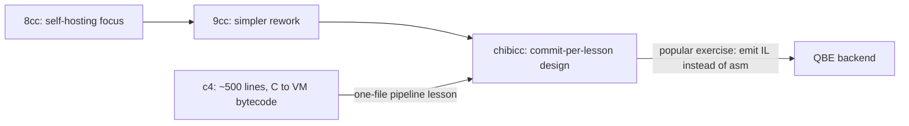
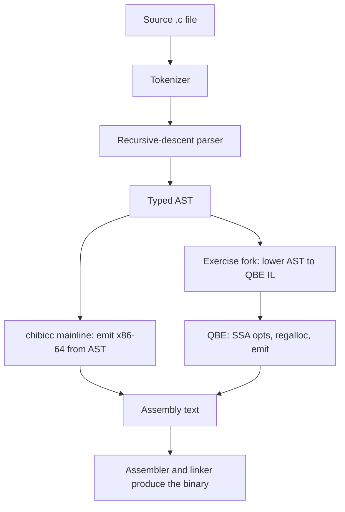

# Reading Small Compilers: chibicc & QBE

## Overview

Most compiler curricula teach theory from the Dragon Book and then jump straight into GCC or LLVM, where a student drowns in millions of lines of code, dozens of targets, and fifteen years of layered abstractions. The alternative is to read a compiler small enough to hold in your head: Rui Ueyama's **chibicc** (a C compiler whose git history is a step-by-step course), **QBE** (a compact SSA-based optimizing backend), and **c4** (a complete C interpreter in roughly 500 lines). This page is a reading guide: what each project teaches, in what order, and why this material shows up constantly in compiler, language-runtime, and systems-performance interviews.

## Why a Tiny Compiler Beats GCC or LLVM First

Industrial compilers are optimized for the wrong things from a learner's perspective. GCC and LLVM prioritize peak performance across dozens of architectures, decades of accumulated standards conformance, aggressive interprocedural optimization, and debugging infrastructure — all of which bury the core algorithmic ideas under an avalanche of engineering. You can spend months inside LLVM learning its pass manager before you ever see a complete program travel from tokens to machine code.

Small compilers invert that ratio. chibicc is on the order of 10,000 lines of C; QBE is a similar scale; c4 is under 1,000. At that size, the *entire pipeline* is visible: you can trace one statement — say `x = a[i+1];` — from source text to emitted assembly in a single reading session. Three concrete advantages follow from this.

1. **Completeness**: you see every stage, including the unglamorous ones (calling conventions, stack frame layout, object file emission) that tutorials skip but interviews ask about.
2. **Debuggability**: when the whole compiler is 10k lines, you can add a print statement anywhere and recompile in seconds, experimenting freely instead of reading docs.
3. **Signal density**: every design decision in a small compiler is visible and debatable — why recursive descent instead of a parser generator, why no IR, why push/pop codegen instead of register allocation. Those "why" questions are exactly what interviewers probe.

The skill you build — reading a system end-to-end and explaining each transformation — transfers directly to real work on LLVM-based toolchains, JITs, and DSLs. You are not learning a toy for its own sake; you are learning the shape of the problem before the scale obscures it.

## chibicc: A Compiler Where Every Commit Is a Lesson

chibicc is Rui Ueyama's C compiler (<https://github.com/rui314/chibicc>), built explicitly as a study tool after his earlier teaching compilers 8cc and 9cc. Its defining property is the **commit history**: each commit adds exactly one language feature or one internal mechanism, with a commit message that names the lesson. The early commits are almost embarrassingly small — "Add `;`", "Add `+`", "Add `-`, unary `-`" — and by the end the compiler handles most of C11 and can compile real software such as SQLite. Reading `git log -p` in order is a structured course in compiler construction; roughly a hundred-plus lessons, each diff small enough to review in minutes.

### The lineage: 8cc → 9cc → chibicc

Ueyama's teaching-compiler line runs 8cc (self-hosting focus, famously clever but dense code), 9cc (a deliberate simplification, closer to a textbook structure), and chibicc (the cleaned-up synthesis, with the commit order designed for learners). c4 by Robert Swiersecki occupies a parallel niche: the whole pipeline in one file. QBE, a third-party backend, pairs naturally with the later study step of separating frontend from backend.



### Stage 1 — Tokenizer

chibicc represents tokens as a linked list of small structs and processes source with two primitive operations: `peek()` to look ahead and `consume()` to match and advance. No symbol table, no trie, no generator — just a pointer walk over the input.

```c
typedef struct Token Token;
struct Token {
  TokenKind kind;   // TK_IDENT, TK_PUNCT, TK_NUM, TK_KEYWORD, TK_EOF
  Token *next;
  long val;         // value if kind == TK_NUM
  char *loc;        // token start in the source text
  int len;          // token length
};

// Parser idiom used everywhere:
static void expect(char *op) {
  if (!equal(tok, op))
    error_tok(tok, "expected '%s'", op);
  tok = tok->next;
}
```

The lesson: a lexer is *just* prefix matching over keywords and punctuation plus a number scanner. Interviewers ask "how would you tokenize C?" precisely because the honest answer is this simple — the hard parts hide elsewhere.

### Stage 2 — Recursive-descent parser

The parser mirrors the grammar as nested functions, one per precedence level. Each returns an AST node and consumes what it accepts. This is the same structure taught in [parsing](./parsing.md), but stripped of parser-generator machinery.

```c
// equality := relational ("==" relational | "!=" relational)*
static Node *equality(void) {
  Node *node = relational();
  for (;;) {
    if (equal(tok, "==")) {
      tok = tok->next;
      node = new_binary(ND_EQ, node, relational());
    } else if (equal(tok, "!=")) {
      tok = tok->next;
      node = new_binary(ND_NE, node, relational());
    } else {
      return node;
    }
  }
}
```

Left associativity falls out of the loop, precedence out of the call nesting, and error reporting out of `expect()` pointing at exact source locations. The AST is a flat `Node` struct with a kind tag — no class hierarchy, no visitor pattern.

### Stage 3 — Type checking

A single recursive walk, `add_type()`, computes and attaches a `Type*` to every node, inserting implicit conversions: integer promotion, array-to-pointer decay, and the scaling that turns `a[i]` into `a + i * sizeof(*a)`. Pointer arithmetic is the canonical example — the parser leaves `a + i` as a raw addition, and the type pass rewrites it into a multiply-by-8 for `long*`. This is the content of [semantic-analysis](./semantic-analysis.md) rendered in about two hundred lines of C.

### Stage 4 — Code generation, with no IR

Here is chibicc's most instructive decision: there is **no intermediate representation**. Code generation walks the typed AST and emits x86-64 in a *stack-machine style* — compute an operand, push it, compute the other, pop, operate. Temporary values live on the stack, not in registers.

```c
// Depth-first codegen: push/pop discipline
static void gen_expr(Node *node) {
  switch (node->kind) {
  case ND_ADD:
    gen_expr(node->lhs);
    gen_expr(node->rhs);
    println("  pop %%rdi");
    println("  pop %%rax");
    println("  add %%rdi, %%rax");
    println("  push %%rax");
    return;
  ...
```

This eliminates register allocation entirely — the register allocator is "the stack". It is slow, and that is the point: it is the baseline from which every later optimization (register caching, target-specific addressing modes, an SSA IR like QBE's) is an improvement. When an interviewer asks "why does LLVM need an IR at all?", the strongest answer starts from what breaks without one, and chibicc is that answer made executable.

### Stage 5 — Stack frames and the ABI

chibicc's prologue allocates one stack slot per local, addresses them as `%rbp` offsets, and lets `gen_addr()` compute lvalues:

```asm
# prologue
  push %rbp
  mov  %rsp, %rbp
  sub  $208, %rsp        # 26 locals * 8 bytes
# accessing a local at offset -8
  lea  -8(%rbp), %rax
  push %rax
```

Because every parameter and local gets a deterministic frame offset, calling conventions (SysV x86-64: first six integer args in `%rdi, %rsi, %rdx, %rcx, %r8, %r9`, the rest on the stack) become concrete instead of folklore. For C-heavy systems interviews, this section of chibicc is arguably the highest-value reading there is — see also [../languages/c/compilation.md](../languages/c/compilation.md).

## QBE: A Small Retargetable Backend

QBE (<https://c9x.me/compile/>) is an optimizing compiler backend written in C, deliberately sized so one person can understand all of it (roughly 10k lines). Its stated goal is to deliver a large majority of the performance of industrial backends with a small fraction of their code — QBE's own framing is "70% of the performance in 10% of the code". Where LLVM is a framework ecosystem, QBE is a single executable you feed an IL file and it emits x86-64 (SysV) or ARM64 assembly. chibicc's mainline emits x86-64 directly from its AST, but because that AST is target-independent, a classic study exercise is to replace the emitter with a QBE-IL emitter — several public forks do exactly this, and doing it teaches you what "lowering" actually means.

### The IL, by example

QBE's input language is tiny: types are `w` (word/32-bit), `l` (long/64-bit), `s`/`d` (float/double), `h` (half); temporaries are `%`-prefixed; labels are `@`-prefixed; aggregate memory lives through explicit `load`/`store`.

```
# add.il — compile with: qbe add.il > add.s
function $add(l %a, l %b) {
@start
        %c =l add %a, %b
        ret %c
}

data $msg = { b "sum: %d\n", b 0 }

export
function $main(w %argc, l %argv) {
@start
        %r =l call $add(l 40, l 2)
        l %fmt =l copy $msg
        call $printf(l %fmt, w %r, ...)
        ret w 0
}
```

Two properties deserve attention. First, the IL is **SSA** (every temporary is assigned once) — see [intermediate-representation](./intermediate-representation.md) for why that makes optimization passes short. Second, varargs and calls are explicit in the IL, so the backend controls ABI details rather than the frontend — a clean frontend/backend contract.

### How QBE compares to LLVM IR, conceptually

| Dimension | QBE IL | LLVM IR |
|---|---|---|
| Scope | Backend IR: SSA + explicit memory ops | Full IR: SSA, debug metadata, attrs, opaque pointers, intrinsics |
| Pass count | A handful: copy propagation, constant folding, GVN-based CSE, load/store elimination, regalloc | Hundreds, behind a pass manager with new/legacy pipelines |
| Textual stability | Tiny, stable spec | Text format documented, but churns across versions |
| Ecosystem | None — a standalone binary | Huge: libraries, JIT (ORC), bindings, MLIR sibling |
| Learning cost | A weekend | Months |

The conceptual overlap is the point: both are SSA, both keep control flow explicit as CFG blocks, both lower memory accesses through explicit `load`/`store` after promotion. Reading QBE after the theory in [intermediate-representation](./intermediate-representation.md) makes SSA *tactile*: you can watch mem2reg-style promotion and copy propagation happen on ten-line inputs. For contrast with a framework-style IR stack, read [partial-evaluation-mlir](./partial-evaluation-mlir.md).

### Frontend/backend split



## c4: The Smallest Useful Interpreter

c4 (<https://github.com/rswier/c4>) is "C in four functions": a single ~500-line file containing a lexer, a recursive-descent parser for a C subset, a code generator, and a virtual machine that executes the result. There is no optimizer, no preprocessor beyond simple handling, and no libc — but it can compile and run real (small) C programs, including an interpreter for itself.

Its VM dispatch loop is the moral of the story:

```c
// opcodes are just small integers; the VM is a switch
enum { LEA, IMM, JMP, JSR, BZ, BNZ, ENT, ADJ, LEV, LI, LC, SI, SC, PSH,
       OR, XOR, AND, EQ, NE, LT, GT, ADD, SUB, MUL, DIV, MOD, EXIT };
...
while (op) {
  pc++;  // fetch
  op = *pc;
  switch (op) {
  case IMM: ax = *++pc; break;         // load immediate
  case ADD: ax = *sp++ + ax; break;    // pop, add, result in ax
  case PSH: *--sp = ax; break;
  ...
```

Reading c4 teaches three things in an afternoon: (1) compilation can be as simple as *emitting integers* for a VM you also wrote; (2) a calling convention is a stack discipline you invent and then obey (`ENT`/`LEV` for frame enter/leave, `ADJ` for caller-cleanup); (3) a symbol table is just a typed array scanned linearly. Every "how do JITs and interpreters differ" conversation benefits from having this baseline — see [jit-compilation](./jit-compilation.md) for where the next step (compiling to native code instead of VM bytecode) takes you.

## A Study Path: Parse → Type → Lower → Regalloc → Emit

The canonical five-stage mental model, mapped onto the projects above:


1. **Tokenize** — chibicc commits "Add numbers/identifiers/punctuators". Deliverable: explain how you'd tokenize string literals, escapes, and longest-match punctuation.
2. **Parse** — read the precedence chain `primary → unary → mul → add → relational → equality → assign → expr`. Deliverable: sketch the function chain for `a = b + c * -d;`.
3. **Type** — read `add_type()` and pointer scaling. Deliverable: explain every implicit conversion in `char c; long *p; p + c;`.
4. **Lower** — contrast chibicc's no-IR codegen with emitting QBE IL. Deliverable: state what an IR buys (target independence, optimization locus) and what it costs (an extra abstraction, SSA construction machinery).
5. **Register allocation** — chibicc: none (stack machine). QBE: a real allocator after SSA opts. Deliverable: explain spilling, caller/callee-saved registers, and why allocation happens after optimization.
6. **Emit** — chibicc's prologue/epilogue, call sequence, and the assembler/linker boundary. Deliverable: write the x86-64 prologue from memory and justify each instruction.

Budget roughly: c4 in one evening, chibicc's first 30 commits in a weekend, the full log across a few weeks, QBE's IL + one optimization pass last.

## Interview Relevance

For **compiler/language roles**, the standard question set — "design a parser", "what is SSA and why", "how do stack frames work", "where would you add an optimization pass", "how does a JIT differ from AOT" — maps one-to-one onto chapters of this reading. Candidates who have actually read a compiler answer with concrete mechanism instead of textbook definition, which is the entire differentiator.

For **general systems roles**, the payoff is fluency with ABIs, registers, and the memory hierarchy as seen from above: why local-variable-heavy functions are cheap, what a function call really costs, why `restrict` and aliasing matter to optimizers. Reading chibicc's codegen is the fastest way to make assembly un-scary, which improves performance-debugging interviews across the board. A practical prep drill: pick one line of chibicc's generated assembly and reconstruct the C line that produced it; do five per day for a week.

## Cross-References

- [Lexical Analysis](./lexical-analysis.md) — the theory behind the tokenizer stage you read in chibicc.
- [Parsing](./parsing.md) — grammars, LL/LR, and where recursive descent fits.
- [Semantic Analysis](./semantic-analysis.md) — the type-checking pass rendered in two hundred lines.
- [Intermediate Representation](./intermediate-representation.md) — SSA concepts that QBE makes concrete.
- [Code Generation](./code-generation.md) — instruction selection, scheduling, and emission.
- [JIT Compilation](./jit-compilation.md) — the runtime counterpart of the c4-style VM.
- [Partial Evaluation & MLIR](./partial-evaluation-mlir.md) — a framework-scale contrast to QBE minimalism.
- [C: Compilation Model](../languages/c/compilation.md) — headers, translation units, linking details behind chibicc's output.

## References

- chibicc — Rui Ueyama's small C compiler: <https://github.com/rui314/chibicc>
- QBE — a small compiler backend (IL reference and design notes): <https://c9x.me/compile/>
- c4 — C in four functions: <https://github.com/rswier/c4>
- Rui Ueyama, *How I wrote a self-hosting C compiler in 40 days* (essay describing the 8cc/9cc method) — cited by name, widely mirrored.
- Aho, Lam, Sethi, Ullman, *Compilers: Principles, Techniques, and Tools* (Dragon Book) — theory companion.

## Interview Questions

1. **Why read chibicc before GCC or LLVM, and what specifically do you gain?** chibicc is ~10k lines where every commit adds one lesson, so you can see the full pipeline from tokens to x86-64 within one mental model. GCC/LLVM bury those ideas under multi-million-line engineering: dozens of targets, hundreds of passes, layered metadata. You gain concrete mechanism — stack frames, calling conventions, precedence-climbing parsers — that transfers to any industrial backend. The reading is also fast to experiment with, since the whole compiler rebuilds in seconds.
2. **chibicc has no IR. What does a compiler lose and gain by emitting directly from the AST?** You gain simplicity: no SSA construction, no IR data structures, and a codegen you can write in a few hundred lines. You lose target independence (the emitter is bound to x86-64 SysV), most optimization opportunity (a stack-machine emit cannot easily cache values in registers), and a clean place for mid-level transformations like loop-invariant code motion. Interviews expect you to connect this to why LLVM-style IRs exist: they amortize N frontends × M backends × K optimizations.
3. **What is QBE, and how does its IL relate to LLVM IR conceptually?** QBE is a small, retargetable, SSA-based optimizing backend aiming to deliver most of the performance of industrial backends at a fraction of the code. Its IL is SSA with typed temporaries (`w`, `l`, `s`, `d`), explicit labels, and explicit `load`/`store` — conceptually the same family as LLVM IR, but with a handful of passes instead of hundreds and a stable, tiny textual spec. Reading it makes SSA optimizations like copy propagation and GVN-based CSE tangible on small inputs.
4. **Walk through what chibicc does with `x = a[i+1];` end to end.** The tokenizer produces punct/ident/number tokens; the parser builds an assignment node whose RHS is an add node over `a` and `i+1`. The type pass attaches types and rewrites pointer arithmetic so `a + (i+1)` scales by 8 for a `long*`. Codegen computes the address of `a`, pushes it, computes `(i+1)*8`, adds, loads the value at the resulting address via `lea`-plus-`mov`, then stores it to `x`'s `%rbp`-relative slot. Stack frames make `x` and locals addressable as offsets; the ABI places incoming parameters in `%rdi`, `%rsi`, etc.
5. **In c4, what are the four functions (conceptually), and what does its VM teach about calling conventions?** Conceptually: a lexer, a recursive-descent parser, a code generator, and a virtual machine, all in ~500 lines. The VM teaches that a calling convention is a stack discipline: c4 uses `ENT` to push a frame, `ADJ` for caller-side argument cleanup, `LEV` to leave, with `JSR`/`BZ`/`BNZ` for control flow. Because c4 also compiles an interpreter for itself, you see bootstrapping concretely. It is the smallest complete demonstration that "compiler" means emitting executable encodings, not magic.
6. **Where would register allocation fit in chibicc's pipeline, and why is it absent?** It would sit between optimization and emission, mapping SSA temporaries or expression trees onto physical registers with spill code. chibicc doesn't need it because its stack-machine style pushes and pops every intermediate value, so "allocation" is implicitly the stack. That trades performance for simplicity: no liveness analysis, no interference graphs, no spilling heuristics. QBE shows the missing stage: after SSA optimizations it performs allocation and only then emits target code.
7. **How would you extend chibicc to target QBE instead of x86-64, and what would you learn?** Keep tokenizer, parser, and type passes intact, then replace `gen_expr`'s assembly emission with a visitor that prints QBE IL: block labels, typed temporaries, and `load`/`store` for memory. The exercise teaches lowering as a distinct discipline — you must decide what stays in temporaries, how control flow maps to blocks, and how varargs/calls are expressed. It also exposes what the AST was implicitly assuming about the target, which is exactly the coupling an IR is supposed to remove.
