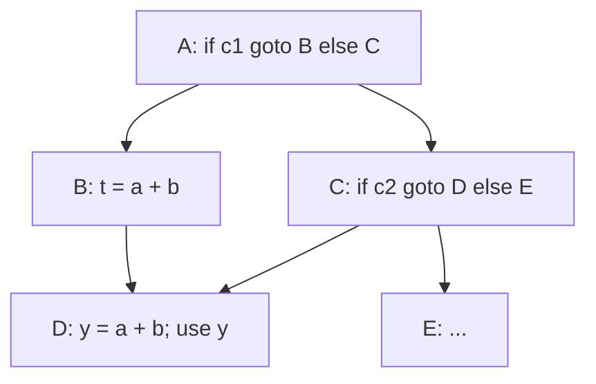
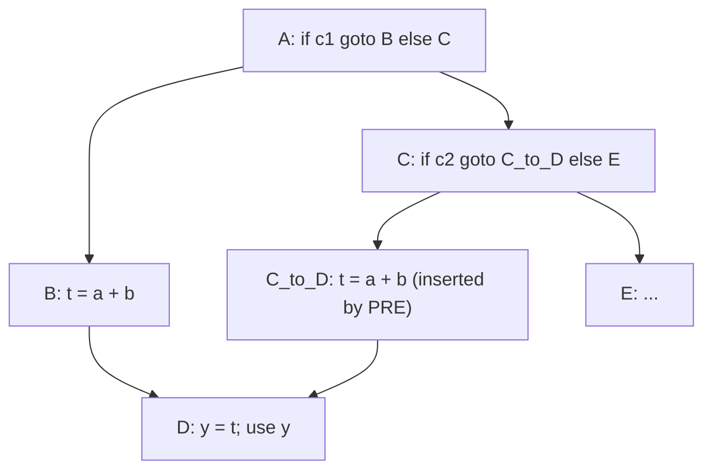
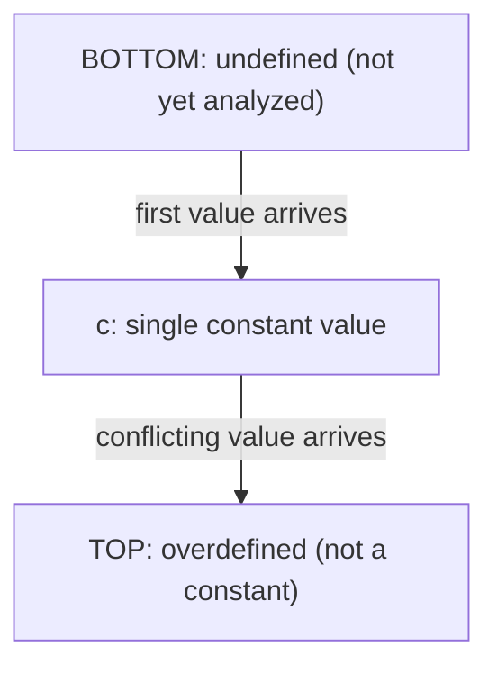
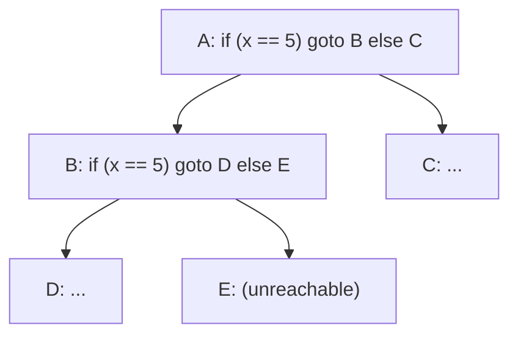
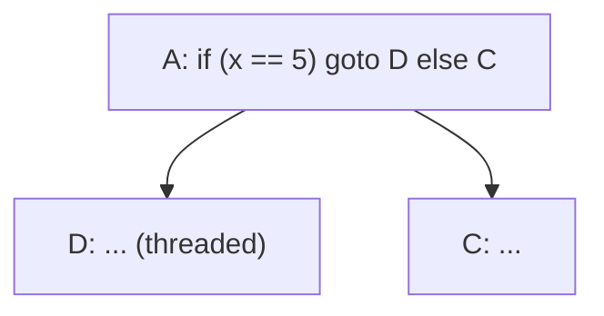

# Scalar Optimizations Deep Dive

**Scalar optimizations** are the workhorse class of compiler passes that operate on individual values within a single procedure — as opposed to loop transformations (which restructure iteration), interprocedural optimizations (which cross function boundaries), and machine-level optimizations (which deal with registers, scheduling, and instruction selection). This page covers five compiler-internal scalar passes that the gap analysis flagged as missing from the existing [Intermediate Representation & Optimization](./intermediate-representation.md) page: Partial Redundancy Elimination (PRE) and its SSA-based variant GVN-PRE; Sparse Conditional Constant Propagation (SCCP); Jump Threading; Value Range Propagation (VRP); and Tail Duplication. The page builds on the SSA, dominance, and basic-block concepts covered in `./intermediate-representation.md`, and feeds into both [Code Generation & Linking](./code-generation.md) (where tail duplication and block placement are applied at the machine level) and [JIT Compilation](./jit-compilation.md) (where SCCP and VRP drive speculative guards and deoptimization). Plain constant propagation, common subexpression elimination (CSE), and dead code elimination (DCE) are already covered on the IR page and in the high-level overview at [`../dsa/chapters/ch129-compiler-optimizations.md`](../dsa/chapters/ch129-compiler-optimizations.md); we treat them only as baselines here. The unifying theme is **information propagation across the control flow graph (CFG)**: each pass propagates some form of value knowledge (an exact constant, an equivalence class, an integer range, a known branch outcome) and uses it to delete, simplify, or duplicate code. All five passes are intra-procedural, operate on SSA-form IR (except where noted), and compose into the canonical `-O2`/`-O3` pipelines of GCC and LLVM.

> Related: [Intermediate Representation & Optimization](./intermediate-representation.md), [Code Generation & Linking](./code-generation.md), [JIT Compilation](./jit-compilation.md), [Compiler Optimizations (DSA ch. 129)](../dsa/chapters/ch129-compiler-optimizations.md), [Clang/LLVM](../linux/compilers/clang-llvm.md)

## 1. Partial Redundancy Elimination (PRE) & GVN-PRE

**Partial Redundancy Elimination (PRE)** generalizes common subexpression elimination (CSE) from purely local redundancy to *partially redundant* computations — expressions whose value is already available on some but not all paths reaching a program point. The classical formulation is due to Morel and Renvoise ("Elimination of Partial Redundancies in Global Optimization", CACM 1979), who cast PRE as a bidirectional data-flow problem that simultaneously computes *anticipability* (will the expression be evaluated on every path leaving this point, without being killed?) and *availability* (has the expression already been evaluated on every path arriving at this point, without being killed?). Their algorithm inserts the expression on edges where it is anticipated but not available, transforming the partial redundancy into a full redundancy that subsequent CSE can eliminate.

### Full vs. Partial Redundancy

An expression `e` is **fully redundant** at program point `p` if it has been computed on every path reaching `p` and none of its operands have been modified since. CSE handles this case: replace the recomputation with a reference to the earlier result. An expression is **partially redundant** at `p` if it is computed on *some* but not all paths reaching `p`. CSE conservatively re-computes in this case, because at least one path lacks an available value. PRE is more aggressive: it inserts the computation on the paths where it is missing, making it fully available everywhere, and *then* eliminates the recomputation. The trade-off is the cost of the inserted computation (paid on the cold path) against the cost of the eliminated recomputation (saved on the hot path).

```c
int f(int a, int b, bool cond) {
    int x;
    if (cond) {
        x = a + b;          // a+b computed on the true path
        // ... uses of x ...
    } else {
        // a+b NOT computed on the false path
    }
    // At this join, (a + b) is partially redundant:
    //   - true path:  already computed as x
    //   - false path: not yet computed
    // PRE inserts t = a+b on the false path's edge into the join,
    // then rewrites (a + b) at the join to use t (or x, after copy coalescing).
    return (a + b) + x;
}
```

### The Critical Edge Problem

The Morel-Renvoise algorithm needs to insert computations on CFG edges. An edge from block `P` (with multiple successors) to block `S` (with multiple predecessors) is called a **critical edge**: there is no basic block "on" the edge to host the inserted computation, and you cannot append to `P` (it has other successors) or prepend to `S` (it has other predecessors). The standard preprocessing step is **critical edge splitting**: replace each critical edge `P → S` with `P → N → S`, where `N` is a fresh empty block. After splitting, every edge has at least one endpoint with a single predecessor/successor, and insertions become trivial.



In the diagram above, block `C` has two successors (`D`, `E`) and block `D` has two predecessors (`B`, `C`); the edge `C → D` is critical. To insert `a + b` on the path from `C` to `D`, the compiler first splits the edge, introducing a new block `C_to_D` between them:



After insertion, `a + b` is fully available at `D` from both predecessors, and the recomputation in `D` is eliminated (replaced by a use of `t`). LLVM's `gvn` pass performs critical edge splitting inline as part of its PRE machinery; GCC's `pre` tree pass splits critical edges in a dedicated pre-pass.

### GVN-PRE: SSA-Based PRE with Value Numbering

The classical Morel-Renvoise formulation operates on **syntactic expressions**: `a + b` and `b + a` are distinct, as are `(a + b) + c` and `a + (b + c)`. This misses many equivalences that hold at runtime. The SSA-based reformulation by Kennedy, Chan, and Chin ("Partial Redundancy Elimination in SSA Form", TOPLAS 1999) integrates PRE with **Global Value Numbering (GVN)** to produce **GVN-PRE**, the algorithm used by LLVM's `gvn` pass and the foundation of most modern PRE implementations. GVN assigns each SSA value a *value number* such that two values with the same number are guaranteed to evaluate to the same runtime value. GVN-PRE then performs PRE on value-number equivalence classes rather than syntactic expressions, catching algebraic equivalences (`a + b` ≡ `b + a` after operand normalization, `x + 0` ≡ `x`, `x * 1` ≡ `x`) that classical PRE misses. This is the algorithm running when you pass `-gvn` to LLVM's `opt` or see `GVN:` in `-O2`/`-O3` pipeline dumps.

### Comparison: Redundancy Elimination Techniques

| Technique | Scope | Partial vs. Full | Value Numbering | IR Form | Reference Implementation |
|---|---|---|---|---|---|
| **Local CSE** | Single basic block | Full only | Syntactic | Any | Backend peephole, `instcombine` |
| **Global CSE (GCSE)** | Whole function | Full only | Syntactic | CFG + available expressions | GCC `gcse`, LLVM `early-cse` |
| **PRE (Morel-Renvoise)** | Whole function | Partial (with insertion) | Syntactic | Non-SSA CFG | Research baseline |
| **GVN-PRE (Kennedy et al.)** | Whole function | Partial (with insertion) | Yes — value-number classes | SSA | LLVM `gvn`, Cray `pre` |

The progression from local CSE to GVN-PRE is monotone in analysis precision: every redundancy eliminated by CSE is also eliminated by GCSE, PRE, and GVN-PRE; every redundancy eliminated by PRE is also eliminated by GVN-PRE; GVN-PRE catches everything in between by recognizing value-equivalent computations across arbitrary CFG paths.

### Code-Size Trade-off and Dominator-Tree Interaction

PRE is *not* always a code-size win. Each insertion adds an instruction; each elimination removes one. Net code size depends on the topology of the redundancy: if the inserted computation lands on a hot path and the eliminated one is on a cold path, the transformation is a clear win; if both are equally hot, code size grows by zero but execution time shrinks (one less instruction on the critical path); if the insertion is on a hot path and the elimination on a cold path, PRE may regress code size and time. Production compilers (LLVM `gvn`, GCC `pre`) gate insertions on profitability heuristics that compare the cost of the inserted computation against the eliminated one, weighted by block-frequency estimates from branch metadata or PGO. PRE also interacts closely with the **dominator tree**: the insertion points are exactly the *dominance frontier* of the blocks where the expression is anticipated, which is why SSA construction (which also uses dominance frontiers) is a natural fit. After GVN-PRE runs, a subsequent pass of DCE removes any expressions whose results are now unused — including the original (now-replaced) recomputations on the hot path.

## 2. Sparse Conditional Constant Propagation (SCCP)

**Sparse Conditional Constant Propagation (SCCP)**, introduced by Wegman and Zadeck in "Constant Propagation with Conditional Branches" (TOPLAS 1991), is the canonical algorithm for combining constant propagation with unreachable-code elimination in SSA form. SCCP is implemented as LLVM's `sccp` pass (and the related `ipsccp` for interprocedural propagation) and as GCC's tree-SSA `vrp`-predecessor constant-propagation stage. It is the workhorse that makes most other "the compiler knows `n == 8` here" reasoning possible. Unlike the plain Kildall-style constant propagation covered on the IR page, SCCP simultaneously tracks which CFG edges are unreachable, and uses reachability to refine the constant value of SSA names — the two analyses are interlocked in a single fixed-point computation.

### The SCCP Lattice

SCCP assigns each SSA value a lattice element drawn from a three-level lattice:

- \\( \bot \\) ("bottom", "undefined"): the SSA value has not yet been visited; no information.
- \\( c \\) (a single constant): the SSA value is provably equal to a specific constant.
- \\( \top \\) ("top", "overdefined"): the SSA value may take more than one value; it is not a constant.

The lattice ordering is \\( \bot \sqsubseteq c \sqsubseteq \top \\) for every constant \\( c \\). The **meet operator** \\( \sqcap \\) combines information from multiple predecessors:

\\[ \bot \sqcap x = x \qquad c_1 \sqcap c_2 = \begin{cases} c_1 & \text{if } c_1 = c_2 \\\\ \top & \text{otherwise} \end{cases} \qquad \top \sqcap x = \top \\]

The meet operator is the SSA-edge analog of a phi node: when an SSA value depends on multiple inputs, the result is the meet of those inputs. The third case (`⊤ ∧ x = ⊤`) is what makes SCCP *monotone* and thus guarantees termination: once a value becomes overdefined, it never returns to a constant.



The lattice transitions are strict: a value moves up the lattice only. `BOT` becomes a constant when the first def reaches it; a constant becomes `TOP` when a second, conflicting def reaches it; `TOP` is sticky. Monotonicity plus finite lattice height (3) guarantees the worklist algorithm terminates in at most `O(3 * |SSA values|)` updates.

### The SSA-Edge Worklist Algorithm

SCCP uses two coupled worklists: a **flow worklist** of CFG blocks and an **SSA worklist** of SSA edges (def → use). The flow worklist drives reachability; the SSA worklist drives value updates. The "sparse" in SCCP refers to the fact that the SSA worklist iterates over def-use edges in the SSA graph, not over CFG edges for every variable — a variable's value is updated only when its unique defining instruction's operands change, not when an arbitrary block is re-processed. This is asymptotically faster than dense (Kildall-style) constant propagation, which would re-compute every variable at every block on every iteration. The algorithm skeleton:

```text
initialize every SSA value to BOT
initialize every block to unreachable
flow_worklist = {entry}
ssa_worklist  = {}

while flow_worklist or ssa_worklist:
    if flow_worklist:
        B = pop(flow_worklist)
        if B already visited: continue
        mark B reachable
        evaluate each phi in B (meet of operand values per reachable pred)
        evaluate each non-phi instruction in B with its transfer function
        for each SSA value v defined in B:
            if v's lattice value changed:
                for each use u of v: push (v, u) onto ssa_worklist
        for each successor S of B:
            push S onto flow_worklist
    else:
        (v, u) = pop(ssa_worklist)
        re-evaluate u with the new value of v
        if u's lattice value changed:
            for each use w of u: push (u, w) onto ssa_worklist
            if u is a branch instruction whose condition is now constant:
                mark the not-taken successor's edge unreachable
                reprocess the taken successor's block on flow_worklist
```

The interlock between the two worklists is what makes SCCP more powerful than plain CP: when a branch condition becomes a constant, the not-taken successor is removed from the reachable set, and any SSA values defined only along that path stop propagating — they remain `BOT` rather than poisoning the rest of the program with `TOP`.

### Transfer Functions and Branch Folding

Each instruction has a **transfer function** that maps its operand lattice values to its result lattice value. For `add nsw %r, %a, %b`:

```text
transfer(%a, %b):
    if %a == BOT or %b == BOT: return BOT
    if %a == TOP or %b == TOP: return TOP
    # both are constants c1, c2
    if c1 + c2 does not overflow (or nsw is absent): return (c1 + c2)
    else: return TOP
```

For a `phi` node, the transfer function is the meet over the operands arriving from *reachable* predecessors only — operands from unreachable blocks are skipped, which is why SCCP can collapse chains of `phi`s that would otherwise look overdefined. For a conditional branch `br i1 %c, label %T, label %F`, the transfer function inspects the lattice value of `%c`:

```text
if %c == BOT:        do nothing (no information yet)
if %c == true:       mark edge to %F unreachable; push %T onto flow_worklist
if %c == false:      mark edge to %T unreachable; push %F onto flow_worklist
if %c == TOP:        both edges remain reachable; push both successors
```

This is the **conditional branch folding** that gives SCCP its name and distinguishes it from non-conditional constant propagators. Consider:

```llvm
; Before SCCP:
define i32 @f(i32 %n) {
entry:
  %c = icmp eq i32 %n, 0
  br i1 %c, label %zero, label %nonzero

zero:
  br label %join

nonzero:
  %m = add i32 %n, 1
  br label %join

join:
  %r = phi i32 [ 0, %zero ], [ %m, %nonzero ]
  ret i32 %r
}
```

Without information about `%n`, SCCP concludes `%c = TOP` and the IR is unchanged. But if the caller passes a known constant — say the function is specialized by `ipsccp` and the only call site passes `0` — then `%n = 0`, `%c = (0 == 0) = true`, the `zero` arm is taken, the `nonzero` block becomes unreachable, and `%r = phi(0, [unreachable]) = 0`. The residual IR is:

```llvm
; After SCCP (when %n is provably 0 at the only call site):
define i32 @f(i32 %n) {
  ret i32 0
}
```

The entire `%m = add` computation, the branch, and the phi have all been folded away. Plain constant propagation (which doesn't track reachability) would propagate `%n = 0` into `%m = add 0, 1 = 1` and into the phi, but the phi itself would remain `phi(0, 1) = TOP`, blocking further simplification. The reachability-aware phi evaluation is the key.

### Comparison: Constant Propagation Techniques

| Technique | Lattice | Worklist | Branch Folding | Scope | Reference |
|---|---|---|---|---|---|
| **Plain (Kildall) CP** | `{const, non-const}` | CFG edges, every var at every block | No | Local + global, dense | Kildall 1973 |
| **Sparse CP** | `{const, non-const}` | SSA edges (def → use) | No | Whole function, SSA | Reif & Lewis 1986 |
| **SCCP** | `{\bot, c, \top}` with reachability | SSA edges + CFG flow worklist | **Yes** — kills unreachable edges | Whole function, SSA | Wegman & Zadeck 1991 |
| **IPSCCP** | Same as SCCP | Same + call-graph edges | Yes | Whole translation unit | LLVM `ipsccp` |
| **VRP** | `{[lo, hi], \bot, \top}` ranges | SSA edges + phi meets | **Yes** — range-based | Integer-typed values | See §4 |

The monotone progression from plain CP to IPSCCP yields strictly more information at each step; VRP is incomparable (it handles ranges SCCP cannot, but loses precision on non-integer types).

## 3. Jump Threading

**Jump threading** replaces a chain of conditional branches that depend on correlated conditions with a direct jump to the final destination. The pass is implemented as LLVM's `jump-threading` pass and exposed in GCC via `-fthread-jumps` (folded into `-O2` since GCC 4.x). It is one of the highest-leverage scalar passes in the optimization pipeline because each successful thread typically unlocks one or more simplifications downstream: a folded branch becomes a constant condition for SCCP, an unreachable successor becomes DCE-eligible, and a now-single-successor block becomes a simplify-CFG merge candidate.

### The Pattern

The canonical pattern is a branch on a condition followed, on at least one arm, by another branch on the *same* or a *correlated* condition:

```c
// C source pattern:
if (x == 5) {          // first branch on (x == 5)
    goto L1;
} else {
    goto L2;
}
L1:
    if (x == 5) {       // second branch on (x == 5)
        goto L3;        // statically known to be taken
    } else {
        goto L4;        // statically known to be unreachable
    }
```

At the entry to `L1`, the compiler knows `x == 5` was true (because that was the only way to reach `L1`). The second branch's condition is therefore statically true. Jump threading rewrites the first branch to jump directly to `L3`, bypassing `L1`:

```c
// After jump threading:
if (x == 5) {
    goto L3;            // threaded directly
} else {
    goto L2;
}
L1:                     // now unreachable from the entry, removed by DCE
    ...
```

The LLVM IR analog:

```llvm
; Before:
entry:
  %c1 = icmp eq i32 %x, 5
  br i1 %c1, label %L1, label %L2

L1:
  %c2 = icmp eq i32 %x, 5
  br i1 %c2, label %L3, label %L4

; After:
entry:
  %c1 = icmp eq i32 %x, 5
  br i1 %c1, label %L3, label %L2
```



After threading, the edge `A → B` is replaced by `A → D` (because `x == 5` is known true on that edge), and `B` becomes unreachable from `A`. If `B` has no other predecessors, DCE removes it.



### Value-Condition Threading

Jump threading is not limited to literal copies of the same predicate. The pass recognizes several **value-condition** patterns where the first branch establishes a fact about a value that a downstream branch can exploit:

- **Constant condition**: if the first branch's outcome is constant (`%c = icmp eq i32 %x, 5` and `%x` is provably `5`), thread to the corresponding successor directly.
- **Equality propagation**: if the first branch is `if (%x == 5)`, then on the true successor `%x` is known to be `5`; any subsequent branch on `%x == 5`, `%x != 5`, or `%x < 6` can be folded using this knowledge.
- **Range propagation**: if the first branch is `if (%x < 100)`, then on the true successor `%x ∈ [INT_MIN, 99]`; a subsequent `if (%x > 200)` can be folded to false.
- **Phi-of-conditions**: when a phi node selects between two constants that came from a single branch (e.g., `%r = phi i1 [true, %A], [false, %B]` where `%A` and `%B` are the two arms of an earlier `br i1 %c`), the phi can be replaced by `%c` itself, exposing further threading.

### Combination with SCCP and CorrelatedValuePropagation

Jump threading is most powerful when composed with two related passes:

1. **SCCP** (§2) provides constant values for operands, which jump threading uses to fold the *first* branch in a chain. Running SCCP before jump threading exposes opportunities where the original condition is already a constant.
2. **CorrelatedValuePropagation** (LLVM) uses lazy value information (a lightweight form of VRP, see §4) to fold branches whose outcomes are correlated with the path that reached them. It runs *after* jump threading to clean up branches that threading couldn't directly handle but that path-sensitive reasoning can.
3. **SimplifyCFG** merges blocks made trivial by threading (e.g., a block with a single predecessor and a single unconditional successor can be folded into its predecessor).

The LLVM `-O2` pipeline typically runs `sccp`, `jump-threading`, `correlated-value-propagation`, and `simplifycfg` in a fixed-point loop until none of them make progress. GCC achieves similar effects with `-fthread-jumps`, `-fvrp`, `-fdominator-phi-cleanup`, and `-fsimplifycfg` interacting in the gimple SSA pipeline.

### Comparison: Branch Optimization Passes

| Pass | Pattern Handled | Duplicates Code? | Interacts With | Implementation |
|---|---|---|---|---|
| **Jump threading** | Chain of correlated branches | Yes — clones successor blocks | SCCP, CorrelatedValuePropagation | LLVM `jump-threading`, GCC `-fthread-jumps` |
| **CorrelatedValuePropagation** | Branch on a value constrained by path | No — folds in place | SCCP, jump threading (post-pass) | LLVM `correlated-value-propagation` |
| **SimplifyCFG** | Empty blocks, single-pred/single-succ, diamonds | No — removes code | Every other pass | LLVM `simplifycfg`, GCC `cleanup_cfg` |
| **Block folding** | Branch-on-constant with known successor | No — rewrites branch | SCCP (which produces the constant) | LLVM `simplifycfg` constant-fold case |

### Duplication Cost and Threshold

Jump threading is not free. When the threaded target block has multiple predecessors (only one of which is being threaded), the compiler cannot simply redirect the edge — that would change the semantics of the *other* predecessors. Instead, it must **clone** the target block (and its transitive successors up to a fixed point) for the threaded edge. Each clone duplicates the block's instructions, phi nodes, and downstream control flow. To bound code-size growth, both LLVM and GCC enforce a **duplication threshold**: LLVM's `jump-threading` pass has a `MaxDuplicateSize` threshold (default small, around 6 instructions per cloned block, tunable via `--jump-threading-threshold`), and GCC's `-fthread-jumps` is gated by similar `PARAM_MAX_JUMP_THREAD_DUPLICATIONS` settings. Beyond the threshold, the thread is rejected. The interaction with phi nodes is delicate: cloning a block that contains `phi` instructions requires rewriting each phi to select the operand corresponding to the threaded predecessor (since the cloned block has a different predecessor set than the original). This is straightforward in SSA but requires careful bookkeeping.

## 4. Value Range Propagation (VRP)

**Value Range Propagation (VRP)** tracks, for each SSA value of integer type, the set of values it may take at runtime — represented as a closed interval \\( [lo, hi] \\) where \\( lo, hi \\) are themselves lattice elements (constants or symbolic bounds like `INT_MIN`/`INT_MAX`). VRP uses these ranges to fold branches (`if (x < 256)` folds when `x` is known in `[0, 100]`), to remove overflow checks (`x + 1` cannot overflow when `x < INT_MAX`), to narrow comparison outcomes (`icmp slt i32 %x, 200` is `true` when `x ∈ [0, 100]`), and to feed downstream passes such as jump threading and induction-variable simplification. VRP is implemented in GCC as the `vrp` pass (and the newer **Ranger** infrastructure, see below) and in LLVM as a combination of `LazyValueInfo` (query-based, on-demand) and the `correlated-value-propagation` pass that consumes it.

### Range Representation and Lattice

A VRP lattice element is one of:

- \\( \bot \\) ("undefined", "VARYING" in GCC terminology): no information yet; the value may be any integer of the type.
- \\( [lo, hi] \\) ("range"): the value is provably in the closed integer interval from `lo` to `hi`, where `lo ≤ hi` and both are constants of the appropriate type.
- \\( \top \\) ("overdefined", "UNDEFINED" in some implementations — nomenclature varies; we use the lattice-theoretic convention here): the value is not a single range but a union of disjoint ranges, collapsed to a coarse overdefined state for performance.

The meet operator intersects ranges: \\( [a, b] \sqcap [c, d] = [\max(a, c), \min(b, d)] \\), or \\( \bot \\) if the intersection is empty. The join operator (used at phi nodes from reachable predecessors) unions ranges: \\( [a, b] \sqcup [c, d] = [\min(a, c), \max(b, d)] \\). The join of disjoint ranges (e.g., `[0, 5] ⊔ [10, 15]`) is the convex hull `[0, 15]`, which loses precision but keeps the lattice finite (the number of distinct intervals over a finite integer type is bounded). To avoid blowup, real VRP implementations further collapse very wide ranges to `VARYING` (`⊤` in our convention).

### Propagation Algorithm

VRP is a forward data-flow analysis over the SSA graph. For each SSA value \\( v \\), VRP computes a range \\( R(v) \\) by:

1. **Initialization**: every SSA value starts at \\( \bot \\) (or `VARYING` if it is a function parameter, global, or call result).
2. **Transfer functions**: for `%r = add nsw %a, %b`, \\( R(r) = R(a) + R(b) \\) computed with interval arithmetic, taking `nsw` into account (signed-overflow is undefined behavior, so the range is the exact mathematical sum bounded by the type's extrema; without `nsw`, the range collapses to `VARYING` because wrap-around is possible). For `%r = icmp slt %a, %b`, \\( R(r) = [0, 0] \\) if \\( R(a).hi < R(b).lo \\), \\( [1, 1] \\) if \\( R(a).lo \geq R(b).hi \\), else \\( [0, 1] \\).
3. **Phi nodes**: \\( R(\phi) = \bigsqcup_{p \in \text{reachable preds}} R(\text{operand}_p) \\).
4. **Edge refinement**: when a conditional branch `br i1 %c, %T, %F` is encountered with \\( R(c) = [1, 1] \\), the edge to `%F` is unreachable; when \\( R(c) = [0, 1] \\), VRP additionally refines operand ranges *along each edge*: on the `%T` edge, the operand of `%c` (if it is a comparison) is narrowed (e.g., for `icmp slt %x, 100`, the `%T` edge gets \\( R(x) := R(x) \sqcap (-\infty, 99] \\); the `%F` edge gets \\( R(x) := R(x) \sqcap [100, +\infty) \\)). This is the "value" in "value range" — the range is path-sensitive through edge refinement.
5. **Fixed-point iteration** until no range changes.

### Use Cases

```c
int classify(int x) {
    if (x < 0)        return -1;
    if (x > 100)      return 1;
    // Here VRP knows x ∈ [0, 100]
    if (x < 256) {    // <- VRP folds this to always true
        // ... but the compiler also knows x ≤ 100,
        // so the overflow check on (x + 1) is unnecessary
        return x + 1; // <- the nsw add cannot overflow
    }
    return 0;         // <- unreachable, eliminated by DCE
}
```

After VRP, the `if (x < 256)` test is folded to `true`, its `else` arm is marked unreachable, and the `add nsw i32 %x, 1` is provably non-overflowing (because `x ≤ 100`, so `x + 1 ≤ 101`, well within `INT_MAX`). Both folds would be unavailable to SCCP, which only tracks exact constants: at the join after the two early returns, `%x` is not a single constant, so SCCP would mark it overdefined and skip the optimization. VRP's range representation retains enough information to fold.

### GCC Ranger: On-Demand VRP

The classical GCC `vrp` pass (pre-GCC 11) was **eager**: it computed and stored a range for every SSA value over the whole function, regardless of whether any downstream consumer queried that range. This was wasteful — most ranges were never queried — and the eager fixed-point iteration could be slow on large functions. The **Ranger** project (Andrew MacLeod, GCC 11+) replaced eager VRP with an **on-demand, query-based** range oracle. Ranger computes ranges lazily, walking the SSA graph from a query point and caching results. For a query `range(%v) at point P`, Ranger walks backward through `%v`'s definition and operands, applying transfer functions and edge refinements until it reaches roots (function parameters, constants) or cached results. The on-demand model is faster when only a few queries are issued (typical case: jump threading asks for one range, then either threads or doesn't), and it integrates with a global ranger cache that amortizes repeated queries. Ranger also exposes a **GORI** (Generic Operand Range Info) layer that answers "given the range of `%r`, what are the ranges of `%r`'s operands?" — used for backwards reasoning in `if-conversion` and `phiopt`.

### Comparison with SCCP and Limitations

VRP and SCCP solve overlapping but distinct problems. SCCP is precise on exact constants but collapses to `⊤` as soon as a value is not a single constant. VRP retains useful information across control-flow merges (a phi of `0` and `100` is the range `[0, 100]` in VRP, but `⊤` in SCCP). Conversely, SCCP handles non-integer types (pointers, floats) cleanly, while VRP is essentially integer-only: floating-point ranges are difficult because IEEE 754 has NaN, infinities, and signed zero, and pointer ranges would require alias reasoning. VRP also loses precision on complex expressions: the range of `x * y` where `x ∈ [-2, 2]` and `y ∈ [-3, 3]` is `[-6, 6]`, but the range of `(x * x) + y` where `x ∈ [-2, 2]` and `y ∈ [0, 5]` is `[0, 9]`, and naive interval arithmetic gives `[-4, 4] + [0, 5] = [-4, 9]` — overly conservative. Subrange-aware analyses (like GCC's `range-op` infrastructure in Ranger) close some of this gap, but at the cost of compile time. In practice, VRP is one of the highest-payoff scalar passes: it folds branches that SCCP cannot, removes overflow checks that block later vectorization, and feeds range-based reasoning to jump threading and CorrelatedValuePropagation.

## 5. Tail Duplication

**Tail duplication** duplicates a basic block (the "tail") at the end of multiple predecessor paths, replacing an indirect or multi-predecessor merge with a set of direct, single-predecessor copies. The transformation is the basic-block-level analog of function inlining: instead of inlining a *function* at a call site to expose interprocedural optimization, tail duplication inlines a *block* at a predecessor edge to expose intraprocedural optimization. The technique is described by Pettis and Hansen in "Profile-Guided Code Positioning" (PLDI 1990) as part of their block-placement framework, and is implemented in LLVM as the `tailduplication` machine-level pass (and the IR-level `simple-tail-merge` for the inverse direction), and in GCC as part of the `bb-reorder` and `tail-duplication` passes.

### The Pattern

```text
Before tail duplication:

    P1: ...        P2: ...        P3: ...
     |              |              |
     +------+-------+------+------+
            |
            v
            B: %x = phi [%a, P1], [%b, P2], [%c, P3]
               use %x
               ...

After tail duplication (P1 is hot, P2 and P3 are cold):

    P1: ...
     |
     v
    B1: %x = %a        // phi simplified to copy
        use %x
        ...
     |
     v
    (rest of program)

    P2: ...            P3: ...
     |                  |
     v                  v
    B2: %x = %b        B3: %x = %c
        use %x             use %x
        ...                ...
```

After duplication, each copy `B1`/`B2`/`B3` has a single predecessor, the phi nodes are simplified to direct copies, and downstream optimizations can specialize each copy independently: e.g., constant propagation can fold `%a` into `B1` without poisoning `B2` or `B3` with a conflicting constant.

### Motivation

Tail duplication serves four goals:

1. **Expose local optimization**: a single-predecessor block has no phi nodes, so SCCP, VRP, and instcombine can reason about its values without meeting conflicting operands from other predecessors. The pass effectively "inlines" the join block into each predecessor, after which standard SSA simplifications fire.
2. **Convert indirect jumps to direct jumps**: if `B` ends in an indirect jump through a jump table, duplicating `B` for each predecessor may let the compiler prove (via VRP or CorrelatedValuePropagation) that the indirect jump always selects one specific target on that predecessor — converting it to a direct conditional branch, which is both faster (no table lookup) and more optimizable.
3. **Improve branch prediction**: a duplicated block can be placed immediately after its predecessor, making the fall-through path the hot path. The original layout (one shared `B`) forces at least one predecessor to take a non-fall-through edge into `B`, polluting the branch predictor.
4. **Enable hot/cold splitting**: duplicating the hot path's tail allows the cold copies to be moved to a cold section of the function, improving I-cache utilization for the hot path.

### Code-Size Trade-off and Profile-Guided Application

Like jump threading, tail duplication grows code size linearly in the number of duplicated blocks. Production compilers gate duplication on a **profitability heuristic**:

- LLVM's `tailduplication` pass uses a `TailDuplicateSize` threshold (default small, around 100 instructions, but tunable per-target) and only duplicates blocks whose duplication cost is below the threshold.
- When PGO profile data is available, duplication is restricted to **hot predecessors**: only predecessors whose execution frequency exceeds a threshold get their own copy of `B`; cold predecessors continue to share the original `B`. This concentrates the code-size cost on cold paths (which are already in the cold section) and the optimization benefit on hot paths.
- The pass also refuses to duplicate blocks with high register pressure (would increase spill count) or blocks containing calls to `noreturn` functions (which would not benefit from local optimization).

### Comparison: Tail Duplication vs. Function Inlining vs. Block Placement

| Technique | Granularity | What's Duplicated | Code Size Impact | Profile-Guided? | Pipeline Stage |
|---|---|---|---|---|---|
| **Tail duplication** | Basic block | Block + successor chain | Small (+1 block per pred) | Yes (hot preds only) | Machine-level (LLVM `tailduplication`), or IR (LLVM `simple-tail-merge` inverse) |
| **Function inlining** | Whole function | Function body at call site | Large (typically 10s–100s of instructions) | Yes (hot calls) | IR-level (LLVM `inline`, GCC `ipa-inline`) |
| **Block placement** | Block layout | Nothing (reorders existing blocks) | Zero (instruction count unchanged) | Yes (hot fall-throughs) | Machine-level (LLVM `machine-block-placement`, GCC `bb-reorder`) |
| **Block merging** | Adjacent blocks | Nothing (fuses single-pred/single-succ) | Small (-1 branch per merge) | No | IR-level (LLVM `merge-blocks` in `simplifycfg`) |

The three transformations are complementary. Block placement reorders existing blocks to maximize fall-through on hot paths; tail duplication *creates* the single-predecessor structure that block placement prefers; function inlining exposes the call-graph structure that tail duplication operates on. A typical `-O2 -fprofile-use` pipeline runs inlining, then SCCP and jump threading (which expose duplication opportunities), then tail duplication, then block placement — each pass creating opportunities for the next.

### Interaction with Machine-Level Block Placement

Tail duplication is most useful as a **machine-level** pass because its benefits (branch prediction, fall-through placement) are inherently target-specific. LLVM's `tailduplication` pass runs after register allocation in some configurations and before it in others (the `taildup` pass runs early in the machine pipeline; `machinedomtree`-aware variants run later). GCC's `tail-duplication` runs after the SSA optimizations and before `bb-reorder`. In both compilers, the pass interacts with **block placement**: the placement pass computes a layout that maximizes fall-through on hot edges, and tail duplication's pre-creation of single-predecessor blocks gives the placement algorithm more freedom to choose a hot fall-through without forcing it to honor a multi-pred join.

## Cross-References

- [Intermediate Representation & Optimization](./intermediate-representation.md) — SSA, dominance frontiers, basic data-flow analyses (reaching defs, available expressions, live variables) that this page builds on.
- [Code Generation & Linking](./code-generation.md) — tail duplication and machine-level block placement run as the final stages of the code-generation pipeline.
- [JIT Compilation](./jit-compilation.md) — JIT compilers (V8, HotSpot, PyPy) use lightweight SCCP and VRP analogs to drive speculative guards and deoptimization.
- [Partial Evaluation & MLIR](./partial-evaluation-mlir.md) — binding-time analysis is a static/dynamic analog of SCCP's constant/non-constant lattice; MLIR's `arith` and `scf` dialects lower through passes that implement these scalar optimizations.
- [Compiler Optimizations (DSA ch. 129)](../dsa/chapters/ch129-compiler-optimizations.md) — high-level overview of constant folding, CSE, DCE, inlining, vectorization. This page covers the deeper compiler-internal passes that ch. 129 only mentions by name.
- [Clang/LLVM](../linux/compilers/clang-llvm.md) — the compiler infrastructure whose `opt` pass manager runs the LLVM implementations of every pass discussed here.

## References

- Morel, E., & Renvoise, C. (1979). *Elimination of Partial Redundancies in Global Optimization*. Communications of the ACM, 22(2), 96–103. <https://dl.acm.org/doi/10.1145/359060.359077>
- Kennedy, R., Chan, S., & Chin, W. (1999). *Partial Redundancy Elimination in SSA Form*. ACM Transactions on Programming Languages and Systems (TOPLAS), 21(3), 627–676. <https://dl.acm.org/doi/10.1145/319301.319348>
- Wegman, M. N., & Zadeck, F. K. (1991). *Constant Propagation with Conditional Branches*. ACM Transactions on Programming Languages and Systems (TOPLAS), 13(2), 181–210. <https://dl.acm.org/doi/10.1145/103135.103136>
- Pettis, K., & Hansen, R. C. (1990). *Profile-Guided Code Positioning*. Proceedings of the ACM SIGPLAN 1990 Conference on Programming Language Design and Implementation (PLDI '90), 16–27. <https://dl.acm.org/doi/10.1145/93542.93550>
- Kildall, G. A. (1973). *A Unified Approach to Global Program Optimization*. Proceedings of the 1st Annual ACM SIGACT-SIGPLAN Symposium on Principles of Programming Languages (POPL '73), 194–206. <https://dl.acm.org/doi/10.1145/512927.512945>
- LLVM `GVN` pass documentation: <https://llvm.org/docs/Passes.html#gvn-global-value-numbering>
- LLVM `SCCP` pass documentation: <https://llvm.org/doxygen/SCCP_8cpp.html>
- LLVM `JumpThreading` pass source: <https://github.com/llvm/llvm-project/blob/main/llvm/lib/Transforms/Scalar/JumpThreading.cpp>
- LLVM `CorrelatedValuePropagation` pass source: <https://github.com/llvm/llvm-project/blob/main/llvm/lib/Transforms/Scalar/CorrelatedValuePropagation.cpp>
- LLVM `TailDuplication` pass source: <https://github.com/llvm/llvm-project/blob/main/llvm/lib/CodeGen/TailDuplication.cpp>
- GCC Internals Manual, "Optimizing the CFG": <https://gcc.gnu.org/onlinedocs/gccint/CFG-Optimizations.html>
- GCC `vrp` pass documentation: <https://gcc.gnu.org/onlinedocs/gccint/VRP.html>
- GCC Ranger project (Andrew MacLeod): <https://gcc.gnu.org/wiki/Ranger>
- Dragon Book (Aho, Lam, Sethi, Ullman), 2nd Ed., Chapter 9 — covers the data-flow frameworks underlying PRE and constant propagation.
- Cooper & Torczon, *Engineering a Compiler*, 2nd Ed., Chapter 8 — SSA-based constant propagation and the SCCP lattice.
- Muchnick, S. S. (1997). *Advanced Compiler Design and Implementation*. Morgan Kaufmann. Chapters 12–13 cover SSA-based redundancy elimination and constant propagation in depth.

## Interview Questions

1. **What is the difference between full and partial redundancy? Give an example of each.** A computation `e` is *fully redundant* at a program point if it has been evaluated on every path reaching that point with no intervening modification of its operands — CSE eliminates these by reusing the earlier result. `e` is *partially redundant* if it has been evaluated on *some* but not all paths — PRE inserts `e` on the missing paths (converting partial to full redundancy) and then eliminates the recomputation. Example of partial redundancy: `if (cond) { x = a+b; } ... return (a+b) + x;` — `a+b` is computed on the true path but not the false path; PRE inserts `t = a+b` on the false path's edge into the join, then replaces the `a+b` at the join with `t`.

2. **Why must critical edges be split before PRE? What is a critical edge?** A critical edge is a CFG edge from a block with multiple successors to a block with multiple predecessors. PRE needs to insert computations on edges, but a critical edge has no block "on" it that can host the inserted code (the source has other successors that should not see the insertion; the sink has other predecessors that should not be affected). The standard fix is to replace each critical edge `P → S` with `P → N → S`, where `N` is a fresh empty block; insertions then go into `N`.

3. **Describe the SCCP lattice and its meet operator. Why is the lattice finite, and why does this guarantee termination?** SCCP uses a three-level lattice: `⊥` (undefined / not yet analyzed), a single constant `c`, and `⊤` (overdefined / not a constant). The meet operator is: `⊥ ∧ x = x`; `c1 ∧ c2 = c1` if `c1 == c2` else `⊤`; `⊤ ∧ x = ⊤`. The lattice has height 3, so each SSA value can change at most twice (⊥ → c → ⊤). With `|V|` SSA values, the worklist algorithm performs at most `O(2|V|)` updates — termination is guaranteed by monotonicity (values only move up the lattice) and finite height.

4. **Why is SCCP more powerful than plain (Kildall-style) constant propagation?** Plain CP propagates constants but does not track CFG reachability — a phi node `phi(0, %x)` where `%x` is non-constant collapses to `⊤`, even if the block defining `%x` is unreachable. SCCP's two-worklist algorithm interlocks value propagation with reachability: when a branch condition becomes a constant, SCCP marks the not-taken edge unreachable, and phi nodes skip operands from unreachable predecessors. This lets SCCP fold chains of branches and phis that plain CP cannot.

5. **What does "sparse" mean in Sparse Conditional Constant Propagation?** It refers to the worklist structure. Dense (Kildall-style) CP iterates over CFG edges and recomputes every variable's value at every block on every iteration. SCCP iterates over **SSA edges** (def → use): a variable's value is recomputed only when its unique defining instruction's operands change, and the new value is propagated only to its uses in the SSA graph. Because each SSA value has exactly one definition, the worklist is bounded by the number of def-use edges, not by `|variables| × |blocks|`.

6. **Give an example where VRP folds a branch that SCCP cannot.** Consider `if (x < 0) return -1; if (x > 100) return 1; if (x < 256) { ... }`. After the first two early returns, `x` is in `[0, 100]`, which is not a single constant — SCCP marks `x` as overdefined. VRP retains the range `[0, 100]` and folds the third condition (`x < 256`) to `true`, eliminating the `else` arm. SCCP cannot make this fold because it loses all precision as soon as a value is not a single constant.

7. **What is jump threading, and why does it duplicate code?** Jump threading identifies a chain of conditional branches where the outcome of a later branch is determined by the path taken to reach it (e.g., `if (x == 5) goto L1; L1: if (x == 5) goto L2;` — at `L1`, `x == 5` is statically true). It rewrites the first branch to jump directly to `L2`, bypassing `L1`. When `L1` has multiple predecessors, the compiler cannot simply redirect the edge (other predecessors need `L1`'s original behavior), so it must *clone* `L1` for the threaded edge. Code-size growth is bounded by a duplication threshold.

8. **How does tail duplication differ from function inlining?** Tail duplication inlines a *basic block* at a predecessor edge, exposing intraprocedural optimization (phi simplification, local constant folding, branch prediction improvements). Function inlining inlines a *whole function* at a call site, exposing interprocedural optimization (cross-function constant propagation, calling-convention elimination). Both grow code size; both are gated by profitability heuristics and profile data. Tail duplication operates at the machine or late-IR level; function inlining operates at the early-IR level.

9. **What is the GCC Ranger, and how does it differ from the old eager VRP?** The old GCC `vrp` pass eagerly computed a range for every SSA value over the whole function, regardless of whether any consumer queried it. Ranger (GCC 11+) is an **on-demand, query-based** range oracle: it computes ranges lazily from a query point, walking the SSA graph backward and caching results. Ranger is faster when only a few queries are issued (the common case), integrates with a global cache that amortizes repeated queries, and exposes a GORI layer for backward operand-range reasoning.

10. **Order the following LLVM passes into a coherent pipeline and explain the ordering: `simplifycfg`, `sccp`, `jump-threading`, `correlated-value-propagation`, `gvn`, `tailduplication`.** A reasonable ordering: `sccp` (propagate constants, fold branches, expose unreachable blocks) → `jump-threading` (thread branches whose outcomes are now known) → `correlated-value-propagation` (fold branches using path-sensitive value info from the threaded edges) → `gvn` (eliminate redundancies exposed by threading) → `simplifycfg` (merge blocks, remove unreachable code, simplify diamonds) → iterate to fixed point → `tailduplication` (machine-level, duplicate hot tails for placement). The ordering matters because each pass creates opportunities for the next; `simplifycfg` is run repeatedly because every other pass leaves simplifiable structure behind.
