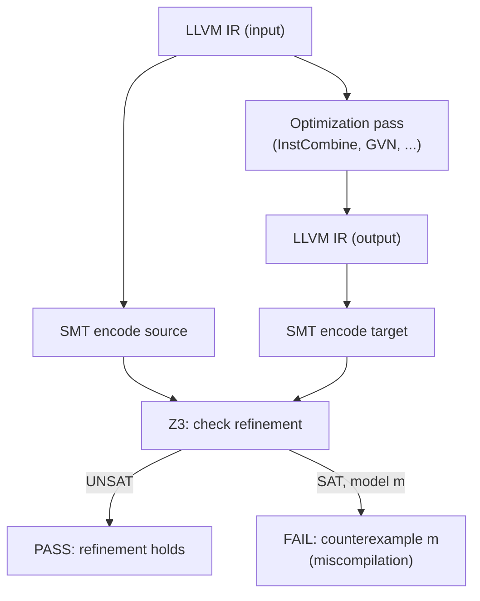
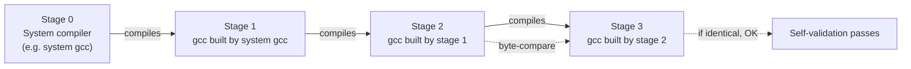
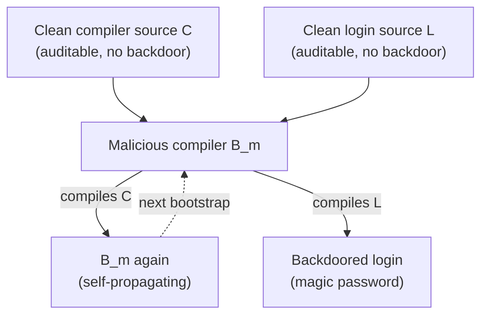

# Translation Validation & Compiler Bootstrapping

Two topics at opposite ends of the compiler-trust spectrum share a single question: *how do you trust the binary that comes out of a compiler?* **Translation validation** (Pnueli, Siegel, Singerman, TACAS 1998; Lopes et al., PLDI 2021) answers by *checking each optimization step on each run* — instead of proving the optimizer correct once and forever, an external checker verifies that the specific input/output pair produced by this run of the optimizer is semantics-preserving. **Compiler bootstrapping** (the three-stage self-compile, formalized in GCC since the 1980s and analyzed by Ken Thompson in "Reflections on Trusting Trust", CACM 1984) answers by *self-validation* — the compiler compiles its own source, and if two consecutive self-compilations produce byte-identical binaries, you have evidence that the compiler is at least *self-consistent*. Both approaches acknowledge the same uncomfortable fact: a buggy or malicious compiler silently corrupts every binary it produces, and "trust the compiler" is itself a security-critical assumption.

The two halves are also historically linked. Translation validation was proposed in the late 1990s as a response to the perceived impracticality of full compiler verification (CompCert, started in 2005, had not yet proven the approach could scale). Bootstrapping has been the standard compiler-trust technique since the 1970s, but the Trusting Trust paper showed in 1984 that bootstrapping alone is insufficient — a malicious compiler can be self-consistent *and* malicious. Translation validation addresses a different facet of the same problem: where bootstrapping checks the *chain* of compilers that produced a binary, translation validation checks each *transformation step* the binary underwent. This page covers the refinement relation Alive2 checks, its SMT encoding, the bugs it found in LLVM, the three-stage bootstrap, the Trusting Trust attack, diverse double-compilation, and the modern Bootstrappable Builds / Stage0 movement that aims to make every binary traceable to auditable source.

> Related: [Intermediate Representation & Optimization](./intermediate-representation.md), [Code Generation & Linking](./code-generation.md), [JIT Compilation](./jit-compilation.md), [Partial Evaluation & MLIR](./partial-evaluation-mlir.md), [Formal Methods](../cs-theory/formal-methods.md), [Software Supply Chain Security](../security/supply-chain-security.md)

## Part I — Translation Validation & Alive2

### The Optimizer Bug Problem

Modern optimizers are large, fast-moving programs. LLVM's middle-end alone contains over 100 optimization passes (InstCombine, GVN, SCCP, SROA, LoopUnroll, …) that run in a specific order at each `-O` level; the rule base for InstCombine alone exceeds 2 000 peephole patterns. Every one of those passes is a potential source of **miscompilation** — a silent transformation that changes the program's observable behavior. The cost of a miscompilation is asymmetric: a compiler crash is loud and immediately reported; a miscompilation produces a binary that runs, returns wrong answers, and is blamed on everything except the compiler until somebody spends weeks reducing a failure to a 5-line IR test case. Empirically, optimizer bugs are not rare. Between 2016 and 2020, Alive2 found over 300 miscompilation bugs in LLVM (Lopes et al., PLDI 2021, Table 1), with categories including wrong-code at `-O2`, incorrect handling of LLVM's `poison` and `undef` values, sign/zero-extension mistakes, and memory-model bugs around `memcpy` and aliasing. Several of these had shipped in released LLVM versions and were silently producing wrong code in production builds of C/C++ programs. The standard remedy before translation validation was *testing* — running the regression test suite — but a test suite covers only the inputs its authors imagined, and most miscompilations fire on inputs no test writer anticipated.

### Translation Validation vs. Compiler Verification

Translation validation and compiler verification are two distinct answers to the same question — "is this transformation semantics-preserving?" — that differ in *when* the check happens and *what* is being checked.

| Aspect | Translation Validation | Compiler Verification (CompCert) | Testing |
|---|---|---|---|
| **What is checked** | Each concrete input/output pair, per run | The compiler's source, once and for all | A finite set of inputs against expected outputs |
| **When** | After each optimization step | Before the compiler ever ships | On the regression suite, before release |
| **Effort to add a pass** | None (the validator is pass-agnostic) | High (every new pass needs a Coq proof) | Low (add a few test cases) |
| **Effort per run** | One SMT call per pass per function | Zero (proof already done) | Zero (run tests) |
| **Coverage of unverified code** | The actual code run today | Only what was proven; backend is unverified in CompCert | Whatever the test suite exercises |
| **Soundness** | Sound up to SMT solver bugs and the bound | Sound up to Coq kernel bugs | Not sound — testing proves nothing about untested inputs |
| **Found bugs** | 300+ in LLVM (Alive2) | None in the verified subset (CompCert) | Found some, missed far more |

Compiler verification (the CompCert approach, Leroy 2009) *proves the compiler correct once*: every pass is mechanized in Coq, and the theorem states that for every input program the compiler emits output with the same observable behavior. This is the strongest possible guarantee, but the cost is enormous (CompCert's proof took years of expert effort) and the unverified portion (the assembler, linker, runtime) remains unverified. Translation validation (Pnueli, Siegel, Singerman 1998) takes the *opposite* bet: do not prove the compiler correct once; instead, run an independent checker that proves *this specific* transformation — *this* input, *this* output, *this* run — is correct. The checker is pass-agnostic: the same SMT-based machinery works for InstCombine, GVN, LoopUnroll, or any new pass. The cost is paid per run (one SMT call per pass per function), but the benefit is that an arbitrary, unverified, fast-moving optimizer like LLVM can be validated incrementally without rewriting it in Coq.

### The Refinement Relation

The correctness property Alive2 checks is **refinement**, not equality. The optimized program `tgt` *refines* the source program `src` if, for every input that does not trigger undefined behavior in `src`, `tgt` produces the same observable behavior. Formally, with `σ` ranging over inputs and the predicate \\( \text{UB}(p, \sigma) \\) denoting "program `p` triggers undefined behavior on input `σ`":

\\[ \forall \sigma.\;\; \neg\,\text{UB}(\text{src}, \sigma) \;\Longrightarrow\; \big(\neg\,\text{UB}(\text{tgt}, \sigma)\;\wedge\;\text{obs}(\text{src}, \sigma) = \text{obs}(\text{tgt}, \sigma)\big) \\]

The key asymmetry is the **UB direction**. An optimization may *eliminate* UB (e.g., a dead-code pass may delete a divide-by-zero that never executes on any path), so `tgt` is allowed to have *less* UB than `src`. But `tgt` is *not* allowed to introduce UB on an input where `src` was well-defined — that would be a miscompilation. The relation is therefore:

| Property | Allowed? | Example |
|---|---|---|
| Same behavior, no UB in either | Yes (ideal optimization) | Constant folding `2+3` to `5` |
| `tgt` has *less* UB than `src` | Yes (UB eliminated) | Dead code removes an unreachable divide-by-zero |
| `tgt` has *more* UB than `src` on a well-defined input | No (miscompilation) | Hoisting a divide outside an `if (y != 0)` guard |
| Same UB in both, different observable behavior | No (miscompilation) | Wrong sign-extension of an `int` return |
| `src` is UB, `tgt` is anything | Yes (UB input is unconstrained) | `src` dereferences null; `tgt` may segfault or return 7 |

The refinement relation correctly captures the LLVM IR semantics, where `undef` (a value that may be any bit pattern) and `poison` (a value that propagates taint and becomes UB when *used*) are first-class. An optimization that *uses* an `undef` value to manufacture an output is a miscompilation; an optimization that *deletes* an `undef`-producing instruction is a refinement. The equality-based correctness theorem used by textbook compiler verification (CompCert's statement) is *strictly stronger* than refinement — equality requires identical UB sets — but equality is too strong for LLVM, where the IR is explicitly designed to allow UB-eliminating optimizations.

### The SMT Encoding

Alive2 translates a pair of LLVM IR functions into a system of SMT formulas and asks Z3 whether the refinement relation is *violated*. The encoding has three pieces. First, **values**: integer registers become bitvector terms (`(_ BitVec 32)`), floats become IEEE-754 floating-point sorts, and `undef`/`poison` become fresh symbolic constants plus a taint predicate. Second, **memory**: a memory model tracks allocations, stores, and loads as SMT arrays, with an axiomatization of LLVM's type-based aliasing rules. Third, **control flow**: each basic block becomes a set of guarded assignments, and phi nodes become `ite` expressions over predecessor conditions. The whole function is then encoded as a single large formula:

\\[ \varphi \;=\; \exists \sigma.\;\; \text{pre}(\text{src}, \sigma) \;\wedge\; \neg\,\text{UB}(\text{src}, \sigma) \;\wedge\; \big(\text{UB}(\text{tgt}, \sigma) \;\vee\; \text{obs}(\text{src}, \sigma) \neq \text{obs}(\text{tgt}, \sigma)\big) \\]

If Z3 reports `unsat`, the refinement holds and the optimization is correct for this pair. If Z3 reports `sat`, the model it returns is a *counterexample input* that demonstrates the miscompilation — Alive2 prints it as a concrete LLVM IR function call. The counterexample is the killer feature: instead of "your pass is wrong", the user gets "your pass miscompiles `f(2147483647, 1)` because the signed-overflow check was deleted".

### Bounded Validation

Alive2 is **bounded**. The SMT encoding handles a single function (not the whole program), with loops unrolled up to a configurable bound (default 64 iterations) and recursion converted to iterative form with a bounded call depth. Boundedness is a deliberate trade-off: an unbounded proof would require induction and would not terminate for arbitrary loops; a bounded proof always terminates (Z3 is a decision procedure for the bitvector theory) but only proves correctness for executions within the bound. The argument for accepting this bound is empirical — most miscompilations found in practice reproduce within a handful of iterations, because the bug is in the *transformation rule*, not in some pathological long loop. Alive2's paper (Lopes et al., PLDI 2021) reports that the bound of 64 catches the same set of bugs as a higher bound on the LLVM regression suite, while keeping SMT solving time under 30 seconds per function for 99% of cases. The remaining 1% time out and are flagged for manual inspection. The bounded design is also what makes Alive2 *practical*: an unbounded tool (like a Coq-backed validator) would not fit into LLVM's continuous integration.

### Alive2 Architecture & Use

Alive2 ships as a standalone tool (`alive-tv`) that takes two LLVM IR files — the input and the output of an optimization — and reports either a refinement proof or a counterexample. The typical invocation in LLVM's CI is as a pass-instrumentation callback: every time a pass transforms a function, Alive2 captures the before/after IR pair and runs the SMT check.



The command-line entry point is:

```bash
# Validate one transformation directly:
opt -passes=instcombine -print-after-all input.ll -o out.ll
alive-tv input.ll out.ll

# In LLVM CI, Alive2 hooks the pass manager:
# -opt-vt-front-end-flag=... (alive2 cc1 plugin)
# See llvm-project/llvm/test/Transforms/Alive2 for the regression tests
```

Alive2's GitHub repository (`github.com/AliveToolkit/alive2`) hosts the C++ implementation, the TV (`alive-tv`) command, and an interpreter (`alive-exec`) that executes the counterexample model to produce a concrete failing input. The earlier work that inspired Alive2 — Menendez and Nagarakatte, "Creation of LLVM Peephole Optimizations using Alive2" (CC 2017) — used a predecessor tool called *Alive* (no "2") to synthesize correct InstCombine patterns by writing the transformation in a DSL and checking it against the SMT semantics. Alive2 generalized this from "check a transformation written in Alive's DSL" to "check a transformation produced by *any* LLVM pass", which is what made it deployable as a CI gate on the entire LLVM pipeline.

### How Alive2 Runs in CI

The deployment pattern that made Alive2 effective in LLVM is *pass-instrumentation*: the LLVM pass manager exposes a callback API that lets an external observer capture the IR before and after each pass runs on each function. Alive2 registers as a pass-instrumentation callback, snapshots the before/after pair, and dispatches the SMT check. The check runs *on every pass of every function* of every test in LLVM's regression suite, which is roughly 50 000 functions across 30 000 test files. The total wall-clock cost is on the order of an hour per build — acceptable in CI, unacceptable for developer-local builds, so the check is gated behind a CMake flag (`-DLLVM_ENABLE_EXPENSIVE_CHECKS=ON` or the dedicated `-DLLVM_USE_SPLIT_DWARF`-adjacent `LLVM_ENABLE_DEAD_STRINGS` flag). The result is that every commit to LLVM runs Alive2 on the entire regression suite, and any pass that introduces a refinement violation fails the build.

```bash
# Build LLVM with Alive2 instrumentation:
git clone https://github.com/AliveToolkit/alive2.git
cd llvm-project && mkdir build && cd build
cmake -G Ninja -DLLVM_ENABLE_PROJECTS=clang \
      -DCMAKE_BUILD_TYPE=Release ../llvm
ninja  # standard LLVM build

# Run Alive2 on a specific transformation:
opt -passes=instcombine input.ll -S -o output.ll
alive-tv input.ll output.ll
#   -> Prints either "Transformation seems correct!" or a counterexample.

# Run Alive2 on every pass in the optimization pipeline:
opt -passes='default<O2>' -tv input.ll
```

The `alive-tv` interface accepts either two IR files (the static check) or a single file plus a pass-pipeline spec (the dynamic check, where Alive2 hooks the pass manager). The `alive-exec` companion tool takes a counterexample model and *executes* it against both the source and target IR, printing the divergence — turning a SAT result from Z3 into a concrete failing input that a developer can paste into a bug report. This workflow — counterexample reproduction — is what makes Alive2 actionable rather than merely diagnostic.

### Translation Validation Beyond LLVM

Alive2 is the most-cited translation-validation system, but the technique predates it by two decades. Pnueli, Siegel, and Singerman's original 1998 paper introduced TV for the *STeP* theorem prover, validating translations from Statecharts to C. Necula's *Proof-Carrying Code* (PCC, 1997) and follow-up *Translation Validation for an Optimizing Compiler* (PLDI 2000) applied TV to GCC's RTL intermediate representation, checking each pass against a symbolic evaluation of the source. Necula's GCC TV found several bugs in the late-1990s GCC but was not deployed in production because the per-pass annotations it required were too invasive for GCC's volunteer-developer workflow. The lesson was that TV must be *pass-agnostic* to be deployable — a property Alive2 achieved by encoding the entire LLVM IR semantics into SMT once, rather than asking each pass author to write a per-pass proof.

| System | Target | Encoding | Deployment |
|---|---|---|---|
| **Pnueli et al. 1998** | Statecharts → C | Symbolic evaluation in STeP | Research prototype |
| **Necula 2000 (GCC TV)** | GCC RTL passes | Symbolic execution + proof obligations | Found bugs; not deployed |
| **CompCert** | CompCert's own passes | Coq proofs per pass (not strictly TV — pass-internal verification) | Deployed (proofs ship with the compiler) |
| **VeLLVM** | LLVM IR (whole-function) | Coq formalization of LLVM IR semantics | Research; informed Alive2's semantics |
| **Alive2 (2021)** | LLVM IR (per-pass pair) | SMT (Z3) via bitvectors + memory arrays | Deployed in LLVM CI since 2020 |
| **MLIR TV (experimental)** | MLIR dialect rewrites | Dialect-specific SMT or Coq | Research; per-dialect validators emerging |

The frontier is *dialect-level* TV for MLIR (covered in [Partial Evaluation & MLIR](./partial-evaluation-mlir.md)). Each MLIR dialect (`linalg`, `tensor`, `scf`) has its own semantics, and a TV checker must encode that dialect's semantics into SMT — there is no single LLVM-IR-like object to translate. The MLIR community is exploring per-dialect validators (e.g., a `vector`-dialect validator for unrolling patterns, a `memref`-dialect validator for bufferization) that follow the Alive2 model: pass-agnostic, SMT-backed, run in CI. The success criterion is the same as for LLVM: that the validator find bugs that testing missed, without requiring pass authors to write proofs.

### Bugs Found by Alive2

Between 2016 and 2020, Alive2 found over 300 miscompilation bugs in LLVM. The categories are instructive:

| Bug Category | Example | Root Cause |
|---|---|---|
| **Poison propagation** | InstCombine turns `x +nsw 1 - 1` into `x`, but if `x +nsw 1` overflowed, `x` is now `poison` and any later use is UB; some passes dropped the `nsw` flag and treated the result as a normal value | Missing taint tracking for `poison` |
| **Sign/zero extension** | `sext i8 -1 to i32` followed by `lshr 31` should give `1`; an InstCombine rewrite produced `0` by treating the extension as zero-extension | Pattern matched on the operand type but not the extension kind |
| **Memory model** | `memcpy` of a struct followed by a typed load was rewritten to a direct load, but the aliasing rules of the struct fields were not preserved | Incorrect aliasing analysis in MemCpyOpt |
| **Loop transforms** | LICM hoisted a `sdiv` out of a loop assuming the divisor was loop-invariant; the divisor was invariant but only non-zero inside the loop, so the hoisted version divided by zero on the first iteration | Missing pre-condition guard on the hoisted instruction |
| **Unrolled UB** | Loop unroll fully unrolled a loop whose upper bound was `poison`, producing N copies of UB; downstream passes then "optimized away" the UB | Unroll pass did not check `poison` on the trip count |

Alive2's bugs span the middle-end; the LLVM backend (instruction selection, register allocation, machine-code emission) is not yet covered by Alive2 (a 2023 follow-up, "Alive2 for the LLVM backend", extends coverage to MCSchema-encoded machine IR). The most-cited finding is a long-standing miscompilation in `-O2` of the SPEC `perlbench` benchmark, where InstCombine had been silently producing wrong output for years; Alive2 found it the first time it was run on the full test suite. The fact that an entire class of bugs had survived years of fuzzing (LLVM's bugpoint infrastructure has run since 2005) and review is the empirical case for translation validation: the optimizer had been *buggy* and *untrusted* in practice, and the only way to know was to check.

### Worked Example: A Refinement Violation

To make the refinement check concrete, consider an InstCombine pattern that was once proposed (and rejected by Alive2) to simplify signed-overflow checks. The "obvious" simplification turns `x +nsw 1 > x` into `true`, reasoning that `x + 1` is always greater than `x` for signed integers — *except* that `INT_MAX + 1` is signed overflow, which the `nsw` flag makes UB, and the optimizer is allowed to *assume UB does not happen* and so optimize to `true`. This is correct under LLVM's `nsw` semantics. The trap is when the same pattern is applied without `nsw`:

```llvm
; Source (src):
define i32 @src(i32 %x) {
  %a = add i32 %x, 1          ; NOT nsw — overflow wraps to INT_MIN
  %c = icmp sgt i32 %a, %x    ; is (x + 1) > x, signed?
  %z = zext i1 %c to i32
  ret i32 %z
}

; Target (tgt) — InstCombine's (incorrect) simplification:
define i32 @tgt(i32 %x) {
  ret i32 1                    ; "x + 1 > x is always true"
}
```

For `x = INT_MAX = 2147483647`, `%a = add i32 2147483647, 1` wraps (since the `add` is *not* `nsw`) to `-2147483648`. Then `icmp sgt i32 -2147483648, 2147483647` is `false`, so `src` returns `0`, while `tgt` returns `1`. Alive2 produces exactly this counterexample when run on the pair:

```text
$ alive-tv src.ll tgt.ll
Transformation seems to be incorrect!
Example:
  %x = #x7fffffff (2147483647)
  Source:
    %a = #x80000000 (-2147483648)
    %c = #x00 (false)
    ret i32 #x00000000 (0)
  Target:
    ret i32 #x00000001 (1)
```

The SMT query Alive2 sends to Z3, schematically, is: \\( \\exists x.\\;\\neg\\text{UB}(\\text{src}, x) \\wedge \\text{UB}(\\text{tgt}, x) \\vee \\text{obs}(\\text{src}, x) \\neq \\text{obs}(\\text{tgt}, x) \\). Z3 returns `sat` with model `x = 0x7fffffff`, which Alive2's `alive-exec` interprets back into the concrete trace above. This is the productivity win of translation validation: instead of asking the optimizer author to anticipate every overflow corner case (which InstCombine's existing 2 000+ patterns show is impractical), the validator asks Z3 to find *one* input that breaks the refinement, and prints it.

## Part II — Compiler Bootstrapping & Self-Hosting

### Why Self-Host?

A compiler is **self-hosting** when its implementation language is the same as the language it compiles. GCC is written in C and compiles C; `rustc` is written in Rust and compiles Rust; the Go compiler (since Go 1.5) is written in Go; GHC is written in Haskell; `javac` is written in Java. Self-hosting is the norm for mature languages, not the exception, and the reasons are pragmatic. First, **dogfooding**: every bug the compiler has is also a bug the compiler writers hit when they build the compiler, so the tool is exercised on a real, large codebase every day. Second, **expressiveness**: the host language of a compiler for language `L` benefits from being `L` itself, because the compiler's data structures (ASTs, types, IRs) map naturally onto `L`'s type system; C++ template metaprogramming was largely invented to make compiler-writing easier in C++. Third, **performance**: a compiler is a large, performance-sensitive program, and the best optimizations for it are the ones its own backend produces — which it cannot use until it self-hosts. Fourth, **evolution**: the language evolves by changing the compiler; if the compiler is written in another language, every language change requires changing two codebases. Self-hosting is therefore both a maturity signal (the language is good enough to write compilers in) and an evolutionary lock-in (once you self-host, you stop being able to compile the compiler with anything except an older version of itself).

### The Bootstrap Problem

The bootstrap problem is the chicken-and-egg that follows from self-hosting: *how do you compile a compiler written in language `L` if no `L` compiler exists yet?* You cannot write `rustc` in Rust and then compile it with `rustc`, because there is no `rustc` to compile it with. The general solution is the **seed compiler**: a minimal, often-ugly implementation of `L` written in another language `K` (one that already has a compiler), used *once* to compile the real `L` compiler, after which the real `L` compiler can compile itself. There are four strategies in practice:

| Strategy | How it works | Real-world example |
|---|---|---|
| **Seed compiler in another language** | Write a minimal `L` compiler in `K`; use it to compile the real `L` compiler; throw the seed away | Rust: `mrustc` (in C++) compiles `rustc` (in Rust) |
| **Hand-written stage0 in hex/assembly** | Write a tiny bootstrap directly in machine code or hex; it builds a slightly larger compiler, which builds a larger one, … | Stage0 / M2-Planet: 280 bytes of hex0 bootstraps a full toolchain |
| **Older version of self** | Keep the previous major release's binary; use it to compile the next release | Go 1.4 (in C) compiled Go 1.5 (in Go); Go 1.5 binary compiles Go 1.6, etc. |
| **Alternative independent implementation** | Two independent `L` compilers, each maintained by a different team, can bootstrap each other | OCaml: `ocamlc` (in OCaml) is bootstrapped via `ocamlc.byte` (a portable bytecode interpreter written in C) |

The choice of strategy has trust implications. A seed in another language is auditable but depends on that other language's compiler (so the trust radius expands). A hand-written stage0 in hex is *minimally* trusted — 280 bytes is human-readable — but the staged chain from stage0 to GCC has dozens of intermediate compilers, each of which could inject a backdoor. Keeping an older self-binary is the most common approach but inherits all the trust of the old binary (which was built with an even older binary, ad infinitum). The Bootstrappable Builds project exists precisely to make this regression traceable.

### The 3-Stage Bootstrap

The standard self-hosting bootstrap is the **three-stage build**, formalized in GCC's build system since the 1980s and used by every major self-hosting compiler. The three stages are:



1. **Stage 0** is the *seed*: a pre-existing compiler for the language (or a sufficiently-compatible predecessor) that runs on the build host. For GCC, this is typically the system `gcc` package; for `rustc`, it is a previous `rustc` release or `mrustc`. Stage 0 is not trusted, but it is the only compiler available.
2. **Stage 1** is the new compiler, built by stage 0. Stage 1 is the "real" compiler, but it was produced by an untrusted seed, so we do not yet trust it.
3. **Stage 2** is built by stage 1.
4. **Stage 3** is built by stage 2.

The check that justifies the dance is the **stage2 == stage3 comparison**: if the compiler is self-consistent, then compiling the same source with stage 2 (which produces stage 3) should yield a binary byte-identical to stage 2 itself (since stage 2 was produced by compiling the same source with stage 1, and the language's source-level semantics determine the binary). In practice, this requires *reproducible builds* (no embedded timestamps, no nondeterministic parallelism) — a property GCC, rustc, and Go have invested years into achieving.

### Self-Validation

The stage2-vs-stage3 comparison is **self-validation**: it checks that the compiler is at least self-consistent, even if it is not *correct*. The argument is subtle. If `C` is the compiler source and `B_0` is the seed binary, then `B_1 = B_0(C)`, `B_2 = B_1(C)`, `B_3 = B_2(C)`. The check `B_2 == B_3` proves that `B_2` and `B_3` are the same binary. But what does that *prove*? It proves the *fixed-point* property: applying the compiler to its own source yields the compiler itself. This is necessary but not sufficient for correctness — a compiler that consistently miscompiles in the same way (e.g., always omits a particular bounds check) will still reach a fixed point. The self-validation therefore detects two classes of bug: (1) nondeterminism in the compiler (different binaries would fail the check) and (2) bootstrap corruption, where the seed injected a backdoor that *did not propagate* into the self-compiled binary. It does not detect (3) backdoors that *do* propagate consistently — that is the Trusting Trust attack. The reproducible-builds movement adds a second axis: if `B_2` from this build equals `B_2` from a build done on a different machine at a different time, then the bootstrap is also *reproducible*, which is stronger evidence that the binary is determined by the source rather than by the build environment.

### The Trusting Trust Attack

Ken Thompson's 1984 Turing Award lecture, "Reflections on Trusting Trust" (CACM 27(8), August 1984), described an attack that is still the canonical reference for compiler trust. The attack has two phases. Phase 1: the compiler is modified to inject a backdoor into *any* program it compiles — for example, the `login` program is modified to accept a magic password. Phase 2: the compiler is *additionally* modified to inject the *compiler-modification code itself* into any compiler it compiles. That is, when the modified compiler sees the source of `login`, it emits `login` plus a backdoor; when it sees the source of the compiler, it emits the compiler plus both the `login`-backdoor injector and the self-propagation code.



The devastating property is *self-propagation*: once the malicious binary `B_m` exists, the source `C` can be restored to its clean form, and `B_m` will continue to inject both backdoors into every binary it ever produces — including into the next-generation compiler produced by compiling `C` with `B_m`. The attack is undetectable by reading the source: `C` is clean. It is undetectable by comparing `B_2 == B_3` in a three-stage bootstrap: the backdoor is *consistent*, so the fixed-point holds. The only defense Thompson proposed is the one the Bootstrappable Builds project formalizes: **diverse double-compilation**. Compile `C` with two *independently-developed* compilers `B_A` and `B_B` (e.g., GCC and Clang). If `B_A(C) == B_B(C)`, then either both compilers are clean or both are compromised in *exactly the same way* — a coincidence that becomes exponentially unlikely as the compilers diverge in implementation. Diverse double-compilation does not *prove* correctness; it raises the bar from "trust one compiler" to "trust that two independent compilers share no common ancestor backdoor".

### Defenses: Diverse Double-Compilation

The defense against Trusting Trust is **diverse double-compilation (DDC)**, formalized by Wheeler (2009). The setup: take the compiler source `C`, and compile it twice — once with compiler `A` and once with compiler `B`, where `A` and `B` are *independently developed* (different authors, different codebases, ideally different languages). The check is `A(C) == B(C)`. If they match, then any backdoor present in both binaries must have been injected by *both* `A` and `B`, which (under the independence assumption) is exponentially unlikely. DDC has caveats: (1) the two compilers must produce reproducible builds (else the comparison is meaningless); (2) `A` and `B` must be truly independent (if `B` was bootstrapped from `A`, the test is circular); (3) DDC detects *self-propagating* backdoors, but not backdoors that simply inject malware into the binary without re-injecting themselves into the compiler. In practice, DDC is rarely run as a routine check; it is a *research-grade* technique used to validate the trust roots of critical infrastructure (e.g., the Reproducible Builds project ran a partial DDC of `gcc` against `tcc` in 2019). The more common defense is *auditable bootstraps*: make the chain from a tiny, human-readable seed to the final compiler short and traceable, so that the seed itself can be inspected. This is what Stage0 and the Bootstrappable Builds project provide.

### Bootstrappable Builds & Stage0

The **Bootstrappable Builds** project (bootstrappable.org) is a sister effort to Reproducible Builds. Its thesis: every binary on a system should be traceable, through a chain of auditable source code, to a *minimal trust root* — ideally a few hundred bytes of hex that a human can read. The flagship artifact is **Stage0**, a 280-byte hex0 monitor written by Jeremiah Orians. Hex0 is a tiny language: each line is two hex digits that become one byte of machine code. The Stage0 hex0 monitor reads a slightly richer language (hex1) from tape, assembles it, and runs it; hex1 can assemble M2-Planet (a tiny C subset); M2-Planet compiles Mes (a larger C subset); Mes compiles TinyCC; TinyCC compiles GCC; GCC compiles the rest of the GNU toolchain. The full chain from 280 bytes of hex to a modern Linux distribution is the bootstrappable path.

| Compiler | Implementation Language | Bootstrap Seed | Notes |
|---|---|---|---|
| **GCC** | C | System `cc` or earlier GCC | 3-stage bootstrap with stage2==stage3 check |
| **rustc** | Rust | Previous `rustc` release, or `mrustc` (C++) | `mrustc` is an independent Rust implementation in C++ by bors |
| **go (1.5+)** | Go | Go 1.4 (written in C) | Go 1.4 binary is the permanent seed; Go 1.5 was the first self-hosting release |
| **GHC** | Haskell | Previous GHC (or `nhc98`, `Hugs` historically) | Bootstrapped via `ghc-stage1`/`stage2`/`stage3` analogous to GCC |
| **OCaml** | OCaml | `ocamlc.byte` (interpreter in C) | Bytecode interpreter is the permanent C seed; native `ocamlopt` bootstraps off it |
| **javac** | Java | Previous JDK (originally `javac` in C by Sun, 1995) | JDK bootstraps itself; the seed is whatever JDK was distributed |
| **TinyCC** | C | Any C compiler | Bootstrappable path uses M2-Planet (C subset) as the seed |

The recurring pattern is that *every* self-hosting compiler has a seed, and the trust radius of the final binary equals the trust radius of the seed. A seed that is itself a previously-built binary (the GCC, rustc, Go, GHC, OCaml, javac pattern) inherits the trust of *that* binary, all the way back to whichever compiler was first written in another language. The Stage0 project breaks this recursion by replacing the trust root with 280 bytes of auditable hex.

### Worked Example: 280 Bytes to GCC

The bootstrappable path from Stage0 to a modern C compiler is a concrete example of how the seed strategy plays out. The chain, in stages:

1. **hex0 monitor** (280 bytes, written by hand as hex literals). Reads hex1 source from input, writes raw bytes. This is the trust root — 280 bytes that can be read by a human in an afternoon.
2. **hex1 assembler** (a few hundred bytes of hex0). Reads hex1 source (slightly richer than hex0 — supports labels and references), outputs machine code.
3. **M2-Planet** (a few thousand lines of hex1). A C subset compiler — supports `int`, `char`, pointers, functions, but no structs, no floats, no preprocessor.
4. **Mes M2-Planet** (an expanded M2-Planet written in M2-Planet's C subset). Adds more C features (structs, function pointers).
5. **Mescc** (TinyCC-compatible C compiler, written in Mes). A nearly complete C89 compiler.
6. **TinyCC** (a small C compiler written in C). Bootstraps from Mescc; produces real ELF binaries.
7. **GCC** (the full GNU C compiler, written in C). Bootstraps from TinyCC; once built, the standard 3-stage self-bootstrap runs and the stage2==stage3 check passes — at which point the trust root has shifted from "280 bytes of hex0" to "the GCC source tree plus the stage0 monitor plus the in-between compilers". Auditing the entire chain is what the Bootstrappable Builds project coordinates.

The whole chain runs reproducibly in a few hours on modern hardware, and the final GCC binary is bit-identical to one built from the standard system-bootstrap path — which is itself the verification that the bootstrappable chain is correct. This is the strongest available answer to Trusting Trust: not a proof of compiler correctness (which we do not have for GCC), but a *traceable* path from a minimal trust root to the production binary, where every step in the path is itself auditable source code.

### Limitations and Open Problems

Translation validation is not a silver bullet. Three limitations are worth being explicit about. First, **the SMT solver itself is part of the trusted computing base**. Alive2 trusts Z3; if Z3 has a soundness bug (it has had several, the most recent in 2023 affecting the nonlinear arithmetic theory), Alive2 can report "refinement holds" for an incorrect transformation. Mitigations include using two SMT solvers (Z3 + CVC5) and cross-checking, but this is rarely done in practice due to the additional cost. Second, **bounded validation misses bugs that only manifest above the bound**. A miscompilation that fires only when a loop iterates more than 64 times is invisible to Alive2. The empirical defense is that *most* rule bugs reproduce early, but corner cases involving induction-variable simplification on long-running loops have been missed. Third, **the backend is not yet covered**. Alive2 validates LLVM's middle-end (the IR-to-IR passes); the instruction selector, register allocator, and machine-code emitter are checked only by testing. A 2023 extension ("Alive2 for the LLVM backend") begins to close this gap but is not yet production-deployed.

On the bootstrapping side, the open problem is that **the bootstrappable path is still long**. Stage0 to GCC passes through six intermediate compilers (hex0 → hex1 → M2-Planet → Mes → TinyCC → GCC), each of which is auditable source but none of which has been formally verified. A backdoor in any one of them propagates forward. The Bootstrappable Builds project reduces but does not eliminate this risk; the only complete defense would be to formally verify each link in the chain, which is the CompCert-style effort the project explicitly tries to avoid. The pragmatic position is that *shorter, auditable* chains are strictly better than *long, opaque* ones, and that the existing system (where the trust root is a multi-megabyte system GCC binary whose provenance is unknown) is dramatically worse than the bootstrappable alternative. The trust radius shrinks with each audited link, even if it does not reach zero.

### The Trust Propagation Argument

Both halves of this page address the same underlying problem — *trust propagation through the compiler* — from opposite directions. Translation validation attacks the problem *bottom-up*: take an untrusted optimizer, run it, and check that the specific output it produced today is correct. If the check passes, the trust radius of the optimized binary shrinks from "everything the optimizer ever did" to "the SMT solver's soundness and the bound". Bootstrapping attacks the problem *top-down*: take an untrusted final binary, trace its provenance back through a chain of compilers, and shrink the trust radius to the smallest possible seed. The two approaches are complementary. Translation validation validates *one step* of the pipeline (an optimization pass); bootstrapping validates *the entire chain* (the sequence of compilers that produced the optimizer in the first place). A complete trust story would use both: a bootstrapped compiler whose every optimization pass is translation-validated. No production compiler achieves this today — LLVM is translation-validated but its bootstrap is opaque; GCC is bootstrapped but its passes are not translation-validated; CompCert is verified but only for a subset of C and with an unverified assembler. The gap between current practice and the ideal is the research agenda of the verification community.

### Self-Hosting Case Studies

The abstract bootstrap story becomes concrete in four real-world compilers, each of which chose a different seed strategy.

**GCC (1987–present)** is the canonical 3-stage self-hosting compiler. Written in C since its inception, GCC's `configure --enable-bootstrap` runs the three stages automatically and reports whether `stage2 == stage3`. The seed was historically whatever C compiler the system provided (often `pcc`, the Portable C Compiler, or an earlier GCC). GCC's reproducible-builds effort, completed in the late 2010s, was the prerequisite that made `stage2 == stage3` a meaningful check rather than a noisy one — before reproducibility, embedded `__DATE__` macros and nondeterministic debug-info ordering caused spurious mismatches. GCC's trust radius is therefore "the system compiler, recursively, back to whichever C compiler was first written in assembly or hand-translated to machine code" — a chain that ends somewhere in the 1970s.

**rustc (2010–present)** is written in Rust and uses a *previous rustc release* as its seed. Every stable `rustc` release is built by the previous stable `rustc`; the chain extends back to a 2010-era OCaml prototype of rustc (rustc was originally written in OCaml, then rewritten in Rust). The independent alternative is **`mrustc`**, a Rust compiler written in C++ by `thepowersgang` (bors) that can bootstrap a recent `rustc` from source without using any pre-existing Rust binary. `mrustc` is the closest thing Rust has to a Stage0-style trust root; it is not feature-complete enough to replace `rustc` for everyday use, but it is sufficient to compile `rustc` itself, after which the self-hosting `rustc` takes over.

**Go (2009–present)** made a famous *language switch* at version 1.5 (2015): the Go compiler was rewritten from C to Go. The bootstrap seed is the Go 1.4 binary (compiled from the C source), which is preserved permanently as the trust root. Go 1.4's binary compiles Go 1.5's source; Go 1.5's binary compiles Go 1.6's source; and so on. The Go 1.4 binary is now a *frozen* trust root — it never changes, and any future Go release can be rebuilt from source starting from Go 1.4. This is the "old self-binary" seed strategy in its purest form: the entire Go toolchain's trust radius is "the Go 1.4 binary plus the audited source of every Go release since 1.5". The Go team chose this over a Stage0-style approach because Go 1.4 is small enough to audit and because the language had already stabilized by 1.5, so the seed would not need to gain features.

**GHC (Glasgow Haskell Compiler, 1991–present)** is written in Haskell and bootstraps via `ghc-stage1`, `ghc-stage2`, `ghc-stage3` (analogous to GCC's three stages). The seed was historically an earlier GHC, with the chain extending back to GHC 0.29 (1993), which was compiled by `hbc` (Chalmers Haskell-B compiler, written in C). For systems without a pre-existing GHC, `nhc98` (a Haskell compiler written in C) or `Hugs` (a Haskell interpreter written in C) served as alternative seeds. GHC's bootstrap is more complex than GCC's because Haskell's type system and lazy evaluation make the compiler a more demanding test of its own correctness — a soundness bug in GHC that type-checks an unsafe program can persist for years before being discovered, because the test suite's type-correctness coverage is incomplete.

| Compiler | Year self-hosted | Original seed | Current seed | Trust-root note |
|---|---|---|---|---|
| **GCC** | 1987 (always C) | `pcc` or earlier GCC | Previous GCC | Chain extends to 1970s `pcc` |
| **rustc** | 2011 (originally OCaml) | OCaml rustc prototype | Previous rustc; `mrustc` as alt | `mrustc` is the auditable alternative |
| **go** | 2015 (1.5 release) | Go 1.4 binary (in C) | Go 1.4 binary (frozen) | Single frozen seed, never updated |
| **GHC** | 1993 (0.29) | `hbc` (Chalmers, in C) | Previous GHC | `nhc98`/`Hugs` as alternatives |
| **OCaml** | 1996 (1.0) | `ocamlc.byte` (interpreter in C) | `ocamlc.byte` (still C) | Bytecode interpreter is the permanent seed |
| **javac** | 1995 (Sun) | Sun's C-implemented `javac` | Previous JDK | JDK bootstraps itself |

### When Not to Self-Host

Self-hosting is not universally the right choice. The Zig compiler (2015–present) is famously written in C++ rather than Zig, despite Zig being a systems language that *could* host its own compiler. Andrew Kelley, Zig's author, has argued that writing the Zig compiler in Zig would force the language to support compiler-writing patterns (heavy macro use, complex type-level computation) that would compromise its design as a *user* language. The Clang C++ compiler is similarly written in C++ and uses LLVM as a library, rather than being written in the language it compiles. The reason is engineering pragmatism: Clang's goal is to be a drop-in replacement for GCC, and writing it in C++ lets it use the STL, existing C++ tooling, and a large pool of contributors. A self-hosted Clang would require contributors to learn a new language to contribute, and the language would have to be designed for compiler-writing rather than for general use. The general lesson is that self-hosting is a *maturity* decision: it makes sense once the language is stable enough that compiler-writing in it is not a forcing function on the language design. Zig, Clang, and the early years of Rust (when it was OCaml) are examples of choosing not to self-host — or to defer self-hosting — because the language was still evolving. Self-hosting creates lock-in: once a compiler self-hosts, language changes that break the compiler become prohibitively expensive, because the compiler must be updated in lockstep with the language spec.

### Common Misconceptions

Three misconceptions recur in discussions of these topics. First, **"translation validation proves the optimizer is correct"** — it does not. It proves *this run's specific output* is correct (refines the input). A subsequent run on a different input could still miscompile. The distinction matters: a TV-checked binary is trustworthy; the optimizer itself remains unverified and could miscompile the next program. Second, **"the 3-stage bootstrap proves the compiler is correct"** — it proves only *self-consistency*, that the compiler is at a fixed point. A consistently-wrong compiler (e.g., one that always emits an off-by-one in array bounds) passes the stage2==stage3 check. Third, **"Bootstrappable Builds prevents Trusting Trust"** — it raises the bar by making the trust root auditable (280 bytes of hex), but it does not formally verify the chain. A backdoor in M2-Planet or Mes would still propagate. The correct framing is that each technique *reduces* the trust radius — TV reduces it from "all transformations the optimizer ever does" to "the SMT solver's soundness"; bootstrapping reduces it from "an opaque multi-megabyte binary" to "a small auditable seed"; together they shrink the attack surface but do not eliminate it. The only *complete* defense would be a formally verified compiler (CompCert) with a formally verified bootstrap (an open research problem), which is why the verification community treats these techniques as engineering pragmata rather than mathematical guarantees.

## Cross-References

- [Intermediate Representation & Optimization](./intermediate-representation.md) — Alive2 validates LLVM IR transformations; the SSA, dominance, and pass-manager machinery it checks is covered here.
- [Code Generation & Linking](./code-generation.md) — the final exit of the bootstrap chain (Stage0 → GCC produces ELF binaries described here).
- [JIT Compilation](./jit-compilation.md) — JITs face the same trust problem (a JIT is a compiler running in the user's process); translation validation applies equally, but is rarely used in JITs due to per-invocation SMT cost.
- [Partial Evaluation & MLIR](./partial-evaluation-mlir.md) — MLIR's progressive lowering pipeline is exactly the kind of multi-pass stack where translation validation pays off; the MLIR community is exploring Alive2-style validators for dialect-level rewrites.
- [Formal Methods](../cs-theory/formal-methods.md) — refinement is a formal-methods concept; CompCert (covered there) is the canonical compiler-verification counterpart to Alive2's translation-validation approach.
- [Software Supply Chain Security](../security/supply-chain-security.md) — Trusting Trust and Bootstrappable Builds are supply-chain attacks and defenses at the compiler layer; Reproducible Builds (sister project) is the corresponding movement at the binary layer.

## References

- Pnueli, A., Siegel, M., & Singerman, E. (1998). *Translation Validation*. TACAS 1998. LNCS 1384, pp. 151–166. — the original paper that introduced translation validation as an alternative to compiler verification.
- Lopes, N. S., Menendez, D., Nagarakatte, S., & Regehr, J. (2021). *Alive2: Bounded Translation Validation for LLVM*. PLDI 2021. <https://dl.acm.org/doi/10.1145/3453483.3454030> — the Alive2 paper; describes the refinement relation, SMT encoding, bounded validation, and the 300+ bugs found.
- Menendez, D., & Nagarakatte, S. (2017). *Creation of LLVM Peephole Optimizations using Alive2*. CC 2017. — the predecessor *Alive* (no "2") that inspired Alive2 by checking transformations written in a DSL.
- Alive2 GitHub repository: <https://github.com/AliveToolkit/alive2> — C++ implementation, `alive-tv` command-line tool, and test suite.
- Leroy, X. (2009). *Formal Verification of a Realistic Compiler*. CACM 52(7). — CompCert, the canonical compiler-verification counterpoint to translation validation.
- Necula, G. C. (2000). *Translation Validation for an Optimizing Compiler*. PLDI 2000. — the original translation-validation work for GCC, predating Alive2 by two decades.
- Thompson, K. (1984). *Reflections on Trusting Trust*. Communications of the ACM 27(8), 761–763. <https://dl.acm.org/doi/10.1145/358198.358210> — the canonical Trusting Trust reference.
- Wheeler, D. A. (2009). *Fully Countering Trusting Trust through Diverse Double-Compiling*. PhD thesis. — formalization of the DDC defense.
- Bootstrappable Builds project: <https://bootstrappable.org/> — home of the Stage0 / M2-Planet / Mes bootstrap chain.
- Stage0 (hex0 monitor) by Jeremiah Orians: <https://github.com/oriansj/stage0> — the 280-byte trust root.
- GNU GCC Bootstrap documentation: <https://gcc.gnu.org/install/configure.html> — describes the 3-stage bootstrap and the `--enable-bootstrap` flag.
- Rust bootstrap: <https://rustc-dev-guide.rust-lang.org/building/how-to-build-and-run.html> and `mrustc` by bors: <https://github.com/thepowersgang/mrustc>.
- Go 1.5 bootstrap: <https://go.dev/doc/go1.5> — the release notes that document the switch from C to Go for the Go compiler.
- Tildearrow. *Bootstrapping a Simple Compiler from Scratch*. — community tutorial on writing a stage0 from hex.

## Interview Questions

1. **What is translation validation, and how does it differ from compiler verification?** Translation validation checks *each concrete run* of a transformation — given the specific input and output IR, an external checker proves this pair is semantics-preserving. Compiler verification (e.g., CompCert) proves the *transformation rule* correct once and for all, mechanistically in a theorem prover. TV is pass-agnostic and runs in CI; CV is per-pass and runs in the proof assistant. TV scales to fast-moving optimizers like LLVM; CV gives the strongest possible guarantee but only for code that has been rewritten in Coq.

2. **What refinement relation does Alive2 check, and why is it refinement rather than equality?** Alive2 checks that for every input that does not trigger UB in the source, the target produces the same observable behavior and also does not trigger UB. The relation is *refinement*, not equality, because LLVM IR explicitly allows optimizations to *eliminate* UB (e.g., dead-code-eliminating an unreachable divide-by-zero). Equality would forbid UB elimination and is too strong. The asymmetry — `tgt` may have *less* UB than `src` but not *more* — captures the IR's semantics correctly.

3. **Why is Alive2 bounded, and what does it not prove?** Alive2 unrolls loops up to a configurable bound (default 64) and converts recursion to a bounded iterative form, so the SMT solver always terminates (bitvector theory is decidable). The trade-off is that Alive2 only proves correctness for executions within the bound — a miscompilation that fires only on a loop iterating more than 64 times would be missed. In practice, bugs in transformation rules reproduce within a handful of iterations, so the bound catches the same set of bugs as a higher bound on the regression suite.

4. **Describe the 3-stage bootstrap and the self-validation check.** Stage 0 (the seed, e.g. system `gcc`) builds stage 1 (the new compiler); stage 1 builds stage 2; stage 2 builds stage 3. The check is that stage 2 and stage 3 are byte-identical binaries. This proves the compiler is *self-consistent* (reaches a fixed point when applied to its own source) but does *not* prove correctness — a consistent miscompilation (e.g., always omitting a bounds check) reaches a fixed point too. The check also requires reproducible builds (no embedded timestamps).

5. **What is the Trusting Trust attack, and why is it undetectable from source?** Thompson's attack modifies the compiler to (a) inject a backdoor into specific programs it compiles (e.g., `login`) and (b) inject *both* backdoor injectors into any compiler it compiles. Once the malicious binary exists, the source can be restored to its clean form and the backdoor continues to propagate, because the binary re-injects itself into every successor binary. The attack is undetectable from source because the source is clean; it is undetectable by stage2==stage3 because the backdoor is *consistent* (always injected the same way).

6. **What is diverse double-compilation, and what are its assumptions?** DDC compiles the same source `C` with two *independently-developed* compilers `A` and `B`, and checks `A(C) == B(C)`. If they match, then any backdoor present in both binaries was injected by both compilers, which under the independence assumption is exponentially unlikely. The assumptions: (1) reproducible builds (else comparison is meaningless); (2) `A` and `B` truly independent (different codebases, ideally different languages, no common bootstrap ancestor); (3) DDC detects *self-propagating* backdoors but not backdoors that inject malware without re-injecting the propagation code.

7. **What is Stage0, and how does it relate to Bootstrappable Builds?** Stage0 is a 280-byte hex0 monitor — a tiny program written directly in hex literals that can be read by a human. It assembles a slightly richer language (hex1), which builds M2-Planet (a C subset), which builds Mes, which builds TinyCC, which builds GCC. The chain is the *bootstrappable path* from a minimal trust root to a modern C compiler. The Bootstrappable Builds project (bootstrappable.org) coordinates the chain and verifies that the final GCC is bit-identical to one built from the standard system-bootstrap path.

8. **Why is self-hosting the norm for mature compilers, and what is the bootstrap problem it creates?** Self-hosting gives dogfooding (the compiler exercises itself daily), expressiveness (the language's type system fits compiler data structures), performance (the compiler benefits from its own backend), and evolutionary lock-in (language changes only require changing one codebase). The bootstrap problem is the chicken-and-egg: to compile a compiler written in `L`, you need an `L` compiler, which does not exist yet. The solution is a *seed* — a minimal `L` compiler in another language, an older self-binary, or a hand-written stage0 — used once to compile the real `L` compiler, after which it self-compiles.
