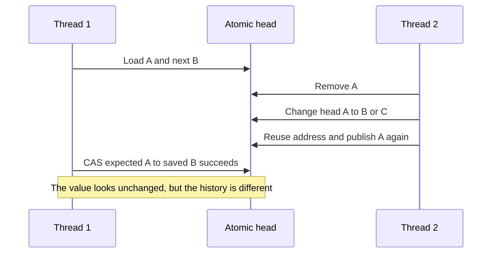
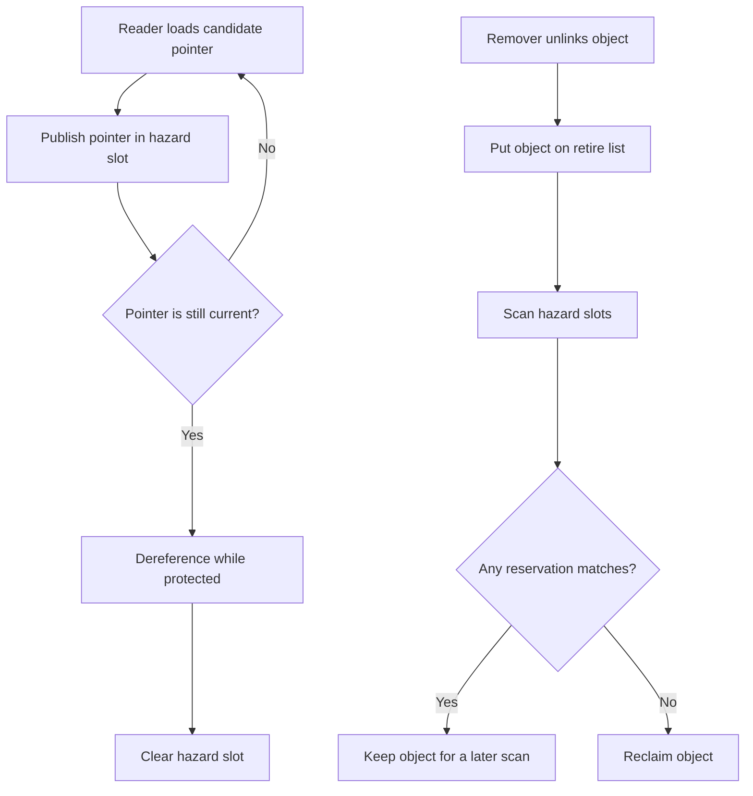

# ABA Problem and Safe Memory Reclamation

Lock-free algorithms often use **compare-and-exchange** to update a shared
pointer. The operation is only safe when the value being compared represents
all of the state that matters and the pointed-to object remains alive for the
whole operation. The **ABA problem** and unsafe reclamation violate one of
those assumptions.

This topic connects [lock-free data structures](./lock-free.md), the
[concurrency memory model](./memory-model.md), [RCU](./rcu.md), and Linux
kernel synchronization. It is a high-value interview topic because a
compare-and-swap loop can be lock-free and still be incorrect.

## The short version

> A thread reads **A**, another thread changes **A → B → A**, and the first
> thread's CAS succeeds even though the data structure changed in between.

There are two separate questions:

1. **Logical ABA:** did the shared state change and return to an equal value?
2. **Lifetime safety:** can a thread still dereference the old object while
   another thread is reclaiming or reusing its storage?

Tagged pointers address the first question. Hazard pointers, epochs, RCU, or
another safe-reclamation scheme address the second. A tag alone is not a
license to dereference a freed pointer.

## A concrete ABA interleaving

Consider a Treiber stack whose atomic head points to `A`, followed by `B`.
Thread 1 begins a pop and reads `head == A` and `next == B`. Before it performs
its CAS, Thread 2 removes `A`, removes or reuses `B`, and eventually places a
node at the same address as `A` back at the head. Thread 1's expected pointer
still compares equal, but its saved `next` no longer describes the current
stack.



The bug may appear as a lost node, a cycle, a use-after-free, or memory
corruption. It is often intermittent because the failure requires a precise
scheduler interleaving.

## Why immediate deletion is unsafe

This minimal pattern is not a complete lock-free stack:

```cpp
Node* old = head.load(std::memory_order_acquire);
if (old != nullptr) {
    Node* next = old->next;                 // dereference old
    if (head.compare_exchange_weak(old, next,
                                   std::memory_order_acq_rel,
                                   std::memory_order_acquire)) {
        delete old;                          // unsafe in a concurrent stack
    }
}
```

Another thread may have loaded `old` before the successful CAS and may still
be reading `old->next`. The successful remover cannot infer that no readers
remain merely because `old` is no longer reachable from `head`.

A correct algorithm needs both:

- **Publication ordering:** initialized fields become visible before a node is
  published, normally with release/acquire operations.
- **Deferred reclamation:** removed storage is not freed or reused until every
  possible reader has stopped using it.

## Solution 1: tagged or versioned pointers

Store a pointer together with a monotonically increasing tag. Every successful
update increments the tag, so `A(tag=7)` is different from
`A(tag=9)`. The CAS then compares the pointer and tag as one atomic state.

```cpp
struct TaggedHead {
    Node* ptr;
    std::uint64_t version;
};

// Conceptual only: the pair must be updated atomically on the target.
TaggedHead old = head.load(std::memory_order_acquire);
TaggedHead next{old.ptr->next, old.version + 1};
head.compare_exchange_weak(old, next,
                           std::memory_order_acq_rel,
                           std::memory_order_acquire);
```

### Strengths

- Detects an intervening update even when the pointer value returns to `A`.
- Simple to reason about when the platform supports a sufficiently wide CAS.
- Useful for bounded pools and fixed-size structures where pointer reuse is
  controlled.

### Limits

- The pointer and tag need one atomic compare-exchange; a platform may not
  provide double-width CAS for the chosen representation.
- A finite tag can eventually wrap. The wrap interval must exceed the maximum
  time a stale observation can remain relevant, or another scheme is needed.
- The tag does not keep the pointed-to object alive while a reader dereferences
  it. Combine tagging with safe reclamation when readers hold raw pointers.

Boost's lock-free rationale describes tagged pointers and the portability
trade-off around double-width compare-exchange in more detail.

## Solution 2: hazard pointers

A **hazard pointer** is a per-reader reservation published in shared memory.
Before dereferencing a pointer, a reader publishes the pointer and validates
that the pointer is still reachable. A remover places deleted objects on a
retire list, scans all reservations, and reclaims only objects that no hazard
pointer protects.



A simplified reader protocol is:

```cpp
for (;;) {
    Node* p = head.load(std::memory_order_acquire);
    hazard.store(p, std::memory_order_seq_cst);
    if (p == head.load(std::memory_order_acquire)) {
        // Safe to read *p while hazard protects it.
        use(p);
        break;
    }
}
hazard.store(nullptr, std::memory_order_seq_cst);
```

The exact memory orders, publication barriers, and scanning protocol are part
of the algorithm. A relaxed store that is not made visible to reclaimers in
time can reintroduce the lifetime bug.

### Trade-offs

- **Bounded reclamation:** retired objects can be reclaimed once no hazard
  pointer protects them.
- **Reader cost:** each protected pointer requires a publication and validation
  step, often including a strong ordering operation.
- **Reader progress:** a stalled reader protects only the pointers it has
  announced; it does not necessarily stop unrelated objects from being
  reclaimed.
- **API discipline:** raw pointers must never escape the protection epoch.

## Solution 3: epoch-based reclamation

In **epoch-based reclamation** (EBR), a reader pins itself in a global or local
epoch before accessing shared objects. A removed object is retired in the
current epoch. Once all participants have advanced far enough, objects from
older epochs can be reclaimed.

A common three-epoch intuition is:

1. A participant pins in epoch \\(E\\) and may read objects retired after the
   relevant safety boundary.
2. An updater retires an object and later advances the global epoch.
3. After all participants have moved past the retirement epoch, reclamation is
   safe.

Crossbeam Epoch uses pinning, guards, deferred destruction, and epoch
advancement. The guard ties the lifetime of a protected shared pointer to the
reader's pinned interval.

```rust
use crossbeam_epoch::{self as epoch, Atomic, Owned};
use std::sync::atomic::Ordering;

let guard = epoch::pin();
let current = head.load(Ordering::Acquire, &guard);

if let Some(node) = unsafe { current.as_ref() } {
    // `node` remains protected while `guard` is pinned.
    inspect(node);
}

// A removed node is retired, not immediately freed.
// unsafe { guard.defer_destroy(removed); }
```

### Trade-offs

- **Low read overhead:** readers pin once and can inspect several protected
  objects during that interval.
- **Stall sensitivity:** a participant that remains pinned can delay reclamation
  and increase memory use.
- **No universal epoch:** implementations differ in participant registration,
  quiescent states, nesting, and how they advance epochs.
- **Not automatic garbage collection:** the data structure still has to retire
  removed objects through the correct guard or collector.

## Solution 4: RCU

**Read-copy-update** is a specialized deferred-reclamation scheme for
read-mostly workloads. An updater unlinks or replaces an object, waits for a
grace period, and then frees the old object. Linux RCU readers use read-side
critical sections and `rcu_dereference`; updaters publish with
`rcu_assign_pointer` and reclaim with `synchronize_rcu` or `call_rcu`.

```text
publish new object → stop new readers seeing old object
                     → wait for a grace period
                     → reclaim old object
```

RCU differs from hazard pointers in the unit of protection: a reader usually
protects a read-side interval, not an individually announced pointer. It is
excellent when reads dominate and the platform can detect quiescent states.
It can delay all reclamation when a reader fails to leave its critical section.

See the detailed [RCU chapter](./rcu.md) for Linux primitives, grace-period
ordering, SRCU, and module-unload considerations.

## Solution 5: reference counting and ownership

Reference counting can make object lifetime explicit, but it is not a complete
answer to every lock-free algorithm:

- Incrementing a reference count is unsafe if the object may already be freed
  before the increment.
- Every path must release exactly once; cycles can leak.
- Atomic reference-count updates add contention and memory-ordering cost.
- A reference count protects an object after ownership is acquired; it does
  not automatically make a pointer read-and-acquire sequence safe.

Use an ownership protocol that makes it impossible to acquire a count from an
already-unreachable object, or combine ownership with a reclamation scheme.

## Comparison table

| Technique | Reader action | Reclamation trigger | Stalled reader effect | Typical fit |
|---|---|---|---|---|
| Tagged pointer | CAS pointer plus version | After version check and separate lifetime proof | Depends on lifetime scheme | Bounded pools, compact heads |
| Hazard pointers | Publish each protected pointer | Scan reservations | Protects announced objects | General lock-free structures |
| Epoch / EBR | Pin a participant | All participants advance past retire epoch | Can delay old epochs | High-throughput lock-free collections |
| RCU | Enter read-side critical section | Grace period completes | Can delay the grace period | Read-mostly kernel/shared data |
| Reference counting | Acquire a valid ownership reference | Count reaches zero | Holds object alive | Ownership-oriented APIs |
| Garbage collection | Normal managed reference | Collector determines reachability | Depends on collector | Managed runtimes |

No row is universally best. Choose based on read/write ratio, whether readers
may block, bounded-memory requirements, platform primitives, and API ownership.

## Memory ordering and the ABA boundary

Safe reclamation does not replace memory ordering:

- Use release publication and acquire consumption so initialized fields are
  visible before a node becomes reachable.
- Use compare-exchange success and failure orderings deliberately. An acquire
  failure load may be required to observe a newly published `next` pointer.
- Do not use `memory_order_relaxed` merely because an operation is atomic. It
  gives atomicity and per-location modification order, not a happens-before
  relationship for ordinary fields.
- A successful CAS proves that the compared atomic state matched. It does not
  prove that a pointer loaded earlier is still alive.

The most useful interview sentence is:

> CAS solves atomic state transition; reclamation solves object lifetime. They
> are related, but they are not the same problem.

## Choosing a technique in practice

- **Linux kernel code:** use the kernel's documented RCU, refcount, locking,
  and allocator APIs rather than inventing a userspace reclamation scheme.
- **C++:** use a well-reviewed implementation or the safe-reclamation APIs in
  the current C++ working draft when the compiler/library actually supports
  them. The standard draft and WG21 papers describe the interface; availability
  is implementation-dependent during the C++26 rollout.
- **Rust:** use a library such as `crossbeam-epoch` or another reviewed
  reclamation implementation; keep unsafe pointer manipulation behind a small,
  tested abstraction.
- **Bounded embedded structures:** tagged indices or an object pool may be
  simpler than dynamic reclamation if the capacity and reuse invariants are
  explicit.
- **Read-mostly snapshots:** RCU or copy-on-write may be clearer than a general
  lock-free linked structure.

## Interview questions

### Why is `compare_exchange` not enough to prevent ABA?

Because it compares the current bit pattern with the expected bit pattern. If a
location changes from A to B and back to A, the comparison succeeds even though
the state changed. The algorithm needs a version tag or a lifetime protocol.

### Does a tagged pointer solve use-after-free?

Not by itself. It can detect pointer reuse when the tag is included in the CAS,
but a reader may still dereference freed storage before the CAS. Pair tagging
with hazard pointers, epochs, RCU, a pool invariant, or another valid lifetime
scheme.

### Hazard pointers versus epochs?

Hazard pointers publish the exact objects a reader protects and can reclaim
unprotected objects even if another reader stalls. Epochs amortize reader work
by pinning an interval, but a stalled participant can delay reclamation for
objects retired in older epochs.

### Why can RCU readers be so cheap?

The reader usually records entry and exit in a way that avoids a contended
shared lock or per-pointer hazard publication. The updater pays the grace-period
cost and defers freeing until pre-existing readers have passed quiescent states.

### What must be tested beyond the happy path?

Test repeated address reuse, delayed readers, thread cancellation, allocator
pressure, weakly ordered architectures, nested protection, failed CAS loops,
collector progress, and shutdown while retired objects remain.

## Cross-references

- [Lock-free Data Structures](./lock-free.md) — CAS loops and progress guarantees
- [Memory Model](./memory-model.md) — acquire/release and happens-before
- [RCU](./rcu.md) — Linux grace periods and deferred callbacks
- [Work-Stealing Scheduler](./work-stealing.md) — lock-free queues and ownership
- [Memory Barriers](../os/synchronization/memory-barriers.md) — hardware/compiler ordering
- [Linux RCU](../linux/kernel/sync/rcu.md) — kernel implementation details
- [C++ Memory Model](../languages/cpp/memory-model.md) — language-level atomics
- [C++ Lock-Free Programming](../dsa/chapters/ch52-memory-hardware.md) — cache and hardware context

## References

- [Linux kernel RCU Concepts](https://docs.kernel.org/RCU/rcu.html) — grace periods, read-side critical sections, and safe reclamation
- [Linux kernel RCU Requirements](https://docs.kernel.org/RCU/Design/Requirements/Requirements.html) — grace-period and memory-ordering guarantees
- [Linux kernel API: RCU](https://docs.kernel.org/core-api/kernel-api.html#rcu)
- [Maged Michael, Hazard Pointers: Safe Memory Reclamation for Lock-Free Objects](https://research.ibm.com/publications/hazard-pointers-safe-memory-reclamation-for-lock-free-objects) — original hazard-pointer research and ABA motivation
- [WG21 P2530R3: Hazard Pointers for C++26](https://www.open-std.org/jtc1/sc22/wg21/docs/papers/2023/p2530r3.pdf)
- [WG21 P2545R4: Read-Copy Update for C++26](https://www.open-std.org/jtc1/sc22/wg21/docs/papers/2023/p2545r4.pdf)
- [Current C++ working draft: safe reclamation](https://eel.is/c++draft/thread#saferecl)
- [Crossbeam Epoch documentation](https://docs.rs/crossbeam-epoch/latest/crossbeam_epoch/) — Rust epoch-based reclamation API
- [Boost.Lockfree rationale: ABA prevention](https://www.boost.org/doc/libs/latest/doc/html/lockfree/rationale.html)
- [Folly Hazptr implementation](https://github.com/facebook/folly/blob/main/folly/synchronization/Hazptr.h)
