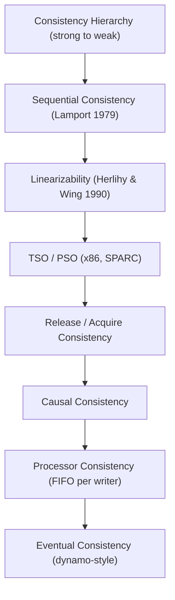
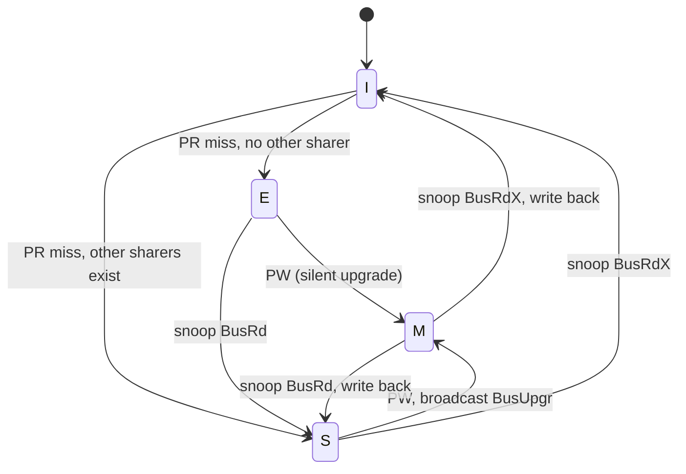
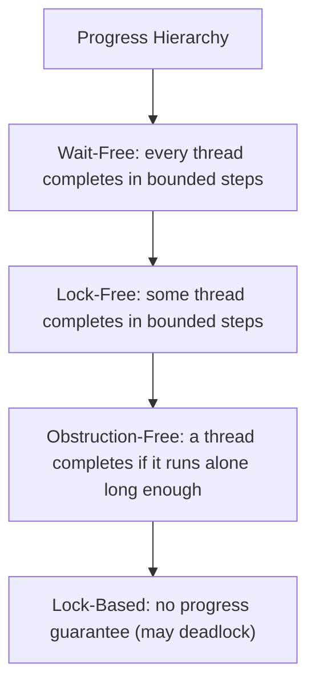
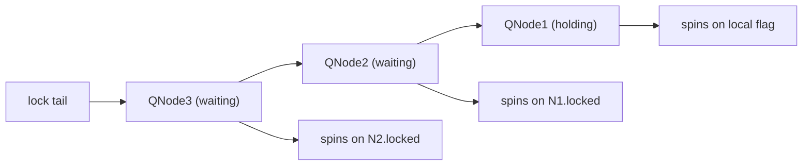

# Advanced Concurrency — Deep Dive

## Overview

This page synthesizes the harder half of §6 in the [Master Topic Index](../index.md):
consistency models, cache-coherence protocols, false sharing, memory-barrier
discipline, the progress-guarantee hierarchy, atomic primitives, safe memory
reclamation (hazard pointers, epochs, RCU), queue locks, NUMA-aware locking,
transactional memory, and lock elision.

These are the topics that separate "I know what a mutex is" from "I can ship a
lock-free data structure on a 128-core NUMA box without corrupting state".
Throughout, we cite the canonical references — Herlihy & Shavit's *The Art of
Multiprocessor Programming* (AMP), Sorin, Hill & Wood's *A Primer on Memory
Consistency and Cache Coherence* (SHW), Lamport's original papers, Boehm's
C++ memory-model work, and the Linux kernel's `Documentation/core-api/memory-barriers.txt`.

> Related pages (do not duplicate, only deepen): [Memory Model](./memory-model.md),
> [Lock-free](./lock-free.md), [ABA Problem and Safe Memory Reclamation](./aba-problem.md),
> [RCU](./rcu.md), [Transactional Memory](./transactional-memory.md),
> [Memory Barriers](../os/synchronization/memory-barriers.md), [CAS](../os/synchronization/cas.md),
> [Spinlocks](../os/synchronization/spinlocks.md), [NUMA](../os/memory/numa.md).

## 1. Consistency Models

A **consistency model** is a contract between the memory system and the
programmer: it specifies which write orderings a reader is allowed to observe.
Weaker models allow more hardware reordering (faster) but place more burden on
the programmer (harder to reason about). SHW organises the spectrum from
strongest to weakest.



Note the placement: linearizability is *stronger* than sequential consistency
for *single objects* (it adds the real-time / external-order constraint) but
the two are not strictly comparable across multi-object histories. The diagram
captures the practical intuition: stronger = more ordering = slower.

| Model | Real-time order? | Per-thread order? | Total order? | Typical use |
|-------|:----------------:|:-----------------:|:------------:|-------------|
| Linearizability | Yes | Yes | Yes (single obj) | Lock-free data structures |
| Sequential consistency | No | Yes | Yes | Lamport's idealised model |
| TSO (x86) | No | Yes (stores not reordered w/ stores) | No | x86 hardware |
| Release consistency | No | Yes (paired) | No | C++ `acquire/release` |
| Causal consistency | No | Yes | No (only causally related) | Distributed stores (COPS) |
| Eventual consistency | No | No | No | DNS, Dynamo, CRDTs |

### Linearizability (Herlihy & Wing, 1990)

Every operation appears to take effect *atomically* at some instant between its
invocation and its response. The compositional property: if `X` and `Y` are
linearizable, so is `{X, Y}` composed. This is what makes a correct lock-free
Treiber stack composable into other structures. AMP Ch. 3 covers this in
detail. Practical test: history `H` is linearizable iff you can insert
sequential "linearization points" between each invocation/response pair such
that the resulting sequential history respects the real-time order of
non-overlapping operations.

### Sequential Consistency (Lamport, 1979)

> "The result of any execution is the same as if the operations of all the
> processors were executed in some sequential order, and the operations of
> each individual processor appear in this sequence in the order specified by
> its program." — Lamport, "How to Make a Multiprocessor Computer That
> Correctly Executes Multiprocess Programs", IEEE TC 1979.

No real-time constraint; an SC execution only needs *some* interleaving to
exist. C++'s **DRF-SC** theorem (Boehm & Adve, PLDI 2008): if a program has no
data races on non-atomic memory, then its executions are sequentially
consistent — see the [Memory Model](./memory-model.md) page.

### Causal Consistency

Reads respect *happened-before* (Lamport 1978) ordering on writes: if write
`w1` happened-before `w2`, every process that observes `w2` must also observe
`w1`. Concurrent writes can be seen in different orders by different readers.
This is the strongest model that does not require global agreement, making it
attractive for geo-distributed stores (COPS, Bayou).

### Release Consistency (Gharachorloo et al., 1990)

Distinguished by **acquire** and **release** fences: a thread entering a
critical section issues `acquire`, leaving issues `release`. Non-synchronising
accesses can be reordered freely inside the critical section. C++11's
`memory_order_acquire` / `memory_order_release` map to this model — see the
[Memory Model](./memory-model.md) page for the C++ enum.

## 2. Cache Coherence Protocols

Cache coherence is the *hardware* mechanism that makes a write by one core
visible to other cores' caches. Without it, even SC would be impossible.
SHW Ch. 5–7 covers MESI, MOESI, MESIF in depth.

Two coordination strategies:

- **Snooping (bus-based)**: every cache snoops a shared bus. Writes broadcast
  invalidations. Scales to ~16 cores; common on x86 client CPUs.
- **Directory-based**: a per-line directory (per-bank, distributed) tracks which
  caches hold the line in what state. Scales to thousands of cores; used in
  AMD EPYC, Intel Xeon Scalable, and most ARM server SoCs.

### MESI State Diagram

MESI has four states per cache line: **M**odified, **E**xclusive, **S**hared,
**I**nvalid. Transitions are driven by processor reads/writes (PR, PW) and bus
snoops (BusRd, BusRdX, BusUpgr).



The **E** state is the key optimisation: a read that misses when no other cache
holds the line transitions straight to E (rather than S), allowing a silent
upgrade to M on a subsequent write without any bus traffic.

### MOESI and MESIF

| Protocol | Extra state | Purpose | Used by |
|----------|-------------|---------|---------|
| MESI | — | Baseline 4-state | Most x86 caches (logical) |
| MOESI | **O**wned | Modified but shared; owner supplies data, memory stays stale | AMD, ARM |
| MESIF | **F**orward | Among S-state holders, exactly one is F and answers snoops | Intel Nehalem+ |

The **O** (Owned) state in MOESI avoids the write-back + re-read penalty when
another core wants to read a dirty line: the owner supplies the data and stays
responsible, but does not have to flush to memory. **F** (Forward) in MESIF
solves the "thundering herd" snoop problem: only one cache among many S-state
holders answers a `BusRd`, reducing interconnect traffic.

## 3. False Sharing & Cache-Line Contention

Two threads writing to *different* variables that happen to share a 64-byte
cache line will trigger MESI invalidations on every write — even though the
program is logically independent. This is **false sharing**, and it can slow
down a parallel loop by 5–10x.

```c
// BAD: counters shared across threads pack into one cache line
struct Counters { long a, b, c, d; };   // 32 bytes — fits one line
// Thread 1 increments a, Thread 2 increments b → cache ping-pong
```

```c
// GOOD: pad to cache-line boundary (64 bytes on x86/ARM)
struct alignas(64) Counter { long value; char pad[64 - sizeof(long)]; };
struct Counters { Counter a, b, c, d; };   // each lives on its own line
```

Diagnosis: `perf c2c` (Linux) reports cache-line contention; Intel VTune's
"Memory Access" analysis classifies false-sharing hotspots. The kernel uses
`____cacheline_aligned` and `____cacheline_internodealigned` for the same
purpose — see `include/linux/cache.h`.

## 4. Memory Barriers — The Four Orderings

Memory barriers (fences) enforce one of four pair orderings. The Linux kernel's
`memory-barriers.txt` documents these as the foundation for everything else.

| Barrier | Orders | x86 needed? | C++11 equivalent |
|---------|--------|:-----------:|------------------|
| Load-Load | earlier loads before later loads | No (x86 preserves) | `atomic_thread_fence(acquire)` |
| Load-Store | earlier load before later store | No (x86 preserves) | `atomic_thread_fence(acquire)` |
| Store-Store | earlier store before later store | No (x86 preserves, except nontemporal) | `atomic_thread_fence(release)` |
| Store-Load | earlier store before later load | **Yes** — the famous x86 hole | `atomic_thread_fence(seq_cst)` |

The Store-Load reordering is the only one x86 (TSO) allows: a store sits in
the store buffer while a later load bypasses it. The `mfence` instruction, an
atomic RMW with locked semantics (`lock xchg`), or a `seq_cst` fence closes
this hole. ARM/RISC-V need all four, which is why `smp_mb()` is a full barrier
on those architectures. See [Memory Barriers](../os/synchronization/memory-barriers.md)
for the kernel-side view.

The canonical Store-Buffering litmus (must use `seq_cst` on x86 to disallow
`r1=r2=0`):

```c
// Initially x = y = 0
// T1: x.store(1, seq_cst); r1 = y.load(seq_cst);
// T2: y.store(1, seq_cst); r2 = x.load(seq_cst);
// With seq_cst: r1 == r2 == 0 forbidden.
// With acq/rel only: r1 == r2 == 0 IS allowed on ARM/POWER.
```

## 5. Progress Guarantees — The Hierarchy

A concurrent object's **progress guarantee** describes how threads make
progress. AMP Ch. 3 defines three nested classes.



| Guarantee | Per-thread bound? | System-wide bound? | Starvation possible? |
|-----------|:-----------------:|:------------------:|:--------------------:|
| Wait-free (bounded) | Yes | Yes | No |
| Lock-free | No | Yes | Yes (individual starvation) |
| Obstruction-free | No | No (only if solo) | Yes |
| Lock-based | No | No | Yes (deadlock possible) |

**Wait-free** is the gold standard but the hardest to implement: every
operation must complete in a bounded number of steps regardless of what other
threads do. AMP gives a wait-free universal construction (Herlihy's
universal construction, §6) but it has high constant factors. Practical
wait-free algorithms exist for queues (Vyukov), stacks (Treiber is *not*
wait-free — it is lock-free, because a thread can be preempted forever in the
CAS retry loop).

**Lock-free** guarantees *system-wide* progress: at least one thread completes
in a bounded number of steps. The Treiber stack and Michael-Scott queue are
lock-free. Individual threads can starve indefinitely under contention.

**Obstruction-free** is the weakest non-blocking progress: a thread makes
progress only if it executes in isolation (no other threads are scheduled) for
long enough. Useful for transactional memory rollback and as a building block
— see [Transactional Memory](./transactional-memory.md).

## 6. Atomic Primitives — CAS, FAA, DCAS, Weak vs Strong

| Primitive | Semantics | x86 instruction | Typical use |
|-----------|-----------|-----------------|-------------|
| CAS | `if (*p == e) *p = n; return old` | `lock cmpxchg` | General lock-free |
| FAA (fetch-and-add) | `return (*p += n)` atomically | `lock xadd` | Counters, ticket lock |
| Exchange | `return *p; *p = v` | `lock xchg` | Mutex fast path |
| DCAS | double-word CAS (two addresses) | Not native on x86 (emulated) | Invasive data structures |

**Weak vs strong CAS** (C++ `compare_exchange_weak` vs `_strong`): weak may
fail *spuriously* (return false even when `*p == e`). On ARM/POWER, weak maps
to a single `LL/SC` loop iteration; strong needs an outer retry loop. The
idiom: use `weak` inside a CAS-retry loop (the spurious failure just retries),
use `strong` outside a loop (one-shot publication check). See [CAS](../os/synchronization/cas.md).

**FAA is strictly stronger than CAS for counters**: a CAS-based increment can
fail and retry under contention, while `fetch_add` never retries — the hardware
guarantees the increment happens. `LongAdder` (Java) and `RelaxedAtomic` cells
in Rust's `crossbeam` exploit FAA per-shard to scale counters to hundreds of
cores.

**DCAS (double CAS)**: needed for some lock-free algorithms (e.g., maintaining
both head and tail of a deque simultaneously). x86 has no native DCAS; it must
be emulated via transactional memory (Intel TSX) or fallback locks. Apple's
`OSAtomicCompareAndSwap64Barrier` and `liburcu`'s `uatomic_cmpxchg_double`
provide portable-ish wrappers.

## 7. Safe Memory Reclamation

Lock-free data structures defer reclamation: a node removed from the structure
may still be referenced by a concurrent reader. Freeing it eagerly causes
use-after-free. Three families of solutions — each cross-referenced where we
have a dedicated page.

### Hazard Pointers (Maged Michael, 2004)

Each thread publishes the addresses it is about to dereference in a per-thread
"hazard pointer" slot. A reclaimer scans all hazard slots before freeing a
node; if any matches, the free is deferred. Per-reader cost: one store-release
per protected pointer. Retire batch: scan `N × H` slots (N = threads, H =
hazards per thread). AMP §10.3 covers this in detail. See also the
[ABA page](./aba-problem.md) for the safe-reclamation contract.

### Epoch-Based Reclamation (EBR)

Readers enter an epoch (a global counter); they hold it for the duration of a
critical section. Retired nodes are tagged with the current epoch and queued.
When *all* threads have moved past an epoch (which requires every thread to
have at least one quiescent point since the retire), the queued nodes from the
older epoch are safe to free. EBR has lower per-reader cost than hazard
pointers (one atomic load + compare on entry) but higher retire latency.
`crossbeam-epoch` (Rust) and `folly::HazPtr`'s epoch fallback implement this.

### RCU (Read-Copy-Update)

A kernel-native form of epoch reclamation: readers are extremely cheap (often
just `preempt_disable`), and grace periods are detected by quiescent states
(context switch, idle, user-mode return). See the dedicated
[RCU page](./rcu.md) — this page only cross-references it. RCU is *not*
suitable for user-space general use without OS support; userspace RCU
(`liburcu`) approximates it.

| Property | Hazard Pointers | EBR | RCU |
|----------|:---------------:|:---:|:---:|
| Reader cost per access | 1 store-release | 1 load per epoch | 0 (kernel-disabled preempt) |
| Reclamation latency | O(N×H) per batch | One grace period | One grace period |
| Requires OS support | No | No | Yes (or liburcu) |
| Works for arbitrary memory | Yes | Yes | Yes (with care) |

## 8. Queue Locks — MCS, CLH, NUMA-Aware

Test-and-set / test-and-test-and-set spinlocks cause cache-line ping-pong:
every acquirer writes to the same lock word, invalidating every other CPU's
cache. Under N cores, this is O(N) bus traffic per acquisition. **Queue locks**
localise spinning: each thread spins on a *different* cache line, and the lock
hands off by signalling the next waiter.

### MCS Lock (Mellor-Crummey & Scott, 1991)

Each acquirer allocates a stack-local `QNode { locked, next }`. The lock is a
pointer to the tail of the queue. Acquire CASes your node onto the tail; if
there was a predecessor, you spin on your local `locked` flag, which the
predecessor will write when it releases. Release writes to your successor's
`locked` flag — a single cache-line invalidation.

### CLH Lock (Craig, Landin, Hagersten, 1993)

Similar idea, but each node spins on the *predecessor's* `locked` field rather
than its own. The QNode is reused across acquires; only the pointer chain
changes. Better cache behaviour on NUMA-less systems; MCS scales better on
NUMA because the spin is always on a local variable.



| Lock type | Spin location | Cache traffic / acquire | NUMA-friendly? | Composability |
|-----------|---------------|:-----------------------:|:--------------:|:-------------:|
| Mutex (sleep) | None (blocked) | 0 (scheduler cost instead) | Yes (per-node futex) | High |
| TAS spinlock | Same word | O(N) invalidations | No | Low |
| Ticket lock | Same `now_serving` word | O(N) (still central) | No | Low |
| MCS lock | Per-node local | O(1) (1 handoff) | Yes | Medium |
| CLH lock | Predecessor's field | O(1) (1 handoff) | Mostly yes | Medium |

**NUMA-aware locks**: on a multi-socket system, queue locks still pay cross-socket
latency on handoff. NUMA-aware variants (MCS-tree / `qspinlock` in Linux 4.x)
batch waiters per node and only hand off across sockets when the local queue
is empty. The Linux `qspinlock` (Peter Zijlstra, 2014) replaces the legacy
ticket spinlock on most architectures precisely for this reason — see
[Spinlocks](../os/synchronization/spinlocks.md).

## 9. Transactional Memory & Lock Elision

Transactional memory lets the programmer specify a critical section that the
hardware or runtime executes *speculatively*: if no conflict occurs, the whole
section commits atomically; if a conflict occurs, it rolls back and retries.
This eliminates deadlocks and priority inversion automatically. See the
dedicated [Transactional Memory page](./transactional-memory.md) for HTM, STM,
and Intel TSX internals.

**Lock elision** (Intel Haswell+, 2013) is the killer application: a `lock
xchg` (mutex acquire) is *speculatively* elided — the CPU tracks the lock in
the read set but does not actually write it. If the transaction commits, the
critical section ran as if lock-free; if it aborts, the hardware falls back to
acquiring the lock. `glibc` 2.18+ enables this transparently for
`pthread_mutex_lock` on TSX-capable CPUs. The caveat (the errata on Skylake /
Kaby Lake that disabled TSX) is why many production deployments still run with
RTM disabled — see the [Transactional Memory](./transactional-memory.md)
common-mistakes section.

## 10. Lock-Free Data Structure Patterns

The two canonical patterns; full algorithms and ABA solutions live on the
[Lock-free](./lock-free.md) and [ABA](./aba-problem.md) pages.

- **Treiber stack** (Treiber, 1986): `push` and `pop` use CAS on a single
  `head` pointer. Lock-free, *not* wait-free. Safe reclamation required.
- **Michael-Scott queue** (Michael & Scott, 1996): two-pointer CAS queue with
  a dummy sentinel node. Lock-free enqueue and dequeue. Used in
  `ConcurrentLinkedQueue` (Java) and `crossbeam-queue`.
- **Harris-Michael linked list**: lock-free ordered list with logical deletion
  (mark bit on next pointer) before physical unlink. Foundation for lock-free
  hash maps (e.g., `java.util.concurrent.ConcurrentHashMap`'s segments).
- **Skip list** (Fraser 2003, Harris 2001): CAS-based concurrent skip list,
  used by `ConcurrentSkipListMap` and RocksDB's memtable.

The pattern across all: read-then-CAS retry loop, paired with safe
reclamation, and `acquire/release` ordering so the published node's fields are
visible before the pointer to it is.

## Interview Questions

**Q1: What is the difference between linearizability and sequential
consistency?**
A: Linearizability adds the real-time (external) order constraint: if
operation A completes before B begins (wall-clock), A must appear before B.
SC only requires *some* sequential interleaving consistent with per-thread
program order. Lock-free data structures usually aim for linearizability
because it is the model users expect from `push` / `pop`.

**Q2: Why does x86 (TSO) need `mfence` for a Dekker-style mutual exclusion
algorithm, but not for a release-acquire pattern?**
A: TSO allows Store-Load reordering (a later load can bypass an earlier store
still in the store buffer). Dekker's algorithm relies on the order "write flag
/ read other flag", which TSO breaks. `mfence` (or `seq_cst`) is required.
Release-acquire patterns only need Store-Store and Load-Load ordering, both of
which TSO already preserves — so plain `release` / `acquire` are free on x86.

**Q3: Explain MESI's E state. Why is it a performance win?**
A: E (Exclusive) means a cache holds the only clean copy. A subsequent write
to that line transitions E→M *silently* — no bus invalidation needed because
no other cache has the line. Without E, every write after a cold miss would
broadcast a BusUpgr, doubling interconnect traffic for write-private workloads
(which dominate single-threaded benchmarks).

**Q4: What is false sharing, and how do you detect it in production?**
A: Two threads writing to *different* variables that share a 64-byte cache
line trigger MESI invalidations on every write, even though the program is
logically independent. Detection: `perf c2c` reports the contended line and
the offending offsets; Intel VTune classifies false-sharing hotspots. Fix:
align each counter to `alignas(64)` (or `____cacheline_aligned` in the kernel).

**Q5: Distinguish wait-free, lock-free, and obstruction-free with a concrete
example of each.**
A: Wait-free — bounded counter using `fetch_add`: every call returns in O(1)
instructions. Lock-free — Treiber stack: at least one thread's CAS succeeds in
bounded steps, but a specific thread can retry forever under contention.
Obstruction-free — a software transactional-memory `atomic` block: makes
progress only if no other thread is scheduled against it during its execution
window. The hierarchy is strict: wait-free ⊂ lock-free ⊂ obstruction-free.

**Q6: Why is `compare_exchange_weak` preferred inside a CAS retry loop?**
A: `weak` may fail spuriously (return false even when the expected value
matched) on architectures that implement CAS via load-linked /
store-conditional (ARM, POWER, MIPS). Inside a retry loop, the spurious
failure just loops back. `strong` would emit an inner retry loop to defeat the
spurious failure — wasted work when the caller already retries. Use `strong`
only for one-shot checks where you do not loop.

**Q7: Compare hazard pointers and epoch-based reclamation. When would you pick
each?**
A: Hazard pointers have O(1) per-reader per-protected-pointer cost (a
store-release) and per-batch O(N×H) retire scan. They bound *retire* latency
tightly but are expensive at very high reader counts. EBR has lower per-reader
cost (one load + compare per epoch entry) but higher retire latency (must wait
for all threads to pass a quiescent point). Pick hazard pointers when you need
low-latency reclamation and have moderate thread counts; pick EBR for very
high reader counts where the per-read cost dominates. RCU is the kernel
analogue of EBR (cross-ref [RCU](./rcu.md)).

**Q8: How does an MCS lock reduce cache traffic compared to a test-and-set
spinlock, and why does it matter for NUMA?**
A: TAS spinlock: every acquirer writes to the same lock word, invalidating the
cache line on every other CPU — O(N) bus traffic per acquisition. MCS: each
acquirer allocates a stack-local `QNode` and spins on its own `locked` field.
The lock handoff is a single write to the predecessor's `locked` field —
exactly one cache-line invalidation per release. On NUMA this is even more
important: cross-socket invalidation latency is 100–300 ns, so O(N)
snoops × N threads can saturate the interconnect. `qspinlock` extends this
with per-NUMA-node batching.

## Cross-References

- [Concurrency Overview](./overview.md) — primitives catalogue
- [Memory Model](./memory-model.md) — C++/Java/Go/Rust models, DRF-SC
- [Lock-free](./lock-free.md) — CAS, Treiber stack, Michael-Scott queue
- [ABA Problem](./aba-problem.md) — safe-reclamation contract in depth
- [RCU](./rcu.md) — grace periods, publish-subscribe, SRCU
- [Transactional Memory](./transactional-memory.md) — HTM, STM, Intel TSX
- [Memory Barriers](../os/synchronization/memory-barriers.md) — kernel fences
- [CAS](../os/synchronization/cas.md) — primitives deep-dive
- [Spinlocks](../os/synchronization/spinlocks.md) — `qspinlock`, ticket lock
- [NUMA](../os/memory/numa.md) — memory topology, locality

## References

- Maurice Herlihy & Nir Shavit — *The Art of Multiprocessor Programming, 2nd
  ed.* (Morgan Kaufmann, 2020). Ch. 3 (consistency), Ch. 4 (CAS primitives),
  Ch. 7 (queues), Ch. 10 (RCU / hazard pointers).
- Daniel J. Sorin, Mark D. Hill, David A. Wood — *A Primer on Memory
  Consistency and Cache Coherence, 2nd ed.* (Morgan & Claypool, 2020).
- Leslie Lamport — "How to Make a Multiprocessor Computer That Correctly
  Executes Multiprocess Programs" (IEEE TC 28(9), 1979).
- Maurice Herlihy & Jeannette Wing — "Linearizability: A Correctness
  Condition for Concurrent Objects" (ACM TOPLAS 12(3), 1990).
- Hans-J. Boehm & Sarita Adve — "Foundations of the C++ Concurrency Memory
  Model" (PLDI 2008). The DRF-SC theorem.
- Linux kernel — `Documentation/core-api/memory-barriers.txt`,
  `Documentation/RCU/*`, `include/linux/qspinlock.h`.
- John M. Mellor-Crummey & Michael L. Scott — "Algorithms for Scalable
  Synchronization on Shared-Memory Multiprocessors" (ACM TOCS 9(1), 1991).
- Maged M. Michael — "Hazard Pointers: Safe Memory Reclamation for Lock-Free
  Objects" (IEEE TPDS 15(6), 2004).
- Maged M. Michael & Michael L. Scott — "Simple, Fast, and Practical
  Non-Blocking and Blocking Concurrent Queue Algorithms" (PODC 1996).
- David Dice, Yossi Lev, Mark Moir, Dan Nussbaum — "Early Experience with a
  Commercial Hardware Transactional Memory Implementation" (ASPLOS 2009).