# Async/Await

## Overview

Async/await is a programming model for writing asynchronous code that looks synchronous. Instead of callbacks or manual thread management, async functions can suspend execution and resume later, allowing other tasks to run during I/O waits. It's the dominant model in JavaScript/TypeScript, Python, Rust, and C#, and is increasingly used in systems programming.

## The Problem Async Solves

### Synchronous Blocking

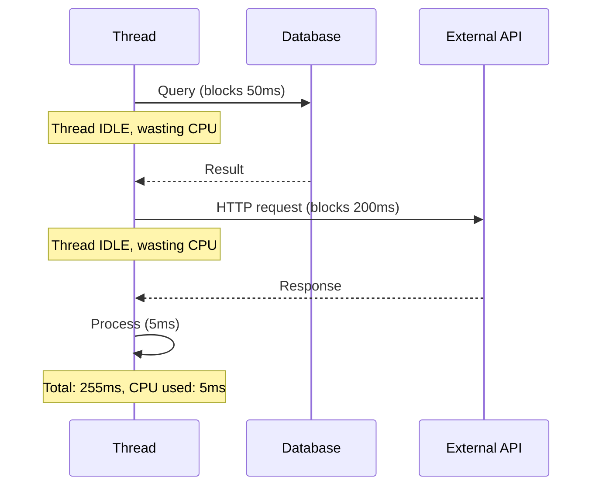

### Async Non-Blocking

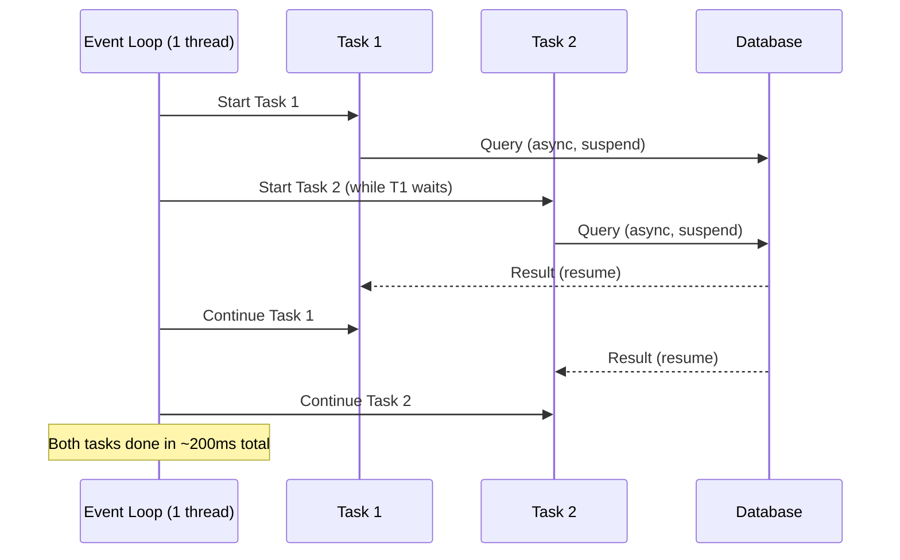

## How It Works

### The Event Loop

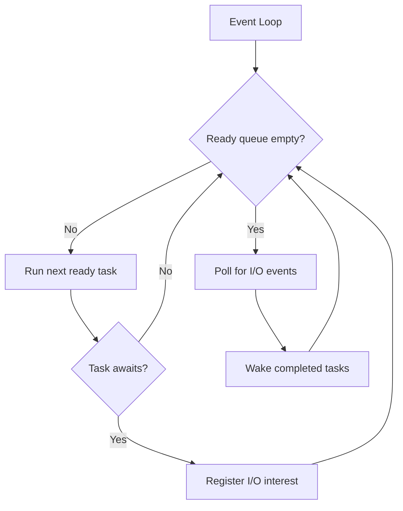

The event loop repeatedly:
1. Runs ready tasks until they await.
2. Polls for I/O completion.
3. Wakes tasks whose I/O is complete.

### Coroutine State Machine

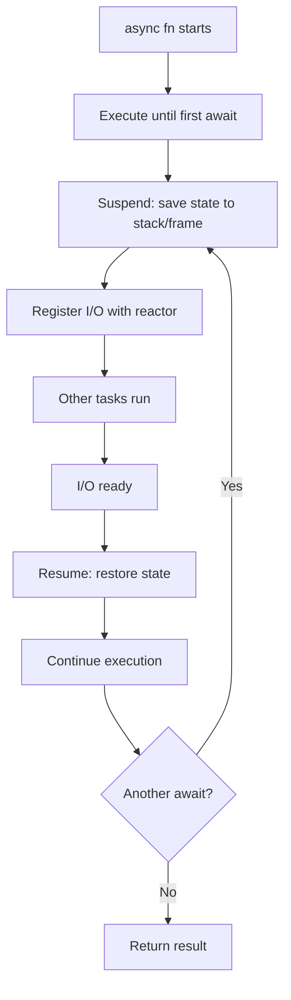

Each `await` point is a potential suspension. The compiler generates a state machine that saves/restores local variables.

## JavaScript/TypeScript

```javascript
// Async function returns a Promise
async function fetchUserData(userId) {
    const response = await fetch(`/api/users/${userId}`);  // Suspend here
    const user = await response.json();                     // Suspend here
    return user;
}

// Concurrent execution with Promise.all
async function fetchAllUsers(userIds) {
    const promises = userIds.map(id => fetchUserData(id));  // All start
    const users = await Promise.all(promises);              // Wait for all
    return users;
}

// Error handling
async function safeFetch(url) {
    try {
        const response = await fetch(url);
        return await response.json();
    } catch (error) {
        console.error('Fetch failed:', error);
        return null;
    }
}
```

### Event Loop in JavaScript

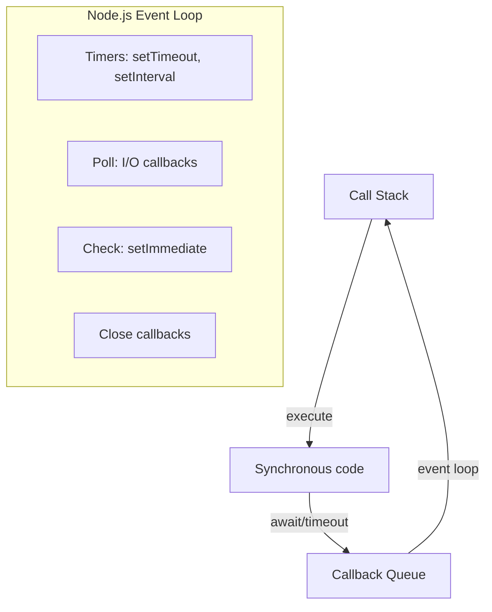

JavaScript has a single-threaded event loop. Async operations (I/O, timers) are handled by the runtime (libuv), and callbacks are queued for execution.

### Microtasks vs Macrotasks

```javascript
console.log('1: sync');

setTimeout(() => console.log('2: macrotask'), 0);

Promise.resolve().then(() => console.log('3: microtask'));

queueMicrotask(() => console.log('4: microtask'));

console.log('5: sync');

// Output: 1, 5, 3, 4, 2
// Microtasks (Promises) run before macrotasks (setTimeout)
```

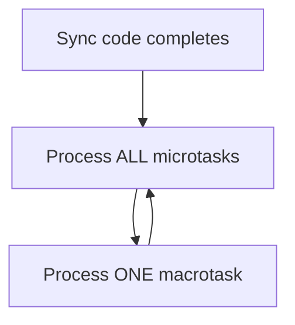

### Node.js Concurrency Patterns

```javascript
// Promise.allSettled — handle mixed success/failure
const results = await Promise.allSettled([
    fetch('/api/users'),
    fetch('/api/posts'),
    fetch('/api/comments'),
]);

results.forEach((result, i) => {
    if (result.status === 'fulfilled') {
        console.log(`Task ${i}: success`);
    } else {
        console.error(`Task ${i}: ${result.reason}`);
    }
});

// Promise.any — first success wins
const fastest = await Promise.any([
    fetchFromCDN1(),
    fetchFromCDN2(),
    fetchFromCDN3(),
]);

// Concurrency limiting
async function asyncPool(poolSize, items, fn) {
    const results = [];
    const executing = new Set();
    for (const [i, item] of items.entries()) {
        const p = fn(item).then(r => { results[i] = r; executing.delete(p); });
        executing.add(p);
        if (executing.size >= poolSize) await Promise.race(executing);
    }
    await Promise.all(executing);
    return results;
}
```

## Python

```python
import asyncio
import aiohttp

# Async function
async def fetch_url(session, url):
    async with session.get(url) as response:  # Suspend on I/O
        return await response.text()            # Suspend on read

# Run multiple concurrently
async def fetch_all(urls):
    async with aiohttp.ClientSession() as session:
        tasks = [fetch_url(session, url) for url in urls]
        return await asyncio.gather(*tasks)  # Run all concurrently

# Entry point
async def main():
    urls = ["https://api.example.com/1", "https://api.example.com/2"]
    results = await fetch_all(urls)
    for url, result in zip(urls, results):
        print(f"{url}: {len(result)} bytes")

asyncio.run(main())
```

### Python Event Loop

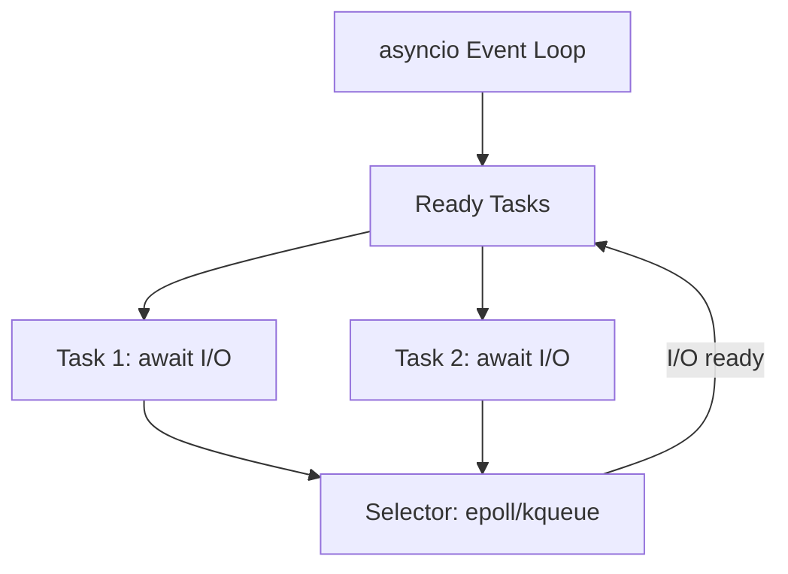

Python's asyncio uses a single-threaded event loop with `select`/`epoll`/`kqueue` for I/O multiplexing. Tasks are coroutines scheduled on the event loop.

### Python Structured Concurrency

```python
import asyncio

# TaskGroup (Python 3.11+) — structured concurrency
async def main():
    async with asyncio.TaskGroup() as tg:
        task1 = tg.create_task(fetch_url("url1"))
        task2 = tg.create_task(fetch_url("url2"))
        task3 = tg.create_task(fetch_url("url3"))
    # All tasks guaranteed complete here
    print(task1.result(), task2.result(), task3.result())

# If any task raises, all others are cancelled
# ExceptionGroup is raised with all errors

# Timeout patterns
async def fetch_with_timeout(url, timeout=5.0):
    try:
        async with asyncio.timeout(timeout):
            return await fetch_url(url)
    except TimeoutError:
        return None

# Semaphore for rate limiting
sem = asyncio.Semaphore(10)  # Max 10 concurrent

async def rate_limited_fetch(url):
    async with sem:
        return await fetch_url(url)
```

### Python Threading vs Asyncio

| Feature | threading | asyncio |
|---------|-----------|---------|
| Concurrency | Preemptive (OS-level) | Cooperative (task-level) |
| GIL | Yes (limits CPU parallelism) | Yes (but I/O releases GIL) |
| Best for | CPU-bound (with multiprocessing) | I/O-bound |
| Overhead | ~1MB per task | ~KB per task |
| Synchronization | Locks, semaphores | Not needed (single thread) |

## Rust

```rust
use tokio;

// Async function
async fn fetch_url(url: &str) -> Result<String, reqwest::Error> {
    let response = reqwest::get(url).await?;  // Suspend
    let body = response.text().await?;         // Suspend
    Ok(body)
}

// Concurrent execution
#[tokio::main]
async fn main() {
    let urls = vec!["https://api.example.com/1", "https://api.example.com/2"];

    // Spawn concurrent tasks
    let handles: Vec<_> = urls.into_iter()
        .map(|url| tokio::spawn(fetch_url(url)))
        .collect();

    // Await all results
    for handle in handles {
        match handle.await {
            Ok(Ok(body)) => println!("Got {} bytes", body.len()),
            Ok(Err(e)) => eprintln!("Error: {}", e),
            Err(e) => eprintln!("Task panicked: {}", e),
        }
    }
}
```

### Rust Async Model

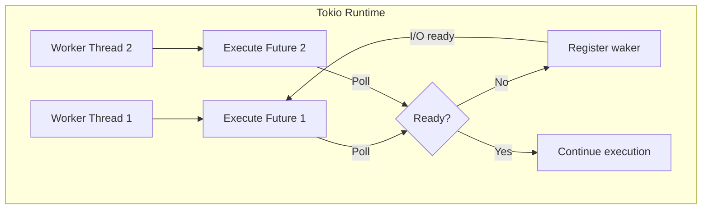

Rust async uses a **poll-based** model. Futures are lazy — they only execute when polled. The runtime (tokio, async-std) polls futures on worker threads. When a future returns `Poll::Pending`, it registers a waker to be notified when ready.

### Rust Select and Join

```rust
use tokio::time::{sleep, Duration};

// select! — race multiple futures
tokio::select! {
    result = fetch_from_primary() => {
        println!("Primary: {}", result);
    }
    result = fetch_from_fallback() => {
        println!("Fallback: {}", result);
    }
    _ = sleep(Duration::from_secs(5)) => {
        println!("Timeout!");
    }
}

// join! — wait for all
let (a, b, c) = tokio::join!(
    fetch_a(),
    fetch_b(),
    fetch_c()
);

// JoinSet — dynamic number of tasks
let mut set = tokio::task::JoinSet::new();
for url in urls {
    set.spawn(async move { fetch_url(&url).await });
}
while let Some(res) = set.join_next().await {
    println!("Completed: {:?}", res);
}
```

## Cross-Language Comparison

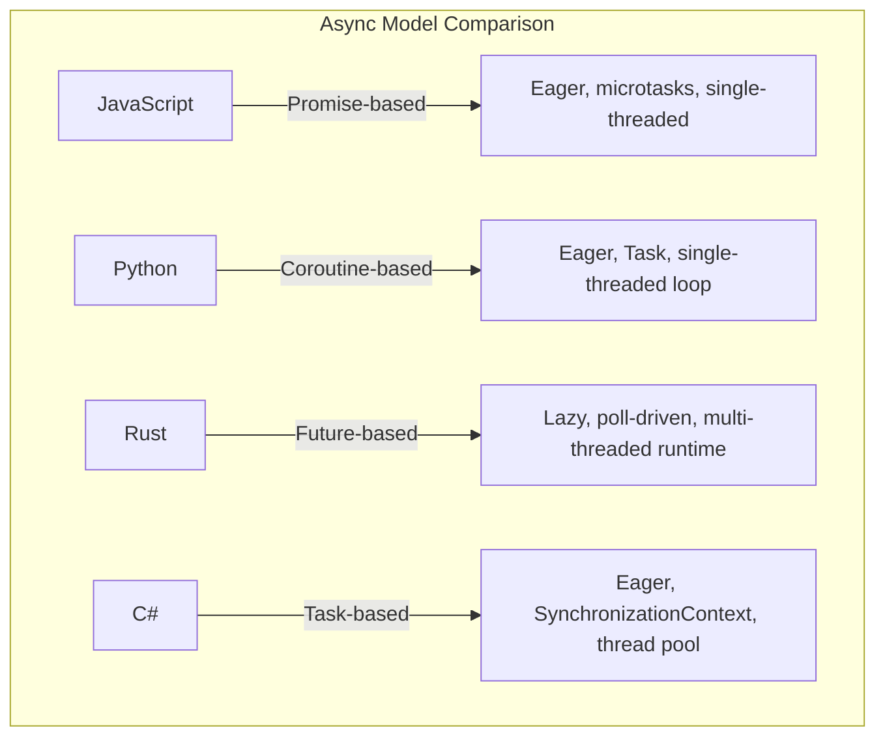

| Feature | JavaScript | Python | Rust | C# |
|---------|-----------|--------|------|-----|
| Model | Promise | Coroutine | Future | Task |
| Eager/Lazy | Eager | Eager | Lazy | Eager |
| Runtime | V8/libuv | asyncio | Tokio/async-std | .NET ThreadPool |
| Concurrency | Single-thread | Single-thread | Multi-thread | Thread pool |
| Cancellation | AbortController | Task.cancel() | Drop | CancellationToken |
| Structured | No (Promise.all) | TaskGroup (3.11+) | JoinSet | Task.WhenAll |

## Async vs Threads

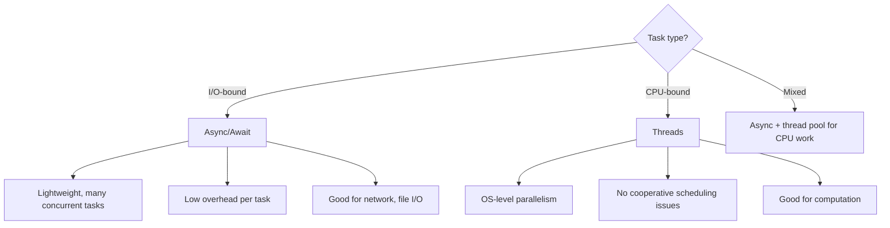

### When to Use What

| Scenario | Use |
|----------|-----|
| Web server handling 10K connections | Async |
| Parallel matrix multiplication | Threads |
| API gateway proxying requests | Async |
| Image processing pipeline | Threads |
| Database connection pool | Async + pool |
| Real-time game engine | Threads + async I/O |

## Common Pitfalls

### Blocking the Event Loop

```python
# BAD: Blocks the event loop
async def bad():
    time.sleep(1)  # Blocks entire event loop!
    data = requests.get(url)  # Blocking HTTP call!

# GOOD: Use async alternatives
async def good():
    await asyncio.sleep(1)  # Yields to event loop
    async with aiohttp.ClientSession() as session:
        data = await session.get(url)  # Non-blocking
```

### Async All the Way

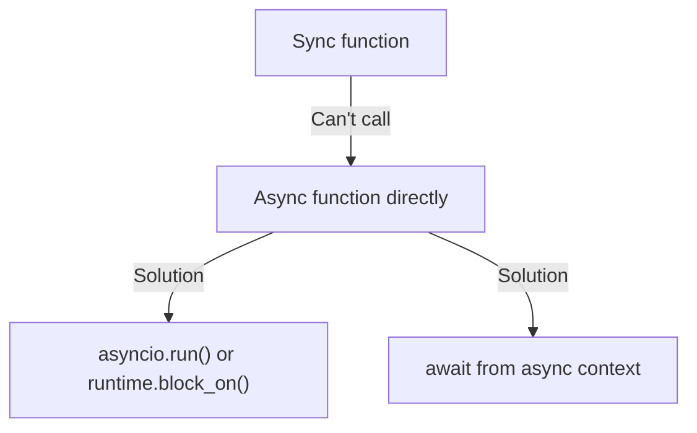

Once you go async, it "colours" your entire call stack. Sync code can't directly call async code without a runtime.

### Unhandled Rejection (JavaScript)

```javascript
// BAD: Unhandled promise rejection
async function risky() {
    const data = await fetch(url);  // If this fails, unhandled rejection
    return data.json();
}

// GOOD: Always handle errors
async function safe() {
    try {
        const data = await fetch(url);
        return data.json();
    } catch (err) {
        logger.error('Fetch failed', err);
        return null;
    }
}
```

## Interview Questions

1. **Q: What is async/await and how does it differ from threading?**
   A: Async/await uses cooperative multitasking on a single thread. Tasks voluntarily yield (await) at I/O points, allowing other tasks to run. Threading uses preemptive multitasking where the OS switches between threads. Async is lighter (KB per task vs MB per thread) but requires non-blocking I/O.

2. **Q: What is an event loop?**
   A: An event loop is the core of async runtimes. It maintains a queue of ready tasks, runs them until they await, then polls for I/O completion. When I/O is ready, it resumes the corresponding tasks. Single-threaded event loops avoid synchronization overhead.

3. **Q: How does Rust's async differ from JavaScript's?**
   A: Rust async is poll-based — futures are lazy and only execute when polled by the runtime. JavaScript async is promise-based — promises start executing immediately. Rust gives more control (choose your runtime) but is more complex. JavaScript's runtime (V8/libuv) is built-in.

4. **Q: Why can't you call blocking functions in an async context?**
   A: Blocking functions (like synchronous I/O) prevent the event loop from running, stalling ALL concurrent tasks. The event loop is single-threaded, so a blocked thread means no other task can make progress. Use async alternatives or offload blocking work to a thread pool.

5. **Q: What is structured concurrency?**
   A: Structured concurrency ensures that async tasks have well-defined lifetimes tied to their parent scope. When the parent scope ends, all child tasks are cancelled or joined. This prevents resource leaks and makes reasoning about async code easier. Python's TaskGroups and Rust's tokio::JoinSet implement this.

6. **Q: Microtasks vs macrotasks in JavaScript?**
   A: Microtasks (Promise callbacks, queueMicrotask) run after each synchronous task and before the next macrotask. Macrotasks (setTimeout, setInterval, I/O) run one at a time between microtask batches. Promise.then runs as a microtask, so it executes before setTimeout(fn, 0).

7. **Q: How does Python's GIL affect async code?**
   A: The GIL limits CPU parallelism in threads but doesn't affect async I/O. Async code runs on a single thread anyway, so the GIL is irrelevant. For CPU-bound async work, use `run_in_executor` to offload to a thread/process pool.

## Common Mistakes

- Blocking the event loop with synchronous I/O.
- Not handling cancellation (tasks cancelled on scope exit).
- Creating too many concurrent tasks (memory exhaustion).
- Mixing async and sync code without proper bridging.
- Assuming async is always faster — for CPU-bound work, threads are better.

## Summary

Async/await provides a way to write non-blocking code that looks synchronous. The event loop manages task scheduling, suspending tasks at await points and resuming them when I/O is ready. It's ideal for I/O-bound workloads with many concurrent connections. Key differences from threading: cooperative vs preemptive, single-threaded vs multi-threaded, lightweight tasks vs heavyweight threads.

## References

- [MDN: Async/Await](https://developer.mozilla.org/en-US/docs/Learn/JavaScript/Asynchronous/Promises)
- [Python asyncio Documentation](https://docs.python.org/3/library/asyncio.html)
- [Rust Async Book](https://rust-lang.github.io/async-book/)
- [Tokio Tutorial](https://tokio.rs/tokio/tutorial)
- [Structured Concurrency (Martin Sústrik)](https://250bpm.com/blog:71/)
- [Node.js Event Loop](https://nodejs.org/en/learn/asynchronous-work/event-loop-timers-and-nexttick)

## Cross-References

- [Futures](./futures.md) — The underlying abstraction
- [Coroutines](./coroutines.md) — The implementation mechanism
- [Thread Pools](./thread-pools.md) — Alternative for CPU-bound work
- [Go Channels](./go-channels.md) — Go's concurrency model
- [Concurrency Overview](./overview.md) — Fundamental concepts
