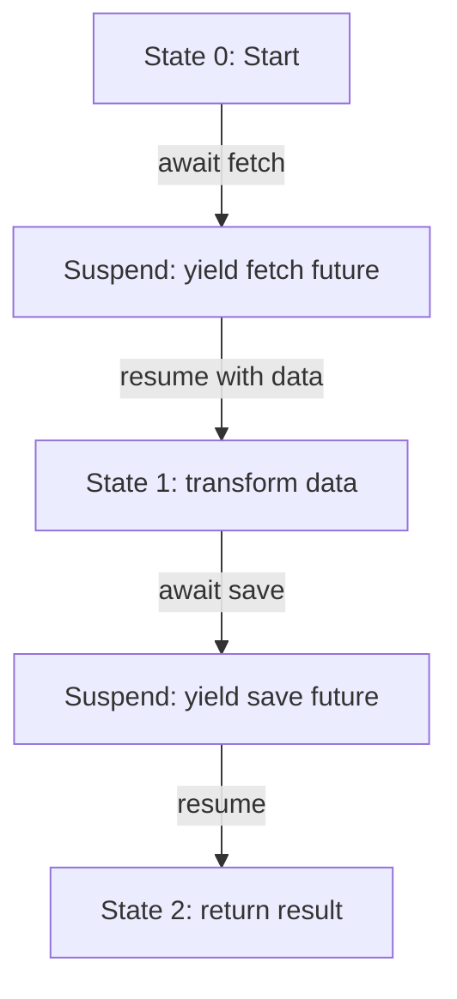
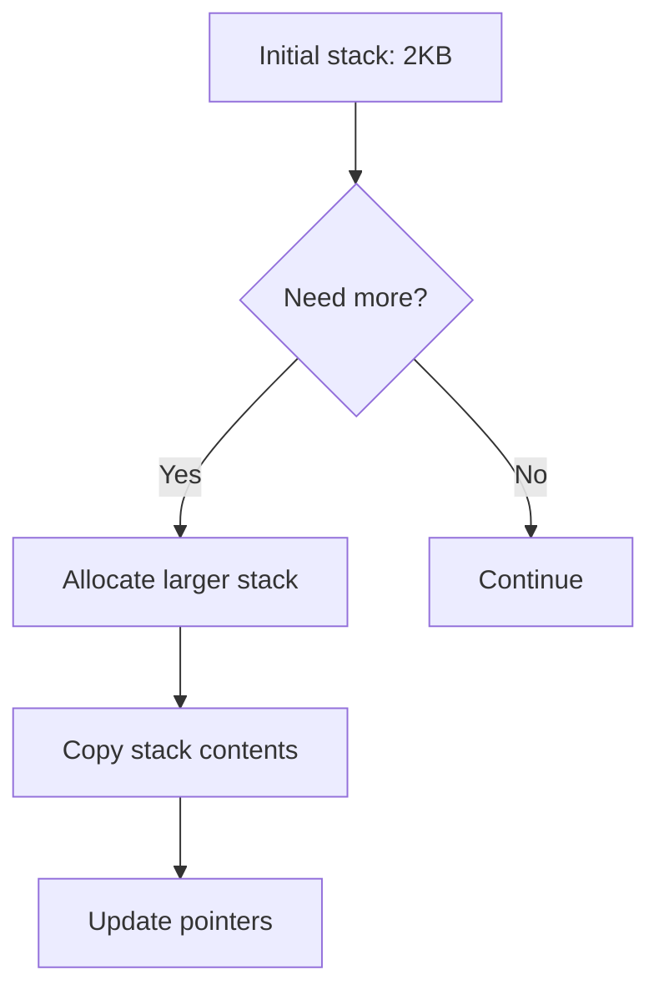
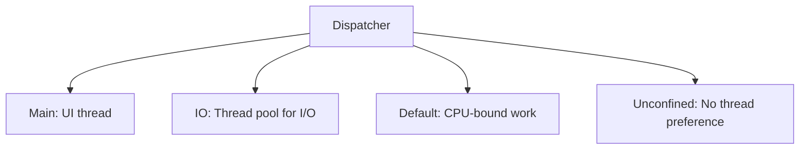
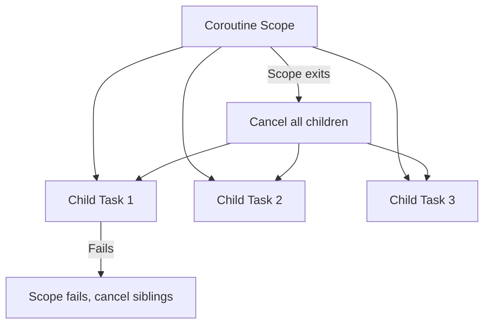

# Coroutines

## Overview

Coroutines are functions that can suspend execution and resume later, maintaining their state across suspensions. They are the underlying mechanism that powers async/await in languages like Python, Kotlin, Rust, and C++. Unlike threads (preemptive, OS-managed), coroutines are cooperative — they voluntarily yield control at specific points. This makes them extremely lightweight (KB vs MB per coroutine).

## Types of Coroutines

```mermaid
graph TD
    COROUTINES[Coroutines] --> STACKLESS[Stackless (Symmetric)]
    COROUTINES --> STACKFUL[Stackful (Asymmetric)]

    STACKLESS --> S1[Python generators, Rust async, C++20]
    STACKLESS --> S2[State machine compiled from function]
    STACKLESS --> S3[Cannot suspend from nested call stack]

    STACKFUL --> F1[Go goroutines, Lua, Kotlin]
    STACKFUL --> F2[Each coroutine has own stack]
    STACKFUL --> F3[Can suspend from nested calls]
```

### Stackless vs Stackful


| Feature | Stackless | Stackful |
|---------|-----------|----------|
| Memory | ~100 bytes | ~2-8 KB |
| Suspend depth | Only at await points | Anywhere in call stack |
| Implementation | State machine | Separate stack |
| Languages | Python, Rust, C++20 | Go, Lua, Kotlin |
| Overhead | Very low | Low |

## How Coroutines Work

### Stackless: State Machine Compilation

```python
# Source code
async def fetch_and_process(url):
    data = await fetch(url)        # Suspend point 1
    result = transform(data)       # CPU work
    await save(result)             # Suspend point 2
    return result
```

The compiler transforms this into:

```python
# Compiled state machine (conceptual)
class FetchAndProcessStateMachine:
    state = 0
    data = None
    result = None

    def step(self, input=None):
        if self.state == 0:
            self.data = yield fetch(url)     # Yield future, suspend
            self.state = 1
        if self.state == 1:
            self.result = transform(self.data)
            yield save(self.result)           # Yield future, suspend
            self.state = 2
        if self.state == 2:
            return self.result
```



### Stackful: Separate Stack

```mermaid
graph TD
    subgraph Main[Main Goroutine]
        M1[Call foo()]
        M1 --> M2[Call bar()]
        M2 --> M3[Runtime.Goexit()]
    end

    subgraph Goroutine[New Goroutine]
        G1[Own stack: 2KB]
        G1 --> G2[Call foo()]
        G2 --> G3[Call bar()]
        G3 --> G4[Can suspend here!]
        G4 --> G5[Resume later]
    end
```

Go goroutines have their own stack that grows dynamically. The runtime can suspend and resume goroutines at any point (even in the middle of a function call).

## Python Coroutines

### Generators (Basic Coroutines)

```python
def countdown(n):
    """Generator-based coroutine"""
    while n > 0:
        yield n        # Suspend, produce value
        n -= 1

# Usage
gen = countdown(5)
print(next(gen))  # 5 (runs until first yield)
print(next(gen))  # 4 (resumes from yield)
```

### async/await (Native Coroutines)

```python
import asyncio

async def producer(queue):
    for i in range(10):
        await asyncio.sleep(0.1)  # Suspend: let other coroutines run
        await queue.put(i)         # Suspend: if queue full
    await queue.put(None)          # Poison pill

async def consumer(queue):
    while True:
        item = await queue.get()   # Suspend: if queue empty
        if item is None:
            break
        process(item)

async def main():
    queue = asyncio.Queue(maxsize=5)
    await asyncio.gather(
        producer(queue),
        consumer(queue)
    )

asyncio.run(main())
```

### Python Awaitable Protocol

```python
class MyAwaitable:
    def __await__(self):
        # Must return an iterator
        yield  # Suspend
        return "result"  # Value returned by await

async def use_my_awaitable():
    result = await MyAwaitable()  # "result"
```

## Go Goroutines

```go
func main() {
    ch := make(chan string)

    // Goroutine: lightweight coroutine
    go func() {
        time.Sleep(100 * time.Millisecond)
        ch <- "hello from goroutine"
    }()

    // Main goroutine continues
    fmt.Println("waiting...")
    msg := <-ch  // Block until goroutine sends
    fmt.Println(msg)
}
```

### Goroutine Stack Management



Go goroutines start with a small stack (2KB) that grows dynamically. The runtime manages stack allocation transparently.

## Kotlin Coroutines

```kotlin
suspend fun fetchUser(id: String): User {
    return withContext(Dispatchers.IO) {  // Switch to IO thread
        api.getUser(id)                    // Suspend on network call
    }
}

suspend fun processUser(id: String) {
    val user = fetchUser(id)                // Suspends
    val posts = fetchPosts(user.id)         // Suspends
    updateUI(user, posts)                   // Resumes on main thread
}

// Launch coroutine
lifecycleScope.launch {
    processUser("123")  // Runs in coroutine scope
}
```

### Kotlin Coroutine Dispatchers



## C++20 Coroutines

```cpp
#include <coroutine>
#include <optional>

// A simple coroutine task
template<typename T>
struct Task {
    struct promise_type {
        T value;
        Task get_return_object() {
            return Task{std::coroutine_handle<promise_type>::from_promise(*this)};
        }
        std::suspend_always initial_suspend() { return {}; }
        std::suspend_always final_suspend() noexcept { return {}; }
        void return_value(T v) { value = v; }
        void unhandled_exception() { std::terminate(); }
    };

    std::coroutine_handle<promise_type> handle;

    T get() {
        handle.resume();
        return handle.promise().value;
    }
};

Task<int> compute() {
    co_await std::suspend_always{};  // Suspend
    co_return 42;                     // Return value
}
```

## Structured Concurrency



Structured concurrency ensures child coroutines are tied to a parent scope:
- When the scope exits, all children are cancelled or joined.
- If a child fails, siblings are cancelled and the scope fails.
- No leaked coroutines.

```kotlin
coroutineScope {
    val user = async { fetchUser(id) }      // Child 1
    val posts = async { fetchPosts(id) }    // Child 2
    // Both must complete before scope exits
    render(user.await(), posts.await())
}
```

## Interview Questions

1. **Q: What is a coroutine and how does it differ from a thread?**
   A: A coroutine is a function that can suspend and resume, maintaining state. Unlike threads (preemptive, OS-scheduled), coroutines are cooperative (voluntarily yield). Coroutines are much lighter (~100 bytes vs ~1MB for threads). Thousands of coroutines can run on a single thread.

2. **Q: What's the difference between stackless and stackful coroutines?**
   A: Stackless coroutines (Python, Rust) compile to state machines and can only suspend at explicit await points. Stackful coroutines (Go) have their own stack and can suspend anywhere in the call chain. Stackless is more memory-efficient; stackful is more flexible.

3. **Q: How does Go implement goroutines so efficiently?**
   A: Go goroutines start with a 2KB stack (vs 1MB for OS threads) that grows dynamically. The Go runtime multiplexes thousands of goroutines onto a small number of OS threads using M:N scheduling. The scheduler can preempt goroutines for fairness.

4. **Q: What is structured concurrency?**
   A: Child coroutines are bound to a parent scope. The scope waits for all children to complete before exiting. If a child fails, siblings are cancelled. This prevents leaked coroutines and makes async code as predictable as sync code.

5. **Q: How are async/await and coroutines related?**
   A: async/await is syntactic sugar over coroutines. An async function creates a coroutine (or returns a future). await suspends the coroutine at that point. The compiler transforms the function into a state machine that can be resumed when the awaited value is ready.

## Common Mistakes

- Assuming coroutines run in parallel — they're concurrent but may run on the same thread.
- Not handling cancellation — suspended coroutines may be cancelled; clean up resources.
- Forgetting structured concurrency — orphaned coroutines leak resources.
- Mixing coroutine and thread models — confusing async/await with thread pools.
- Stack overflow with recursive coroutines — even stackful coroutines have limits.

## Summary

Coroutines are functions that can suspend and resume, enabling concurrent code without threads. Stackless coroutines (Python, Rust) compile to state machines; stackful coroutines (Go) have their own stacks. They power async/await and are the foundation of modern concurrent programming. Key advantages: lightweight (KB vs MB), no synchronization needed (cooperative scheduling), and composable.

## Cross-References

- [Async/Await](./async-await.md) — Built on coroutines
- [Futures](./futures.md) — The return type of async functions
- [Go Channels](./go-channels.md) — Communication between goroutines
- [Concurrency Overview](./overview.md) — Fundamental concepts
