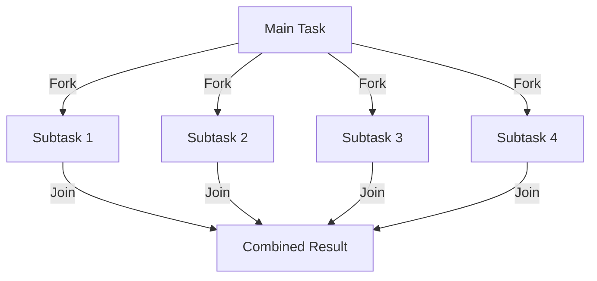
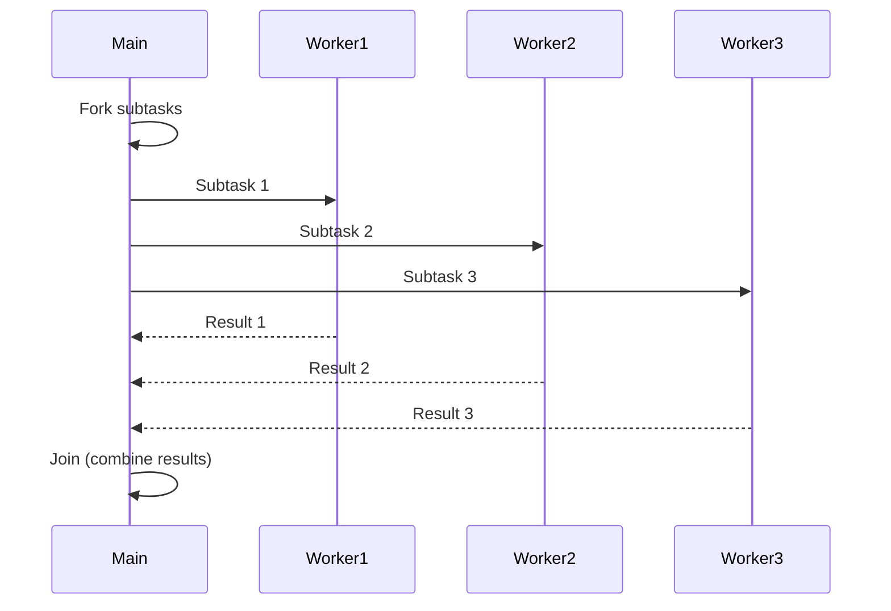
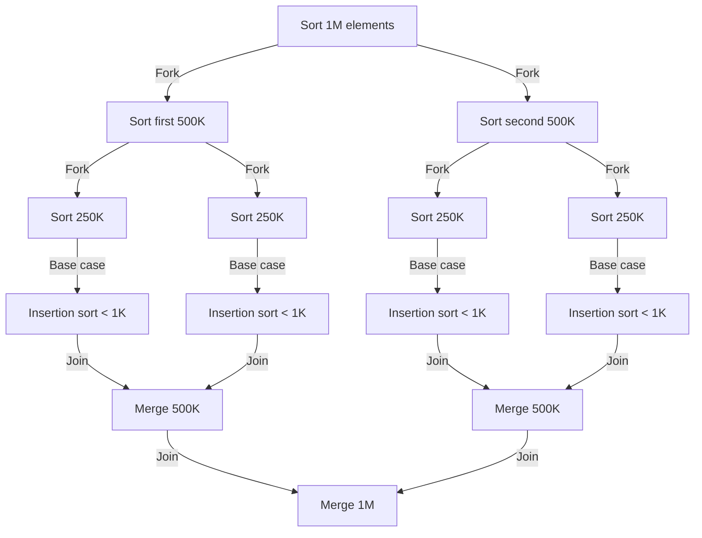
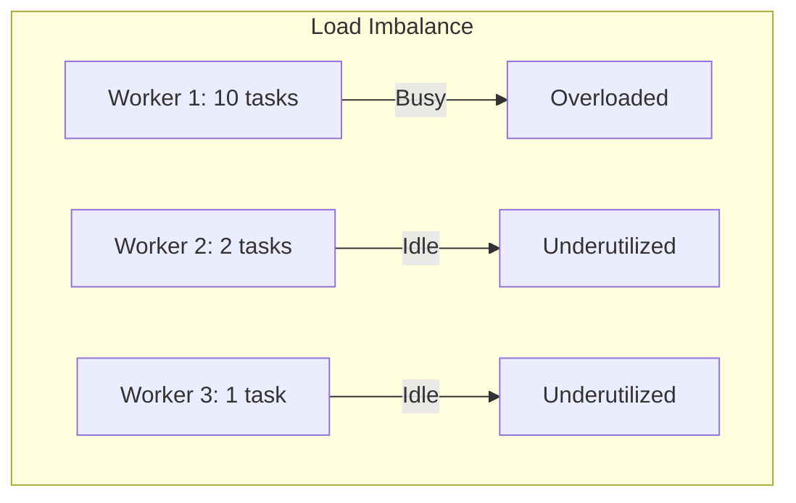
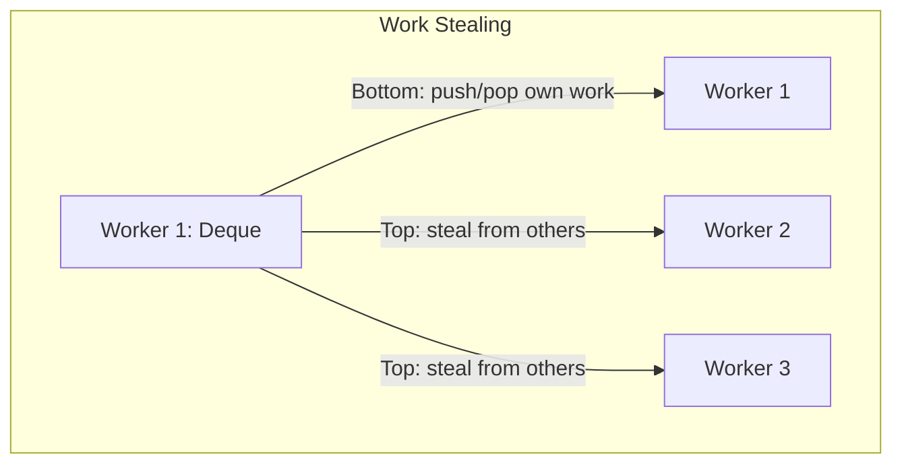
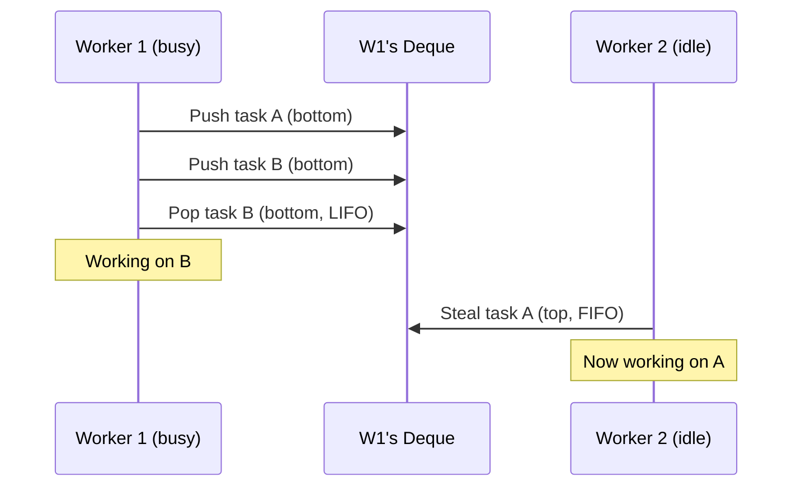
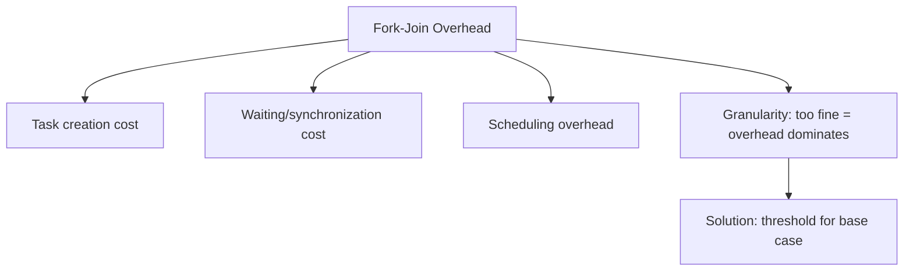

# Fork-Join Parallelism

## Overview

Fork-Join is a parallel programming pattern where a task is recursively split (forked) into smaller subtasks, executed in parallel, and then combined (joined) to produce the final result. It's the foundation of parallel computing, used in divide-and-conquer algorithms, and is the model behind Java's ForkJoinPool, C++'s `std::async`, and many parallel frameworks.

## How Fork-Join Works

### Basic Pattern





### Recursive Decomposition



## Work-Stealing Algorithm

### The Problem



### Work-Stealing Solution



Each worker has a **deque** (double-ended queue):
- **Push**: Add task to bottom (owner only).
- **Pop**: Remove from bottom (owner only) — LIFO for locality.
- **Steal**: Remove from top (other workers) — FIFO to minimize contention.



## Java ForkJoinPool

### Implementation

```java
import java.util.concurrent.*;

class ParallelSum extends RecursiveTask<Long> {
    private final long[] array;
    private final int start, end;
    private static final int THRESHOLD = 10_000;

    ParallelSum(long[] array, int start, int end) {
        this.array = array;
        this.start = start;
        this.end = end;
    }

    @Override
    protected Long compute() {
        if (end - start <= THRESHOLD) {
            // Base case: compute directly
            long sum = 0;
            for (int i = start; i < end; i++) sum += array[i];
            return sum;
        }

        int mid = (start + end) / 2;
        ParallelSum left = new ParallelSum(array, start, mid);
        ParallelSum right = new ParallelSum(array, mid, end);

        left.fork();           // Fork: submit left to pool
        long rightResult = right.compute();  // Compute right in current thread
        long leftResult = left.join();       // Join: wait for left result

        return leftResult + rightResult;
    }
}

// Usage
ForkJoinPool pool = new ForkJoinPool();
long[] data = new long[10_000_000];
Long result = pool.invoke(new ParallelSum(data, 0, data.length));
```

### ForkJoinPool vs ThreadPoolExecutor

| Feature | ForkJoinPool | ThreadPoolExecutor |
|---------|-------------|-------------------|
| Task model | Recursive decomposition | Independent tasks |
| Work stealing | Yes | No |
| Best for | Divide-and-conquer | Independent tasks |
| Thread count | Typically = CPU cores | Configurable |
| Queue | Per-thread deque | Shared queue |

## C++ std::async and std::future

```cpp
#include <future>
#include <vector>
#include <numeric>

long parallel_sum(const std::vector<int>& v, int start, int end) {
    if (end - start < 10000) {
        return std::accumulate(v.begin() + start, v.begin() + end, 0L);
    }

    int mid = (start + end) / 2;

    // Fork: launch async task for left half
    auto left_future = std::async(std::launch::parallel,
        &parallel_sum, std::cref(v), start, mid);

    // Compute right half in current thread
    long right = parallel_sum(v, mid, end);

    // Join: wait for left half
    long left = left_future.get();

    return left + right;
}
```

## Python multiprocessing

```python
from multiprocessing import Pool
import os

def parallel_map(func, data, num_workers=None):
    with Pool(num_workers or os.cpu_count()) as pool:
        return pool.map(func, data)

# Example: parallel sum
def chunk_sum(chunk):
    return sum(chunk)

def parallel_sum(data, num_chunks=4):
    chunk_size = len(data) // num_chunks
    chunks = [data[i:i+chunk_size] for i in range(0, len(data), chunk_size)]
    with Pool(num_chunks) as pool:
        return sum(pool.map(chunk_sum, chunks))
```

## Performance Analysis

### Amdahl's Law

```mermaid
graph TD
    P[Program] --> S[Sequential Part: (1-p)]
    P --> PAR[Parallel Part: p]

    SPEEDUP[Speedup = 1 / ((1-p) + p/N)]
    SPEEDUP --> LIMIT[Lim as N→∞: 1/(1-p)]
```

If 95% of a program is parallelizable (p=0.95):
- With 4 cores: speedup = 1/((1-0.95) + 0.95/4) = 3.48×
- With 16 cores: speedup = 1/((1-0.95) + 0.95/16) = 12.1×
- With ∞ cores: speedup = 1/(1-0.95) = 20× (limited by 5% sequential)

### Gustafson's Law

```mermaid
graph TD
    G[Gustafson: Scaled Speedup = N - (1-p)(N-1)]
    G --> IMPLIES[As problem size grows, parallel portion increases]
    IMPLIES --> BETTER[More realistic than Amdahl's for large problems]
```

### Overhead Considerations



## Common Fork-Join Applications

| Application | Fork | Join |
|-------------|------|------|
| Merge Sort | Split array | Merge sorted halves |
| Quick Sort | Partition array | Concatenate results |
| Matrix Multiply | Split into quadrants | Combine quadrants |
| MapReduce | Map phase | Reduce phase |
| Tree Traversal | Visit children | Aggregate results |
| Parallel Search | Search partitions | Find best/first match |

## Interview Questions

1. **Q: What is the fork-join pattern and when is it useful?**
   A: Fork-join recursively splits a task into parallel subtasks (fork) and combines their results (join). It's useful for divide-and-conquer algorithms (sorting, searching, matrix operations) where tasks can be independently computed and combined.

2. **Q: Explain work-stealing in fork-join frameworks.**
   A: Each worker thread has a deque of tasks. Workers push/pop from their own deque's bottom (LIFO for cache locality). When idle, workers steal from other workers' deque tops (FIFO to minimize contention). This naturally balances load without centralized coordination.

3. **Q: What is the granularity problem in fork-join?**
   A: If tasks are too fine-grained, the overhead of forking, scheduling, and joining exceeds the computation time. Solution: use a threshold — when the task size is below the threshold, compute sequentially instead of forking further.

4. **Q: How does Amdahl's Law limit parallel speedup?**
   A: Speedup = 1/((1-p) + p/N) where p is the parallelizable fraction and N is the number of processors. As N→∞, speedup is bounded by 1/(1-p). If 5% is sequential, max speedup is 20× regardless of cores.

5. **Q: What's the difference between ForkJoinPool and a regular thread pool?**
   A: ForkJoinPool uses work-stealing with per-thread deques, optimized for recursive divide-and-conquer tasks. Regular thread pools use a shared queue. ForkJoinPool is better for tasks that spawn subtasks; regular pools are better for independent tasks.

## Common Mistakes

- Not setting a base case threshold — infinite recursion, thread exhaustion.
- Using fork-join for I/O-bound tasks — threads block on I/O, wasting pool capacity.
- Creating too many tasks — task creation overhead dominates.
- Not considering data locality — work-stealing helps, but cache-friendly partitioning matters.
- Forgetting to join — orphaned tasks waste resources.

## Summary

Fork-join parallelism recursively decomposes tasks into parallel subtasks and combines results. Work-stealing balances load across workers using per-thread deques. Java's ForkJoinPool, C++'s std::async, and Python's multiprocessing all implement this pattern. Key considerations: granularity threshold, Amdahl's Law limits, and overhead management.

## Cross-References

- [Thread Pools](./thread-pools.md) — Managed thread reuse
- [Async/Await](./async-await.md) — Asynchronous alternative
- [Lock-Free](./lock-free.md) — Lock-free task queues
- [Concurrency Overview](./overview.md) — Fundamental concepts
- [ML Training](../ml/deep-learning/backpropagation.md)
- [Cloud Lambda](../cloud/aws/lambda.md)

