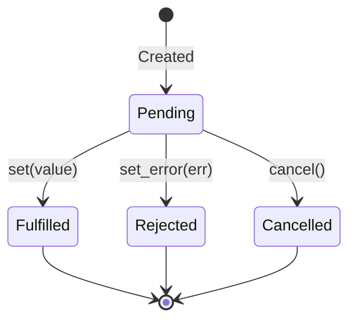
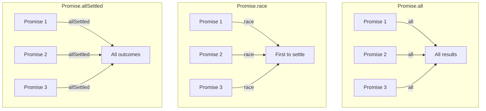
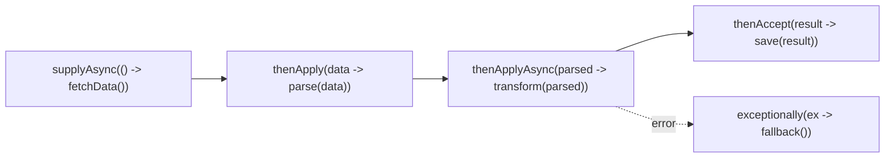
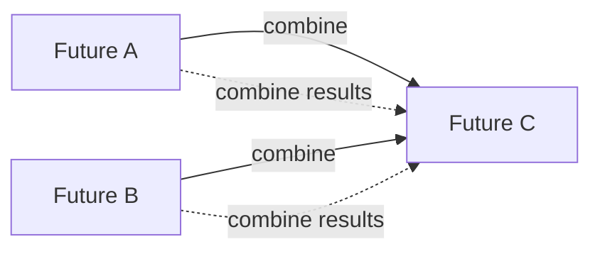
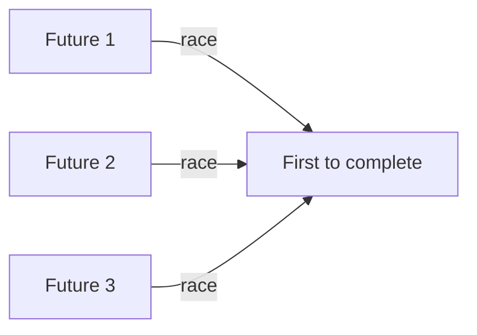
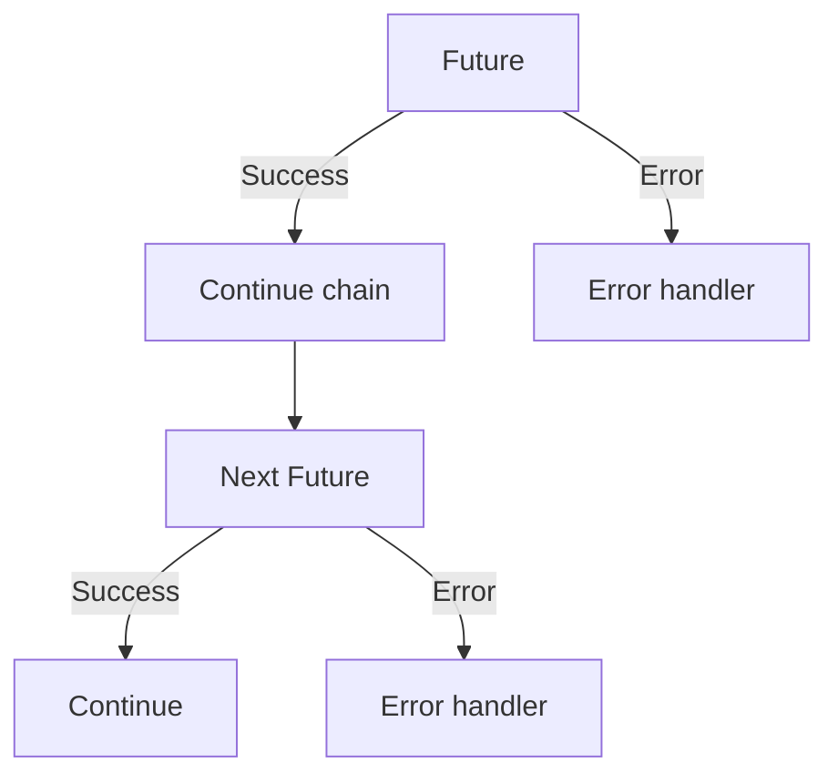
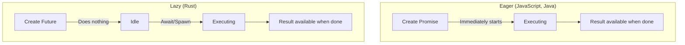

# Futures and Promises

## Overview

A Future (or Promise) represents a value that will be available at some point in the future. It's a handle to an asynchronous computation that may not have completed yet. Futures are the foundation of async/await and are used extensively in concurrent programming to represent pending results, compose asynchronous operations, and handle errors across async boundaries.

## Core Concepts

### Future vs Promise

```mermaid
graph TD
    FUTURE[Future: Read-only handle to pending result] --> GET[get() / .await — blocks until done]
    FUTURE --> DONE[isDone() — check without blocking]
    FUTURE --> CANCEL[cancel() — attempt to cancel]

    PROMISE[Promise: Write-end that sets the result] --> SET[set(value) — fulfill the promise]
    PROMISE --> SET_ERR[set_error(exception) — reject]
```

- **Future**: The consumer side. You can check if it's done, wait for the result, or cancel it.
- **Promise**: The producer side. You set the result or an error.

In some languages (Java, C++), they're combined. In others (JavaScript), a Promise is the combined object.


## State Machine



A future can be in one of four states:
- **Pending**: Computation not yet complete.
- **Fulfilled**: Computation completed successfully with a value.
- **Rejected**: Computation failed with an error.
- **Cancelled**: Computation was cancelled before completion.

## JavaScript Promises

### Creation and Consumption

```javascript
// Creating a Promise
const future = new Promise((resolve, reject) => {
    // Async operation
    setTimeout(() => {
        if (success) {
            resolve("result");     // Fulfill
        } else {
            reject(new Error("fail"));  // Reject
        }
    }, 1000);
});

// Consuming a Promise
future
    .then(result => console.log(result))    // Handle fulfillment
    .catch(error => console.error(error))   // Handle rejection
    .finally(() => console.log("done"));    // Always runs
```

### Composition

```javascript
// Sequential: chain dependent operations
fetchUser(id)
    .then(user => fetchPosts(user.id))
    .then(posts => renderPosts(posts))
    .catch(handleError);

// Parallel: wait for all
Promise.all([fetchUsers(), fetchPosts(), fetchComments()])
    .then(([users, posts, comments]) => render(users, posts, comments));

// Race: first to complete wins
Promise.race([fetchFromCDN1(), fetchFromCDN2()])
    .then(fastestResult => use(fastestResult));

// AllSettled: wait for all, don't short-circuit on error
Promise.allSettled([p1, p2, p3])
    .then(results => {
        results.forEach(r => {
            if (r.status === 'fulfilled') handleSuccess(r.value);
            else handleError(r.reason);
        });
    });

// Any: first to succeed (ignores rejections)
Promise.any([try1(), try2(), try3()])
    .then(firstSuccess => use(firstSuccess))
    .catch(err => allFailed(err));
```

### Promise Composition Patterns Visualized



### Async/Await (Syntactic Sugar)

```javascript
// Equivalent to .then() chains
async function getUserPosts(userId) {
    try {
        const user = await fetchUser(userId);
        const posts = await fetchPosts(user.id);
        return posts;
    } catch (error) {
        handleError(error);
    }
}

// Concurrent with async/await
async function getAllData() {
    const [users, posts] = await Promise.all([
        fetchUsers(),
        fetchPosts(),
    ]);
    return { users, posts };
}
```

### Custom Promises

```javascript
// Promisify a callback-based function
function promisify(fn) {
    return (...args) => new Promise((resolve, reject) => {
        fn(...args, (err, result) => {
            if (err) reject(err);
            else resolve(result);
        });
    });
}

// Usage
const readFile = promisify(fs.readFile);
const data = await readFile('file.txt', 'utf8');
```

## Java CompletableFuture

```java
// Async computation
CompletableFuture<String> future = CompletableFuture.supplyAsync(() -> {
    return expensiveComputation();
});

// Chaining
CompletableFuture<Integer> result = future
    .thenApply(s -> s.length())           // Transform
    .thenApplyAsync(len -> len * 2)       // Transform async
    .exceptionally(ex -> -1);             // Handle error

// Combining two futures
CompletableFuture<String> combined = future1.thenCombine(future2,
    (r1, r2) -> r1 + r2);

// Wait for all
CompletableFuture<Void> all = CompletableFuture.allOf(f1, f2, f3);
all.join();  // Block until all complete

// Wait for any
CompletableFuture<Object> any = CompletableFuture.anyOf(f1, f2, f3);
```

### Java CompletableFuture Chaining



### Java Future vs CompletableFuture

| Feature | Future | CompletableFuture |
|---------|--------|-------------------|
| Blocking | get() blocks | thenApply() non-blocking |
| Composition | Manual | Built-in (thenCompose, thenCombine) |
| Error handling | try/catch on get() | exceptionally(), handle() |
| Completion callback | No | thenAccept(), thenRun() |
| Manual completion | No | complete(), completeExceptionally() |

### Advanced Java Patterns

```java
// thenCompose: flatMap (dependent futures)
CompletableFuture<Posts> postsFuture = userFuture
    .thenCompose(user -> fetchPosts(user.getId()));

// handle: both success and error
CompletableFuture<String> handled = future.handle((result, ex) -> {
    if (ex != null) return "Error: " + ex.getMessage();
    return "Success: " + result;
});

// Timeout
CompletableFuture<String> withTimeout = future
    .orTimeout(5, TimeUnit.SECONDS)
    .exceptionally(ex -> "Timed out");

// Custom executor
CompletableFuture.supplyAsync(() -> work(), customExecutor);
```

## C++ std::future and std::promise

```cpp
#include <future>
#include <iostream>

// Create promise/future pair
std::promise<int> promise;
std::future<int> future = promise.get_future();

// Producer thread
std::thread producer([&promise] {
    // Do work...
    promise.set_value(42);  // Fulfill promise
});

// Consumer
int result = future.get();  // Blocks until promise is fulfilled
producer.join();

// std::async (creates future automatically)
std::future<int> async_result = std::async(std::launch::async, [] {
    return expensive_computation();
});
int value = async_result.get();  // Blocks until done
```

### C++ Shared Future

```cpp
// shared_future: multiple consumers can wait
std::promise<int> promise;
std::shared_future<int> shared = promise.get_future().share();

// Multiple threads can wait on the same shared_future
std::thread t1([shared] { std::cout << shared.get(); });
std::thread t2([shared] { std::cout << shared.get(); });

promise.set_value(42);
t1.join();
t2.join();
```

## Rust Futures

```rust
use std::future::Future;
use tokio;

// A future in Rust is a trait
// trait Future {
//     type Output;
//     fn poll(self: Pin<&mut Self>, cx: &mut Context<'_>) -> Poll<Self::Output>;
// }

// Creating futures with async/await
async fn fetch_data() -> String {
    // .await suspends until the inner future completes
    let response = reqwest::get("https://api.example.com").await.unwrap();
    response.text().await.unwrap()
}

// Combining futures
async fn process() {
    // Sequential
    let data = fetch_data().await;
    let processed = transform(data).await;

    // Concurrent
    let (a, b, c) = tokio::join!(
        fetch_a(),
        fetch_b(),
        fetch_c()
    );
}
```

### Rust Future Trait Deep Dive

```rust
use std::future::Future;
use std::pin::Pin;
use std::task::{Context, Poll};
use std::time::{Duration, Instant};

// Manual future implementation
struct Delay {
    when: Instant,
}

impl Future for Delay {
    type Output = String;

    fn poll(self: Pin<&mut Self>, cx: &mut Context<'_>) -> Poll<Self::Output> {
        if Instant::now() >= self.when {
            Poll::Ready("done".to_string())
        } else {
            // Register waker to be notified when ready
            cx.waker().wake_by_ref();
            Poll::Pending
        }
    }
}

// Usage
#[tokio::main]
async fn main() {
    let delay = Delay { when: Instant::now() + Duration::from_secs(1) };
    let result = delay.await;
    println!("{}", result);
}
```

## Go Promises (via Goroutines + Channels)

```go
// Go doesn't have native promises, but channels serve the same purpose
func fetchData(url string) <-chan Result {
    ch := make(chan Result, 1)
    go func() {
        defer close(ch)
        resp, err := http.Get(url)
        ch <- Result{Data: resp, Err: err}
    }()
    return ch
}

// Equivalent to Promise.all
func fetchAll(urls []string) []Result {
    chans := make([]<-chan Result, len(urls))
    for i, url := range urls {
        chans[i] = fetchData(url)
    }
    results := make([]Result, len(urls))
    for i, ch := range chans {
        results[i] = <-ch  // Wait for each
    }
    return results
}

// Equivalent to Promise.race
func fetchRace(urls []string) Result {
    ch := make(chan Result, len(urls))
    for _, url := range urls {
        go func(u string) {
            ch <- <-fetchData(u)
        }(url)
    }
    return <-ch  // First to complete
}
```

## Future Composition Patterns

### Then/Map (Transform)


```javascript
// JavaScript
fetchUser(id).then(user => user.name);

// Java
future.thenApply(s -> s.length());

// Rust
async { fetch_user(id).await.name }
```

### FlatMap/Chain (Dependent)


```javascript
// JavaScript
fetchUser(id).then(user => fetchPosts(user.id));

// Java
future.thenCompose(user -> fetchPosts(user.getId()));
```

### Zip/Combine (Independent)



```javascript
// JavaScript
Promise.all([fetchA(), fetchB()]);

// Java
f1.thenCombine(f2, (a, b) -> a + b);
```

### Race (First Success)



## Error Handling

### Monadic Error Handling



Futures propagate errors through the chain, similar to Result/Option types:

```javascript
fetchUser(id)                        // May fail
    .then(user => fetchPosts(user.id)) // Skipped if fetchUser fails
    .then(posts => render(posts))      // Skipped if fetchPosts fails
    .catch(err => showError(err));     // Catches any error in chain
```

### Error Handling Patterns Across Languages

```javascript
// JavaScript: .catch() or try/catch with await
fetchUser(id)
    .then(user => fetchPosts(user.id))
    .catch(err => handleError(err));

// Or with async/await
try {
    const user = await fetchUser(id);
    const posts = await fetchPosts(user.id);
} catch (err) {
    handleError(err);
}
```

```java
// Java: exceptionally() or handle()
future
    .thenCompose(user -> fetchPosts(user.getId()))
    .exceptionally(ex -> Collections.emptyList());

// Or handle both cases
future.handle((result, ex) -> {
    if (ex != null) return fallback();
    return transform(result);
});
```

```rust
// Rust: ? operator propagates errors
async fn get_posts(user_id: i64) -> Result<Vec<Post>, Error> {
    let user = fetch_user(user_id).await?;  // ? propagates error
    let posts = fetch_posts(user.id).await?;
    Ok(posts)
}
```

## Eager vs Lazy Evaluation



| Property | Eager (JS, Java) | Lazy (Rust) |
|----------|------------------|-------------|
| Start | Immediately | On poll/await |
| Resource use | Always | On demand |
| Cancellation | Hard (already running) | Easy (just don't poll) |
| Composition | Natural | Needs explicit spawn |

## Interview Questions

1. **Q: What is a Future/Promise?**
   A: A Future is a placeholder for a value that will be available later. It represents an ongoing computation. A Promise is the write-end that sets the result. Together, they decouple the producer (who sets the value) from the consumer (who waits for it).

2. **Q: What's the difference between Future, CompletableFuture, and Promise?**
   A: A basic Future is read-only and requires blocking to get the result. CompletableFuture (Java) adds non-blocking composition (thenApply, thenCombine). Promise (JavaScript) is both producer and consumer, with .then() for chaining. They all represent pending async results with different APIs.

3. **Q: How does error propagation work in futures?**
   A: Errors propagate through the chain like exceptions. In JS, a rejected promise skips .then() handlers until a .catch() is found. In Java, exceptionally() handles errors. In Rust, the ? operator propagates errors. This is monadic error handling.

4. **Q: What is the difference between Promise.all, Promise.race, and Promise.allSettled?**
   A: all() waits for all to fulfill, rejects if any rejects. race() returns the first to settle (fulfill or reject). allSettled() waits for all to settle and returns all results (both fulfilled and rejected). any() returns the first to fulfill, rejects only if all reject.

5. **Q: How do Rust futures differ from JavaScript promises?**
   A: Rust futures are lazy — they only execute when polled by a runtime (tokio). JavaScript promises are eager — they start executing immediately. Rust gives more control but requires explicit runtime. JS is simpler but less flexible.

6. **Q: What is the monadic nature of futures?**
   A: Futures form a monad with `then`/`flatMap` as the bind operation. This enables chaining of async operations while automatically propagating errors. The three monad laws hold: left identity, right identity, and associativity.

## Common Mistakes

- Forgetting to handle errors — unhandled promise rejections cause crashes (JS) or silent failures.
- Creating the "callback hell" with nested .then() — use async/await instead.
- Blocking on a future inside an async context — defeats the purpose.
- Not cancelling long-running futures — resource leaks.
- Assuming futures are always concurrent — sequential awaits run sequentially.

## Summary

Futures/Promises represent pending asynchronous computations. They enable non-blocking composition of async operations through chaining (then/thenApply), combining (all/race/combine), and error handling (catch/exceptionally). They're the foundation of async/await in all modern languages. For interviews, understand the state machine, composition patterns, and the difference between eager (JS promises) and lazy (Rust futures) evaluation.

## References

- [MDN: Promises](https://developer.mozilla.org/en-US/docs/Web/JavaScript/Reference/Global_Objects/Promise)
- [Java CompletableFuture](https://docs.oracle.com/en/java/javase/17/docs/api/java.base/java/util/concurrent/CompletableFuture.html)
- [C++ std::future](https://en.cppreference.com/w/cpp/thread/future)
- [Rust Future Trait](https://doc.rust-lang.org/std/future/trait.Future.html)
- [Promise/A+ Specification](https://promisesaplus.com/)
- [Go Concurrency Patterns](https://go.dev/blog/pipelines)

## Cross-References

- [Async/Await](./async-await.md) — Syntactic sugar over futures
- [Coroutines](./coroutines.md) — Implementation mechanism
- [Go Channels](./go-channels.md) — Alternative communication model
- [Concurrency Overview](./overview.md) — Fundamental concepts
