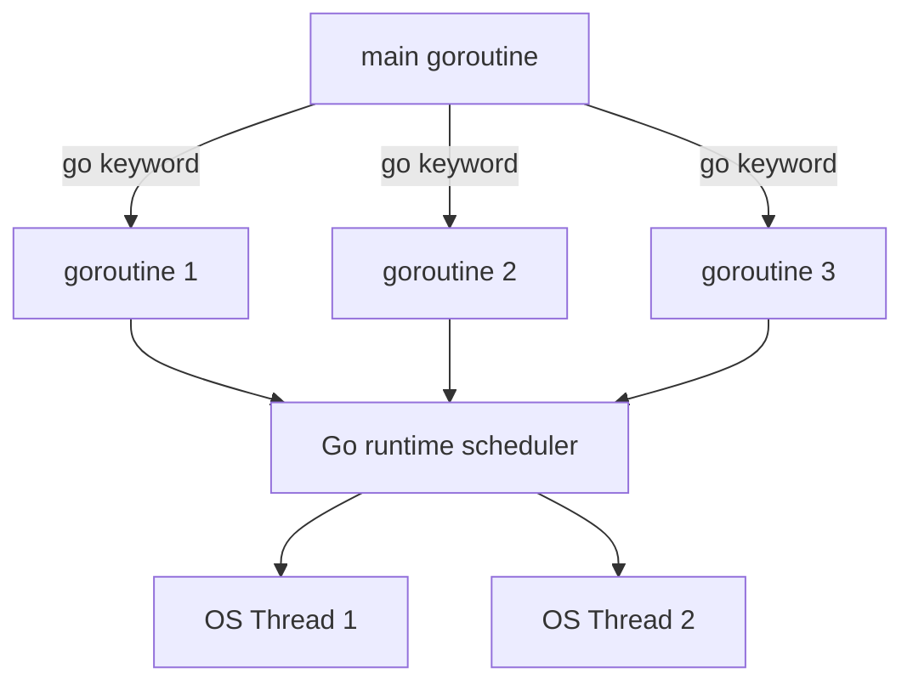
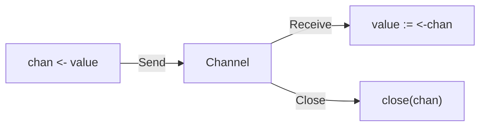
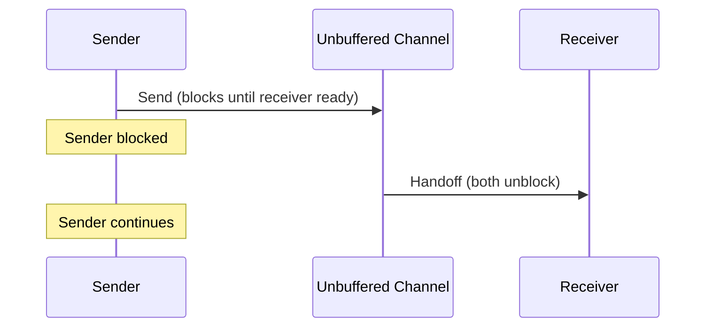
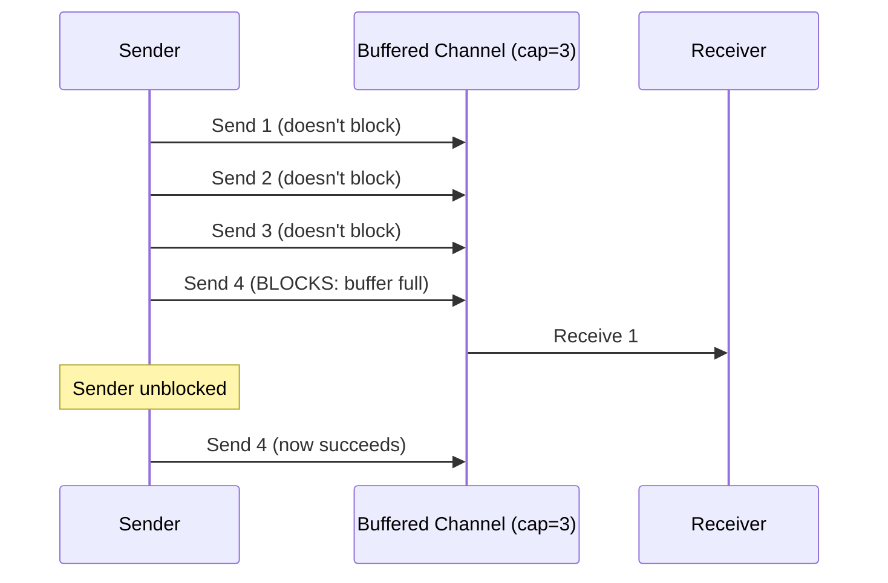
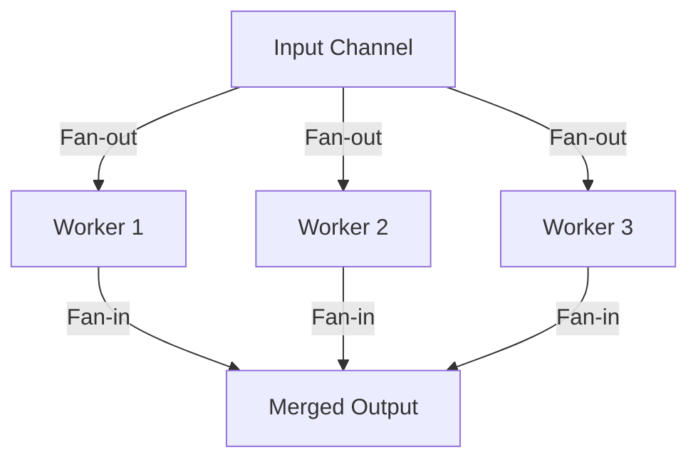
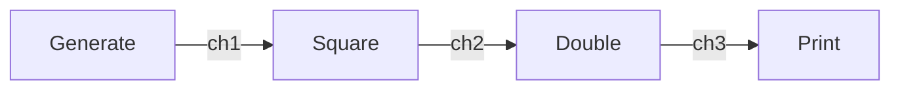
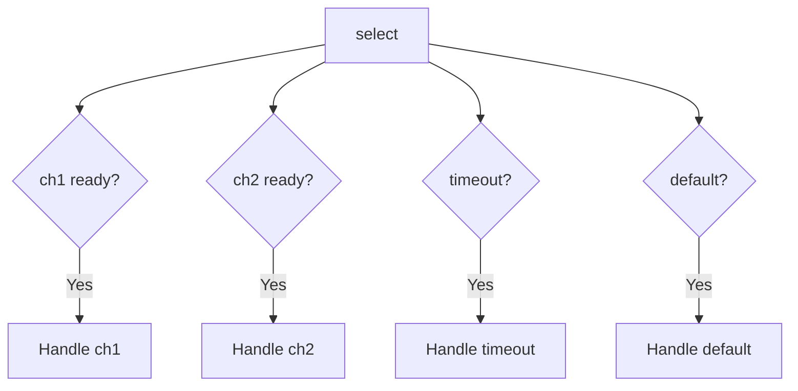
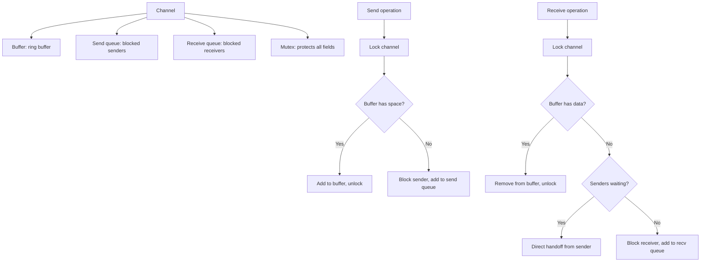
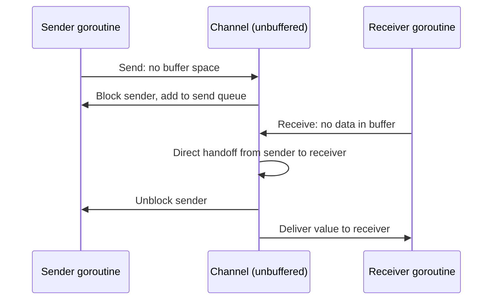

# Go Channels and Goroutines

## Overview

Go's concurrency model is based on goroutines (lightweight threads) and channels (typed conduits for communication). The philosophy is "Don't communicate by sharing memory; share memory by communicating." Channels provide a safe, structured way for goroutines to exchange data without explicit locks. This model is inspired by CSP (Communicating Sequential Processes).

## Goroutines

### What is a Goroutine?



A goroutine is a lightweight, cooperatively scheduled coroutine managed by the Go runtime. It starts with ~2KB of stack (grows dynamically) and is multiplexed onto a small number of OS threads.

```go
func main() {
    go func() {
        fmt.Println("Hello from goroutine")
    }()  // 'go' keyword launches a goroutine

    time.Sleep(time.Second)  // Wait for goroutine (bad practice, use channels)
}
```

### Goroutine vs Thread

| Feature | Goroutine | OS Thread |
|---------|-----------|-----------|
| Stack size | 2KB (grows) | 1-8MB (fixed) |
| Creation cost | ~0.3 µs | ~50 µs |
| Context switch | ~0.2 µs | ~1-10 µs |
| Max concurrent | Millions | Thousands |
| Scheduling | Go runtime (cooperative) | OS kernel (preemptive) |

## Channels

### Basic Channel Operations



```go
// Unbuffered channel (synchronous rendezvous)
ch := make(chan int)

// Buffered channel (asynchronous, capacity 5)
ch := make(chan int, 5)

// Send
ch <- 42

// Receive
value := <-ch

// Close
close(ch)

// Range over channel
for value := range ch {
    fmt.Println(value)
}
```

### Unbuffered vs Buffered Channels





| Type | Behavior | Use Case |
|------|----------|----------|
| Unbuffered | Sender blocks until receiver is ready | Synchronization, handoff |
| Buffered (N) | Sender blocks only when N items in buffer | Decoupling producer/consumer |
| Buffered (0) | Same as unbuffered | Rendezvous |

### Directional Channels

```go
// Bidirectional
ch := make(chan int)

// Send-only
func producer(ch chan<- int) {
    ch <- 42  // Can only send
}

// Receive-only
func consumer(ch <-chan int) {
    value := <-ch  // Can only receive
}
```

## Common Patterns

### Fan-Out, Fan-In



```go
func fanOut(input <-chan int, numWorkers int) []<-chan int {
    channels := make([]<-chan int, numWorkers)
    for i := 0; i < numWorkers; i++ {
        channels[i] = worker(input)
    }
    return channels
}

func fanIn(channels ...<-chan int) <-chan int {
    var wg sync.WaitGroup
    merged := make(chan int)

    for _, ch := range channels {
        wg.Add(1)
        go func(c <-chan int) {
            defer wg.Done()
            for value := range c {
                merged <- value
            }
        }(ch)
    }

    go func() {
        wg.Wait()
        close(merged)
    }()

    return merged
}

func worker(input <-chan int) <-chan int {
    output := make(chan int)
    go func() {
        defer close(output)
        for value := range input {
            output <- process(value)
        }
    }()
    return output
}
```

### Pipeline



```go
func generate(nums ...int) <-chan int {
    out := make(chan int)
    go func() {
        for _, n := range nums {
            out <- n
        }
        close(out)
    }()
    return out
}

func square(in <-chan int) <-chan int {
    out := make(chan int)
    go func() {
        for n := range in {
            out <- n * n
        }
        close(out)
    }()
    return out
}

func double(in <-chan int) <-chan int {
    out := make(chan int)
    go func() {
        for n := range in {
            out <- n * 2
        }
        close(out)
    }()
    return out
}

func main() {
    // Pipeline: generate → square → double
    for result := range double(square(generate(1, 2, 3, 4))) {
        fmt.Println(result)  // 2, 8, 18, 32
    }
}
```

### Worker Pool

```go
func workerPool(jobs <-chan int, results chan<- int, numWorkers int) {
    var wg sync.WaitGroup

    for i := 0; i < numWorkers; i++ {
        wg.Add(1)
        go func(id int) {
            defer wg.Done()
            for job := range jobs {
                results <- process(job)
            }
        }(i)
    }

    wg.Wait()
    close(results)
}
```

### Select Statement

```go
select {
case msg := <-ch1:
    fmt.Println("Received from ch1:", msg)
case msg := <-ch2:
    fmt.Println("Received from ch2:", msg)
case <-time.After(5 * time.Second):
    fmt.Println("Timeout!")
default:
    fmt.Println("No channels ready")
}
```



`select` blocks until one of its cases is ready. If multiple are ready, one is chosen randomly. `default` makes it non-blocking.

### Context for Cancellation

```go
func worker(ctx context.Context) error {
    for {
        select {
        case <-ctx.Done():
            return ctx.Err()  // Cancelled or deadline exceeded
        default:
            // Do work
            if err := doWork(); err != nil {
                return err
            }
        }
    }
}

func main() {
    ctx, cancel := context.WithTimeout(context.Background(), 5*time.Second)
    defer cancel()

    err := worker(ctx)
    if err == context.DeadlineExceeded {
        fmt.Println("Worker timed out")
    }
}
```

## Channel Internals

### Channel Structure (simplified)



### Unbuffered Channel: Direct Handoff



## Interview Questions

1. **Q: What is the Go concurrency model?**
   A: Go uses CSP (Communicating Sequential Processes). Goroutines are lightweight threads managed by the Go runtime. Channels are typed conduits for communication. The philosophy is "communicate by sharing memory" rather than "share memory by communicating." This avoids explicit locks.

2. **Q: What's the difference between buffered and unbuffered channels?**
   A: Unbuffered channels require both sender and receiver to be ready simultaneously (rendezvous). Sender blocks until receiver is ready. Buffered channels allow sending up to N items without blocking. Sender blocks only when the buffer is full.

3. **Q: How does the select statement work?**
   A: select blocks until one of its channel cases is ready. If multiple cases are ready, one is chosen randomly (fair). default makes select non-blocking. It's used for multiplexing, timeouts (with time.After), and non-blocking sends/receives.

4. **Q: How do you implement a worker pool in Go?**
   A: Create a jobs channel and a results channel. Spawn N worker goroutines that range over the jobs channel. Send jobs to the jobs channel. Workers process jobs and send results to the results channel. Use sync.WaitGroup to wait for all workers to finish.

5. **Q: What happens when you send to a closed channel?**
   A: It panics! Receiving from a closed channel returns the zero value immediately (and false from the second return value). Only the sender should close a channel, and only when no more values will be sent.

## Common Mistakes

- Sending to a closed channel — panics. Only close from the sender side.
- Not closing channels — goroutines blocked on receive leak forever.
- Using channels when mutexes are simpler — for simple shared state, sync.Mutex is fine.
- Forgetting to handle channel closure in range loops — `for v := range ch` exits when ch is closed.
- Goroutine leaks — goroutines blocked on channel operations that never complete.

## Summary

Go's concurrency model uses goroutines (lightweight threads) and channels (typed communication pipes). Channels provide safe data exchange without locks. Key patterns: fan-out/fan-in, pipelines, worker pools, select for multiplexing, and context for cancellation. Unbuffered channels synchronize; buffered channels decouple. For interviews, understand channel semantics, select, and the CSP philosophy.

## Cross-References

- [Producer-Consumer](./producer-consumer.md) — Pattern implemented with channels
- [Fork-Join](./fork-join.md) — Parallel decomposition
- [Async/Await](./async-await.md) — Alternative concurrency model
- [Concurrency Overview](./overview.md) — Fundamental concepts
- [Messaging Systems](../interview/system-design/hld/messaging-systems.md)
- [Coroutines](./coroutines.md)
