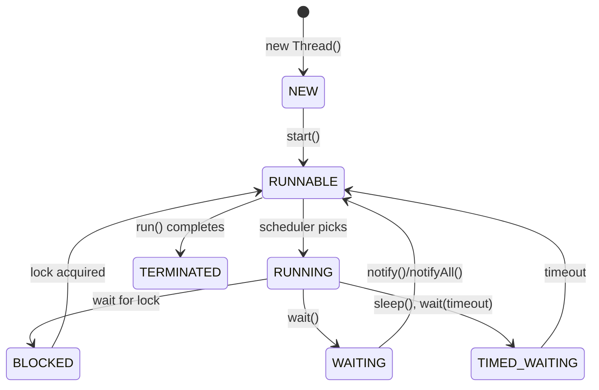
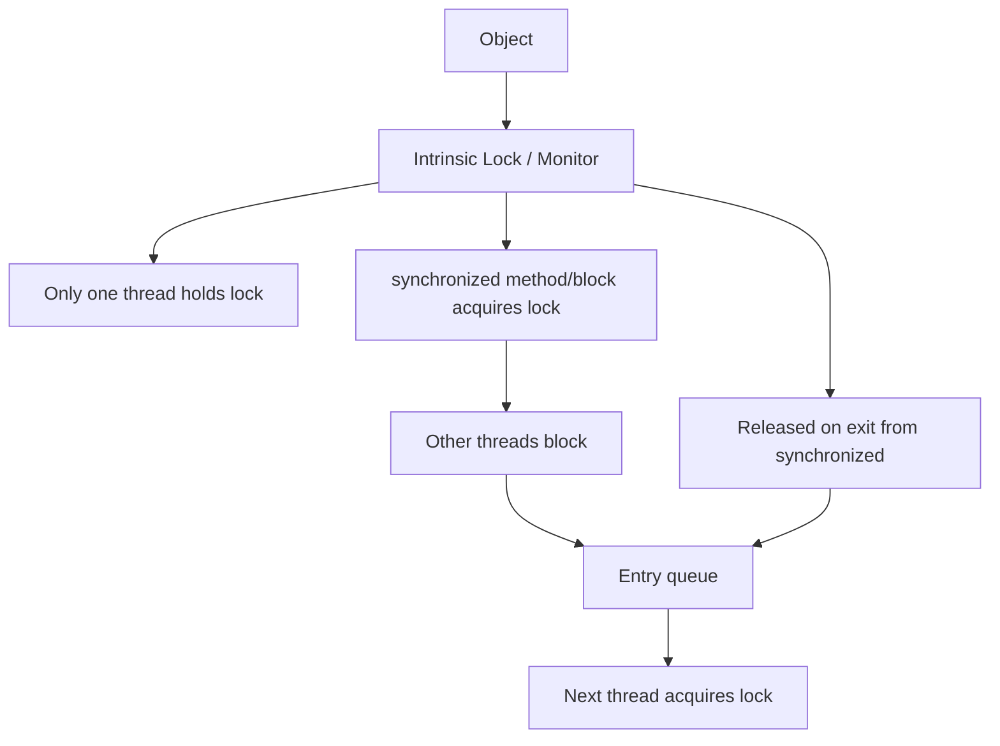
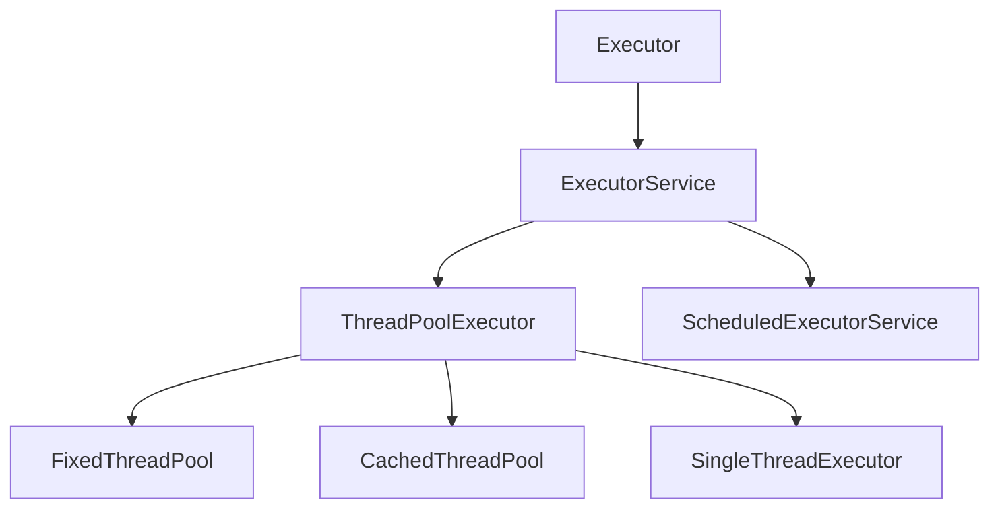
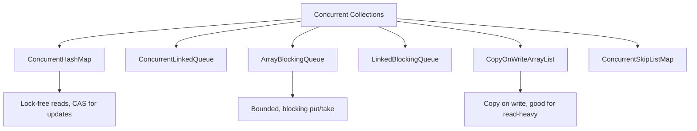
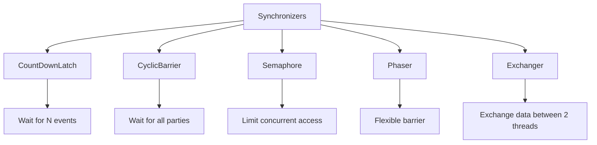

# Java Concurrency

## Overview

Java has one of the most comprehensive concurrency frameworks of any programming language. From the original `synchronized` keyword and `wait/notify` to the modern `java.util.concurrent` package with thread pools, concurrent collections, and CompletableFuture, Java provides tools for every concurrency need. Understanding Java concurrency is essential for backend engineering interviews.

## Thread Basics

### Creating Threads

```java
// Method 1: Extend Thread
class MyThread extends Thread {
    @Override
    public void run() {
        System.out.println("Running in thread: " + getName());
    }
}
new MyThread().start();

// Method 2: Implement Runnable (preferred)
Runnable task = () -> System.out.println("Running: " + Thread.currentThread().getName());
new Thread(task).start();

// Method 3: ExecutorService (most preferred)
ExecutorService executor = Executors.newFixedThreadPool(4);
executor.submit(task);
executor.shutdown();
```

### Thread Lifecycle



## synchronized

```java
class Counter {
    private int count = 0;

    // Synchronized method
    public synchronized void increment() {
        count++;
    }

    // Synchronized block
    public void decrement() {
        synchronized (this) {
            count--;
        }
    }

    public synchronized int getCount() {
        return count;
    }
}
```

### Intrinsic Locks (Monitor)



### wait/notify

```java
class MessageQueue {
    private final Queue<String> queue = new LinkedList<>();
    private final int capacity = 10;

    public synchronized void put(String msg) throws InterruptedException {
        while (queue.size() == capacity) {
            wait();  // Release lock, wait for notification
        }
        queue.add(msg);
        notifyAll();  // Wake up waiting consumers
    }

    public synchronized String get() throws InterruptedException {
        while (queue.isEmpty()) {
            wait();  // Release lock, wait for notification
        }
        String msg = queue.poll();
        notifyAll();  // Wake up waiting producers
        return msg;
    }
}
```

**Important**: Always use `while` (not `if`) to check conditions — spurious wakeups can occur.

## java.util.concurrent

### Executor Framework



```java
// Fixed thread pool
ExecutorService fixed = Executors.newFixedThreadPool(4);

// Cached thread pool (creates threads as needed)
ExecutorService cached = Executors.newCachedThreadPool();

// Single thread (sequential execution)
ExecutorService single = Executors.newSingleThreadExecutor();

// Scheduled
ScheduledExecutorService scheduled = Executors.newScheduledThreadPool(2);
scheduled.scheduleAtFixedRate(task, 0, 1, TimeUnit.SECONDS);
```

### CompletableFuture

```java
CompletableFuture<String> future = CompletableFuture
    .supplyAsync(() -> fetchData())           // Async computation
    .thenApply(data -> transform(data))        // Transform
    .thenApplyAsync(result -> save(result))    // Transform async
    .exceptionally(ex -> handleError(ex));     // Error handling

// Combining futures
CompletableFuture<String> combined = future1.thenCombine(future2,
    (r1, r2) -> r1 + r2);

// Wait for all
CompletableFuture.allOf(f1, f2, f3).join();
```

### Concurrent Collections



| Collection | Thread-Safe | Blocking | Use Case |
|------------|------------|----------|----------|
| ConcurrentHashMap | Yes | No | High-concurrency map |
| CopyOnWriteArrayList | Yes | No | Read-heavy list |
| ArrayBlockingQueue | Yes | Yes | Bounded producer-consumer |
| ConcurrentLinkedQueue | Yes | No | Unbounded lock-free queue |
| ConcurrentSkipListMap | Yes | No | Sorted concurrent map |

### ConcurrentHashMap

```java
ConcurrentHashMap<String, Integer> map = new ConcurrentHashMap<>();

// Atomic operations
map.putIfAbsent("key", 1);
map.computeIfAbsent("key", k -> expensiveComputation(k));
map.merge("key", 1, Integer::sum);  // Atomic increment

// Parallel operations (Java 8+)
map.forEach(4, (key, value) -> process(key, value));
long count = map.mappingCount();
```

## Locks (java.util.concurrent.locks)

### ReentrantLock

```java
ReentrantLock lock = new ReentrantLock();

lock.lock();
try {
    // Critical section
} finally {
    lock.unlock();  // Always unlock in finally
}

// Try lock (non-blocking)
if (lock.tryLock()) {
    try {
        // Got the lock
    } finally {
        lock.unlock();
    }
} else {
    // Didn't get the lock
}

// Try lock with timeout
if (lock.tryLock(5, TimeUnit.SECONDS)) {
    // Got it within 5 seconds
}
```

### ReentrantReadWriteLock

```java
ReadWriteLock rwLock = new ReentrantReadWriteLock();

// Multiple readers
rwLock.readLock().lock();
try {
    // Read shared data
} finally {
    rwLock.readLock().unlock();
}

// Single writer
rwLock.writeLock().lock();
try {
    // Write shared data
} finally {
    rwLock.writeLock().unlock();
}
```

### StampedLock (Java 8)

```java
StampedLock sl = new StampedLock();

// Optimistic read (no locking, validates after)
long stamp = sl.tryOptimisticRead();
// Read data
if (!sl.validate(stamp)) {
    // Data changed, fall back to read lock
    stamp = sl.readLock();
    try {
        // Re-read data
    } finally {
        sl.unlockRead(stamp);
    }
}
```

## Synchronizers



### CountDownLatch

```java
CountDownLatch latch = new CountDownLatch(3);

// Workers
for (int i = 0; i < 3; i++) {
    executor.submit(() -> {
        doWork();
        latch.countDown();  // Decrement count
    });
}

latch.await();  // Block until count reaches 0
System.out.println("All workers done");
```

### CyclicBarrier

```java
CyclicBarrier barrier = new CyclicBarrier(3, () -> {
    System.out.println("All threads reached barrier");
});

for (int i = 0; i < 3; i++) {
    executor.submit(() -> {
        doPhase1();
        barrier.await();  // Wait for all
        doPhase2();
    });
}
```

### Semaphore

```java
Semaphore semaphore = new Semaphore(5);  // 5 permits

semaphore.acquire();  // Block if no permits
try {
    // Access limited resource (max 5 concurrent)
} finally {
    semaphore.release();
}
```

## Atomic Classes

```java
AtomicInteger counter = new AtomicInteger(0);
counter.incrementAndGet();        // Atomic increment
counter.compareAndSet(5, 10);    // CAS
counter.updateAndGet(x -> x + 1); // Atomic update

AtomicReference<String> ref = new AtomicReference<>("initial");
ref.compareAndSet("initial", "updated");

LongAdder adder = new LongAdder();  // High-throughput counter
adder.increment();
adder.sum();
```

## Virtual Threads (Java 21)

```java
// Virtual threads (Project Loom)
Thread.startVirtualThread(() -> {
    System.out.println("I'm a virtual thread!");
});

// Structured concurrency (preview)
try (var scope = StructuredTaskScope.ShutdownOnFailure()) {
    Future<String> user = scope.fork(() -> fetchUser(id));
    Future<List<Order>> orders = scope.fork(() -> fetchOrders(id));
    scope.join();
    return new Response(user.resultNow(), orders.resultNow());
}
```

Virtual threads are lightweight threads managed by the JVM (similar to Go goroutines). They enable millions of concurrent threads.

## Interview Questions

1. **Q: What is the difference between synchronized and ReentrantLock?**
   A: synchronized is simpler, auto-releases on exception, and is intrinsic to every object. ReentrantLock offers more features: tryLock (non-blocking), timed lock, interruptible lock, fairness policy, and multiple condition variables. Use synchronized for simple cases; ReentrantLock when you need advanced features.

2. **Q: Explain the Java Memory Model (JMM).**
   A: The JMM defines how threads interact through memory. synchronized and volatile establish happens-before relationships. Without synchronization, the compiler and CPU may reorder operations, and one thread may not see another's writes. volatile ensures visibility; synchronized ensures both visibility and atomicity.

3. **Q: What is the difference between wait() and sleep()?**
   A: wait() releases the object's monitor lock and waits for notify(). sleep() does NOT release any locks and just pauses the thread. wait() must be called in a synchronized block; sleep() can be called anywhere. wait() is for inter-thread communication; sleep() is for pausing.

4. **Q: How does ConcurrentHashMap work?**
   A: It uses lock striping (Java 7) or CAS + synchronized on individual bins (Java 8+). Reads are lock-free. Writes synchronize on the target bin only (not the whole map). This allows concurrent writes to different bins. It's the go-to concurrent map for most use cases.

5. **Q: What are virtual threads in Java 21?**
   A: Virtual threads are lightweight threads managed by the JVM, not the OS. They're similar to Go goroutines. You can create millions of them. They're ideal for I/O-bound workloads. They mount/unmount on platform threads when blocking, so they don't waste OS resources.

## Common Mistakes

- Using `if` instead of `while` with wait() — spurious wakeups cause bugs.
- Not unlocking in finally — lock leaked on exception.
- Using Vector/Hashtable — legacy synchronized collections, prefer ConcurrentHashMap.
- Double-checked locking without volatile — broken in Java < 5.
- Using Thread.stop() — deprecated, use interrupt() instead.

## Summary

Java provides a rich concurrency toolkit: synchronized + wait/notify for basics, java.util.concurrent for high-level abstractions (ExecutorService, CompletableFuture, concurrent collections, locks, synchronizers), and virtual threads (Java 21) for lightweight concurrency. For interviews, understand the JMM, the difference between synchronized and Lock, concurrent collections, and the Executor framework.

## Cross-References

- [Thread Pools](./thread-pools.md) — Java's ExecutorService
- [Producer-Consumer](./producer-consumer.md) — BlockingQueue implementation
- [Readers-Writers](./readers-writers.md) — ReadWriteLock
- [Futures](./futures.md) — CompletableFuture
- [Concurrency Overview](./overview.md) — Fundamental concepts
- [Interview LLD Concurrency](../interview/system-design/lld/concurrency-design.md)
- [OS Synchronization](../os/synchronization/mutex.md)
- [Lock-Free](./lock-free.md)
