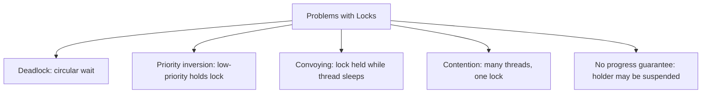
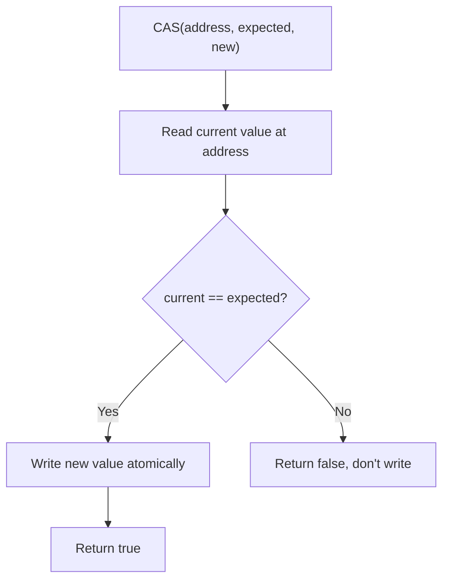
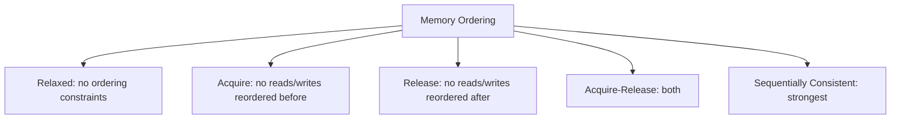
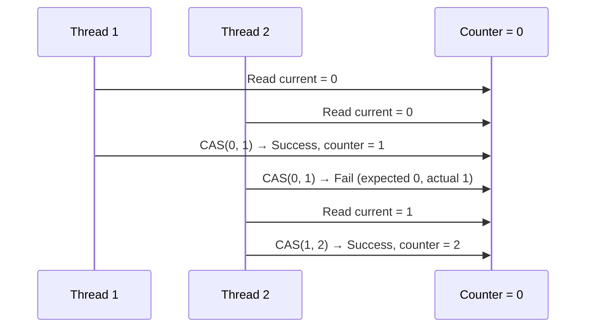
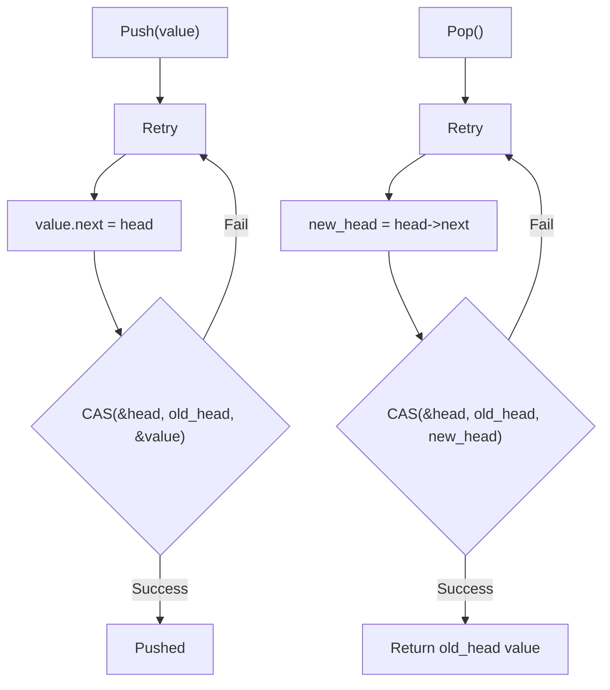
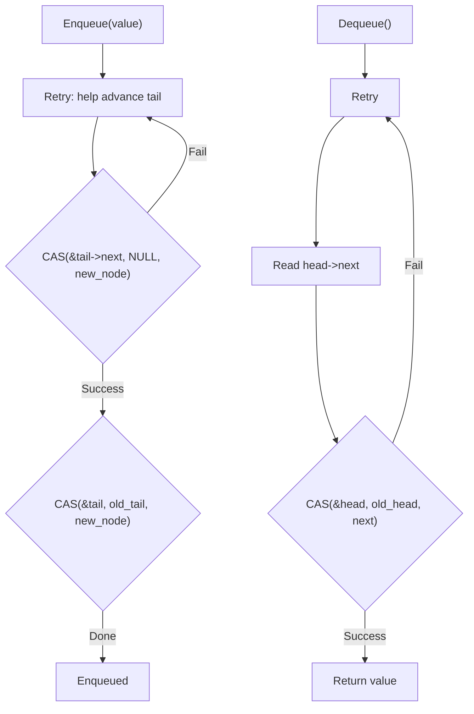
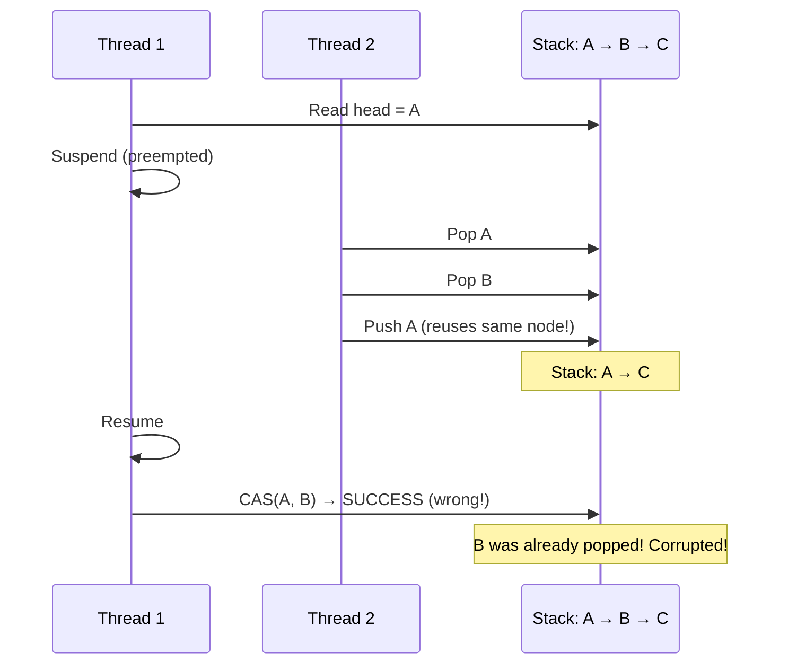
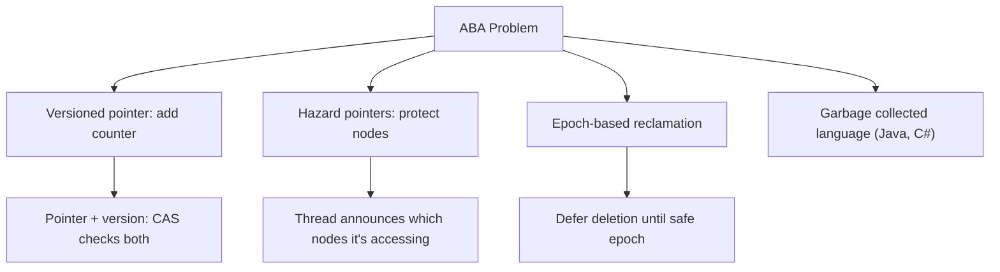
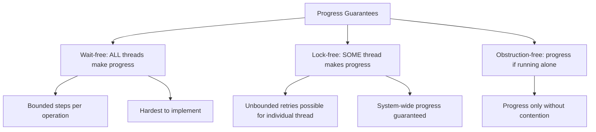
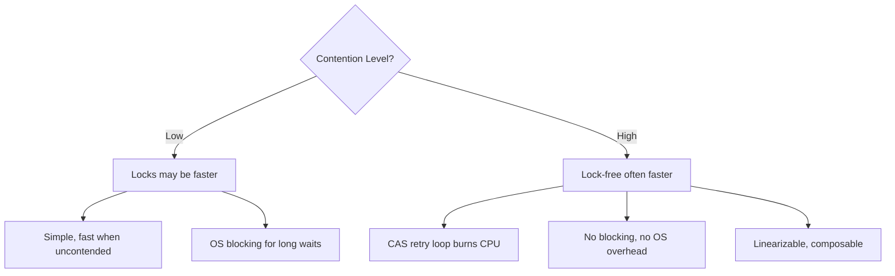

# Lock-Free and Wait-Free Programming

## Overview

Lock-free programming uses atomic operations instead of locks to coordinate between threads. This avoids problems like deadlocks, priority inversion, and lock contention. Lock-free algorithms guarantee system-wide progress — at least one thread makes progress in a finite number of steps. Wait-free algorithms are stronger — every thread makes progress. These techniques are used in high-performance systems, real-time applications, and kernel development.

## Why Go Lock-Free?



Lock-free algorithms solve these by using atomic hardware instructions that don't block.

## Atomic Operations

### Compare-and-Swap (CAS)



CAS is the fundamental building block. It atomically:
1. Reads the current value.
2. Compares it with expected.
3. If equal, writes the new value.
4. Returns whether it succeeded.

```c
// Pseudocode
bool cas(int* addr, int expected, int new_value) {
    // Hardware atomic instruction
    if (*addr == expected) {
        *addr = new_value;
        return true;
    }
    return false;
}
```

### Other Atomics

| Operation | Description | Use Case |
|-----------|-------------|----------|
| `atomic_load` | Atomic read | Read shared counter |
| `atomic_store` | Atomic write | Update shared flag |
| `atomic_fetch_add` | Atomic increment | Counter |
| `atomic_fetch_or` | Atomic OR | Bit flags |
| `atomic_exchange` | Atomic swap | Set and get old value |
| `compare_exchange` | CAS | Lock-free algorithms |

### Memory Ordering



| Ordering | Guarantee | Use Case |
|----------|-----------|----------|
| Relaxed | Atomicity only | Counters, statistics |
| Acquire | Subsequent reads see all prior writes | Load a lock |
| Release | Prior writes are visible | Release a lock |
| Acq_Rel | Both | Read-modify-write |
| Seq_Cst | Total order across all threads | Default, strongest |

## Lock-Free Counter

```java
// Java AtomicInteger
AtomicInteger counter = new AtomicInteger(0);

// Lock-free increment
public void increment() {
    while (true) {
        int current = counter.get();           // Read
        int next = current + 1;
        if (counter.compareAndSet(current, next)) {  // CAS
            break;  // Success
        }
        // CAS failed, retry (another thread modified it)
    }
}
```



## Lock-Free Stack (Treiber Stack)



```c
// Lock-free stack push
void push(Node** top, int value) {
    Node* new_node = create_node(value);
    Node* old_top;
    do {
        old_top = *top;
        new_node->next = old_top;
    } while (!CAS(top, old_top, new_node));
}

// Lock-free stack pop
int pop(Node** top) {
    Node* old_top;
    Node* new_top;
    do {
        old_top = *top;
        if (old_top == NULL) return EMPTY;
        new_top = old_top->next;
    } while (!CAS(top, old_top, new_top));
    return old_top->value;
}
```

## Lock-Free Queue (Michael-Scott Queue)



## ABA Problem



The ABA problem: a value changes from A to B and back to A. CAS succeeds because it looks unchanged, but the underlying structure has changed.

### Solutions



**Versioned pointer** (tagged pointer):
```c
struct TaggedPointer {
    Node* ptr;
    uint64_t tag;  // Incremented on each modification
};

// CAS compares both ptr AND tag
CAS(&head, {old_ptr, old_tag}, {new_ptr, old_tag + 1});
```

## Wait-Free vs Lock-Free



| Guarantee | Individual Thread | System-Wide | Complexity |
|-----------|------------------|-------------|------------|
| Wait-free | Bounded steps | Always | Very high |
| Lock-free | May starve | Always | High |
| Obstruction-free | May starve | If alone | Moderate |
| Lock-based | May deadlock | May deadlock | Low |

## Lock-Free in Practice

### C++ atomics

```cpp
#include <atomic>

std::atomic<int> counter{0};

// Lock-free increment
void increment() {
    counter.fetch_add(1, std::memory_order_relaxed);
}

// Lock-free CAS loop
void compare_and_increment(int expected) {
    while (!counter.compare_exchange_weak(
        expected,
        expected + 1,
        std::memory_order_release,
        std::memory_order_relaxed)) {
        // expected is updated on failure
    }
}
```

### Java Lock-Free Collections

```java
// ConcurrentHashMap uses lock-free reads + CAS for updates
ConcurrentHashMap<String, Integer> map = new ConcurrentHashMap<>();
map.put("key", 1);  // Internally uses CAS

// LongAdder: high-throughput counter (uses cells to reduce contention)
LongAdder counter = new LongAdder();
counter.increment();  // Low contention even with many threads
```

### Rust atomics

```rust
use std::sync::atomic::{AtomicUsize, Ordering};

static COUNTER: AtomicUsize = AtomicUsize::new(0);

fn increment() {
    COUNTER.fetch_add(1, Ordering::Relaxed);
}

fn compare_and_swap(expected: usize, new: usize) -> bool {
    COUNTER.compare_exchange(expected, new, Ordering::AcqRel, Ordering::Relaxed).is_ok()
}
```

## Performance: Lock-Free vs Locks



Lock-free isn't always faster. Under low contention, a simple mutex can outperform CAS retry loops. Lock-free shines under high contention or when you need progress guarantees.

## Interview Questions

1. **Q: What is the difference between lock-free and wait-free?**
   A: Lock-free guarantees that at least one thread makes progress in a finite number of steps (system-wide progress). Wait-free guarantees every thread makes progress (individual progress). Wait-free is stronger but much harder to implement.

2. **Q: What is the ABA problem?**
   A: A value changes from A to B back to A. CAS succeeds because the value looks unchanged, but the underlying structure may have changed. Solutions: versioned pointers (tag + pointer), hazard pointers, or garbage-collected languages.

3. **Q: How does Compare-and-Swap (CAS) work?**
   A: CAS atomically reads a memory location, compares it with an expected value, and if equal, writes a new value. It returns whether the swap succeeded. If another thread modified the value between read and CAS, the CAS fails and the algorithm retries.

4. **Q: When should you use lock-free data structures vs locks?**
   A: Use lock-free when you need progress guarantees (real-time systems), when lock contention is very high, or when you need to avoid deadlocks. Use locks when the code is simpler, contention is low, and you don't need progress guarantees.

5. **Q: What is memory ordering in atomics?**
   A: Memory ordering controls how atomic operations interact with non-atomic memory accesses. Relaxed: no ordering. Acquire: subsequent reads see prior writes. Release: prior writes are visible. Seq_Cst: total order. Wrong ordering can cause subtle bugs.

## Common Mistakes

- Using CAS for complex data structures without handling ABA.
- Wrong memory ordering — Relaxed when you need Acquire/Release.
- Assuming lock-free is always faster — under low contention, locks can be faster.
- Not handling CAS retry loops efficiently — exponential backoff helps.
- Mixing atomics and non-atomics on the same data — causes data races.

## Summary

Lock-free programming uses atomic operations (especially CAS) instead of locks. It guarantees system-wide progress, avoids deadlocks, and can handle high contention. The ABA problem is a key challenge, solved by versioned pointers or safe memory reclamation. Wait-free algorithms are stronger but harder to implement. For interviews, understand CAS, the ABA problem, memory ordering, and when lock-free outperforms locks.

## Cross-References

- [Concurrency Overview](./overview.md) — Synchronization primitives
- [Java Concurrency](./java.md) — AtomicInteger, ConcurrentHashMap
- [Rust Ownership](./rust-ownership.md) — Safe concurrent access
- [Thread Pools](./thread-pools.md) — Higher-level concurrency
- [CAS Operations](../os/synchronization/cas.md)
- [Storage Distributed](../storage/distributed.md)
