# Concurrency Overview

## Introduction

Concurrency is the ability of a system to handle multiple tasks simultaneously. It's one of the most important topics in systems programming and a favorite in placement interviews. Concurrency enables better resource utilization, higher throughput, and responsive applications — but it also introduces subtle bugs like race conditions, deadlocks, and starvation.

## Concurrency vs Parallelism

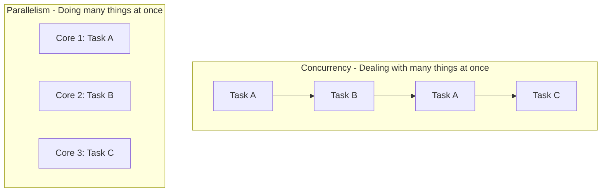

- **Concurrency**: Structuring a program to handle multiple tasks. Tasks may interleave on a single core.
- **Parallelism**: Actually executing multiple tasks simultaneously on multiple cores.

> "Concurrency is about dealing with lots of things at once. Parallelism is about doing lots of things at once." — Rob Pike

## Fundamental Concepts

### Processes vs Threads

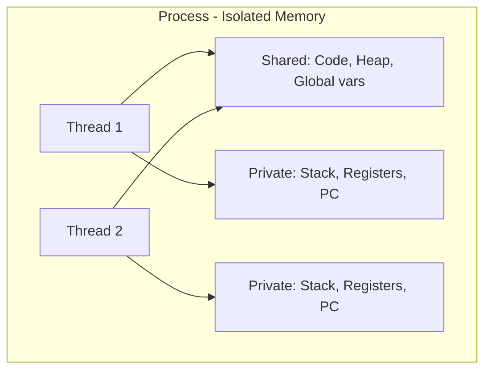

| Feature | Process | Thread |
|---------|---------|--------|
| Memory | Separate address space | Shared address space |
| Creation | Heavy (fork/exec) | Light (clone) |
| Communication | IPC (pipes, sockets, shared memory) | Shared variables |
| Isolation | Strong (crash isolated) | Weak (crash affects all) |
| Context Switch | Expensive (TLB flush) | Cheap |

### Shared Memory vs Message Passing

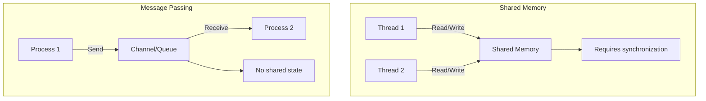

## The Synchronization Problem

### Race Condition

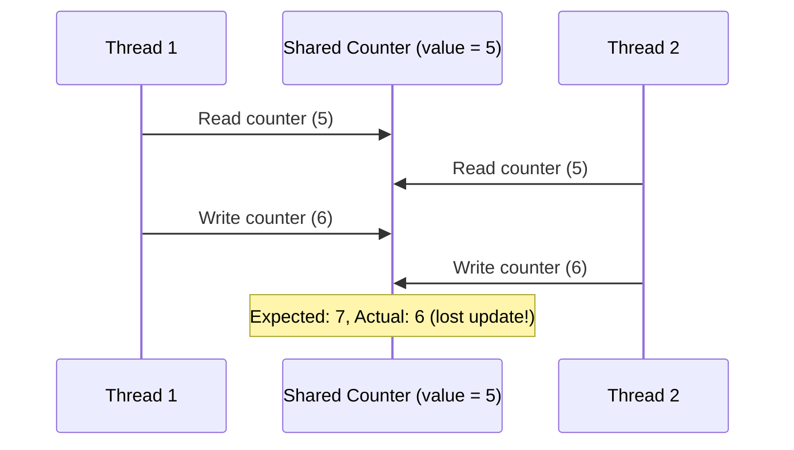

A race condition occurs when the result depends on the non-deterministic ordering of operations between threads.

### Critical Section

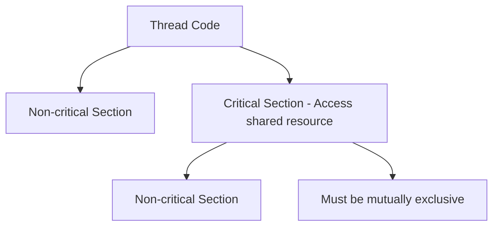

The critical section is the code that accesses shared resources. Only one thread should execute it at a time.

## Synchronization Primitives

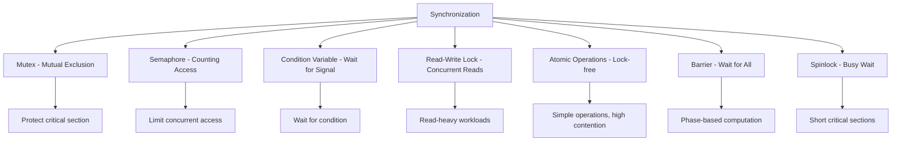

### Mutex (Mutual Exclusion)

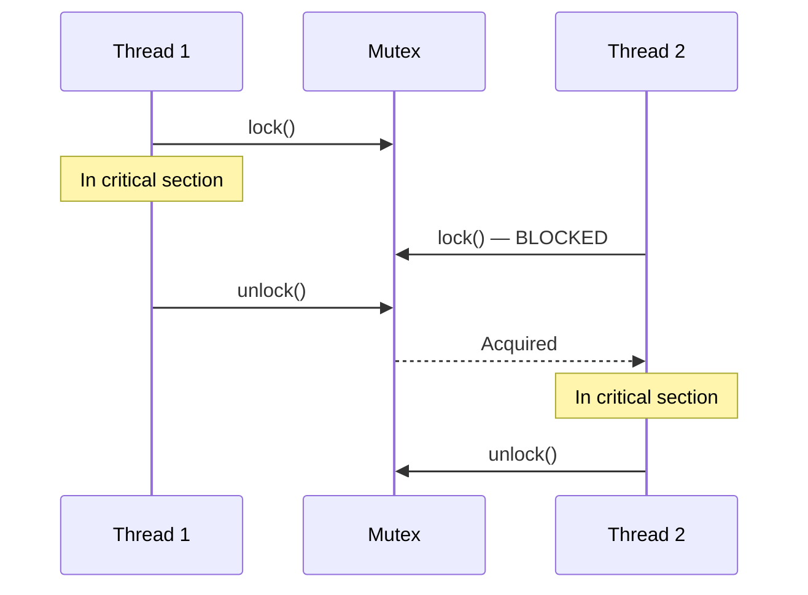

### Semaphore

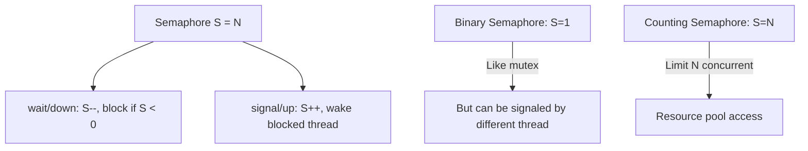

### Condition Variable

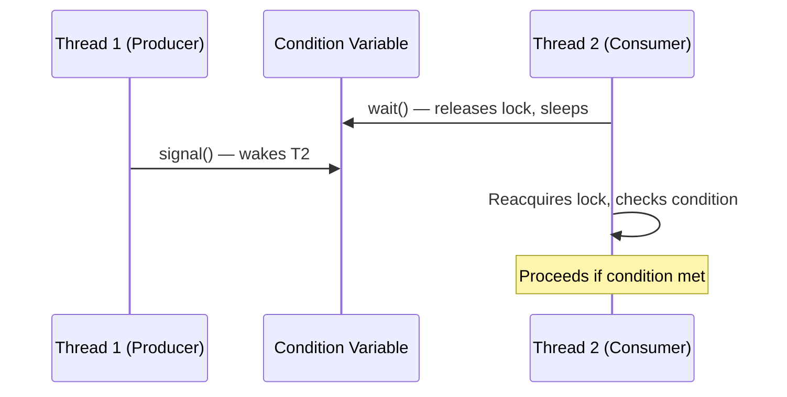

## Common Concurrency Problems

### Deadlock

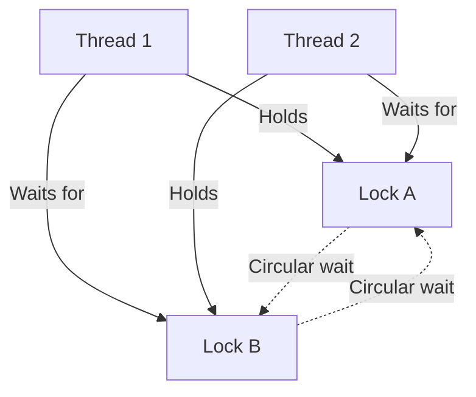

**Four conditions for deadlock** (all must hold):
1. **Mutual Exclusion**: Resources can't be shared.
2. **Hold and Wait**: Thread holds resource while waiting for another.
3. **No Preemption**: Resources can't be forcibly taken.
4. **Circular Wait**: Circular chain of threads waiting for each other.

**Prevention**: Break any one condition (e.g., always acquire locks in the same order to prevent circular wait).

### Starvation

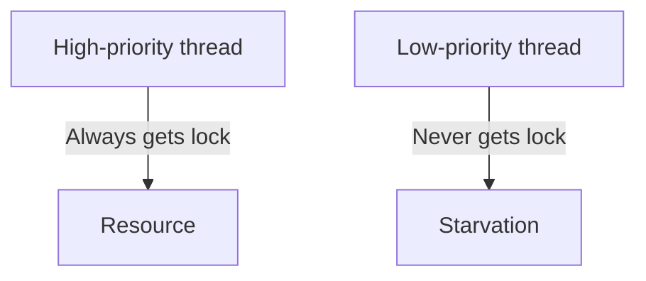

A thread is perpetually denied access to a resource because other threads always get priority.

### Livelock

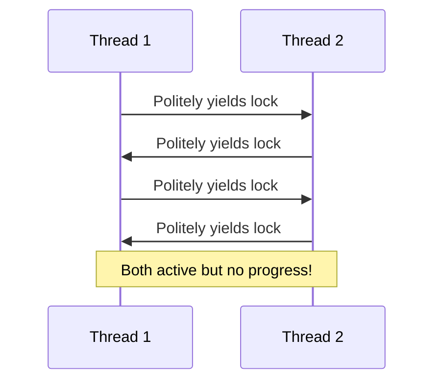

Threads keep responding to each other but make no progress. Like two people in a hallway who keep stepping aside in the same direction.

## Memory Models

### What You See Isn't What Happens

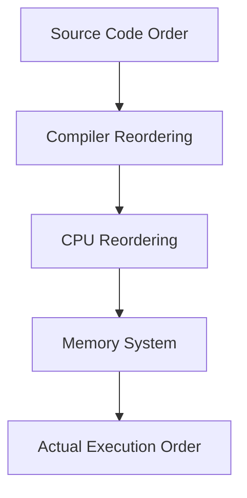

Compilers and CPUs reorder instructions for performance. Without proper synchronization, threads may see stale or reordered values.

### Memory Barriers / Fences

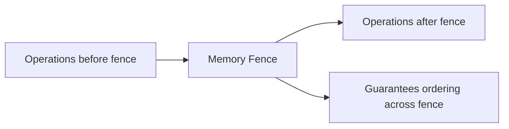

Memory barriers prevent reordering of memory operations across the barrier. They're the foundation of lock-free programming.

## Concurrency Models

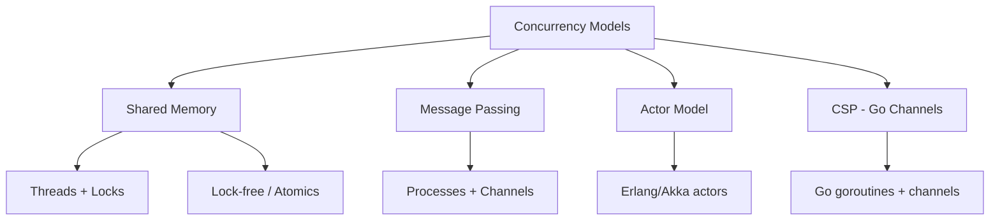

| Model | Languages | Shared State | Communication |
|-------|-----------|-------------|---------------|
| Threads + Locks | Java, C++, Python | Yes | Shared variables |
| Lock-free | C++, Rust | Yes (atomics) | Atomic operations |
| Actor | Erlang, Akka | No | Message passing |
| CSP (Channels) | Go | No | Typed channels |
| Async/Await | JS, Python, Rust | Depends | Futures/promises |

## Hardware Support

### Compare-and-Swap (CAS)

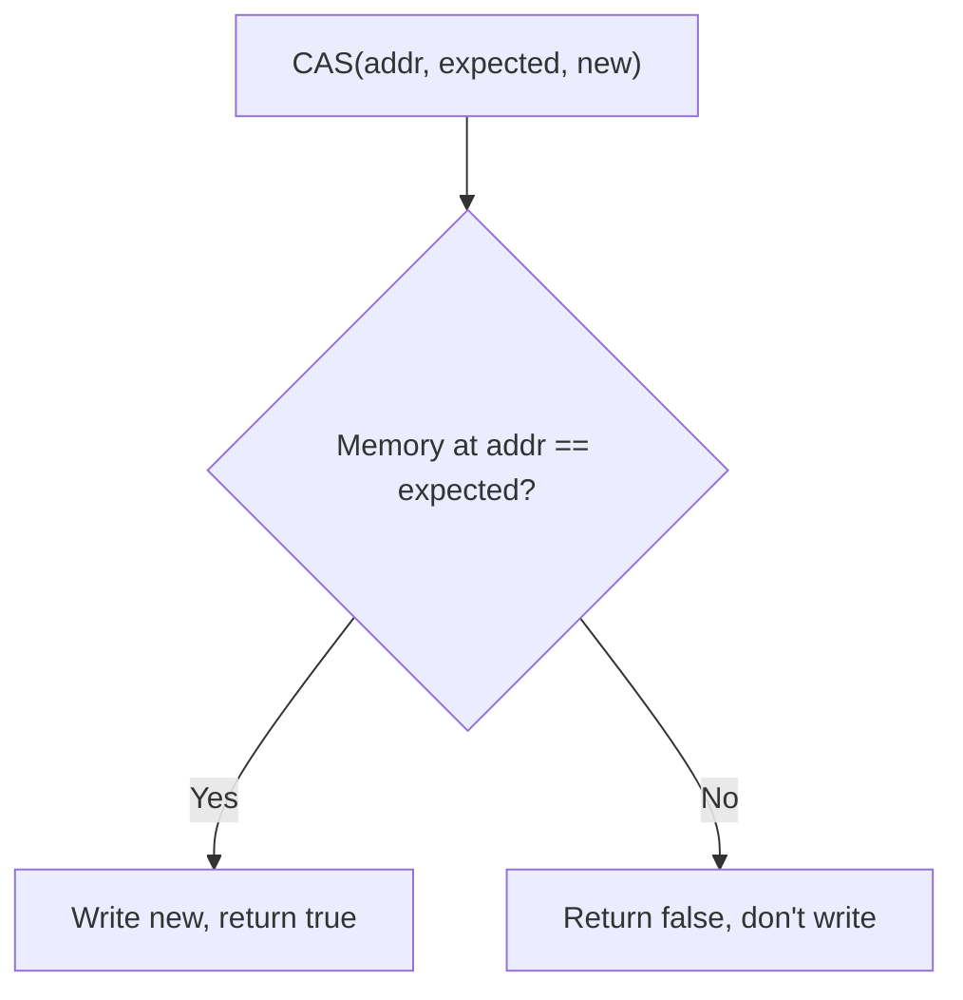

CAS is the fundamental atomic operation for lock-free programming. It atomically checks and updates a memory location.

### Cache Coherence (MESI Protocol)

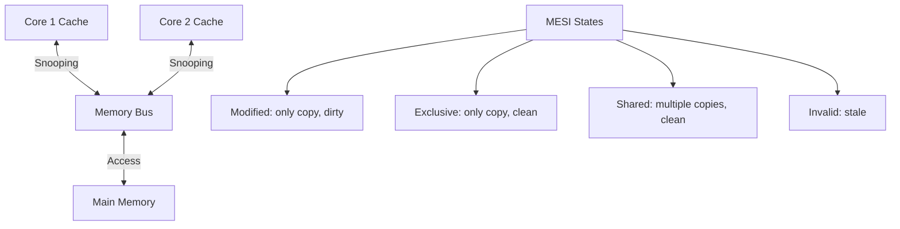

Cache coherence protocols ensure all cores see a consistent view of memory. This is why atomic operations are expensive — they require cache line invalidation across cores.

## Interview Questions

1. **Q: What is the difference between concurrency and parallelism?**
   A: Concurrency is about structuring a program to handle multiple tasks (they can interleave on one core). Parallelism is about executing multiple tasks simultaneously (requires multiple cores). You can have concurrency without parallelism (single-core with time-slicing).

2. **Q: What are the four conditions for deadlock?**
   A: Mutual exclusion (resources can't be shared), hold and wait (holding one resource while waiting for another), no preemption (resources can't be forcibly taken), and circular wait (cycle of threads waiting for each other). Break any one to prevent deadlock.

3. **Q: Explain the difference between a mutex and a semaphore.**
   A: A mutex provides mutual exclusion — only one thread can hold it at a time, and only the holder can release it. A semaphore is a counter — multiple threads can hold it simultaneously (counting semaphore), and any thread can signal it. Mutexes are for exclusive access; semaphores are for limiting concurrency.

4. **Q: What is a race condition?**
   A: A race condition occurs when the correctness of a program depends on the relative timing of threads. The outcome changes based on scheduling order. Example: two threads incrementing a shared counter without synchronization can lose updates.

5. **Q: What is the difference between shared memory and message passing concurrency?**
   A: Shared memory uses threads that read/write shared variables, requiring synchronization (locks, atomics). Message passing uses independent processes/goroutines that communicate by sending messages through channels. Message passing avoids shared state issues but requires serialization.

## Common Mistakes

- Using locks everywhere — over-synchronization kills performance. Consider lock-free or message passing.
- Not holding a lock when reading shared data — both reads AND writes need synchronization.
- Forgetting to release a lock on all code paths (including exceptions) — use RAII or `defer`.
- Assuming atomic operations are always correct — they prevent data races but not logical races.
- Ignoring memory models — what the compiler/CPU does may not match your source code order.

## Summary

Concurrency enables systems to handle multiple tasks efficiently but introduces challenges: race conditions, deadlocks, starvation. Synchronization primitives (mutexes, semaphores, condition variables, atomics) protect shared state. Different concurrency models (shared memory, message passing, actors, CSP) offer different trade-offs. For interviews, understand the synchronization problem, deadlock conditions, and the trade-offs between locks and lock-free approaches.

## Cross-References

- [Fork-Join](./fork-join.md) — Parallel task decomposition
- [Thread Pools](./thread-pools.md) — Managed thread reuse
- [Producer-Consumer](./producer-consumer.md) — Classic concurrency pattern
- [Readers-Writers](./readers-writers.md) — Shared access pattern
- [Async/Await](./async-await.md) — Asynchronous programming
- [Lock-Free](./lock-free.md) — Wait-free and lock-free algorithms
- [Go Channels](./go-channels.md) — CSP concurrency model
- [Rust Ownership](./rust-ownership.md) — Compile-time concurrency safety
- [OS Processes](../os/processes/zombie-orphan.md)
- [Interview System Design](../interview/system-design/README.md)
- [Cloud Overview](../cloud/overview.md)

