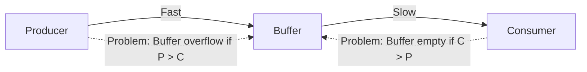
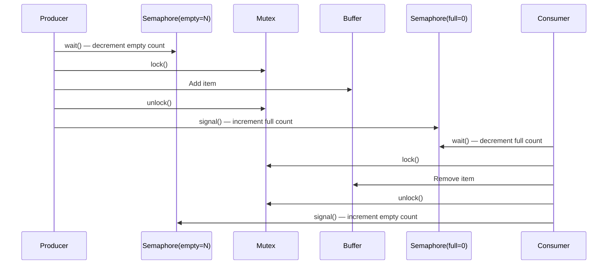
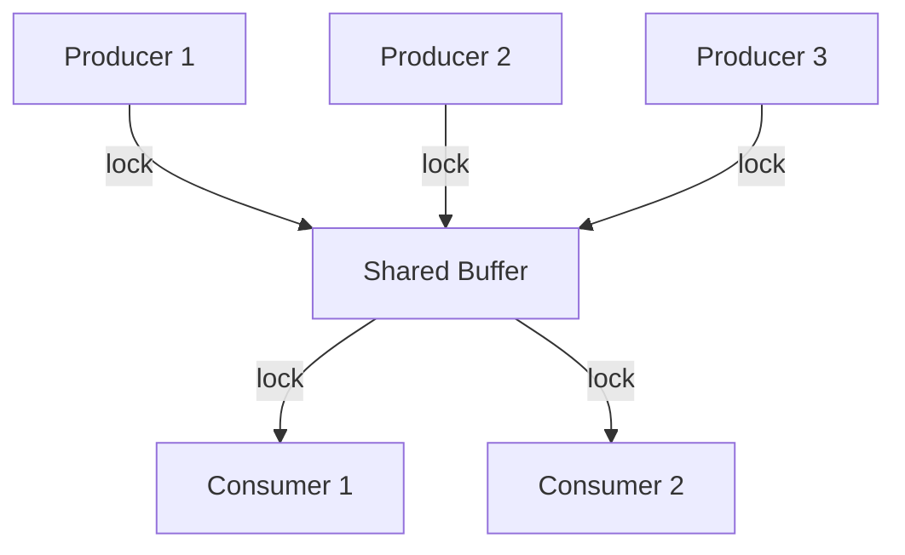
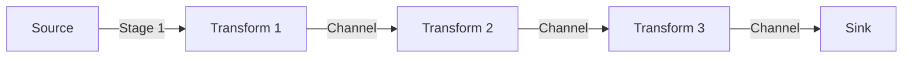
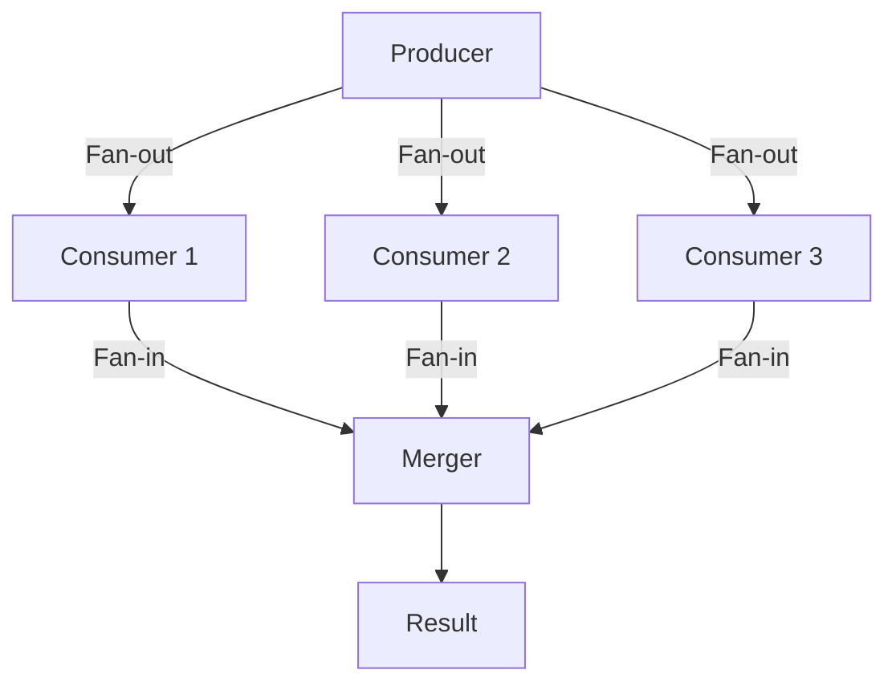
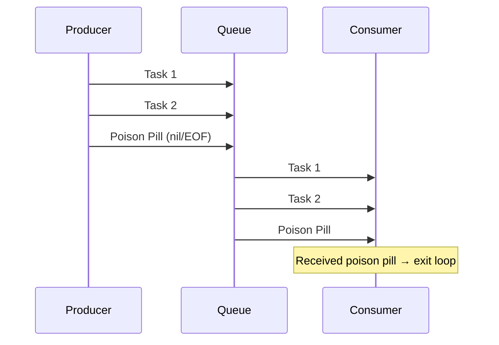
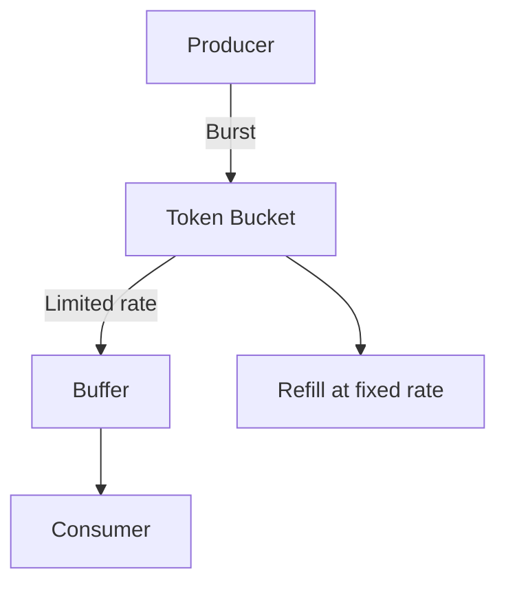

# Producer-Consumer Pattern

## Overview

The Producer-Consumer (bounded buffer) pattern decouples data producers from consumers through a shared buffer. Producers add items when space is available; consumers remove items when data is available. This pattern is fundamental to concurrent programming — it's the basis of message queues, task schedulers, streaming pipelines, and operating system I/O.

## The Problem



Without synchronization:
- **Buffer overflow**: Producer overwrites unconsumed data.
- **Buffer underflow**: Consumer reads invalid/stale data.
- **Race conditions**: Concurrent access corrupts buffer state.

## Solution: Bounded Buffer with Synchronization

```mermaid
graph TD
    subgraph Solution[Bounded Buffer Solution]
        P[Producer] -->|wait(emptySlots)| MUTEX[Mutex]
        MUTEX -->|lock| BUF[Buffer: capacity N]
        BUF -->|signal(filledSlots)| C[Consumer]

        BUF --> FULL{Full?}
        FULL -->|Yes| P_BLOCK[Producer blocks]
        BUF --> EMPTY{Empty?}
        EMPTY -->|Yes| C_BLOCK[Consumer blocks]
    end
```

### Semaphore Solution



### Implementation (C - POSIX)

```c
#include <semaphore.h>
#include <pthread.h>

#define BUFFER_SIZE 10

int buffer[BUFFER_SIZE];
int in = 0, out = 0;

sem_t empty;  // Counts empty slots
sem_t full;   // Counts filled slots
pthread_mutex_t mutex;

void* producer(void* arg) {
    while (1) {
        int item = produce_item();

        sem_wait(&empty);      // Wait for empty slot
        pthread_mutex_lock(&mutex);

        buffer[in] = item;
        in = (in + 1) % BUFFER_SIZE;

        pthread_mutex_unlock(&mutex);
        sem_post(&full);       // Signal filled slot
    }
}

void* consumer(void* arg) {
    while (1) {
        sem_wait(&full);       // Wait for filled slot
        pthread_mutex_lock(&mutex);

        int item = buffer[out];
        out = (out + 1) % BUFFER_SIZE;

        pthread_mutex_unlock(&mutex);
        sem_post(&empty);      // Signal empty slot

        consume_item(item);
    }
}
```

### Python Implementation

```python
import threading
import queue
import time

def producer_consumer():
    buffer = queue.Queue(maxsize=10)
    done = threading.Event()

    def producer():
        for i in range(100):
            buffer.put(i)  # Blocks if full
            time.sleep(0.01)
        done.set()

    def consumer():
        while not done.is_set() or not buffer.empty():
            try:
                item = buffer.get(timeout=0.1)  # Blocks if empty
                process(item)
                buffer.task_done()
            except queue.Empty:
                continue

    t1 = threading.Thread(target=producer)
    t2 = threading.Thread(target=consumer)
    t1.start()
    t2.start()
    t1.join()
    t2.join()
```

## Variations

### Multiple Producers and Consumers



The mutex ensures safe concurrent access from multiple producers and consumers. Semaphores coordinate the "not full" and "not empty" conditions.

### Channel-Based (Go)

```go
func producer(ch chan<- int) {
    for i := 0; i < 100; i++ {
        ch <- i  // Blocks if channel buffer is full
    }
    close(ch)
}

func consumer(ch <-chan int) {
    for item := range ch {  // Blocks if channel is empty, exits when closed
        process(item)
    }
}

func main() {
    ch := make(chan int, 10)  // Buffered channel with capacity 10
    go producer(ch)
    consumer(ch)
}
```

Go channels are a built-in implementation of the producer-consumer pattern. The channel buffer provides bounded buffering, and `send`/`receive` block automatically.

### BlockingQueue (Java)

```java
import java.util.concurrent.*;

BlockingQueue<Task> queue = new LinkedBlockingQueue<>(100);

// Producer
new Thread(() -> {
    while (hasMoreTasks()) {
        queue.put(createTask());  // Blocks if full
    }
}).start();

// Consumer
new Thread(() -> {
    while (true) {
        Task task = queue.take();  // Blocks if empty
        task.execute();
    }
}).start();
```

Java's `BlockingQueue` is a high-level abstraction that handles all synchronization internally.

## Pipeline Pattern



Multiple producer-consumer stages chained together:

```go
func pipeline() {
    ch1 := make(chan int, 5)
    ch2 := make(chan int, 5)
    ch3 := make(chan string, 5)

    go source(ch1)
    go transform1(ch1, ch2)
    go transform2(ch2, ch3)
    sink(ch3)
}
```

### Fan-Out / Fan-In



- **Fan-out**: One producer distributes work to multiple consumers (parallel processing).
- **Fan-in**: Multiple producers converge results into one consumer (aggregation).

## Advanced Patterns

### Work Queue with Priority

```python
import heapq
import threading

class PriorityQueue:
    def __init__(self):
        self._queue = []
        self._lock = threading.Lock()
        self._not_empty = threading.Condition(self._lock)

    def put(self, item, priority):
        with self._lock:
            heapq.heappush(self._queue, (priority, item))
            self._not_empty.notify()

    def get(self):
        with self._not_empty:
            while not self._queue:
                self._not_empty.wait()
            return heapq.heappop(self._queue)[1]
```

### Poison Pill (Graceful Shutdown)



A special sentinel value signals consumers to stop. Used when you can't simply close the channel (multiple consumers).

### Rate Limiting



## Interview Questions

1. **Q: Explain the producer-consumer problem and its solution.**
   A: Producers generate data and add it to a shared buffer; consumers remove and process data. The buffer is bounded (fixed size). Solution: use a mutex for mutual exclusion, a "full" semaphore (blocks consumers when empty), and an "empty" semaphore (blocks producers when full).

2. **Q: What is the difference between a blocking queue and a regular queue?**
   A: A blocking queue blocks the producer when full (put() blocks) and blocks the consumer when empty (take() blocks). A regular queue returns immediately (throws exception or returns null). Blocking queues are designed for producer-consumer synchronization.

3. **Q: How would you implement a pipeline of processing stages?**
   A: Chain channels/queues between stages. Each stage reads from its input channel, processes, and writes to its output channel. Each stage can be a separate goroutine/thread. This enables parallel processing with natural backpressure.

4. **Q: What is a poison pill in the producer-consumer pattern?**
   A: A poison pill is a special sentinel value (like nil or a specific object) sent through the queue to signal consumers to stop. It's used for graceful shutdown when the queue can't simply be closed (e.g., multiple consumers, or the queue is shared).

5. **Q: How does Go's channel implement the producer-consumer pattern?**
   A: Go channels are typed conduits for goroutine communication. Sending blocks if the buffer is full; receiving blocks if the buffer is empty. Unbuffered channels require both goroutines to be ready simultaneously (rendezvous). Channels provide built-in synchronization.

## Common Mistakes

- Forgetting to signal the consumer when producing — consumer stays blocked forever.
- Not using the mutex around the buffer — race conditions corrupt state.
- Unbounded buffer — memory exhaustion if producer outpaces consumer.
- Not handling the "empty" condition — consumer reads garbage from empty buffer.
- Deadlock: producer waits for empty, consumer waits for full, but signals are in wrong order.

## Summary

The producer-consumer pattern decouples data production from consumption through a bounded buffer. Synchronization uses semaphores (empty/full counts) and a mutex (buffer protection). Variations include channels (Go), blocking queues (Java), pipelines, and fan-out/fan-in. The pattern is fundamental to message queues, streaming systems, and task schedulers.

## Cross-References

- [Thread Pools](./thread-pools.md) — Uses producer-consumer internally
- [Go Channels](./go-channels.md) — Built-in producer-consumer
- [Readers-Writers](./readers-writers.md) — Related synchronization pattern
- [Async/Await](./async-await.md) — Asynchronous alternative
- [Concurrency Overview](./overview.md) — Fundamental concepts
- [Messaging Systems](../interview/system-design/hld/messaging-systems.md)
- [LLM Batching](../llm/llm-serving/batching.md)
