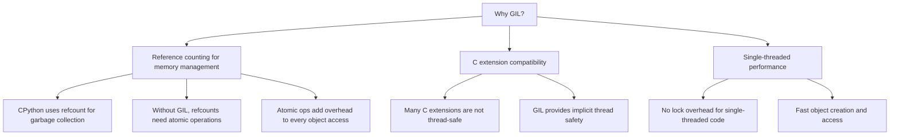
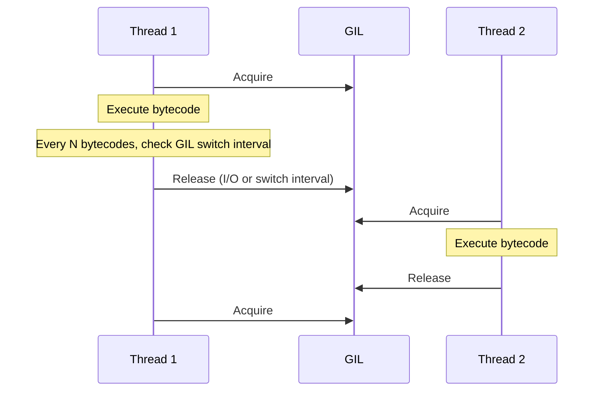
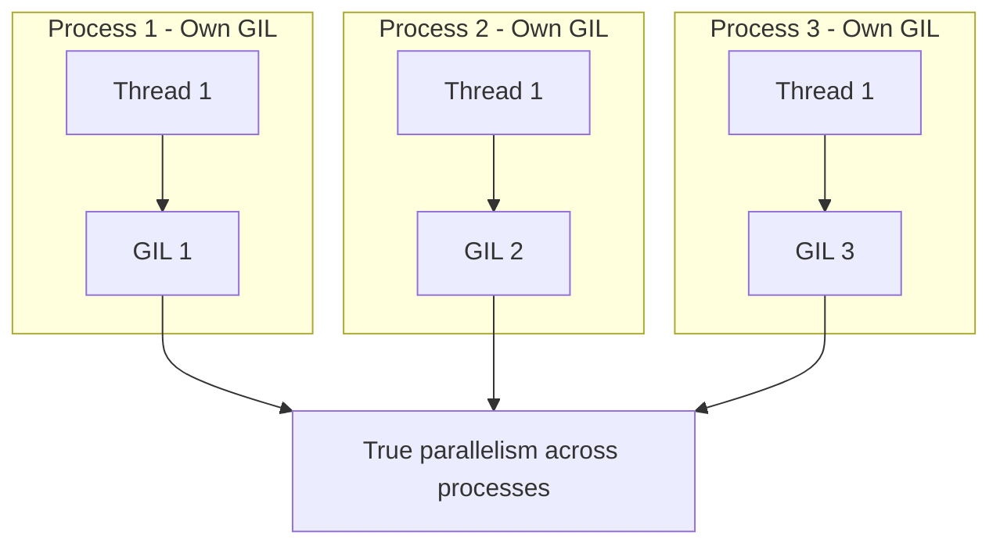
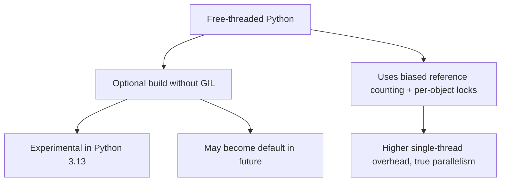
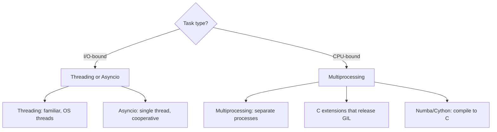

# Python's GIL (Global Interpreter Lock)

## Overview

The Global Interpreter Lock (GIL) is a mutex in CPython that protects access to Python objects, preventing multiple threads from executing Python bytecode simultaneously. It's one of the most discussed (and criticized) features of Python. The GIL simplifies CPython's implementation and makes single-threaded programs fast, but it limits true parallelism for CPU-bound tasks.

## What is the GIL?

```mermaid
graph TD
    GIL[Global Interpreter Lock] --> ONE[Only one thread executes Python bytecode at a time]
    GIL --> PROTECT[Protects Python objects from corruption]
    GIL --> SIMPLE[Simplifies CPython implementation]
    GIL --> LIMIT[Limits CPU-bound parallelism]

    THREAD1[Thread 1] -->|Acquire GIL| EXEC1[Execute bytecode]
    THREAD2[Thread 2] -->|Wait for GIL| BLOCK[Blocked]
    EXEC1 -->|Release GIL (I/O or timeout)| THREAD2
```

### Why Does the GIL Exist?



## How the GIL Works

### GIL Acquisition and Release



In Python 3.2+:
- The GIL is released after a configurable interval (default: 5ms in Python 3.2+, was 100 ticks in Python 2).
- The GIL is released during I/O operations.
- Threads must actively request the GIL after it's released.

### Switch Interval (Python 3.2+)

```python
import sys
sys.setswitchinterval(0.005)  # 5ms default
```

The switch interval controls how often threads switch. Lower values = more fair but more overhead.

## Impact on Different Workloads

### CPU-Bound Tasks (GIL Hurts)

```mermaid
graph TD
    CPU[CPU-Bound Task] --> SINGLE[Single-threaded: 10s]
    CPU --> MULTI[Multi-threaded: ~10s (NO speedup!)]

    MULTI --> WHY[Only one thread runs at a time]
    WHY --> OVERHEAD[Thread switching adds overhead]
    OVERHEAD --> SLOWER[May be SLOWER than single-threaded]
```

```python
import threading
import time

def cpu_bound(n):
    """CPU-intensive work"""
    total = 0
    for i in range(n):
        total += i * i
    return total

# Single-threaded
start = time.time()
cpu_bound(100_000_000)
cpu_bound(100_000_000)
print(f"Single-threaded: {time.time() - start:.2f}s")  # ~10s

# Multi-threaded (NO speedup due to GIL)
start = time.time()
t1 = threading.Thread(target=cpu_bound, args=(100_000_000,))
t2 = threading.Thread(target=cpu_bound, args=(100_000_000,))
t1.start(); t2.start()
t1.join(); t2.join()
print(f"Multi-threaded: {time.time() - start:.2f}s")  # ~10s (same!)
```

### I/O-Bound Tasks (GIL Doesn't Matter)

```mermaid
graph TD
    IO[IO-Bound Task] --> SINGLE[Single-threaded: 20s]
    IO --> MULTI[Multi-threaded: ~5s (4x speedup!)]

    MULTI --> WHY[GIL released during I/O]
    WHY --> PARALLEL[Multiple threads wait for I/O concurrently]
```

```python
import threading
import time
import urllib.request

def fetch_url(url):
    urllib.request.urlopen(url).read()

urls = ["https://example.com"] * 10

# Single-threaded: ~10s (sequential)
start = time.time()
for url in urls:
    fetch_url(url)
print(f"Single-threaded: {time.time() - start:.2f}s")

# Multi-threaded: ~1s (concurrent)
start = time.time()
threads = [threading.Thread(target=fetch_url, args=(url,)) for url in urls]
for t in threads: t.start()
for t in threads: t.join()
print(f"Multi-threaded: {time.time() - start:.2f}s")
```

## Bypassing the GIL

### multiprocessing

```python
from multiprocessing import Pool
import os

def cpu_bound(n):
    total = 0
    for i in range(n):
        total += i * i
    return total

if __name__ == "__main__":
    with Pool(os.cpu_count()) as pool:
        results = pool.map(cpu_bound, [100_000_000] * 4)
    print(f"Results: {results}")  # True parallelism!
```

Each process has its own Python interpreter and GIL.



### C Extensions That Release the GIL

```python
import numpy as np

# NumPy releases the GIL for heavy computations
a = np.random.rand(10000, 10000)
b = np.random.rand(10000, 10000)

# This runs in parallel across threads (NumPy releases GIL)
c = np.dot(a, b)  # Uses BLAS/LAPACK, runs without GIL
```

Many C extensions (NumPy, pandas, TensorFlow) release the GIL during heavy computations.

### concurrent.futures

```python
from concurrent.futures import ThreadPoolExecutor, ProcessPoolExecutor

# For I/O-bound: use threads (GIL released during I/O)
with ThreadPoolExecutor(max_workers=10) as executor:
    results = list(executor.map(fetch_url, urls))

# For CPU-bound: use processes (bypasses GIL)
with ProcessPoolExecutor(max_workers=4) as executor:
    results = list(executor.map(cpu_bound, data))
```

### asyncio

```python
import asyncio
import aiohttp

async def fetch_all(urls):
    async with aiohttp.ClientSession() as session:
        tasks = [fetch_url(session, url) for url in urls]
        return await asyncio.gather(*tasks)

# Single thread, many concurrent I/O operations
asyncio.run(fetch_all(urls))
```

asyncio avoids threads entirely — single-threaded event loop with cooperative multitasking.

### free-threaded Python (PEP 703, Python 3.13+)



Python 3.13 introduced an experimental free-threaded build that removes the GIL. It's opt-in and experimental.

## Comparison: Threading vs Multiprocessing vs Asyncio



| Approach | CPU-Bound | I/O-Bound | Memory | Complexity |
|----------|-----------|-----------|--------|------------|
| threading | No speedup (GIL) | Good | Shared | Low |
| multiprocessing | True parallelism | OK | Separate | Medium |
| asyncio | N/A | Excellent | Shared | Medium |
| C extensions | True parallelism | N/A | Shared | High |

## Thread Safety in Python

### What's Thread-Safe?

```python
# Thread-safe (GIL makes individual bytecodes atomic)
count = 0
count += 1  # NOT thread-safe! (load, add, store = 3 bytecodes)

# Thread-safe alternatives
import threading
lock = threading.Lock()
with lock:
    count += 1

# Or use atomic operations
from threading import Lock
counter = 0
counter_lock = Lock()

# Or use queue.Queue (thread-safe by design)
import queue
q = queue.Queue()
q.put(item)  # Thread-safe
q.get()      # Thread-safe
```

### Common Thread-Safe Patterns

```python
# Thread-safe singleton
import threading

class Singleton:
    _instance = None
    _lock = threading.Lock()

    def __new__(cls):
        if cls._instance is None:
            with cls._lock:
                if cls._instance is None:  # Double-checked locking
                    cls._instance = super().__new__(cls)
        return cls._instance
```

## Interview Questions

1. **Q: What is the GIL and why does it exist?**
   A: The Global Interpreter Lock is a mutex in CPython that ensures only one thread executes Python bytecode at a time. It exists because CPython's memory management uses reference counting, and the GIL makes reference counting thread-safe without per-object locks. It also simplifies C extension development.

2. **Q: Does the GIL mean Python threads are useless?**
   A: No! The GIL only limits CPU-bound parallelism. For I/O-bound tasks (network, file, database), threads work great because the GIL is released during I/O operations. The GIL is also released by C extensions (NumPy, TensorFlow) during heavy computation.

3. **Q: How do you achieve true parallelism in Python?**
   A: Use multiprocessing (separate processes, each with its own GIL), C extensions that release the GIL (NumPy, Cython), or free-threaded Python (3.13+). For I/O-bound tasks, asyncio or threading provides concurrency without parallelism.

4. **Q: What is the difference between threading and asyncio in Python?**
   A: Threading uses OS threads and preemptive scheduling — the OS switches between threads. asyncio uses a single thread and cooperative scheduling — tasks yield at await points. asyncio has lower overhead (no thread creation) but requires async-compatible libraries. Threading works with any blocking code.

5. **Q: Will removing the GIL make Python faster?**
   A: For CPU-bound multi-threaded programs, yes. But the GIL removal (PEP 703) adds overhead to single-threaded code (biased reference counting, per-object locks). The net effect depends on workload. I/O-bound programs won't benefit much since the GIL is already released during I/O.

## Common Mistakes

- Using threading for CPU-bound tasks — no speedup due to GIL.
- Assuming `count += 1` is thread-safe — it's 3 bytecodes (load, add, store).
- Not using multiprocessing for CPU-bound parallelism.
- Confusing concurrency (asyncio) with parallelism (multiprocessing).
- Using global variables shared between threads without synchronization.

## Summary

Python's GIL ensures only one thread executes bytecode at a time, simplifying memory management but limiting CPU-bound parallelism. For I/O-bound tasks, threading and asyncio work well (GIL released during I/O). For CPU-bound tasks, use multiprocessing or C extensions. Python 3.13+ offers experimental free-threaded builds. For interviews, understand the GIL's impact, when it matters, and how to work around it.

## Cross-References

- [Thread Pools](./thread-pools.md) — concurrent.futures
- [Async/Await](./async-await.md) — Python asyncio
- [Fork-Join](./fork-join.md) — multiprocessing
- [Concurrency Overview](./overview.md) — Fundamental concepts
