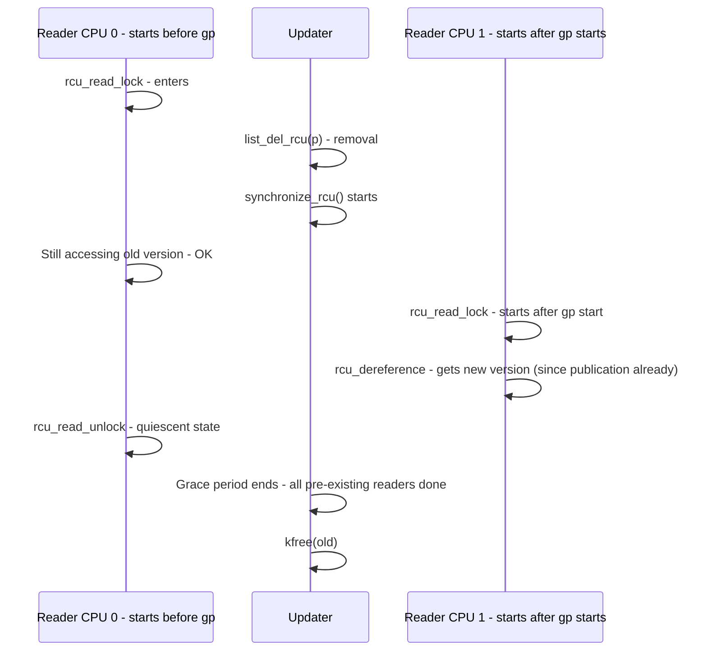

# RCU — Read-Copy-Update

## Overview

**RCU** is a synchronization mechanism specialized for **read-mostly** workloads — the Linux kernel's most common case (routing tables, file descriptors, dentry cache). Idea: readers proceed without atomic ops, locks, or memory barriers (on most arches); updaters copy the data, publish new version via atomic pointer swap, then wait for a **grace period** (all pre-existing readers finished) before reclaiming old version.

It gives **near-zero reader overhead**, linear scalability for readers, and allows readers and updaters to run concurrently, even readers inside the same grace period see either old or new version — never torn.

> For general concurrency, see [Concurrency Overview](./overview.md), [Lock-free](./lock-free.md), [Memory Barriers](../os/synchronization/memory-barriers.md), [Kernel Modules](../os/kernel/modules.md) for how RCU is used in modules.

## Core API — The Publish-Subscribe Pattern

From kernel.org What is RCU? [kernel.org]:

```c
// Reader side - extremely fast, no atomic RMW
rcu_read_lock();
p = rcu_dereference(gbl_ptr);
do_something(p->field);
rcu_read_unlock();

// Updater side - uses lock to coordinate among updaters
spin_lock(&mutex);
old = rcu_dereference_protected(gbl_ptr, lockdep_is_held(&mutex));
new = kmalloc(...); *new = *old; new->a = new_val;
rcu_assign_pointer(gbl_ptr, new); // store-release + barrier
spin_unlock(&mutex);
synchronize_rcu(); // wait for grace period
kfree(old); // or call_rcu for async
```

Primitives:

| Primitive | Role | Barrier semantics |
|-----------|------|-------------------|
| `rcu_read_lock()` / `rcu_read_unlock()` | Mark read-side critical section; on non-preemptible RCU, disables preemption (no memory barrier on most archs) | Compiler barrier, acts as acquire/release for RCU |
| `rcu_dereference(p)` | Fetch RCU pointer safely, with address dependency handling + memory barrier on Alpha; prevents compiler reordering of deref | volatile load + `READ_ONCE` semantics |
| `rcu_assign_pointer(p, v)` | Publish new pointer, store-release + barrier to ensure prior writes visible before pointer visible | smp_wmb() equivalent → store-release |
| `synchronize_rcu()` | Blocking wait for grace period: all pre-existing readers finished | Full memory barrier both sides |
| `call_rcu(cb)` | Async reclaim via callback after grace period | Non-blocking variant |
| `kfree_rcu(old, rcu_head)` | Almost never blocks, wrappers around call_rcu | |

Publish-subscribe guarantee: `rcu_assign_pointer` ensures readers see initialized structure, not half-written. Implemented as store-release.

## Grace Period — The Heart



Memory-barrier guarantees from Requirements docs [kernel.org Requirements]:

1. Each CPU that had RCU read-side critical section begin before `synchronize_rcu()` starts is guaranteed full memory barrier between its read-unlock and end of grace period. Without this, reader could hold reference to freed struct after `kfree`.
2. CPU that has read-side begin after grace period starts is guaranteed barrier between start of grace period and start of read-side. Without, late reader could see freed memory.

Implementation: classic RCU uses quiescent states (context switch, idle, user-mode). When each CPU has had at least one quiescent state since gp start, gp ends.

## Why RCU Scales — No Atomic Ops in Readers

Traditional `rwlock` readers do atomic RMW on lock word → cache line bouncing, 100s cycles. RCU readers:

- No atomic, just `preempt_disable()` (per-CPU counter increment) — no cache miss across CPUs.
- No memory barrier on x86_64 (only Alpha needs). On most arches `rcu_dereference()` is volatile load.
- Readers never block updaters, updaters never block readers (except via separate updater lock for write-write coordination).

Benchmark: linked-list traversal with RWLock vs RCU → RCU scales linearly to 100+ CPUs, RWLock collapses after 10.

## Patterns

### Copy + Replace

```c
struct foo *old, *new;
new = kmalloc(sizeof(*new), GFP_KERNEL);
*new = *old; // copy
new->field = new_val;
rcu_assign_pointer(gbl, new);
call_rcu(&old->rcu, reclaim);
```

Used for file descriptor tables, route caches.

### List: `list_add_rcu`, `list_del_rcu`, `list_for_each_entry_rcu`

Kernel's `<linux/rculist.h>` provides RCU-aware list primitives with proper barriers.

### Deferred Free

If updater cannot block (e.g., in interrupt), use `call_rcu()` or `kfree_rcu()` — callback invoked after grace period in softirq context.

## Flavors

| Flavor | Read lock can sleep? | Can run offline? | Use case |
|--------|----------------------|------------------|----------|
| **RCU** (classic) | No (no blocking) | No | Most, fast path |
| **Sleepable RCU (SRCU)** | Yes, can sleep, can run idle/offline CPUs | Yes | SRS, per-subsystem |
| **Tasks RCU** | Special for task list | | voluntary context switches |
| **Tasks Trace RCU** | For tracing | | covers tracing critical sections |

SRCU readers slower (contains memory barriers), but can sleep. SRCU needs `smp_mb__after_srcu_read_unlock()` for full barrier if needed. From kernel docs [kernel.org checkpatch].

## Pitfalls & Checklist

From Review Checklist for RCU Patches [kernel.org checklist]:

- **Don't forget updater lock**: `rcu_assign_pointer` protects readers from updater, not updaters from each other. Still need spinlock/mutex among updaters.
- **Don't block inside RCU read-side**: classic RCU read lock must not sleep (except SRCU). No `kmalloc(GFP_KERNEL)` inside.
- **Use `rcu_dereference()` always**: never directly deref RCU pointer, else compiler may reorder or Alpha may reorder.
- **Grace period + callback barrier**: if module unload needs both grace period and callbacks done, need `synchronize_rcu()` + `rcu_barrier()`. Use workqueue to overlap latency.
- **Memory ordering on weakly ordered**: even x86 allows store-load reordering (later loads before earlier stores). Updaters need `smp_store_release` / `smb_wmb` via `rcu_assign_pointer`. Readers rely on updater side barriers.

## Toy Implementation (to understand)

Classic "TOY #1 Locking" from What is RCU docs:

```c
// Reader: lock + barrier
void rcu_read_lock(void){ spin_lock(&rcu_gp_mutex); }
void rcu_read_unlock(void){ spin_unlock(&rcu_gp_mutex); }
void synchronize_rcu(void){ spin_lock(&rcu_gp_mutex); spin_unlock(&rcu_gp_mutex); }
```

Real implementation uses per-CPU counters and quiescent state detection, no global lock.

## Interview Questions

**Q: When to use RCU vs RWLock?**
Read-mostly (e.g., 90%+ reads), reader latency critical, can't afford atomic ops. RWLock better when writes frequent or need reader-writer mutual exclusion with writer priority.

**Q: How does RCU avoid use-after-free?**
Updater removes element via `list_del_rcu`, then `synchronize_rcu` waits until all pre-existing readers have passed quiescent state (e.g., context switch). Only then free. Late readers started after removal see new version.

**Q: What is grace period?**
Time until all CPUs have had at least one quiescent state (context switch, idle, user-mode). Guarantees no reader holds reference to old version.

**Q: Why rcu_dereference needed?**
Prevents compiler reordering and on Alpha needs memory barrier (address dependency not preserved). Ensures pointer load before field access. Also documents RCU protection for sparse checker.

**Q: RCU vs hazard pointers?**
Both for lock-free reclamation. Hazard pointers have per-reader per-pointer overhead (memory barriers to publish hazard). RCU batch reclaims via grace periods, more scalable but needs OS support for quiescent detection.

## Cross-References

- [Lock-free](./lock-free.md) — ABA, hazard pointers
- [Memory Barriers](../os/synchronization/memory-barriers.md) — acquire/release, smp_mb
- [Kernel Modules](../os/kernel/modules.md) / [Tracing](../os/kernel/tracing.md) — RCU used in tracing, module unloading needs rcu_barrier
- [cgroups](../os/containers/cgroups.md) — RCU for cgroup traversal

## References

- Kernel Docs — What is RCU? Core API `rcu_assign_pointer` store-release, `rcu_dereference` volatile load, `synchronize_rcu` Examples [kernel.org v6.3][kernel docs]
- Kernel Docs — Review Checklist for RCU Patches: memory barriers on weakly ordered, `smp_store_release`, `smp_load_acquire`, grouping data into new struct, `rcu_barrier` for callbacks [kernel.org checklist]
- Kernel Docs — RCU Requirements: Grace-Period Guarantee, Publish-Subscribe, Memory-Barrier Guarantees, forward progress [Requirements doc]
- LWN — Tour Through RCU Requirements
