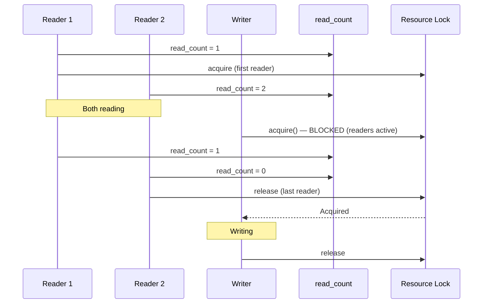
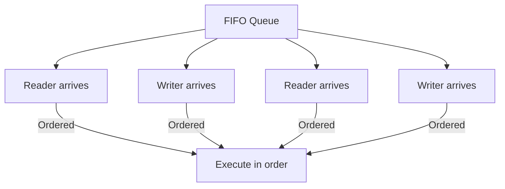
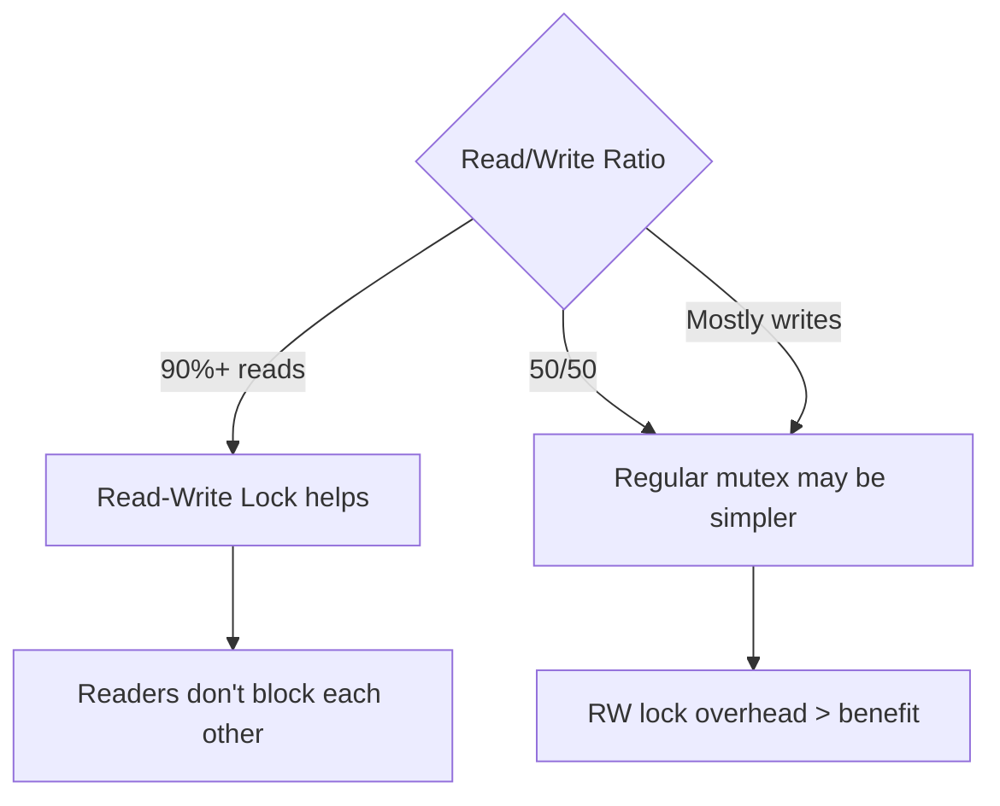

# Readers-Writers Problem

## Overview

The Readers-Writers problem is a classic synchronization challenge: multiple threads need concurrent access to a shared resource (like a database or file), but readers can access simultaneously while writers need exclusive access. This pattern appears everywhere — databases, caches, configuration stores, and any shared data structure with mixed read/write workloads.

## The Problem

```mermaid
graph TD
    R1[Reader 1] -->|Read| RES[Shared Resource]
    R2[Reader 2] -->|Read| RES
    R3[Reader 3] -->Read| RES
    W1[Writer 1] -->|Write| RES

    RULE[Rules] --> R_OK[Multiple readers OK simultaneously]
    RULE --> W_OK[Only one writer at a time]
    RULE --> NO_RW[No reader and writer simultaneously]
```

### Constraints

1. Multiple readers can read simultaneously.
2. Only one writer can write at a time.
3. No reader and writer can access simultaneously.

### Starvation Variants

| Variant | Risk | Description |
|---------|------|-------------|
| Readers-preference | Writer starvation | Readers keep arriving, writer never gets access |
| Writers-preference | Reader starvation | Writer waiting blocks all new readers |
| Fair | No starvation | First-come-first-served or ticket-based |

## Solution 1: Readers-Preference

```python
import threading

class ReadersPreference:
    def __init__(self):
        self.resource = threading.Lock()      # Protects shared data
        self.read_count_lock = threading.Lock()  # Protects read_count
        self.read_count = 0

    def start_read(self):
        self.read_count_lock.acquire()
        self.read_count += 1
        if self.read_count == 1:
            self.resource.acquire()  # First reader locks out writers
        self.read_count_lock.release()

    def end_read(self):
        self.read_count_lock.acquire()
        self.read_count -= 1
        if self.read_count == 0:
            self.resource.release()  # Last reader allows writers
        self.read_count_lock.release()

    def start_write(self):
        self.resource.acquire()  # Wait for all readers (and other writers)

    def end_write(self):
        self.resource.release()
```



**Problem**: If readers keep arriving, writer starves.

## Solution 2: Writers-Preference

```python
class WritersPreference:
    def __init__(self):
        self.resource = threading.Lock()
        self.read_count_lock = threading.Lock()
        self.write_count_lock = threading.Lock()
        self.read_count = 0
        self.write_count = 0
        self.read_try = threading.Lock()    # Controls reader entry
        self.resource = threading.Lock()     # Controls resource access

    def start_read(self):
        self.read_try.acquire()        # Wait if writer waiting
        self.read_count_lock.acquire()
        self.read_count += 1
        if self.read_count == 1:
            self.resource.acquire()
        self.read_count_lock.release()
        self.read_try.release()

    def end_read(self):
        self.read_count_lock.acquire()
        self.read_count -= 1
        if self.read_count == 0:
            self.resource.release()
        self.read_count_lock.release()

    def start_write(self):
        self.write_count_lock.acquire()
        self.write_count += 1
        if self.write_count == 1:
            self.read_try.acquire()    # Block new readers
        self.write_count_lock.release()
        self.resource.acquire()        # Wait for current readers

    def end_write(self):
        self.resource.release()
        self.write_count_lock.acquire()
        self.write_count -= 1
        if self.write_count == 0:
            self.read_try.release()    # Allow readers
        self.write_count_lock.release()
```

**Problem**: If writers keep arriving, readers starve.

## Solution 3: Fair Solution (No Starvation)



Use a ticket/turn system:

```python
import threading

class FairReadWriteLock:
    def __init__(self):
        self.resource = threading.Lock()
        self.read_count_lock = threading.Lock()
        self.turnstile = threading.Lock()  # FIFO ordering
        self.read_count = 0

    def start_read(self):
        self.turnstile.acquire()       # Get in line
        self.read_count_lock.acquire()
        self.read_count += 1
        if self.read_count == 1:
            self.resource.acquire()
        self.read_count_lock.release()
        self.turnstile.release()       # Let next in line proceed

    def end_read(self):
        self.read_count_lock.acquire()
        self.read_count -= 1
        if self.read_count == 0:
            self.resource.release()
        self.read_count_lock.release()

    def start_write(self):
        self.turnstile.acquire()       # Get in line (blocks everyone behind)
        self.resource.acquire()        # Wait for resource

    def end_write(self):
        self.resource.release()
        self.turnstile.release()       # Let next in line proceed
```

## Read-Write Locks in Practice

### Go sync.RWMutex

```go
var rwmu sync.RWMutex
var data map[string]string

func read(key string) string {
    rwmu.RLock()         // Multiple readers can hold this
    defer rwmu.RUnlock()
    return data[key]
}

func write(key, value string) {
    rwmu.Lock()          // Exclusive access
    defer rwmu.Unlock()
    data[key] = value
}
```

### Java ReentrantReadWriteLock

```java
ReadWriteLock rwLock = new ReentrantReadWriteLock();

// Read access
rwLock.readLock().lock();
try {
    // Multiple threads can read simultaneously
    return data.get(key);
} finally {
    rwLock.readLock().unlock();
}

// Write access
rwLock.writeLock().lock();
try {
    // Exclusive access
    data.put(key, value);
} finally {
    rwLock.writeLock().unlock();
}
```

### Python threading.RLock vs custom

```python
import threading

class ReadWriteLock:
    """Python doesn't have a built-in RWLock, so we implement one."""
    def __init__(self):
        self._read_ready = threading.Condition(threading.Lock())
        self._readers = 0

    def read_acquire(self):
        with self._read_ready:
            self._readers += 1

    def read_release(self):
        with self._read_ready:
            self._readers -= 1
            if self._readers == 0:
                self._read_ready.notify_all()

    def write_acquire(self):
        self._read_ready.acquire()
        while self._readers > 0:
            self._read_ready.wait()

    def write_release(self):
        self._read_ready.release()
```

### C++ shared_mutex (C++17)

```cpp
#include <shared_mutex>

std::shared_mutex rw_mutex;

// Read access (shared lock)
void read() {
    std::shared_lock<std::shared_mutex> lock(rw_mutex);
    // Multiple readers allowed
}

// Write access (exclusive lock)
void write() {
    std::unique_lock<std::shared_mutex> lock(rw_mutex);
    // Exclusive access
}
```

## Performance Analysis

### When RW Locks Help



RW locks have more overhead than regular mutexes (reference counting, state tracking). They only help when reads significantly outnumber writes.

### Lock Contention Graph

```mermaid
graph LR
    subgraph Mutex[Regular Mutex]
        M1[Read] --> M2[Read] --> M3[Read] --> M4[Write]
        Note over M1,M4: Serial: 4 × T
    end
    subgraph RW[Read-Write Lock]
        R1[Read] --- R2[Read] --- R3[Read]
        R3 --> R4[Write]
        Note over R1,R4: Readers parallel: ~2T
    end
```

## Interview Questions

1. **Q: What is the readers-writers problem?**
   A: Multiple threads access a shared resource. Readers can access simultaneously, but writers need exclusive access. The challenge is synchronizing access to prevent data corruption while maximizing concurrency for readers.

2. **Q: How would you implement a read-write lock?**
   A: Use a mutex to protect a reader counter. First reader acquires the resource lock; last reader releases it. Writers acquire the resource lock directly. For fairness, add a turnstile to prevent starvation.

3. **Q: What is reader starvation vs writer starvation?**
   A: Writer starvation: readers keep arriving, writer never gets access (readers-preference). Reader starvation: writer waiting blocks all new readers (writers-preference). Fair solutions use FIFO ordering or turnstiles to prevent both.

4. **Q: When should you use a read-write lock vs a regular mutex?**
   A: When reads significantly outnumber writes (90%+ reads) and read critical sections are non-trivial. For short critical sections or write-heavy workloads, a regular mutex is simpler and may be faster due to lower overhead.

5. **Q: How does Go's sync.RWMutex work?**
   A: RWMutex allows multiple concurrent readers (RLock/RUnlock) or a single writer (Lock/Unlock). Writers are prioritized: a pending write blocks new readers. This prevents writer starvation but may cause reader starvation under write-heavy workloads.

## Common Mistakes

- Using RW locks for write-heavy workloads — overhead exceeds benefit.
- Forgetting to release the read lock — use RAII/defer.
- Not handling reader count correctly — off-by-one causes deadlock or race conditions.
- Assuming RW locks are always better — for short critical sections, a mutex is faster.
- Starvation: not considering which variant (readers-preference vs writers-preference) is appropriate.

## Summary

The readers-writers problem synchronizes concurrent access where readers can share but writers need exclusive access. Solutions range from readers-preference (simple but can starve writers) to writers-preference to fair (FIFO ordering). Read-write locks are built into most languages (Go's RWMutex, Java's ReentrantReadWriteLock, C++'s shared_mutex). Use them when reads dominate and critical sections are non-trivial.

## Cross-References

- [Producer-Consumer](./producer-consumer.md) — Related synchronization pattern
- [Lock-Free](./lock-free.md) — Wait-free data structures
- [Java Concurrency](./java.md) — Java's ReadWriteLock
- [Concurrency Overview](./overview.md) — Fundamental concepts
- [OS Readers-Writers](../os/synchronization/readers-writers.md)
- [DBMS Concurrency Control](../dbms/transactions/concurrency-control.md)
- [Storage Distributed](../storage/distributed.md)
