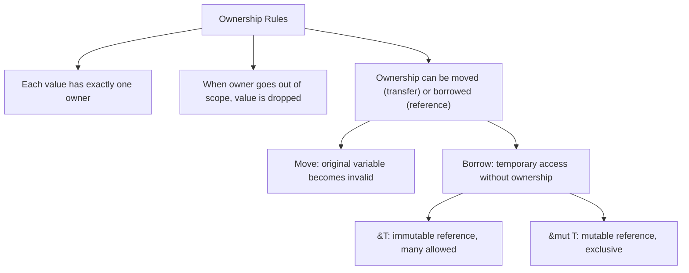
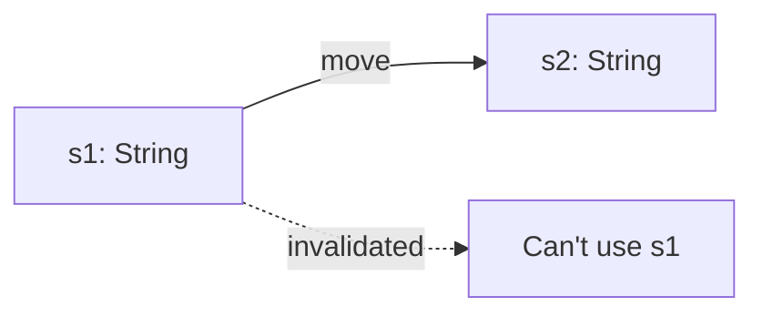
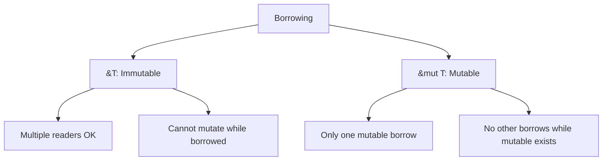
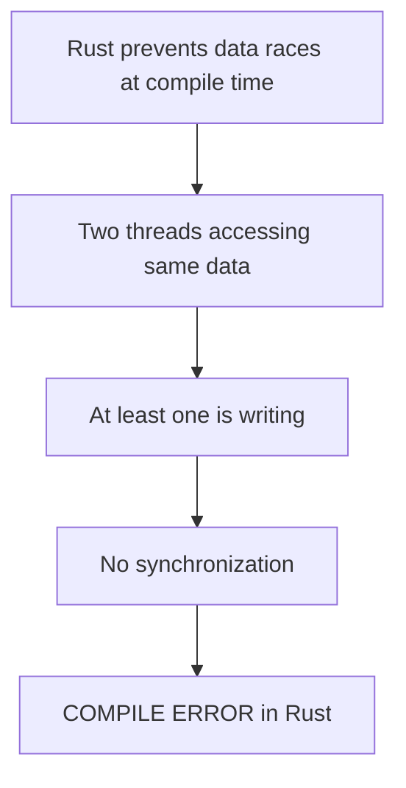
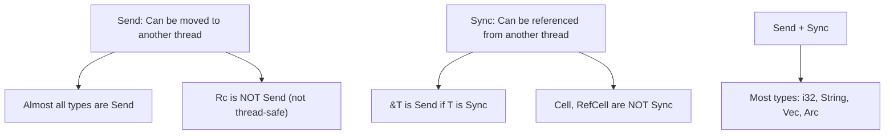
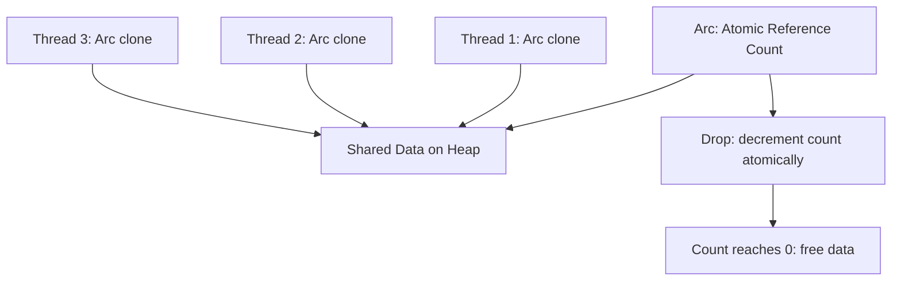
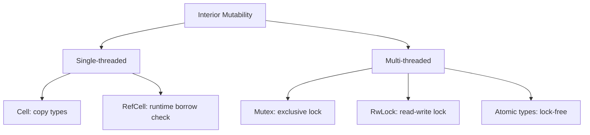
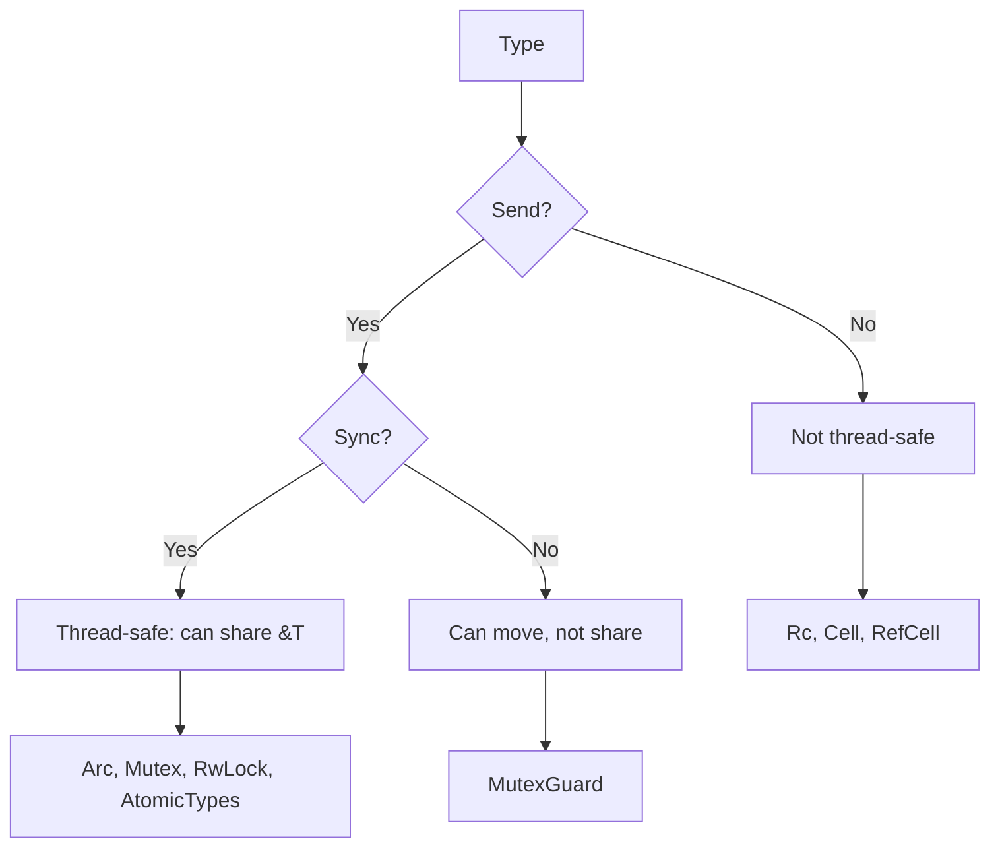

# Rust Ownership and Concurrency

## Overview

Rust's ownership system provides compile-time guarantees about memory safety and data race freedom. Unlike other languages that rely on garbage collection or runtime checks, Rust prevents data races, dangling pointers, and use-after-free at compile time through ownership, borrowing, and lifetimes. This makes Rust uniquely suited for safe concurrent programming without runtime overhead.

## The Ownership Model

### Three Rules



### Move Semantics

```rust
let s1 = String::from("hello");
let s2 = s1;        // s1 is MOVED to s2
// println!("{}", s1);  // ERROR: s1 no longer valid

let s3 = s2.clone(); // Explicit copy, both valid
```



### Borrowing

```rust
let mut s = String::from("hello");

// Immutable borrow (many allowed)
let r1 = &s;        // OK
let r2 = &s;        // OK
println!("{} {}", r1, r2);

// Mutable borrow (exclusive)
let r3 = &mut s;    // OK (no other borrows exist)
r3.push_str(" world");
```



## Fearless Concurrency

### The Data Race Prevention Rules



Rust's type system prevents data races by enforcing:
1. **Multiple readers OR one writer** (not both).
2. **References must not outlive the data they point to**.
3. **Shared mutable state requires explicit synchronization**.

### Send and Sync Traits



| Trait | Meaning | Example |
|-------|---------|---------|
| `Send` | Can be transferred to another thread | Most types (not `Rc`) |
| `Sync` | Can be shared between threads via `&T` | Immutable types (not `Cell`) |

## Shared State Concurrency

### Arc (Atomic Reference Counting)

```rust
use std::sync::Arc;
use std::thread;

let data = Arc::new(vec![1, 2, 3]);

let handles: Vec<_> = (0..5).map(|i| {
    let data = Arc::clone(&data);  // Clone the Arc, not the data
    thread::spawn(move || {
        println!("Thread {} sees {:?}", i, data);
    })
}).collect();

for h in handles {
    h.join().unwrap();
}
```



### Mutex

```rust
use std::sync::{Arc, Mutex};
use std::thread;

let counter = Arc::new(Mutex::new(0));
let mut handles = vec![];

for _ in 0..10 {
    let counter = Arc::clone(&counter);
    handles.push(thread::spawn(move || {
        let mut num = counter.lock().unwrap();
        *num += 1;
        // Lock is automatically released when `num` goes out of scope
    }));
}

for h in handles {
    h.join().unwrap();
}
println!("Result: {}", *counter.lock().unwrap());
```

### RwLock

```rust
use std::sync::{Arc, RwLock};

let data = Arc::new(RwLock::new(vec![1, 2, 3]));

// Multiple readers
let data_clone = Arc::clone(&data);
let reader = thread::spawn(move || {
    let values = data_clone.read().unwrap();  // Shared read lock
    println!("{:?}", values);
});

// Single writer
let mut values = data.write().unwrap();  // Exclusive write lock
values.push(4);
```

## Channels

```rust
use std::sync::mpsc;
use std::thread;

let (tx, rx) = mpsc::channel();

// Multiple producers
for i in 0..5 {
    let tx = tx.clone();
    thread::spawn(move || {
        tx.send(format!("Message {}", i)).unwrap();
    });
}

drop(tx);  // Close channel when all senders are done

// Single consumer
for received in rx {
    println!("Got: {}", received);
}
```

## Atomic Types

```rust
use std::sync::atomic::{AtomicUsize, Ordering};
use std::sync::Arc;
use std::thread;

let counter = Arc::new(AtomicUsize::new(0));
let mut handles = vec![];

for _ in 0..10 {
    let counter = Arc::clone(&counter);
    handles.push(thread::spawn(move || {
        counter.fetch_add(1, Ordering::Relaxed);
    }));
}

for h in handles { h.join().unwrap(); }
println!("Count: {}", counter.load(Ordering::Relaxed));
```

## Interior Mutability

### Cell and RefCell (Single-threaded)

```rust
use std::cell::RefCell;

let data = RefCell::new(vec![1, 2, 3]);

// Borrow mutably at runtime (panics if already borrowed)
data.borrow_mut().push(4);

// Borrow immutably
println!("{:?}", data.borrow());
```

### Mutex and RwLock (Multi-threaded)

```rust
use std::sync::Mutex;

// Mutex provides interior mutability for multi-threaded contexts
let data = Mutex::new(vec![1, 2, 3]);
data.lock().unwrap().push(4);
```



## Thread Safety Matrix



## Async Rust

```rust
use tokio;

#[tokio::main]
async fn main() {
    let handle = tokio::spawn(async {
        // Async work
        fetch_data().await
    });

    let result = handle.await.unwrap();
}
```

Rust async tasks are also bound by Send/Sync:
- `tokio::spawn` requires the future to be `Send`.
- This prevents accidentally sharing non-thread-safe types across await points.

## Interview Questions

1. **Q: How does Rust prevent data races at compile time?**
   A: Rust's ownership system enforces: (1) either multiple immutable references OR one mutable reference, never both; (2) references must not outlive the data; (3) shared mutable state requires explicit synchronization (Mutex, Arc). These rules are checked at compile time, making data races impossible in safe Rust.

2. **Q: What are Send and Sync traits?**
   A: Send means a type can be transferred to another thread. Sync means &T can be shared between threads. Most types are Send + Sync. Rc is not Send (not atomic). Cell/RefCell are not Sync (not thread-safe). Arc + Mutex are both Send and Sync.

3. **Q: What is the difference between Rc and Arc?**
   A: Rc (Reference Counting) is single-threaded, non-atomic. Arc (Atomic Reference Counting) is multi-threaded, uses atomic operations for the reference count. Arc is slightly slower due to atomic operations but is thread-safe. Use Arc when sharing data across threads.

4. **Q: How does Rust's Mutex differ from other languages?**
   A: Rust's Mutex "guards" the data — you can only access the data through the MutexGuard. The lock is released when the guard is dropped (RAII). This prevents forgetting to unlock. The compiler also prevents accessing the data without holding the lock.

5. **Q: What is interior mutability in Rust?**
   A: Interior mutability allows mutation through a shared reference (&T). Cell and RefCell provide this for single-threaded code (runtime borrow checking). Mutex and RwLock provide it for multi-threaded code. It's the escape hatch from Rust's "one mutable OR many immutable" rule.

## Common Mistakes

- Using Rc instead of Arc for multi-threaded code — compile error.
- Forgetting that Mutex::lock() returns a Result — unwrap() or handle poisoning.
- Holding a Mutex lock across an await point — blocks the executor, use tokio::sync::Mutex instead.
- Trying to share mutable state without synchronization — compile error (this is a feature, not a bug).
- Overusing `Arc<Mutex<T>>` — consider channels for message passing instead.

## Summary

Rust's ownership system prevents data races, dangling pointers, and use-after-free at compile time. The rules are: one owner, move semantics, exclusive mutable borrows. For concurrency, Arc provides shared ownership, Mutex provides exclusive access, and channels provide message passing. Send and Sync traits mark which types are thread-safe. This enables "fearless concurrency" — concurrent code that's guaranteed to be free of data races.

## Cross-References

- [Lock-Free](./lock-free.md) — Atomic operations in Rust
- [Async/Await](./async-await.md) — Rust async with tokio
- [Go Channels](./go-channels.md) — Similar message-passing philosophy
- [Concurrency Overview](./overview.md) — Fundamental concepts
- [OS Synchronization](../os/synchronization/mutex.md)
- [Memory Barriers](../os/synchronization/memory-barriers.md)
