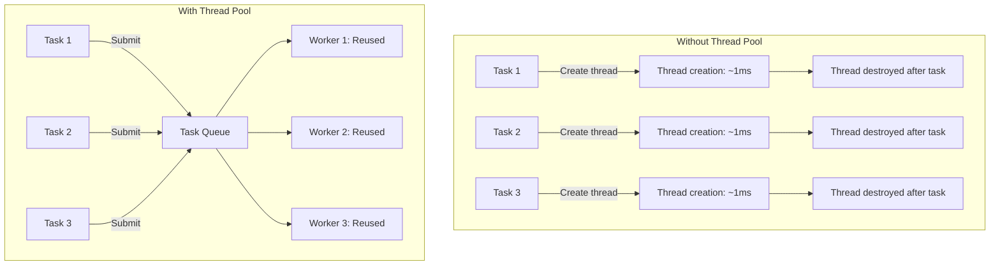
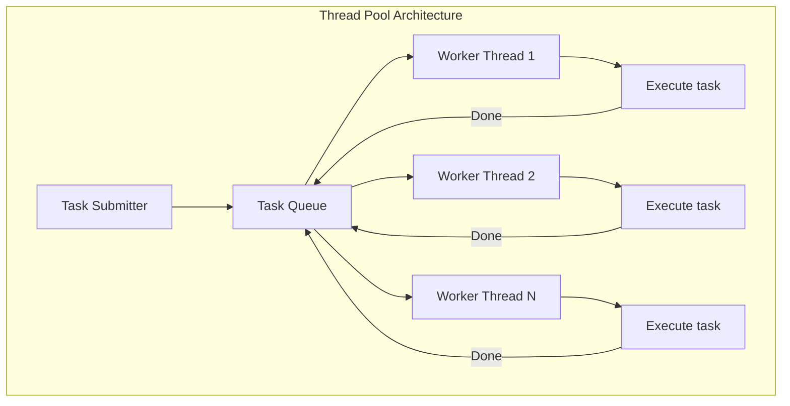
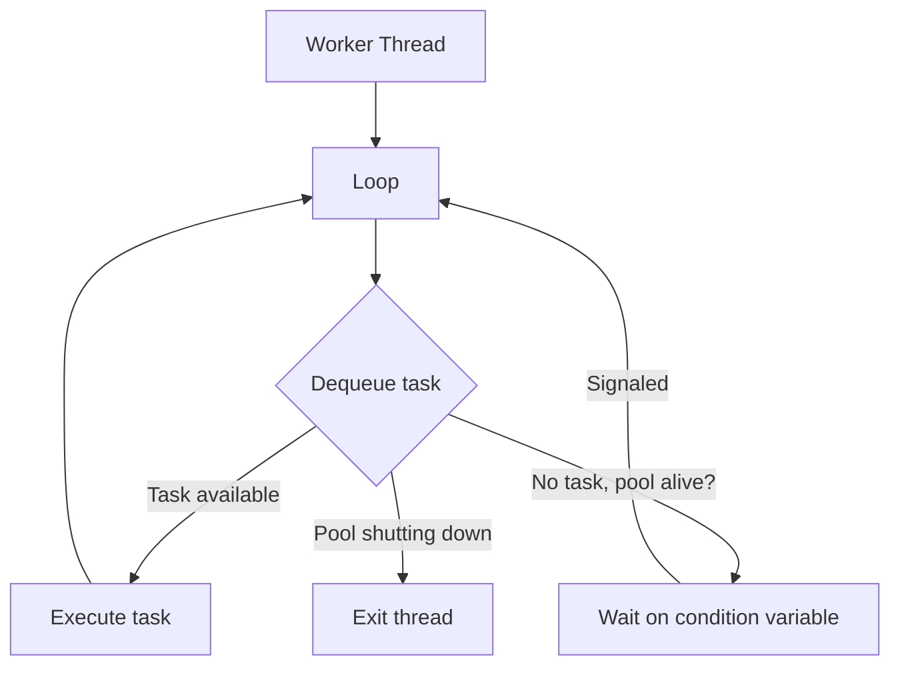
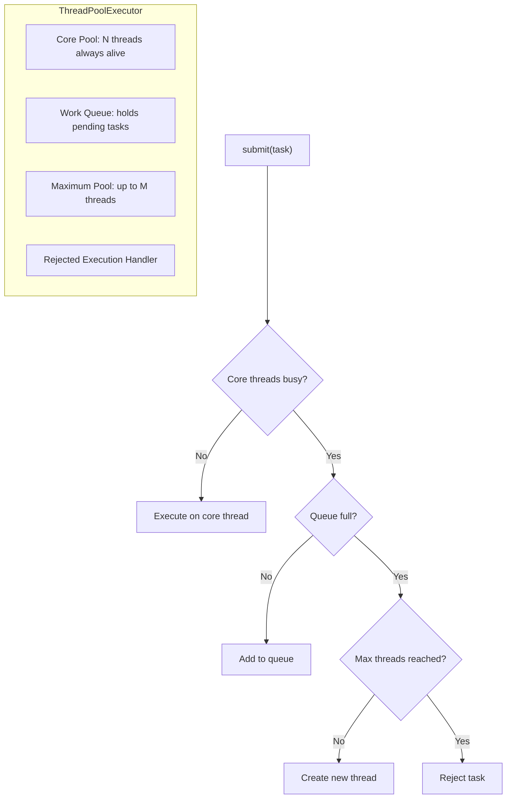
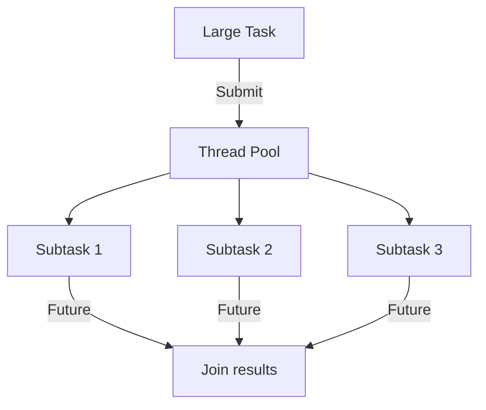
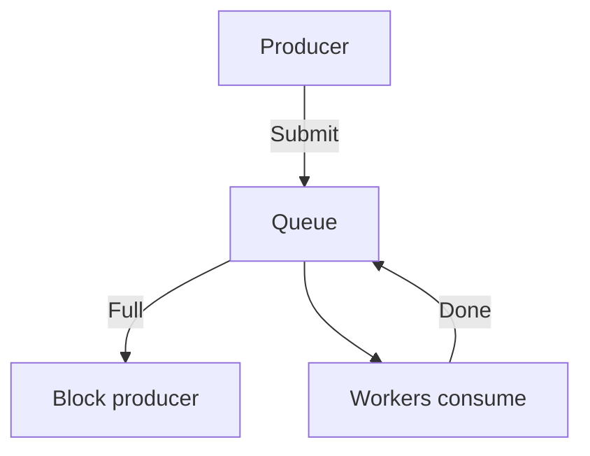
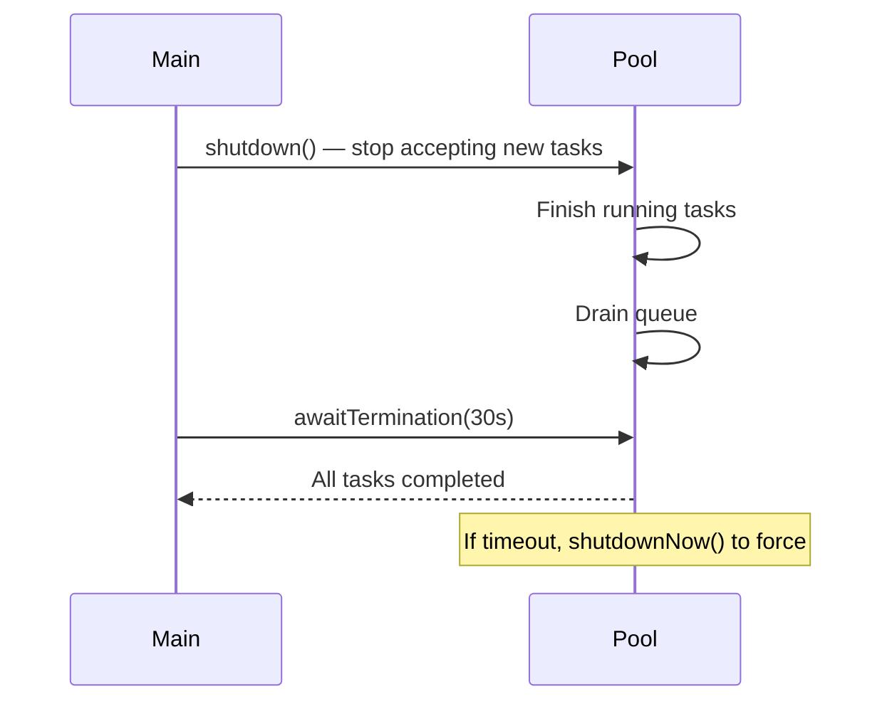

# Thread Pools

## Overview

A thread pool maintains a collection of pre-created worker threads that execute tasks from a shared queue. Instead of creating a new thread for each task (expensive), tasks are submitted to the pool and executed by available threads. Thread pools are fundamental to server design, batch processing, and any application that handles many concurrent tasks.

## Why Thread Pools?



**Benefits**:
- **Reduced latency**: No thread creation overhead per task.
- **Bounded resources**: Limits concurrent threads, preventing resource exhaustion.
- **Task queuing**: Tasks wait in queue when all threads are busy.
- **Reuse**: Threads are reused across tasks, amortizing creation cost.

## Architecture



### Worker Thread Loop



## Java ThreadPoolExecutor

### Architecture



### Key Parameters

```java
ThreadPoolExecutor(
    int corePoolSize,      // Minimum threads kept alive
    int maximumPoolSize,   // Maximum threads allowed
    long keepAliveTime,    // Idle time before excess threads die
    TimeUnit unit,
    BlockingQueue<Runnable> workQueue,  // Task queue
    ThreadFactory threadFactory,
    RejectedExecutionHandler handler    // What to do when queue+pool full
)
```

### Queue Types

| Queue Type | Behavior | Use Case |
|------------|----------|----------|
| `LinkedBlockingQueue` | Unbounded, FIFO | Default. Risk of OOM if tasks pile up. |
| `ArrayBlockingQueue` | Bounded, FIFO | Bounded memory. Tasks rejected when full. |
| `SynchronousQueue` | No storage, direct handoff | Always creates new thread (CachedThreadPool). |
| `PriorityBlockingQueue` | Priority-ordered | When task priority matters. |

### Factory Methods

```java
// Fixed pool: N threads, unbounded queue
ExecutorService fixed = Executors.newFixedThreadPool(4);

// Cached pool: creates threads as needed, reuses idle
ExecutorService cached = Executors.newCachedThreadPool();

// Single thread: sequential execution
ExecutorService single = Executors.newSingleThreadExecutor();

// Scheduled pool: delayed/periodic tasks
ScheduledExecutorService scheduled = Executors.newScheduledThreadPool(2);
```

### Task Submission

```java
// Runnable - no return value
pool.execute(() -> System.out.println("Hello"));

// Callable - returns Future
Future<String> future = pool.submit(() -> {
    Thread.sleep(1000);
    return "Result";
});
String result = future.get();  // Blocks until done

// Invoke all - wait for all
List<Callable<Integer>> tasks = Arrays.asList(
    () -> 1, () -> 2, () -> 3
);
List<Future<Integer>> results = pool.invokeAll(tasks);
```

### Rejected Execution Handlers

```java
// AbortPolicy: throws RejectedExecutionException (default)
// CallerRunsPolicy: caller thread runs the task
// DiscardPolicy: silently drops the task
// DiscardOldestPolicy: drops oldest unhandled task
```

## Python concurrent.futures

```python
from concurrent.futures import ThreadPoolExecutor, ProcessPoolExecutor, as_completed

# Thread pool (for I/O-bound tasks)
with ThreadPoolExecutor(max_workers=4) as executor:
    futures = [executor.submit(fetch_url, url) for url in urls]
    for future in as_completed(futures):
        result = future.result()  # Blocks until done

# Process pool (for CPU-bound tasks)
with ProcessPoolExecutor(max_workers=4) as executor:
    results = list(executor.map(heavy_computation, data))

# Note: Python threads are limited by GIL for CPU-bound work.
# Use ProcessPoolExecutor for CPU-bound tasks.
```

## Go Worker Pool

```go
func workerPool(jobs <-chan int, results chan<- int, numWorkers int) {
    var wg sync.WaitGroup

    for i := 0; i < numWorkers; i++ {
        wg.Add(1)
        go func(id int) {
            defer wg.Done()
            for job := range jobs {
                results <- process(job)
            }
        }(i)
    }

    wg.Wait()
    close(results)
}

// Usage
jobs := make(chan int, 100)
results := make(chan int, 100)
go workerPool(jobs, results, 4)

for _, item := range data {
    jobs <- item
}
close(jobs)

for result := range results {
    fmt.Println(result)
}
```

## Sizing Thread Pools

### CPU-Bound Tasks

```
Threads = Number of CPU cores
```

More threads than cores causes context switching overhead without benefit.

### I/O-Bound Tasks

```
Threads = Number of cores × (1 + Wait time / Service time)
```

Example: 4 cores, 50ms wait (I/O), 10ms service (CPU) → 4 × (1 + 50/10) = 24 threads.

### Little's Law

```
Threads = Arrival Rate × Response Time
```

If 100 requests/sec arrive and each takes 0.5 sec → need 50 concurrent threads.

## Advanced Patterns

### Recursive Task Decomposition



### Backpressure



When the queue is full, the submitter blocks instead of accepting more tasks. This prevents resource exhaustion.

### Graceful Shutdown



## Interview Questions

1. **Q: Why use a thread pool instead of creating threads per task?**
   A: Thread creation costs ~1ms and 1MB of stack memory. For high-throughput servers handling thousands of requests/sec, per-task thread creation is too expensive. Thread pools reuse threads, bound resource usage, and provide task queuing.

2. **Q: How would you size a thread pool?**
   A: CPU-bound: N = number of cores. I/O-bound: N = cores × (1 + wait/service). Use Little's Law: threads = arrival rate × response time. Monitor and tune based on actual throughput and latency. Too few threads = underutilization; too many = context switching overhead.

3. **Q: What happens when a thread pool's queue is full?**
   A: It depends on the RejectedExecutionHandler. Default (AbortPolicy) throws RejectedExecutionException. CallerRunsPolicy runs the task in the submitter's thread (natural backpressure). DiscardPolicy silently drops it. DiscardOldestPolicy drops the oldest queued task.

4. **Q: What is the difference between a fixed and cached thread pool?**
   A: Fixed pool has a fixed number of threads and an unbounded queue. Tasks queue up when all threads are busy. Cached pool creates threads as needed and reuses idle ones (60s timeout). Uses SynchronousQueue (direct handoff). Good for short-lived I/O tasks but can create unbounded threads.

5. **Q: How does work-stealing differ from a shared queue?**
   A: In a shared queue, all workers contend on one lock. In work-stealing, each worker has its own deque. Workers push/pop from their own bottom (no contention). When idle, they steal from others' tops. This distributes contention and naturally balances load.

## Common Mistakes

- Using unbounded queues — can cause OOM if tasks arrive faster than processed.
- Not handling rejected tasks — production code should handle RejectedExecutionException.
- Sharing a thread pool between CPU-bound and I/O-bound tasks — different sizing needs.
- Not shutting down pools — leaked threads prevent JVM/process exit.
- Submitting tasks that block indefinitely — can exhaust the pool.

## Summary

Thread pools manage pre-created worker threads that execute tasks from a queue. They reduce overhead, bound resource usage, and provide backpressure. Key design decisions: pool size, queue type, rejection handler. Java's ThreadPoolExecutor, Python's concurrent.futures, and Go's goroutine pools all implement this pattern. For interviews, understand sizing strategies, queue behavior, and the trade-offs between different pool configurations.

## Cross-References

- [Fork-Join](./fork-join.md) — Recursive task decomposition
- [Producer-Consumer](./producer-consumer.md) — Queue-based pattern
- [Async/Await](./async-await.md) — Lightweight alternative
- [Concurrency Overview](./overview.md) — Fundamental concepts
- [Cloud Lambda](../cloud/aws/lambda.md)
- [LLM Serving Systems](../llm/llm-serving/systems.md)
