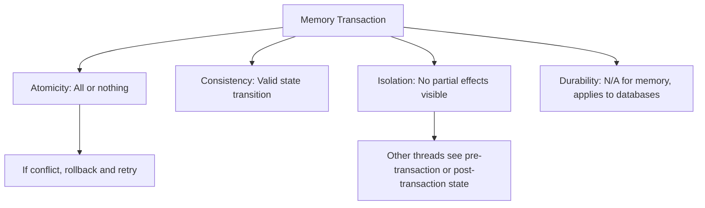
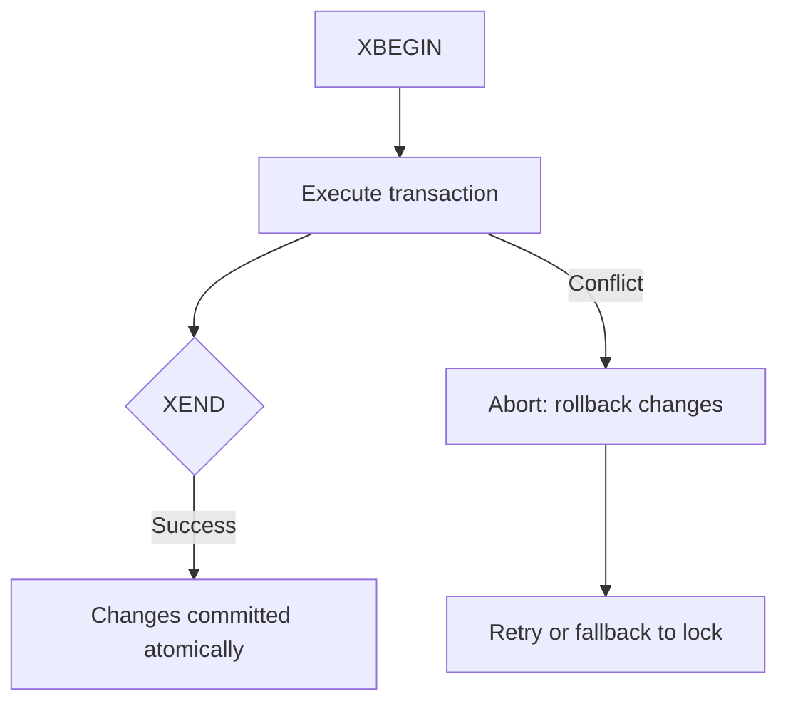
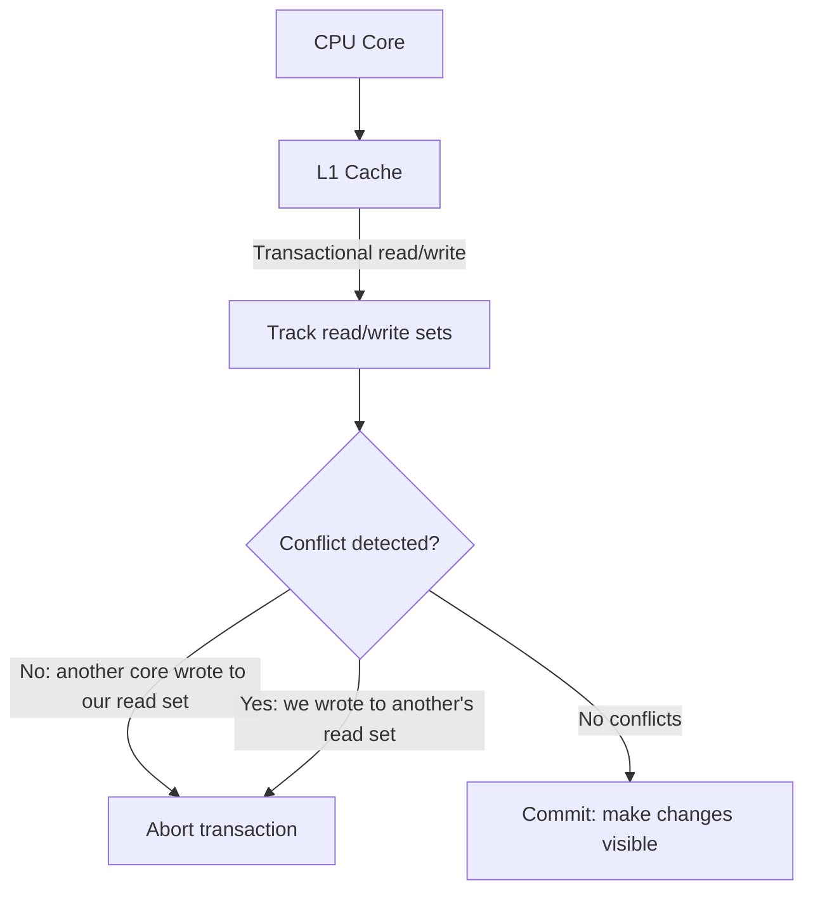
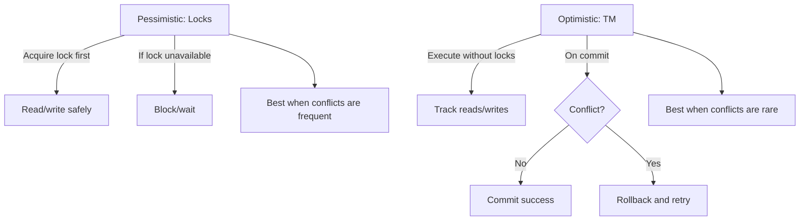
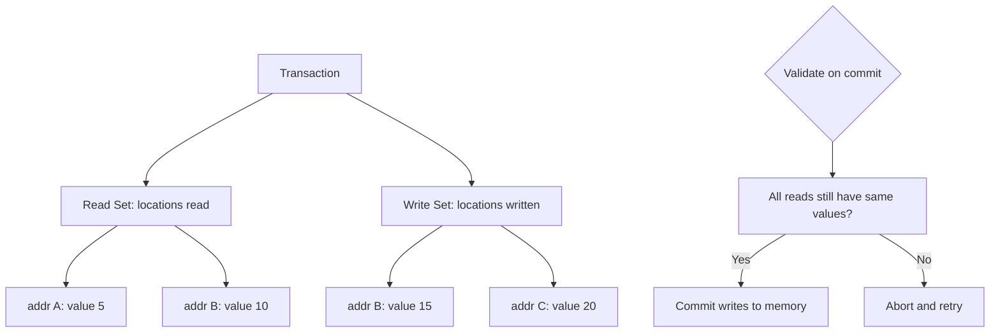
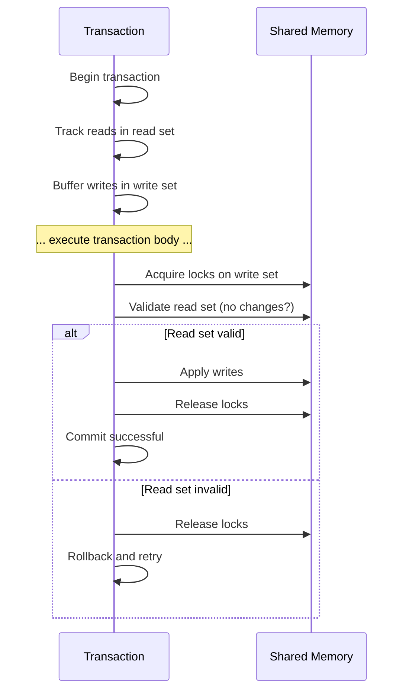
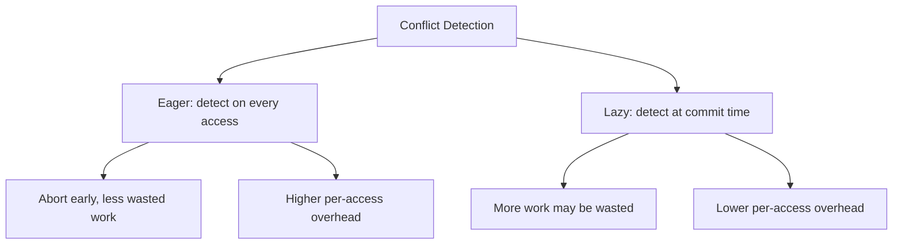

# Transactional Memory

## Overview

Transactional Memory (TM) applies database transaction concepts to shared memory operations. Instead of locks, you define a block of code as a transaction that executes atomically and in isolation. If conflicts are detected, the transaction retries. TM simplifies concurrent programming by eliminating manual lock management, deadlocks, and priority inversion.

## Core Concepts

### Lock-Based vs Transactional

```mermaid
graph TD
    subgraph Locks[Lock-Based Programming]
        L1[lock(A)]
        L2[lock(B)]
        L3[modify A and B]
        L4[unlock(B)]
        L5[unlock(A)]
        L1 --> L2 --> L3 --> L4 --> L5
        L6[Deadlock risk if another thread locks B then A!]
    end

    subgraph TM[Transactional Memory]
        T1[atomic {]
        T2[  modify A]
        T3[  modify B]
        T4[}]
        T1 --> T2 --> T3 --> T4
        T5[No deadlock, automatic conflict detection]
    end
```

### Transaction Properties (ACID for Memory)



## Hardware Transactional Memory (HTM)

### Intel TSX (Transactional Synchronization Extensions)



```c
// Intel TSX example
#include <immintrin.h>

void update_shared_data(int* shared, int value) {
    int status;
    while (1) {
        status = _xbegin();
        if (status == _XBEGIN_STARTED) {
            // Transaction body
            *shared = value;
            *shared += 10;
            _xend();  // Commit
            return;
        }
        // Transaction aborted, retry or fallback
        if ((status & _XABORT_RETRY) == 0)
            break;  // Permanent failure, use lock fallback
    }
    // Fallback: use lock
    pthread_mutex_lock(&fallback_lock);
    *shared = value;
    *shared += 10;
    pthread_mutex_unlock(&fallback_lock);
}
```

### How HTM Works



The CPU tracks which cache lines the transaction reads and writes. If another core modifies a cache line in the read set, the transaction aborts. On commit, all changes become visible atomically.

## Software Transactional Memory (STM)

### Haskell STM

```haskell
import Control.Concurrent.STM

-- STM variables
type Account = TVar Int

transfer :: Account -> Account -> Int -> STM ()
transfer from to amount = do
    balance <- readTVar from
    when (balance < amount) retry  -- Block until balance sufficient
    writeTVar from (balance - amount)
    writeTVar to . (+ amount) =<< readTVar to

-- Run transaction atomically
main :: IO ()
main = atomically $ transfer accountA accountB 100
```

### Clojure STM

```clojure
(def account-a (ref 1000))
(def account-b (ref 2000))

(defn transfer [from to amount]
  (dosync  ; STM transaction
    (let [balance @from]
      (when (>= balance amount)
        (alter from - amount)
        (alter to + amount)))))

(transfer account-a account-b 100)
```

### Retry and Choice (Haskell STM)

```haskell
-- retry: abort and block until TVar changes
-- orElse: try first, if retry, try second

readWithTimeout :: TVar (Maybe a) -> STM a
readWithTimeout tvar = do
    val <- readTVar tvar
    case val of
        Just x  -> return x
        Nothing -> retry  -- Blocks until TVar changes

-- orElse: try first transaction, if it retries, try second
tryBoth :: STM a -> STM a -> STM a
tryBoth first second = first `orElse` second
```

## Optimistic vs Pessimistic Concurrency



| Aspect | Pessimistic (Locks) | Optimistic (TM) |
|--------|-------------------|-----------------|
| Approach | Prevent conflicts | Detect and retry |
| Blocking | Yes | No (but retries) |
| Deadlock | Possible | Impossible |
| Overhead | Lock acquire/release | Read/write tracking |
| Best for | High contention | Low contention |

## Practical STM Implementation

### Read Set and Write Set



### Commit Protocol



## Conflict Detection Strategies



| Strategy | When Detected | Pros | Cons |
|----------|---------------|------|------|
| Eager | On every read/write | Early abort, less waste | Higher overhead |
| Lazy | At commit time | Lower overhead | More wasted work |

## Interview Questions

1. **Q: What is Transactional Memory?**
   A: TM applies database transaction concepts to shared memory. Code blocks are executed as atomic transactions. If conflicts are detected (another thread modified shared data), the transaction rolls back and retries. It eliminates manual lock management and deadlocks.

2. **Q: How does Hardware Transactional Memory work?**
   A: The CPU tracks which cache lines a transaction reads and writes. If another core modifies a cache line in the transaction's read set, the transaction aborts. On commit, all changes become visible atomically. Intel TSX is an example.

3. **Q: What is the difference between optimistic and pessimistic concurrency?**
   A: Pessimistic (locks) prevents conflicts by acquiring exclusive access first. Optimistic (TM) executes without locks and detects conflicts at commit time. Pessimistic is better for high contention; optimistic is better when conflicts are rare.

4. **Q: What is the ABA problem in the context of STM?**
   A: A value changes from A to B back to A. The STM sees the same value and commits, but the underlying state may have changed. STM systems handle this by tracking version numbers or using write logs that capture the full transaction state.

5. **Q: Why isn't Transactional Memory widely used?**
   A: Hardware TM (Intel TSX) had reliability issues and was disabled on some CPUs. Software TM has high overhead from tracking reads/writes. Most programmers find locks + async/await sufficient. However, TM is conceptually elegant and may see renewed interest with better hardware support.

## Common Mistakes

- Putting I/O inside transactions — can't roll back side effects (print, network call).
- Assuming TM is always faster — under high contention, lock-based can be more efficient.
- Not handling transaction aborts — must have a fallback strategy.
- Irreversible operations in transactions — file deletion, external API calls.
- Ignoring performance overhead of read/write tracking.

## Summary

Transactional Memory simplifies concurrent programming by replacing locks with atomic transactions. Hardware TM (Intel TSX) uses CPU cache coherence for conflict detection. Software TM tracks read/write sets in software. Key trade-offs: optimistic (TM) vs pessimistic (locks), eager vs lazy conflict detection. While not widely adopted in practice, TM is an important concept for understanding concurrency models.

## Cross-References

- [Lock-Free](./lock-free.md) — Alternative lock-free approach
- [Concurrency Overview](./overview.md) — Synchronization primitives
- [Java Concurrency](./java.md) — Java's concurrency utilities
- [DBMS Transactions](../dbms/transactions/acid.md)
- [DBMS Two-Phase Commit](../dbms/transactions/two-phase-commit.md)

