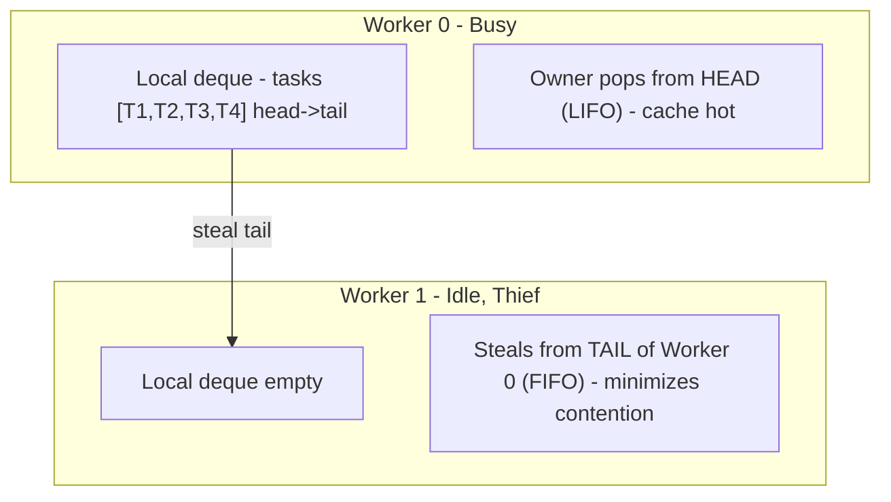
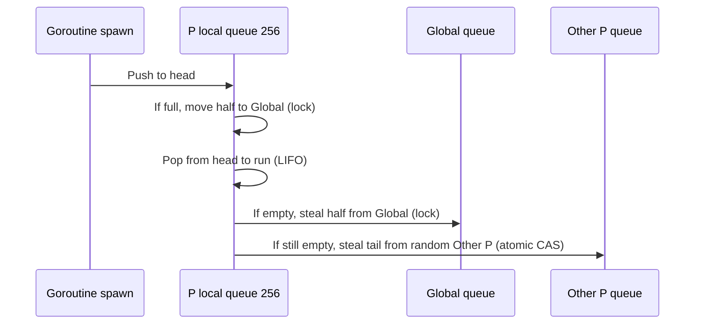

# Work-Stealing Scheduler — Go, Java ForkJoinPool, Rust Tokio

## Overview

**Work-stealing** is a dynamic load-balancing pattern where idle workers (thieves) steal tasks from busy workers (victims). It maximizes CPU utilization without central lock contention. Used in Go's goroutine scheduler (GMP), Java's ForkJoinPool, .NET TPL, Rust Tokio, and Rayon.

> Related: [Concurrency Overview](./overview.md), [Go Channels](./go-channels.md), [Thread Pools](./thread-pools.md), [Async/Await](./async-await.md), [Rust Ownership](./rust-ownership.md)

## The Pattern



Key design:

- **Owner**: LIFO from head — tasks it just pushed are hot in cache, good locality.
- **Thief**: FIFO from tail — tasks at tail are cold, oldest, less likely to be in owner's cache, reduces false sharing.
- **Deque**: lock-free double-ended queue (Chase-Lev deque with atomic top/bottom indices).

If all local deques empty, steal from **global injection queue** (Go) or **shared queue** (Tokio) or **other workers randomly**.

## Implementations

### Go Scheduler (GMP)

- **G** — goroutine (task), **M** — OS thread (machine), **P** — processor (local run queue, ~256 goroutines)
- Each P has local run queue (lock-free). Global run queue protected by lock.
- `go foo()` → push to current P's local queue. If full (256), half moved to global queue.
- Worker M: check local queue first → global queue (steal half) → steal from other P's tail.
- Preemption: sysmon thread detects long-running G (10ms) and preempts via signal.

Flow:



Why not global queue only? Global queue needs lock on every spawn — contention at scale (100k goroutines). Per-P local queues avoid lock.

### Java ForkJoinPool

Introduced Java 7 for parallel streams, recursive tasks.

- Each worker thread has deque (ForkJoinPool.WorkQueue, 4096 slots).
- `fork()` pushes to head, `join()` pops head, `steal()` from tail.
- Work-stealing when worker finishes its subtasks, steals from random victim.
- Used by `parallelStream()`, `CompletableFuture` async.

```java
class Fib extends RecursiveTask<Integer> {
  int n;
  protected Integer compute(){
    if(n<=1) return n;
    Fib f1 = new Fib(n-1); f1.fork();
    Fib f2 = new Fib(n-2);
    return f2.compute() + f1.join();
  }
}
// ForkJoinPool.commonPool() has work-stealing
```

### Rust Tokio

Tokio's multi-threaded runtime: worker threads × local queue 256 tasks (fixed ring buffer). When `tokio::spawn`, task goes to current worker's local queue; if full, half moved to shared injection queue.

```rust
#[tokio::main]
async fn main(){
    let mut handles = vec![];
    for i in 0..1000 {
        handles.push(tokio::spawn(async move { println!("Task {}", i) }));
    }
    for h in handles { let _ = h.await; }
    // Workers steal from each other, 1000 tasks distributed without central lock
}
```

Difference vs Go:

- Go: global queue lock, per-P local + sysmon preemption
- Tokio: injection queue lock-free? Shared queue with lock but half-moving reduces contention, no preemption (cooperative via `await`), fairness via LIFO slot but also randomizes to avoid starvation.

Contended scenario: 1000 very fast tasks → Tokio operations fetch_add atomic shows 1000 tasks in ms, as per Tokio docs [rustz2h.com].

## Fairness & Starvation

Work-stealing can cause **starvation** if thief always steals from same victim or owner always LIFO newest, leaving old tasks stuck.

Mitigations:

- **Random victim selection**: thief picks random other worker, not fixed.
- **Fairness check**: periodically check injection queue or global.
- **Barrier**: in Tokio example, barrier for 10 tasks must all reach — scheduler ensures fairness so no task waits forever.

Go's sysmon also detects if P has no work but G waiting in global > long time → moves.

## Global Queue vs Work-Stealing

| Aspect | Global Queue | Work-Stealing |
|--------|--------------|---------------|
| Contention | Lock on every spawn → bottleneck at 100k tasks/s | Lock-free local, only contention on steal (rare) |
| Cache locality | Poor — task may run on different core than where pushed, cold cache | Good — owner LIFO hot cache |
| Load balance | Perfect (single queue) | Near perfect with random steals |
| Complexity | Simple | Complex deque CAS |

Why Go uses both: local for fast path, global for overflow and fairness.

## Interview Questions

**Q: Explain work-stealing.**
Idle workers steal tasks from busy workers' deques. Owner pops head LIFO (cache hot), thief steals tail FIFO (minimize contention). Used in Go GMP, Java ForkJoinPool, Tokio. Avoids central lock bottleneck of global queue.

**Q: Why owner LIFO and thief FIFO?**
Owner just pushed task, likely hot in cache — LIFO keeps hot. Thief stealing old tail task is cold for owner, so less cache ping-pong, and reduces contention because owner works head, thief tail — opposite ends.

**Q: How does Go scheduler handle when local queue full?**
If local queue (256) full, move half (128) to global queue (lock). Worker when empty first tries local, then global (steal half), then random other P's tail via atomic.

**Q: Tokio vs Go scheduler difference?**
Both work-stealing, but Go has sysmon thread preempting long-running goroutines (10ms) via signals, and global queue protected by lock. Tokio cooperative (no preemption, tasks must await), injection queue shared, per-worker 256 fixed ring, no sysmon. Go optimized for goroutines many but shorter, Tokio for millions async tasks with I/O.

**Q: What is work-stealing overhead?**
Steal is atomic CAS on deque indices, rare (only when idle). Fast path no atomic across CPUs except local queue CAS. At high load, steals <5% of tasks.

## Cross-References

- [Go Scheduler (GMP)](../languages/go/scheduler.md) — P local queues, G/M/P
- [Thread Pools](./thread-pools.md) — traditional fixed vs work-stealing pool
- [Async/Await](./async-await.md) — Tokio cooperative tasks
- [Fork-Join](./fork-join.md) — Java ForkJoinPool pattern
- [Lock-free](./lock-free.md) — Chase-Lev deque CAS

## References

- Work Stealing — Wikipedia: origins Multilisp, Cilk, Java ForkJoin, .NET TPL, Rust Tokio [Wikipedia]
- Concurrency Design Patterns: Work Stealing Pattern — owner head LIFO, thief tail FIFO, Go Runtime, Java ForkJoinPool, Tokio [dev.to]
- Tokio Work-Stealing Scheduler Design Deep Dive: lock-free deques, fairness, barrier examples, why not global queue [rustz2h.com]
- Rust Async Runtime Tokio Architecture: multi-threaded task scheduler, I/O driver, timer, local run queue 256 tasks, injection queue half-move, why spawn doesn't create thread [Andrew Odendaal]
- Work Stealing and Task Scheduling Patterns in Rust: Rayon and Tokio [SoftwarePatternsLexicon]
