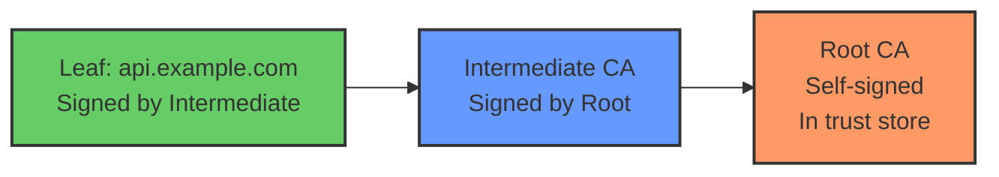

# Public Key Infrastructure (PKI)

Public Key Infrastructure is the framework of technologies, policies, and procedures that manage the lifecycle of digital certificates and public-key encryption. PKI is what makes TLS work in practice—it provides the trust model that allows a browser to verify that it is genuinely connecting to `bank.com` and not an attacker's server.

## Components of PKI

| Component | Role |
|-----------|------|
| **Certificate Authority (CA)** | Issues and signs certificates, vouching for the identity of certificate holders |
| **Registration Authority (RA)** | Verifies the identity of certificate applicants before the CA signs |
| **Certificate Repository** | Publicly accessible directory where certificates are published and retrieved |
| **Validation Authority (VA)** | Performs real-time certificate status checks (OCSP responders) |
| **End Entity** | The entity (server, person, device) that holds a certificate |

## Certificate Authorities

CAs are the trust anchors of PKI. They come in two categories:

### Public CAs
Public CAs are trusted by default by browsers and operating systems. Their root certificates are included in trust stores (e.g., Mozilla NSS, Apple Root Store, Microsoft Root Store).

| CA | Notes |
|----|-------|
| **Let's Encrypt** | Free, automated via ACME protocol; 90-day certificates; revolutionized HTTPS adoption |
| **DigiCert** | Enterprise-focused; long validity periods; high-assurance EV certificates |
| **GlobalSign** | Long-standing CA; supports enterprise and open-source projects |
| **Sectigo (Comodo)** | Large market share; offers free certificates for open-source |

### Private CAs
Organizations operate their own internal CAs for:
- Internal services and APIs (no need for public trust)
- Device certificates for IoT fleets
- Employee/client certificates for VPN and Wi-Fi (EAP-TLS)
- Code signing for internal software

Private CAs use **self-signed root certificates** that must be manually distributed to all clients. Tools like **cfssl**, **step-ca** (smallstep), and **Vault PKI** (HashiCorp) make operating a private CA straightforward.

## X.509 Certificates

X.509 is the standard format for public key certificates, defined in RFC 5280. A certificate contains:

| Field | Description |
|-------|-------------|
| **Version** | X.509 version (v3 is current) |
| **Serial Number** | Unique identifier within the issuing CA |
| **Issuer** | Distinguished Name (DN) of the CA that signed the certificate |
| **Validity** | `notBefore` and `notAfter` timestamps |
| **Subject** | DN of the certificate holder (e.g., `CN=api.example.com`) |
| **Subject Alternative Names (SAN)** | Additional names the certificate is valid for (domains, IPs, emails) |
| **Subject Public Key Info** | The public key and algorithm |
| **Extensions** | Key usage, extended key usage, basic constraints, Authority Information Access (AIA) |
| **Signature Algorithm** | Algorithm used to sign (e.g., SHA256withRSA, ECDSA-with-SHA256) |
| **Signature Value** | The CA's digital signature over the certificate |

**Important:** Modern TLS implementations use **SAN** exclusively for hostname matching. The legacy `Common Name (CN)` field is deprecated for this purpose (RFC 6125). Always include SANs.

## Certificate Chain Validation

When a client receives a server certificate, it must validate the full chain back to a trusted root:

**Validation checks:**
1. Build the chain from the leaf to a trusted root
2. Verify each certificate's signature using the issuer's public key
3. Check all validity periods (`notBefore ≤ now ≤ `notAfter`)
4. Check revocation status of each certificate
5. Verify the leaf certificate's SAN matches the hostname
6. Check extension constraints (e.g., `Basic Constraints: CA=FALSE` on the leaf)

## Certificate Revocation

Certificates can be revoked before their expiration date (e.g., due to key compromise, CA compromise, or change of ownership). Two mechanisms exist:

### CRL (Certificate Revocation List)

- A signed list of revoked certificate serial numbers published by the CA
- Clients must download and check the CRL periodically
- **Problems:** Can grow very large; clients may use stale CRLs; no real-time guarantee
- Specified in the certificate's `CRL Distribution Points` extension

### OCSP (Online Certificate Status Protocol)

- Clients send a query to an OCSP responder to check a specific certificate's status
- Provides real-time (or near-real-time) revocation information
- **Problems:** OCSP responder availability (if down, connection fails); privacy (the CA can see which sites you're visiting)
- **OCSP Stapling:** The server periodically fetches its own OCSP response and "staples" it to the TLS handshake, eliminating the client's need to contact the OCSP responder directly

| Mechanism | Latency | Privacy | Reliability | Current Recommendation |
|-----------|---------|---------|-------------|----------------------|
| **CRL** | High (large downloads) | Good | Moderate | Fallback |
| **OCSP** | Low | Poor (CA sees requests) | Poor (single point of failure) | Not recommended standalone |
| **OCSP Stapling** | Zero (server provides it) | Good | Good | Recommended |

## Let's Encrypt and ACME

**Let's Encrypt** is a free, automated Certificate Authority that has dramatically increased HTTPS adoption worldwide. It issues certificates via the **ACME (Automated Certificate Management Environment)** protocol (RFC 8555).

### ACME Workflow

1. **Account registration:** Client creates an account with the ACME server and proves control of an email address
2. **Order creation:** Client requests a certificate for a specific domain
3. **Challenge:** ACME server issues a challenge to prove domain ownership:
   - **HTTP-01:** Place a specific file at `/.well-known/acme-challenge/<token>` on the web server
   - **DNS-01:** Add a specific TXT record to the domain's DNS
4. **Validation:** ACME server verifies the challenge was satisfied
5. **Issuance:** Certificate is issued and can be downloaded
6. **Renewal:** Automated before expiration (certificates are valid for 90 days)

### Let's Encrypt Key Properties

| Property | Value |
|----------|-------|
| **Validity period** | 90 days (encourages automation) |
| **Certificate types** | DV (Domain Validated) only |
| **Rate limits** | 50 certificates per domain per week |
| **Cost** | Free |
| **Automation** | Certbot, acme.sh, Caddy (built-in), Traefik |

## References

- RFC 5280 — Internet X.509 Public Key Infrastructure Certificate and CRL Profile
- RFC 6960 — Online Certificate Status Protocol (OCSP)
- RFC 8555 — ACME Protocol
- RFC 6066 — TLS Extensions (OCSP stapling)
- NIST SP 800-63 — Digital Identity Guidelines
- OWASP Transport Layer Security Cheat Sheet

## Interview Questions

1. **What is PKI? What problem does it solve?**
2. **Explain the difference between a root CA and an intermediate CA. Why do intermediates exist?**
3. **What fields does an X.509 certificate contain? Which are most important for TLS?**
4. **What is the difference between CRL and OCSP? What are the trade-offs?**
5. **What is OCSP stapling? Why is it better than plain OCSP?**
6. **How does Let's Encrypt's ACME protocol work? What challenges does it use?**
7. **Why does Let's Encrypt issue certificates with only 90-day validity?**
8. **What is a self-signed certificate? When is it appropriate to use one?**
9. **How would you implement a private CA for an internal microservices architecture?**
10. **What happens if a root CA is compromised? What is the recovery process?**
