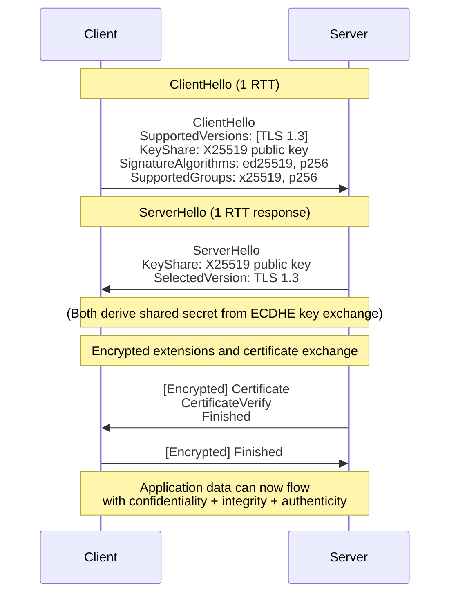
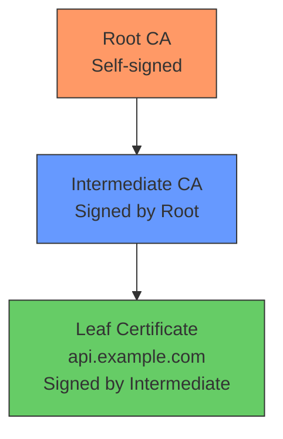

# TLS (Transport Layer Security)

TLS is the most widely deployed cryptographic protocol in the world. Every HTTPS connection, secure email transfer (SMTPS, IMAPS), and many API calls depend on TLS to provide confidentiality, integrity, and authenticity for data in transit. Understanding TLS is essential for any software engineer working with networked systems.

## TLS 1.2 vs TLS 1.3

TLS 1.3 (RFC 8446, 2018) is a major overhaul that simplifies the protocol, improves security, and reduces latency. As of 2024, TLS 1.2 and 1.3 are the only versions that should be used in production. TLS 1.0 and 1.1 are deprecated (RFC 8996). SSLv3 is catastrophically broken (POODLE attack).

| Feature | TLS 1.2 (RFC 5246) | TLS 1.3 (RFC 8446) |
|---------|-------------------|-------------------|
| **Handshake RTTs** | 2 RTT | 1 RTT (0-RTT for resumption) |
| **Cipher suites** | Separates key exchange, auth, encryption, MAC | Bundled; only AEAD ciphers |
| **Key exchange** | RSA or (EC)DHE | Ephemeral only (ECDHE, DHE) |
| **Forward secrecy** | Optional (only with DHE/ECDHE) | **Mandatory** |
| **RSA key exchange** | Allowed (no forward secrecy) | **Removed** |
| **Hash algorithms** | SHA-1 allowed for signatures (insecure) | SHA-256 minimum |
| **Legacy algorithms** | CBC, RC4, 3DES | Removed all non-AEAD |
| **0-RTT resumption** | No (session IDs/tickets for session resumption) | Yes (with replay protection concerns) |

### Key improvement: Forward secrecy is mandatory in TLS 1.3

In TLS 1.2, many deployments used RSA key exchange, meaning the server's static RSA key was used to encrypt the premaster secret. If that private key was later compromised, an attacker could decrypt all captured past traffic. TLS 1.3 eliminates this by mandating ephemeral key exchange (ECDHE), so each session uses unique key material that cannot be retroactively decrypted.

## TLS 1.3 Handshake

The TLS 1.3 handshake achieves a full key exchange in a single round trip:

**Steps explained:**
1. **ClientHello:** Client sends supported version, supported cipher suites, and its ECDHE key share (the public key for X25519). It also includes a guess at which group the server will use, so the server can respond immediately.
2. **ServerHello:** Server selects a cipher suite, sends its ECDHE key share. At this point, **both sides can derive the shared secret** and start encrypting.
3. **Server sends encrypted data:** Certificate, CertificateVerify (proves possession of the private key), and Finished (proves the handshake wasn't tampered with).
4. **Client sends encrypted data:** Finished message. Connection is now established.

**1-RTT achievement:** The server doesn't need to wait for the client's key share in a second flight because the client includes it in the first message. This halves the handshake latency compared to TLS 1.2.

## Certificate Chain Validation

When a client connects to `api.example.com`, the server presents a certificate. The client must validate the full chain:

1. **Leaf certificate** — Contains the server's public key and the domain name (`api.example.com`). Signed by an intermediate CA.
2. **Intermediate CA** — Bridges trust between the root and the leaf. Often there are multiple intermediates.
3. **Root CA** — Self-signed, trusted by the client's operating system or browser trust store.

**Validation checks performed:**
- The certificate chain is complete and unbroken (each certificate is signed by the next)
- Every certificate in the chain is within its validity period (`notBefore` ≤ now ≤ `notAfter`)
- The leaf certificate's subject name or Subject Alternative Names (SAN) match the hostname
- No certificate has been revoked (via OCSP or CRL)
- The leaf certificate's purpose/extended key usage allows server authentication
- All signatures are cryptographically valid

## Forward Secrecy (DHE/ECDHE)

Forward secrecy (also called perfect forward secrecy, PFS) ensures that compromising a long-term private key does not compromise past session keys. This is achieved by using **ephemeral** (temporary) key pairs for each session.

| Key Exchange | Forward Secrecy? | Notes |
|-------------|-----------------|-------|
| RSA | No | Static key encrypts the premaster secret |
| DHE | Yes | Classic Diffie-Hellman with ephemeral parameters |
| ECDHE | Yes | Elliptic curve variant; faster and smaller keys |

In TLS 1.3, only ECDHE and DHE are allowed, making forward secrecy mandatory.

## Cipher Suites

### TLS 1.3 Cipher Suites

TLS 1.3 simplified cipher suites dramatically by bundling the key agreement, authentication, and encryption into a single identifier:

| Cipher Suite | KEX | Auth | AEAD | Hash |
|-------------|-----|------|------|------|
| `TLS_AES_128_GCM_SHA256` | ECDHE | Certificate | AES-128-GCM | SHA-256 |
| `TLS_AES_256_GCM_SHA384` | ECDHE | Certificate | AES-256-GCM | SHA-384 |
| `TLS_CHACHA20_POLY1305_SHA256` | ECDHE | Certificate | ChaCha20-Poly1305 | SHA-256 |

**Recommended:** `TLS_AES_128_GCM_SHA256` for general use (AES-128 is sufficient per NIST). `TLS_CHACHA20_POLY1305_SHA256` as a fallback when hardware AES acceleration is unavailable.

### TLS 1.2 Cipher Suites (avoid insecure ones)

| Cipher Suite | Secure? | Reason |
|-------------|--------|--------|
| `TLS_ECDHE_RSA_WITH_AES_128_GCM_SHA256` | Yes | ECDHE + AES-GCM |
| `TLS_ECDHE_RSA_WITH_AES_256_CBC_SHA384` | Weak | CBC mode (padding oracle risk) |
| `TLS_RSA_WITH_AES_128_CBC_SHA` | No | RSA key exchange (no PFS) |
| `TLS_RSA_WITH_RC4_128_SHA` | No | RC4 is broken |

## Certificate Authorities and PKI

The Public Key Infrastructure (PKI) is the trust framework that underpins TLS. Certificate Authorities (CAs) are trusted organizations that vouch for the identity of certificate holders. Browsers and operating systems ship with a root trust store containing hundreds of root CA certificates.

**Major CAs:** Let's Encrypt (free, automated), DigiCert, GlobalSign, Sectigo, Cloudflare.

## Mutual TLS (mTLS)

In standard TLS, only the server authenticates to the client. In **mutual TLS (mTLS)**, the client also presents a certificate, which the server validates. This is used in:

- **Service-to-service communication** in microservice architectures (e.g., Kubernetes, Istio service mesh)
- **Zero-trust networks** where every connection requires bidirectional authentication
- **Banking and financial APIs** (e.g., open banking standards like PSD2)
- **Internal API gateways** where client certificates replace API keys

## Common TLS Misconfigurations

| Misconfiguration | Risk | Fix |
|----------------|------|-----|
| **Supporting TLS 1.0/1.1** | Vulnerable to BEAST, POODLE, etc. | Disable; support only TLS 1.2+ |
| **Using weak cipher suites** (RC4, DES, export-grade) | Trivially breakable | Use only AEAD suites |
| **Missing SAN on certificates** | Chrome/Safari reject certificates with only CN | Always include Subject Alternative Names |
| **Self-signed certificates in production** | No trust; MITM possible | Use CA-signed certificates |
| **No certificate pinning** | CA compromise affects you | Implement HPKP (deprecated) or use certificate fingerprints |
| **Disabled certificate verification** | MITM vulnerability | **Never** set `verify=False` in production |
| **Long-lived certificates** | Compromised cert = long attack window | Use short-lived certs (Let's Encrypt: 90 days) |
| **No HSTS** | Protocol downgrade attack possible | Enable HTTP Strict Transport Security |
| **Mixed content** | HTTPS page loading HTTP resources | Ensure all resources use HTTPS |

## References

- RFC 8446 — TLS 1.3 specification
- RFC 5246 — TLS 1.2 specification
- RFC 8996 — Deprecating TLS 1.0 and 1.1
- NIST SP 800-52 — Guidelines for TLS
- OWASP Transport Layer Security Cheat Sheet
- Mozilla SSL Configuration Generator

## Interview Questions

1. **What is the difference between TLS 1.2 and TLS 1.3? Why is TLS 1.3 better?**
2. **Explain the TLS 1.3 handshake. How many round trips does it take?**
3. **What is forward secrecy? Why does TLS 1.3 guarantee it but TLS 1.2 does not?**
4. **How does certificate chain validation work? What checks are performed?**
5. **What is mutual TLS? When would you use it?**
6. **Why is RSA key exchange removed from TLS 1.3?**
7. **What cipher suites would you configure for a production web server?**
8. **Explain the difference between a root CA and an intermediate CA.**
9. **What is 0-RTT resumption in TLS 1.3? What security concern does it introduce?**
10. **How would you debug a TLS handshake failure? What tools would you use?**
